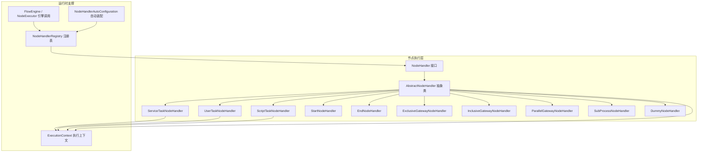
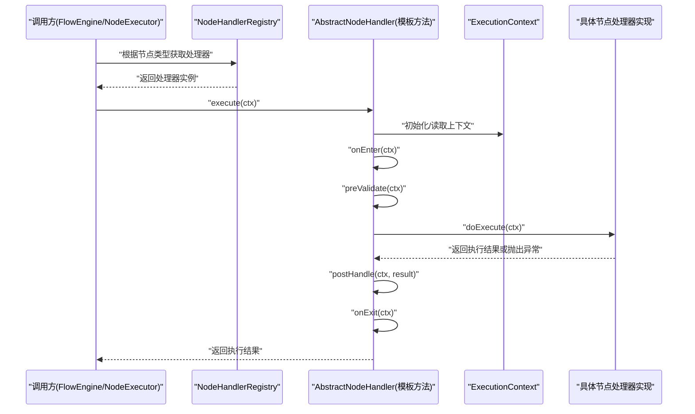
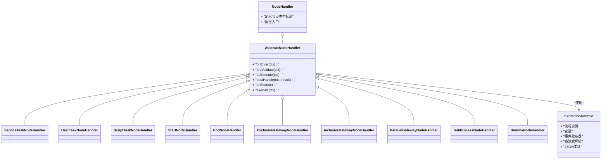
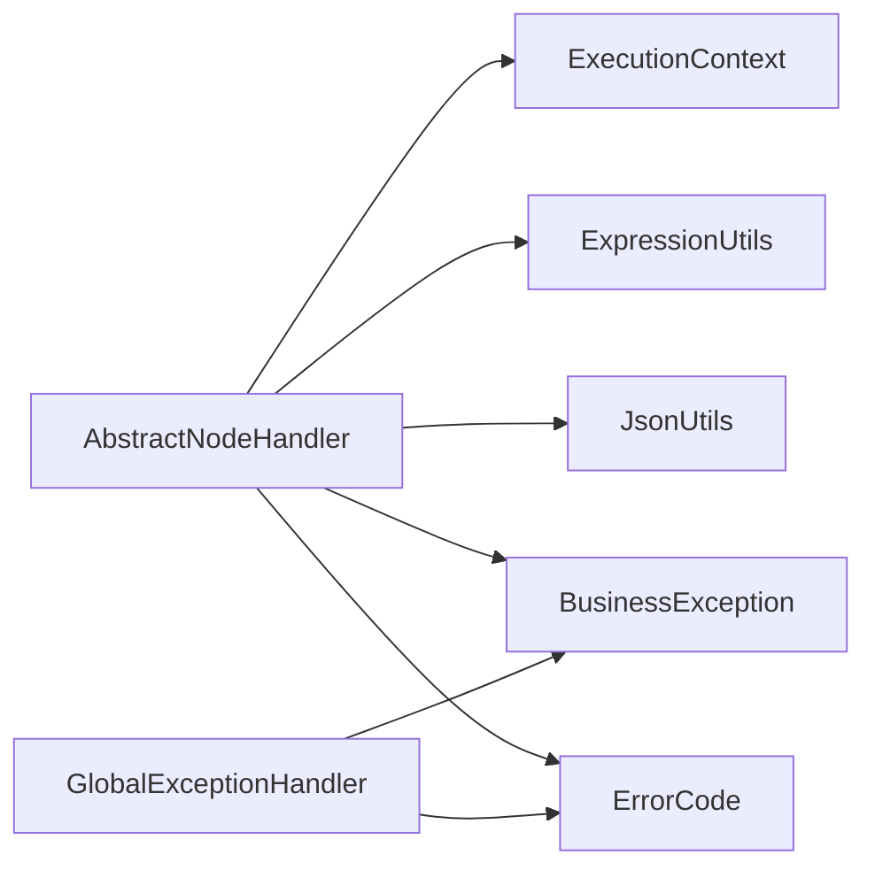

# 抽象处理器基类

<cite>
**本文引用的文件**   
- [AbstractNodeHandler.java](file://flow-engine/src/main/java/com/flow/engine/node/AbstractNodeHandler.java)
- [ExecutionContext.java](file://flow-engine/src/main/java/com/flow/engine/node/ExecutionContext.java)
- [NodeHandler.java](file://flow-engine/src/main/java/com/flow/engine/node/NodeHandler.java)
- [NodeHandlerRegistry.java](file://flow-engine/src/main/java/com/flow/engine/node/NodeHandlerRegistry.java)
- [NodeHandlerAutoConfiguration.java](file://flow-engine/src/main/java/com/flow/engine/node/NodeHandlerAutoConfiguration.java)
- [CustomDemoNodeHandler.java](file://flow-engine/src/main/java/com/flow/engine/node/impl/CustomDemoNodeHandler.java)
- [ServiceTaskNodeHandler.java](file://flow-engine/src/main/java/com/flow/engine/node/impl/ServiceTaskNodeHandler.java)
- [ScriptTaskNodeHandler.java](file://flow-engine/src/main/java/com/flow/engine/node/impl/ScriptTaskNodeHandler.java)
- [UserTaskNodeHandler.java](file://flow-engine/src/main/java/com/flow/engine/node/impl/UserTaskNodeHandler.java)
- [StartNodeHandler.java](file://flow-engine/src/main/java/com/flow/engine/node/impl/StartNodeHandler.java)
- [EndNodeHandler.java](file://flow-engine/src/main/java/com/flow/engine/node/impl/EndNodeHandler.java)
- [ExclusiveGatewayNodeHandler.java](file://flow-engine/src/main/java/com/flow/engine/node/impl/ExclusiveGatewayNodeHandler.java)
- [InclusiveGatewayNodeHandler.java](file://flow-engine/src/main/java/com/flow/engine/node/impl/InclusiveGatewayNodeHandler.java)
- [ParallelGatewayNodeHandler.java](file://flow-engine/src/main/java/com/flow/engine/node/impl/ParallelGatewayNodeHandler.java)
- [SubProcessNodeHandler.java](file://flow-engine/src/main/java/com/flow/engine/node/impl/SubProcessNodeHandler.java)
- [DummyNodeHandler.java](file://flow-engine/src/main/java/com/flow/engine/node/DummyNodeHandler.java)
- [FlowEngine.java](file://flow-engine/src/main/java/com/flow/engine/engine/FlowEngine.java)
- [NodeExecutor.java](file://flow-engine/src/main/java/com/flow/engine/engine/NodeExecutor.java)
- [GlobalExceptionHandler.java](file://flow-engine/src/main/java/com/flow/engine/common/GlobalExceptionHandler.java)
- [BusinessException.java](file://flow-engine/src/main/java/com/flow/engine/common/BusinessException.java)
- [ErrorCode.java](file://flow-engine/src/main/java/com/flow/engine/common/ErrorCode.java)
- [RequestContext.java](file://flow-engine/src/main/java/com/flow/engine/common/RequestContext.java)
- [ExpressionUtils.java](file://flow-engine/src/main/java/com/flow/engine/common/utils/ExpressionUtils.java)
- [JsonUtils.java](file://flow-engine/src/main/java/com/flow/engine/common/utils/JsonUtils.java)
</cite>

## 目录
1. [简介](#简介)
2. [项目结构](#项目结构)
3. [核心组件](#核心组件)
4. [架构总览](#架构总览)
5. [详细组件分析](#详细组件分析)
6. [依赖关系分析](#依赖关系分析)
7. [性能考量](#性能考量)
8. [故障排查指南](#故障排查指南)
9. [结论](#结论)
10. [附录](#附录)

## 简介
本文件围绕 AbstractNodeHandler 抽象类，系统化阐述其在流程引擎节点执行体系中的职责与能力。重点包括：
- 模板方法模式在节点处理器中的应用
- 执行上下文 ExecutionContext 的数据传递机制
- 通用基础设施能力（上下文管理、日志记录、异常处理）
- 继承 AbstractNodeHandler 的优势与注意事项
- 自定义节点开发示例与最佳实践
- 性能优化建议

## 项目结构
AbstractNodeHandler 位于 node 包中，是节点处理器体系的抽象基类；与之配套的有接口 NodeHandler、注册器 NodeHandlerRegistry、自动装配 NodeHandlerAutoConfiguration，以及多种内置实现（如 ServiceTaskNodeHandler、UserTaskNodeHandler 等）。执行上下文 ExecutionContext 贯穿节点执行生命周期，用于承载流程实例、变量、当前节点信息、事件发布器等。

图表来源
- [AbstractNodeHandler.java](file://flow-engine/src/main/java/com/flow/engine/node/AbstractNodeHandler.java)
- [NodeHandler.java](file://flow-engine/src/main/java/com/flow/engine/node/NodeHandler.java)
- [ExecutionContext.java](file://flow-engine/src/main/java/com/flow/engine/node/ExecutionContext.java)
- [NodeHandlerRegistry.java](file://flow-engine/src/main/java/com/flow/engine/node/NodeHandlerRegistry.java)
- [NodeHandlerAutoConfiguration.java](file://flow-engine/src/main/java/com/flow/engine/node/NodeHandlerAutoConfiguration.java)
- [ServiceTaskNodeHandler.java](file://flow-engine/src/main/java/com/flow/engine/node/impl/ServiceTaskNodeHandler.java)
- [UserTaskNodeHandler.java](file://flow-engine/src/main/java/com/flow/engine/node/impl/UserTaskNodeHandler.java)
- [ScriptTaskNodeHandler.java](file://flow-engine/src/main/java/com/flow/engine/node/impl/ScriptTaskNodeHandler.java)
- [StartNodeHandler.java](file://flow-engine/src/main/java/com/flow/engine/node/impl/StartNodeHandler.java)
- [EndNodeHandler.java](file://flow-engine/src/main/java/com/flow/engine/node/impl/EndNodeHandler.java)
- [ExclusiveGatewayNodeHandler.java](file://flow-engine/src/main/java/com/flow/engine/node/impl/ExclusiveGatewayNodeHandler.java)
- [InclusiveGatewayNodeHandler.java](file://flow-engine/src/main/java/com/flow/engine/node/impl/InclusiveGatewayNodeHandler.java)
- [ParallelGatewayNodeHandler.java](file://flow-engine/src/main/java/com/flow/engine/node/impl/ParallelGatewayNodeHandler.java)
- [SubProcessNodeHandler.java](file://flow-engine/src/main/java/com/flow/engine/node/impl/SubProcessNodeHandler.java)
- [DummyNodeHandler.java](file://flow-engine/src/main/java/com/flow/engine/node/DummyNodeHandler.java)
- [FlowEngine.java](file://flow-engine/src/main/java/com/flow/engine/engine/FlowEngine.java)
- [NodeExecutor.java](file://flow-engine/src/main/java/com/flow/engine/engine/NodeExecutor.java)

章节来源
- [AbstractNodeHandler.java](file://flow-engine/src/main/java/com/flow/engine/node/AbstractNodeHandler.java)
- [NodeHandler.java](file://flow-engine/src/main/java/com/flow/engine/node/NodeHandler.java)
- [ExecutionContext.java](file://flow-engine/src/main/java/com/flow/engine/node/ExecutionContext.java)
- [NodeHandlerRegistry.java](file://flow-engine/src/main/java/com/flow/engine/node/NodeHandlerRegistry.java)
- [NodeHandlerAutoConfiguration.java](file://flow-engine/src/main/java/com/flow/engine/node/NodeHandlerAutoConfiguration.java)
- [FlowEngine.java](file://flow-engine/src/main/java/com/flow/engine/engine/FlowEngine.java)
- [NodeExecutor.java](file://flow-engine/src/main/java/com/flow/engine/engine/NodeExecutor.java)

## 核心组件
- AbstractNodeHandler：提供节点执行的模板方法与通用能力，包括执行前/后钩子、统一异常包装、日志记录、上下文访问等。子类只需关注业务逻辑的“具体步骤”。
- ExecutionContext：承载一次节点执行所需的全部上下文数据，包括流程实例、变量、当前节点元信息、事件发布器、表达式解析工具、JSON 工具等，贯穿整个节点执行链路。
- NodeHandler：定义节点处理器契约，规范节点类型标识与执行入口。
- NodeHandlerRegistry：集中注册与查找所有节点处理器，支持按节点类型快速定位处理器。
- NodeHandlerAutoConfiguration：基于 Spring 自动发现并注册所有 NodeHandler 实现。

章节来源
- [AbstractNodeHandler.java](file://flow-engine/src/main/java/com/flow/engine/node/AbstractNodeHandler.java)
- [ExecutionContext.java](file://flow-engine/src/main/java/com/flow/engine/node/ExecutionContext.java)
- [NodeHandler.java](file://flow-engine/src/main/java/com/flow/engine/node/NodeHandler.java)
- [NodeHandlerRegistry.java](file://flow-engine/src/main/java/com/flow/engine/node/NodeHandlerRegistry.java)
- [NodeHandlerAutoConfiguration.java](file://flow-engine/src/main/java/com/flow/engine/node/NodeHandlerAutoConfiguration.java)

## 架构总览
AbstractNodeHandler 作为模板方法基类，将节点执行的生命周期标准化为若干阶段（进入、前置校验、具体执行、后置处理、退出），并在每个阶段提供可覆盖的钩子。ExecutionContext 作为唯一的数据总线，负责在各阶段间传递状态与结果。

图表来源
- [AbstractNodeHandler.java](file://flow-engine/src/main/java/com/flow/engine/node/AbstractNodeHandler.java)
- [NodeHandlerRegistry.java](file://flow-engine/src/main/java/com/flow/engine/node/NodeHandlerRegistry.java)
- [ExecutionContext.java](file://flow-engine/src/main/java/com/flow/engine/node/ExecutionContext.java)
- [FlowEngine.java](file://flow-engine/src/main/java/com/flow/engine/engine/FlowEngine.java)
- [NodeExecutor.java](file://flow-engine/src/main/java/com/flow/engine/engine/NodeExecutor.java)

## 详细组件分析

### AbstractNodeHandler 抽象类
- 角色与职责
  - 定义节点执行的模板方法，统一生命周期阶段：进入、前置校验、具体执行、后置处理、退出。
  - 封装通用能力：上下文访问、日志记录、异常包装与转换、错误码映射、重试/幂等扩展点等。
  - 提供默认空实现的可覆盖钩子，降低子类实现成本。
- 关键模板方法（概念性说明）
  - onEnter：节点进入时触发，适合做审计、指标埋点、权限预检。
  - preValidate：参数与上下文校验，失败直接短路返回。
  - doExecute：由子类实现的核心业务逻辑。
  - postHandle：对执行结果进行归一化、副作用处理（如写库、发消息）。
  - onExit：清理资源、释放锁、记录耗时等收尾工作。
- 异常与日志
  - 捕获底层异常，转换为统一的业务异常或错误码，便于上层处理与监控。
  - 在关键阶段输出结构化日志，包含节点ID、流程实例ID、耗时、关键变量摘要等。
- 上下文管理
  - 通过 ExecutionContext 读写流程变量、节点配置、事件发布器等。
  - 提供便捷方法简化常见操作（如设置变量、读取表达式、序列化/反序列化）。

章节来源
- [AbstractNodeHandler.java](file://flow-engine/src/main/java/com/flow/engine/node/AbstractNodeHandler.java)

### ExecutionContext 执行上下文
- 作用
  - 作为节点执行的“单一事实源”，承载流程实例、变量、当前节点元信息、事件发布器、表达式解析工具、JSON 工具等。
- 数据传递机制
  - 线程内共享：同一节点执行链路共享一个上下文实例，避免跨对象传参。
  - 变量作用域：支持流程级变量与节点级变量的读写隔离。
  - 不可变快照：在关键阶段可生成只读快照，保证一致性。
- 常用能力
  - 变量存取：get/set/remove 流程变量。
  - 表达式求值：结合 ExpressionUtils 动态计算条件分支。
  - JSON 处理：借助 JsonUtils 进行复杂对象序列化/反序列化。
  - 事件发布：在节点进入/完成时发布领域事件，供监听器消费。

章节来源
- [ExecutionContext.java](file://flow-engine/src/main/java/com/flow/engine/node/ExecutionContext.java)
- [ExpressionUtils.java](file://flow-engine/src/main/java/com/flow/engine/common/utils/ExpressionUtils.java)
- [JsonUtils.java](file://flow-engine/src/main/java/com/flow/engine/common/utils/JsonUtils.java)

### 模板方法模式在节点处理器中的应用
- 设计要点
  - 将不变的控制流放在 AbstractNodeHandler 中，将可变的具体步骤下沉到子类。
  - 通过钩子方法提供扩展点，使子类在不破坏整体流程的前提下增强行为。
- 典型流程
  - 进入 -> 校验 -> 执行 -> 后置 -> 退出
  - 任一阶段抛出的异常会被统一捕获并转换为标准错误响应。

图表来源
- [NodeHandler.java](file://flow-engine/src/main/java/com/flow/engine/node/NodeHandler.java)
- [AbstractNodeHandler.java](file://flow-engine/src/main/java/com/flow/engine/node/AbstractNodeHandler.java)
- [ExecutionContext.java](file://flow-engine/src/main/java/com/flow/engine/node/ExecutionContext.java)
- [ServiceTaskNodeHandler.java](file://flow-engine/src/main/java/com/flow/engine/node/impl/ServiceTaskNodeHandler.java)
- [UserTaskNodeHandler.java](file://flow-engine/src/main/java/com/flow/engine/node/impl/UserTaskNodeHandler.java)
- [ScriptTaskNodeHandler.java](file://flow-engine/src/main/java/com/flow/engine/node/impl/ScriptTaskNodeHandler.java)
- [StartNodeHandler.java](file://flow-engine/src/main/java/com/flow/engine/node/impl/StartNodeHandler.java)
- [EndNodeHandler.java](file://flow-engine/src/main/java/com/flow/engine/node/impl/EndNodeHandler.java)
- [ExclusiveGatewayNodeHandler.java](file://flow-engine/src/main/java/com/flow/engine/node/impl/ExclusiveGatewayNodeHandler.java)
- [InclusiveGatewayNodeHandler.java](file://flow-engine/src/main/java/com/flow/engine/node/impl/InclusiveGatewayNodeHandler.java)
- [ParallelGatewayNodeHandler.java](file://flow-engine/src/main/java/com/flow/engine/node/impl/ParallelGatewayNodeHandler.java)
- [SubProcessNodeHandler.java](file://flow-engine/src/main/java/com/flow/engine/node/impl/SubProcessNodeHandler.java)
- [DummyNodeHandler.java](file://flow-engine/src/main/java/com/flow/engine/node/DummyNodeHandler.java)

### 继承 AbstractNodeHandler 的优势与注意事项
- 优势
  - 减少样板代码：无需重复实现日志、异常、上下文管理等横切关注点。
  - 一致的执行语义：所有节点遵循相同的生命周期与错误模型。
  - 易于测试：可针对钩子方法进行单元测试与模拟。
- 注意事项
  - 不要在钩子中进行阻塞式 I/O，尽量保持轻量。
  - 谨慎修改 ExecutionContext 的全局变量，避免副作用污染其他节点。
  - 异常应转换为业务异常并携带明确错误码，便于上层统一处理。
  - 注意并发安全：若节点可能并行执行，需确保上下文与共享资源的线程安全。

章节来源
- [AbstractNodeHandler.java](file://flow-engine/src/main/java/com/flow/engine/node/AbstractNodeHandler.java)
- [BusinessException.java](file://flow-engine/src/main/java/com/flow/engine/common/BusinessException.java)
- [ErrorCode.java](file://flow-engine/src/main/java/com/flow/engine/common/ErrorCode.java)

### 自定义节点开发示例（以 CustomDemoNodeHandler 为例）
- 目标
  - 演示如何继承 AbstractNodeHandler，仅实现 doExecute 即可快速完成自定义节点。
- 步骤概览
  - 创建处理器类并继承 AbstractNodeHandler。
  - 在 doExecute 中读取 ExecutionContext 的变量与配置，执行业务逻辑。
  - 在 postHandle 中写入结果变量或触发后续动作。
  - 利用 onEnter/onExit 记录审计与耗时。
- 参考路径
  - [CustomDemoNodeHandler.java](file://flow-engine/src/main/java/com/flow/engine/node/impl/CustomDemoNodeHandler.java)

章节来源
- [CustomDemoNodeHandler.java](file://flow-engine/src/main/java/com/flow/engine/node/impl/CustomDemoNodeHandler.java)
- [AbstractNodeHandler.java](file://flow-engine/src/main/java/com/flow/engine/node/AbstractNodeHandler.java)
- [ExecutionContext.java](file://flow-engine/src/main/java/com/flow/engine/node/ExecutionContext.java)

### 内置节点处理器一览
- ServiceTaskNodeHandler：服务任务，常用于调用外部服务或内部方法。
- UserTaskNodeHandler：用户任务，用于人工审批或处理。
- ScriptTaskNodeHandler：脚本任务，执行脚本语言逻辑。
- StartNodeHandler / EndNodeHandler：流程开始与结束控制。
- ExclusiveGatewayNodeHandler / InclusiveGatewayNodeHandler / ParallelGatewayNodeHandler：排他/包容/并行网关，控制分支与汇聚。
- SubProcessNodeHandler：子流程，嵌套执行另一个流程定义。
- DummyNodeHandler：占位/调试用节点。

章节来源
- [ServiceTaskNodeHandler.java](file://flow-engine/src/main/java/com/flow/engine/node/impl/ServiceTaskNodeHandler.java)
- [UserTaskNodeHandler.java](file://flow-engine/src/main/java/com/flow/engine/node/impl/UserTaskNodeHandler.java)
- [ScriptTaskNodeHandler.java](file://flow-engine/src/main/java/com/flow/engine/node/impl/ScriptTaskNodeHandler.java)
- [StartNodeHandler.java](file://flow-engine/src/main/java/com/flow/engine/node/impl/StartNodeHandler.java)
- [EndNodeHandler.java](file://flow-engine/src/main/java/com/flow/engine/node/impl/EndNodeHandler.java)
- [ExclusiveGatewayNodeHandler.java](file://flow-engine/src/main/java/com/flow/engine/node/impl/ExclusiveGatewayNodeHandler.java)
- [InclusiveGatewayNodeHandler.java](file://flow-engine/src/main/java/com/flow/engine/node/impl/InclusiveGatewayNodeHandler.java)
- [ParallelGatewayNodeHandler.java](file://flow-engine/src/main/java/com/flow/engine/node/impl/ParallelGatewayNodeHandler.java)
- [SubProcessNodeHandler.java](file://flow-engine/src/main/java/com/flow/engine/node/impl/SubProcessNodeHandler.java)
- [DummyNodeHandler.java](file://flow-engine/src/main/java/com/flow/engine/node/DummyNodeHandler.java)

## 依赖关系分析
- 组件耦合
  - AbstractNodeHandler 强依赖 ExecutionContext，弱依赖日志与异常工具。
  - 各具体处理器均依赖 AbstractNodeHandler 提供的模板方法，形成稳定的继承层次。
- 外部依赖
  - 表达式解析与 JSON 工具通过 ExecutionContext 注入，避免硬编码。
  - 全局异常处理通过 GlobalExceptionHandler 统一收敛。
- 潜在循环依赖
  - 处理器与上下文之间无循环引用；处理器之间通过上下文解耦。

图表来源
- [AbstractNodeHandler.java](file://flow-engine/src/main/java/com/flow/engine/node/AbstractNodeHandler.java)
- [ExecutionContext.java](file://flow-engine/src/main/java/com/flow/engine/node/ExecutionContext.java)
- [ExpressionUtils.java](file://flow-engine/src/main/java/com/flow/engine/common/utils/ExpressionUtils.java)
- [JsonUtils.java](file://flow-engine/src/main/java/com/flow/engine/common/utils/JsonUtils.java)
- [BusinessException.java](file://flow-engine/src/main/java/com/flow/engine/common/BusinessException.java)
- [ErrorCode.java](file://flow-engine/src/main/java/com/flow/engine/common/ErrorCode.java)
- [GlobalExceptionHandler.java](file://flow-engine/src/main/java/com/flow/engine/common/GlobalExceptionHandler.java)

章节来源
- [AbstractNodeHandler.java](file://flow-engine/src/main/java/com/flow/engine/node/AbstractNodeHandler.java)
- [GlobalExceptionHandler.java](file://flow-engine/src/main/java/com/flow/engine/common/GlobalExceptionHandler.java)
- [BusinessException.java](file://flow-engine/src/main/java/com/flow/engine/common/BusinessException.java)
- [ErrorCode.java](file://flow-engine/src/main/java/com/flow/engine/common/ErrorCode.java)

## 性能考量
- 上下文开销
  - 避免在 ExecutionContext 中存放超大对象，必要时采用引用或延迟加载。
- 表达式与序列化
  - 表达式解析与 JSON 序列化/反序列化属于 CPU 密集操作，建议在批量场景下缓存解析结果或复用对象。
- 钩子方法
  - onEnter/onExit 应保持轻量，避免长耗时 I/O；I/O 放入 doExecute/postHandle。
- 并发与锁
  - 并行网关场景下，注意共享变量的可见性与原子性，必要时加锁或使用不可变数据结构。
- 日志级别
  - 生产环境合理设置日志级别，避免高频 DEBUG 日志造成 IO 瓶颈。

[本节为通用指导，不直接分析具体文件]

## 故障排查指南
- 常见问题
  - 变量未生效：检查是否在正确的阶段写入/读取 ExecutionContext 变量。
  - 表达式报错：确认表达式语法与变量名是否匹配，必要时打印上下文快照。
  - 异常未捕获：确认 doExecute 抛出的异常是否被模板方法统一包装。
- 定位手段
  - 查看 onEnter/onExit 的耗时日志，定位慢节点。
  - 借助 GlobalExceptionHandler 的统一错误码与消息，快速定位问题根因。
  - 使用 RequestContext 关联请求追踪 ID，串联上下游日志。

章节来源
- [GlobalExceptionHandler.java](file://flow-engine/src/main/java/com/flow/engine/common/GlobalExceptionHandler.java)
- [BusinessException.java](file://flow-engine/src/main/java/com/flow/engine/common/BusinessException.java)
- [ErrorCode.java](file://flow-engine/src/main/java/com/flow/engine/common/ErrorCode.java)
- [RequestContext.java](file://flow-engine/src/main/java/com/flow/engine/common/RequestContext.java)

## 结论
AbstractNodeHandler 通过模板方法模式为节点处理器提供了稳定、可扩展的执行骨架，配合 ExecutionContext 实现了清晰的数据传递与生命周期管理。继承该抽象类能显著降低自定义节点的开发成本，提升一致性与可维护性。遵循本文的最佳实践与性能建议，可在保证正确性的同时获得良好的运行效率。

[本节为总结性内容，不直接分析具体文件]

## 附录
- 相关接口与实现
  - NodeHandler：节点处理器契约
  - NodeHandlerRegistry：处理器注册与查找
  - NodeHandlerAutoConfiguration：自动装配处理器
- 参考路径
  - [NodeHandler.java](file://flow-engine/src/main/java/com/flow/engine/node/NodeHandler.java)
  - [NodeHandlerRegistry.java](file://flow-engine/src/main/java/com/flow/engine/node/NodeHandlerRegistry.java)
  - [NodeHandlerAutoConfiguration.java](file://flow-engine/src/main/java/com/flow/engine/node/NodeHandlerAutoConfiguration.java)

章节来源
- [NodeHandler.java](file://flow-engine/src/main/java/com/flow/engine/node/NodeHandler.java)
- [NodeHandlerRegistry.java](file://flow-engine/src/main/java/com/flow/engine/node/NodeHandlerRegistry.java)
- [NodeHandlerAutoConfiguration.java](file://flow-engine/src/main/java/com/flow/engine/node/NodeHandlerAutoConfiguration.java)