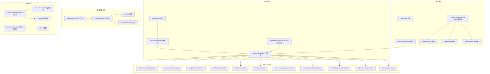
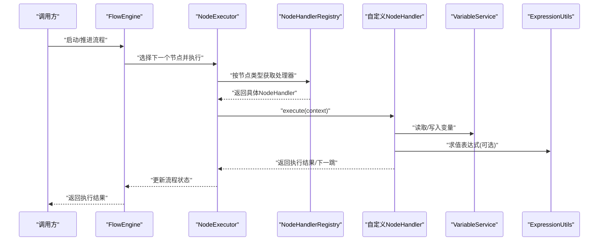
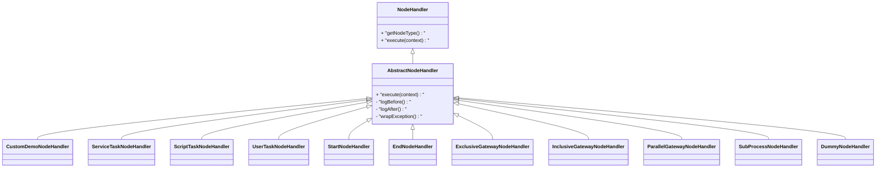
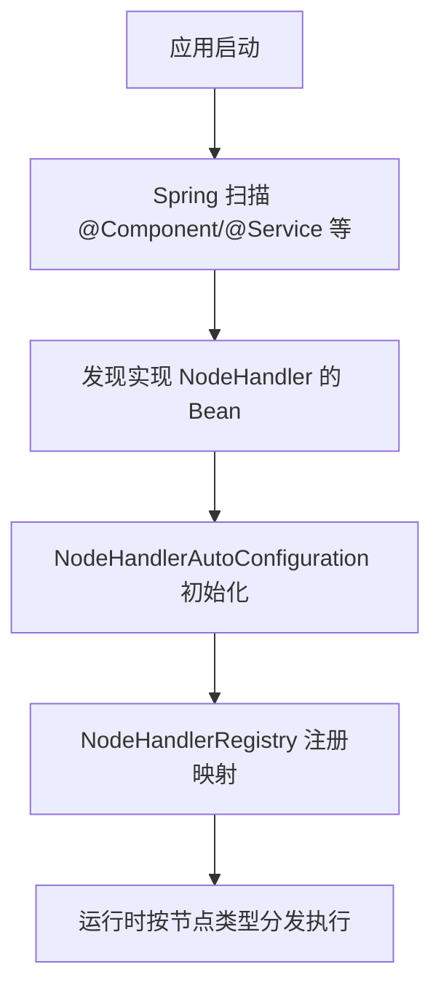
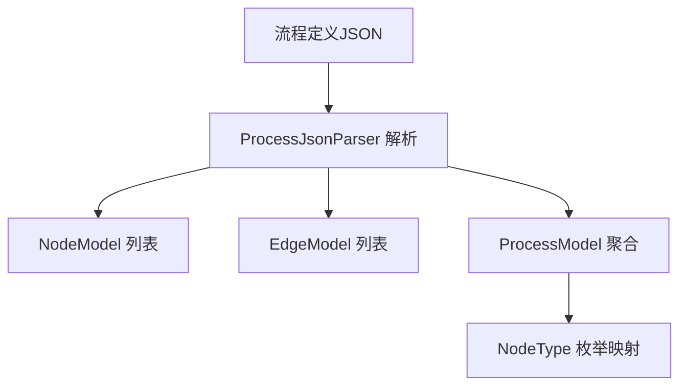
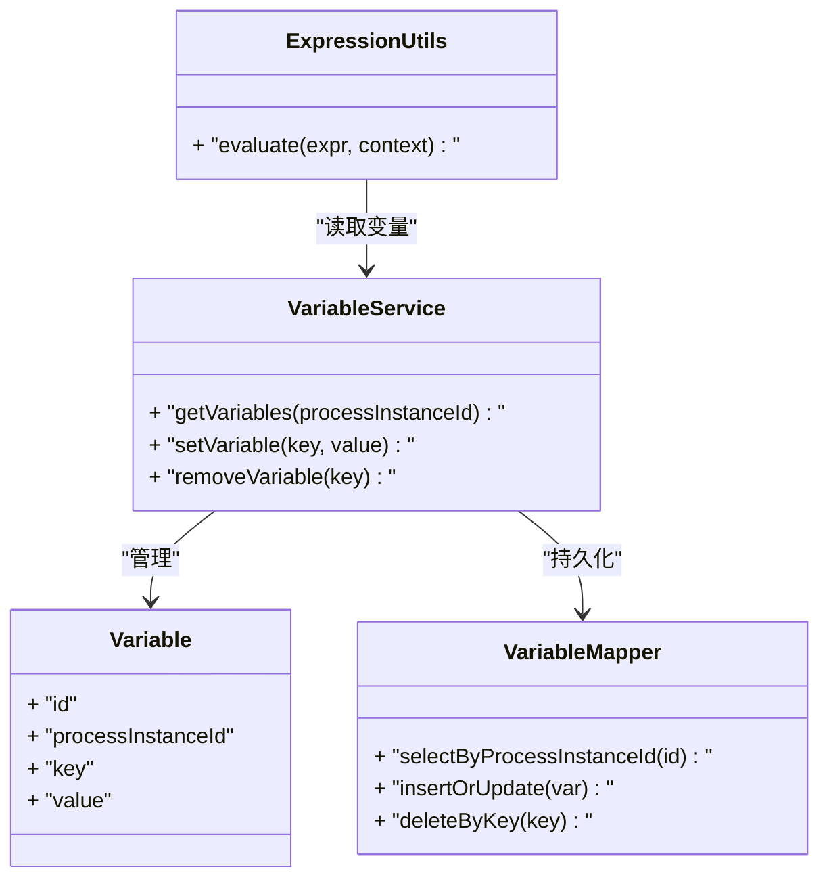
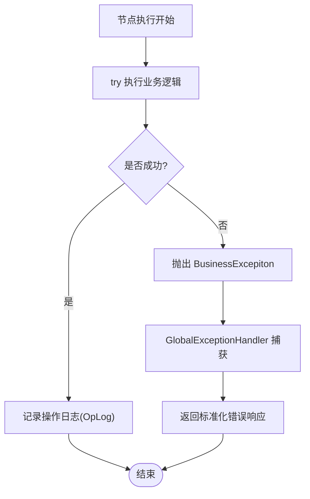
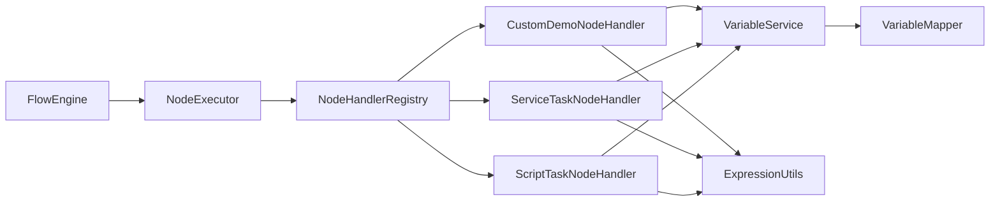

# 自定义节点开发

<cite>
**本文引用的文件**   
- [NodeHandler.java](file://flow-engine/src/main/java/com/flow/engine/node/NodeHandler.java)
- [AbstractNodeHandler.java](file://flow-engine/src/main/java/com/flow/engine/node/AbstractNodeHandler.java)
- [ExecutionContext.java](file://flow-engine/src/main/java/com/flow/engine/node/ExecutionContext.java)
- [NodeHandlerRegistry.java](file://flow-engine/src/main/java/com/flow/engine/node/NodeHandlerRegistry.java)
- [NodeHandlerAutoConfiguration.java](file://flow-engine/src/main/java/com/flow/engine/node/NodeHandlerAutoConfiguration.java)
- [CustomDemoNodeHandler.java](file://flow-engine/src/main/java/com/flow/engine/node/impl/CustomDemoNodeHandler.java)
- [ServiceTaskNodeHandler.java](file://flow-engine/src/main/java/com/flow/engine/node/impl/ServiceTaskNodeHandler.java)
- [ScriptTaskNodeHandler.java](file://flow-engine/src/main/java/com/flow/engine/node/impl/ScriptTaskNodeHandler.java)
- [UserTaskNodeHandler.java](file://flow-engine/src/main/java/com/flow/engine/node/impl/UserTaskNodeHandler.java)
- [StartNodeHandler.java](file://flow-engine/src/main/java/com/flow/engine/node/impl/StartNodeHandler.java)
- [EndNodeHandler.java](file://flow-engine/src/main/java/com/flow/engine/node/impl/EndNodeHandler.java)
- [ExclusiveGatewayNodeHandler.java](file://flow-engine/src/main/java/com/flow/engine/node/impl/ExclusiveGatewayNodeHandler.java)
- [InclusiveGatewayNodeHandler.java](file://flow-engine/src/main/java/com/flow/engine/node/impl/InclusiveGatewayNodeHandler.java)
- [ParallelGatewayNodeHandler.java](file://flow-engine/src/main/java/com/flow/engine/node/impl/ParallelGatewayNodeHandler.java)
- [SubProcessNodeHandler.java](file://flow-engine/src/main/java/com/flow/engine/node/impl/SubProcessNodeHandler.java)
- [DummyNodeHandler.java](file://flow-engine/src/main/java/com/flow/engine/node/DummyNodeHandler.java)
- [FlowEngine.java](file://flow-engine/src/main/java/com/flow/engine/engine/FlowEngine.java)
- [NodeExecutor.java](file://flow-engine/src/main/java/com/flow/engine/engine/NodeExecutor.java)
- [NodeType.java](file://flow-engine/src/main/java/com/flow/engine/common/enums/NodeType.java)
- [ProcessJsonParser.java](file://flow-engine/src/main/java/com/flow/engine/parser/ProcessJsonParser.java)
- [NodeModel.java](file://flow-engine/src/main/java/com/flow/engine/model/NodeModel.java)
- [EdgeModel.java](file://flow-engine/src/main/java/com/flow/engine/model/EdgeModel.java)
- [ProcessModel.java](file://flow-engine/src/main/java/com/flow/engine/model/ProcessModel.java)
- [Variable.java](file://flow-engine/src/main/java/com/flow/engine/entity/Variable.java)
- [VariableMapper.java](file://flow-engine/src/main/java/com/flow/engine/mapper/VariableMapper.java)
- [VariableService.java](file://flow-engine/src/main/java/com/flow/engine/service/VariableService.java)
- [ExpressionUtils.java](file://flow-engine/src/main/java/com/flow/engine/common/utils/ExpressionUtils.java)
- [GlobalExceptionHandler.java](file://flow-engine/src/main/java/com/flow/engine/common/GlobalExceptionHandler.java)
- [BusinessException.java](file://flow-engine/src/main/java/com/flow/engine/common/BusinessException.java)
- [ErrorCode.java](file://flow-engine/src/main/java/com/flow/engine/common/ErrorCode.java)
- [OperationLogAspect.java](file://flow-engine/src/main/java/com/flow/engine/aspect/OperationLogAspect.java)
- [OpLog.java](file://flow-engine/src/main/java/com/flow/engine/annotation/OpLog.java)
- [BuiltinNodeTest.java](file://flow-engine/src/test/java/com/flow/engine/node/BuiltinNodeTest.java)
- [CustomNodeExtensionTest.java](file://flow-engine/src/test/java/com/flow/engine/node/CustomNodeExtensionTest.java)
- [NodeHandlerRegistryTest.java](file://flow-engine/src/test/java/com/flow/engine/node/NodeHandlerRegistryTest.java)
- [NodeHandlerAutoRegisterTest.java](file://flow-engine/src/test/java/com/flow/engine/node/NodeHandlerAutoRegisterTest.java)
- [FlowEngineE2ETest.java](file://flow-engine/src/test/java/com/flow/engine/engine/FlowEngineE2ETest.java)
</cite>

## 目录
1. [简介](#简介)
2. [项目结构](#项目结构)
3. [核心组件](#核心组件)
4. [架构总览](#架构总览)
5. [详细组件分析](#详细组件分析)
6. [依赖关系分析](#依赖关系分析)
7. [性能考虑](#性能考虑)
8. [故障排查指南](#故障排查指南)
9. [结论](#结论)
10. [附录](#附录)

## 简介
本指南面向需要在流程引擎中扩展“自定义节点”的开发者，提供从需求分析、设计、实现、测试到部署上线的全流程指导。重点包括：
- 如何实现 NodeHandler 接口或继承 AbstractNodeHandler 抽象类
- 节点配置文件的编写规范与 JSON 结构定义
- 节点间的依赖注入与 Spring 容器集成方式
- 完整的自定义节点示例（业务逻辑、异常处理、日志记录）
- 测试策略与调试技巧
- 版本管理与向后兼容性建议

## 项目结构
本项目采用分层与按功能域组织相结合的结构。与自定义节点开发直接相关的代码集中在 flow-engine 模块的 node、engine、parser、model、service、common 等包下。

图表来源
- [NodeHandler.java](file://flow-engine/src/main/java/com/flow/engine/node/NodeHandler.java)
- [AbstractNodeHandler.java](file://flow-engine/src/main/java/com/flow/engine/node/AbstractNodeHandler.java)
- [NodeHandlerRegistry.java](file://flow-engine/src/main/java/com/flow/engine/node/NodeHandlerRegistry.java)
- [NodeHandlerAutoConfiguration.java](file://flow-engine/src/main/java/com/flow/engine/node/NodeHandlerAutoConfiguration.java)
- [CustomDemoNodeHandler.java](file://flow-engine/src/main/java/com/flow/engine/node/impl/CustomDemoNodeHandler.java)
- [ServiceTaskNodeHandler.java](file://flow-engine/src/main/java/com/flow/engine/node/impl/ServiceTaskNodeHandler.java)
- [ScriptTaskNodeHandler.java](file://flow-engine/src/main/java/com/flow/engine/node/impl/ScriptTaskNodeHandler.java)
- [UserTaskNodeHandler.java](file://flow-engine/src/main/java/com/flow/engine/node/impl/UserTaskNodeHandler.java)
- [StartNodeHandler.java](file://flow-engine/src/main/java/com/flow/engine/node/impl/StartNodeHandler.java)
- [EndNodeHandler.java](file://flow-engine/src/main/java/com/flow/engine/node/impl/EndNodeHandler.java)
- [ExclusiveGatewayNodeHandler.java](file://flow-engine/src/main/java/com/flow/engine/node/impl/ExclusiveGatewayNodeHandler.java)
- [InclusiveGatewayNodeHandler.java](file://flow-engine/src/main/java/com/flow/engine/node/impl/InclusiveGatewayNodeHandler.java)
- [ParallelGatewayNodeHandler.java](file://flow-engine/src/main/java/com/flow/engine/node/impl/ParallelGatewayNodeHandler.java)
- [SubProcessNodeHandler.java](file://flow-engine/src/main/java/com/flow/engine/node/impl/SubProcessNodeHandler.java)
- [DummyNodeHandler.java](file://flow-engine/src/main/java/com/flow/engine/node/DummyNodeHandler.java)
- [FlowEngine.java](file://flow-engine/src/main/java/com/flow/engine/engine/FlowEngine.java)
- [NodeExecutor.java](file://flow-engine/src/main/java/com/flow/engine/engine/NodeExecutor.java)
- [ProcessJsonParser.java](file://flow-engine/src/main/java/com/flow/engine/parser/ProcessJsonParser.java)
- [NodeModel.java](file://flow-engine/src/main/java/com/flow/engine/model/NodeModel.java)
- [EdgeModel.java](file://flow-engine/src/main/java/com/flow/engine/model/EdgeModel.java)
- [ProcessModel.java](file://flow-engine/src/main/java/com/flow/engine/model/ProcessModel.java)
- [Variable.java](file://flow-engine/src/main/java/com/flow/engine/entity/Variable.java)
- [VariableMapper.java](file://flow-engine/src/main/java/com/flow/engine/mapper/VariableMapper.java)
- [VariableService.java](file://flow-engine/src/main/java/com/flow/engine/service/VariableService.java)
- [ExpressionUtils.java](file://flow-engine/src/main/java/com/flow/engine/common/utils/ExpressionUtils.java)
- [GlobalExceptionHandler.java](file://flow-engine/src/main/java/com/flow/engine/common/GlobalExceptionHandler.java)
- [BusinessException.java](file://flow-engine/src/main/java/com/flow/engine/common/BusinessException.java)
- [ErrorCode.java](file://flow-engine/src/main/java/com/flow/engine/common/ErrorCode.java)
- [OperationLogAspect.java](file://flow-engine/src/main/java/com/flow/engine/aspect/OperationLogAspect.java)
- [OpLog.java](file://flow-engine/src/main/java/com/flow/engine/annotation/OpLog.java)

章节来源
- [NodeHandler.java](file://flow-engine/src/main/java/com/flow/engine/node/NodeHandler.java)
- [AbstractNodeHandler.java](file://flow-engine/src/main/java/com/flow/engine/node/AbstractNodeHandler.java)
- [NodeHandlerRegistry.java](file://flow-engine/src/main/java/com/flow/engine/node/NodeHandlerRegistry.java)
- [NodeHandlerAutoConfiguration.java](file://flow-engine/src/main/java/com/flow/engine/node/NodeHandlerAutoConfiguration.java)
- [FlowEngine.java](file://flow-engine/src/main/java/com/flow/engine/engine/FlowEngine.java)
- [NodeExecutor.java](file://flow-engine/src/main/java/com/flow/engine/engine/NodeExecutor.java)
- [ProcessJsonParser.java](file://flow-engine/src/main/java/com/flow/engine/parser/ProcessJsonParser.java)
- [NodeModel.java](file://flow-engine/src/main/java/com/flow/engine/model/NodeModel.java)
- [EdgeModel.java](file://flow-engine/src/main/java/com/flow/engine/model/EdgeModel.java)
- [ProcessModel.java](file://flow-engine/src/main/java/com/flow/engine/model/ProcessModel.java)
- [Variable.java](file://flow-engine/src/main/java/com/flow/engine/entity/Variable.java)
- [VariableMapper.java](file://flow-engine/src/main/java/com/flow/engine/mapper/VariableMapper.java)
- [VariableService.java](file://flow-engine/src/main/java/com/flow/engine/service/VariableService.java)
- [ExpressionUtils.java](file://flow-engine/src/main/java/com/flow/engine/common/utils/ExpressionUtils.java)
- [GlobalExceptionHandler.java](file://flow-engine/src/main/java/com/flow/engine/common/GlobalExceptionHandler.java)
- [BusinessException.java](file://flow-engine/src/main/java/com/flow/engine/common/BusinessException.java)
- [ErrorCode.java](file://flow-engine/src/main/java/com/flow/engine/common/ErrorCode.java)
- [OperationLogAspect.java](file://flow-engine/src/main/java/com/flow/engine/aspect/OperationLogAspect.java)
- [OpLog.java](file://flow-engine/src/main/java/com/flow/engine/annotation/OpLog.java)

## 核心组件
- NodeHandler 接口：定义节点执行的统一契约，包含节点类型标识、执行入口、上下文访问等能力。
- AbstractNodeHandler 抽象类：提供默认实现与通用能力，简化自定义节点开发。
- ExecutionContext：封装节点执行时的上下文信息，如流程实例、变量、当前节点、边信息等。
- NodeHandlerRegistry：节点处理器注册中心，负责将实现了 NodeHandler 的 Bean 按类型注册并分发。
- NodeHandlerAutoConfiguration：Spring 自动装配配置，扫描并注册所有节点处理器。
- FlowEngine / NodeExecutor：流程引擎与节点执行器，驱动流程运行并在运行时调用对应节点处理器。
- ProcessJsonParser / Model 对象：解析流程定义 JSON 为内存模型，供引擎调度使用。
- VariableService / ExpressionUtils：变量读写与表达式求值，支撑条件分支与动态行为。
- 全局异常与日志：GlobalExceptionHandler、BusinessException、ErrorCode、OperationLogAspect、OpLog 提供统一的异常与审计能力。

章节来源
- [NodeHandler.java](file://flow-engine/src/main/java/com/flow/engine/node/NodeHandler.java)
- [AbstractNodeHandler.java](file://flow-engine/src/main/java/com/flow/engine/node/AbstractNodeHandler.java)
- [ExecutionContext.java](file://flow-engine/src/main/java/com/flow/engine/node/ExecutionContext.java)
- [NodeHandlerRegistry.java](file://flow-engine/src/main/java/com/flow/engine/node/NodeHandlerRegistry.java)
- [NodeHandlerAutoConfiguration.java](file://flow-engine/src/main/java/com/flow/engine/node/NodeHandlerAutoConfiguration.java)
- [FlowEngine.java](file://flow-engine/src/main/java/com/flow/engine/engine/FlowEngine.java)
- [NodeExecutor.java](file://flow-engine/src/main/java/com/flow/engine/engine/NodeExecutor.java)
- [ProcessJsonParser.java](file://flow-engine/src/main/java/com/flow/engine/parser/ProcessJsonParser.java)
- [NodeModel.java](file://flow-engine/src/main/java/com/flow/engine/model/NodeModel.java)
- [EdgeModel.java](file://flow-engine/src/main/java/com/flow/engine/model/EdgeModel.java)
- [ProcessModel.java](file://flow-engine/src/main/java/com/flow/engine/model/ProcessModel.java)
- [VariableService.java](file://flow-engine/src/main/java/com/flow/engine/service/VariableService.java)
- [ExpressionUtils.java](file://flow-engine/src/main/java/com/flow/engine/common/utils/ExpressionUtils.java)
- [GlobalExceptionHandler.java](file://flow-engine/src/main/java/com/flow/engine/common/GlobalExceptionHandler.java)
- [BusinessException.java](file://flow-engine/src/main/java/com/flow/engine/common/BusinessException.java)
- [ErrorCode.java](file://flow-engine/src/main/java/com/flow/engine/common/ErrorCode.java)
- [OperationLogAspect.java](file://flow-engine/src/main/java/com/flow/engine/aspect/OperationLogAspect.java)
- [OpLog.java](file://flow-engine/src/main/java/com/flow/engine/annotation/OpLog.java)

## 架构总览
下图展示了自定义节点在流程引擎中的整体位置与交互关系：流程定义由 JSON 解析为模型，引擎根据当前节点类型查找对应的 NodeHandler 执行；节点内部通过 ExecutionContext 访问变量、边、流程实例等信息，并通过 Service 层完成业务逻辑。

图表来源
- [FlowEngine.java](file://flow-engine/src/main/java/com/flow/engine/engine/FlowEngine.java)
- [NodeExecutor.java](file://flow-engine/src/main/java/com/flow/engine/engine/NodeExecutor.java)
- [NodeHandlerRegistry.java](file://flow-engine/src/main/java/com/flow/engine/node/NodeHandlerRegistry.java)
- [VariableService.java](file://flow-engine/src/main/java/com/flow/engine/service/VariableService.java)
- [ExpressionUtils.java](file://flow-engine/src/main/java/com/flow/engine/common/utils/ExpressionUtils.java)

## 详细组件分析

### 节点处理器接口与抽象基类
- NodeHandler 定义了节点类型标识与执行方法，是扩展点。
- AbstractNodeHandler 提供了通用的校验、日志、异常包装等能力，减少样板代码。

图表来源
- [NodeHandler.java](file://flow-engine/src/main/java/com/flow/engine/node/NodeHandler.java)
- [AbstractNodeHandler.java](file://flow-engine/src/main/java/com/flow/engine/node/AbstractNodeHandler.java)
- [CustomDemoNodeHandler.java](file://flow-engine/src/main/java/com/flow/engine/node/impl/CustomDemoNodeHandler.java)
- [ServiceTaskNodeHandler.java](file://flow-engine/src/main/java/com/flow/engine/node/impl/ServiceTaskNodeHandler.java)
- [ScriptTaskNodeHandler.java](file://flow-engine/src/main/java/com/flow/engine/node/impl/ScriptTaskNodeHandler.java)
- [UserTaskNodeHandler.java](file://flow-engine/src/main/java/com/flow/engine/node/impl/UserTaskNodeHandler.java)
- [StartNodeHandler.java](file://flow-engine/src/main/java/com/flow/engine/node/impl/StartNodeHandler.java)
- [EndNodeHandler.java](file://flow-engine/src/main/java/com/flow/engine/node/impl/EndNodeHandler.java)
- [ExclusiveGatewayNodeHandler.java](file://flow-engine/src/main/java/com/flow/engine/node/impl/ExclusiveGatewayNodeHandler.java)
- [InclusiveGatewayNodeHandler.java](file://flow-engine/src/main/java/com/flow/engine/node/impl/InclusiveGatewayNodeHandler.java)
- [ParallelGatewayNodeHandler.java](file://flow-engine/src/main/java/com/flow/engine/node/impl/ParallelGatewayNodeHandler.java)
- [SubProcessNodeHandler.java](file://flow-engine/src/main/java/com/flow/engine/node/impl/SubProcessNodeHandler.java)
- [DummyNodeHandler.java](file://flow-engine/src/main/java/com/flow/engine/node/DummyNodeHandler.java)

章节来源
- [NodeHandler.java](file://flow-engine/src/main/java/com/flow/engine/node/NodeHandler.java)
- [AbstractNodeHandler.java](file://flow-engine/src/main/java/com/flow/engine/node/AbstractNodeHandler.java)
- [CustomDemoNodeHandler.java](file://flow-engine/src/main/java/com/flow/engine/node/impl/CustomDemoNodeHandler.java)
- [ServiceTaskNodeHandler.java](file://flow-engine/src/main/java/com/flow/engine/node/impl/ServiceTaskNodeHandler.java)
- [ScriptTaskNodeHandler.java](file://flow-engine/src/main/java/com/flow/engine/node/impl/ScriptTaskNodeHandler.java)
- [UserTaskNodeHandler.java](file://flow-engine/src/main/java/com/flow/engine/node/impl/UserTaskNodeHandler.java)
- [StartNodeHandler.java](file://flow-engine/src/main/java/com/flow/engine/node/impl/StartNodeHandler.java)
- [EndNodeHandler.java](file://flow-engine/src/main/java/com/flow/engine/node/impl/EndNodeHandler.java)
- [ExclusiveGatewayNodeHandler.java](file://flow-engine/src/main/java/com/flow/engine/node/impl/ExclusiveGatewayNodeHandler.java)
- [InclusiveGatewayNodeHandler.java](file://flow-engine/src/main/java/com/flow/engine/node/impl/InclusiveGatewayNodeHandler.java)
- [ParallelGatewayNodeHandler.java](file://flow-engine/src/main/java/com/flow/engine/node/impl/ParallelGatewayNodeHandler.java)
- [SubProcessNodeHandler.java](file://flow-engine/src/main/java/com/flow/engine/node/impl/SubProcessNodeHandler.java)
- [DummyNodeHandler.java](file://flow-engine/src/main/java/com/flow/engine/node/DummyNodeHandler.java)

### 节点注册与自动装配
- NodeHandlerRegistry 维护节点类型到处理器实现的映射，支持运行时查询与分发。
- NodeHandlerAutoConfiguration 基于 Spring 容器扫描并自动注册所有 NodeHandler Bean，无需手动配置。

图表来源
- [NodeHandlerAutoConfiguration.java](file://flow-engine/src/main/java/com/flow/engine/node/NodeHandlerAutoConfiguration.java)
- [NodeHandlerRegistry.java](file://flow-engine/src/main/java/com/flow/engine/node/NodeHandlerRegistry.java)

章节来源
- [NodeHandlerAutoConfiguration.java](file://flow-engine/src/main/java/com/flow/engine/node/NodeHandlerAutoConfiguration.java)
- [NodeHandlerRegistry.java](file://flow-engine/src/main/java/com/flow/engine/node/NodeHandlerRegistry.java)

### 流程定义与解析
- ProcessJsonParser 负责将流程定义的 JSON 解析为 NodeModel、EdgeModel、ProcessModel 等内存模型。
- NodeType 枚举用于标识不同节点类型，作为 NodeHandler 的分发键。

图表来源
- [ProcessJsonParser.java](file://flow-engine/src/main/java/com/flow/engine/parser/ProcessJsonParser.java)
- [NodeModel.java](file://flow-engine/src/main/java/com/flow/engine/model/NodeModel.java)
- [EdgeModel.java](file://flow-engine/src/main/java/com/flow/engine/model/EdgeModel.java)
- [ProcessModel.java](file://flow-engine/src/main/java/com/flow/engine/model/ProcessModel.java)
- [NodeType.java](file://flow-engine/src/main/java/com/flow/engine/common/enums/NodeType.java)

章节来源
- [ProcessJsonParser.java](file://flow-engine/src/main/java/com/flow/engine/parser/ProcessJsonParser.java)
- [NodeModel.java](file://flow-engine/src/main/java/com/flow/engine/model/NodeModel.java)
- [EdgeModel.java](file://flow-engine/src/main/java/com/flow/engine/model/EdgeModel.java)
- [ProcessModel.java](file://flow-engine/src/main/java/com/flow/engine/model/ProcessModel.java)
- [NodeType.java](file://flow-engine/src/main/java/com/flow/engine/common/enums/NodeType.java)

### 变量与表达式
- VariableService 提供变量的增删改查与事务一致性保障。
- ExpressionUtils 提供表达式求值能力，常用于网关条件分支与动态路由。

图表来源
- [VariableService.java](file://flow-engine/src/main/java/com/flow/engine/service/VariableService.java)
- [Variable.java](file://flow-engine/src/main/java/com/flow/engine/entity/Variable.java)
- [VariableMapper.java](file://flow-engine/src/main/java/com/flow/engine/mapper/VariableMapper.java)
- [ExpressionUtils.java](file://flow-engine/src/main/java/com/flow/engine/common/utils/ExpressionUtils.java)

章节来源
- [VariableService.java](file://flow-engine/src/main/java/com/flow/engine/service/VariableService.java)
- [Variable.java](file://flow-engine/src/main/java/com/flow/engine/entity/Variable.java)
- [VariableMapper.java](file://flow-engine/src/main/java/com/flow/engine/mapper/VariableMapper.java)
- [ExpressionUtils.java](file://flow-engine/src/main/java/com/flow/engine/common/utils/ExpressionUtils.java)

### 异常处理与日志
- GlobalExceptionHandler 统一捕获并格式化异常响应。
- BusinessException 与 ErrorCode 定义业务异常与错误码。
- OperationLogAspect 与 OpLog 注解提供操作审计日志。

图表来源
- [GlobalExceptionHandler.java](file://flow-engine/src/main/java/com/flow/engine/common/GlobalExceptionHandler.java)
- [BusinessException.java](file://flow-engine/src/main/java/com/flow/engine/common/BusinessException.java)
- [ErrorCode.java](file://flow-engine/src/main/java/com/flow/engine/common/ErrorCode.java)
- [OperationLogAspect.java](file://flow-engine/src/main/java/com/flow/engine/aspect/OperationLogAspect.java)
- [OpLog.java](file://flow-engine/src/main/java/com/flow/engine/annotation/OpLog.java)

章节来源
- [GlobalExceptionHandler.java](file://flow-engine/src/main/java/com/flow/engine/common/GlobalExceptionHandler.java)
- [BusinessException.java](file://flow-engine/src/main/java/com/flow/engine/common/BusinessException.java)
- [ErrorCode.java](file://flow-engine/src/main/java/com/flow/engine/common/ErrorCode.java)
- [OperationLogAspect.java](file://flow-engine/src/main/java/com/flow/engine/aspect/OperationLogAspect.java)
- [OpLog.java](file://flow-engine/src/main/java/com/flow/engine/annotation/OpLog.java)

### 完整自定义节点开发示例（步骤说明）
以下为从零实现一个自定义节点的端到端步骤（不展示具体代码内容，仅给出路径指引）：
1. 需求分析与设计
   - 明确节点职责、输入输出、对变量的影响、是否需要条件分支。
   - 确定节点类型标识（参考 NodeType）。
2. 实现节点处理器
   - 新建类实现 NodeHandler 或继承 AbstractNodeHandler。
   - 在 execute 中实现业务逻辑，使用 ExecutionContext 访问上下文。
   - 使用 VariableService 读写变量，必要时使用 ExpressionUtils 求值。
   - 参考路径：[CustomDemoNodeHandler.java](file://flow-engine/src/main/java/com/flow/engine/node/impl/CustomDemoNodeHandler.java)
3. 配置与注册
   - 确保处理器类被 Spring 扫描（@Component/@Service），由 NodeHandlerAutoConfiguration 自动注册。
   - 如需显式注册，可参考 NodeHandlerRegistry 的使用方式。
   - 参考路径：[NodeHandlerAutoConfiguration.java](file://flow-engine/src/main/java/com/flow/engine/node/NodeHandlerAutoConfiguration.java)、[NodeHandlerRegistry.java](file://flow-engine/src/main/java/com/flow/engine/node/NodeHandlerRegistry.java)
4. 流程定义 JSON
   - 在流程定义中添加该节点，设置 type 为自定义类型，配置参数（如脚本、服务名、表单字段等）。
   - 参考路径：[ProcessJsonParser.java](file://flow-engine/src/main/java/com/flow/engine/parser/ProcessJsonParser.java)、[NodeModel.java](file://flow-engine/src/main/java/com/flow/engine/model/NodeModel.java)
5. 异常处理与日志
   - 在节点内抛出 BusinessException 并携带 ErrorCode。
   - 使用 OpLog 注解或手动记录关键操作日志。
   - 参考路径：[BusinessException.java](file://flow-engine/src/main/java/com/flow/engine/common/BusinessException.java)、[ErrorCode.java](file://flow-engine/src/main/java/com/flow/engine/common/ErrorCode.java)、[OperationLogAspect.java](file://flow-engine/src/main/java/com/flow/engine/aspect/OperationLogAspect.java)、[OpLog.java](file://flow-engine/src/main/java/com/flow/engine/annotation/OpLog.java)
6. 单元测试与集成测试
   - 针对节点逻辑编写单测，验证变量变更与分支选择。
   - 使用 NodeHandlerRegistryTest、CustomNodeExtensionTest 等作为参考。
   - 参考路径：[NodeHandlerRegistryTest.java](file://flow-engine/src/test/java/com/flow/engine/node/NodeHandlerRegistryTest.java)、[CustomNodeExtensionTest.java](file://flow-engine/src/test/java/com/flow/engine/node/CustomNodeExtensionTest.java)、[BuiltinNodeTest.java](file://flow-engine/src/test/java/com/flow/engine/node/BuiltinNodeTest.java)
7. 端到端验证
   - 使用 FlowEngineE2ETest 进行流程级验证，确保节点编排正确。
   - 参考路径：[FlowEngineE2ETest.java](file://flow-engine/src/test/java/com/flow/engine/engine/FlowEngineE2ETest.java)
8. 部署上线
   - 打包发布后，确认 Spring 能扫描到新节点处理器，流程定义 JSON 已更新。
   - 监控日志与指标，观察异常率与耗时。

章节来源
- [CustomDemoNodeHandler.java](file://flow-engine/src/main/java/com/flow/engine/node/impl/CustomDemoNodeHandler.java)
- [NodeHandlerAutoConfiguration.java](file://flow-engine/src/main/java/com/flow/engine/node/NodeHandlerAutoConfiguration.java)
- [NodeHandlerRegistry.java](file://flow-engine/src/main/java/com/flow/engine/node/NodeHandlerRegistry.java)
- [ProcessJsonParser.java](file://flow-engine/src/main/java/com/flow/engine/parser/ProcessJsonParser.java)
- [NodeModel.java](file://flow-engine/src/main/java/com/flow/engine/model/NodeModel.java)
- [BusinessException.java](file://flow-engine/src/main/java/com/flow/engine/common/BusinessException.java)
- [ErrorCode.java](file://flow-engine/src/main/java/com/flow/engine/common/ErrorCode.java)
- [OperationLogAspect.java](file://flow-engine/src/main/java/com/flow/engine/aspect/OperationLogAspect.java)
- [OpLog.java](file://flow-engine/src/main/java/com/flow/engine/annotation/OpLog.java)
- [NodeHandlerRegistryTest.java](file://flow-engine/src/test/java/com/flow/engine/node/NodeHandlerRegistryTest.java)
- [CustomNodeExtensionTest.java](file://flow-engine/src/test/java/com/flow/engine/node/CustomNodeExtensionTest.java)
- [BuiltinNodeTest.java](file://flow-engine/src/test/java/com/flow/engine/node/BuiltinNodeTest.java)
- [FlowEngineE2ETest.java](file://flow-engine/src/test/java/com/flow/engine/engine/FlowEngineE2ETest.java)

### 内置节点参考
以下内置节点可作为实现参考，涵盖用户任务、服务任务、脚本任务、网关、子流程等常见场景：
- 用户任务：[UserTaskNodeHandler.java](file://flow-engine/src/main/java/com/flow/engine/node/impl/UserTaskNodeHandler.java)
- 服务任务：[ServiceTaskNodeHandler.java](file://flow-engine/src/main/java/com/flow/engine/node/impl/ServiceTaskNodeHandler.java)
- 脚本任务：[ScriptTaskNodeHandler.java](file://flow-engine/src/main/java/com/flow/engine/node/impl/ScriptTaskNodeHandler.java)
- 排他网关：[ExclusiveGatewayNodeHandler.java](file://flow-engine/src/main/java/com/flow/engine/node/impl/ExclusiveGatewayNodeHandler.java)
- 包容网关：[InclusiveGatewayNodeHandler.java](file://flow-engine/src/main/java/com/flow/engine/node/impl/InclusiveGatewayNodeHandler.java)
- 并行网关：[ParallelGatewayNodeHandler.java](file://flow-engine/src/main/java/com/flow/engine/node/impl/ParallelGatewayNodeHandler.java)
- 子流程：[SubProcessNodeHandler.java](file://flow-engine/src/main/java/com/flow/engine/node/impl/SubProcessNodeHandler.java)
- 开始/结束：[StartNodeHandler.java](file://flow-engine/src/main/java/com/flow/engine/node/impl/StartNodeHandler.java)、[EndNodeHandler.java](file://flow-engine/src/main/java/com/flow/engine/node/impl/EndNodeHandler.java)
- 占位节点：[DummyNodeHandler.java](file://flow-engine/src/main/java/com/flow/engine/node/DummyNodeHandler.java)

章节来源
- [UserTaskNodeHandler.java](file://flow-engine/src/main/java/com/flow/engine/node/impl/UserTaskNodeHandler.java)
- [ServiceTaskNodeHandler.java](file://flow-engine/src/main/java/com/flow/engine/node/impl/ServiceTaskNodeHandler.java)
- [ScriptTaskNodeHandler.java](file://flow-engine/src/main/java/com/flow/engine/node/impl/ScriptTaskNodeHandler.java)
- [ExclusiveGatewayNodeHandler.java](file://flow-engine/src/main/java/com/flow/engine/node/impl/ExclusiveGatewayNodeHandler.java)
- [InclusiveGatewayNodeHandler.java](file://flow-engine/src/main/java/com/flow/engine/node/impl/InclusiveGatewayNodeHandler.java)
- [ParallelGatewayNodeHandler.java](file://flow-engine/src/main/java/com/flow/engine/node/impl/ParallelGatewayNodeHandler.java)
- [SubProcessNodeHandler.java](file://flow-engine/src/main/java/com/flow/engine/node/impl/SubProcessNodeHandler.java)
- [StartNodeHandler.java](file://flow-engine/src/main/java/com/flow/engine/node/impl/StartNodeHandler.java)
- [EndNodeHandler.java](file://flow-engine/src/main/java/com/flow/engine/node/impl/EndNodeHandler.java)
- [DummyNodeHandler.java](file://flow-engine/src/main/java/com/flow/engine/node/DummyNodeHandler.java)

## 依赖关系分析
- 松耦合：NodeHandler 与引擎通过 Registry 解耦，新增节点无需修改引擎核心。
- 高内聚：每个节点处理器聚焦单一职责，变量与表达式能力通过 Service 与工具类复用。
- 外部依赖：数据库通过 Mapper 访问，表达式引擎通过工具类封装，便于替换与扩展。

图表来源
- [FlowEngine.java](file://flow-engine/src/main/java/com/flow/engine/engine/FlowEngine.java)
- [NodeExecutor.java](file://flow-engine/src/main/java/com/flow/engine/engine/NodeExecutor.java)
- [NodeHandlerRegistry.java](file://flow-engine/src/main/java/com/flow/engine/node/NodeHandlerRegistry.java)
- [CustomDemoNodeHandler.java](file://flow-engine/src/main/java/com/flow/engine/node/impl/CustomDemoNodeHandler.java)
- [ServiceTaskNodeHandler.java](file://flow-engine/src/main/java/com/flow/engine/node/impl/ServiceTaskNodeHandler.java)
- [ScriptTaskNodeHandler.java](file://flow-engine/src/main/java/com/flow/engine/node/impl/ScriptTaskNodeHandler.java)
- [VariableService.java](file://flow-engine/src/main/java/com/flow/engine/service/VariableService.java)
- [VariableMapper.java](file://flow-engine/src/main/java/com/flow/engine/mapper/VariableMapper.java)
- [ExpressionUtils.java](file://flow-engine/src/main/java/com/flow/engine/common/utils/ExpressionUtils.java)

章节来源
- [FlowEngine.java](file://flow-engine/src/main/java/com/flow/engine/engine/FlowEngine.java)
- [NodeExecutor.java](file://flow-engine/src/main/java/com/flow/engine/engine/NodeExecutor.java)
- [NodeHandlerRegistry.java](file://flow-engine/src/main/java/com/flow/engine/node/NodeHandlerRegistry.java)
- [CustomDemoNodeHandler.java](file://flow-engine/src/main/java/com/flow/engine/node/impl/CustomDemoNodeHandler.java)
- [ServiceTaskNodeHandler.java](file://flow-engine/src/main/java/com/flow/engine/node/impl/ServiceTaskNodeHandler.java)
- [ScriptTaskNodeHandler.java](file://flow-engine/src/main/java/com/flow/engine/node/impl/ScriptTaskNodeHandler.java)
- [VariableService.java](file://flow-engine/src/main/java/com/flow/engine/service/VariableService.java)
- [VariableMapper.java](file://flow-engine/src/main/java/com/flow/engine/mapper/VariableMapper.java)
- [ExpressionUtils.java](file://flow-engine/src/main/java/com/flow/engine/common/utils/ExpressionUtils.java)

## 性能考虑
- 避免在节点内做重型同步 I/O，优先异步或批处理。
- 合理使用缓存与连接池，减少数据库往返。
- 表达式求值尽量简单，复杂计算可预计算并缓存。
- 大对象变量谨慎存储，注意序列化开销。
- 网关分支条件应短路评估，减少不必要的求值。

## 故障排查指南
- 常见问题
  - 节点未生效：检查是否被 Spring 扫描、是否正确实现 NodeHandler、类型标识是否与流程定义一致。
  - 变量读写失败：检查 VariableService 的事务边界与幂等性。
  - 表达式报错：检查表达式语法与上下文变量是否存在。
  - 异常未捕获：确认 GlobalExceptionHandler 是否启用，错误码是否合理。
- 定位手段
  - 开启操作日志（OpLog），查看关键步骤。
  - 使用单元测试快速复现问题（参考 NodeHandlerRegistryTest、CustomNodeExtensionTest）。
  - 端到端验证（FlowEngineE2ETest）确认流程编排。

章节来源
- [GlobalExceptionHandler.java](file://flow-engine/src/main/java/com/flow/engine/common/GlobalExceptionHandler.java)
- [BusinessException.java](file://flow-engine/src/main/java/com/flow/engine/common/BusinessException.java)
- [ErrorCode.java](file://flow-engine/src/main/java/com/flow/engine/common/ErrorCode.java)
- [OperationLogAspect.java](file://flow-engine/src/main/java/com/flow/engine/aspect/OperationLogAspect.java)
- [OpLog.java](file://flow-engine/src/main/java/com/flow/engine/annotation/OpLog.java)
- [NodeHandlerRegistryTest.java](file://flow-engine/src/test/java/com/flow/engine/node/NodeHandlerRegistryTest.java)
- [CustomNodeExtensionTest.java](file://flow-engine/src/test/java/com/flow/engine/node/CustomNodeExtensionTest.java)
- [FlowEngineE2ETest.java](file://flow-engine/src/test/java/com/flow/engine/engine/FlowEngineE2ETest.java)

## 结论
通过 NodeHandler 抽象与自动装配机制，系统提供了高度可扩展的节点体系。遵循本文的开发流程与最佳实践，可以快速构建稳定、可观测、易测试的自定义节点，并平滑融入现有流程引擎。

## 附录
- 版本管理与向后兼容建议
  - 节点类型标识保持稳定，新增能力通过配置项扩展，避免破坏既有流程定义。
  - 对变量结构演进采用兼容策略（新增字段默认值、旧字段保留）。
  - 重大变更需配合流程定义迁移脚本与灰度发布策略。
- 相关测试参考
  - 内置节点测试：[BuiltinNodeTest.java](file://flow-engine/src/test/java/com/flow/engine/node/BuiltinNodeTest.java)
  - 自定义节点扩展测试：[CustomNodeExtensionTest.java](file://flow-engine/src/test/java/com/flow/engine/node/CustomNodeExtensionTest.java)
  - 注册表测试：[NodeHandlerRegistryTest.java](file://flow-engine/src/test/java/com/flow/engine/node/NodeHandlerRegistryTest.java)
  - 自动注册测试：[NodeHandlerAutoRegisterTest.java](file://flow-engine/src/test/java/com/flow/engine/node/NodeHandlerAutoRegisterTest.java)
  - 端到端测试：[FlowEngineE2ETest.java](file://flow-engine/src/test/java/com/flow/engine/engine/FlowEngineE2ETest.java)

章节来源
- [BuiltinNodeTest.java](file://flow-engine/src/test/java/com/flow/engine/node/BuiltinNodeTest.java)
- [CustomNodeExtensionTest.java](file://flow-engine/src/test/java/com/flow/engine/node/CustomNodeExtensionTest.java)
- [NodeHandlerRegistryTest.java](file://flow-engine/src/test/java/com/flow/engine/node/NodeHandlerRegistryTest.java)
- [NodeHandlerAutoRegisterTest.java](file://flow-engine/src/test/java/com/flow/engine/node/NodeHandlerAutoRegisterTest.java)
- [FlowEngineE2ETest.java](file://flow-engine/src/test/java/com/flow/engine/engine/FlowEngineE2ETest.java)