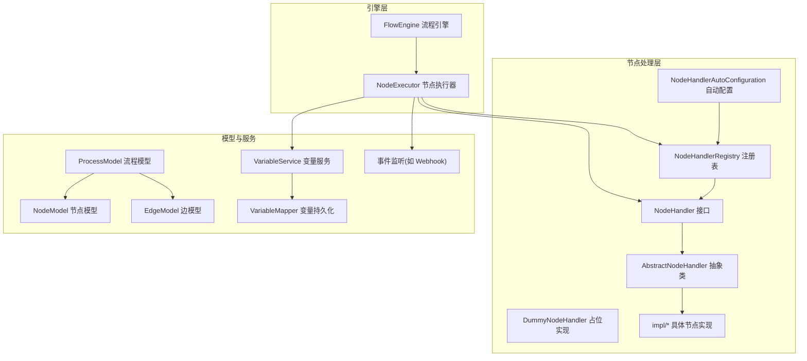
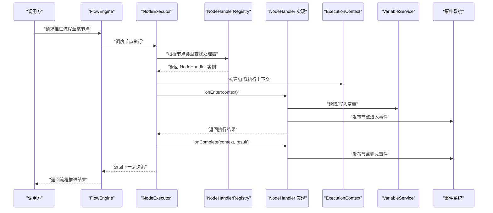
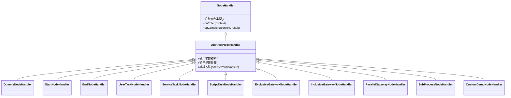
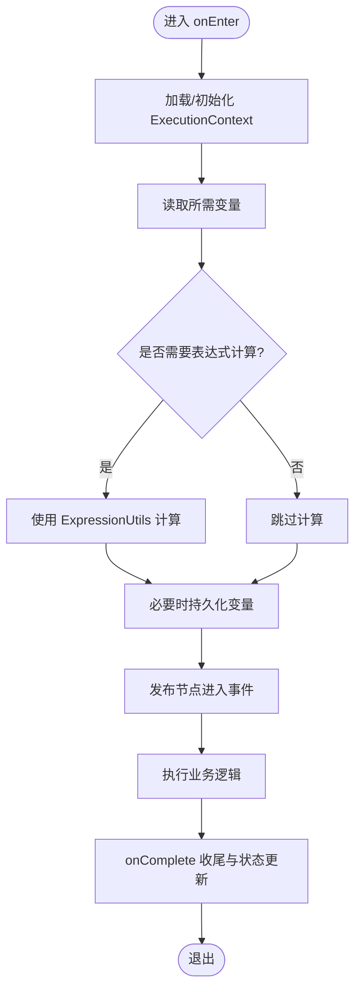
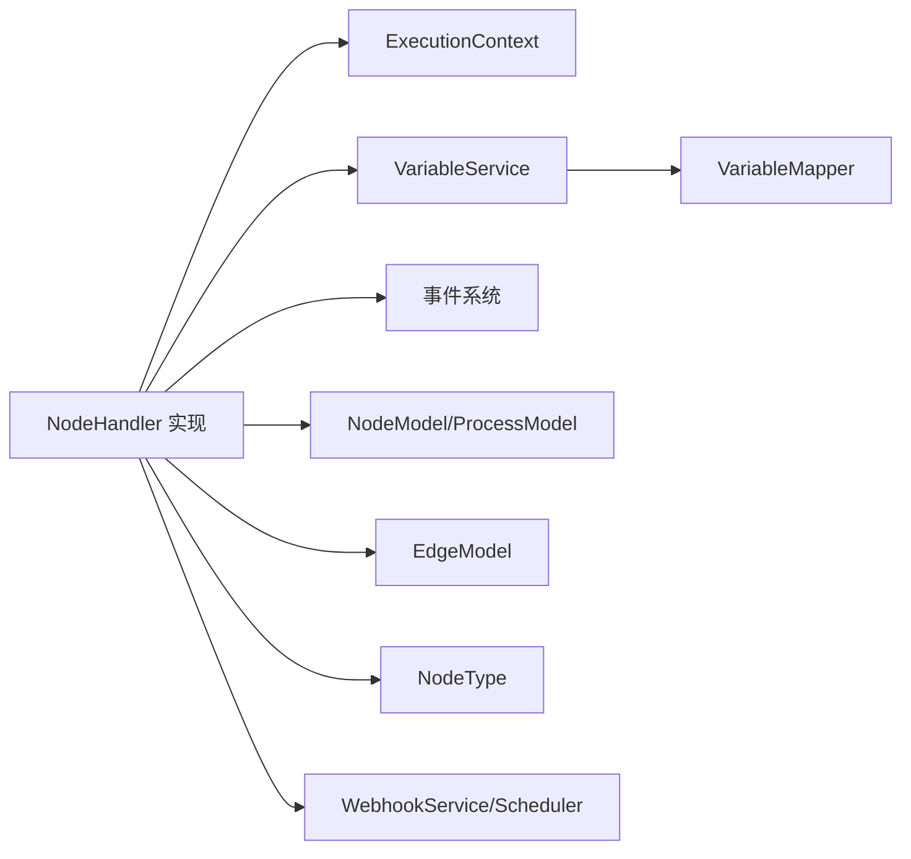

# 节点处理器架构

<cite>
**本文引用的文件**   
- [NodeHandler.java](file://flow-engine/src/main/java/com/flow/engine/node/NodeHandler.java)
- [AbstractNodeHandler.java](file://flow-engine/src/main/java/com/flow/engine/node/AbstractNodeHandler.java)
- [ExecutionContext.java](file://flow-engine/src/main/java/com/flow/engine/node/ExecutionContext.java)
- [NodeHandlerRegistry.java](file://flow-engine/src/main/java/com/flow/engine/node/NodeHandlerRegistry.java)
- [NodeHandlerAutoConfiguration.java](file://flow-engine/src/main/java/com/flow/engine/node/NodeHandlerAutoConfiguration.java)
- [DummyNodeHandler.java](file://flow-engine/src/main/java/com/flow/engine/node/DummyNodeHandler.java)
- [StartNodeHandler.java](file://flow-engine/src/main/java/com/flow/engine/node/impl/StartNodeHandler.java)
- [EndNodeHandler.java](file://flow-engine/src/main/java/com/flow/engine/node/impl/EndNodeHandler.java)
- [UserTaskNodeHandler.java](file://flow-engine/src/main/java/com/flow/engine/node/impl/UserTaskNodeHandler.java)
- [ServiceTaskNodeHandler.java](file://flow-engine/src/main/java/com/flow/engine/node/impl/ServiceTaskNodeHandler.java)
- [ScriptTaskNodeHandler.java](file://flow-engine/src/main/java/com/flow/engine/node/impl/ScriptTaskNodeHandler.java)
- [ExclusiveGatewayNodeHandler.java](file://flow-engine/src/main/java/com/flow/engine/node/impl/ExclusiveGatewayNodeHandler.java)
- [InclusiveGatewayNodeHandler.java](file://flow-engine/src/main/java/com/flow/engine/node/impl/InclusiveGatewayNodeHandler.java)
- [ParallelGatewayNodeHandler.java](file://flow-engine/src/main/java/com/flow/engine/node/impl/ParallelGatewayNodeHandler.java)
- [SubProcessNodeHandler.java](file://flow-engine/src/main/java/com/flow/engine/node/impl/SubProcessNodeHandler.java)
- [CustomDemoNodeHandler.java](file://flow-engine/src/main/java/com/flow/engine/node/impl/CustomDemoNodeHandler.java)
- [FlowEngine.java](file://flow-engine/src/main/java/com/flow/engine/engine/FlowEngine.java)
- [NodeExecutor.java](file://flow-engine/src/main/java/com/flow/engine/engine/NodeExecutor.java)
- [NodeType.java](file://flow-engine/src/main/java/com/flow/engine/common/enums/NodeType.java)
- [ProcessModel.java](file://flow-engine/src/main/java/com/flow/engine/model/ProcessModel.java)
- [NodeModel.java](file://flow-engine/src/main/java/com/flow/engine/model/NodeModel.java)
- [EdgeModel.java](file://flow-engine/src/main/java/com/flow/engine/model/EdgeModel.java)
- [Variable.java](file://flow-engine/src/main/java/com/flow/engine/entity/Variable.java)
- [VariableMapper.java](file://flow-engine/src/main/java/com/flow/engine/mapper/VariableMapper.java)
- [ExpressionUtils.java](file://flow-engine/src/main/java/com/flow/engine/common/utils/ExpressionUtils.java)
- [JsonUtils.java](file://flow-engine/src/main/java/com/flow/engine/common/utils/JsonUtils.java)
- [ProcessInstanceService.java](file://flow-engine/src/main/java/com/flow/engine/service/ProcessInstanceService.java)
- [VariableService.java](file://flow-engine/src/main/java/com/flow/engine/service/VariableService.java)
- [WebhookService.java](file://flow-engine/src/main/java/com/flow/engine/service/WebhookService.java)
- [WebhookScheduler.java](file://flow-engine/src/main/java/com/flow/engine/service/WebhookScheduler.java)
- [WebhookEventListener.java](file://flow-engine/src/main/java/com/flow/engine/listener/WebhookEventListener.java)
- [NodeCompletedEvent.java](file://flow-engine/src/main/java/com/flow/engine/event/NodeCompletedEvent.java)
- [NodeEnteredEvent.java](file://flow-engine/src/main/java/com/flow/engine/event/NodeEnteredEvent.java)
- [ProcessStartedEvent.java](file://flow-engine/src/main/java/com/flow/engine/event/ProcessStartedEvent.java)
- [ProcessCompletedEvent.java](file://flow-engine/src/main/java/com/flow/engine/event/ProcessCompletedEvent.java)
</cite>

## 目录
1. [简介](#简介)
2. [项目结构](#项目结构)
3. [核心组件](#核心组件)
4. [架构总览](#架构总览)
5. [详细组件分析](#详细组件分析)
6. [依赖关系分析](#依赖关系分析)
7. [性能考虑](#性能考虑)
8. [故障排查指南](#故障排查指南)
9. [结论](#结论)
10. [附录：自定义节点开发指南](#附录自定义节点开发指南)

## 简介
本技术文档围绕“节点处理器架构”展开，聚焦于 NodeHandler 接口的设计模式与插件化机制、AbstractNodeHandler 抽象类提供的通用能力与模板方法、不同节点类型的实现模式（用户任务、服务任务、网关节点等）、执行上下文与参数传递机制、以及节点间的依赖关系与数据流转方式。文档同时提供完整的自定义节点开发指南与最佳实践，帮助开发者快速扩展新的节点类型并融入流程引擎。

## 项目结构
节点处理器相关代码集中在 flow-engine 模块的 node 包及其 impl 子包中，配合 engine 层的 FlowEngine/NodeExecutor 驱动执行，model 层描述流程模型，service 层提供变量、事件、Webhook 等支撑能力。

图表来源
- [NodeHandler.java](file://flow-engine/src/main/java/com/flow/engine/node/NodeHandler.java)
- [AbstractNodeHandler.java](file://flow-engine/src/main/java/com/flow/engine/node/AbstractNodeHandler.java)
- [NodeHandlerRegistry.java](file://flow-engine/src/main/java/com/flow/engine/node/NodeHandlerRegistry.java)
- [NodeHandlerAutoConfiguration.java](file://flow-engine/src/main/java/com/flow/engine/node/NodeHandlerAutoConfiguration.java)
- [DummyNodeHandler.java](file://flow-engine/src/main/java/com/flow/engine/node/DummyNodeHandler.java)
- [FlowEngine.java](file://flow-engine/src/main/java/com/flow/engine/engine/FlowEngine.java)
- [NodeExecutor.java](file://flow-engine/src/main/java/com/flow/engine/engine/NodeExecutor.java)
- [ProcessModel.java](file://flow-engine/src/main/java/com/flow/engine/model/ProcessModel.java)
- [NodeModel.java](file://flow-engine/src/main/java/com/flow/engine/model/NodeModel.java)
- [EdgeModel.java](file://flow-engine/src/main/java/com/flow/engine/model/EdgeModel.java)
- [VariableService.java](file://flow-engine/src/main/java/com/flow/engine/service/VariableService.java)
- [VariableMapper.java](file://flow-engine/src/main/java/com/flow/engine/mapper/VariableMapper.java)
- [WebhookEventListener.java](file://flow-engine/src/main/java/com/flow/engine/listener/WebhookEventListener.java)

章节来源
- [NodeHandler.java](file://flow-engine/src/main/java/com/flow/engine/node/NodeHandler.java)
- [AbstractNodeHandler.java](file://flow-engine/src/main/java/com/flow/engine/node/AbstractNodeHandler.java)
- [NodeHandlerRegistry.java](file://flow-engine/src/main/java/com/flow/engine/node/NodeHandlerRegistry.java)
- [NodeHandlerAutoConfiguration.java](file://flow-engine/src/main/java/com/flow/engine/node/NodeHandlerAutoConfiguration.java)
- [FlowEngine.java](file://flow-engine/src/main/java/com/flow/engine/engine/FlowEngine.java)
- [NodeExecutor.java](file://flow-engine/src/main/java/com/flow/engine/engine/NodeExecutor.java)
- [ProcessModel.java](file://flow-engine/src/main/java/com/flow/engine/model/ProcessModel.java)
- [NodeModel.java](file://flow-engine/src/main/java/com/flow/engine/model/NodeModel.java)
- [EdgeModel.java](file://flow-engine/src/main/java/com/flow/engine/model/EdgeModel.java)
- [VariableService.java](file://flow-engine/src/main/java/com/flow/engine/service/VariableService.java)
- [VariableMapper.java](file://flow-engine/src/main/java/com/flow/engine/mapper/VariableMapper.java)
- [WebhookEventListener.java](file://flow-engine/src/main/java/com/flow/engine/listener/WebhookEventListener.java)

## 核心组件
- NodeHandler 接口：定义节点处理的统一契约，包括节点类型识别、进入与完成回调、上下文访问等。
- AbstractNodeHandler 抽象类：提供通用逻辑与模板方法，简化具体节点实现的重复工作。
- ExecutionContext 执行上下文：封装当前流程实例、变量、节点元信息、外部服务引用等，贯穿节点生命周期。
- NodeHandlerRegistry 注册表：集中管理所有已注册的节点处理器，支持按类型查找与动态扩展。
- NodeHandlerAutoConfiguration 自动配置：在应用启动时扫描并注册实现了 NodeHandler 的 Bean。
- DummyNodeHandler 占位实现：用于未知或暂不支持的节点类型，避免运行时异常。

章节来源
- [NodeHandler.java](file://flow-engine/src/main/java/com/flow/engine/node/NodeHandler.java)
- [AbstractNodeHandler.java](file://flow-engine/src/main/java/com/flow/engine/node/AbstractNodeHandler.java)
- [ExecutionContext.java](file://flow-engine/src/main/java/com/flow/engine/node/ExecutionContext.java)
- [NodeHandlerRegistry.java](file://flow-engine/src/main/java/com/flow/engine/node/NodeHandlerRegistry.java)
- [NodeHandlerAutoConfiguration.java](file://flow-engine/src/main/java/com/flow/engine/node/NodeHandlerAutoConfiguration.java)
- [DummyNodeHandler.java](file://flow-engine/src/main/java/com/flow/engine/node/DummyNodeHandler.java)

## 架构总览
节点处理器采用“接口+抽象基类+注册表+自动装配”的插件化架构。引擎在执行到某个节点时，通过 NodeExecutor 查询 NodeHandlerRegistry 获取对应 NodeHandler 实现，再调用其生命周期方法完成业务逻辑。ExecutionContext 作为上下文载体，承载变量读写、事件发布、外部服务调用等能力。

图表来源
- [FlowEngine.java](file://flow-engine/src/main/java/com/flow/engine/engine/FlowEngine.java)
- [NodeExecutor.java](file://flow-engine/src/main/java/com/flow/engine/engine/NodeExecutor.java)
- [NodeHandlerRegistry.java](file://flow-engine/src/main/java/com/flow/engine/node/NodeHandlerRegistry.java)
- [NodeHandler.java](file://flow-engine/src/main/java/com/flow/engine/node/NodeHandler.java)
- [ExecutionContext.java](file://flow-engine/src/main/java/com/flow/engine/node/ExecutionContext.java)
- [VariableService.java](file://flow-engine/src/main/java/com/flow/engine/service/VariableService.java)
- [NodeCompletedEvent.java](file://flow-engine/src/main/java/com/flow/engine/event/NodeCompletedEvent.java)
- [NodeEnteredEvent.java](file://flow-engine/src/main/java/com/flow/engine/event/NodeEnteredEvent.java)

## 详细组件分析

### 接口与抽象类设计
- NodeHandler 接口定义了节点的生命周期钩子与类型标识，确保所有节点实现遵循统一的执行契约。
- AbstractNodeHandler 提供默认行为与模板方法，例如通用的日志记录、异常包装、上下文校验、事件发布等，减少重复代码。
- 通过继承 AbstractNodeHandler，具体节点只需关注自身业务逻辑，即可复用通用能力。

图表来源
- [NodeHandler.java](file://flow-engine/src/main/java/com/flow/engine/node/NodeHandler.java)
- [AbstractNodeHandler.java](file://flow-engine/src/main/java/com/flow/engine/node/AbstractNodeHandler.java)
- [DummyNodeHandler.java](file://flow-engine/src/main/java/com/flow/engine/node/DummyNodeHandler.java)
- [StartNodeHandler.java](file://flow-engine/src/main/java/com/flow/engine/node/impl/StartNodeHandler.java)
- [EndNodeHandler.java](file://flow-engine/src/main/java/com/flow/engine/node/impl/EndNodeHandler.java)
- [UserTaskNodeHandler.java](file://flow-engine/src/main/java/com/flow/engine/node/impl/UserTaskNodeHandler.java)
- [ServiceTaskNodeHandler.java](file://flow-engine/src/main/java/com/flow/engine/node/impl/ServiceTaskNodeHandler.java)
- [ScriptTaskNodeHandler.java](file://flow-engine/src/main/java/com/flow/engine/node/impl/ScriptTaskNodeHandler.java)
- [ExclusiveGatewayNodeHandler.java](file://flow-engine/src/main/java/com/flow/engine/node/impl/ExclusiveGatewayNodeHandler.java)
- [InclusiveGatewayNodeHandler.java](file://flow-engine/src/main/java/com/flow/engine/node/impl/InclusiveGatewayNodeHandler.java)
- [ParallelGatewayNodeHandler.java](file://flow-engine/src/main/java/com/flow/engine/node/impl/ParallelGatewayNodeHandler.java)
- [SubProcessNodeHandler.java](file://flow-engine/src/main/java/com/flow/engine/node/impl/SubProcessNodeHandler.java)
- [CustomDemoNodeHandler.java](file://flow-engine/src/main/java/com/flow/engine/node/impl/CustomDemoNodeHandler.java)

章节来源
- [NodeHandler.java](file://flow-engine/src/main/java/com/flow/engine/node/NodeHandler.java)
- [AbstractNodeHandler.java](file://flow-engine/src/main/java/com/flow/engine/node/AbstractNodeHandler.java)
- [DummyNodeHandler.java](file://flow-engine/src/main/java/com/flow/engine/node/DummyNodeHandler.java)
- [StartNodeHandler.java](file://flow-engine/src/main/java/com/flow/engine/node/impl/StartNodeHandler.java)
- [EndNodeHandler.java](file://flow-engine/src/main/java/com/flow/engine/node/impl/EndNodeHandler.java)
- [UserTaskNodeHandler.java](file://flow-engine/src/main/java/com/flow/engine/node/impl/UserTaskNodeHandler.java)
- [ServiceTaskNodeHandler.java](file://flow-engine/src/main/java/com/flow/engine/node/impl/ServiceTaskNodeHandler.java)
- [ScriptTaskNodeHandler.java](file://flow-engine/src/main/java/com/flow/engine/node/impl/ScriptTaskNodeHandler.java)
- [ExclusiveGatewayNodeHandler.java](file://flow-engine/src/main/java/com/flow/engine/node/impl/ExclusiveGatewayNodeHandler.java)
- [InclusiveGatewayNodeHandler.java](file://flow-engine/src/main/java/com/flow/engine/node/impl/InclusiveGatewayNodeHandler.java)
- [ParallelGatewayNodeHandler.java](file://flow-engine/src/main/java/com/flow/engine/node/impl/ParallelGatewayNodeHandler.java)
- [SubProcessNodeHandler.java](file://flow-engine/src/main/java/com/flow/engine/node/impl/SubProcessNodeHandler.java)
- [CustomDemoNodeHandler.java](file://flow-engine/src/main/java/com/flow/engine/node/impl/CustomDemoNodeHandler.java)

### 执行上下文与参数传递
- ExecutionContext 提供对当前流程实例、节点元信息、变量读写、事件发布、外部服务注入的统一访问入口。
- 变量通过 VariableService 与 VariableMapper 进行持久化与检索；表达式计算由 ExpressionUtils 提供支持；JSON 序列化/反序列化由 JsonUtils 负责。
- 节点间的数据传递主要基于流程变量，也可通过事件系统与 Webhook 进行跨进程通信。

图表来源
- [ExecutionContext.java](file://flow-engine/src/main/java/com/flow/engine/node/ExecutionContext.java)
- [VariableService.java](file://flow-engine/src/main/java/com/flow/engine/service/VariableService.java)
- [VariableMapper.java](file://flow-engine/src/main/java/com/flow/engine/mapper/VariableMapper.java)
- [ExpressionUtils.java](file://flow-engine/src/main/java/com/flow/engine/common/utils/ExpressionUtils.java)
- [JsonUtils.java](file://flow-engine/src/main/java/com/flow/engine/common/utils/JsonUtils.java)
- [NodeEnteredEvent.java](file://flow-engine/src/main/java/com/flow/engine/event/NodeEnteredEvent.java)
- [NodeCompletedEvent.java](file://flow-engine/src/main/java/com/flow/engine/event/NodeCompletedEvent.java)

章节来源
- [ExecutionContext.java](file://flow-engine/src/main/java/com/flow/engine/node/ExecutionContext.java)
- [VariableService.java](file://flow-engine/src/main/java/com/flow/engine/service/VariableService.java)
- [VariableMapper.java](file://flow-engine/src/main/java/com/flow/engine/mapper/VariableMapper.java)
- [ExpressionUtils.java](file://flow-engine/src/main/java/com/flow/engine/common/utils/ExpressionUtils.java)
- [JsonUtils.java](file://flow-engine/src/main/java/com/flow/engine/common/utils/JsonUtils.java)
- [NodeEnteredEvent.java](file://flow-engine/src/main/java/com/flow/engine/event/NodeEnteredEvent.java)
- [NodeCompletedEvent.java](file://flow-engine/src/main/java/com/flow/engine/event/NodeCompletedEvent.java)

### 不同节点类型的实现模式
- 开始/结束节点：通常只做轻量初始化或清理工作，不改变流程变量，主要用于边界控制。
- 用户任务节点：创建待办任务、分配执行人、等待人工审批或操作完成后继续推进。
- 服务任务节点：调用外部服务或内部业务方法，可能涉及 HTTP 调用、消息队列、数据库更新等。
- 脚本任务节点：执行脚本语言逻辑，常用于复杂计算或规则判断。
- 网关节点：
  - 排他网关：根据条件选择唯一分支。
  - 包容网关：根据多个条件选择多条分支。
  - 并行网关：同步多分支并发执行。
- 子流程节点：嵌套执行另一个流程定义，支持入参/出参映射。
- 自定义演示节点：展示如何扩展新节点类型，便于参考与二次开发。

章节来源
- [StartNodeHandler.java](file://flow-engine/src/main/java/com/flow/engine/node/impl/StartNodeHandler.java)
- [EndNodeHandler.java](file://flow-engine/src/main/java/com/flow/engine/node/impl/EndNodeHandler.java)
- [UserTaskNodeHandler.java](file://flow-engine/src/main/java/com/flow/engine/node/impl/UserTaskNodeHandler.java)
- [ServiceTaskNodeHandler.java](file://flow-engine/src/main/java/com/flow/engine/node/impl/ServiceTaskNodeHandler.java)
- [ScriptTaskNodeHandler.java](file://flow-engine/src/main/java/com/flow/engine/node/impl/ScriptTaskNodeHandler.java)
- [ExclusiveGatewayNodeHandler.java](file://flow-engine/src/main/java/com/flow/engine/node/impl/ExclusiveGatewayNodeHandler.java)
- [InclusiveGatewayNodeHandler.java](file://flow-engine/src/main/java/com/flow/engine/node/impl/InclusiveGatewayNodeHandler.java)
- [ParallelGatewayNodeHandler.java](file://flow-engine/src/main/java/com/flow/engine/node/impl/ParallelGatewayNodeHandler.java)
- [SubProcessNodeHandler.java](file://flow-engine/src/main/java/com/flow/engine/node/impl/SubProcessNodeHandler.java)
- [CustomDemoNodeHandler.java](file://flow-engine/src/main/java/com/flow/engine/node/impl/CustomDemoNodeHandler.java)

### 节点注册与自动装配
- NodeHandlerRegistry 维护节点类型到处理器实现的映射，支持运行时查找与扩展。
- NodeHandlerAutoConfiguration 在应用启动时扫描所有 NodeHandler 实现并自动注册，无需手动配置。
- DummyNodeHandler 作为兜底实现，当遇到未识别的节点类型时返回安全默认行为，保障流程稳定性。

章节来源
- [NodeHandlerRegistry.java](file://flow-engine/src/main/java/com/flow/engine/node/NodeHandlerRegistry.java)
- [NodeHandlerAutoConfiguration.java](file://flow-engine/src/main/java/com/flow/engine/node/NodeHandlerAutoConfiguration.java)
- [DummyNodeHandler.java](file://flow-engine/src/main/java/com/flow/engine/node/DummyNodeHandler.java)

### 引擎驱动与执行路径
- FlowEngine 负责整体流程编排与推进，NodeExecutor 负责具体节点的调度与生命周期管理。
- 执行路径：FlowEngine -> NodeExecutor -> NodeHandlerRegistry -> NodeHandler -> ExecutionContext -> 变量/事件/外部服务。

章节来源
- [FlowEngine.java](file://flow-engine/src/main/java/com/flow/engine/engine/FlowEngine.java)
- [NodeExecutor.java](file://flow-engine/src/main/java/com/flow/engine/engine/NodeExecutor.java)
- [NodeHandlerRegistry.java](file://flow-engine/src/main/java/com/flow/engine/node/NodeHandlerRegistry.java)
- [NodeHandler.java](file://flow-engine/src/main/java/com/flow/engine/node/NodeHandler.java)
- [ExecutionContext.java](file://flow-engine/src/main/java/com/flow/engine/node/ExecutionContext.java)

## 依赖关系分析
节点处理器与模型、服务、事件之间的依赖关系如下：

图表来源
- [NodeHandler.java](file://flow-engine/src/main/java/com/flow/engine/node/NodeHandler.java)
- [ExecutionContext.java](file://flow-engine/src/main/java/com/flow/engine/node/ExecutionContext.java)
- [VariableService.java](file://flow-engine/src/main/java/com/flow/engine/service/VariableService.java)
- [VariableMapper.java](file://flow-engine/src/main/java/com/flow/engine/mapper/VariableMapper.java)
- [NodeModel.java](file://flow-engine/src/main/java/com/flow/engine/model/NodeModel.java)
- [ProcessModel.java](file://flow-engine/src/main/java/com/flow/engine/model/ProcessModel.java)
- [EdgeModel.java](file://flow-engine/src/main/java/com/flow/engine/model/EdgeModel.java)
- [NodeType.java](file://flow-engine/src/main/java/com/flow/engine/common/enums/NodeType.java)
- [WebhookService.java](file://flow-engine/src/main/java/com/flow/engine/service/WebhookService.java)
- [WebhookScheduler.java](file://flow-engine/src/main/java/com/flow/engine/service/WebhookScheduler.java)

章节来源
- [NodeHandler.java](file://flow-engine/src/main/java/com/flow/engine/node/NodeHandler.java)
- [ExecutionContext.java](file://flow-engine/src/main/java/com/flow/engine/node/ExecutionContext.java)
- [VariableService.java](file://flow-engine/src/main/java/com/flow/engine/service/VariableService.java)
- [VariableMapper.java](file://flow-engine/src/main/java/com/flow/engine/mapper/VariableMapper.java)
- [NodeModel.java](file://flow-engine/src/main/java/com/flow/engine/model/NodeModel.java)
- [ProcessModel.java](file://flow-engine/src/main/java/com/flow/engine/model/ProcessModel.java)
- [EdgeModel.java](file://flow-engine/src/main/java/com/flow/engine/model/EdgeModel.java)
- [NodeType.java](file://flow-engine/src/main/java/com/flow/engine/common/enums/NodeType.java)
- [WebhookService.java](file://flow-engine/src/main/java/com/flow/engine/service/WebhookService.java)
- [WebhookScheduler.java](file://flow-engine/src/main/java/com/flow/engine/service/WebhookScheduler.java)

## 性能考虑
- 变量读写优化：批量读取/写入流程变量，减少数据库往返次数。
- 表达式计算缓存：对频繁使用的表达式结果进行缓存，降低重复计算开销。
- 异步事件与 Webhook：将非关键路径的事件发布与外部调用改为异步，提升主流程吞吐。
- 网关分支评估：对条件表达式进行预编译与短路求值，提高分支选择效率。
- 并发控制：并行网关需合理设置线程池大小与超时策略，避免资源耗尽。

[本节为通用指导，不涉及具体文件分析]

## 故障排查指南
- 节点未找到：检查 NodeType 枚举与 NodeHandlerRegistry 是否正确注册，确认自动装配是否生效。
- 变量缺失或类型错误：核查 ExecutionContext 中的变量初始化与表达式计算逻辑，确认 JSON 序列化一致性。
- 事件未触发：确认事件发布是否在正确生命周期调用，检查事件监听器（如 Webhook）是否启用。
- 外部调用失败：在服务任务或脚本任务中增加重试与熔断策略，记录详细错误日志以便定位。

章节来源
- [NodeHandlerRegistry.java](file://flow-engine/src/main/java/com/flow/engine/node/NodeHandlerRegistry.java)
- [NodeHandlerAutoConfiguration.java](file://flow-engine/src/main/java/com/flow/engine/node/NodeHandlerAutoConfiguration.java)
- [ExpressionUtils.java](file://flow-engine/src/main/java/com/flow/engine/common/utils/ExpressionUtils.java)
- [JsonUtils.java](file://flow-engine/src/main/java/com/flow/engine/common/utils/JsonUtils.java)
- [WebhookEventListener.java](file://flow-engine/src/main/java/com/flow/engine/listener/WebhookEventListener.java)

## 结论
节点处理器架构通过清晰的接口契约、可复用的抽象基类、集中的注册管理与自动装配机制，实现了高内聚、低耦合的插件化设计。开发者仅需关注业务逻辑，即可快速扩展新的节点类型，并通过统一的执行上下文与变量体系实现节点间的数据共享与协作。结合事件系统与 Webhook，该架构具备良好的可扩展性与生态集成能力。

[本节为总结性内容，不涉及具体文件分析]

## 附录：自定义节点开发指南
- 步骤一：新建一个类实现 NodeHandler 接口，或直接继承 AbstractNodeHandler 以复用通用能力。
- 步骤二：在 onEnter 中读取必要变量、计算表达式、发布节点进入事件；在 onComplete 中完成收尾与状态更新。
- 步骤三：通过 ExecutionContext 访问流程实例、变量、事件与外部服务；必要时使用 VariableService 持久化变量。
- 步骤四：确保节点类型标识与 NodeType 枚举一致，并在 NodeHandlerRegistry 中注册（若未启用自动装配）。
- 步骤五：编写单元测试验证节点逻辑，覆盖正常路径与异常路径。
- 最佳实践：
  - 保持 onEnter/onComplete 幂等，避免重复执行导致副作用。
  - 对外部调用增加超时与重试策略，记录详细日志。
  - 对复杂条件表达式进行预编译与缓存，提升性能。
  - 使用事件系统解耦副作用逻辑（如发送通知、触发 Webhook）。

章节来源
- [NodeHandler.java](file://flow-engine/src/main/java/com/flow/engine/node/NodeHandler.java)
- [AbstractNodeHandler.java](file://flow-engine/src/main/java/com/flow/engine/node/AbstractNodeHandler.java)
- [ExecutionContext.java](file://flow-engine/src/main/java/com/flow/engine/node/ExecutionContext.java)
- [VariableService.java](file://flow-engine/src/main/java/com/flow/engine/service/VariableService.java)
- [NodeHandlerRegistry.java](file://flow-engine/src/main/java/com/flow/engine/node/NodeHandlerRegistry.java)
- [NodeHandlerAutoConfiguration.java](file://flow-engine/src/main/java/com/flow/engine/node/NodeHandlerAutoConfiguration.java)
- [CustomDemoNodeHandler.java](file://flow-engine/src/main/java/com/flow/engine/node/impl/CustomDemoNodeHandler.java)