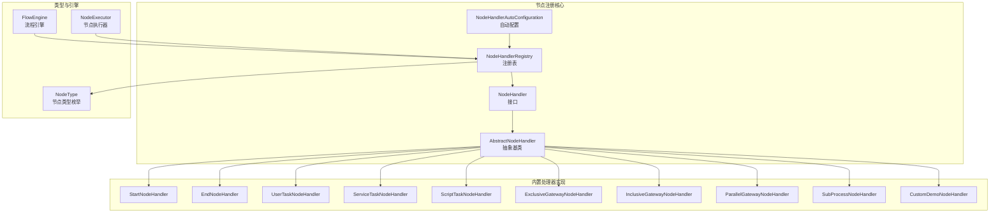
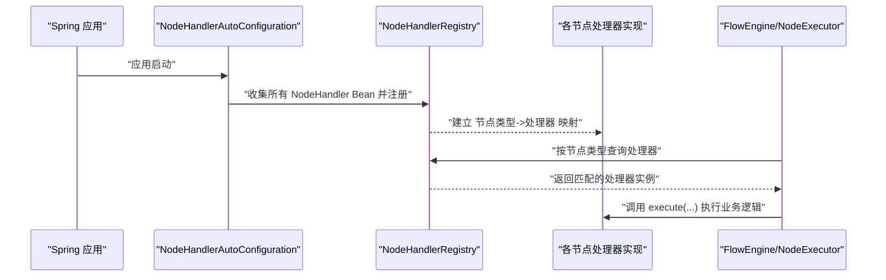
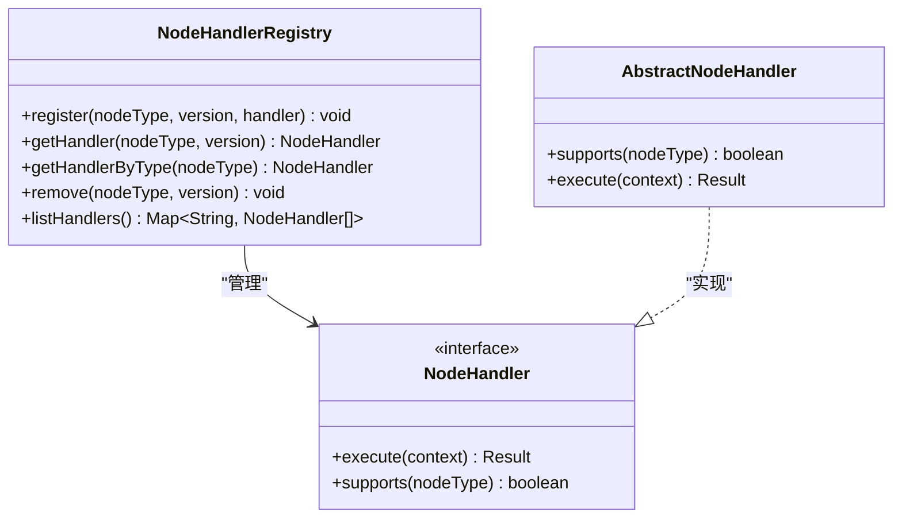
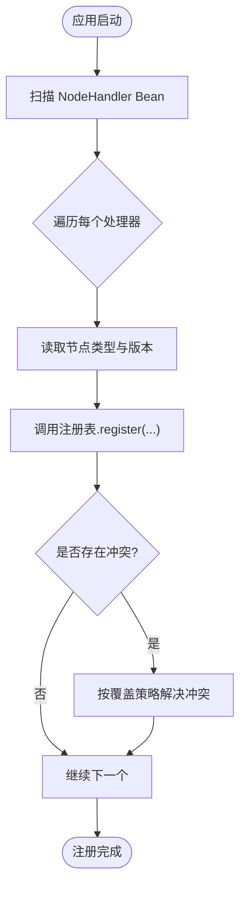
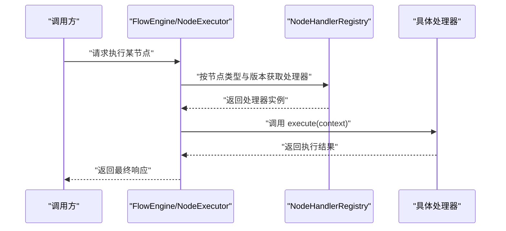
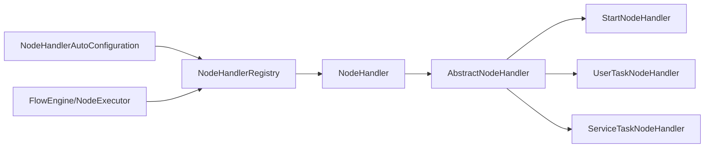

# 节点注册机制

<cite>
**本文引用的文件**   
- [NodeHandlerRegistry.java](file://flow-engine/src/main/java/com/flow/engine/node/NodeHandlerRegistry.java)
- [NodeHandlerAutoConfiguration.java](file://flow-engine/src/main/java/com/flow/engine/node/NodeHandlerAutoConfiguration.java)
- [AbstractNodeHandler.java](file://flow-engine/src/main/java/com/flow/engine/node/AbstractNodeHandler.java)
- [NodeHandler.java](file://flow-engine/src/main/java/com/flow/engine/node/NodeHandler.java)
- [StartNodeHandler.java](file://flow-engine/src/main/java/com/flow/engine/node/impl/StartNodeHandler.java)
- [EndNodeHandler.java](file://flow-engine/src/main/java/com/flow/engine/node/impl/EndNodeHandler.java)
- [UserTaskNodeHandler.java](file://flow-engine/src/main/java/com/flow/engine/node/impl/UserTaskNodeHandler.java)
- [ServiceTaskNodeHandler.java](file://flow-engine/src/main/java/com/flow/engine/node/impl/ServiceTaskNodeHandler.java)
- [ScriptTaskNodeHandler.java](file://flow-engine/src/main/java/com/flow/engine/node/impl/ScriptTaskNodeHandler.java)
- [ExclusiveGatewayNodeHandler.java](file://flow-engine/src/main/java/com/flow/engine/node/impl/ExclusiveGatewayNodeHandler.java)
- [InclusiveGatewayNodeHandler.java](file://flow-engine/src/main/java/com/flow/engine/node/impl/InclusiveGatewayNodeHandler.java)
- [ParallelGatewayNodeHandler.java](file://flow-engine/src/main/java/com/flow/engine/node/impl/ParallelGatewayNodeHandler.java)
- [SubProcessNodeHandler.java](file://flow-engine/src/main/java/com/flow/engine/node/impl/SubProcessNodeHandler.java)
- [CustomDemoNodeHandler.java](file://flow-engine/src/main/java/com/flow/engine/node/impl/CustomDemoNodeHandler.java)
- [NodeType.java](file://flow-engine/src/main/java/com/flow/engine/common/enums/NodeType.java)
- [FlowEngine.java](file://flow-engine/src/main/java/com/flow/engine/engine/FlowEngine.java)
- [NodeExecutor.java](file://flow-engine/src/main/java/com/flow/engine/engine/NodeExecutor.java)
- [NodeHandlerRegistryTest.java](file://flow-engine/src/test/java/com/flow/engine/node/NodeHandlerRegistryTest.java)
- [NodeHandlerAutoRegisterTest.java](file://flow-engine/src/test/java/com/flow/engine/node/NodeHandlerAutoRegisterTest.java)
</cite>

## 目录
1. [简介](#简介)
2. [项目结构](#项目结构)
3. [核心组件](#核心组件)
4. [架构总览](#架构总览)
5. [详细组件分析](#详细组件分析)
6. [依赖关系分析](#依赖关系分析)
7. [性能考虑](#性能考虑)
8. [故障排查指南](#故障排查指南)
9. [结论](#结论)
10. [附录](#附录)

## 简介
本技术文档聚焦于流程引擎中的“节点注册机制”，围绕 NodeHandlerRegistry 类展开，系统阐述：
- 节点处理器的注册、查找与管理机制
- 自动配置与自动发现（Spring 扫描）的实现方式
- 节点类型与处理器实现的映射关系及版本兼容性管理
- 节点处理器的生命周期管理与依赖注入
- 自定义节点注册的完整示例与配置方法
- 热插拔支持与动态加载机制
- 常见注册失败与冲突问题的故障排查

## 项目结构
与节点注册机制相关的代码主要位于 flow-engine 模块的 node 包及其实现子包中，同时包含枚举定义、测试用例以及引擎侧调用入口。

图表来源
- [NodeHandlerRegistry.java](file://flow-engine/src/main/java/com/flow/engine/node/NodeHandlerRegistry.java)
- [NodeHandlerAutoConfiguration.java](file://flow-engine/src/main/java/com/flow/engine/node/NodeHandlerAutoConfiguration.java)
- [NodeHandler.java](file://flow-engine/src/main/java/com/flow/engine/node/NodeHandler.java)
- [AbstractNodeHandler.java](file://flow-engine/src/main/java/com/flow/engine/node/AbstractNodeHandler.java)
- [StartNodeHandler.java](file://flow-engine/src/main/java/com/flow/engine/node/impl/StartNodeHandler.java)
- [EndNodeHandler.java](file://flow-engine/src/main/java/com/flow/engine/node/impl/EndNodeHandler.java)
- [UserTaskNodeHandler.java](file://flow-engine/src/main/java/com/flow/engine/node/impl/UserTaskNodeHandler.java)
- [ServiceTaskNodeHandler.java](file://flow-engine/src/main/java/com/flow/engine/node/impl/ServiceTaskNodeHandler.java)
- [ScriptTaskNodeHandler.java](file://flow-engine/src/main/java/com/flow/engine/node/impl/ScriptTaskNodeHandler.java)
- [ExclusiveGatewayNodeHandler.java](file://flow-engine/src/main/java/com/flow/engine/node/impl/ExclusiveGatewayNodeHandler.java)
- [InclusiveGatewayNodeHandler.java](file://flow-engine/src/main/java/com/flow/engine/node/impl/InclusiveGatewayNodeHandler.java)
- [ParallelGatewayNodeHandler.java](file://flow-engine/src/main/java/com/flow/engine/node/impl/ParallelGatewayNodeHandler.java)
- [SubProcessNodeHandler.java](file://flow-engine/src/main/java/com/flow/engine/node/impl/SubProcessNodeHandler.java)
- [CustomDemoNodeHandler.java](file://flow-engine/src/main/java/com/flow/engine/node/impl/CustomDemoNodeHandler.java)
- [NodeType.java](file://flow-engine/src/main/java/com/flow/engine/common/enums/NodeType.java)
- [FlowEngine.java](file://flow-engine/src/main/java/com/flow/engine/engine/FlowEngine.java)
- [NodeExecutor.java](file://flow-engine/src/main/java/com/flow/engine/engine/NodeExecutor.java)

章节来源
- [NodeHandlerRegistry.java](file://flow-engine/src/main/java/com/flow/engine/node/NodeHandlerRegistry.java)
- [NodeHandlerAutoConfiguration.java](file://flow-engine/src/main/java/com/flow/engine/node/NodeHandlerAutoConfiguration.java)
- [NodeType.java](file://flow-engine/src/main/java/com/flow/engine/common/enums/NodeType.java)
- [FlowEngine.java](file://flow-engine/src/main/java/com/flow/engine/engine/FlowEngine.java)
- [NodeExecutor.java](file://flow-engine/src/main/java/com/flow/engine/engine/NodeExecutor.java)

## 核心组件
- NodeHandlerRegistry：节点处理器注册中心，负责统一维护“节点类型 -> 处理器实例”的映射，提供注册、查找、覆盖控制、版本选择等能力。
- NodeHandlerAutoConfiguration：基于 Spring 的自动配置类，负责在应用启动时扫描并注册所有实现了 NodeHandler 接口的 Bean，完成自动发现。
- NodeHandler 接口与 AbstractNodeHandler 抽象基类：定义节点处理契约与通用行为，具体处理器通过继承或实现接入注册体系。
- 内置处理器实现：如开始、结束、用户任务、服务任务、脚本任务、排他/包容/并行网关、子流程等，均遵循同一注册协议。
- NodeType 枚举：集中定义支持的节点类型标识，作为注册键值的重要维度之一。
- FlowEngine / NodeExecutor：运行时从注册表中按节点类型解析处理器并执行。

章节来源
- [NodeHandlerRegistry.java](file://flow-engine/src/main/java/com/flow/engine/node/NodeHandlerRegistry.java)
- [NodeHandlerAutoConfiguration.java](file://flow-engine/src/main/java/com/flow/engine/node/NodeHandlerAutoConfiguration.java)
- [NodeHandler.java](file://flow-engine/src/main/java/com/flow/engine/node/NodeHandler.java)
- [AbstractNodeHandler.java](file://flow-engine/src/main/java/com/flow/engine/node/AbstractNodeHandler.java)
- [NodeType.java](file://flow-engine/src/main/java/com/flow/engine/common/enums/NodeType.java)
- [FlowEngine.java](file://flow-engine/src/main/java/com/flow/engine/engine/FlowEngine.java)
- [NodeExecutor.java](file://flow-engine/src/main/java/com/flow/engine/engine/NodeExecutor.java)

## 架构总览
下图展示了节点注册与执行的整体流程：Spring 启动阶段由自动配置类扫描并注册处理器；运行时引擎根据节点类型从注册表获取处理器并委托其执行。

图表来源
- [NodeHandlerAutoConfiguration.java](file://flow-engine/src/main/java/com/flow/engine/node/NodeHandlerAutoConfiguration.java)
- [NodeHandlerRegistry.java](file://flow-engine/src/main/java/com/flow/engine/node/NodeHandlerRegistry.java)
- [FlowEngine.java](file://flow-engine/src/main/java/com/flow/engine/engine/FlowEngine.java)
- [NodeExecutor.java](file://flow-engine/src/main/java/com/flow/engine/engine/NodeExecutor.java)

## 详细组件分析

### NodeHandlerRegistry 设计与实现
- 职责
  - 维护多版本的“节点类型 -> 处理器”映射，支持同类型不同版本的共存与选择。
  - 提供注册、覆盖策略、按类型与版本精确查找、默认版本回退等能力。
  - 暴露线程安全的访问接口，供引擎在运行期快速解析处理器。
- 关键设计点
  - 以“节点类型 + 版本”为复合键组织映射，便于向后兼容与灰度升级。
  - 注册时支持显式指定版本；未指定则采用默认版本策略。
  - 查找时优先匹配精确版本，其次回退到最大可用版本，最后可配置是否允许无处理器时的降级策略。
- 复杂度与并发
  - 注册与查找通常为 O(1) 或 O(log n) 级别（取决于内部数据结构）。
  - 对并发安全有要求，建议内部使用线程安全容器或加锁保护。
- 扩展点
  - 可通过覆写注册策略或版本选择策略来定制行为。
  - 可与外部配置源结合，实现动态刷新。

图表来源
- [NodeHandlerRegistry.java](file://flow-engine/src/main/java/com/flow/engine/node/NodeHandlerRegistry.java)
- [NodeHandler.java](file://flow-engine/src/main/java/com/flow/engine/node/NodeHandler.java)
- [AbstractNodeHandler.java](file://flow-engine/src/main/java/com/flow/engine/node/AbstractNodeHandler.java)

章节来源
- [NodeHandlerRegistry.java](file://flow-engine/src/main/java/com/flow/engine/node/NodeHandlerRegistry.java)
- [NodeHandler.java](file://flow-engine/src/main/java/com/flow/engine/node/NodeHandler.java)
- [AbstractNodeHandler.java](file://flow-engine/src/main/java/com/flow/engine/node/AbstractNodeHandler.java)

### 自动配置与自动发现（Spring 扫描）
- 触发时机
  - 应用启动时，NodeHandlerAutoConfiguration 被加载，收集容器中所有 NodeHandler 类型的 Bean。
- 扫描与注册
  - 遍历已发现的处理器 Bean，读取其声明的节点类型与版本信息，调用注册表进行注册。
  - 若存在重复类型+版本，依据覆盖策略决定保留哪一个实现。
- 与 Spring 生态集成
  - 利用 @Component/@Service 等注解标注处理器，即可被自动发现。
  - 处理器可直接通过 Spring 注入其他 Bean（依赖注入），无需手动装配。

图表来源
- [NodeHandlerAutoConfiguration.java](file://flow-engine/src/main/java/com/flow/engine/node/NodeHandlerAutoConfiguration.java)
- [NodeHandlerRegistry.java](file://flow-engine/src/main/java/com/flow/engine/node/NodeHandlerRegistry.java)

章节来源
- [NodeHandlerAutoConfiguration.java](file://flow-engine/src/main/java/com/flow/engine/node/NodeHandlerAutoConfiguration.java)

### 节点类型与处理器映射及版本兼容性
- 映射关系
  - 节点类型来自 NodeType 枚举，处理器通过 supports 或元数据声明自身支持的类型。
  - 注册表将“类型 + 版本”映射到处理器实例，保证多版本并存。
- 版本兼容性
  - 新增处理器版本时，旧版本仍可继续使用，避免破坏性变更。
  - 运行时可按目标版本精确选择处理器，或在未指定版本时选择最大可用版本。
- 典型内置处理器
  - 开始、结束、用户任务、服务任务、脚本任务、排他/包容/并行网关、子流程等，均遵循同一映射与版本约定。

章节来源
- [NodeType.java](file://flow-engine/src/main/java/com/flow/engine/common/enums/NodeType.java)
- [StartNodeHandler.java](file://flow-engine/src/main/java/com/flow/engine/node/impl/StartNodeHandler.java)
- [EndNodeHandler.java](file://flow-engine/src/main/java/com/flow/engine/node/impl/EndNodeHandler.java)
- [UserTaskNodeHandler.java](file://flow-engine/src/main/java/com/flow/engine/node/impl/UserTaskNodeHandler.java)
- [ServiceTaskNodeHandler.java](file://flow-engine/src/main/java/com/flow/engine/node/impl/ServiceTaskNodeHandler.java)
- [ScriptTaskNodeHandler.java](file://flow-engine/src/main/java/com/flow/engine/node/impl/ScriptTaskNodeHandler.java)
- [ExclusiveGatewayNodeHandler.java](file://flow-engine/src/main/java/com/flow/engine/node/impl/ExclusiveGatewayNodeHandler.java)
- [InclusiveGatewayNodeHandler.java](file://flow-engine/src/main/java/com/flow/engine/node/impl/InclusiveGatewayNodeHandler.java)
- [ParallelGatewayNodeHandler.java](file://flow-engine/src/main/java/com/flow/engine/node/impl/ParallelGatewayNodeHandler.java)
- [SubProcessNodeHandler.java](file://flow-engine/src/main/java/com/flow/engine/node/impl/SubProcessNodeHandler.java)

### 生命周期管理与依赖注入
- 生命周期
  - 处理器作为 Spring Bean，受 Spring 容器管理，具备标准的初始化与销毁回调。
  - 注册发生在容器启动阶段，销毁时可从注册表移除（如需）。
- 依赖注入
  - 处理器可直接通过构造器或字段注入所需的服务、配置、数据源等。
  - 建议在初始化阶段完成必要的资源准备，并在销毁阶段释放。

章节来源
- [NodeHandlerAutoConfiguration.java](file://flow-engine/src/main/java/com/flow/engine/node/NodeHandlerAutoConfiguration.java)
- [AbstractNodeHandler.java](file://flow-engine/src/main/java/com/flow/engine/node/AbstractNodeHandler.java)

### 运行时调用序列（引擎侧）

图表来源
- [FlowEngine.java](file://flow-engine/src/main/java/com/flow/engine/engine/FlowEngine.java)
- [NodeExecutor.java](file://flow-engine/src/main/java/com/flow/engine/engine/NodeExecutor.java)
- [NodeHandlerRegistry.java](file://flow-engine/src/main/java/com/flow/engine/node/NodeHandlerRegistry.java)

章节来源
- [FlowEngine.java](file://flow-engine/src/main/java/com/flow/engine/engine/FlowEngine.java)
- [NodeExecutor.java](file://flow-engine/src/main/java/com/flow/engine/engine/NodeExecutor.java)
- [NodeHandlerRegistry.java](file://flow-engine/src/main/java/com/flow/engine/node/NodeHandlerRegistry.java)

### 自定义节点注册示例与配置方法
- 步骤概览
  - 新建一个类实现 NodeHandler 接口或继承 AbstractNodeHandler。
  - 在类上添加 Spring 注解（如 @Component），使其成为容器管理的 Bean。
  - 在类中声明支持的节点类型与版本（通过 supports 或元数据）。
  - 实现业务逻辑（execute 等方法）。
  - 应用启动后，自动配置会自动发现并注册该处理器。
- 参考实现
  - 可参考内置处理器（如 CustomDemoNodeHandler）的结构与约定。
- 验证方式
  - 使用单元测试（如 NodeHandlerRegistryTest、NodeHandlerAutoRegisterTest）验证注册与查找是否正确。

章节来源
- [CustomDemoNodeHandler.java](file://flow-engine/src/main/java/com/flow/engine/node/impl/CustomDemoNodeHandler.java)
- [NodeHandlerRegistryTest.java](file://flow-engine/src/test/java/com/flow/engine/node/NodeHandlerRegistryTest.java)
- [NodeHandlerAutoRegisterTest.java](file://flow-engine/src/test/java/com/flow/engine/node/NodeHandlerAutoRegisterTest.java)

### 热插拔支持与动态加载机制
- 静态注册（推荐）
  - 大多数场景下，处理器作为 Spring Bean 随应用启动注册，简单可靠。
- 动态注册（可选）
  - 若需在不重启的情况下增加/替换处理器，可在运行期直接调用注册表的 register/remove 方法。
  - 注意并发安全与版本选择策略，确保不会引发竞态条件。
- 注意事项
  - 动态加载应配合配置中心或事件总线，实现按需刷新。
  - 对于有状态处理器，需谨慎处理实例复用与资源清理。

章节来源
- [NodeHandlerRegistry.java](file://flow-engine/src/main/java/com/flow/engine/node/NodeHandlerRegistry.java)

## 依赖关系分析
- 组件耦合
  - 自动配置类仅依赖注册表与 Spring 容器，低耦合。
  - 处理器实现仅依赖注册表提供的契约（接口/抽象类），不感知注册细节。
  - 引擎侧通过注册表解耦具体处理器实现。
- 外部依赖
  - Spring 框架用于 Bean 扫描、依赖注入与生命周期管理。
- 潜在循环依赖
  - 处理器不应反向依赖注册表进行注册（应由自动配置完成），以避免循环依赖。

图表来源
- [NodeHandlerAutoConfiguration.java](file://flow-engine/src/main/java/com/flow/engine/node/NodeHandlerAutoConfiguration.java)
- [NodeHandlerRegistry.java](file://flow-engine/src/main/java/com/flow/engine/node/NodeHandlerRegistry.java)
- [NodeHandler.java](file://flow-engine/src/main/java/com/flow/engine/node/NodeHandler.java)
- [AbstractNodeHandler.java](file://flow-engine/src/main/java/com/flow/engine/node/AbstractNodeHandler.java)
- [StartNodeHandler.java](file://flow-engine/src/main/java/com/flow/engine/node/impl/StartNodeHandler.java)
- [UserTaskNodeHandler.java](file://flow-engine/src/main/java/com/flow/engine/node/impl/UserTaskNodeHandler.java)
- [ServiceTaskNodeHandler.java](file://flow-engine/src/main/java/com/flow/engine/node/impl/ServiceTaskNodeHandler.java)
- [FlowEngine.java](file://flow-engine/src/main/java/com/flow/engine/engine/FlowEngine.java)
- [NodeExecutor.java](file://flow-engine/src/main/java/com/flow/engine/engine/NodeExecutor.java)

章节来源
- [NodeHandlerAutoConfiguration.java](file://flow-engine/src/main/java/com/flow/engine/node/NodeHandlerAutoConfiguration.java)
- [NodeHandlerRegistry.java](file://flow-engine/src/main/java/com/flow/engine/node/NodeHandlerRegistry.java)
- [FlowEngine.java](file://flow-engine/src/main/java/com/flow/engine/engine/FlowEngine.java)
- [NodeExecutor.java](file://flow-engine/src/main/java/com/flow/engine/engine/NodeExecutor.java)

## 性能考虑
- 注册阶段
  - 处理器数量通常有限，注册开销可忽略。
- 运行期查找
  - 建议注册表内部使用哈希映射，保证 O(1) 查找。
  - 若按版本排序或范围匹配，可使用有序结构，但应避免频繁排序。
- 并发访问
  - 注册与查找可能并发发生，需保证线程安全。
- 内存占用
  - 处理器实例由 Spring 管理，注意避免在处理器中持有大对象引用导致内存泄漏。

## 故障排查指南
- 常见问题
  - 处理器未被自动发现：检查是否缺少 Spring 注解或不在扫描路径内。
  - 重复类型+版本冲突：确认覆盖策略是否符合预期，必要时调整版本或实现。
  - 运行时找不到处理器：检查节点类型与版本是否与注册一致。
  - 依赖注入失败：确认处理器所需的 Bean 是否存在且可注入。
- 定位手段
  - 查看自动配置日志，确认扫描到的处理器列表。
  - 使用注册表提供的查询接口，打印当前映射情况。
  - 借助单元测试复现问题，缩小范围。
- 修复建议
  - 修正节点类型声明与枚举值一致性。
  - 明确版本策略，避免无意覆盖。
  - 对动态注册场景，增加幂等性与错误码提示。

章节来源
- [NodeHandlerAutoConfiguration.java](file://flow-engine/src/main/java/com/flow/engine/node/NodeHandlerAutoConfiguration.java)
- [NodeHandlerRegistry.java](file://flow-engine/src/main/java/com/flow/engine/node/NodeHandlerRegistry.java)
- [NodeHandlerRegistryTest.java](file://flow-engine/src/test/java/com/flow/engine/node/NodeHandlerRegistryTest.java)
- [NodeHandlerAutoRegisterTest.java](file://flow-engine/src/test/java/com/flow/engine/node/NodeHandlerAutoRegisterTest.java)

## 结论
节点注册机制通过“自动配置 + 注册表 + 处理器契约”的组合，实现了高内聚、低耦合的扩展模型。依托 Spring 的生命周期与依赖注入，开发者可以便捷地扩展新的节点类型，并通过版本化策略保障向后兼容。在需要时，还可结合动态注册实现热插拔能力。合理的并发与性能设计确保了在生产环境下的稳定与高效。

## 附录
- 相关测试用例
  - 注册与查找行为验证：[NodeHandlerRegistryTest.java](file://flow-engine/src/test/java/com/flow/engine/node/NodeHandlerRegistryTest.java)
  - 自动注册行为验证：[NodeHandlerAutoRegisterTest.java](file://flow-engine/src/test/java/com/flow/engine/node/NodeHandlerAutoRegisterTest.java)
- 参考处理器实现
  - 示例处理器：[CustomDemoNodeHandler.java](file://flow-engine/src/main/java/com/flow/engine/node/impl/CustomDemoNodeHandler.java)
  - 内置处理器集合：见 node.impl 包下各实现类