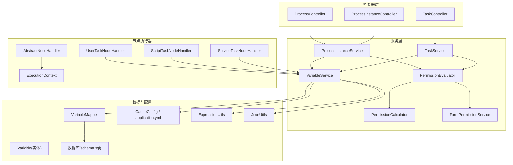
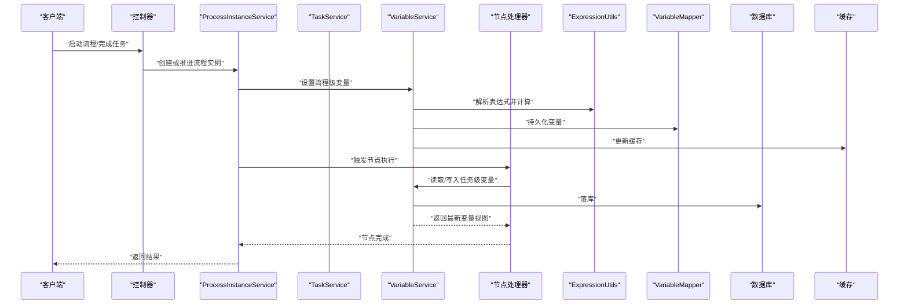
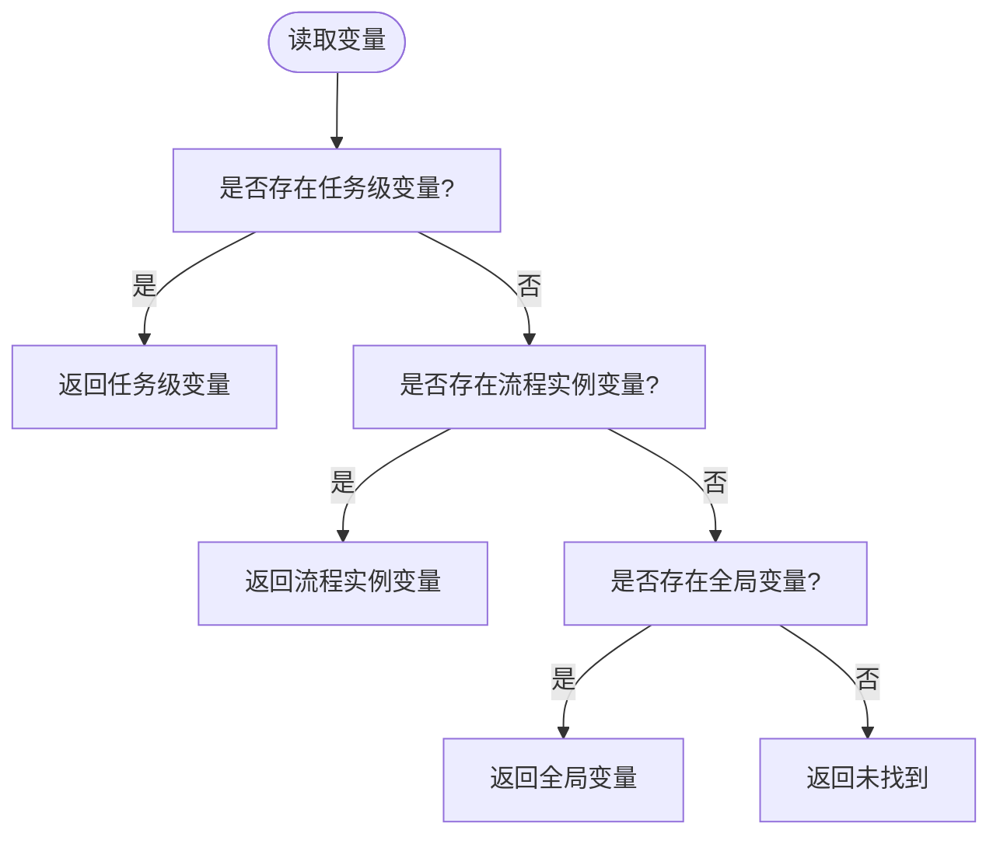
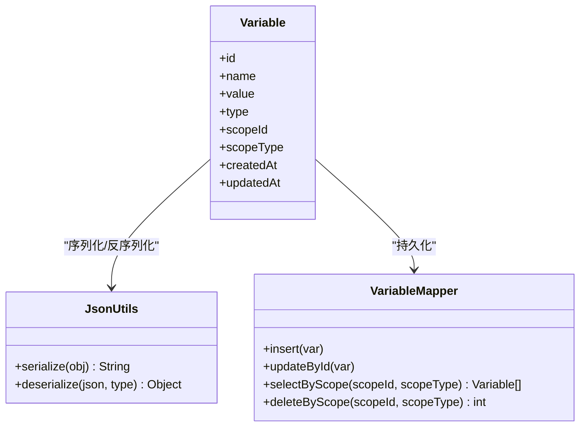
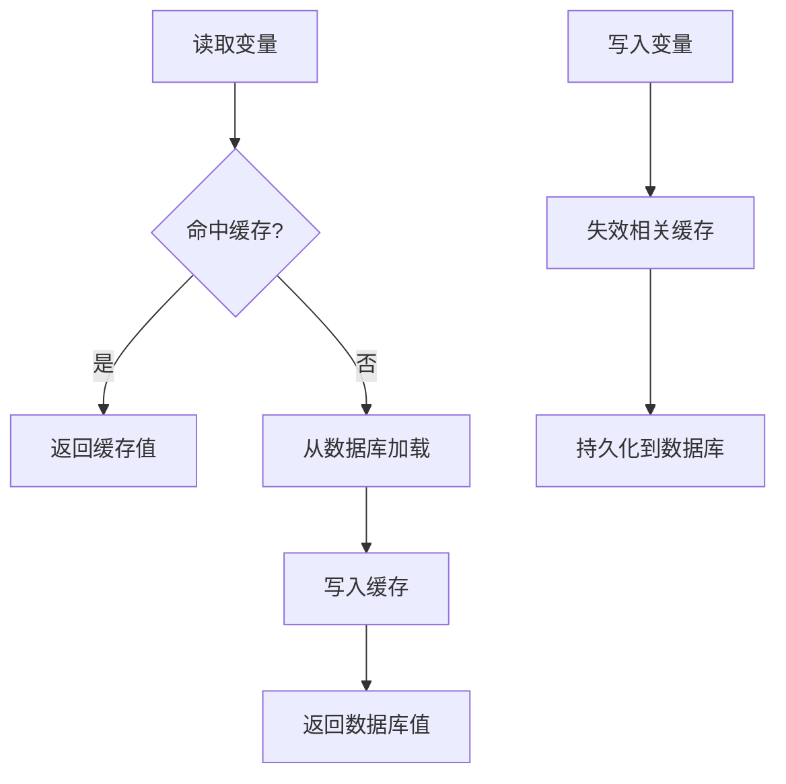
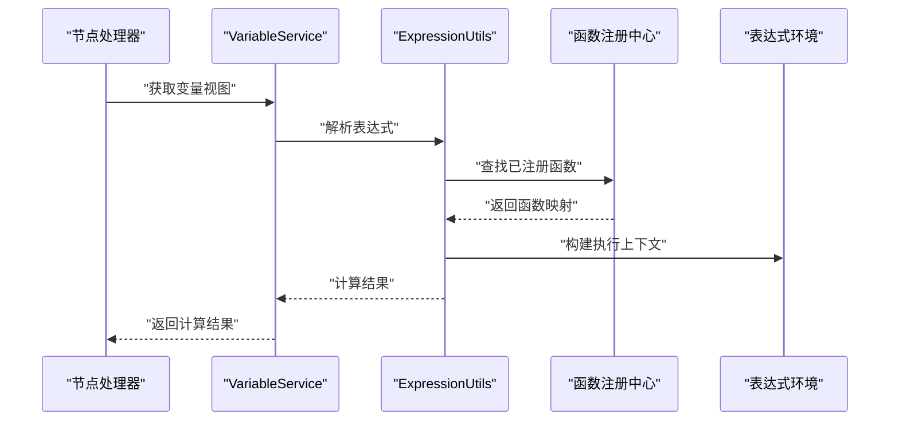
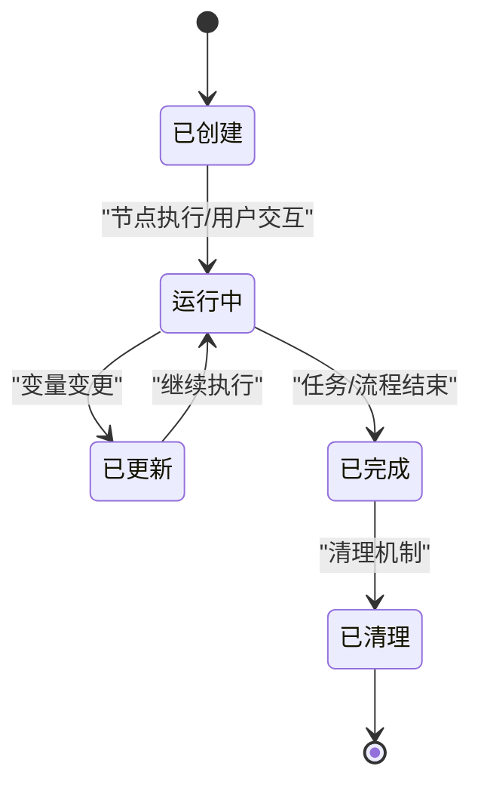
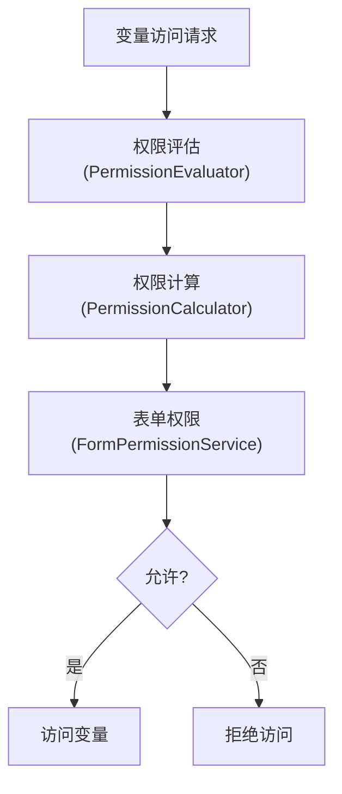
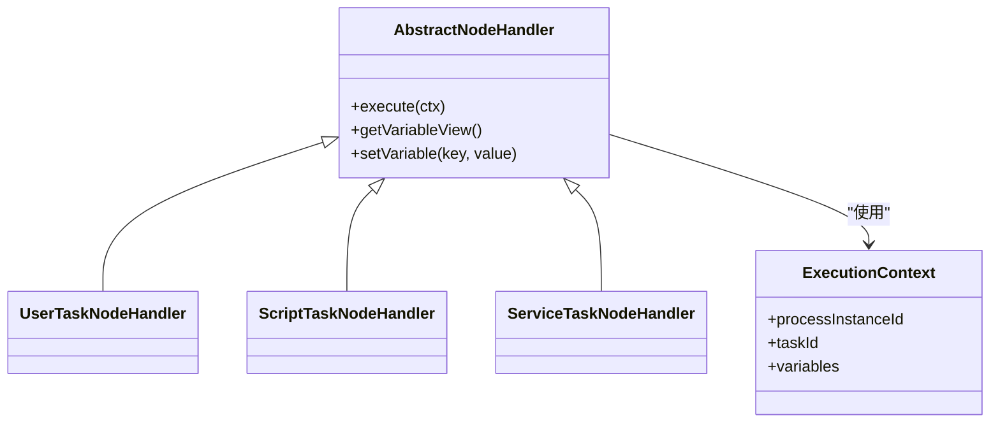
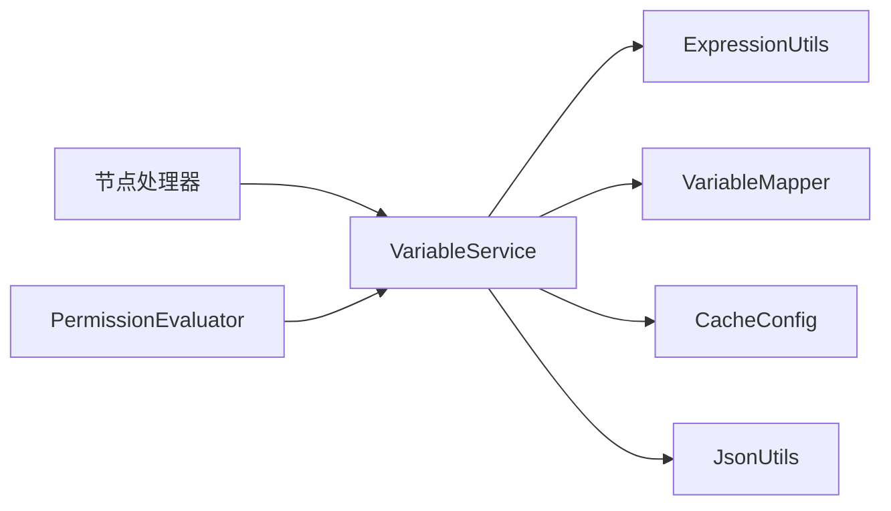

# 变量管理系统

<cite>
**本文引用的文件**   
- [Variable.java](file://flow-engine/src/main/java/com/flow/engine/entity/Variable.java)
- [VariableMapper.java](file://flow-engine/src/main/java/com/flow/engine/mapper/VariableMapper.java)
- [VariableService.java](file://flow-engine/src/main/java/com/flow/engine/service/VariableService.java)
- [ExpressionUtils.java](file://flow-engine/src/main/java/com/flow/engine/common/utils/ExpressionUtils.java)
- [ProcessInstanceService.java](file://flow-engine/src/main/java/com/flow/engine/service/ProcessInstanceService.java)
- [TaskService.java](file://flow-engine/src/main/java/com/flow/engine/service/TaskService.java)
- [UserTaskNodeHandler.java](file://flow-engine/src/main/java/com/flow/engine/node/impl/UserTaskNodeHandler.java)
- [ScriptTaskNodeHandler.java](file://flow-engine/src/main/java/com/flow/engine/node/impl/ScriptTaskNodeHandler.java)
- [ServiceTaskNodeHandler.java](file://flow-engine/src/main/java/com/flow/engine/node/impl/ServiceTaskNodeHandler.java)
- [AbstractNodeHandler.java](file://flow-engine/src/main/java/com/flow/engine/node/AbstractNodeHandler.java)
- [ExecutionContext.java](file://flow-engine/src/main/java/com/flow/engine/node/ExecutionContext.java)
- [CacheConfig.java](file://flow-engine/src/main/java/com/flow/engine/config/CacheConfig.java)
- [application.yml](file://flow-engine/src/main/resources/application.yml)
- [schema.sql](file://flow-engine/src/main/resources/db/schema.sql)
- [ProcessController.java](file://flow-engine/src/main/java/com/flow/engine/controller/ProcessController.java)
- [ProcessInstanceController.java](file://flow-engine/src/main/java/com/flow/engine/controller/ProcessInstanceController.java)
- [TaskController.java](file://flow-engine/src/main/java/com/flow/engine/controller/TaskController.java)
- [StartProcessRequest.java](file://flow-engine/src/main/java/com/flow/engine/dto/StartProcessRequest.java)
- [CompleteTaskRequest.java](file://flow-engine/src/main/java/com/flow/engine/dto/CompleteTaskRequest.java)
- [ClaimTaskRequest.java](file://flow-engine/src/main/java/com/flow/engine/dto/ClaimTaskRequest.java)
- [TransferTaskRequest.java](file://flow-engine/src/main/java/com/flow/engine/dto/TransferTaskRequest.java)
- [RejectTaskRequest.java](file://flow-engine/src/main/java/com/flow/engine/dto/RejectTaskRequest.java)
- [PermissionEvaluator.java](file://flow-engine/src/main/java/com/flow/engine/service/PermissionEvaluator.java)
- [PermissionCalculator.java](file://flow-engine/src/main/java/com/flow/engine/service/PermissionCalculator.java)
- [FormPermissionService.java](file://flow-engine/src/main/java/com/flow/engine/service/FormPermissionService.java)
- [JsonUtils.java](file://flow-engine/src/main/java/com/flow/engine/common/utils/JsonUtils.java)
</cite>

## 目录
1. [简介](#简介)
2. [项目结构](#项目结构)
3. [核心组件](#核心组件)
4. [架构总览](#架构总览)
5. [详细组件分析](#详细组件分析)
6. [依赖关系分析](#依赖关系分析)
7. [性能考虑](#性能考虑)
8. [故障排查指南](#故障排查指南)
9. [结论](#结论)
10. [附录：API与示例](#附录api与示例)

## 简介
本技术文档围绕“变量管理系统”展开，聚焦流程变量的作用域层次（全局、流程实例、任务）、数据类型与序列化存储、缓存策略、表达式引擎（SpEL）解析与扩展、变量生命周期管理、权限控制与安全访问，以及最佳实践与性能优化建议。文档同时提供完整的API接口说明与实际使用示例，帮助读者快速理解并高效使用变量能力。

## 项目结构
变量相关能力主要分布在以下模块与包中：
- 实体与持久化：entity.Variable、mapper.VariableMapper、resources/db/schema.sql
- 服务层：service.VariableService、service.ProcessInstanceService、service.TaskService
- 节点执行器：node.impl.UserTaskNodeHandler、ScriptTaskNodeHandler、ServiceTaskNodeHandler、node.AbstractNodeHandler、node.ExecutionContext
- 表达式工具：common.utils.ExpressionUtils
- 配置与缓存：config.CacheConfig、resources/application.yml
- 控制器与DTO：controller.*、dto.*（启动、完成任务等请求体）
- 权限与安全：service.PermissionEvaluator、PermissionCalculator、FormPermissionService

图表来源
- [ProcessController.java](file://flow-engine/src/main/java/com/flow/engine/controller/ProcessController.java)
- [ProcessInstanceController.java](file://flow-engine/src/main/java/com/flow/engine/controller/ProcessInstanceController.java)
- [TaskController.java](file://flow-engine/src/main/java/com/flow/engine/controller/TaskController.java)
- [ProcessInstanceService.java](file://flow-engine/src/main/java/com/flow/engine/service/ProcessInstanceService.java)
- [TaskService.java](file://flow-engine/src/main/java/com/flow/engine/service/TaskService.java)
- [VariableService.java](file://flow-engine/src/main/java/com/flow/engine/service/VariableService.java)
- [VariableMapper.java](file://flow-engine/src/main/java/com/flow/engine/mapper/VariableMapper.java)
- [Variable.java](file://flow-engine/src/main/java/com/flow/engine/entity/Variable.java)
- [schema.sql](file://flow-engine/src/main/resources/db/schema.sql)
- [CacheConfig.java](file://flow-engine/src/main/java/com/flow/engine/config/CacheConfig.java)
- [application.yml](file://flow-engine/src/main/resources/application.yml)
- [ExpressionUtils.java](file://flow-engine/src/main/java/com/flow/engine/common/utils/ExpressionUtils.java)
- [JsonUtils.java](file://flow-engine/src/main/java/com/flow/engine/common/utils/JsonUtils.java)
- [AbstractNodeHandler.java](file://flow-engine/src/main/java/com/flow/engine/node/AbstractNodeHandler.java)
- [UserTaskNodeHandler.java](file://flow-engine/src/main/java/com/flow/engine/node/impl/UserTaskNodeHandler.java)
- [ScriptTaskNodeHandler.java](file://flow-engine/src/main/java/com/flow/engine/node/impl/ScriptTaskNodeHandler.java)
- [ServiceTaskNodeHandler.java](file://flow-engine/src/main/java/com/flow/engine/node/impl/ServiceTaskNodeHandler.java)
- [ExecutionContext.java](file://flow-engine/src/main/java/com/flow/engine/node/ExecutionContext.java)
- [PermissionEvaluator.java](file://flow-engine/src/main/java/com/flow/engine/service/PermissionEvaluator.java)
- [PermissionCalculator.java](file://flow-engine/src/main/java/com/flow/engine/service/PermissionCalculator.java)
- [FormPermissionService.java](file://flow-engine/src/main/java/com/flow/engine/service/FormPermissionService.java)

章节来源
- [Variable.java](file://flow-engine/src/main/java/com/flow/engine/entity/Variable.java)
- [VariableMapper.java](file://flow-engine/src/main/java/com/flow/engine/mapper/VariableMapper.java)
- [VariableService.java](file://flow-engine/src/main/java/com/flow/engine/service/VariableService.java)
- [ExpressionUtils.java](file://flow-engine/src/main/java/com/flow/engine/common/utils/ExpressionUtils.java)
- [ProcessInstanceService.java](file://flow-engine/src/main/java/com/flow/engine/service/ProcessInstanceService.java)
- [TaskService.java](file://flow-engine/src/main/java/com/flow/engine/service/TaskService.java)
- [UserTaskNodeHandler.java](file://flow-engine/src/main/java/com/flow/engine/node/impl/UserTaskNodeHandler.java)
- [ScriptTaskNodeHandler.java](file://flow-engine/src/main/java/com/flow/engine/node/impl/ScriptTaskNodeHandler.java)
- [ServiceTaskNodeHandler.java](file://flow-engine/src/main/java/com/flow/engine/node/impl/ServiceTaskNodeHandler.java)
- [AbstractNodeHandler.java](file://flow-engine/src/main/java/com/flow/engine/node/AbstractNodeHandler.java)
- [ExecutionContext.java](file://flow-engine/src/main/java/com/flow/engine/node/ExecutionContext.java)
- [CacheConfig.java](file://flow-engine/src/main/java/com/flow/engine/config/CacheConfig.java)
- [application.yml](file://flow-engine/src/main/resources/application.yml)
- [schema.sql](file://flow-engine/src/main/resources/db/schema.sql)
- [PermissionEvaluator.java](file://flow-engine/src/main/java/com/flow/engine/service/PermissionEvaluator.java)
- [PermissionCalculator.java](file://flow-engine/src/main/java/com/flow/engine/service/PermissionCalculator.java)
- [FormPermissionService.java](file://flow-engine/src/main/java/com/flow/engine/service/FormPermissionService.java)

## 核心组件
- 变量实体与持久化
  - Variable实体定义变量键、值、类型与作用域标识；VariableMapper负责CRUD；schema.sql定义表结构与索引。
- 变量服务
  - VariableService封装变量读写、批量操作、按作用域查询、表达式求值后的落库与缓存更新。
- 表达式工具
  - ExpressionUtils提供SpEL解析与函数扩展点，支持在流程与表单中动态计算变量。
- 节点执行上下文
  - ExecutionContext维护当前流程实例与任务的变量视图，抽象出“全局/实例/任务”三层作用域。
- 节点处理器
  - UserTask/ScriptTask/ServiceTask在执行前后读写变量，驱动变量生命周期流转。
- 权限与安全
  - PermissionEvaluator/PermissionCalculator/FormPermissionService协同完成变量可见性与写入权限校验。

章节来源
- [Variable.java](file://flow-engine/src/main/java/com/flow/engine/entity/Variable.java)
- [VariableMapper.java](file://flow-engine/src/main/java/com/flow/engine/mapper/VariableMapper.java)
- [VariableService.java](file://flow-engine/src/main/java/com/flow/engine/service/VariableService.java)
- [ExpressionUtils.java](file://flow-engine/src/main/java/com/flow/engine/common/utils/ExpressionUtils.java)
- [ExecutionContext.java](file://flow-engine/src/main/java/com/flow/engine/node/ExecutionContext.java)
- [UserTaskNodeHandler.java](file://flow-engine/src/main/java/com/flow/engine/node/impl/UserTaskNodeHandler.java)
- [ScriptTaskNodeHandler.java](file://flow-engine/src/main/java/com/flow/engine/node/impl/ScriptTaskNodeHandler.java)
- [ServiceTaskNodeHandler.java](file://flow-engine/src/main/java/com/flow/engine/node/impl/ServiceTaskNodeHandler.java)
- [PermissionEvaluator.java](file://flow-engine/src/main/java/com/flow/engine/service/PermissionEvaluator.java)
- [PermissionCalculator.java](file://flow-engine/src/main/java/com/flow/engine/service/PermissionCalculator.java)
- [FormPermissionService.java](file://flow-engine/src/main/java/com/flow/engine/service/FormPermissionService.java)

## 架构总览
变量系统采用分层架构：控制器接收HTTP请求，服务层编排业务逻辑，节点执行器在流程推进过程中读写变量，持久层通过MyBatis Plus映射到数据库，缓存层提升热点变量读取性能，表达式引擎为动态计算提供支撑，权限模块保障安全访问。

图表来源
- [ProcessController.java](file://flow-engine/src/main/java/com/flow/engine/controller/ProcessController.java)
- [ProcessInstanceController.java](file://flow-engine/src/main/java/com/flow/engine/controller/ProcessInstanceController.java)
- [TaskController.java](file://flow-engine/src/main/java/com/flow/engine/controller/TaskController.java)
- [ProcessInstanceService.java](file://flow-engine/src/main/java/com/flow/engine/service/ProcessInstanceService.java)
- [TaskService.java](file://flow-engine/src/main/java/com/flow/engine/service/TaskService.java)
- [VariableService.java](file://flow-engine/src/main/java/com/flow/engine/service/VariableService.java)
- [ExpressionUtils.java](file://flow-engine/src/main/java/com/flow/engine/common/utils/ExpressionUtils.java)
- [VariableMapper.java](file://flow-engine/src/main/java/com/flow/engine/mapper/VariableMapper.java)
- [UserTaskNodeHandler.java](file://flow-engine/src/main/java/com/flow/engine/node/impl/UserTaskNodeHandler.java)
- [ScriptTaskNodeHandler.java](file://flow-engine/src/main/java/com/flow/engine/node/impl/ScriptTaskNodeHandler.java)
- [ServiceTaskNodeHandler.java](file://flow-engine/src/main/java/com/flow/engine/node/impl/ServiceTaskNodeHandler.java)

## 详细组件分析

### 变量作用域层次结构
- 全局变量：跨所有流程实例共享，适合系统级配置、字典、常量等。
- 流程实例变量：绑定到单个流程实例，贯穿该实例的整个生命周期，用于承载业务主数据。
- 任务变量：仅在当前任务范围内可见，适合临时计算中间结果、审批意见等。

作用域解析顺序遵循“就近优先”原则：任务变量 > 流程实例变量 > 全局变量。当同名变量在不同作用域存在时，上层覆盖下层。

章节来源
- [ExecutionContext.java](file://flow-engine/src/main/java/com/flow/engine/node/ExecutionContext.java)
- [VariableService.java](file://flow-engine/src/main/java/com/flow/engine/service/VariableService.java)

### 数据类型支持与序列化存储
- 支持的数据类型包括基础类型、集合、Map及自定义对象。
- 序列化策略：统一通过JSON序列化工具进行持久化存储，确保跨语言与版本兼容。
- 反序列化：读取时根据元信息或类型推断还原为Java对象，供表达式与业务使用。

图表来源
- [Variable.java](file://flow-engine/src/main/java/com/flow/engine/entity/Variable.java)
- [JsonUtils.java](file://flow-engine/src/main/java/com/flow/engine/common/utils/JsonUtils.java)
- [VariableMapper.java](file://flow-engine/src/main/java/com/flow/engine/mapper/VariableMapper.java)

章节来源
- [Variable.java](file://flow-engine/src/main/java/com/flow/engine/entity/Variable.java)
- [JsonUtils.java](file://flow-engine/src/main/java/com/flow/engine/common/utils/JsonUtils.java)
- [VariableMapper.java](file://flow-engine/src/main/java/com/flow/engine/mapper/VariableMapper.java)
- [schema.sql](file://flow-engine/src/main/resources/db/schema.sql)

### 缓存策略
- 缓存粒度：以“作用域+键”为维度缓存变量快照，减少重复读库。
- 失效时机：变量写操作后主动失效对应缓存；流程实例结束或任务完成后清理相关缓存。
- 配置项：通过配置文件控制缓存过期时间与最大容量。

图表来源
- [VariableService.java](file://flow-engine/src/main/java/com/flow/engine/service/VariableService.java)
- [CacheConfig.java](file://flow-engine/src/main/java/com/flow/engine/config/CacheConfig.java)
- [application.yml](file://flow-engine/src/main/resources/application.yml)

章节来源
- [VariableService.java](file://flow-engine/src/main/java/com/flow/engine/service/VariableService.java)
- [CacheConfig.java](file://flow-engine/src/main/java/com/flow/engine/config/CacheConfig.java)
- [application.yml](file://flow-engine/src/main/resources/application.yml)

### 表达式引擎实现原理
- SpEL解析：基于Spring Expression Language，支持属性访问、方法调用、运算符与集合操作。
- 函数扩展：通过注册自定义函数，暴露业务方法给表达式使用，如日期格式化、金额计算等。
- 安全沙箱：限制危险类与方法访问，避免表达式注入风险。
- 执行上下文：将变量视图、用户上下文、流程上下文注入到表达式环境。

图表来源
- [ExpressionUtils.java](file://flow-engine/src/main/java/com/flow/engine/common/utils/ExpressionUtils.java)
- [VariableService.java](file://flow-engine/src/main/java/com/flow/engine/service/VariableService.java)
- [UserTaskNodeHandler.java](file://flow-engine/src/main/java/com/flow/engine/node/impl/UserTaskNodeHandler.java)
- [ScriptTaskNodeHandler.java](file://flow-engine/src/main/java/com/flow/engine/node/impl/ScriptTaskNodeHandler.java)
- [ServiceTaskNodeHandler.java](file://flow-engine/src/main/java/com/flow/engine/node/impl/ServiceTaskNodeHandler.java)

章节来源
- [ExpressionUtils.java](file://flow-engine/src/main/java/com/flow/engine/common/utils/ExpressionUtils.java)
- [VariableService.java](file://flow-engine/src/main/java/com/flow/engine/service/VariableService.java)
- [UserTaskNodeHandler.java](file://flow-engine/src/main/java/com/flow/engine/node/impl/UserTaskNodeHandler.java)
- [ScriptTaskNodeHandler.java](file://flow-engine/src/main/java/com/flow/engine/node/impl/ScriptTaskNodeHandler.java)
- [ServiceTaskNodeHandler.java](file://flow-engine/src/main/java/com/flow/engine/node/impl/ServiceTaskNodeHandler.java)

### 变量生命周期管理
- 创建：流程启动时初始化流程级变量；任务进入时创建任务级变量视图。
- 更新：节点执行或用户提交表单时更新变量，触发缓存失效与持久化。
- 删除：任务完成或回退时清理任务级变量；流程结束时清理实例级变量。
- 清理：定时任务或事件监听器回收历史变量快照，释放资源。

图表来源
- [VariableService.java](file://flow-engine/src/main/java/com/flow/engine/service/VariableService.java)
- [UserTaskNodeHandler.java](file://flow-engine/src/main/java/com/flow/engine/node/impl/UserTaskNodeHandler.java)
- [ScriptTaskNodeHandler.java](file://flow-engine/src/main/java/com/flow/engine/node/impl/ScriptTaskNodeHandler.java)
- [ServiceTaskNodeHandler.java](file://flow-engine/src/main/java/com/flow/engine/node/impl/ServiceTaskNodeHandler.java)

章节来源
- [VariableService.java](file://flow-engine/src/main/java/com/flow/engine/service/VariableService.java)
- [UserTaskNodeHandler.java](file://flow-engine/src/main/java/com/flow/engine/node/impl/UserTaskNodeHandler.java)
- [ScriptTaskNodeHandler.java](file://flow-engine/src/main/java/com/flow/engine/node/impl/ScriptTaskNodeHandler.java)
- [ServiceTaskNodeHandler.java](file://flow-engine/src/main/java/com/flow/engine/node/impl/ServiceTaskNodeHandler.java)

### 权限控制与访问安全
- 变量可见性：基于角色、部门、数据权限计算变量是否对当前用户可见。
- 写入权限：校验当前用户对目标作用域的变量是否有修改权。
- 表单字段级权限：结合表单权限服务，控制字段展示与编辑。
- 审计与日志：记录关键变量变更，便于追溯。

图表来源
- [PermissionEvaluator.java](file://flow-engine/src/main/java/com/flow/engine/service/PermissionEvaluator.java)
- [PermissionCalculator.java](file://flow-engine/src/main/java/com/flow/engine/service/PermissionCalculator.java)
- [FormPermissionService.java](file://flow-engine/src/main/java/com/flow/engine/service/FormPermissionService.java)
- [VariableService.java](file://flow-engine/src/main/java/com/flow/engine/service/VariableService.java)

章节来源
- [PermissionEvaluator.java](file://flow-engine/src/main/java/com/flow/engine/service/PermissionEvaluator.java)
- [PermissionCalculator.java](file://flow-engine/src/main/java/com/flow/engine/service/PermissionCalculator.java)
- [FormPermissionService.java](file://flow-engine/src/main/java/com/flow/engine/service/FormPermissionService.java)
- [VariableService.java](file://flow-engine/src/main/java/com/flow/engine/service/VariableService.java)

### 节点处理器中的变量使用
- 用户任务：在任务创建与完成时读写任务级变量，如审批意见、处理人等。
- 脚本任务：执行Groovy/JS脚本，通过表达式引擎访问变量并进行计算。
- 服务任务：调用外部服务前组装参数变量，服务返回后更新结果变量。

图表来源
- [AbstractNodeHandler.java](file://flow-engine/src/main/java/com/flow/engine/node/AbstractNodeHandler.java)
- [UserTaskNodeHandler.java](file://flow-engine/src/main/java/com/flow/engine/node/impl/UserTaskNodeHandler.java)
- [ScriptTaskNodeHandler.java](file://flow-engine/src/main/java/com/flow/engine/node/impl/ScriptTaskNodeHandler.java)
- [ServiceTaskNodeHandler.java](file://flow-engine/src/main/java/com/flow/engine/node/impl/ServiceTaskNodeHandler.java)
- [ExecutionContext.java](file://flow-engine/src/main/java/com/flow/engine/node/ExecutionContext.java)

章节来源
- [AbstractNodeHandler.java](file://flow-engine/src/main/java/com/flow/engine/node/AbstractNodeHandler.java)
- [UserTaskNodeHandler.java](file://flow-engine/src/main/java/com/flow/engine/node/impl/UserTaskNodeHandler.java)
- [ScriptTaskNodeHandler.java](file://flow-engine/src/main/java/com/flow/engine/node/impl/ScriptTaskNodeHandler.java)
- [ServiceTaskNodeHandler.java](file://flow-engine/src/main/java/com/flow/engine/node/impl/ServiceTaskNodeHandler.java)
- [ExecutionContext.java](file://flow-engine/src/main/java/com/flow/engine/node/ExecutionContext.java)

## 依赖关系分析
- 低耦合高内聚：VariableService作为变量领域核心，聚合表达式、序列化、持久化与缓存能力。
- 节点处理器与服务解耦：通过ExecutionContext与VariableService间接交互，避免直接依赖底层存储。
- 权限模块独立：权限评估与计算可复用至其他业务场景。

图表来源
- [VariableService.java](file://flow-engine/src/main/java/com/flow/engine/service/VariableService.java)
- [ExpressionUtils.java](file://flow-engine/src/main/java/com/flow/engine/common/utils/ExpressionUtils.java)
- [VariableMapper.java](file://flow-engine/src/main/java/com/flow/engine/mapper/VariableMapper.java)
- [CacheConfig.java](file://flow-engine/src/main/java/com/flow/engine/config/CacheConfig.java)
- [JsonUtils.java](file://flow-engine/src/main/java/com/flow/engine/common/utils/JsonUtils.java)
- [AbstractNodeHandler.java](file://flow-engine/src/main/java/com/flow/engine/node/AbstractNodeHandler.java)
- [PermissionEvaluator.java](file://flow-engine/src/main/java/com/flow/engine/service/PermissionEvaluator.java)

章节来源
- [VariableService.java](file://flow-engine/src/main/java/com/flow/engine/service/VariableService.java)
- [ExpressionUtils.java](file://flow-engine/src/main/java/com/flow/engine/common/utils/ExpressionUtils.java)
- [VariableMapper.java](file://flow-engine/src/main/java/com/flow/engine/mapper/VariableMapper.java)
- [CacheConfig.java](file://flow-engine/src/main/java/com/flow/engine/config/CacheConfig.java)
- [JsonUtils.java](file://flow-engine/src/main/java/com/flow/engine/common/utils/JsonUtils.java)
- [AbstractNodeHandler.java](file://flow-engine/src/main/java/com/flow/engine/node/AbstractNodeHandler.java)
- [PermissionEvaluator.java](file://flow-engine/src/main/java/com/flow/engine/service/PermissionEvaluator.java)

## 性能考虑
- 合理划分作用域：尽量使用任务级变量承载短期数据，减少实例级变量膨胀。
- 批量读写：合并多次变量更新为一次批量操作，降低IO次数。
- 表达式优化：避免复杂嵌套与频繁GC对象，预编译常用表达式。
- 缓存调优：依据热点变量调整TTL与容量，避免缓存穿透与雪崩。
- 序列化体积：大对象分片存储或使用流式处理，减少内存占用。

[本节为通用指导，不直接分析具体文件]

## 故障排查指南
- 变量未生效
  - 检查作用域是否正确、变量名是否冲突、表达式语法是否合法。
- 权限拒绝
  - 确认当前用户角色与数据权限，核对表单字段级权限配置。
- 性能问题
  - 观察缓存命中率与数据库慢查询，定位热点变量与复杂表达式。
- 序列化异常
  - 检查对象是否实现序列化接口、字段是否可序列化、版本兼容性。

章节来源
- [VariableService.java](file://flow-engine/src/main/java/com/flow/engine/service/VariableService.java)
- [ExpressionUtils.java](file://flow-engine/src/main/java/com/flow/engine/common/utils/ExpressionUtils.java)
- [PermissionEvaluator.java](file://flow-engine/src/main/java/com/flow/engine/service/PermissionEvaluator.java)
- [JsonUtils.java](file://flow-engine/src/main/java/com/flow/engine/common/utils/JsonUtils.java)

## 结论
变量管理系统通过清晰的作用域模型、健壮的表达式引擎、完善的权限控制与高效的缓存策略，为流程引擎提供了灵活且安全的变量能力。遵循本文的最佳实践与性能建议，可在保证一致性的前提下获得良好的吞吐与响应表现。

[本节为总结，不直接分析具体文件]

## 附录：API与示例

### 启动流程（含初始变量）
- 端点：POST /process/start
- 请求体：StartProcessRequest（包含流程定义ID、初始变量等）
- 行为：创建流程实例，设置流程级变量，触发首个节点

章节来源
- [ProcessController.java](file://flow-engine/src/main/java/com/flow/engine/controller/ProcessController.java)
- [StartProcessRequest.java](file://flow-engine/src/main/java/com/flow/engine/dto/StartProcessRequest.java)
- [ProcessInstanceService.java](file://flow-engine/src/main/java/com/flow/engine/service/ProcessInstanceService.java)
- [VariableService.java](file://flow-engine/src/main/java/com/flow/engine/service/VariableService.java)

### 领取任务
- 端点：POST /task/claim
- 请求体：ClaimTaskRequest（任务ID、执行人等）
- 行为：分配任务，创建任务级变量视图

章节来源
- [TaskController.java](file://flow-engine/src/main/java/com/flow/engine/controller/TaskController.java)
- [ClaimTaskRequest.java](file://flow-engine/src/main/java/com/flow/engine/dto/ClaimTaskRequest.java)
- [TaskService.java](file://flow-engine/src/main/java/com/flow/engine/service/TaskService.java)
- [VariableService.java](file://flow-engine/src/main/java/com/flow/engine/service/VariableService.java)

### 完成任务（提交表单变量）
- 端点：POST /task/complete
- 请求体：CompleteTaskRequest（任务ID、表单变量等）
- 行为：校验权限，更新任务级变量，推进流程

章节来源
- [TaskController.java](file://flow-engine/src/main/java/com/flow/engine/controller/TaskController.java)
- [CompleteTaskRequest.java](file://flow-engine/src/main/java/com/flow/engine/dto/CompleteTaskRequest.java)
- [TaskService.java](file://flow-engine/src/main/java/com/flow/engine/service/TaskService.java)
- [VariableService.java](file://flow-engine/src/main/java/com/flow/engine/service/VariableService.java)

### 转派任务
- 端点：POST /task/transfer
- 请求体：TransferTaskRequest（任务ID、新处理人、备注变量等）
- 行为：更新任务处理人与相关变量

章节来源
- [TaskController.java](file://flow-engine/src/main/java/com/flow/engine/controller/TaskController.java)
- [TransferTaskRequest.java](file://flow-engine/src/main/java/com/flow/engine/dto/TransferTaskRequest.java)
- [TaskService.java](file://flow-engine/src/main/java/com/flow/engine/service/TaskService.java)
- [VariableService.java](file://flow-engine/src/main/java/com/flow/engine/service/VariableService.java)

### 退回任务
- 端点：POST /task/reject
- 请求体：RejectTaskRequest（任务ID、退回原因变量等）
- 行为：回退流程节点，更新相关变量

章节来源
- [TaskController.java](file://flow-engine/src/main/java/com/flow/engine/controller/TaskController.java)
- [RejectTaskRequest.java](file://flow-engine/src/main/java/com/flow/engine/dto/RejectTaskRequest.java)
- [TaskService.java](file://flow-engine/src/main/java/com/flow/engine/service/TaskService.java)
- [VariableService.java](file://flow-engine/src/main/java/com/flow/engine/service/VariableService.java)

### 实际使用示例（步骤）
- 启动流程时传入初始变量（如申请人、申请金额），由流程实例持有。
- 在用户任务中填写审批意见与附件链接，保存为任务级变量。
- 在脚本或服务任务中使用表达式引用流程与任务变量进行计算与决策。
- 流程结束后，相关变量随实例归档，便于审计与分析。

章节来源
- [ProcessInstanceService.java](file://flow-engine/src/main/java/com/flow/engine/service/ProcessInstanceService.java)
- [TaskService.java](file://flow-engine/src/main/java/com/flow/engine/service/TaskService.java)
- [VariableService.java](file://flow-engine/src/main/java/com/flow/engine/service/VariableService.java)
- [ExpressionUtils.java](file://flow-engine/src/main/java/com/flow/engine/common/utils/ExpressionUtils.java)
- [UserTaskNodeHandler.java](file://flow-engine/src/main/java/com/flow/engine/node/impl/UserTaskNodeHandler.java)
- [ScriptTaskNodeHandler.java](file://flow-engine/src/main/java/com/flow/engine/node/impl/ScriptTaskNodeHandler.java)
- [ServiceTaskNodeHandler.java](file://flow-engine/src/main/java/com/flow/engine/node/impl/ServiceTaskNodeHandler.java)