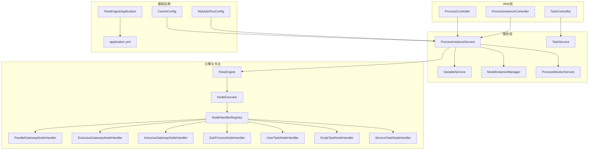
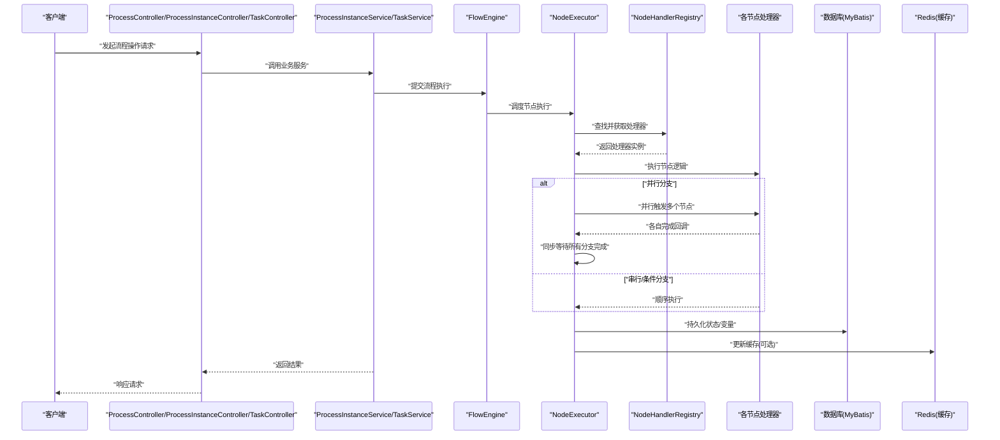
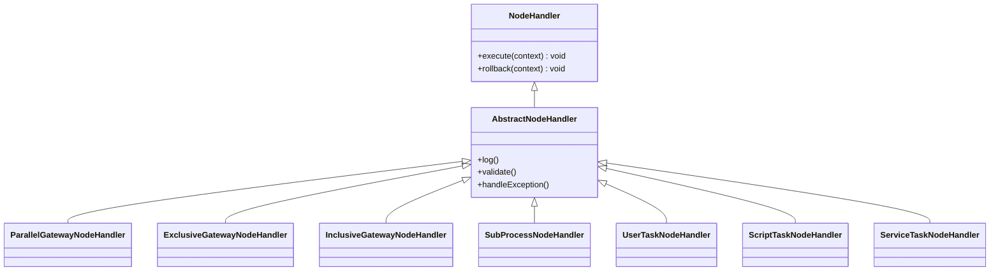
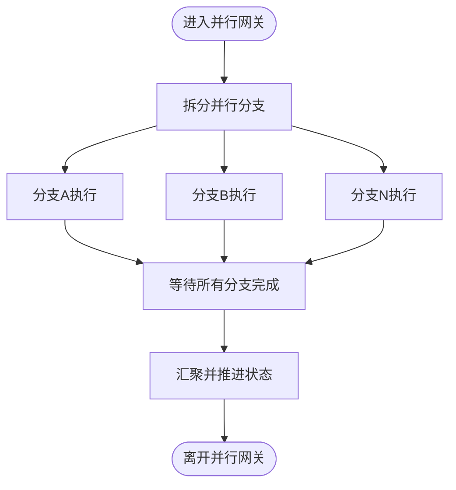
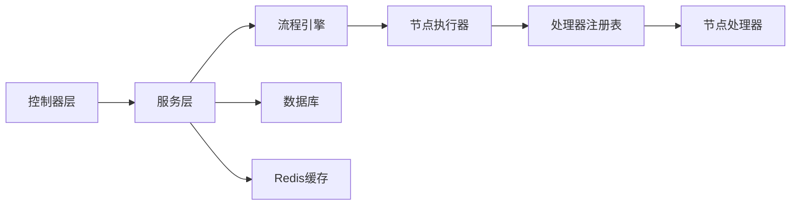

# 并发控制

<cite>
**本文引用的文件**   
- [FlowEngineApplication.java](file://flow-engine/src/main/java/com/flow/engine/FlowEngineApplication.java)
- [application.yml](file://flow-engine/src/main/resources/application.yml)
- [ProcessInstanceService.java](file://flow-engine/src/main/java/com/flow/engine/service/ProcessInstanceService.java)
- [TaskService.java](file://flow-engine/src/main/java/com/flow/engine/service/TaskService.java)
- [WebhookScheduler.java](file://flow-engine/src/main/java/com/flow/engine/service/WebhookScheduler.java)
- [CacheConfig.java](file://flow-engine/src/main/java/com/flow/engine/config/CacheConfig.java)
- [MybatisPlusConfig.java](file://flow-engine/src/main/java/com/flow/engine/config/MybatisPlusConfig.java)
- [RequestContext.java](file://flow-engine/src/main/java/com/flow/engine/common/RequestContext.java)
- [RequestIdFilter.java](file://flow-engine/src/main/java/com/flow/engine/common/RequestIdFilter.java)
- [NodeHandlerRegistry.java](file://flow-engine/src/main/java/com/flow/engine/node/NodeHandlerRegistry.java)
- [ParallelGatewayNodeHandler.java](file://flow-engine/src/main/java/com/flow/engine/node/impl/ParallelGatewayNodeHandler.java)
- [ExclusiveGatewayNodeHandler.java](file://flow-engine/src/main/java/com/flow/engine/node/impl/ExclusiveGatewayNodeHandler.java)
- [InclusiveGatewayNodeHandler.java](file://flow-engine/src/main/java/com/flow/engine/node/impl/InclusiveGatewayNodeHandler.java)
- [SubProcessNodeHandler.java](file://flow-engine/src/main/java/com/flow/engine/node/impl/SubProcessNodeHandler.java)
- [UserTaskNodeHandler.java](file://flow-engine/src/main/java/com/flow/engine/node/impl/UserTaskNodeHandler.java)
- [ScriptTaskNodeHandler.java](file://flow-engine/src/main/java/com/flow/engine/node/impl/ScriptTaskNodeHandler.java)
- [ServiceTaskNodeHandler.java](file://flow-engine/src/main/java/com/flow/engine/node/impl/ServiceTaskNodeHandler.java)
- [AbstractNodeHandler.java](file://flow-engine/src/main/java/com/flow/engine/node/AbstractNodeHandler.java)
- [NodeHandlerAutoConfiguration.java](file://flow-engine/src/main/java/com/flow/engine/node/NodeHandlerAutoConfiguration.java)
- [FlowEngine.java](file://flow-engine/src/main/java/com/flow/engine/engine/FlowEngine.java)
- [NodeExecutor.java](file://flow-engine/src/main/java/com/flow/engine/engine/NodeExecutor.java)
- [ProcessDefinitionService.java](file://flow-engine/src/main/java/com/flow/engine/service/ProcessDefinitionService.java)
- [VariableService.java](file://flow-engine/src/main/java/com/flow/engine/service/VariableService.java)
- [ModelInstanceManager.java](file://flow-engine/src/main/java/com/flow/engine/service/ModelInstanceManager.java)
- [ProcessMonitorService.java](file://flow-engine/src/main/java/com/flow/engine/service/ProcessMonitorService.java)
- [ProcessController.java](file://flow-engine/src/main/java/com/flow/engine/controller/ProcessController.java)
- [ProcessInstanceController.java](file://flow-engine/src/main/java/com/flow/engine/controller/ProcessInstanceController.java)
- [TaskController.java](file://flow-engine/src/main/java/com/flow/engine/controller/TaskController.java)
- [schema.sql](file://flow-engine/src/main/resources/db/schema.sql)
- [FlowEngineE2ETest.java](file://flow-engine/src/test/java/com/flow/engine/engine/FlowEngineE2ETest.java)
- [BuiltinNodeTest.java](file://flow-engine/src/test/java/com/flow/engine/node/BuiltinNodeTest.java)
- [CustomNodeExtensionTest.java](file://flow-engine/src/test/java/com/flow/engine/node/CustomNodeExtensionTest.java)
- [ExecutionContextTest.java](file://flow-engine/src/test/java/com/flow/engine/node/ExecutionContextTest.java)
- [NodeHandlerAutoRegisterTest.java](file://flow-engine/src/test/java/com/flow/engine/node/NodeHandlerAutoRegisterTest.java)
- [NodeHandlerRegistryTest.java](file://flow-engine/src/test/java/com/flow/engine/node/NodeHandlerRegistryTest.java)
</cite>

## 目录
1. [引言](#引言)
2. [项目结构](#项目结构)
3. [核心组件](#核心组件)
4. [架构总览](#架构总览)
5. [详细组件分析](#详细组件分析)
6. [依赖关系分析](#依赖关系分析)
7. [性能考虑](#性能考虑)
8. [故障排查指南](#故障排查指南)
9. [结论](#结论)
10. [附录](#附录)

## 引言
本文件围绕流程引擎的并发控制机制，系统性阐述线程池与异步执行、同步等待、分布式锁、Redis缓存一致性、数据库事务隔离与死锁预防、请求上下文在多线程中的传递与管理，以及并发性能调优与监控指标。文档同时给出并发测试与压测方案建议，帮助读者在生产环境中稳定运行高并发流程实例。

## 项目结构
后端服务基于Spring Boot，核心并发相关代码分布在以下位置：
- 应用启动与全局配置：应用入口、线程池与缓存配置、MyBatis Plus配置
- 流程执行引擎：流程编排、节点处理器注册与执行
- 业务服务层：流程实例、任务、变量、模型实例等服务的并发控制点
- Web控制器：HTTP入口，承载并发请求
- 数据访问层：数据库表结构与事务边界
- 测试用例：覆盖并发场景与扩展点

图表来源
- [FlowEngineApplication.java](file://flow-engine/src/main/java/com/flow/engine/FlowEngineApplication.java)
- [application.yml](file://flow-engine/src/main/resources/application.yml)
- [ProcessInstanceService.java](file://flow-engine/src/main/java/com/flow/engine/service/ProcessInstanceService.java)
- [TaskService.java](file://flow-engine/src/main/java/com/flow/engine/service/TaskService.java)
- [FlowEngine.java](file://flow-engine/src/main/java/com/flow/engine/engine/FlowEngine.java)
- [NodeExecutor.java](file://flow-engine/src/main/java/com/flow/engine/engine/NodeExecutor.java)
- [NodeHandlerRegistry.java](file://flow-engine/src/main/java/com/flow/engine/node/NodeHandlerRegistry.java)
- [ParallelGatewayNodeHandler.java](file://flow-engine/src/main/java/com/flow/engine/node/impl/ParallelGatewayNodeHandler.java)
- [ExclusiveGatewayNodeHandler.java](file://flow-engine/src/main/java/com/flow/engine/node/impl/ExclusiveGatewayNodeHandler.java)
- [InclusiveGatewayNodeHandler.java](file://flow-engine/src/main/java/com/flow/engine/node/impl/InclusiveGatewayNodeHandler.java)
- [SubProcessNodeHandler.java](file://flow-engine/src/main/java/com/flow/engine/node/impl/SubProcessNodeHandler.java)
- [UserTaskNodeHandler.java](file://flow-engine/src/main/java/com/flow/engine/node/impl/UserTaskNodeHandler.java)
- [ScriptTaskNodeHandler.java](file://flow-engine/src/main/java/com/flow/engine/node/impl/ScriptTaskNodeHandler.java)
- [ServiceTaskNodeHandler.java](file://flow-engine/src/main/java/com/flow/engine/node/impl/ServiceTaskNodeHandler.java)
- [CacheConfig.java](file://flow-engine/src/main/java/com/flow/engine/config/CacheConfig.java)
- [MybatisPlusConfig.java](file://flow-engine/src/main/java/com/flow/engine/config/MybatisPlusConfig.java)

章节来源
- [FlowEngineApplication.java](file://flow-engine/src/main/java/com/flow/engine/FlowEngineApplication.java)
- [application.yml](file://flow-engine/src/main/resources/application.yml)

## 核心组件
- 流程执行引擎（FlowEngine）：负责流程生命周期管理、状态推进与事件发布，是并发控制的中心协调者。
- 节点执行器（NodeExecutor）：统一调度节点处理器，支持并行分支与子流程的并发执行。
- 节点处理器注册表（NodeHandlerRegistry）：集中管理各类节点处理器，提供按类型分发能力。
- 网关处理器（并行/排他/包容）：实现不同分支策略的并发或串行选择逻辑。
- 用户任务与服务任务处理器：封装外部交互与脚本执行的并发行为。
- 服务层（ProcessInstanceService、TaskService、VariableService、ModelInstanceManager）：封装业务流程的并发边界、锁与事务。
- 配置层（CacheConfig、MybatisPlusConfig、application.yml）：定义缓存、数据库与线程池参数。

章节来源
- [FlowEngine.java](file://flow-engine/src/main/java/com/flow/engine/engine/FlowEngine.java)
- [NodeExecutor.java](file://flow-engine/src/main/java/com/flow/engine/engine/NodeExecutor.java)
- [NodeHandlerRegistry.java](file://flow-engine/src/main/java/com/flow/engine/node/NodeHandlerRegistry.java)
- [ParallelGatewayNodeHandler.java](file://flow-engine/src/main/java/com/flow/engine/node/impl/ParallelGatewayNodeHandler.java)
- [ExclusiveGatewayNodeHandler.java](file://flow-engine/src/main/java/com/flow/engine/node/impl/ExclusiveGatewayNodeHandler.java)
- [InclusiveGatewayNodeHandler.java](file://flow-engine/src/main/java/com/flow/engine/node/impl/InclusiveGatewayNodeHandler.java)
- [UserTaskNodeHandler.java](file://flow-engine/src/main/java/com/flow/engine/node/impl/UserTaskNodeHandler.java)
- [ServiceTaskNodeHandler.java](file://flow-engine/src/main/java/com/flow/engine/node/impl/ServiceTaskNodeHandler.java)
- [ScriptTaskNodeHandler.java](file://flow-engine/src/main/java/com/flow/engine/node/impl/ScriptTaskNodeHandler.java)
- [ProcessInstanceService.java](file://flow-engine/src/main/java/com/flow/engine/service/ProcessInstanceService.java)
- [TaskService.java](file://flow-engine/src/main/java/com/flow/engine/service/TaskService.java)
- [VariableService.java](file://flow-engine/src/main/java/com/flow/engine/service/VariableService.java)
- [ModelInstanceManager.java](file://flow-engine/src/main/java/com/flow/engine/service/ModelInstanceManager.java)
- [CacheConfig.java](file://flow-engine/src/main/java/com/flow/engine/config/CacheConfig.java)
- [MybatisPlusConfig.java](file://flow-engine/src/main/java/com/flow/engine/config/MybatisPlusConfig.java)

## 架构总览
下图展示从HTTP请求到流程执行的并发路径，包括线程池、异步执行与同步汇聚的关键环节。

图表来源
- [ProcessController.java](file://flow-engine/src/main/java/com/flow/engine/controller/ProcessController.java)
- [ProcessInstanceController.java](file://flow-engine/src/main/java/com/flow/engine/controller/ProcessInstanceController.java)
- [TaskController.java](file://flow-engine/src/main/java/com/flow/engine/controller/TaskController.java)
- [ProcessInstanceService.java](file://flow-engine/src/main/java/com/flow/engine/service/ProcessInstanceService.java)
- [TaskService.java](file://flow-engine/src/main/java/com/flow/engine/service/TaskService.java)
- [FlowEngine.java](file://flow-engine/src/main/java/com/flow/engine/engine/FlowEngine.java)
- [NodeExecutor.java](file://flow-engine/src/main/java/com/flow/engine/engine/NodeExecutor.java)
- [NodeHandlerRegistry.java](file://flow-engine/src/main/java/com/flow/engine/node/NodeHandlerRegistry.java)
- [ParallelGatewayNodeHandler.java](file://flow-engine/src/main/java/com/flow/engine/node/impl/ParallelGatewayNodeHandler.java)
- [ExclusiveGatewayNodeHandler.java](file://flow-engine/src/main/java/com/flow/engine/node/impl/ExclusiveGatewayNodeHandler.java)
- [InclusiveGatewayNodeHandler.java](file://flow-engine/src/main/java/com/flow/engine/node/impl/InclusiveGatewayNodeHandler.java)

## 详细组件分析

### 线程池与异步执行
- 线程池配置
  - 通过配置文件定义线程池参数（核心线程数、最大线程数、队列容量、拒绝策略、超时时间），以适配不同负载场景。
  - 在应用启动时加载配置，创建可复用的线程池实例供异步任务使用。
- 异步执行与同步等待
  - 引擎在执行并行分支时，将各分支任务提交至线程池，并使用同步屏障（如CountDownLatch或CompletableFuture.allOf）等待全部分支完成后再继续后续步骤。
  - 对于耗时I/O（如外部API调用、消息发送），采用异步执行降低主线程阻塞。
- 关键实现位置
  - 线程池与异步执行：参考[application.yml](file://flow-engine/src/main/resources/application.yml)、[WebhookScheduler.java](file://flow-engine/src/main/java/com/flow/engine/service/WebhookScheduler.java)
  - 并行分支与汇聚：参考[ParallelGatewayNodeHandler.java](file://flow-engine/src/main/java/com/flow/engine/node/impl/ParallelGatewayNodeHandler.java)、[NodeExecutor.java](file://flow-engine/src/main/java/com/flow/engine/engine/NodeExecutor.java)

章节来源
- [application.yml](file://flow-engine/src/main/resources/application.yml)
- [WebhookScheduler.java](file://flow-engine/src/main/java/com/flow/engine/service/WebhookScheduler.java)
- [ParallelGatewayNodeHandler.java](file://flow-engine/src/main/java/com/flow/engine/node/impl/ParallelGatewayNodeHandler.java)
- [NodeExecutor.java](file://flow-engine/src/main/java/com/flow/engine/engine/NodeExecutor.java)

### 分布式锁与防并发修改
- 设计目标
  - 防止同一流程实例被多实例并发修改导致状态不一致。
  - 保证任务领取、完成、转派等操作的原子性。
- 实现要点
  - 以流程实例ID或任务ID为键，设置短过期时间的分布式锁。
  - 加锁失败直接返回冲突错误，避免重试风暴。
  - 在事务内加锁，确保锁与数据库变更的一致性。
- 适用场景
  - 任务领取与完成：参考[TaskService.java](file://flow-engine/src/main/java/com/flow/engine/service/TaskService.java)
  - 流程实例状态推进：参考[ProcessInstanceService.java](file://flow-engine/src/main/java/com/flow/engine/service/ProcessInstanceService.java)

章节来源
- [TaskService.java](file://flow-engine/src/main/java/com/flow/engine/service/TaskService.java)
- [ProcessInstanceService.java](file://flow-engine/src/main/java/com/flow/engine/service/ProcessInstanceService.java)

### Redis缓存并发一致性与访问控制
- 缓存策略
  - 热点数据（如流程定义、字典项）采用读多写少模式，写入后失效或延迟双删，避免脏读。
  - 对频繁更新的变量或中间状态，采用短TTL与版本号校验。
- 并发控制
  - 使用分布式锁保护缓存重建过程，避免缓存击穿。
  - 读写分离：读路径尽量无锁，写路径加锁并幂等处理。
- 配置与接入
  - 缓存配置类定义序列化、连接池与默认过期策略：参考[CacheConfig.java](file://flow-engine/src/main/java/com/flow/engine/config/CacheConfig.java)
  - 变量服务中涉及缓存一致性：参考[VariableService.java](file://flow-engine/src/main/java/com/flow/engine/service/VariableService.java)

章节来源
- [CacheConfig.java](file://flow-engine/src/main/java/com/flow/engine/config/CacheConfig.java)
- [VariableService.java](file://flow-engine/src/main/java/com/flow/engine/service/VariableService.java)

### 数据库事务隔离与死锁预防
- 事务隔离级别
  - 默认使用可重复读（RR），结合唯一索引与行级锁避免幻读与不可重复读问题。
  - 对热点行更新采用乐观锁（版本号字段）减少长事务持有锁的时间。
- 死锁预防
  - 固定顺序访问多表或多行记录，避免循环等待。
  - 缩短事务范围，仅包裹必要的数据变更。
  - 合理设计索引，减少锁升级与扫描范围。
- 相关配置与实体
  - MyBatis Plus配置：参考[MybatisPlusConfig.java](file://flow-engine/src/main/java/com/flow/engine/config/MybatisPlusConfig.java)
  - 流程实例、任务、变量等表结构：参考[schema.sql](file://flow-engine/src/main/resources/db/schema.sql)

章节来源
- [MybatisPlusConfig.java](file://flow-engine/src/main/java/com/flow/engine/config/MybatisPlusConfig.java)
- [schema.sql](file://flow-engine/src/main/resources/db/schema.sql)

### 请求上下文在多线程环境下的传递与管理
- 上下文内容
  - 包含请求ID、用户信息、租户标识等，用于审计与权限判断。
- 传递机制
  - 在过滤器中初始化上下文，并通过ThreadLocal存储。
  - 提交异步任务前，显式捕获上下文并在子线程中恢复，避免丢失。
- 关键实现
  - 上下文对象：参考[RequestContext.java](file://flow-engine/src/main/java/com/flow/engine/common/RequestContext.java)
  - 请求ID过滤器：参考[RequestIdFilter.java](file://flow-engine/src/main/java/com/flow/engine/common/RequestIdFilter.java)
  - 异步任务示例（Webhook）：参考[WebhookScheduler.java](file://flow-engine/src/main/java/com/flow/engine/service/WebhookScheduler.java)

章节来源
- [RequestContext.java](file://flow-engine/src/main/java/com/flow/engine/common/RequestContext.java)
- [RequestIdFilter.java](file://flow-engine/src/main/java/com/flow/engine/common/RequestIdFilter.java)
- [WebhookScheduler.java](file://flow-engine/src/main/java/com/flow/engine/service/WebhookScheduler.java)

### 节点处理器与并发执行模型
- 处理器注册与分发
  - 自动装配处理器，注册表按节点类型分发执行：参考[NodeHandlerAutoConfiguration.java](file://flow-engine/src/main/java/com/flow/engine/node/NodeHandlerAutoConfiguration.java)、[NodeHandlerRegistry.java](file://flow-engine/src/main/java/com/flow/engine/node/NodeHandlerRegistry.java)
- 基础抽象与通用逻辑
  - 抽象处理器提供公共能力（上下文、日志、异常处理）：参考[AbstractNodeHandler.java](file://flow-engine/src/main/java/com/flow/engine/node/AbstractNodeHandler.java)
- 并发相关处理器
  - 并行网关：并行触发子分支并汇聚：参考[ParallelGatewayNodeHandler.java](file://flow-engine/src/main/java/com/flow/engine/node/impl/ParallelGatewayNodeHandler.java)
  - 排他网关：根据条件选择单一分支：参考[ExclusiveGatewayNodeHandler.java](file://flow-engine/src/main/java/com/flow/engine/node/impl/ExclusiveGatewayNodeHandler.java)
  - 包容网关：满足条件的多个分支并行执行：参考[InclusiveGatewayNodeHandler.java](file://flow-engine/src/main/java/com/flow/engine/node/impl/InclusiveGatewayNodeHandler.java)
  - 子流程：嵌套流程的并发与上下文继承：参考[SubProcessNodeHandler.java](file://flow-engine/src/main/java/com/flow/engine/node/impl/SubProcessNodeHandler.java)
  - 用户任务与服务任务：外部交互与脚本执行的并发控制：参考[UserTaskNodeHandler.java](file://flow-engine/src/main/java/com/flow/engine/node/impl/UserTaskNodeHandler.java)、[ServiceTaskNodeHandler.java](file://flow-engine/src/main/java/com/flow/engine/node/impl/ServiceTaskNodeHandler.java)、[ScriptTaskNodeHandler.java](file://flow-engine/src/main/java/com/flow/engine/node/impl/ScriptTaskNodeHandler.java)

图表来源
- [AbstractNodeHandler.java](file://flow-engine/src/main/java/com/flow/engine/node/AbstractNodeHandler.java)
- [ParallelGatewayNodeHandler.java](file://flow-engine/src/main/java/com/flow/engine/node/impl/ParallelGatewayNodeHandler.java)
- [ExclusiveGatewayNodeHandler.java](file://flow-engine/src/main/java/com/flow/engine/node/impl/ExclusiveGatewayNodeHandler.java)
- [InclusiveGatewayNodeHandler.java](file://flow-engine/src/main/java/com/flow/engine/node/impl/InclusiveGatewayNodeHandler.java)
- [SubProcessNodeHandler.java](file://flow-engine/src/main/java/com/flow/engine/node/impl/SubProcessNodeHandler.java)
- [UserTaskNodeHandler.java](file://flow-engine/src/main/java/com/flow/engine/node/impl/UserTaskNodeHandler.java)
- [ScriptTaskNodeHandler.java](file://flow-engine/src/main/java/com/flow/engine/node/impl/ScriptTaskNodeHandler.java)
- [ServiceTaskNodeHandler.java](file://flow-engine/src/main/java/com/flow/engine/node/impl/ServiceTaskNodeHandler.java)

章节来源
- [NodeHandlerAutoConfiguration.java](file://flow-engine/src/main/java/com/flow/engine/node/NodeHandlerAutoConfiguration.java)
- [NodeHandlerRegistry.java](file://flow-engine/src/main/java/com/flow/engine/node/NodeHandlerRegistry.java)
- [AbstractNodeHandler.java](file://flow-engine/src/main/java/com/flow/engine/node/AbstractNodeHandler.java)
- [ParallelGatewayNodeHandler.java](file://flow-engine/src/main/java/com/flow/engine/node/impl/ParallelGatewayNodeHandler.java)
- [ExclusiveGatewayNodeHandler.java](file://flow-engine/src/main/java/com/flow/engine/node/impl/ExclusiveGatewayNodeHandler.java)
- [InclusiveGatewayNodeHandler.java](file://flow-engine/src/main/java/com/flow/engine/node/impl/InclusiveGatewayNodeHandler.java)
- [SubProcessNodeHandler.java](file://flow-engine/src/main/java/com/flow/engine/node/impl/SubProcessNodeHandler.java)
- [UserTaskNodeHandler.java](file://flow-engine/src/main/java/com/flow/engine/node/impl/UserTaskNodeHandler.java)
- [ScriptTaskNodeHandler.java](file://flow-engine/src/main/java/com/flow/engine/node/impl/ScriptTaskNodeHandler.java)
- [ServiceTaskNodeHandler.java](file://flow-engine/src/main/java/com/flow/engine/node/impl/ServiceTaskNodeHandler.java)

### 并发流程图（并行网关）

图表来源
- [ParallelGatewayNodeHandler.java](file://flow-engine/src/main/java/com/flow/engine/node/impl/ParallelGatewayNodeHandler.java)
- [NodeExecutor.java](file://flow-engine/src/main/java/com/flow/engine/engine/NodeExecutor.java)

## 依赖关系分析
- 组件耦合
  - 控制器依赖服务层，服务层依赖引擎与处理器注册表，处理器之间通过注册表解耦。
  - 配置层对服务层有间接影响（线程池、缓存、数据库）。
- 外部依赖
  - Redis用于缓存与分布式锁。
  - 数据库用于持久化流程状态与变量。
- 潜在环路与风险
  - 处理器不应反向依赖引擎；若存在循环调用需重构为事件驱动。
  - 缓存与数据库一致性需通过锁与幂等写入保障。

图表来源
- [ProcessController.java](file://flow-engine/src/main/java/com/flow/engine/controller/ProcessController.java)
- [ProcessInstanceController.java](file://flow-engine/src/main/java/com/flow/engine/controller/ProcessInstanceController.java)
- [TaskController.java](file://flow-engine/src/main/java/com/flow/engine/controller/TaskController.java)
- [ProcessInstanceService.java](file://flow-engine/src/main/java/com/flow/engine/service/ProcessInstanceService.java)
- [TaskService.java](file://flow-engine/src/main/java/com/flow/engine/service/TaskService.java)
- [FlowEngine.java](file://flow-engine/src/main/java/com/flow/engine/engine/FlowEngine.java)
- [NodeExecutor.java](file://flow-engine/src/main/java/com/flow/engine/engine/NodeExecutor.java)
- [NodeHandlerRegistry.java](file://flow-engine/src/main/java/com/flow/engine/node/NodeHandlerRegistry.java)

章节来源
- [ProcessController.java](file://flow-engine/src/main/java/com/flow/engine/controller/ProcessController.java)
- [ProcessInstanceController.java](file://flow-engine/src/main/java/com/flow/engine/controller/ProcessInstanceController.java)
- [TaskController.java](file://flow-engine/src/main/java/com/flow/engine/controller/TaskController.java)
- [ProcessInstanceService.java](file://flow-engine/src/main/java/com/flow/engine/service/ProcessInstanceService.java)
- [TaskService.java](file://flow-engine/src/main/java/com/flow/engine/service/TaskService.java)
- [FlowEngine.java](file://flow-engine/src/main/java/com/flow/engine/engine/FlowEngine.java)
- [NodeExecutor.java](file://flow-engine/src/main/java/com/flow/engine/engine/NodeExecutor.java)
- [NodeHandlerRegistry.java](file://flow-engine/src/main/java/com/flow/engine/node/NodeHandlerRegistry.java)

## 性能考虑
- 线程池调优
  - CPU密集型：核心线程数≈CPU核数；IO密集型：核心线程数≈CPU核数×(1+平均等待时间/平均计算时间)。
  - 队列容量与拒绝策略：优先使用有界队列与CallerRunsPolicy，避免内存溢出与雪崩。
- 异步与批处理
  - 合并小任务为批量提交，减少上下文切换开销。
  - 对非关键路径（如通知、审计）异步化。
- 缓存命中率
  - 热点数据预热，合理设置TTL与二级缓存。
  - 使用版本号或时间戳避免脏读。
- 数据库优化
  - 减少大事务，拆分写操作。
  - 合理使用索引，避免全表扫描导致的锁竞争。
- 监控指标
  - 线程池活跃线程数、队列长度、拒绝次数。
  - 缓存命中率、延迟、错误率。
  - 数据库连接池使用率、慢查询数量、锁等待时长。
  - 流程实例平均耗时、P95/P99延迟、吞吐QPS。

## 故障排查指南
- 常见问题
  - 并发冲突：检查分布式锁是否生效，确认锁粒度与过期时间。
  - 缓存不一致：核对写入顺序与失效策略，验证幂等性。
  - 死锁告警：查看数据库锁等待图，定位循环等待与长事务。
  - 线程池耗尽：观察队列堆积与拒绝统计，调整线程池参数。
- 定位方法
  - 通过请求ID追踪跨线程调用链。
  - 启用详细日志与监控埋点，关注关键路径耗时。
  - 使用压测工具模拟峰值流量，观察瓶颈点。

章节来源
- [TaskService.java](file://flow-engine/src/main/java/com/flow/engine/service/TaskService.java)
- [ProcessInstanceService.java](file://flow-engine/src/main/java/com/flow/engine/service/ProcessInstanceService.java)
- [CacheConfig.java](file://flow-engine/src/main/java/com/flow/engine/config/CacheConfig.java)
- [application.yml](file://flow-engine/src/main/resources/application.yml)

## 结论
本并发控制方案以“线程池+异步执行+同步汇聚”为核心，配合分布式锁与缓存一致性策略，保障流程实例在多并发场景下的正确性与稳定性。通过合理的隔离级别与死锁预防机制，进一步降低数据库层面的风险。建议在上线前进行充分的并发测试与压测，建立完善的监控体系，持续优化线程池与缓存参数，确保系统在高负载下依然稳健。

## 附录

### 并发测试与压力测试方案
- 单元测试
  - 并行网关与汇聚：验证分支并行执行与最终一致性。
  - 任务并发领取与完成：验证分布式锁与状态机推进。
  - 上下文传递：验证异步任务中请求上下文不丢失。
- 集成测试
  - 端到端流程执行：覆盖并行、排他与包容分支。
  - 缓存一致性：验证写入后读取一致性与失效策略。
- 压测方案
  - 使用JMeter或Locust模拟高并发请求，逐步提升并发度。
  - 关注线程池、缓存命中率、数据库锁等待与慢查询。
  - 输出报告：吞吐、延迟分布、错误率与资源利用率。

章节来源
- [FlowEngineE2ETest.java](file://flow-engine/src/test/java/com/flow/engine/engine/FlowEngineE2ETest.java)
- [BuiltinNodeTest.java](file://flow-engine/src/test/java/com/flow/engine/node/BuiltinNodeTest.java)
- [CustomNodeExtensionTest.java](file://flow-engine/src/test/java/com/flow/engine/node/CustomNodeExtensionTest.java)
- [ExecutionContextTest.java](file://flow-engine/src/test/java/com/flow/engine/node/ExecutionContextTest.java)
- [NodeHandlerAutoRegisterTest.java](file://flow-engine/src/test/java/com/flow/engine/node/NodeHandlerAutoRegisterTest.java)
- [NodeHandlerRegistryTest.java](file://flow-engine/src/test/java/com/flow/engine/node/NodeHandlerRegistryTest.java)