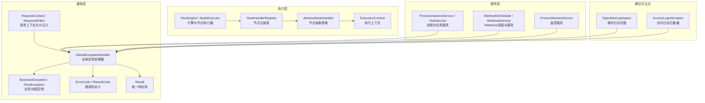
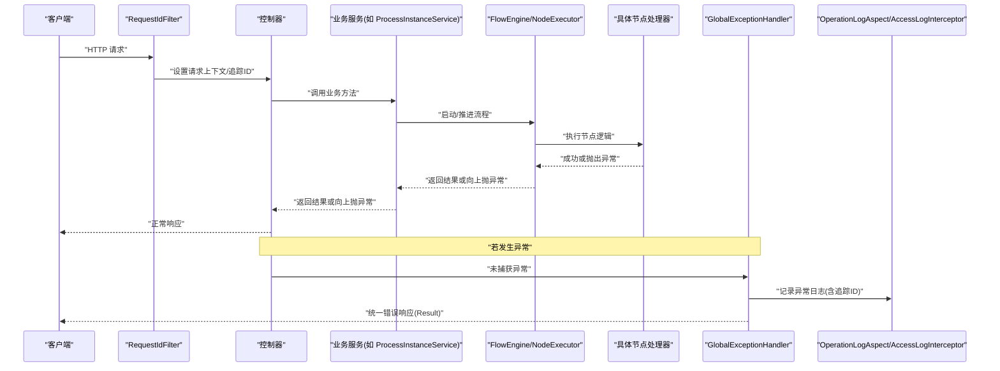
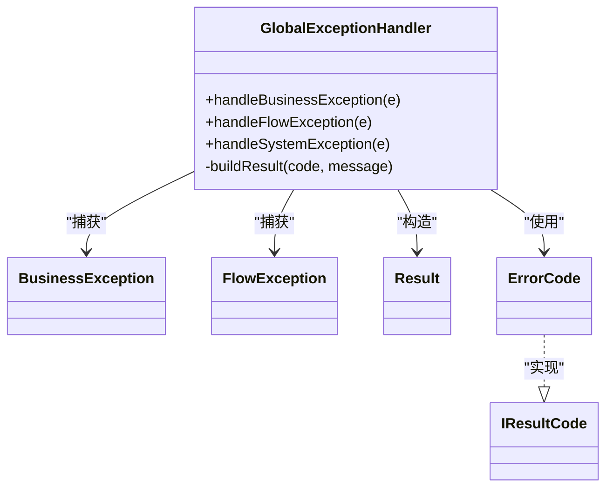
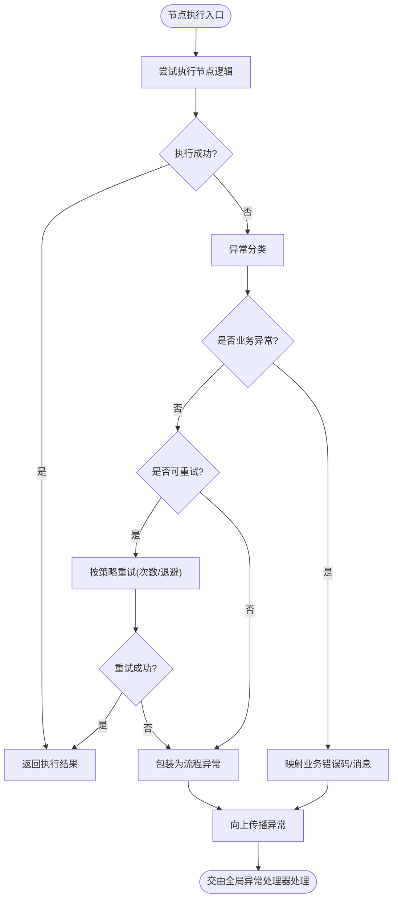
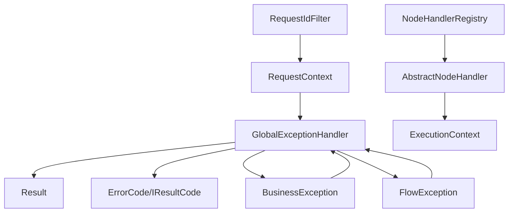

# 异常处理机制

<cite>
**本文引用的文件**   
- [GlobalExceptionHandler.java](file://flow-engine/src/main/java/com/flow/engine/common/GlobalExceptionHandler.java)
- [BusinessException.java](file://flow-engine/src/main/java/com/flow/engine/common/BusinessException.java)
- [ErrorCode.java](file://flow-engine/src/main/java/com/flow/engine/common/ErrorCode.java)
- [IResultCode.java](file://flow-engine/src/main/java/com/flow/engine/common/IResultCode.java)
- [Result.java](file://flow-engine/src/main/java/com/flow/engine/common/Result.java)
- [FlowException.java](file://flow-engine/src/main/java/com/flow/engine/common/exception/FlowException.java)
- [RequestContext.java](file://flow-engine/src/main/java/com/flow/engine/common/RequestContext.java)
- [RequestIdFilter.java](file://flow-engine/src/main/java/com/flow/engine/common/RequestIdFilter.java)
- [ProcessInstanceService.java](file://flow-engine/src/main/java/com/flow/engine/service/ProcessInstanceService.java)
- [TaskService.java](file://flow-engine/src/main/java/com/flow/engine/service/TaskService.java)
- [WebhookScheduler.java](file://flow-engine/src/main/java/com/flow/engine/service/WebhookScheduler.java)
- [WebhookService.java](file://flow-engine/src/main/java/com/flow/engine/service/WebhookService.java)
- [ProcessMonitorService.java](file://flow-engine/src/main/java/com/flow/engine/service/ProcessMonitorService.java)
- [OperationLogAspect.java](file://flow-engine/src/main/java/com/flow/engine/aspect/OperationLogAspect.java)
- [AccessLogInterceptor.java](file://flow-engine/src/main/java/com/flow/engine/interceptor/AccessLogInterceptor.java)
- [NodeHandlerRegistry.java](file://flow-engine/src/main/java/com/flow/engine/node/NodeHandlerRegistry.java)
- [AbstractNodeHandler.java](file://flow-engine/src/main/java/com/flow/engine/node/AbstractNodeHandler.java)
- [NodeHandler.java](file://flow-engine/src/main/java/com/flow/engine/node/NodeHandler.java)
- [ExecutionContext.java](file://flow-engine/src/main/java/com/flow/engine/node/ExecutionContext.java)
- [FlowEngine.java](file://flow-engine/src/main/java/com/flow/engine/engine/FlowEngine.java)
- [NodeExecutor.java](file://flow-engine/src/main/java/com/flow/engine/engine/NodeExecutor.java)
- [UserTaskNodeHandler.java](file://flow-engine/src/main/java/com/flow/engine/node/impl/UserTaskNodeHandler.java)
- [ServiceTaskNodeHandler.java](file://flow-engine/src/main/java/com/flow/engine/node/impl/ServiceTaskNodeHandler.java)
- [ScriptTaskNodeHandler.java](file://flow-engine/src/main/java/com/flow/engine/node/impl/ScriptTaskNodeHandler.java)
- [ExclusiveGatewayNodeHandler.java](file://flow-engine/src/main/java/com/flow/engine/node/impl/ExclusiveGatewayNodeHandler.java)
- [ParallelGatewayNodeHandler.java](file://flow-engine/src/main/java/com/flow/engine/node/impl/ParallelGatewayNodeHandler.java)
- [InclusiveGatewayNodeHandler.java](file://flow-engine/src/main/java/com/flow/engine/node/impl/InclusiveGatewayNodeHandler.java)
- [SubProcessNodeHandler.java](file://flow-engine/src/main/java/com/flow/engine/node/impl/SubProcessNodeHandler.java)
- [EndNodeHandler.java](file://flow-engine/src/main/java/com/flow/engine/node/impl/EndNodeHandler.java)
- [StartNodeHandler.java](file://flow-engine/src/main/java/com/flow/engine/node/impl/StartNodeHandler.java)
</cite>

## 目录
1. [简介](#简介)
2. [项目结构](#项目结构)
3. [核心组件](#核心组件)
4. [架构总览](#架构总览)
5. [详细组件分析](#详细组件分析)
6. [依赖关系分析](#依赖关系分析)
7. [性能考虑](#性能考虑)
8. [故障排查指南](#故障排查指南)
9. [结论](#结论)
10. [附录](#附录)

## 简介
本技术文档围绕工作流引擎的异常处理机制展开，覆盖异常分类体系、全局异常处理器、节点执行异常的传播与重试策略、事务回滚与补偿、监控告警以及调试最佳实践。目标是帮助开发者快速定位问题、统一错误响应格式、提升系统稳定性与可观测性。

## 项目结构
异常处理相关代码主要分布在以下包：
- common：统一的异常类型、错误码、结果封装、请求上下文与过滤器
- aspect/interceptor：操作日志与访问日志切面/拦截器
- engine/node：节点执行上下文、注册表与抽象基类
- service：流程实例、任务、Webhook调度与服务、监控服务
- controller：控制器层（由全局异常处理器统一捕获）

图表来源
- [GlobalExceptionHandler.java](file://flow-engine/src/main/java/com/flow/engine/common/GlobalExceptionHandler.java)
- [BusinessException.java](file://flow-engine/src/main/java/com/flow/engine/common/BusinessException.java)
- [FlowException.java](file://flow-engine/src/main/java/com/flow/engine/common/exception/FlowException.java)
- [ErrorCode.java](file://flow-engine/src/main/java/com/flow/engine/common/ErrorCode.java)
- [IResultCode.java](file://flow-engine/src/main/java/com/flow/engine/common/IResultCode.java)
- [Result.java](file://flow-engine/src/main/java/com/flow/engine/common/Result.java)
- [RequestContext.java](file://flow-engine/src/main/java/com/flow/engine/common/RequestContext.java)
- [RequestIdFilter.java](file://flow-engine/src/main/java/com/flow/engine/common/RequestIdFilter.java)
- [NodeHandlerRegistry.java](file://flow-engine/src/main/java/com/flow/engine/node/NodeHandlerRegistry.java)
- [AbstractNodeHandler.java](file://flow-engine/src/main/java/com/flow/engine/node/AbstractNodeHandler.java)
- [ExecutionContext.java](file://flow-engine/src/main/java/com/flow/engine/node/ExecutionContext.java)
- [FlowEngine.java](file://flow-engine/src/main/java/com/flow/engine/engine/FlowEngine.java)
- [NodeExecutor.java](file://flow-engine/src/main/java/com/flow/engine/engine/NodeExecutor.java)
- [ProcessInstanceService.java](file://flow-engine/src/main/java/com/flow/engine/service/ProcessInstanceService.java)
- [TaskService.java](file://flow-engine/src/main/java/com/flow/engine/service/TaskService.java)
- [WebhookScheduler.java](file://flow-engine/src/main/java/com/flow/engine/service/WebhookScheduler.java)
- [WebhookService.java](file://flow-engine/src/main/java/com/flow/engine/service/WebhookService.java)
- [ProcessMonitorService.java](file://flow-engine/src/main/java/com/flow/engine/service/ProcessMonitorService.java)
- [OperationLogAspect.java](file://flow-engine/src/main/java/com/flow/engine/aspect/OperationLogAspect.java)
- [AccessLogInterceptor.java](file://flow-engine/src/main/java/com/flow/engine/interceptor/AccessLogInterceptor.java)

章节来源
- [GlobalExceptionHandler.java](file://flow-engine/src/main/java/com/flow/engine/common/GlobalExceptionHandler.java)
- [BusinessException.java](file://flow-engine/src/main/java/com/flow/engine/common/BusinessException.java)
- [FlowException.java](file://flow-engine/src/main/java/com/flow/engine/common/exception/FlowException.java)
- [ErrorCode.java](file://flow-engine/src/main/java/com/flow/engine/common/ErrorCode.java)
- [IResultCode.java](file://flow-engine/src/main/java/com/flow/engine/common/IResultCode.java)
- [Result.java](file://flow-engine/src/main/java/com/flow/engine/common/Result.java)
- [RequestContext.java](file://flow-engine/src/main/java/com/flow/engine/common/RequestContext.java)
- [RequestIdFilter.java](file://flow-engine/src/main/java/com/flow/engine/common/RequestIdFilter.java)
- [NodeHandlerRegistry.java](file://flow-engine/src/main/java/com/flow/engine/node/NodeHandlerRegistry.java)
- [AbstractNodeHandler.java](file://flow-engine/src/main/java/com/flow/engine/node/AbstractNodeHandler.java)
- [ExecutionContext.java](file://flow-engine/src/main/java/com/flow/engine/node/ExecutionContext.java)
- [FlowEngine.java](file://flow-engine/src/main/java/com/flow/engine/engine/FlowEngine.java)
- [NodeExecutor.java](file://flow-engine/src/main/java/com/flow/engine/engine/NodeExecutor.java)
- [ProcessInstanceService.java](file://flow-engine/src/main/java/com/flow/engine/service/ProcessInstanceService.java)
- [TaskService.java](file://flow-engine/src/main/java/com/flow/engine/service/TaskService.java)
- [WebhookScheduler.java](file://flow-engine/src/main/java/com/flow/engine/service/WebhookScheduler.java)
- [WebhookService.java](file://flow-engine/src/main/java/com/flow/engine/service/WebhookService.java)
- [ProcessMonitorService.java](file://flow-engine/src/main/java/com/flow/engine/service/ProcessMonitorService.java)
- [OperationLogAspect.java](file://flow-engine/src/main/java/com/flow/engine/aspect/OperationLogAspect.java)
- [AccessLogInterceptor.java](file://flow-engine/src/main/java/com/flow/engine/interceptor/AccessLogInterceptor.java)

## 核心组件
- 统一响应体 Result：为所有接口返回提供一致的结构，包含状态码、消息与数据载荷。
- 错误码接口与实现 IResultCode / ErrorCode：集中管理错误码与默认消息，便于前端展示与后端统一处理。
- 业务异常 BusinessException：用于表达可预期的业务规则违反，携带错误码与可选参数。
- 流程异常 FlowException：面向流程引擎内部的可预期异常，通常用于节点执行失败或流程状态不合法等场景。
- 全局异常处理器 GlobalExceptionHandler：在控制器层统一捕获未处理异常，将异常转换为标准 Result 响应，并记录必要日志。
- 请求上下文 RequestContext 与请求ID过滤器 RequestIdFilter：为每次请求生成唯一追踪ID，贯穿日志与异常信息，便于链路追踪。
- 节点执行相关：NodeHandlerRegistry、AbstractNodeHandler、ExecutionContext 负责节点生命周期与执行上下文传递；具体节点实现抛出异常时，由上层统一处理。
- 服务层：ProcessInstanceService、TaskService、WebhookScheduler、WebhookService、ProcessMonitorService 在服务方法中抛出业务/流程异常，由全局异常处理器统一收敛。
- 横切关注点：OperationLogAspect、AccessLogInterceptor 记录操作与访问日志，辅助异常回溯。

章节来源
- [Result.java](file://flow-engine/src/main/java/com/flow/engine/common/Result.java)
- [IResultCode.java](file://flow-engine/src/main/java/com/flow/engine/common/IResultCode.java)
- [ErrorCode.java](file://flow-engine/src/main/java/com/flow/engine/common/ErrorCode.java)
- [BusinessException.java](file://flow-engine/src/main/java/com/flow/engine/common/BusinessException.java)
- [FlowException.java](file://flow-engine/src/main/java/com/flow/engine/common/exception/FlowException.java)
- [GlobalExceptionHandler.java](file://flow-engine/src/main/java/com/flow/engine/common/GlobalExceptionHandler.java)
- [RequestContext.java](file://flow-engine/src/main/java/com/flow/engine/common/RequestContext.java)
- [RequestIdFilter.java](file://flow-engine/src/main/java/com/flow/engine/common/RequestIdFilter.java)
- [NodeHandlerRegistry.java](file://flow-engine/src/main/java/com/flow/engine/node/NodeHandlerRegistry.java)
- [AbstractNodeHandler.java](file://flow-engine/src/main/java/com/flow/engine/node/AbstractNodeHandler.java)
- [ExecutionContext.java](file://flow-engine/src/main/java/com/flow/engine/node/ExecutionContext.java)
- [ProcessInstanceService.java](file://flow-engine/src/main/java/com/flow/engine/service/ProcessInstanceService.java)
- [TaskService.java](file://flow-engine/src/main/java/com/flow/engine/service/TaskService.java)
- [WebhookScheduler.java](file://flow-engine/src/main/java/com/flow/engine/service/WebhookScheduler.java)
- [WebhookService.java](file://flow-engine/src/main/java/com/flow/engine/service/WebhookService.java)
- [ProcessMonitorService.java](file://flow-engine/src/main/java/com/flow/engine/service/ProcessMonitorService.java)
- [OperationLogAspect.java](file://flow-engine/src/main/java/com/flow/engine/aspect/OperationLogAspect.java)
- [AccessLogInterceptor.java](file://flow-engine/src/main/java/com/flow/engine/interceptor/AccessLogInterceptor.java)

## 架构总览
下图展示了从请求进入、节点执行到异常处理的完整路径，包括日志、上下文与统一响应封装。

图表来源
- [RequestIdFilter.java](file://flow-engine/src/main/java/com/flow/engine/common/RequestIdFilter.java)
- [RequestContext.java](file://flow-engine/src/main/java/com/flow/engine/common/RequestContext.java)
- [GlobalExceptionHandler.java](file://flow-engine/src/main/java/com/flow/engine/common/GlobalExceptionHandler.java)
- [ProcessInstanceService.java](file://flow-engine/src/main/java/com/flow/engine/service/ProcessInstanceService.java)
- [FlowEngine.java](file://flow-engine/src/main/java/com/flow/engine/engine/FlowEngine.java)
- [NodeExecutor.java](file://flow-engine/src/main/java/com/flow/engine/engine/NodeExecutor.java)
- [OperationLogAspect.java](file://flow-engine/src/main/java/com/flow/engine/aspect/OperationLogAspect.java)
- [AccessLogInterceptor.java](file://flow-engine/src/main/java/com/flow/engine/interceptor/AccessLogInterceptor.java)

## 详细组件分析

### 异常分类体系
- 业务异常（BusinessException）：表示可预期的业务规则违反，例如参数校验失败、权限不足、流程状态不合法等。应携带明确的错误码与可读消息，避免直接暴露堆栈给前端。
- 流程异常（FlowException）：面向流程引擎内部的可预期异常，常用于节点执行失败、条件分支解析错误、子流程状态不一致等。
- 系统异常：非预期的运行时异常（如空指针、数据库连接异常、第三方服务不可用）。全局异常处理器会将其兜底转换为统一错误响应，并记录详细日志。
- 网络异常：调用外部系统（如 Webhook）失败、超时、协议错误等。建议在服务层进行包装为业务/流程异常，以便统一处理与重试。

章节来源
- [BusinessException.java](file://flow-engine/src/main/java/com/flow/engine/common/BusinessException.java)
- [FlowException.java](file://flow-engine/src/main/java/com/flow/engine/common/exception/FlowException.java)
- [ErrorCode.java](file://flow-engine/src/main/java/com/flow/engine/common/ErrorCode.java)
- [IResultCode.java](file://flow-engine/src/main/java/com/flow/engine/common/IResultCode.java)

### 全局异常处理器实现原理
- 异常捕获：在控制器层统一捕获未处理异常，区分业务异常、流程异常与系统异常，分别映射到不同错误码与响应状态。
- 日志记录：记录异常类型、消息、堆栈与请求上下文（如追踪ID），便于问题定位。
- 统一响应：将异常转换为标准 Result 结构返回，确保前端一致的错误处理体验。
- 安全策略：对系统异常隐藏敏感细节，仅记录服务端日志；对外只返回必要的错误码与友好提示。

图表来源
- [GlobalExceptionHandler.java](file://flow-engine/src/main/java/com/flow/engine/common/GlobalExceptionHandler.java)
- [BusinessException.java](file://flow-engine/src/main/java/com/flow/engine/common/BusinessException.java)
- [FlowException.java](file://flow-engine/src/main/java/com/flow/engine/common/exception/FlowException.java)
- [Result.java](file://flow-engine/src/main/java/com/flow/engine/common/Result.java)
- [ErrorCode.java](file://flow-engine/src/main/java/com/flow/engine/common/ErrorCode.java)
- [IResultCode.java](file://flow-engine/src/main/java/com/flow/engine/common/IResultCode.java)

章节来源
- [GlobalExceptionHandler.java](file://flow-engine/src/main/java/com/flow/engine/common/GlobalExceptionHandler.java)
- [Result.java](file://flow-engine/src/main/java/com/flow/engine/common/Result.java)
- [ErrorCode.java](file://flow-engine/src/main/java/com/flow/engine/common/ErrorCode.java)
- [IResultCode.java](file://flow-engine/src/main/java/com/flow/engine/common/IResultCode.java)

### 节点执行异常的传播与重试策略
- 异常传播：节点处理器在执行过程中抛出异常时，通过 ExecutionContext 向上传播至 NodeExecutor/FlowEngine，再由服务层或全局异常处理器统一处理。
- 重试策略：对于可恢复的网络异常或临时性错误，可在服务层或调度层配置重试次数与退避策略；对于业务异常不应自动重试，需人工干预或走补偿流程。
- 节点类型差异：
  - 用户任务（UserTaskNodeHandler）：异常多来自表单校验、权限检查，应转为业务异常。
  - 服务任务（ServiceTaskNodeHandler）：可能涉及外部调用，建议包装为流程异常并触发重试/补偿。
  - 脚本任务（ScriptTaskNodeHandler）：脚本执行失败通常为流程异常，需记录脚本信息与上下文。
  - 网关（Exclusive/Parallel/Inclusive Gateway）：条件解析失败属于流程异常，应明确分支选择逻辑与错误码。
  - 子流程（SubProcess）：子流程异常应聚合父流程上下文，便于根因定位。
  - 开始/结束节点：一般不涉及复杂逻辑，异常多为配置错误，应快速失败并给出明确错误码。

图表来源
- [AbstractNodeHandler.java](file://flow-engine/src/main/java/com/flow/engine/node/AbstractNodeHandler.java)
- [ExecutionContext.java](file://flow-engine/src/main/java/com/flow/engine/node/ExecutionContext.java)
- [NodeHandlerRegistry.java](file://flow-engine/src/main/java/com/flow/engine/node/NodeHandlerRegistry.java)
- [FlowEngine.java](file://flow-engine/src/main/java/com/flow/engine/engine/FlowEngine.java)
- [NodeExecutor.java](file://flow-engine/src/main/java/com/flow/engine/engine/NodeExecutor.java)
- [UserTaskNodeHandler.java](file://flow-engine/src/main/java/com/flow/engine/node/impl/UserTaskNodeHandler.java)
- [ServiceTaskNodeHandler.java](file://flow-engine/src/main/java/com/flow/engine/node/impl/ServiceTaskNodeHandler.java)
- [ScriptTaskNodeHandler.java](file://flow-engine/src/main/java/com/flow/engine/node/impl/ScriptTaskNodeHandler.java)
- [ExclusiveGatewayNodeHandler.java](file://flow-engine/src/main/java/com/flow/engine/node/impl/ExclusiveGatewayNodeHandler.java)
- [ParallelGatewayNodeHandler.java](file://flow-engine/src/main/java/com/flow/engine/node/impl/ParallelGatewayNodeHandler.java)
- [InclusiveGatewayNodeHandler.java](file://flow-engine/src/main/java/com/flow/engine/node/impl/InclusiveGatewayNodeHandler.java)
- [SubProcessNodeHandler.java](file://flow-engine/src/main/java/com/flow/engine/node/impl/SubProcessNodeHandler.java)
- [StartNodeHandler.java](file://flow-engine/src/main/java/com/flow/engine/node/impl/StartNodeHandler.java)
- [EndNodeHandler.java](file://flow-engine/src/main/java/com/flow/engine/node/impl/EndNodeHandler.java)

章节来源
- [AbstractNodeHandler.java](file://flow-engine/src/main/java/com/flow/engine/node/AbstractNodeHandler.java)
- [ExecutionContext.java](file://flow-engine/src/main/java/com/flow/engine/node/ExecutionContext.java)
- [NodeHandlerRegistry.java](file://flow-engine/src/main/java/com/flow/engine/node/NodeHandlerRegistry.java)
- [FlowEngine.java](file://flow-engine/src/main/java/com/flow/engine/engine/FlowEngine.java)
- [NodeExecutor.java](file://flow-engine/src/main/java/com/flow/engine/engine/NodeExecutor.java)
- [UserTaskNodeHandler.java](file://flow-engine/src/main/java/com/flow/engine/node/impl/UserTaskNodeHandler.java)
- [ServiceTaskNodeHandler.java](file://flow-engine/src/main/java/com/flow/engine/node/impl/ServiceTaskNodeHandler.java)
- [ScriptTaskNodeHandler.java](file://flow-engine/src/main/java/com/flow/engine/node/impl/ScriptTaskNodeHandler.java)
- [ExclusiveGatewayNodeHandler.java](file://flow-engine/src/main/java/com/flow/engine/node/impl/ExclusiveGatewayNodeHandler.java)
- [ParallelGatewayNodeHandler.java](file://flow-engine/src/main/java/com/flow/engine/node/impl/ParallelGatewayNodeHandler.java)
- [InclusiveGatewayNodeHandler.java](file://flow-engine/src/main/java/com/flow/engine/node/impl/InclusiveGatewayNodeHandler.java)
- [SubProcessNodeHandler.java](file://flow-engine/src/main/java/com/flow/engine/node/impl/SubProcessNodeHandler.java)
- [StartNodeHandler.java](file://flow-engine/src/main/java/com/flow/engine/node/impl/StartNodeHandler.java)
- [EndNodeHandler.java](file://flow-engine/src/main/java/com/flow/engine/node/impl/EndNodeHandler.java)

### 事务回滚与补偿机制
- 事务边界：在关键业务流程（如创建流程实例、完成任务、更新变量）处声明事务，确保数据一致性。当抛出业务/流程异常时，事务应回滚。
- 补偿策略：对于外部调用（如 Webhook）失败，应在服务层记录失败原因并触发补偿（重试、降级、人工介入）。补偿动作本身应具备幂等性。
- 监控与审计：结合 ProcessMonitorService 与 OperationLogAspect/AccessLogInterceptor，记录关键步骤与异常事件，便于事后分析与审计。

章节来源
- [ProcessInstanceService.java](file://flow-engine/src/main/java/com/flow/engine/service/ProcessInstanceService.java)
- [TaskService.java](file://flow-engine/src/main/java/com/flow/engine/service/TaskService.java)
- [WebhookScheduler.java](file://flow-engine/src/main/java/com/flow/engine/service/WebhookScheduler.java)
- [WebhookService.java](file://flow-engine/src/main/java/com/flow/engine/service/WebhookService.java)
- [ProcessMonitorService.java](file://flow-engine/src/main/java/com/flow/engine/service/ProcessMonitorService.java)
- [OperationLogAspect.java](file://flow-engine/src/main/java/com/flow/engine/aspect/OperationLogAspect.java)
- [AccessLogInterceptor.java](file://flow-engine/src/main/java/com/flow/engine/interceptor/AccessLogInterceptor.java)

### 异常监控与告警通知
- 监控指标：通过 ProcessMonitorService 收集流程运行指标（成功率、耗时、失败率）、节点执行统计与异常分布。
- 告警策略：对高频异常、关键节点失败、外部调用超时等设定阈值，触发告警（邮件、IM、监控系统）。
- 日志关联：利用 RequestIdFilter 生成的追踪ID，将请求、节点执行、异常日志串联，形成完整的排障链路。

章节来源
- [ProcessMonitorService.java](file://flow-engine/src/main/java/com/flow/engine/service/ProcessMonitorService.java)
- [RequestIdFilter.java](file://flow-engine/src/main/java/com/flow/engine/common/RequestIdFilter.java)
- [RequestContext.java](file://flow-engine/src/main/java/com/flow/engine/common/RequestContext.java)
- [OperationLogAspect.java](file://flow-engine/src/main/java/com/flow/engine/aspect/OperationLogAspect.java)
- [AccessLogInterceptor.java](file://flow-engine/src/main/java/com/flow/engine/interceptor/AccessLogInterceptor.java)

### 异常排查与调试最佳实践
- 使用追踪ID：在日志与异常信息中包含请求追踪ID，跨模块关联日志。
- 分层记录：在拦截器/切面记录入参、出参与异常摘要；在业务/节点层记录详细上下文（变量、分支条件、外部调用参数）。
- 错误码规范：统一使用 ErrorCode 中的错误码，避免自由文本导致前端难以识别。
- 重试与幂等：对外部调用采用可重试且幂等的补偿策略，避免重复副作用。
- 单元测试：针对关键异常路径编写测试用例，验证错误码与响应格式。

章节来源
- [GlobalExceptionHandler.java](file://flow-engine/src/main/java/com/flow/engine/common/GlobalExceptionHandler.java)
- [ErrorCode.java](file://flow-engine/src/main/java/com/flow/engine/common/ErrorCode.java)
- [OperationLogAspect.java](file://flow-engine/src/main/java/com/flow/engine/aspect/OperationLogAspect.java)
- [AccessLogInterceptor.java](file://flow-engine/src/main/java/com/flow/engine/interceptor/AccessLogInterceptor.java)

## 依赖关系分析
- 低耦合高内聚：全局异常处理器仅依赖统一响应体与错误码定义，不感知具体业务实现。
- 节点执行解耦：节点处理器通过接口与抽象基类解耦，异常通过上下文向上传播，便于替换与扩展。
- 服务层职责清晰：服务方法负责业务编排与异常包装，节点层专注执行逻辑。
- 横切关注点独立：日志与监控通过切面/拦截器实现，不影响主流程。

图表来源
- [GlobalExceptionHandler.java](file://flow-engine/src/main/java/com/flow/engine/common/GlobalExceptionHandler.java)
- [Result.java](file://flow-engine/src/main/java/com/flow/engine/common/Result.java)
- [ErrorCode.java](file://flow-engine/src/main/java/com/flow/engine/common/ErrorCode.java)
- [IResultCode.java](file://flow-engine/src/main/java/com/flow/engine/common/IResultCode.java)
- [BusinessException.java](file://flow-engine/src/main/java/com/flow/engine/common/BusinessException.java)
- [FlowException.java](file://flow-engine/src/main/java/com/flow/engine/common/exception/FlowException.java)
- [RequestContext.java](file://flow-engine/src/main/java/com/flow/engine/common/RequestContext.java)
- [RequestIdFilter.java](file://flow-engine/src/main/java/com/flow/engine/common/RequestIdFilter.java)
- [NodeHandlerRegistry.java](file://flow-engine/src/main/java/com/flow/engine/node/NodeHandlerRegistry.java)
- [AbstractNodeHandler.java](file://flow-engine/src/main/java/com/flow/engine/node/AbstractNodeHandler.java)
- [ExecutionContext.java](file://flow-engine/src/main/java/com/flow/engine/node/ExecutionContext.java)

章节来源
- [GlobalExceptionHandler.java](file://flow-engine/src/main/java/com/flow/engine/common/GlobalExceptionHandler.java)
- [Result.java](file://flow-engine/src/main/java/com/flow/engine/common/Result.java)
- [ErrorCode.java](file://flow-engine/src/main/java/com/flow/engine/common/ErrorCode.java)
- [IResultCode.java](file://flow-engine/src/main/java/com/flow/engine/common/IResultCode.java)
- [BusinessException.java](file://flow-engine/src/main/java/com/flow/engine/common/BusinessException.java)
- [FlowException.java](file://flow-engine/src/main/java/com/flow/engine/common/exception/FlowException.java)
- [RequestContext.java](file://flow-engine/src/main/java/com/flow/engine/common/RequestContext.java)
- [RequestIdFilter.java](file://flow-engine/src/main/java/com/flow/engine/common/RequestIdFilter.java)
- [NodeHandlerRegistry.java](file://flow-engine/src/main/java/com/flow/engine/node/NodeHandlerRegistry.java)
- [AbstractNodeHandler.java](file://flow-engine/src/main/java/com/flow/engine/node/AbstractNodeHandler.java)
- [ExecutionContext.java](file://flow-engine/src/main/java/com/flow/engine/node/ExecutionContext.java)

## 性能考虑
- 异常路径开销：频繁抛异常会影响性能，应在热点路径尽量使用返回值或标志位表达可预期错误。
- 日志级别控制：生产环境降低详细堆栈输出频率，仅记录必要信息；开发/测试环境开启详细日志。
- 重试退避：对网络异常采用指数退避与抖动，避免雪崩效应。
- 监控采样：对高吞吐场景采用采样监控，减少额外开销。

[本节为通用指导，无需特定文件引用]

## 故障排查指南
- 快速定位：通过请求追踪ID在日志系统中检索完整链路，确认异常发生位置与上下文。
- 错误码对照：根据统一错误码定位问题类别（业务/流程/系统/网络），缩小排查范围。
- 节点级诊断：查看节点执行日志与变量快照，确认分支条件与输入输出是否符合预期。
- 外部依赖：检查 Webhook 调用日志与重试记录，确认第三方服务可用性与超时配置。
- 事务与补偿：核对事务边界与补偿动作是否幂等，避免数据不一致。

章节来源
- [GlobalExceptionHandler.java](file://flow-engine/src/main/java/com/flow/engine/common/GlobalExceptionHandler.java)
- [ErrorCode.java](file://flow-engine/src/main/java/com/flow/engine/common/ErrorCode.java)
- [WebhookScheduler.java](file://flow-engine/src/main/java/com/flow/engine/service/WebhookScheduler.java)
- [WebhookService.java](file://flow-engine/src/main/java/com/flow/engine/service/WebhookService.java)
- [OperationLogAspect.java](file://flow-engine/src/main/java/com/flow/engine/aspect/OperationLogAspect.java)
- [AccessLogInterceptor.java](file://flow-engine/src/main/java/com/flow/engine/interceptor/AccessLogInterceptor.java)

## 结论
通过统一的异常分类、全局异常处理器、节点异常传播与重试策略、事务回滚与补偿机制，以及完善的监控与日志体系，工作流引擎能够在保证数据一致性的同时，提供稳定的错误处理与可观测能力。遵循本文的最佳实践与错误码规范，有助于提升系统的可维护性与用户体验。

[本节为总结，无需特定文件引用]

## 附录

### 错误码定义与示例
- 错误码组织：在 ErrorCode 中集中定义，实现 IResultCode 接口，提供 code 与 message。
- 使用方式：在业务/流程异常中传入对应错误码，由全局异常处理器转换为统一响应。
- 示例路径：
  - [ErrorCode.java](file://flow-engine/src/main/java/com/flow/engine/common/ErrorCode.java)
  - [IResultCode.java](file://flow-engine/src/main/java/com/flow/engine/common/IResultCode.java)
  - [BusinessException.java](file://flow-engine/src/main/java/com/flow/engine/common/BusinessException.java)
  - [FlowException.java](file://flow-engine/src/main/java/com/flow/engine/common/exception/FlowException.java)
  - [GlobalExceptionHandler.java](file://flow-engine/src/main/java/com/flow/engine/common/GlobalExceptionHandler.java)
  - [Result.java](file://flow-engine/src/main/java/com/flow/engine/common/Result.java)

章节来源
- [ErrorCode.java](file://flow-engine/src/main/java/com/flow/engine/common/ErrorCode.java)
- [IResultCode.java](file://flow-engine/src/main/java/com/flow/engine/common/IResultCode.java)
- [BusinessException.java](file://flow-engine/src/main/java/com/flow/engine/common/BusinessException.java)
- [FlowException.java](file://flow-engine/src/main/java/com/flow/engine/common/exception/FlowException.java)
- [GlobalExceptionHandler.java](file://flow-engine/src/main/java/com/flow/engine/common/GlobalExceptionHandler.java)
- [Result.java](file://flow-engine/src/main/java/com/flow/engine/common/Result.java)

### 异常处理示例代码路径
- 全局异常处理：
  - [GlobalExceptionHandler.java](file://flow-engine/src/main/java/com/flow/engine/common/GlobalExceptionHandler.java)
- 业务异常抛出与处理：
  - [BusinessException.java](file://flow-engine/src/main/java/com/flow/engine/common/BusinessException.java)
  - [ProcessInstanceService.java](file://flow-engine/src/main/java/com/flow/engine/service/ProcessInstanceService.java)
  - [TaskService.java](file://flow-engine/src/main/java/com/flow/engine/service/TaskService.java)
- 流程异常与节点执行：
  - [FlowException.java](file://flow-engine/src/main/java/com/flow/engine/common/exception/FlowException.java)
  - [AbstractNodeHandler.java](file://flow-engine/src/main/java/com/flow/engine/node/AbstractNodeHandler.java)
  - [UserTaskNodeHandler.java](file://flow-engine/src/main/java/com/flow/engine/node/impl/UserTaskNodeHandler.java)
  - [ServiceTaskNodeHandler.java](file://flow-engine/src/main/java/com/flow/engine/node/impl/ServiceTaskNodeHandler.java)
  - [ScriptTaskNodeHandler.java](file://flow-engine/src/main/java/com/flow/engine/node/impl/ScriptTaskNodeHandler.java)
  - [ExclusiveGatewayNodeHandler.java](file://flow-engine/src/main/java/com/flow/engine/node/impl/ExclusiveGatewayNodeHandler.java)
  - [ParallelGatewayNodeHandler.java](file://flow-engine/src/main/java/com/flow/engine/node/impl/ParallelGatewayNodeHandler.java)
  - [InclusiveGatewayNodeHandler.java](file://flow-engine/src/main/java/com/flow/engine/node/impl/InclusiveGatewayNodeHandler.java)
  - [SubProcessNodeHandler.java](file://flow-engine/src/main/java/com/flow/engine/node/impl/SubProcessNodeHandler.java)
  - [StartNodeHandler.java](file://flow-engine/src/main/java/com/flow/engine/node/impl/StartNodeHandler.java)
  - [EndNodeHandler.java](file://flow-engine/src/main/java/com/flow/engine/node/impl/EndNodeHandler.java)
- 监控与日志：
  - [ProcessMonitorService.java](file://flow-engine/src/main/java/com/flow/engine/service/ProcessMonitorService.java)
  - [OperationLogAspect.java](file://flow-engine/src/main/java/com/flow/engine/aspect/OperationLogAspect.java)
  - [AccessLogInterceptor.java](file://flow-engine/src/main/java/com/flow/engine/interceptor/AccessLogInterceptor.java)
  - [RequestIdFilter.java](file://flow-engine/src/main/java/com/flow/engine/common/RequestIdFilter.java)
  - [RequestContext.java](file://flow-engine/src/main/java/com/flow/engine/common/RequestContext.java)

章节来源
- [GlobalExceptionHandler.java](file://flow-engine/src/main/java/com/flow/engine/common/GlobalExceptionHandler.java)
- [BusinessException.java](file://flow-engine/src/main/java/com/flow/engine/common/BusinessException.java)
- [FlowException.java](file://flow-engine/src/main/java/com/flow/engine/common/exception/FlowException.java)
- [ProcessInstanceService.java](file://flow-engine/src/main/java/com/flow/engine/service/ProcessInstanceService.java)
- [TaskService.java](file://flow-engine/src/main/java/com/flow/engine/service/TaskService.java)
- [AbstractNodeHandler.java](file://flow-engine/src/main/java/com/flow/engine/node/AbstractNodeHandler.java)
- [UserTaskNodeHandler.java](file://flow-engine/src/main/java/com/flow/engine/node/impl/UserTaskNodeHandler.java)
- [ServiceTaskNodeHandler.java](file://flow-engine/src/main/java/com/flow/engine/node/impl/ServiceTaskNodeHandler.java)
- [ScriptTaskNodeHandler.java](file://flow-engine/src/main/java/com/flow/engine/node/impl/ScriptTaskNodeHandler.java)
- [ExclusiveGatewayNodeHandler.java](file://flow-engine/src/main/java/com/flow/engine/node/impl/ExclusiveGatewayNodeHandler.java)
- [ParallelGatewayNodeHandler.java](file://flow-engine/src/main/java/com/flow/engine/node/impl/ParallelGatewayNodeHandler.java)
- [InclusiveGatewayNodeHandler.java](file://flow-engine/src/main/java/com/flow/engine/node/impl/InclusiveGatewayNodeHandler.java)
- [SubProcessNodeHandler.java](file://flow-engine/src/main/java/com/flow/engine/node/impl/SubProcessNodeHandler.java)
- [StartNodeHandler.java](file://flow-engine/src/main/java/com/flow/engine/node/impl/StartNodeHandler.java)
- [EndNodeHandler.java](file://flow-engine/src/main/java/com/flow/engine/node/impl/EndNodeHandler.java)
- [ProcessMonitorService.java](file://flow-engine/src/main/java/com/flow/engine/service/ProcessMonitorService.java)
- [OperationLogAspect.java](file://flow-engine/src/main/java/com/flow/engine/aspect/OperationLogAspect.java)
- [AccessLogInterceptor.java](file://flow-engine/src/main/java/com/flow/engine/interceptor/AccessLogInterceptor.java)
- [RequestIdFilter.java](file://flow-engine/src/main/java/com/flow/engine/common/RequestIdFilter.java)
- [RequestContext.java](file://flow-engine/src/main/java/com/flow/engine/common/RequestContext.java)