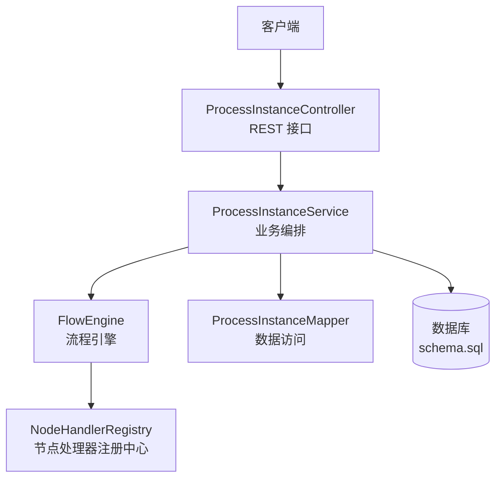
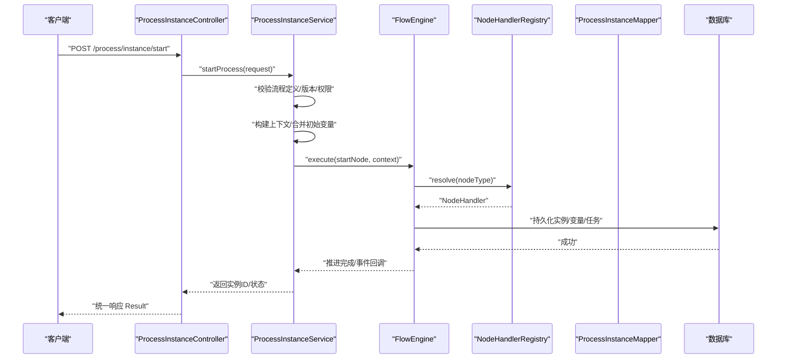
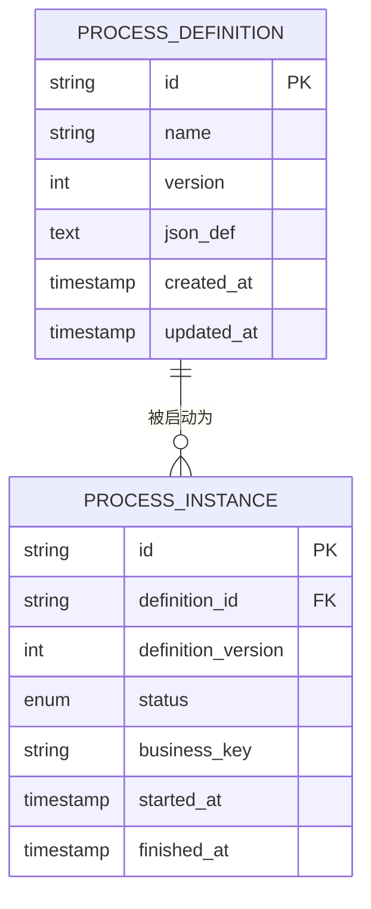
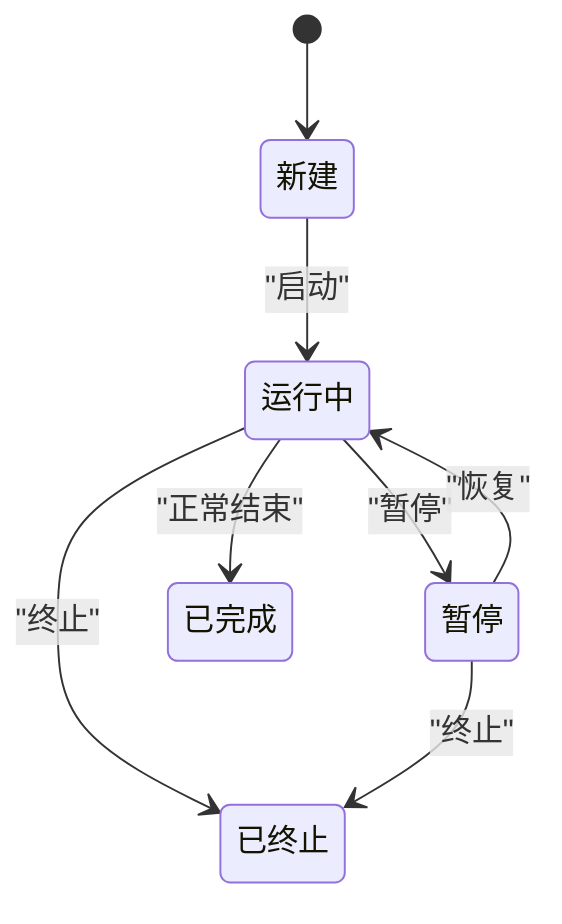
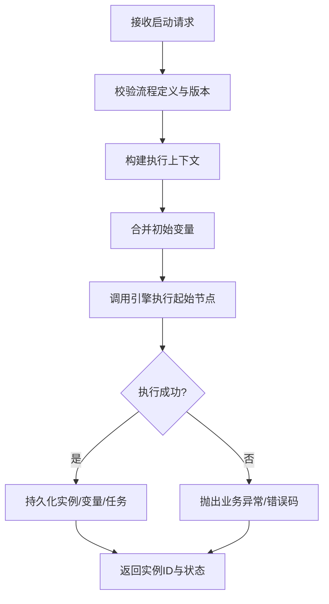
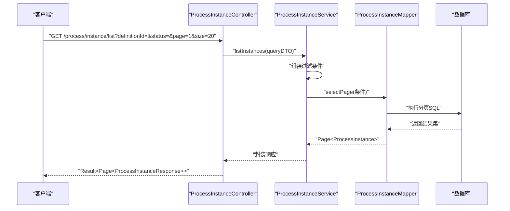
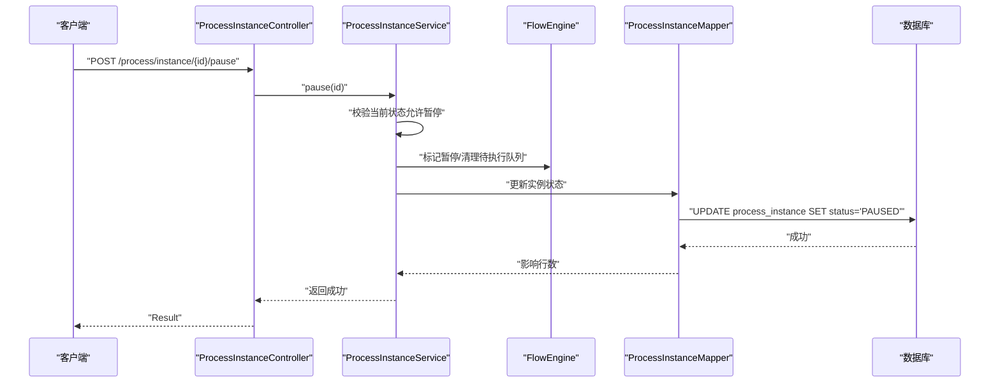
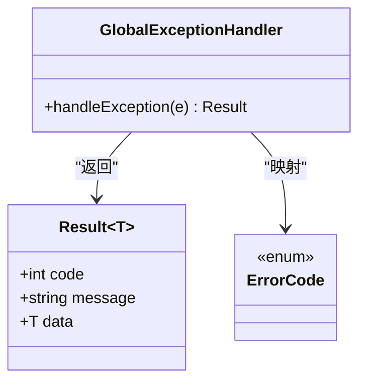
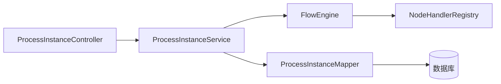

# 流程实例管理

<cite>
**本文引用的文件**   
- [ProcessInstanceController.java](file://flow-engine/src/main/java/com/flow/engine/controller/ProcessInstanceController.java)
- [ProcessInstanceService.java](file://flow-engine/src/main/java/com/flow/engine/service/ProcessInstanceService.java)
- [ProcessInstance.java](file://flow-engine/src/main/java/com/flow/engine/entity/ProcessInstance.java)
- [ProcessDefinition.java](file://flow-engine/src/main/java/com/flow/engine/entity/ProcessDefinition.java)
- [Task.java](file://flow-engine/src/main/java/com/flow/engine/entity/Task.java)
- [Variable.java](file://flow-engine/src/main/java/com/flow/engine/entity/Variable.java)
- [ProcessInstanceMapper.java](file://flow-engine/src/main/java/com/flow/engine/mapper/ProcessInstanceMapper.java)
- [StartProcessRequest.java](file://flow-engine/src/main/java/com/flow/engine/dto/StartProcessRequest.java)
- [ProcessInstanceResponse.java](file://flow-engine/src/main/java/com/flow/engine/dto/ProcessInstanceResponse.java)
- [FlowEngine.java](file://flow-engine/src/main/java/com/flow/engine/engine/FlowEngine.java)
- [NodeHandlerRegistry.java](file://flow-engine/src/main/java/com/flow/engine/node/NodeHandlerRegistry.java)
- [ProcessStatus.java](file://flow-engine/src/main/java/com/flow/engine/common/enums/ProcessStatus.java)
- [TaskStatus.java](file://flow-engine/src/main/java/com/flow/engine/common/enums/TaskStatus.java)
- [GlobalExceptionHandler.java](file://flow-engine/src/main/java/com/flow/engine/common/GlobalExceptionHandler.java)
- [Result.java](file://flow-engine/src/main/java/com/flow/engine/common/Result.java)
- [ErrorCode.java](file://flow-engine/src/main/java/com/flow/engine/common/ErrorCode.java)
- [schema.sql](file://flow-engine/src/main/resources/db/schema.sql)
</cite>

## 目录
1. [简介](#简介)
2. [项目结构](#项目结构)
3. [核心组件](#核心组件)
4. [架构总览](#架构总览)
5. [详细组件分析](#详细组件分析)
6. [依赖关系分析](#依赖关系分析)
7. [性能考虑](#性能考虑)
8. [故障排查指南](#故障排查指南)
9. [结论](#结论)
10. [附录：API 接口说明](#附录api-接口说明)

## 简介
本技术文档聚焦“流程实例管理”模块，围绕流程实例的创建、启动与生命周期管理展开，涵盖以下关键主题：
- 流程定义与实例的关系、版本管理与迁移策略
- 实例状态转换机制（运行中、暂停、恢复、终止）
- 启动参数传递、初始变量设置与上下文环境构建
- 实例查询、分页与过滤能力
- 暂停、恢复、终止操作及其业务影响
- API 接口规范、请求响应格式与错误处理
- 使用示例与最佳实践建议

## 项目结构
流程实例管理位于后端服务 flow-engine 中，采用分层架构：
- 控制器层：对外暴露 REST 接口
- 服务层：编排业务流程、协调引擎与持久化
- 引擎层：驱动节点执行、状态推进与事件发布
- 数据访问层：基于 MyBatis-Plus 的 Mapper
- 实体与枚举：领域模型与状态枚举
- DTO：入参与出参对象
- 异常与统一返回：全局异常处理与标准响应体

图表来源
- [ProcessInstanceController.java](file://flow-engine/src/main/java/com/flow/engine/controller/ProcessInstanceController.java)
- [ProcessInstanceService.java](file://flow-engine/src/main/java/com/flow/engine/service/ProcessInstanceService.java)
- [FlowEngine.java](file://flow-engine/src/main/java/com/flow/engine/engine/FlowEngine.java)
- [NodeHandlerRegistry.java](file://flow-engine/src/main/java/com/flow/engine/node/NodeHandlerRegistry.java)
- [ProcessInstanceMapper.java](file://flow-engine/src/main/java/com/flow/engine/mapper/ProcessInstanceMapper.java)
- [schema.sql](file://flow-engine/src/main/resources/db/schema.sql)

章节来源
- [ProcessInstanceController.java](file://flow-engine/src/main/java/com/flow/engine/controller/ProcessInstanceController.java)
- [ProcessInstanceService.java](file://flow-engine/src/main/java/com/flow/engine/service/ProcessInstanceService.java)
- [FlowEngine.java](file://flow-engine/src/main/java/com/flow/engine/engine/FlowEngine.java)
- [NodeHandlerRegistry.java](file://flow-engine/src/main/java/com/flow/engine/node/NodeHandlerRegistry.java)
- [ProcessInstanceMapper.java](file://flow-engine/src/main/java/com/flow/engine/mapper/ProcessInstanceMapper.java)
- [schema.sql](file://flow-engine/src/main/resources/db/schema.sql)

## 核心组件
- 控制器 ProcessInstanceController：提供流程实例的启动、查询、分页、过滤、暂停、恢复、终止等 HTTP 接口。
- 服务 ProcessInstanceService：封装实例创建、启动、状态变更、变量初始化、上下文构建、查询条件组装等核心逻辑。
- 引擎 FlowEngine：负责流程执行驱动、节点调度、状态推进与事件发布。
- 节点处理器注册中心 NodeHandlerRegistry：按节点类型分发到具体处理器，支持扩展自定义节点。
- 实体与枚举：
  - ProcessInstance：流程实例主记录，包含关联的流程定义、当前状态、租户/业务标识等。
  - ProcessDefinition：流程定义元数据，含版本号、部署信息、JSON 描述等。
  - Task：任务记录，承载待办/已办任务及流转信息。
  - Variable：流程变量，存储键值对形式的运行时数据。
  - ProcessStatus/TaskStatus：状态枚举，约束实例与任务的合法状态空间。
- 数据访问 ProcessInstanceMapper：基于 MyBatis-Plus 的查询与分页实现。
- DTO：
  - StartProcessRequest：启动参数、初始变量、上下文信息。
  - ProcessInstanceResponse：实例查询结果封装。
- 异常与返回：
  - GlobalExceptionHandler：统一异常捕获与错误码映射。
  - Result：统一响应包装。
  - ErrorCode：错误码定义。

章节来源
- [ProcessInstanceController.java](file://flow-engine/src/main/java/com/flow/engine/controller/ProcessInstanceController.java)
- [ProcessInstanceService.java](file://flow-engine/src/main/java/com/flow/engine/service/ProcessInstanceService.java)
- [FlowEngine.java](file://flow-engine/src/main/java/com/flow/engine/engine/FlowEngine.java)
- [NodeHandlerRegistry.java](file://flow-engine/src/main/java/com/flow/engine/node/NodeHandlerRegistry.java)
- [ProcessInstance.java](file://flow-engine/src/main/java/com/flow/engine/entity/ProcessInstance.java)
- [ProcessDefinition.java](file://flow-engine/src/main/java/com/flow/engine/entity/ProcessDefinition.java)
- [Task.java](file://flow-engine/src/main/java/com/flow/engine/entity/Task.java)
- [Variable.java](file://flow-engine/src/main/java/com/flow/engine/entity/Variable.java)
- [ProcessStatus.java](file://flow-engine/src/main/java/com/flow/engine/common/enums/ProcessStatus.java)
- [TaskStatus.java](file://flow-engine/src/main/java/com/flow/engine/common/enums/TaskStatus.java)
- [ProcessInstanceMapper.java](file://flow-engine/src/main/java/com/flow/engine/mapper/ProcessInstanceMapper.java)
- [StartProcessRequest.java](file://flow-engine/src/main/java/com/flow/engine/dto/StartProcessRequest.java)
- [ProcessInstanceResponse.java](file://flow-engine/src/main/java/com/flow/engine/dto/ProcessInstanceResponse.java)
- [GlobalExceptionHandler.java](file://flow-engine/src/main/java/com/flow/engine/common/GlobalExceptionHandler.java)
- [Result.java](file://flow-engine/src/main/java/com/flow/engine/common/Result.java)
- [ErrorCode.java](file://flow-engine/src/main/java/com/flow/engine/common/ErrorCode.java)

## 架构总览
下图展示从客户端发起启动请求到引擎推进流程、落库并返回结果的完整调用链。

图表来源
- [ProcessInstanceController.java](file://flow-engine/src/main/java/com/flow/engine/controller/ProcessInstanceController.java)
- [ProcessInstanceService.java](file://flow-engine/src/main/java/com/flow/engine/service/ProcessInstanceService.java)
- [FlowEngine.java](file://flow-engine/src/main/java/com/flow/engine/engine/FlowEngine.java)
- [NodeHandlerRegistry.java](file://flow-engine/src/main/java/com/flow/engine/node/NodeHandlerRegistry.java)
- [ProcessInstanceMapper.java](file://flow-engine/src/main/java/com/flow/engine/mapper/ProcessInstanceMapper.java)
- [schema.sql](file://flow-engine/src/main/resources/db/schema.sql)

## 详细组件分析

### 流程定义与实例的关系
- 一对多关系：一个流程定义可被多次启动产生多个实例。
- 版本控制：流程定义携带版本字段，实例在启动时绑定具体版本，确保历史可追溯与灰度升级。
- 迁移策略：新版本定义发布后，旧实例继续按原版本执行；新实例默认使用最新有效版本，或根据启动参数指定版本。

图表来源
- [ProcessDefinition.java](file://flow-engine/src/main/java/com/flow/engine/entity/ProcessDefinition.java)
- [ProcessInstance.java](file://flow-engine/src/main/java/com/flow/engine/entity/ProcessInstance.java)
- [schema.sql](file://flow-engine/src/main/resources/db/schema.sql)

章节来源
- [ProcessDefinition.java](file://flow-engine/src/main/java/com/flow/engine/entity/ProcessDefinition.java)
- [ProcessInstance.java](file://flow-engine/src/main/java/com/flow/engine/entity/ProcessInstance.java)
- [schema.sql](file://flow-engine/src/main/resources/db/schema.sql)

### 实例状态转换机制
- 状态集合：由 ProcessStatus 枚举定义，典型包括：新建、运行中、暂停、恢复、已完成、已终止等。
- 转换规则：
  - 启动后进入“运行中”
  - 暂停后进入“暂停”，可从“暂停”恢复到“运行中”
  - 正常结束进入“已完成”
  - 强制终止进入“已终止”
- 任务状态联动：TaskStatus 与实例状态协同，保证任务与实例一致性。

图表来源
- [ProcessStatus.java](file://flow-engine/src/main/java/com/flow/engine/common/enums/ProcessStatus.java)
- [TaskStatus.java](file://flow-engine/src/main/java/com/flow/engine/common/enums/TaskStatus.java)

章节来源
- [ProcessStatus.java](file://flow-engine/src/main/java/com/flow/engine/common/enums/ProcessStatus.java)
- [TaskStatus.java](file://flow-engine/src/main/java/com/flow/engine/common/enums/TaskStatus.java)

### 启动参数传递、初始变量与上下文构建
- 启动参数：通过 StartProcessRequest 传入，包含流程定义标识、可选版本、业务键、初始变量、上下文信息等。
- 初始变量：服务层将请求中的变量合并到流程变量表，供后续节点表达式与脚本读取。
- 上下文构建：服务层构造执行上下文（如租户、操作人、追踪ID），注入到引擎执行链路。
- 引擎执行：FlowEngine 解析起始节点，委托 NodeHandlerRegistry 分派至具体处理器，推进流程并持久化中间态。

图表来源
- [StartProcessRequest.java](file://flow-engine/src/main/java/com/flow/engine/dto/StartProcessRequest.java)
- [ProcessInstanceService.java](file://flow-engine/src/main/java/com/flow/engine/service/ProcessInstanceService.java)
- [FlowEngine.java](file://flow-engine/src/main/java/com/flow/engine/engine/FlowEngine.java)
- [NodeHandlerRegistry.java](file://flow-engine/src/main/java/com/flow/engine/node/NodeHandlerRegistry.java)
- [Variable.java](file://flow-engine/src/main/java/com/flow/engine/entity/Variable.java)

章节来源
- [StartProcessRequest.java](file://flow-engine/src/main/java/com/flow/engine/dto/StartProcessRequest.java)
- [ProcessInstanceService.java](file://flow-engine/src/main/java/com/flow/engine/service/ProcessInstanceService.java)
- [FlowEngine.java](file://flow-engine/src/main/java/com/flow/engine/engine/FlowEngine.java)
- [NodeHandlerRegistry.java](file://flow-engine/src/main/java/com/flow/engine/node/NodeHandlerRegistry.java)
- [Variable.java](file://flow-engine/src/main/java/com/flow/engine/entity/Variable.java)

### 查询、分页与过滤
- 查询入口：ProcessInstanceController 提供列表与详情接口。
- 过滤条件：支持按流程定义ID、版本、业务键、状态、时间范围等维度筛选。
- 分页实现：基于 MyBatis-Plus 的分页插件，在服务层组装 QueryWrapper 并调用 Mapper 分页查询。
- 结果封装：统一使用 ProcessInstanceResponse 返回，便于前端渲染。

图表来源
- [ProcessInstanceController.java](file://flow-engine/src/main/java/com/flow/engine/controller/ProcessInstanceController.java)
- [ProcessInstanceService.java](file://flow-engine/src/main/java/com/flow/engine/service/ProcessInstanceService.java)
- [ProcessInstanceMapper.java](file://flow-engine/src/main/java/com/flow/engine/mapper/ProcessInstanceMapper.java)
- [ProcessInstanceResponse.java](file://flow-engine/src/main/java/com/flow/engine/dto/ProcessInstanceResponse.java)

章节来源
- [ProcessInstanceController.java](file://flow-engine/src/main/java/com/flow/engine/controller/ProcessInstanceController.java)
- [ProcessInstanceService.java](file://flow-engine/src/main/java/com/flow/engine/service/ProcessInstanceService.java)
- [ProcessInstanceMapper.java](file://flow-engine/src/main/java/com/flow/engine/mapper/ProcessInstanceMapper.java)
- [ProcessInstanceResponse.java](file://flow-engine/src/main/java/com/flow/engine/dto/ProcessInstanceResponse.java)

### 暂停、恢复、终止操作与业务影响
- 暂停：将实例状态置为“暂停”，停止后续节点推进，但保留所有中间数据与任务。
- 恢复：从“暂停”恢复到“运行中”，继续推进未完成的分支与任务。
- 终止：将实例置为“已终止”，清理未完成的任务与临时变量，记录终止原因。
- 业务影响：
  - 暂停/恢复不影响历史轨迹，适合人工干预场景。
  - 终止会中断流程，需配合审计日志与补偿机制。

图表来源
- [ProcessInstanceController.java](file://flow-engine/src/main/java/com/flow/engine/controller/ProcessInstanceController.java)
- [ProcessInstanceService.java](file://flow-engine/src/main/java/com/flow/engine/service/ProcessInstanceService.java)
- [FlowEngine.java](file://flow-engine/src/main/java/com/flow/engine/engine/FlowEngine.java)
- [ProcessInstanceMapper.java](file://flow-engine/src/main/java/com/flow/engine/mapper/ProcessInstanceMapper.java)
- [ProcessStatus.java](file://flow-engine/src/main/java/com/flow/engine/common/enums/ProcessStatus.java)

章节来源
- [ProcessInstanceController.java](file://flow-engine/src/main/java/com/flow/engine/controller/ProcessInstanceController.java)
- [ProcessInstanceService.java](file://flow-engine/src/main/java/com/flow/engine/service/ProcessInstanceService.java)
- [FlowEngine.java](file://flow-engine/src/main/java/com/flow/engine/engine/FlowEngine.java)
- [ProcessInstanceMapper.java](file://flow-engine/src/main/java/com/flow/engine/mapper/ProcessInstanceMapper.java)
- [ProcessStatus.java](file://flow-engine/src/main/java/com/flow/engine/common/enums/ProcessStatus.java)

### 版本管理与迁移策略
- 版本发布：流程定义新增版本，保持历史版本不可变。
- 实例绑定：实例启动时绑定具体版本，避免定义变更影响运行中实例。
- 迁移策略：
  - 存量实例：继续按原版本执行，不自动迁移。
  - 增量实例：默认使用最新有效版本，或通过启动参数指定版本。
  - 兼容处理：若新版本存在破坏性变更，应提供过渡期并行版本与路由策略。

章节来源
- [ProcessDefinition.java](file://flow-engine/src/main/java/com/flow/engine/entity/ProcessDefinition.java)
- [ProcessInstance.java](file://flow-engine/src/main/java/com/flow/engine/entity/ProcessInstance.java)
- [StartProcessRequest.java](file://flow-engine/src/main/java/com/flow/engine/dto/StartProcessRequest.java)

### 错误处理机制
- 统一返回：所有接口返回 Result<T> 包装，包含状态码、消息与数据。
- 全局异常：GlobalExceptionHandler 捕获业务与非业务异常，映射为标准错误码与消息。
- 错误码：ErrorCode 集中定义，便于前端统一处理。

图表来源
- [GlobalExceptionHandler.java](file://flow-engine/src/main/java/com/flow/engine/common/GlobalExceptionHandler.java)
- [Result.java](file://flow-engine/src/main/java/com/flow/engine/common/Result.java)
- [ErrorCode.java](file://flow-engine/src/main/java/com/flow/engine/common/ErrorCode.java)

章节来源
- [GlobalExceptionHandler.java](file://flow-engine/src/main/java/com/flow/engine/common/GlobalExceptionHandler.java)
- [Result.java](file://flow-engine/src/main/java/com/flow/engine/common/Result.java)
- [ErrorCode.java](file://flow-engine/src/main/java/com/flow/engine/common/ErrorCode.java)

## 依赖关系分析
- 控制器依赖服务：ProcessInstanceController 仅做参数校验与响应包装，核心逻辑下沉至服务层。
- 服务依赖引擎与数据访问：ProcessInstanceService 编排流程执行与持久化，解耦业务与底层细节。
- 引擎依赖节点注册中心：FlowEngine 通过 NodeHandlerRegistry 动态分派节点处理器，提升可扩展性。
- 数据访问依赖数据库：ProcessInstanceMapper 基于 schema.sql 定义的表结构进行 CRUD 与分页。

图表来源
- [ProcessInstanceController.java](file://flow-engine/src/main/java/com/flow/engine/controller/ProcessInstanceController.java)
- [ProcessInstanceService.java](file://flow-engine/src/main/java/com/flow/engine/service/ProcessInstanceService.java)
- [FlowEngine.java](file://flow-engine/src/main/java/com/flow/engine/engine/FlowEngine.java)
- [NodeHandlerRegistry.java](file://flow-engine/src/main/java/com/flow/engine/node/NodeHandlerRegistry.java)
- [ProcessInstanceMapper.java](file://flow-engine/src/main/java/com/flow/engine/mapper/ProcessInstanceMapper.java)
- [schema.sql](file://flow-engine/src/main/resources/db/schema.sql)

章节来源
- [ProcessInstanceController.java](file://flow-engine/src/main/java/com/flow/engine/controller/ProcessInstanceController.java)
- [ProcessInstanceService.java](file://flow-engine/src/main/java/com/flow/engine/service/ProcessInstanceService.java)
- [FlowEngine.java](file://flow-engine/src/main/java/com/flow/engine/engine/FlowEngine.java)
- [NodeHandlerRegistry.java](file://flow-engine/src/main/java/com/flow/engine/node/NodeHandlerRegistry.java)
- [ProcessInstanceMapper.java](file://flow-engine/src/main/java/com/flow/engine/mapper/ProcessInstanceMapper.java)
- [schema.sql](file://flow-engine/src/main/resources/db/schema.sql)

## 性能考虑
- 索引优化：为常用查询字段（definition_id、business_key、status、created_at）建立索引，提升分页与过滤性能。
- 分页限制：服务端限制最大 page size，防止大结果集拖垮数据库与网络。
- 变量读写：批量写入初始变量，减少往返次数；热点变量可考虑缓存层（如 Redis）加速读取。
- 事务边界：启动与状态变更尽量控制在短事务内，避免长事务锁竞争。
- 异步推进：对于耗时节点，采用异步任务或消息队列推进，降低同步阻塞。

## 故障排查指南
- 启动失败：检查流程定义是否存在且启用、版本是否匹配、初始变量是否满足节点表达式要求。
- 状态不一致：核对实例状态与任务状态是否一致，必要时通过恢复或终止修复。
- 查询无结果：确认过滤条件是否正确，尤其是时间范围与状态枚举值。
- 错误码定位：查看全局异常处理返回的错误码与消息，结合日志定位问题根因。

章节来源
- [GlobalExceptionHandler.java](file://flow-engine/src/main/java/com/flow/engine/common/GlobalExceptionHandler.java)
- [ErrorCode.java](file://flow-engine/src/main/java/com/flow/engine/common/ErrorCode.java)
- [ProcessStatus.java](file://flow-engine/src/main/java/com/flow/engine/common/enums/ProcessStatus.java)
- [TaskStatus.java](file://flow-engine/src/main/java/com/flow/engine/common/enums/TaskStatus.java)

## 结论
流程实例管理模块以清晰的分层架构与明确的职责划分，实现了流程实例的创建、启动、生命周期管理与查询能力。通过版本化流程定义与严格的实例状态机，保障了流程执行的稳定性与可追溯性。结合统一的异常与返回规范，提升了系统的可维护性与用户体验。建议在上线前完善索引与监控指标，并在复杂场景中引入异步与缓存以提升吞吐与延迟表现。

## 附录：API 接口说明

- 启动流程实例
  - 方法：POST
  - 路径：/process/instance/start
  - 请求体：StartProcessRequest（包含流程定义ID、版本、业务键、初始变量、上下文信息）
  - 响应：Result<ProcessInstanceResponse>（包含实例ID、状态、时间戳等）
  - 错误：非法参数、流程定义不存在、版本无效、权限不足等，返回对应错误码

- 查询流程实例列表（分页）
  - 方法：GET
  - 路径：/process/instance/list
  - 查询参数：definitionId、version、businessKey、status、startTime、endTime、page、size
  - 响应：Result<Page<ProcessInstanceResponse>>
  - 错误：参数校验失败、分页越界等

- 获取流程实例详情
  - 方法：GET
  - 路径：/process/instance/{id}
  - 响应：Result<ProcessInstanceResponse>
  - 错误：实例不存在

- 暂停流程实例
  - 方法：POST
  - 路径：/process/instance/{id}/pause
  - 响应：Result<Void>
  - 错误：实例状态不允许暂停、实例不存在

- 恢复流程实例
  - 方法：POST
  - 路径：/process/instance/{id}/resume
  - 响应：Result<Void>
  - 错误：实例状态不允许恢复、实例不存在

- 终止流程实例
  - 方法：POST
  - 路径：/process/instance/{id}/terminate
  - 请求体：可选终止原因
  - 响应：Result<Void>
  - 错误：实例状态不允许终止、实例不存在

章节来源
- [ProcessInstanceController.java](file://flow-engine/src/main/java/com/flow/engine/controller/ProcessInstanceController.java)
- [StartProcessRequest.java](file://flow-engine/src/main/java/com/flow/engine/dto/StartProcessRequest.java)
- [ProcessInstanceResponse.java](file://flow-engine/src/main/java/com/flow/engine/dto/ProcessInstanceResponse.java)
- [Result.java](file://flow-engine/src/main/java/com/flow/engine/common/Result.java)
- [ErrorCode.java](file://flow-engine/src/main/java/com/flow/engine/common/ErrorCode.java)