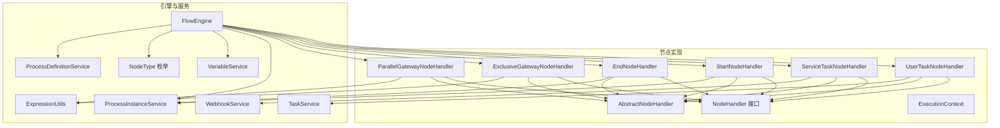
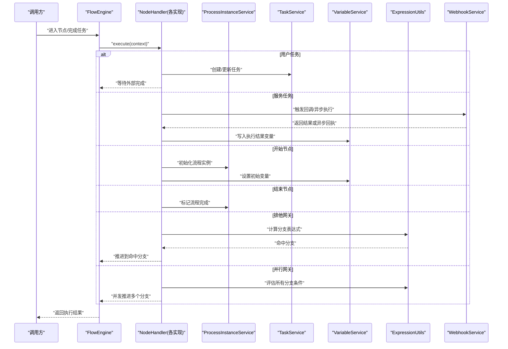
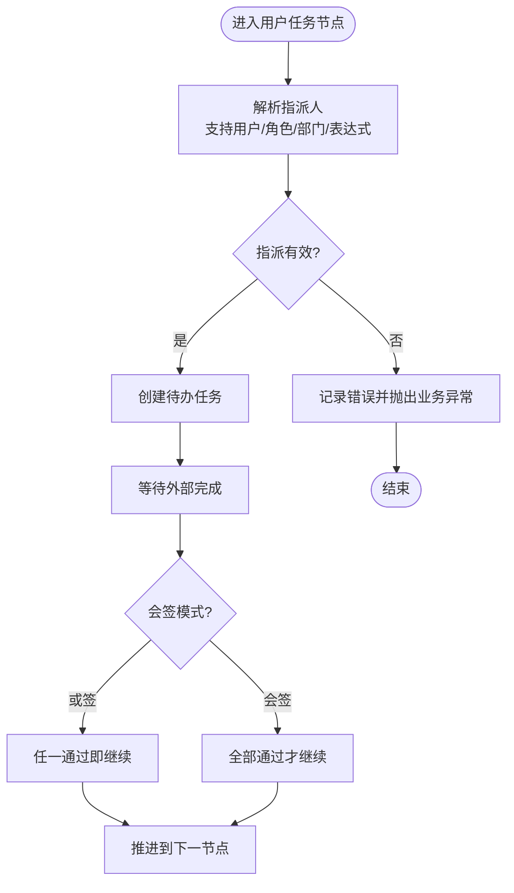
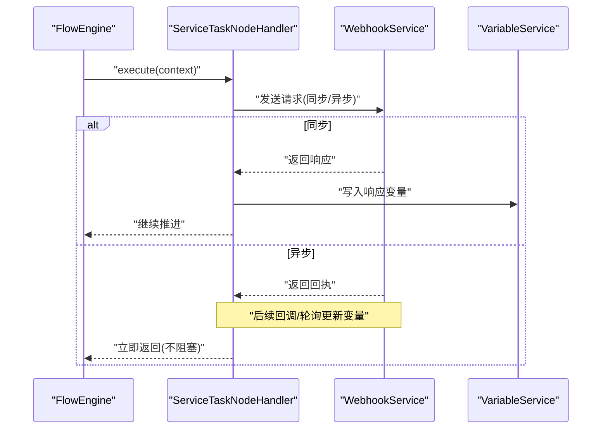
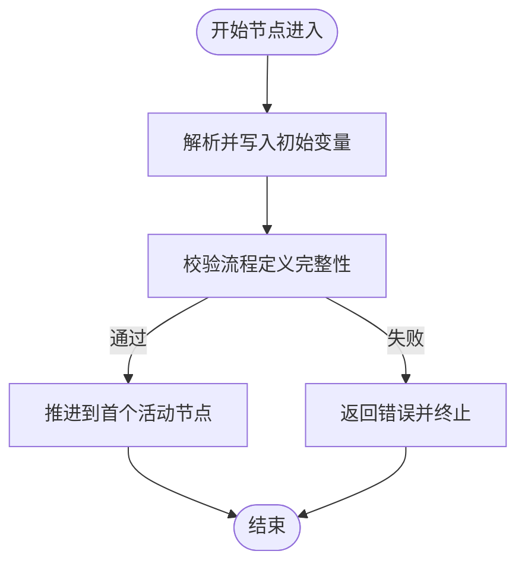
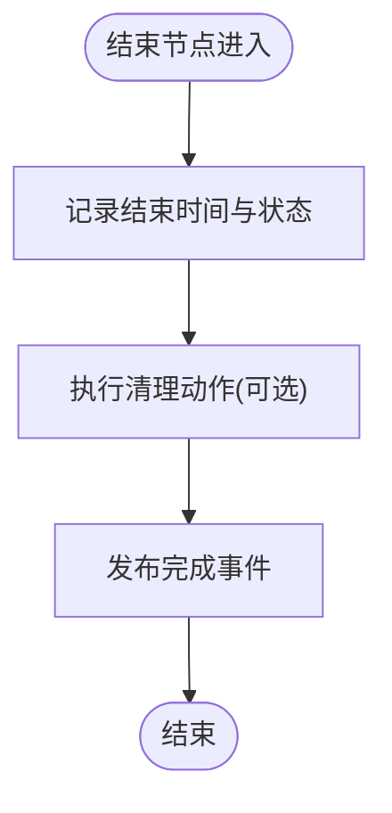
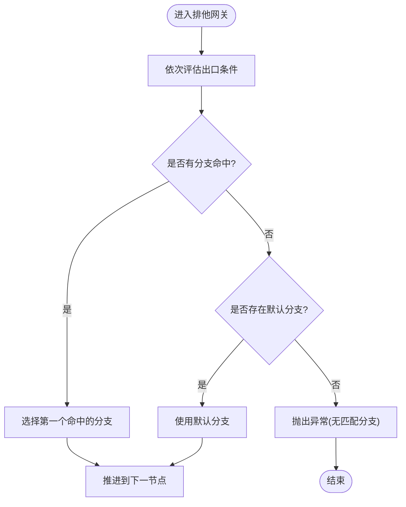
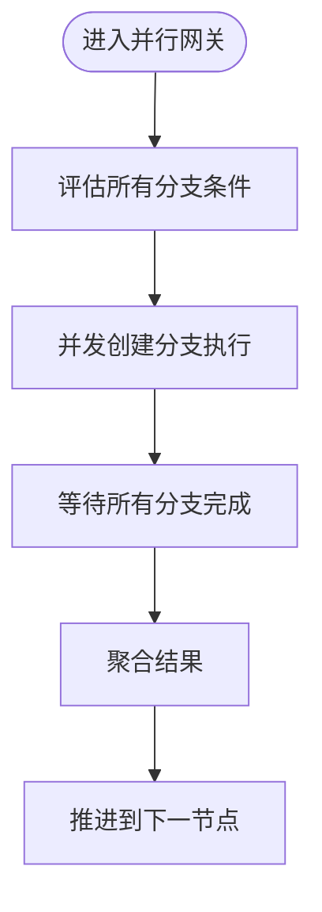
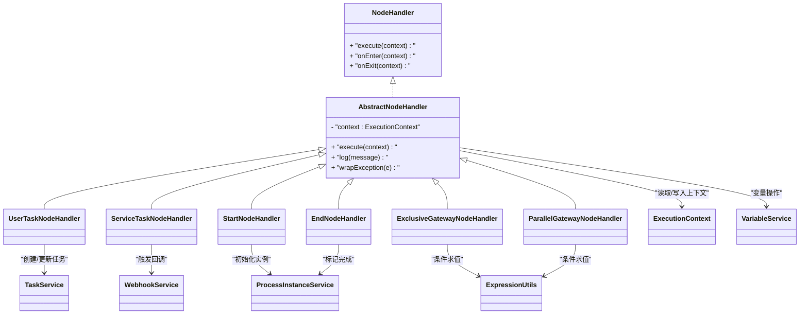

# 内置节点类型

<cite>
**本文引用的文件**
- [UserTaskNodeHandler.java](file://flow-engine/src/main/java/com/flow/engine/node/impl/UserTaskNodeHandler.java)
- [ServiceTaskNodeHandler.java](file://flow-engine/src/main/java/com/flow/engine/node/impl/ServiceTaskNodeHandler.java)
- [StartNodeHandler.java](file://flow-engine/src/main/java/com/flow/engine/node/impl/StartNodeHandler.java)
- [EndNodeHandler.java](file://flow-engine/src/main/java/com/flow/engine/node/impl/EndNodeHandler.java)
- [ExclusiveGatewayNodeHandler.java](file://flow-engine/src/main/java/com/flow/engine/node/impl/ExclusiveGatewayNodeHandler.java)
- [ParallelGatewayNodeHandler.java](file://flow-engine/src/main/java/com/flow/engine/node/impl/ParallelGatewayNodeHandler.java)
- [AbstractNodeHandler.java](file://flow-engine/src/main/java/com/flow/engine/node/AbstractNodeHandler.java)
- [NodeHandler.java](file://flow-engine/src/main/java/com/flow/engine/node/NodeHandler.java)
- [ExecutionContext.java](file://flow-engine/src/main/java/com/flow/engine/node/ExecutionContext.java)
- [FlowEngine.java](file://flow-engine/src/main/java/com/flow/engine/engine/FlowEngine.java)
- [ProcessInstanceService.java](file://flow-engine/src/main/java/com/flow/engine/service/ProcessInstanceService.java)
- [TaskService.java](file://flow-engine/src/main/java/com/flow/engine/service/TaskService.java)
- [VariableService.java](file://flow-engine/src/main/java/com/flow/engine/service/VariableService.java)
- [ExpressionUtils.java](file://flow-engine/src/main/java/com/flow/engine/common/utils/ExpressionUtils.java)
- [NodeType.java](file://flow-engine/src/main/java/com/flow/engine/common/enums/NodeType.java)
- [ProcessDefinitionService.java](file://flow-engine/src/main/java/com/flow/engine/service/ProcessDefinitionService.java)
- [WebhookService.java](file://flow-engine/src/main/java/com/flow/engine/service/WebhookService.java)
</cite>

## 目录
1. [简介](#简介)
2. [项目结构](#项目结构)
3. [核心组件](#核心组件)
4. [架构总览](#架构总览)
5. [详细组件分析](#详细组件分析)
6. [依赖关系分析](#依赖关系分析)
7. [性能考虑](#性能考虑)
8. [故障排查指南](#故障排查指南)
9. [结论](#结论)
10. [附录](#附录)

## 简介
本章节面向流程引擎的“内置节点类型”，系统性阐述以下处理器的工作原理、执行上下文变量、配置参数、异常处理策略与性能优化方案：
- 用户任务节点（UserTaskNodeHandler）：任务分配与审批流转
- 服务任务节点（ServiceTaskNodeHandler）：异步执行机制
- 开始/结束节点（StartNodeHandler/EndNodeHandler）：生命周期管理
- 网关节点（ExclusiveGatewayNodeHandler/ParallelGatewayNodeHandler）：条件判断与并行控制

文档同时提供使用示例与最佳实践，帮助读者快速上手并稳定落地。

## 项目结构
与内置节点相关的核心代码集中在 flow-engine 模块的 node.impl 包中，并通过统一的 NodeHandler 接口与 ExecutionContext 进行协作；流程编排由 FlowEngine 驱动，持久化与业务服务由 ProcessInstanceService、TaskService、VariableService 等提供支撑。

图表来源
- [UserTaskNodeHandler.java](file://flow-engine/src/main/java/com/flow/engine/node/impl/UserTaskNodeHandler.java)
- [ServiceTaskNodeHandler.java](file://flow-engine/src/main/java/com/flow/engine/node/impl/ServiceTaskNodeHandler.java)
- [StartNodeHandler.java](file://flow-engine/src/main/java/com/flow/engine/node/impl/StartNodeHandler.java)
- [EndNodeHandler.java](file://flow-engine/src/main/java/com/flow/engine/node/impl/EndNodeHandler.java)
- [ExclusiveGatewayNodeHandler.java](file://flow-engine/src/main/java/com/flow/engine/node/impl/ExclusiveGatewayNodeHandler.java)
- [ParallelGatewayNodeHandler.java](file://flow-engine/src/main/java/com/flow/engine/node/impl/ParallelGatewayNodeHandler.java)
- [AbstractNodeHandler.java](file://flow-engine/src/main/java/com/flow/engine/node/AbstractNodeHandler.java)
- [NodeHandler.java](file://flow-engine/src/main/java/com/flow/engine/node/NodeHandler.java)
- [ExecutionContext.java](file://flow-engine/src/main/java/com/flow/engine/node/ExecutionContext.java)
- [FlowEngine.java](file://flow-engine/src/main/java/com/flow/engine/engine/FlowEngine.java)
- [ProcessInstanceService.java](file://flow-engine/src/main/java/com/flow/engine/service/ProcessInstanceService.java)
- [TaskService.java](file://flow-engine/src/main/java/com/flow/engine/service/TaskService.java)
- [VariableService.java](file://flow-engine/src/main/java/com/flow/engine/service/VariableService.java)
- [ExpressionUtils.java](file://flow-engine/src/main/java/com/flow/engine/common/utils/ExpressionUtils.java)
- [NodeType.java](file://flow-engine/src/main/java/com/flow/engine/common/enums/NodeType.java)
- [ProcessDefinitionService.java](file://flow-engine/src/main/java/com/flow/engine/service/ProcessDefinitionService.java)
- [WebhookService.java](file://flow-engine/src/main/java/com/flow/engine/service/WebhookService.java)

章节来源
- [UserTaskNodeHandler.java](file://flow-engine/src/main/java/com/flow/engine/node/impl/UserTaskNodeHandler.java)
- [ServiceTaskNodeHandler.java](file://flow-engine/src/main/java/com/flow/engine/node/impl/ServiceTaskNodeHandler.java)
- [StartNodeHandler.java](file://flow-engine/src/main/java/com/flow/engine/node/impl/StartNodeHandler.java)
- [EndNodeHandler.java](file://flow-engine/src/main/java/com/flow/engine/node/impl/EndNodeHandler.java)
- [ExclusiveGatewayNodeHandler.java](file://flow-engine/src/main/java/com/flow/engine/node/impl/ExclusiveGatewayNodeHandler.java)
- [ParallelGatewayNodeHandler.java](file://flow-engine/src/main/java/com/flow/engine/node/impl/ParallelGatewayNodeHandler.java)
- [AbstractNodeHandler.java](file://flow-engine/src/main/java/com/flow/engine/node/AbstractNodeHandler.java)
- [NodeHandler.java](file://flow-engine/src/main/java/com/flow/engine/node/NodeHandler.java)
- [ExecutionContext.java](file://flow-engine/src/main/java/com/flow/engine/node/ExecutionContext.java)
- [FlowEngine.java](file://flow-engine/src/main/java/com/flow/engine/engine/FlowEngine.java)
- [ProcessInstanceService.java](file://flow-engine/src/main/java/com/flow/engine/service/ProcessInstanceService.java)
- [TaskService.java](file://flow-engine/src/main/java/com/flow/engine/service/TaskService.java)
- [VariableService.java](file://flow-engine/src/main/java/com/flow/engine/service/VariableService.java)
- [ExpressionUtils.java](file://flow-engine/src/main/java/com/flow/engine/common/utils/ExpressionUtils.java)
- [NodeType.java](file://flow-engine/src/main/java/com/flow/engine/common/enums/NodeType.java)
- [ProcessDefinitionService.java](file://flow-engine/src/main/java/com/flow/engine/service/ProcessDefinitionService.java)
- [WebhookService.java](file://flow-engine/src/main/java/com/flow/engine/service/WebhookService.java)

## 核心组件
- 统一接口与抽象基类
  - NodeHandler：定义节点执行的统一入口与生命周期钩子
  - AbstractNodeHandler：提供通用能力（如上下文访问、日志、异常包装等），减少重复实现
- 执行上下文
  - ExecutionContext：承载流程实例ID、当前节点信息、变量集合、事件发布等，贯穿节点执行全链路
- 引擎调度
  - FlowEngine：根据流程定义与当前状态，选择对应 NodeHandler 执行，并推进流程到下一节点
- 业务服务
  - ProcessInstanceService：流程实例生命周期管理
  - TaskService：任务创建、领取、完成、委派、转办等
  - VariableService：流程变量读写
  - ExpressionUtils：表达式解析工具（用于网关条件、动态分配等）
  - WebhookService：对外回调通知（常用于服务任务）

章节来源
- [NodeHandler.java](file://flow-engine/src/main/java/com/flow/engine/node/NodeHandler.java)
- [AbstractNodeHandler.java](file://flow-engine/src/main/java/com/flow/engine/node/AbstractNodeHandler.java)
- [ExecutionContext.java](file://flow-engine/src/main/java/com/flow/engine/node/ExecutionContext.java)
- [FlowEngine.java](file://flow-engine/src/main/java/com/flow/engine/engine/FlowEngine.java)
- [ProcessInstanceService.java](file://flow-engine/src/main/java/com/flow/engine/service/ProcessInstanceService.java)
- [TaskService.java](file://flow-engine/src/main/java/com/flow/engine/service/TaskService.java)
- [VariableService.java](file://flow-engine/src/main/java/com/flow/engine/service/VariableService.java)
- [ExpressionUtils.java](file://flow-engine/src/main/java/com/flow/engine/common/utils/ExpressionUtils.java)
- [WebhookService.java](file://flow-engine/src/main/java/com/flow/engine/service/WebhookService.java)

## 架构总览
下图展示了从引擎调度到具体节点处理的调用链路与数据流向。

图表来源
- [FlowEngine.java](file://flow-engine/src/main/java/com/flow/engine/engine/FlowEngine.java)
- [UserTaskNodeHandler.java](file://flow-engine/src/main/java/com/flow/engine/node/impl/UserTaskNodeHandler.java)
- [ServiceTaskNodeHandler.java](file://flow-engine/src/main/java/com/flow/engine/node/impl/ServiceTaskNodeHandler.java)
- [StartNodeHandler.java](file://flow-engine/src/main/java/com/flow/engine/node/impl/StartNodeHandler.java)
- [EndNodeHandler.java](file://flow-engine/src/main/java/com/flow/engine/node/impl/EndNodeHandler.java)
- [ExclusiveGatewayNodeHandler.java](file://flow-engine/src/main/java/com/flow/engine/node/impl/ExclusiveGatewayNodeHandler.java)
- [ParallelGatewayNodeHandler.java](file://flow-engine/src/main/java/com/flow/engine/node/impl/ParallelGatewayNodeHandler.java)
- [ProcessInstanceService.java](file://flow-engine/src/main/java/com/flow/engine/service/ProcessInstanceService.java)
- [TaskService.java](file://flow-engine/src/main/java/com/flow/engine/service/TaskService.java)
- [VariableService.java](file://flow-engine/src/main/java/com/flow/engine/service/VariableService.java)
- [ExpressionUtils.java](file://flow-engine/src/main/java/com/flow/engine/common/utils/ExpressionUtils.java)
- [WebhookService.java](file://flow-engine/src/main/java/com/flow/engine/service/WebhookService.java)

## 详细组件分析

### 用户任务节点（UserTaskNodeHandler）
- 职责与行为
  - 在节点进入时创建待办任务，支持按配置将任务指派给指定用户、角色或部门
  - 支持会签/或签模式（通过配置项控制），并在任务完成后根据策略合并结果
  - 将任务相关变量（如审批意见、附件标识等）写入执行上下文
- 关键配置参数（建议）
  - assigneeType：指派人类型（用户/角色/部门/表达式）
  - assigneeValue：指派人取值（静态值或表达式）
  - signMode：会签/或签（如 all/any）
  - formKey：表单键（用于前端渲染）
  - timeoutMinutes：超时时间（分钟）
- 执行上下文变量（常见）
  - userTaskAssignee：最终指派人
  - userTaskSignResult：会签结果汇总
  - userTaskComment：审批意见
- 异常处理策略
  - 指派人解析失败：抛出可识别的业务异常，记录审计日志，回滚本次节点推进
  - 任务创建失败：重试或降级为系统管理员兜底
- 性能优化建议
  - 批量创建任务时使用事务批处理
  - 对高频查询的用户/角色/部门数据进行缓存
- 使用示例（概念性）
  - 在流程设计器中添加“用户任务”节点，配置 assigneeType=role、assigneeValue=ROLE_APPROVER、signMode=all，即可实现“全体审批人需全部同意”的会签流程

图表来源
- [UserTaskNodeHandler.java](file://flow-engine/src/main/java/com/flow/engine/node/impl/UserTaskNodeHandler.java)
- [TaskService.java](file://flow-engine/src/main/java/com/flow/engine/service/TaskService.java)
- [ExpressionUtils.java](file://flow-engine/src/main/java/com/flow/engine/common/utils/ExpressionUtils.java)

章节来源
- [UserTaskNodeHandler.java](file://flow-engine/src/main/java/com/flow/engine/node/impl/UserTaskNodeHandler.java)
- [TaskService.java](file://flow-engine/src/main/java/com/flow/engine/service/TaskService.java)
- [ExpressionUtils.java](file://flow-engine/src/main/java/com/flow/engine/common/utils/ExpressionUtils.java)

### 服务任务节点（ServiceTaskNodeHandler）
- 职责与行为
  - 节点进入时触发外部服务调用（如 Webhook、HTTP 接口、消息队列等）
  - 支持同步/异步两种模式：同步直接返回结果；异步通过回调或轮询获取结果
  - 将服务返回的数据写入流程变量，供后续节点使用
- 关键配置参数（建议）
  - serviceType：服务类型（webhook/http/mq 等）
  - url/method：目标地址与方法（HTTP 场景）
  - headers/bodyTemplate：请求头与请求体模板（支持表达式）
  - async：是否异步执行
  - retryPolicy：重试策略（次数、间隔、退避）
  - timeoutSeconds：超时时间
- 执行上下文变量（常见）
  - serviceResponse：服务响应对象
  - serviceStatus：服务状态码
  - serviceError：错误信息（如有）
- 异常处理策略
  - 网络/序列化异常：按重试策略重试，超过阈值则记录告警并终止或走错误分支
  - 业务异常：封装为标准错误对象，写入变量并允许下游决策
- 性能优化建议
  - 异步模式下采用线程池/队列削峰填谷
  - 对相同请求做幂等去重（基于请求指纹）
  - 合理设置超时与连接池大小
- 使用示例（概念性）
  - 配置 serviceType=webhook、url=https://api.example.com/approve、async=true，可在发起审批后异步等待第三方系统回调完成

图表来源
- [ServiceTaskNodeHandler.java](file://flow-engine/src/main/java/com/flow/engine/node/impl/ServiceTaskNodeHandler.java)
- [WebhookService.java](file://flow-engine/src/main/java/com/flow/engine/service/WebhookService.java)
- [VariableService.java](file://flow-engine/src/main/java/com/flow/engine/service/VariableService.java)

章节来源
- [ServiceTaskNodeHandler.java](file://flow-engine/src/main/java/com/flow/engine/node/impl/ServiceTaskNodeHandler.java)
- [WebhookService.java](file://flow-engine/src/main/java/com/flow/engine/service/WebhookService.java)
- [VariableService.java](file://flow-engine/src/main/java/com/flow/engine/service/VariableService.java)

### 开始节点（StartNodeHandler）
- 职责与行为
  - 流程启动时初始化流程实例，设置初始变量，并推进到首个活动节点
- 关键配置参数（建议）
  - initialVariables：初始变量映射（键值对或表达式）
  - autoStartNext：是否自动推进到下一个节点
- 执行上下文变量（常见）
  - processInstanceId：流程实例ID
  - startTime：启动时间戳
- 异常处理策略
  - 初始变量解析失败：拒绝启动并返回明确错误
  - 首个节点不存在：提示流程定义不完整
- 性能优化建议
  - 批量启动时复用事务与上下文
- 使用示例（概念性）
  - 在流程定义中配置 initialVariables={applicantId: ${request.userId}, amount: ${request.amount}}，启动后即可在后续节点直接使用这些变量

图表来源
- [StartNodeHandler.java](file://flow-engine/src/main/java/com/flow/engine/node/impl/StartNodeHandler.java)
- [VariableService.java](file://flow-engine/src/main/java/com/flow/engine/service/VariableService.java)
- [ProcessDefinitionService.java](file://flow-engine/src/main/java/com/flow/engine/service/ProcessDefinitionService.java)

章节来源
- [StartNodeHandler.java](file://flow-engine/src/main/java/com/flow/engine/node/impl/StartNodeHandler.java)
- [VariableService.java](file://flow-engine/src/main/java/com/flow/engine/service/VariableService.java)
- [ProcessDefinitionService.java](file://flow-engine/src/main/java/com/flow/engine/service/ProcessDefinitionService.java)

### 结束节点（EndNodeHandler）
- 职责与行为
  - 流程结束时清理资源、记录完成时间、触发完成事件
- 关键配置参数（建议）
  - cleanupActions：清理动作（如归档、通知）
- 执行上下文变量（常见）
  - endTime：结束时间戳
  - duration：流程耗时（可由引擎计算）
- 异常处理策略
  - 清理动作失败：记录告警但不影响流程完成状态
- 性能优化建议
  - 清理动作异步化，避免阻塞主流程退出
- 使用示例（概念性）
  - 配置 cleanupActions=[archive, notify]，流程结束后自动归档并发送通知

图表来源
- [EndNodeHandler.java](file://flow-engine/src/main/java/com/flow/engine/node/impl/EndNodeHandler.java)
- [ProcessInstanceService.java](file://flow-engine/src/main/java/com/flow/engine/service/ProcessInstanceService.java)

章节来源
- [EndNodeHandler.java](file://flow-engine/src/main/java/com/flow/engine/node/impl/EndNodeHandler.java)
- [ProcessInstanceService.java](file://flow-engine/src/main/java/com/flow/engine/service/ProcessInstanceService.java)

### 排他网关（ExclusiveGatewayNodeHandler）
- 职责与行为
  - 根据出口边上的条件表达式求值，选择唯一一条路径继续执行
- 关键配置参数（建议）
  - conditions：出口条件列表（表达式字符串）
  - defaultEdge：默认分支（当无分支满足时）
- 执行上下文变量（常见）
  - gatewayDecision：命中的分支标识
- 异常处理策略
  - 表达式解析失败：记录错误并尝试使用默认分支；若无默认分支则抛出异常
- 性能优化建议
  - 对复杂表达式进行缓存或预编译
- 使用示例（概念性）
  - 配置两个出口：amount>10000 ? routeA : routeB，金额大于阈值走高级审批，否则走普通审批

图表来源
- [ExclusiveGatewayNodeHandler.java](file://flow-engine/src/main/java/com/flow/engine/node/impl/ExclusiveGatewayNodeHandler.java)
- [ExpressionUtils.java](file://flow-engine/src/main/java/com/flow/engine/common/utils/ExpressionUtils.java)

章节来源
- [ExclusiveGatewayNodeHandler.java](file://flow-engine/src/main/java/com/flow/engine/node/impl/ExclusiveGatewayNodeHandler.java)
- [ExpressionUtils.java](file://flow-engine/src/main/java/com/flow/engine/common/utils/ExpressionUtils.java)

### 并行网关（ParallelGatewayNodeHandler）
- 职责与行为
  - 对所有出口边进行条件评估，同时创建多条并行路径；在汇聚点等待所有分支完成后再继续
- 关键配置参数（建议）
  - branches：并行分支集合（每个分支包含条件表达式与目标节点）
  - joinStrategy：汇聚策略（如 all/any）
- 执行上下文变量（常见）
  - parallelBranches：已完成的分支集合
  - parallelAggregated：聚合后的结果
- 异常处理策略
  - 单个分支异常：记录错误并决定是否中断整体流程或仅标记该分支失败
- 性能优化建议
  - 使用线程池并发执行分支；对共享变量加锁或采用不可变数据结构
- 使用示例（概念性）
  - 配置三个并行分支分别调用风控、合规、财务系统，汇聚后生成综合报告

图表来源
- [ParallelGatewayNodeHandler.java](file://flow-engine/src/main/java/com/flow/engine/node/impl/ParallelGatewayNodeHandler.java)
- [ExpressionUtils.java](file://flow-engine/src/main/java/com/flow/engine/common/utils/ExpressionUtils.java)

章节来源
- [ParallelGatewayNodeHandler.java](file://flow-engine/src/main/java/com/flow/engine/node/impl/ParallelGatewayNodeHandler.java)
- [ExpressionUtils.java](file://flow-engine/src/main/java/com/flow/engine/common/utils/ExpressionUtils.java)

## 依赖关系分析
- 组件耦合与内聚
  - 各节点处理器均实现 NodeHandler 接口，并通过 AbstractNodeHandler 复用通用逻辑，提升内聚性与可维护性
  - 节点间通过 ExecutionContext 传递状态，降低直接耦合
- 外部依赖
  - 任务与流程实例由 TaskService 与 ProcessInstanceService 管理
  - 变量读写由 VariableService 负责
  - 表达式解析由 ExpressionUtils 提供
  - 服务任务可能依赖 WebhookService 或其他外部适配器
- 潜在循环依赖
  - 节点不应直接依赖 FlowEngine，而是通过上下文与服务层交互，避免循环调用

图表来源
- [NodeHandler.java](file://flow-engine/src/main/java/com/flow/engine/node/NodeHandler.java)
- [AbstractNodeHandler.java](file://flow-engine/src/main/java/com/flow/engine/node/AbstractNodeHandler.java)
- [UserTaskNodeHandler.java](file://flow-engine/src/main/java/com/flow/engine/node/impl/UserTaskNodeHandler.java)
- [ServiceTaskNodeHandler.java](file://flow-engine/src/main/java/com/flow/engine/node/impl/ServiceTaskNodeHandler.java)
- [StartNodeHandler.java](file://flow-engine/src/main/java/com/flow/engine/node/impl/StartNodeHandler.java)
- [EndNodeHandler.java](file://flow-engine/src/main/java/com/flow/engine/node/impl/EndNodeHandler.java)
- [ExclusiveGatewayNodeHandler.java](file://flow-engine/src/main/java/com/flow/engine/node/impl/ExclusiveGatewayNodeHandler.java)
- [ParallelGatewayNodeHandler.java](file://flow-engine/src/main/java/com/flow/engine/node/impl/ParallelGatewayNodeHandler.java)
- [ExecutionContext.java](file://flow-engine/src/main/java/com/flow/engine/node/ExecutionContext.java)
- [TaskService.java](file://flow-engine/src/main/java/com/flow/engine/service/TaskService.java)
- [ProcessInstanceService.java](file://flow-engine/src/main/java/com/flow/engine/service/ProcessInstanceService.java)
- [VariableService.java](file://flow-engine/src/main/java/com/flow/engine/service/VariableService.java)
- [ExpressionUtils.java](file://flow-engine/src/main/java/com/flow/engine/common/utils/ExpressionUtils.java)
- [WebhookService.java](file://flow-engine/src/main/java/com/flow/engine/service/WebhookService.java)

章节来源
- [NodeHandler.java](file://flow-engine/src/main/java/com/flow/engine/node/NodeHandler.java)
- [AbstractNodeHandler.java](file://flow-engine/src/main/java/com/flow/engine/node/AbstractNodeHandler.java)
- [ExecutionContext.java](file://flow-engine/src/main/java/com/flow/engine/node/ExecutionContext.java)
- [TaskService.java](file://flow-engine/src/main/java/com/flow/engine/service/TaskService.java)
- [ProcessInstanceService.java](file://flow-engine/src/main/java/com/flow/engine/service/ProcessInstanceService.java)
- [VariableService.java](file://flow-engine/src/main/java/com/flow/engine/service/VariableService.java)
- [ExpressionUtils.java](file://flow-engine/src/main/java/com/flow/engine/common/utils/ExpressionUtils.java)
- [WebhookService.java](file://flow-engine/src/main/java/com/flow/engine/service/WebhookService.java)

## 性能考虑
- 表达式求值
  - 对频繁使用的条件表达式进行缓存或预编译，避免重复解析
- 任务与变量
  - 批量创建任务与批量写变量，减少数据库往返
  - 对热点用户/角色/部门数据引入本地缓存，注意失效策略
- 异步与并发
  - 服务任务与并行网关分支使用线程池，合理设置核心数与队列容量
  - 对共享变量采用不可变对象或细粒度锁，避免竞争
- 超时与重试
  - 为外部调用设置合理的超时与指数退避重试，防止雪崩
- 监控与观测
  - 记录关键指标（节点耗时、失败率、重试次数），便于定位瓶颈

[本节为通用指导，无需特定文件引用]

## 故障排查指南
- 常见问题
  - 用户任务无法指派：检查 assigneeType/assigneeValue 配置与表达式解析结果
  - 服务任务超时：确认 WebhookService 的连接池与超时配置，必要时开启异步
  - 网关分支未命中：核对条件表达式语法与变量命名，确保存在默认分支
  - 并行分支汇聚卡住：检查各分支是否都正确完成，关注异常分支的处理策略
- 定位方法
  - 查看节点执行日志与审计日志
  - 检查 ExecutionContext 中的变量快照
  - 使用表达式调试工具验证条件表达式
- 恢复策略
  - 对于可重试的外部调用，启用重试与死信队列
  - 对于不可恢复的错误，记录根因并人工介入

章节来源
- [ExpressionUtils.java](file://flow-engine/src/main/java/com/flow/engine/common/utils/ExpressionUtils.java)
- [WebhookService.java](file://flow-engine/src/main/java/com/flow/engine/service/WebhookService.java)
- [TaskService.java](file://flow-engine/src/main/java/com/flow/engine/service/TaskService.java)
- [ProcessInstanceService.java](file://flow-engine/src/main/java/com/flow/engine/service/ProcessInstanceService.java)

## 结论
内置节点类型围绕统一的 NodeHandler 抽象与 ExecutionContext 上下文构建，形成高内聚、低耦合的执行模型。通过合理的配置参数、完善的异常处理与性能优化策略，可以在保证稳定性的前提下灵活扩展业务流程。建议在生产环境结合监控与审计，持续优化节点表现与用户体验。

[本节为总结性内容，无需特定文件引用]

## 附录
- 节点类型枚举参考
  - NodeType：定义支持的节点类型常量，便于在流程定义与解析中使用
- 常用配置清单（建议）
  - 用户任务：assigneeType、assigneeValue、signMode、formKey、timeoutMinutes
  - 服务任务：serviceType、url、method、headers、bodyTemplate、async、retryPolicy、timeoutSeconds
  - 开始节点：initialVariables、autoStartNext
  - 结束节点：cleanupActions
  - 排他网关：conditions、defaultEdge
  - 并行网关：branches、joinStrategy

章节来源
- [NodeType.java](file://flow-engine/src/main/java/com/flow/engine/common/enums/NodeType.java)