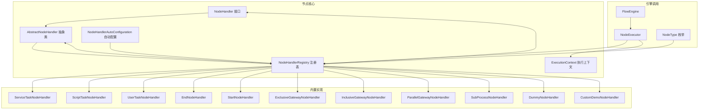
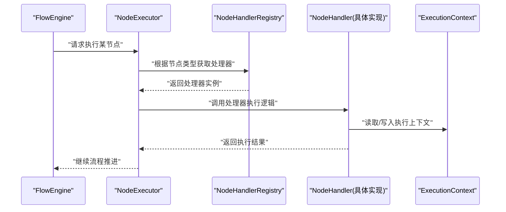
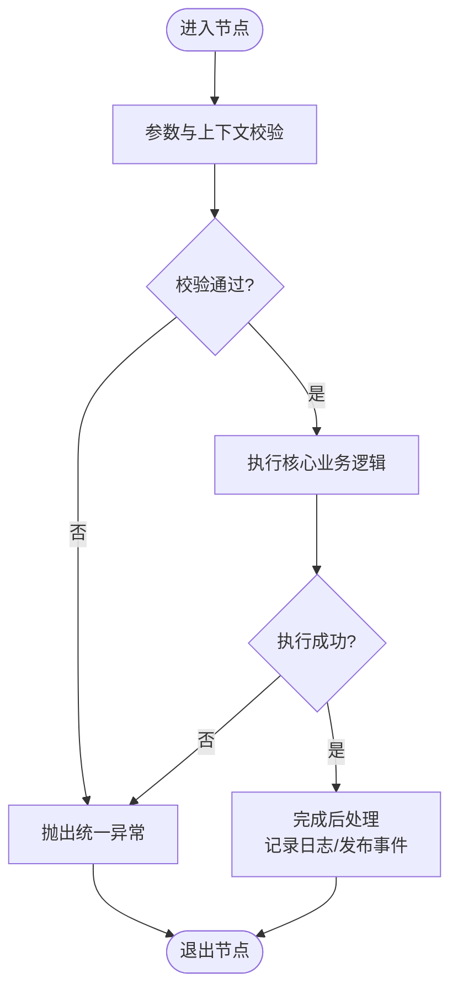
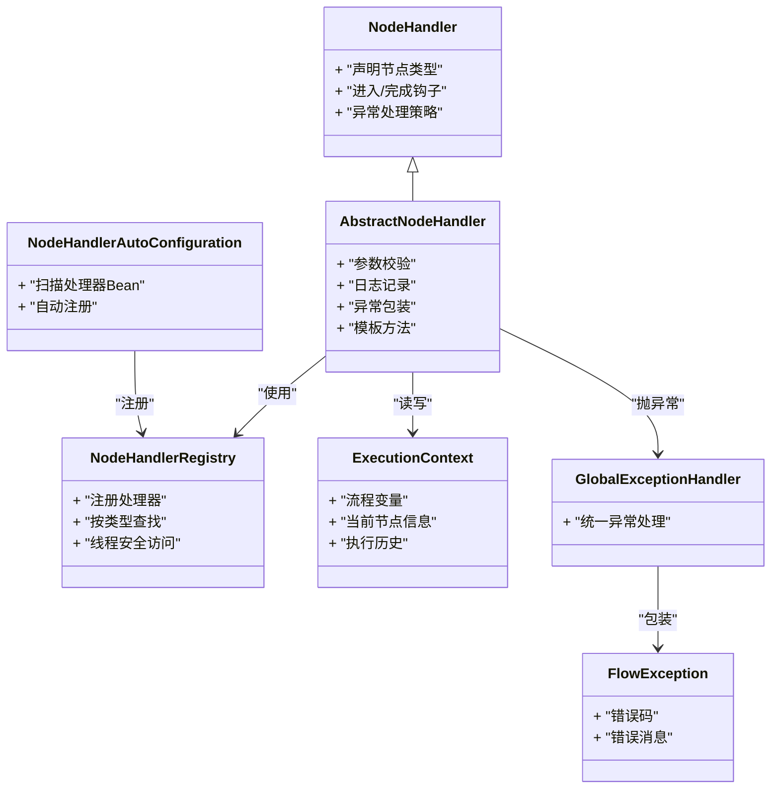

# 自定义节点开发

<cite>
**本文引用的文件**   
- [NodeHandler.java](file://flow-engine/src/main/java/com/flow/engine/node/NodeHandler.java)
- [AbstractNodeHandler.java](file://flow-engine/src/main/java/com/flow/engine/node/AbstractNodeHandler.java)
- [NodeHandlerRegistry.java](file://flow-engine/src/main/java/com/flow/engine/node/NodeHandlerRegistry.java)
- [NodeHandlerAutoConfiguration.java](file://flow-engine/src/main/java/com/flow/engine/node/NodeHandlerAutoConfiguration.java)
- [ExecutionContext.java](file://flow-engine/src/main/java/com/flow/engine/node/ExecutionContext.java)
- [CustomDemoNodeHandler.java](file://flow-engine/src/main/java/com/flow/engine/node/impl/CustomDemoNodeHandler.java)
- [ServiceTaskNodeHandler.java](file://flow-engine/src/main/java/com/flow/engine/node/impl/ServiceTaskNodeHandler.java)
- [ScriptTaskNodeHandler.java](file://flow-engine/src/main/java/com/flow/engine/node/impl/ScriptTaskNodeHandler.java)
- [UserTaskNodeHandler.java](file://flow-engine/src/main/java/com/flow/engine/node/impl/UserTaskNodeHandler.java)
- [EndNodeHandler.java](file://flow-engine/src/main/java/com/flow/engine/node/impl/EndNodeHandler.java)
- [StartNodeHandler.java](file://flow-engine/src/main/java/com/flow/engine/node/impl/StartNodeHandler.java)
- [ExclusiveGatewayNodeHandler.java](file://flow-engine/src/main/java/com/flow/engine/node/impl/ExclusiveGatewayNodeHandler.java)
- [InclusiveGatewayNodeHandler.java](file://flow-engine/src/main/java/com/flow/engine/node/impl/InclusiveGatewayNodeHandler.java)
- [ParallelGatewayNodeHandler.java](file://flow-engine/src/main/java/com/flow/engine/node/impl/ParallelGatewayNodeHandler.java)
- [SubProcessNodeHandler.java](file://flow-engine/src/main/java/com/flow/engine/node/impl/SubProcessNodeHandler.java)
- [DummyNodeHandler.java](file://flow-engine/src/main/java/com/flow/engine/node/DummyNodeHandler.java)
- [FlowEngine.java](file://flow-engine/src/main/java/com/flow/engine/engine/FlowEngine.java)
- [NodeExecutor.java](file://flow-engine/src/main/java/com/flow/engine/engine/NodeExecutor.java)
- [NodeType.java](file://flow-engine/src/main/java/com/flow/engine/common/enums/NodeType.java)
- [NodeHandlerAutoRegisterTest.java](file://flow-engine/src/test/java/com/flow/engine/node/NodeHandlerAutoRegisterTest.java)
- [NodeHandlerRegistryTest.java](file://flow-engine/src/test/java/com/flow/engine/node/NodeHandlerRegistryTest.java)
- [CustomNodeExtensionTest.java](file://flow-engine/src/test/java/com/flow/engine/node/CustomNodeExtensionTest.java)
- [BuiltinNodeTest.java](file://flow-engine/src/test/java/com/flow/engine/node/BuiltinNodeTest.java)
- [ExpressionUtils.java](file://flow-engine/src/main/java/com/flow/engine/common/utils/ExpressionUtils.java)
- [GlobalExceptionHandler.java](file://flow-engine/src/main/java/com/flow/engine/common/GlobalExceptionHandler.java)
- [FlowException.java](file://flow-engine/src/main/java/com/flow/engine/common/exception/FlowException.java)
</cite>

## 目录
1. [简介](#简介)
2. [项目结构](#项目结构)
3. [核心组件](#核心组件)
4. [架构总览](#架构总览)
5. [详细组件分析](#详细组件分析)
6. [依赖关系分析](#依赖关系分析)
7. [性能考虑](#性能考虑)
8. [故障排查指南](#故障排查指南)
9. [结论](#结论)
10. [附录](#附录)

## 简介
本指南面向需要在流程引擎中扩展“自定义节点”的开发者。文档围绕 NodeHandler 接口与 AbstractNodeHandler 抽象类展开，说明节点处理器设计规范、模板方法约定、注册机制与自动配置原理，并提供从简单任务到复杂业务节点的完整开发步骤、测试方法与调试技巧，以及性能优化与监控集成建议。

## 项目结构
与自定义节点相关的核心代码位于 flow-engine 模块的 node 包及其 impl 子包，同时包含自动配置、执行上下文、枚举类型及测试用例。

图表来源
- [NodeHandler.java](file://flow-engine/src/main/java/com/flow/engine/node/NodeHandler.java)
- [AbstractNodeHandler.java](file://flow-engine/src/main/java/com/flow/engine/node/AbstractNodeHandler.java)
- [NodeHandlerRegistry.java](file://flow-engine/src/main/java/com/flow/engine/node/NodeHandlerRegistry.java)
- [NodeHandlerAutoConfiguration.java](file://flow-engine/src/main/java/com/flow/engine/node/NodeHandlerAutoConfiguration.java)
- [ExecutionContext.java](file://flow-engine/src/main/java/com/flow/engine/node/ExecutionContext.java)
- [ServiceTaskNodeHandler.java](file://flow-engine/src/main/java/com/flow/engine/node/impl/ServiceTaskNodeHandler.java)
- [ScriptTaskNodeHandler.java](file://flow-engine/src/main/java/com/flow/engine/node/impl/ScriptTaskNodeHandler.java)
- [UserTaskNodeHandler.java](file://flow-engine/src/main/java/com/flow/engine/node/impl/UserTaskNodeHandler.java)
- [EndNodeHandler.java](file://flow-engine/src/main/java/com/flow/engine/node/impl/EndNodeHandler.java)
- [StartNodeHandler.java](file://flow-engine/src/main/java/com/flow/engine/node/impl/StartNodeHandler.java)
- [ExclusiveGatewayNodeHandler.java](file://flow-engine/src/main/java/com/flow/engine/node/impl/ExclusiveGatewayNodeHandler.java)
- [InclusiveGatewayNodeHandler.java](file://flow-engine/src/main/java/com/flow/engine/node/impl/InclusiveGatewayNodeHandler.java)
- [ParallelGatewayNodeHandler.java](file://flow-engine/src/main/java/com/flow/engine/node/impl/ParallelGatewayNodeHandler.java)
- [SubProcessNodeHandler.java](file://flow-engine/src/main/java/com/flow/engine/node/impl/SubProcessNodeHandler.java)
- [DummyNodeHandler.java](file://flow-engine/src/main/java/com/flow/engine/node/DummyNodeHandler.java)
- [CustomDemoNodeHandler.java](file://flow-engine/src/main/java/com/flow/engine/node/impl/CustomDemoNodeHandler.java)
- [FlowEngine.java](file://flow-engine/src/main/java/com/flow/engine/engine/FlowEngine.java)
- [NodeExecutor.java](file://flow-engine/src/main/java/com/flow/engine/engine/NodeExecutor.java)
- [NodeType.java](file://flow-engine/src/main/java/com/flow/engine/common/enums/NodeType.java)

章节来源
- [NodeHandler.java](file://flow-engine/src/main/java/com/flow/engine/node/NodeHandler.java)
- [AbstractNodeHandler.java](file://flow-engine/src/main/java/com/flow/engine/node/AbstractNodeHandler.java)
- [NodeHandlerRegistry.java](file://flow-engine/src/main/java/com/flow/engine/node/NodeHandlerRegistry.java)
- [NodeHandlerAutoConfiguration.java](file://flow-engine/src/main/java/com/flow/engine/node/NodeHandlerAutoConfiguration.java)
- [ExecutionContext.java](file://flow-engine/src/main/java/com/flow/engine/node/ExecutionContext.java)
- [NodeType.java](file://flow-engine/src/main/java/com/flow/engine/common/enums/NodeType.java)

## 核心组件
本节聚焦自定义节点开发的关键构件：接口规范、抽象基类、注册与自动配置、执行上下文。

- NodeHandler 接口
  - 职责：定义节点处理器的统一契约，包括节点类型标识、进入/完成生命周期钩子、异常处理策略等。
  - 关键点：所有自定义节点必须实现该接口或继承抽象基类；通过节点类型映射到具体处理器。
  
- AbstractNodeHandler 抽象类
  - 职责：提供通用能力与模板方法，如参数校验、日志记录、异常包装、默认行为等。
  - 关键点：子类只需关注核心业务逻辑；可覆盖模板方法以定制行为。

- NodeHandlerRegistry 注册表
  - 职责：维护节点类型到处理器实例的映射；支持按类型查找处理器；提供注册/更新/删除能力。
  - 关键点：线程安全访问；在自动配置阶段完成扫描与注册。

- NodeHandlerAutoConfiguration 自动配置
  - 职责：启动时扫描实现了 NodeHandler 的 Bean，并自动注册到注册表。
  - 关键点：简化开发者接入成本；无需手动装配。

- ExecutionContext 执行上下文
  - 职责：承载流程运行期数据（变量、当前节点信息、历史状态等），供处理器读写。
  - 关键点：保证跨节点的数据传递与一致性。

章节来源
- [NodeHandler.java](file://flow-engine/src/main/java/com/flow/engine/node/NodeHandler.java)
- [AbstractNodeHandler.java](file://flow-engine/src/main/java/com/flow/engine/node/AbstractNodeHandler.java)
- [NodeHandlerRegistry.java](file://flow-engine/src/main/java/com/flow/engine/node/NodeHandlerRegistry.java)
- [NodeHandlerAutoConfiguration.java](file://flow-engine/src/main/java/com/flow/engine/node/NodeHandlerAutoConfiguration.java)
- [ExecutionContext.java](file://flow-engine/src/main/java/com/flow/engine/node/ExecutionContext.java)

## 架构总览
下图展示了引擎在执行过程中如何定位并调用节点处理器，以及自动配置如何完成注册。

图表来源
- [FlowEngine.java](file://flow-engine/src/main/java/com/flow/engine/engine/FlowEngine.java)
- [NodeExecutor.java](file://flow-engine/src/main/java/com/flow/engine/engine/NodeExecutor.java)
- [NodeHandlerRegistry.java](file://flow-engine/src/main/java/com/flow/engine/node/NodeHandlerRegistry.java)
- [ExecutionContext.java](file://flow-engine/src/main/java/com/flow/engine/node/ExecutionContext.java)

## 详细组件分析

### NodeHandler 接口设计
- 设计目标
  - 为所有节点提供统一的执行入口与生命周期钩子。
  - 明确节点类型标识，便于注册表路由。
- 关键约定
  - 节点类型：由具体实现声明，用于注册与匹配。
  - 生命周期：进入节点、执行核心逻辑、完成节点等阶段钩子。
  - 异常策略：将业务异常转换为统一错误码，便于上层处理。
- 使用建议
  - 优先继承 AbstractNodeHandler 以减少样板代码。
  - 保持处理器无状态或谨慎共享可变状态，避免并发问题。

章节来源
- [NodeHandler.java](file://flow-engine/src/main/java/com/flow/engine/node/NodeHandler.java)

### AbstractNodeHandler 抽象类
- 提供的通用功能
  - 参数校验：对输入参数进行基础合法性检查。
  - 日志记录：标准化日志输出，便于追踪。
  - 异常包装：将底层异常包装为统一异常类型，附带错误码。
  - 模板方法：定义执行骨架，子类仅实现核心逻辑。
- 模板方法约定
  - 进入前处理：可用于前置校验、上下文初始化。
  - 核心执行：子类必须实现的业务逻辑。
  - 完成后处理：可用于后置清理、事件发布、指标上报。
- 扩展点
  - 覆盖模板方法以实现差异化行为。
  - 复用父类的日志与异常处理，确保一致性与可观测性。

章节来源
- [AbstractNodeHandler.java](file://flow-engine/src/main/java/com/flow/engine/node/AbstractNodeHandler.java)

### 节点注册与自动配置
- 注册表 NodeHandlerRegistry
  - 作用：集中管理节点类型到处理器实例的映射。
  - 操作：注册、查询、更新、移除处理器。
  - 线程模型：对外提供线程安全的访问接口。
- 自动配置 NodeHandlerAutoConfiguration
  - 扫描：启动时扫描 Spring 容器中所有实现 NodeHandler 的 Bean。
  - 注册：将扫描到的处理器按节点类型注册到注册表。
  - 优势：零配置接入，新增节点无需修改配置类。
- 最佳实践
  - 自定义处理器类需被 Spring 容器管理（注解标注）。
  - 确保节点类型唯一且与流程定义中的类型一致。

章节来源
- [NodeHandlerRegistry.java](file://flow-engine/src/main/java/com/flow/engine/node/NodeHandlerRegistry.java)
- [NodeHandlerAutoConfiguration.java](file://flow-engine/src/main/java/com/flow/engine/node/NodeHandlerAutoConfiguration.java)

### 执行上下文 ExecutionContext
- 职责
  - 保存流程变量、当前节点信息、执行历史等运行时数据。
  - 提供统一的读写接口，保证数据一致性。
- 使用建议
  - 在处理器进入阶段初始化必要上下文。
  - 在完成后阶段清理临时数据，避免内存泄漏。
  - 注意并发场景下的可见性与原子性。

章节来源
- [ExecutionContext.java](file://flow-engine/src/main/java/com/flow/engine/node/ExecutionContext.java)

### 内置节点实现参考
以下内置节点可作为自定义开发的参考范式：
- 服务任务 ServiceTaskNodeHandler：封装外部服务调用。
- 脚本任务 ScriptTaskNodeHandler：执行表达式或脚本。
- 用户任务 UserTaskNodeHandler：创建人工审批任务。
- 开始/结束 StartNodeHandler / EndNodeHandler：流程边界控制。
- 排他网关 ExclusiveGatewayNodeHandler：基于条件选择分支。
- 包容网关 InclusiveGatewayNodeHandler：多分支并行满足条件。
- 并行网关 ParallelGatewayNodeHandler：严格并行汇聚与分叉。
- 子流程 SubProcessNodeHandler：嵌套流程执行。
- 占位 DummyNodeHandler：空实现，便于占位或调试。
- 示例 CustomDemoNodeHandler：演示自定义节点的基本结构。

章节来源
- [ServiceTaskNodeHandler.java](file://flow-engine/src/main/java/com/flow/engine/node/impl/ServiceTaskNodeHandler.java)
- [ScriptTaskNodeHandler.java](file://flow-engine/src/main/java/com/flow/engine/node/impl/ScriptTaskNodeHandler.java)
- [UserTaskNodeHandler.java](file://flow-engine/src/main/java/com/flow/engine/node/impl/UserTaskNodeHandler.java)
- [EndNodeHandler.java](file://flow-engine/src/main/java/com/flow/engine/node/impl/EndNodeHandler.java)
- [StartNodeHandler.java](file://flow-engine/src/main/java/com/flow/engine/node/impl/StartNodeHandler.java)
- [ExclusiveGatewayNodeHandler.java](file://flow-engine/src/main/java/com/flow/engine/node/impl/ExclusiveGatewayNodeHandler.java)
- [InclusiveGatewayNodeHandler.java](file://flow-engine/src/main/java/com/flow/engine/node/impl/InclusiveGatewayNodeHandler.java)
- [ParallelGatewayNodeHandler.java](file://flow-engine/src/main/java/com/flow/engine/node/impl/ParallelGatewayNodeHandler.java)
- [SubProcessNodeHandler.java](file://flow-engine/src/main/java/com/flow/engine/node/impl/SubProcessNodeHandler.java)
- [DummyNodeHandler.java](file://flow-engine/src/main/java/com/flow/engine/node/DummyNodeHandler.java)
- [CustomDemoNodeHandler.java](file://flow-engine/src/main/java/com/flow/engine/node/impl/CustomDemoNodeHandler.java)

### 自定义节点开发步骤
- 步骤一：创建处理器类
  - 新建类实现 NodeHandler 或继承 AbstractNodeHandler。
  - 声明节点类型，确保与流程定义一致。
- 步骤二：实现业务逻辑
  - 在核心执行方法中编写业务逻辑。
  - 使用 ExecutionContext 读写流程变量。
- 步骤三：异常处理
  - 捕获业务异常并转换为统一异常类型。
  - 设置错误码与消息，便于上层统一处理。
- 步骤四：日志记录
  - 在进入/完成阶段记录关键日志。
  - 包含上下文关键字段，便于追踪。
- 步骤五：注册与自动发现
  - 确保处理器类被 Spring 容器管理。
  - 自动配置会将其注册到注册表，无需额外配置。
- 步骤六：单元测试
  - 编写处理器单测，验证正常路径与异常路径。
  - 模拟上下文与服务依赖，隔离外部系统。

章节来源
- [NodeHandler.java](file://flow-engine/src/main/java/com/flow/engine/node/NodeHandler.java)
- [AbstractNodeHandler.java](file://flow-engine/src/main/java/com/flow/engine/node/AbstractNodeHandler.java)
- [NodeHandlerAutoConfiguration.java](file://flow-engine/src/main/java/com/flow/engine/node/NodeHandlerAutoConfiguration.java)
- [ExecutionContext.java](file://flow-engine/src/main/java/com/flow/engine/node/ExecutionContext.java)

### 简单任务节点示例（概念）
- 适用场景：轻量计算、变量赋值、简单校验。
- 要点：
  - 继承 AbstractNodeHandler，覆盖核心执行方法。
  - 使用表达式工具解析变量并写入上下文。
  - 记录进入与完成日志，便于审计。
- 参考实现：
  - 参考示例处理器与脚本任务处理器的结构。

章节来源
- [CustomDemoNodeHandler.java](file://flow-engine/src/main/java/com/flow/engine/node/impl/CustomDemoNodeHandler.java)
- [ScriptTaskNodeHandler.java](file://flow-engine/src/main/java/com/flow/engine/node/impl/ScriptTaskNodeHandler.java)
- [ExpressionUtils.java](file://flow-engine/src/main/java/com/flow/engine/common/utils/ExpressionUtils.java)

### 复杂业务节点示例（概念）
- 适用场景：多步编排、外部服务调用、事务与补偿。
- 要点：
  - 在核心执行方法中编排多个子步骤。
  - 使用 try-catch 包裹每个子步骤，失败时回滚或补偿。
  - 在完成后阶段发布事件或触发后续动作。
- 参考实现：
  - 参考服务任务处理器与用户任务处理器的模式。

章节来源
- [ServiceTaskNodeHandler.java](file://flow-engine/src/main/java/com/flow/engine/node/impl/ServiceTaskNodeHandler.java)
- [UserTaskNodeHandler.java](file://flow-engine/src/main/java/com/flow/engine/node/impl/UserTaskNodeHandler.java)

### 节点执行流程图（算法级）

图表来源
- [AbstractNodeHandler.java](file://flow-engine/src/main/java/com/flow/engine/node/AbstractNodeHandler.java)
- [GlobalExceptionHandler.java](file://flow-engine/src/main/java/com/flow/engine/common/GlobalExceptionHandler.java)
- [FlowException.java](file://flow-engine/src/main/java/com/flow/engine/common/exception/FlowException.java)

## 依赖关系分析
- 组件耦合
  - 处理器依赖注册表与执行上下文。
  - 自动配置依赖 Spring 容器扫描机制。
- 外部依赖
  - 表达式工具用于动态计算。
  - 全局异常处理器统一错误响应。
- 潜在循环依赖
  - 处理器应避免反向引用注册表或自动配置，防止循环。

图表来源
- [NodeHandler.java](file://flow-engine/src/main/java/com/flow/engine/node/NodeHandler.java)
- [AbstractNodeHandler.java](file://flow-engine/src/main/java/com/flow/engine/node/AbstractNodeHandler.java)
- [NodeHandlerRegistry.java](file://flow-engine/src/main/java/com/flow/engine/node/NodeHandlerRegistry.java)
- [NodeHandlerAutoConfiguration.java](file://flow-engine/src/main/java/com/flow/engine/node/NodeHandlerAutoConfiguration.java)
- [ExecutionContext.java](file://flow-engine/src/main/java/com/flow/engine/node/ExecutionContext.java)
- [GlobalExceptionHandler.java](file://flow-engine/src/main/java/com/flow/engine/common/GlobalExceptionHandler.java)
- [FlowException.java](file://flow-engine/src/main/java/com/flow/engine/common/exception/FlowException.java)

章节来源
- [NodeHandler.java](file://flow-engine/src/main/java/com/flow/engine/node/NodeHandler.java)
- [AbstractNodeHandler.java](file://flow-engine/src/main/java/com/flow/engine/node/AbstractNodeHandler.java)
- [NodeHandlerRegistry.java](file://flow-engine/src/main/java/com/flow/engine/node/NodeHandlerRegistry.java)
- [NodeHandlerAutoConfiguration.java](file://flow-engine/src/main/java/com/flow/engine/node/NodeHandlerAutoConfiguration.java)
- [ExecutionContext.java](file://flow-engine/src/main/java/com/flow/engine/node/ExecutionContext.java)
- [GlobalExceptionHandler.java](file://flow-engine/src/main/java/com/flow/engine/common/GlobalExceptionHandler.java)
- [FlowException.java](file://flow-engine/src/main/java/com/flow/engine/common/exception/FlowException.java)

## 性能考虑
- 处理器无状态化
  - 避免在处理器中持有长生命周期可变状态，减少锁竞争。
- 批量与异步
  - 对于耗时操作，考虑异步执行或批处理，降低阻塞。
- 表达式计算优化
  - 缓存常用表达式解析结果，减少重复计算。
- 上下文瘦身
  - 及时清理临时变量，避免上下文膨胀导致内存压力。
- 监控与度量
  - 在处理器进入/完成阶段埋点，统计耗时与成功率。

[本节为通用指导，不直接分析具体文件]

## 故障排查指南
- 常见问题
  - 节点类型未注册：检查处理器是否被 Spring 管理且自动配置生效。
  - 上下文变量缺失：在进入阶段初始化必要变量。
  - 异常未统一：确保抛出统一异常类型，便于全局处理。
- 调试技巧
  - 开启详细日志，记录进入/完成与关键中间状态。
  - 使用单测模拟上下文与服务依赖，快速定位问题。
- 参考测试
  - 自动注册测试：验证处理器是否被自动发现与注册。
  - 注册表测试：验证处理器查找与更新行为。
  - 自定义扩展测试：验证新节点在流程中的执行路径。
  - 内置节点测试：验证现有节点行为是否符合预期。

章节来源
- [NodeHandlerAutoRegisterTest.java](file://flow-engine/src/test/java/com/flow/engine/node/NodeHandlerAutoRegisterTest.java)
- [NodeHandlerRegistryTest.java](file://flow-engine/src/test/java/com/flow/engine/node/NodeHandlerRegistryTest.java)
- [CustomNodeExtensionTest.java](file://flow-engine/src/test/java/com/flow/engine/node/CustomNodeExtensionTest.java)
- [BuiltinNodeTest.java](file://flow-engine/src/test/java/com/flow/engine/node/BuiltinNodeTest.java)
- [GlobalExceptionHandler.java](file://flow-engine/src/main/java/com/flow/engine/common/GlobalExceptionHandler.java)
- [FlowException.java](file://flow-engine/src/main/java/com/flow/engine/common/exception/FlowException.java)

## 结论
通过 NodeHandler 接口与 AbstractNodeHandler 抽象类，结合注册表与自动配置，开发者可以高效地扩展自定义节点。遵循无状态、统一异常与标准日志的最佳实践，配合完善的测试与监控，能够保障节点的可维护性与稳定性。

[本节为总结性内容，不直接分析具体文件]

## 附录
- 相关枚举
  - NodeType：定义支持的节点类型，用于流程定义与处理器匹配。
- 引擎调用
  - FlowEngine 与 NodeExecutor：负责流程调度与节点执行。

章节来源
- [NodeType.java](file://flow-engine/src/main/java/com/flow/engine/common/enums/NodeType.java)
- [FlowEngine.java](file://flow-engine/src/main/java/com/flow/engine/engine/FlowEngine.java)
- [NodeExecutor.java](file://flow-engine/src/main/java/com/flow/engine/engine/NodeExecutor.java)