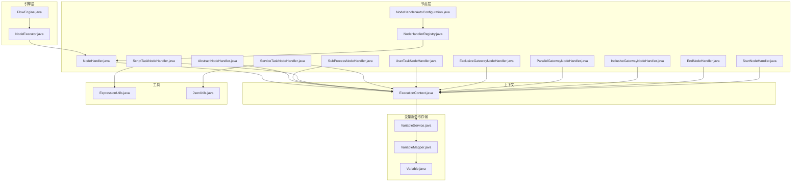
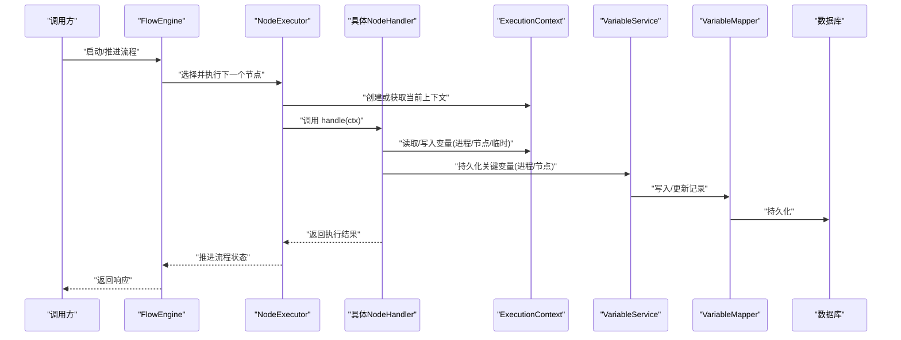
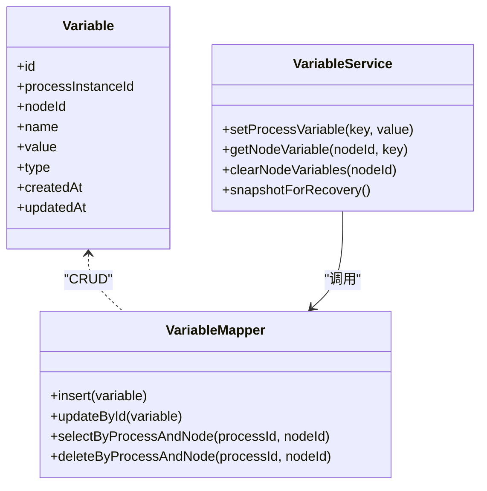
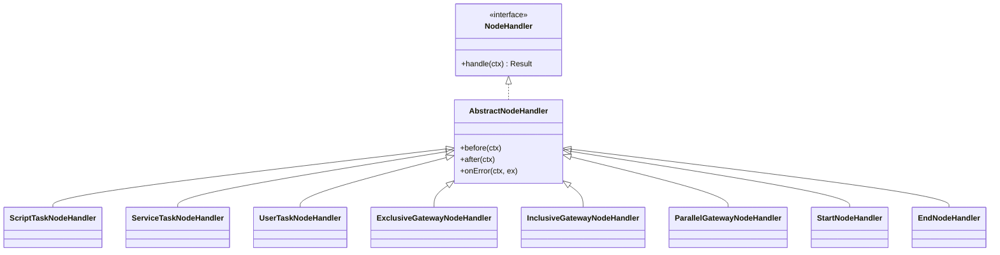
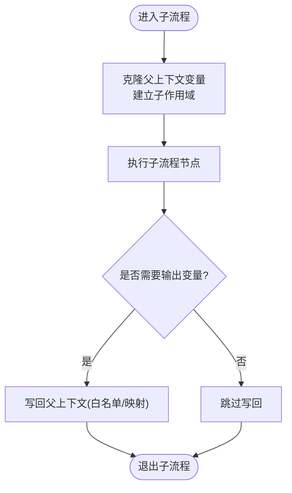
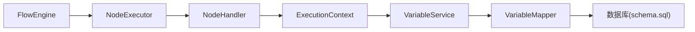

# 节点执行上下文

<cite>
**本文引用的文件**   
- [ExecutionContext.java](file://flow-engine/src/main/java/com/flow/engine/node/ExecutionContext.java)
- [NodeHandler.java](file://flow-engine/src/main/java/com/flow/engine/node/NodeHandler.java)
- [AbstractNodeHandler.java](file://flow-engine/src/main/java/com/flow/engine/node/AbstractNodeHandler.java)
- [VariableService.java](file://flow-engine/src/main/java/com/flow/engine/service/VariableService.java)
- [VariableMapper.java](file://flow-engine/src/main/java/com/flow/engine/mapper/VariableMapper.java)
- [Variable.java](file://flow-engine/src/main/java/com/flow/engine/entity/Variable.java)
- [ProcessInstanceService.java](file://flow-engine/src/main/java/com/flow/engine/service/ProcessInstanceService.java)
- [FlowEngine.java](file://flow-engine/src/main/java/com/flow/engine/engine/FlowEngine.java)
- [NodeExecutor.java](file://flow-engine/src/main/java/com/flow/engine/engine/NodeExecutor.java)
- [SubProcessNodeHandler.java](file://flow-engine/src/main/java/com/flow/engine/node/impl/SubProcessNodeHandler.java)
- [ScriptTaskNodeHandler.java](file://flow-engine/src/main/java/com/flow/engine/node/impl/ScriptTaskNodeHandler.java)
- [ServiceTaskNodeHandler.java](file://flow-engine/src/main/java/com/flow/engine/node/impl/ServiceTaskNodeHandler.java)
- [UserTaskNodeHandler.java](file://flow-engine/src/main/java/com/flow/engine/node/impl/UserTaskNodeHandler.java)
- [ExclusiveGatewayNodeHandler.java](file://flow-engine/src/main/java/com/flow/engine/node/impl/ExclusiveGatewayNodeHandler.java)
- [ParallelGatewayNodeHandler.java](file://flow-engine/src/main/java/com/flow/engine/node/impl/ParallelGatewayNodeHandler.java)
- [InclusiveGatewayNodeHandler.java](file://flow-engine/src/main/java/com/flow/engine/node/impl/InclusiveGatewayNodeHandler.java)
- [EndNodeHandler.java](file://flow-engine/src/main/java/com/flow/engine/node/impl/EndNodeHandler.java)
- [StartNodeHandler.java](file://flow-engine/src/main/java/com/flow/engine/node/impl/StartNodeHandler.java)
- [NodeHandlerRegistry.java](file://flow-engine/src/main/java/com/flow/engine/node/NodeHandlerRegistry.java)
- [NodeHandlerAutoConfiguration.java](file://flow-engine/src/main/java/com/flow/engine/node/NodeHandlerAutoConfiguration.java)
- [ExpressionUtils.java](file://flow-engine/src/main/java/com/flow/engine/common/utils/ExpressionUtils.java)
- [JsonUtils.java](file://flow-engine/src/main/java/com/flow/engine/common/utils/JsonUtils.java)
- [schema.sql](file://flow-engine/src/main/resources/db/schema.sql)
</cite>

## 目录
1. [简介](#简介)
2. [项目结构](#项目结构)
3. [核心组件](#核心组件)
4. [架构总览](#架构总览)
5. [详细组件分析](#详细组件分析)
6. [依赖分析](#依赖分析)
7. [性能考虑](#性能考虑)
8. [故障排查指南](#故障排查指南)
9. [结论](#结论)
10. [附录](#附录)

## 简介
本技术文档聚焦于“节点执行上下文系统”，围绕 ExecutionContext 的作用域管理、生命周期控制、变量管理机制（进程变量、节点变量、临时变量）、变量传递与继承、线程安全与并发访问控制、上下文数据持久化与恢复策略，以及最佳实践与性能优化建议进行系统化阐述。目标是帮助开发者在扩展自定义节点、编写脚本任务或服务任务时，正确理解并高效使用执行上下文，确保流程执行的稳定性与可观测性。

## 项目结构
与执行上下文相关的核心代码位于 flow-engine 模块的 node、service、engine、entity、mapper 等包中。下图给出与上下文和变量相关的关键文件关系概览：

图表来源
- [FlowEngine.java](file://flow-engine/src/main/java/com/flow/engine/engine/FlowEngine.java)
- [NodeExecutor.java](file://flow-engine/src/main/java/com/flow/engine/engine/NodeExecutor.java)
- [NodeHandler.java](file://flow-engine/src/main/java/com/flow/engine/node/NodeHandler.java)
- [AbstractNodeHandler.java](file://flow-engine/src/main/java/com/flow/engine/node/AbstractNodeHandler.java)
- [SubProcessNodeHandler.java](file://flow-engine/src/main/java/com/flow/engine/node/impl/SubProcessNodeHandler.java)
- [ScriptTaskNodeHandler.java](file://flow-engine/src/main/java/com/flow/engine/node/impl/ScriptTaskNodeHandler.java)
- [ServiceTaskNodeHandler.java](file://flow-engine/src/main/java/com/flow/engine/node/impl/ServiceTaskNodeHandler.java)
- [UserTaskNodeHandler.java](file://flow-engine/src/main/java/com/flow/engine/node/impl/UserTaskNodeHandler.java)
- [ExclusiveGatewayNodeHandler.java](file://flow-engine/src/main/java/com/flow/engine/node/impl/ExclusiveGatewayNodeHandler.java)
- [ParallelGatewayNodeHandler.java](file://flow-engine/src/main/java/com/flow/engine/node/impl/ParallelGatewayNodeHandler.java)
- [InclusiveGatewayNodeHandler.java](file://flow-engine/src/main/java/com/flow/engine/node/impl/InclusiveGatewayNodeHandler.java)
- [EndNodeHandler.java](file://flow-engine/src/main/java/com/flow/engine/node/impl/EndNodeHandler.java)
- [StartNodeHandler.java](file://flow-engine/src/main/java/com/flow/engine/node/impl/StartNodeHandler.java)
- [NodeHandlerRegistry.java](file://flow-engine/src/main/java/com/flow/engine/node/NodeHandlerRegistry.java)
- [NodeHandlerAutoConfiguration.java](file://flow-engine/src/main/java/com/flow/engine/node/NodeHandlerAutoConfiguration.java)
- [ExecutionContext.java](file://flow-engine/src/main/java/com/flow/engine/node/ExecutionContext.java)
- [VariableService.java](file://flow-engine/src/main/java/com/flow/engine/service/VariableService.java)
- [VariableMapper.java](file://flow-engine/src/main/java/com/flow/engine/mapper/VariableMapper.java)
- [Variable.java](file://flow-engine/src/main/java/com/flow/engine/entity/Variable.java)
- [ExpressionUtils.java](file://flow-engine/src/main/java/com/flow/engine/common/utils/ExpressionUtils.java)
- [JsonUtils.java](file://flow-engine/src/main/java/com/flow/engine/common/utils/JsonUtils.java)

章节来源
- [ExecutionContext.java](file://flow-engine/src/main/java/com/flow/engine/node/ExecutionContext.java)
- [VariableService.java](file://flow-engine/src/main/java/com/flow/engine/service/VariableService.java)
- [VariableMapper.java](file://flow-engine/src/main/java/com/flow/engine/mapper/VariableMapper.java)
- [Variable.java](file://flow-engine/src/main/java/com/flow/engine/entity/Variable.java)
- [FlowEngine.java](file://flow-engine/src/main/java/com/flow/engine/engine/FlowEngine.java)
- [NodeExecutor.java](file://flow-engine/src/main/java/com/flow/engine/engine/NodeExecutor.java)

## 核心组件
- 执行上下文 ExecutionContext：封装当前节点执行所需的状态与作用域，提供变量的读写、作用域隔离、生命周期钩子等能力。
- 节点处理器 NodeHandler 及抽象实现 AbstractNodeHandler：定义节点执行接口与通用逻辑，统一接入 ExecutionContext。
- 变量服务 VariableService 与实体 Variable、映射 VariableMapper：负责变量的持久化、查询与变更，支撑进程级变量与节点级变量的落库与恢复。
- 引擎 FlowEngine 与调度器 NodeExecutor：驱动流程推进与节点执行，创建/切换上下文，协调变量服务完成状态同步。
- 内置节点处理器：如 StartNodeHandler、EndNodeHandler、ScriptTaskNodeHandler、ServiceTaskNodeHandler、UserTaskNodeHandler、网关处理器等，均基于 ExecutionContext 完成变量读写与流程分支判断。
- 注册与自动装配：NodeHandlerRegistry 与 NodeHandlerAutoConfiguration 负责处理器发现与注入，保证上下文在各节点间一致可用。

章节来源
- [ExecutionContext.java](file://flow-engine/src/main/java/com/flow/engine/node/ExecutionContext.java)
- [NodeHandler.java](file://flow-engine/src/main/java/com/flow/engine/node/NodeHandler.java)
- [AbstractNodeHandler.java](file://flow-engine/src/main/java/com/flow/engine/node/AbstractNodeHandler.java)
- [VariableService.java](file://flow-engine/src/main/java/com/flow/engine/service/VariableService.java)
- [VariableMapper.java](file://flow-engine/src/main/java/com/flow/engine/mapper/VariableMapper.java)
- [Variable.java](file://flow-engine/src/main/java/com/flow/engine/entity/Variable.java)
- [FlowEngine.java](file://flow-engine/src/main/java/com/flow/engine/engine/FlowEngine.java)
- [NodeExecutor.java](file://flow-engine/src/main/java/com/flow/engine/engine/NodeExecutor.java)
- [NodeHandlerRegistry.java](file://flow-engine/src/main/java/com/flow/engine/node/NodeHandlerRegistry.java)
- [NodeHandlerAutoConfiguration.java](file://flow-engine/src/main/java/com/flow/engine/node/NodeHandlerAutoConfiguration.java)

## 架构总览
下图展示从引擎到节点再到变量服务的调用链路与上下文贯穿方式：

图表来源
- [FlowEngine.java](file://flow-engine/src/main/java/com/flow/engine/engine/FlowEngine.java)
- [NodeExecutor.java](file://flow-engine/src/main/java/com/flow/engine/engine/NodeExecutor.java)
- [NodeHandler.java](file://flow-engine/src/main/java/com/flow/engine/node/NodeHandler.java)
- [ExecutionContext.java](file://flow-engine/src/main/java/com/flow/engine/node/ExecutionContext.java)
- [VariableService.java](file://flow-engine/src/main/java/com/flow/engine/service/VariableService.java)
- [VariableMapper.java](file://flow-engine/src/main/java/com/flow/engine/mapper/VariableMapper.java)

## 详细组件分析

### 执行上下文 ExecutionContext
- 作用域管理
  - 进程变量：跨节点共享，生命周期与流程实例绑定，适合全局配置、业务主键、聚合结果等。
  - 节点变量：仅在当前节点有效，节点完成后通常清理或归档，适合中间计算结果、局部状态。
  - 临时变量：用于表达式求值、条件判断等短期场景，不持久化，避免污染长期状态。
- 生命周期控制
  - 进入节点：初始化上下文快照，准备只读视图；必要时加载父上下文变量作为初始值。
  - 执行阶段：允许读写临时变量与节点变量；对进程变量的写操作需经事务边界与幂等校验。
  - 退出节点：提交持久化变更，清理临时变量，保留必要的节点变量快照以供审计或回滚。
- 线程安全与并发
  - 上下文对象按执行流隔离，同一流程实例在不同线程并行执行不同分支时，应通过唯一标识区分上下文实例。
  - 对共享资源（如缓存、外部服务）的访问需加锁或使用线程安全容器，避免竞态条件。
- 数据持久化与恢复
  - 关键变量变更采用事件驱动落库，支持断点续跑；异常时根据最近一次成功快照恢复。
  - 大对象优先走外部存储，上下文中仅保留引用，降低内存占用与序列化开销。

章节来源
- [ExecutionContext.java](file://flow-engine/src/main/java/com/flow/engine/node/ExecutionContext.java)

### 变量模型与存储
- 变量实体 Variable 与映射 VariableMapper 提供统一的变量存取接口，支持按流程实例、节点维度组织数据。
- VariableService 封装增删改查与批量操作，提供一致性保障与重试机制。
- schema.sql 定义变量表结构与索引，确保按流程实例与节点维度的查询效率。

图表来源
- [Variable.java](file://flow-engine/src/main/java/com/flow/engine/entity/Variable.java)
- [VariableMapper.java](file://flow-engine/src/main/java/com/flow/engine/mapper/VariableMapper.java)
- [VariableService.java](file://flow-engine/src/main/java/com/flow/engine/service/VariableService.java)
- [schema.sql](file://flow-engine/src/main/resources/db/schema.sql)

章节来源
- [Variable.java](file://flow-engine/src/main/java/com/flow/engine/entity/Variable.java)
- [VariableMapper.java](file://flow-engine/src/main/java/com/flow/engine/mapper/VariableMapper.java)
- [VariableService.java](file://flow-engine/src/main/java/com/flow/engine/service/VariableService.java)
- [schema.sql](file://flow-engine/src/main/resources/db/schema.sql)

### 节点处理器与上下文交互
- 抽象处理器 AbstractNodeHandler 提供通用的上下文接入与错误处理模板方法，具体节点处理器按需覆盖。
- 各内置节点处理器示例：
  - ScriptTaskNodeHandler：通过表达式引擎读取上下文变量，计算后写回节点变量或进程变量。
  - ServiceTaskNodeHandler：在服务调用前后读写上下文，确保失败时的回滚与重试。
  - UserTaskNodeHandler：用户任务表单数据回填至上下文，支持权限校验与字段过滤。
  - 网关处理器（排他/包含/并行）：依据上下文变量决定分支走向，必要时合并分支状态。
  - 开始/结束节点：初始化或清理上下文，确保生命周期完整。

图表来源
- [NodeHandler.java](file://flow-engine/src/main/java/com/flow/engine/node/NodeHandler.java)
- [AbstractNodeHandler.java](file://flow-engine/src/main/java/com/flow/engine/node/AbstractNodeHandler.java)
- [ScriptTaskNodeHandler.java](file://flow-engine/src/main/java/com/flow/engine/node/impl/ScriptTaskNodeHandler.java)
- [ServiceTaskNodeHandler.java](file://flow-engine/src/main/java/com/flow/engine/node/impl/ServiceTaskNodeHandler.java)
- [UserTaskNodeHandler.java](file://flow-engine/src/main/java/com/flow/engine/node/impl/UserTaskNodeHandler.java)
- [ExclusiveGatewayNodeHandler.java](file://flow-engine/src/main/java/com/flow/engine/node/impl/ExclusiveGatewayNodeHandler.java)
- [InclusiveGatewayNodeHandler.java](file://flow-engine/src/main/java/com/flow/engine/node/impl/InclusiveGatewayNodeHandler.java)
- [ParallelGatewayNodeHandler.java](file://flow-engine/src/main/java/com/flow/engine/node/impl/ParallelGatewayNodeHandler.java)
- [StartNodeHandler.java](file://flow-engine/src/main/java/com/flow/engine/node/impl/StartNodeHandler.java)
- [EndNodeHandler.java](file://flow-engine/src/main/java/com/flow/engine/node/impl/EndNodeHandler.java)

章节来源
- [NodeHandler.java](file://flow-engine/src/main/java/com/flow/engine/node/NodeHandler.java)
- [AbstractNodeHandler.java](file://flow-engine/src/main/java/com/flow/engine/node/AbstractNodeHandler.java)
- [ScriptTaskNodeHandler.java](file://flow-engine/src/main/java/com/flow/engine/node/impl/ScriptTaskNodeHandler.java)
- [ServiceTaskNodeHandler.java](file://flow-engine/src/main/java/com/flow/engine/node/impl/ServiceTaskNodeHandler.java)
- [UserTaskNodeHandler.java](file://flow-engine/src/main/java/com/flow/engine/node/impl/UserTaskNodeHandler.java)
- [ExclusiveGatewayNodeHandler.java](file://flow-engine/src/main/java/com/flow/engine/node/impl/ExclusiveGatewayNodeHandler.java)
- [InclusiveGatewayNodeHandler.java](file://flow-engine/src/main/java/com/flow/engine/node/impl/InclusiveGatewayNodeHandler.java)
- [ParallelGatewayNodeHandler.java](file://flow-engine/src/main/java/com/flow/engine/node/impl/ParallelGatewayNodeHandler.java)
- [StartNodeHandler.java](file://flow-engine/src/main/java/com/flow/engine/node/impl/StartNodeHandler.java)
- [EndNodeHandler.java](file://flow-engine/src/main/java/com/flow/engine/node/impl/EndNodeHandler.java)

### 变量传递与继承机制
- 父子节点变量共享与隔离
  - 子流程 SubProcessNodeHandler 在执行前克隆父上下文的部分变量作为初始值，并在结束后将必要结果回写父上下文，形成可控的数据继承。
  - 普通父子节点之间遵循“向上可见、向下隔离”的原则：子节点可读取父节点的进程变量，但不应直接修改；如需影响父上下文，应通过显式输出变量约定。
- 变量传递路径
  - 入口：流程启动时由 ProcessInstanceService 初始化进程变量。
  - 流转：节点处理器在 handle 中读取上下文变量，计算后写回节点变量或进程变量。
  - 出口：子流程结束时将输出变量合并入父上下文，保持命名空间清晰。

图表来源
- [SubProcessNodeHandler.java](file://flow-engine/src/main/java/com/flow/engine/node/impl/SubProcessNodeHandler.java)
- [ProcessInstanceService.java](file://flow-engine/src/main/java/com/flow/engine/service/ProcessInstanceService.java)

章节来源
- [SubProcessNodeHandler.java](file://flow-engine/src/main/java/com/flow/engine/node/impl/SubProcessNodeHandler.java)
- [ProcessInstanceService.java](file://flow-engine/src/main/java/com/flow/engine/service/ProcessInstanceService.java)

### 表达式与工具集成
- 表达式求值 ExpressionUtils：在脚本任务中解析与执行表达式，读取上下文变量参与计算。
- JSON 工具 JsonUtils：用于变量序列化与反序列化，配合大对象存储策略减少内存压力。

章节来源
- [ExpressionUtils.java](file://flow-engine/src/main/java/com/flow/engine/common/utils/ExpressionUtils.java)
- [JsonUtils.java](file://flow-engine/src/main/java/com/flow/engine/common/utils/JsonUtils.java)

## 依赖分析
- 耦合与内聚
  - ExecutionContext 与 VariableService 高内聚，变量读写职责清晰；节点处理器通过抽象基类统一接入，降低重复代码。
  - 引擎层 FlowEngine 与 NodeExecutor 解耦节点实现细节，便于扩展新节点类型。
- 外部依赖
  - 数据库通过 VariableMapper 访问，schema.sql 定义表结构与索引，确保查询与写入性能。
- 潜在循环依赖
  - 节点处理器不应反向依赖引擎层，避免循环；上下文与服务层单向依赖，符合分层原则。

图表来源
- [FlowEngine.java](file://flow-engine/src/main/java/com/flow/engine/engine/FlowEngine.java)
- [NodeExecutor.java](file://flow-engine/src/main/java/com/flow/engine/engine/NodeExecutor.java)
- [NodeHandler.java](file://flow-engine/src/main/java/com/flow/engine/node/NodeHandler.java)
- [ExecutionContext.java](file://flow-engine/src/main/java/com/flow/engine/node/ExecutionContext.java)
- [VariableService.java](file://flow-engine/src/main/java/com/flow/engine/service/VariableService.java)
- [VariableMapper.java](file://flow-engine/src/main/java/com/flow/engine/mapper/VariableMapper.java)
- [schema.sql](file://flow-engine/src/main/resources/db/schema.sql)

章节来源
- [FlowEngine.java](file://flow-engine/src/main/java/com/flow/engine/engine/FlowEngine.java)
- [NodeExecutor.java](file://flow-engine/src/main/java/com/flow/engine/engine/NodeExecutor.java)
- [NodeHandler.java](file://flow-engine/src/main/java/com/flow/engine/node/NodeHandler.java)
- [ExecutionContext.java](file://flow-engine/src/main/java/com/flow/engine/node/ExecutionContext.java)
- [VariableService.java](file://flow-engine/src/main/java/com/flow/engine/service/VariableService.java)
- [VariableMapper.java](file://flow-engine/src/main/java/com/flow/engine/mapper/VariableMapper.java)
- [schema.sql](file://flow-engine/src/main/resources/db/schema.sql)

## 性能考虑
- 大对象处理
  - 将大对象（如附件、大型JSON）存入外部存储，上下文中仅保存引用与元信息，避免频繁序列化与内存膨胀。
- 变量粒度与批量操作
  - 尽量合并小变量为结构化对象，减少数据库往返次数；批量更新时使用事务与批处理接口。
- 索引与查询优化
  - 针对流程实例ID、节点ID建立复合索引，提升按作用域检索性能。
- 缓存策略
  - 对热点进程变量可引入本地缓存，注意失效策略与一致性校验，避免脏读。
- 并发与锁
  - 并行网关分支对共享变量的写操作需加行级锁或乐观锁，防止覆盖与丢失更新。

[本节为通用性能指导，无需特定文件来源]

## 故障排查指南
- 常见问题定位
  - 变量未生效：检查是否在正确的节点作用域写入，确认是否被后续节点覆盖。
  - 子流程变量未回写：核对输出变量映射与白名单配置。
  - 并发冲突：查看是否存在无锁的并行写，必要时引入版本号或分布式锁。
  - 持久化失败：检查 VariableService 的事务边界与重试策略，确认数据库连接与索引。
- 日志与监控
  - 在节点进入/退出、变量变更处增加审计日志，结合流程监控服务追踪上下文状态变化。
- 恢复与重放
  - 利用最近一次成功快照恢复上下文，确保断点续跑的一致性。

章节来源
- [VariableService.java](file://flow-engine/src/main/java/com/flow/engine/service/VariableService.java)
- [VariableMapper.java](file://flow-engine/src/main/java/com/flow/engine/mapper/VariableMapper.java)
- [schema.sql](file://flow-engine/src/main/resources/db/schema.sql)

## 结论
ExecutionContext 作为节点执行的核心载体，提供了清晰的作用域划分与生命周期管理，配合 VariableService 与持久化层实现了稳定可靠的变量机制。通过合理的变量传递与继承策略、严格的并发控制与完善的恢复机制，系统能够在复杂流程场景中保持高性能与高可用。建议在扩展自定义节点时严格遵循上下文契约，谨慎管理变量作用域与持久化时机，并结合性能优化与故障排查手段，持续提升流程引擎的整体质量。

[本节为总结性内容，无需特定文件来源]

## 附录
- 最佳实践清单
  - 明确变量作用域：进程变量用于跨节点共享，节点变量用于局部状态，临时变量仅用于计算过程。
  - 控制变量大小：大对象走外部存储，上下文仅保留引用。
  - 幂等写入：对进程变量的更新需具备幂等性，避免重复提交导致不一致。
  - 子流程输出白名单：仅暴露必要变量给父上下文，保持命名空间整洁。
  - 并发写保护：并行分支对共享变量写操作加锁或版本控制。
  - 快照与恢复：关键步骤前生成快照，异常时快速恢复。
  - 监控与审计：记录变量变更轨迹，便于问题回溯。

[本节为通用建议，无需特定文件来源]