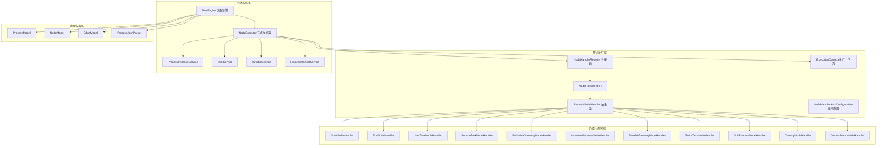
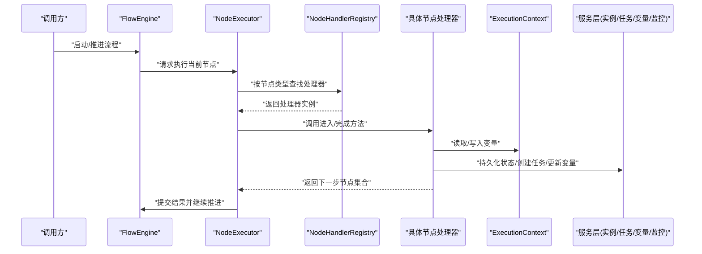
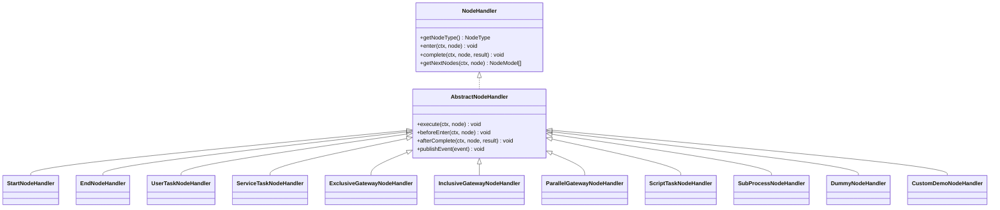
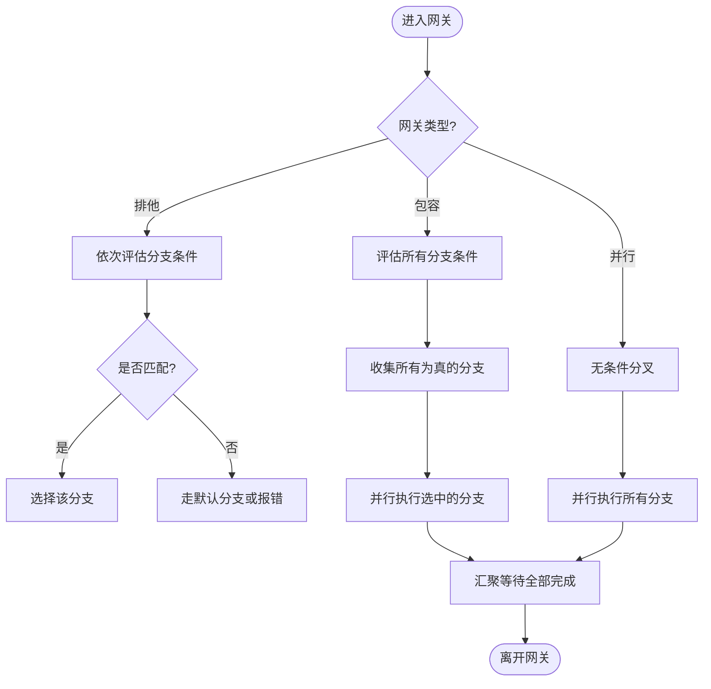
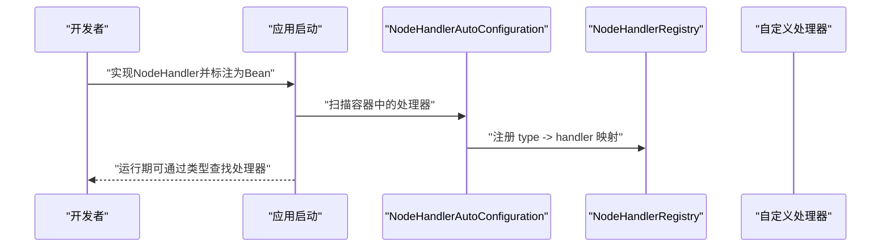
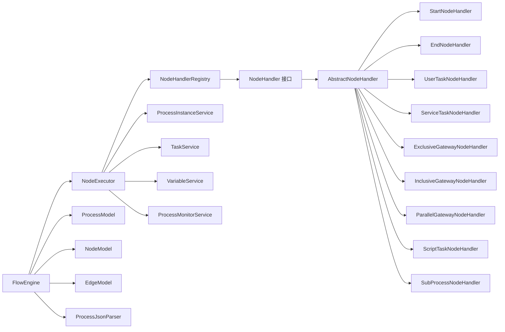

# 节点执行器

<cite>
**本文引用的文件**   
- [NodeHandler.java](file://flow-engine/src/main/java/com/flow/engine/node/NodeHandler.java)
- [AbstractNodeHandler.java](file://flow-engine/src/main/java/com/flow/engine/node/AbstractNodeHandler.java)
- [ExecutionContext.java](file://flow-engine/src/main/java/com/flow/engine/node/ExecutionContext.java)
- [NodeHandlerRegistry.java](file://flow-engine/src/main/java/com/flow/engine/node/NodeHandlerRegistry.java)
- [NodeHandlerAutoConfiguration.java](file://flow-engine/src/main/java/com/flow/engine/node/NodeHandlerAutoConfiguration.java)
- [DummyNodeHandler.java](file://flow-engine/src/main/java/com/flow/engine/node/DummyNodeHandler.java)
- [StartNodeHandler.java](file://flow-engine/src/main/java/com/flow/engine/node/impl/StartNodeHandler.java)
- [EndNodeHandler.java](file://flow-engine/src/main/java/com/flow/engine/node/impl/EndNodeHandler.java)
- [UserTaskNodeHandler.java](file://flow-engine/src/main/java/com/flow/engine/node/impl/UserTaskNodeHandler.java)
- [ServiceTaskNodeHandler.java](file://flow-engine/src/main/java/com/flow/engine/node/impl/ServiceTaskNodeHandler.java)
- [ExclusiveGatewayNodeHandler.java](file://flow-engine/src/main/java/com/flow/engine/node/impl/ExclusiveGatewayNodeHandler.java)
- [InclusiveGatewayNodeHandler.java](file://flow-engine/src/main/java/com/flow/engine/node/impl/InclusiveGatewayNodeHandler.java)
- [ParallelGatewayNodeHandler.java](file://flow-engine/src/main/java/com/flow/engine/node/impl/ParallelGatewayNodeHandler.java)
- [ScriptTaskNodeHandler.java](file://flow-engine/src/main/java/com/flow/engine/node/impl/ScriptTaskNodeHandler.java)
- [SubProcessNodeHandler.java](file://flow-engine/src/main/java/com/flow/engine/node/impl/SubProcessNodeHandler.java)
- [CustomDemoNodeHandler.java](file://flow-engine/src/main/java/com/flow/engine/node/impl/CustomDemoNodeHandler.java)
- [FlowEngine.java](file://flow-engine/src/main/java/com/flow/engine/engine/FlowEngine.java)
- [NodeExecutor.java](file://flow-engine/src/main/java/com/flow/engine/engine/NodeExecutor.java)
- [NodeType.java](file://flow-engine/src/main/java/com/flow/engine/common/enums/NodeType.java)
- [ExpressionUtils.java](file://flow-engine/src/main/java/com/flow/engine/common/utils/ExpressionUtils.java)
- [VariableService.java](file://flow-engine/src/main/java/com/flow/engine/service/VariableService.java)
- [ProcessInstanceService.java](file://flow-engine/src/main/java/com/flow/engine/service/ProcessInstanceService.java)
- [TaskService.java](file://flow-engine/src/main/java/com/flow/engine/service/TaskService.java)
- [ProcessDefinitionService.java](file://flow-engine/src/main/java/com/flow/engine/service/ProcessDefinitionService.java)
- [ProcessMonitorService.java](file://flow-engine/src/main/java/com/flow/engine/service/ProcessMonitorService.java)
- [ProcessModel.java](file://flow-engine/src/main/java/com/flow/engine/model/ProcessModel.java)
- [NodeModel.java](file://flow-engine/src/main/java/com/flow/engine/model/NodeModel.java)
- [EdgeModel.java](file://flow-engine/src/main/java/com/flow/engine/model/EdgeModel.java)
- [ProcessJsonParser.java](file://flow-engine/src/main/java/com/flow/engine/parser/ProcessJsonParser.java)
- [BuiltinNodeTest.java](file://flow-engine/src/test/java/com/flow/engine/node/BuiltinNodeTest.java)
- [CustomNodeExtensionTest.java](file://flow-engine/src/test/java/com/flow/engine/node/CustomNodeExtensionTest.java)
- [NodeHandlerRegistryTest.java](file://flow-engine/src/test/java/com/flow/engine/node/NodeHandlerRegistryTest.java)
- [NodeHandlerAutoRegisterTest.java](file://flow-engine/src/test/java/com/flow/engine/node/NodeHandlerAutoRegisterTest.java)
- [ProcessStartedEvent.java](file://flow-engine/src/main/java/com/flow/engine/event/ProcessStartedEvent.java)
- [NodeEnteredEvent.java](file://flow-engine/src/main/java/com/flow/engine/event/NodeEnteredEvent.java)
- [NodeCompletedEvent.java](file://flow-engine/src/main/java/com/flow/engine/event/NodeCompletedEvent.java)
</cite>

## 目录
1. [简介](#简介)
2. [项目结构](#项目结构)
3. [核心组件](#核心组件)
4. [架构总览](#架构总览)
5. [详细组件分析](#详细组件分析)
6. [依赖关系分析](#依赖关系分析)
7. [性能考虑](#性能考虑)
8. [故障排查指南](#故障排查指南)
9. [结论](#结论)
10. [附录](#附录)

## 简介
本技术文档围绕“节点执行器系统”展开，聚焦于流程引擎中的节点执行层。内容涵盖：
- NodeHandler接口规范与AbstractNodeHandler抽象类实现
- 内置节点类型（开始、结束、用户任务、服务任务、排他/包容/并行网关、脚本任务、子流程等）的执行逻辑
- 节点执行上下文ExecutionContext的作用域与变量传递机制
- 节点跳转条件与路径选择算法
- 自定义节点开发指南（处理器注册与扩展点）
- 性能优化建议与监控指标收集方案
- 完整的节点类型参考与使用示例

## 项目结构
节点执行器位于后端模块 flow-engine 的 node 包中，配合 engine、service、model、parser、event 等模块协同工作。整体分层清晰：
- 接口与抽象：定义统一节点处理器契约与通用能力
- 内置实现：覆盖常用节点类型
- 运行时：引擎调度、上下文管理、事件发布
- 模型与解析：流程定义模型与JSON解析
- 服务层：流程实例、任务、变量、监控等服务
- 测试：覆盖内置节点与自定义扩展

图表来源
- [NodeHandler.java:1-200](file://flow-engine/src/main/java/com/flow/engine/node/NodeHandler.java#L1-L200)
- [AbstractNodeHandler.java:1-200](file://flow-engine/src/main/java/com/flow/engine/node/AbstractNodeHandler.java#L1-L200)
- [NodeHandlerRegistry.java:1-200](file://flow-engine/src/main/java/com/flow/engine/node/NodeHandlerRegistry.java#L1-L200)
- [NodeHandlerAutoConfiguration.java:1-200](file://flow-engine/src/main/java/com/flow/engine/node/NodeHandlerAutoConfiguration.java#L1-L200)
- [ExecutionContext.java:1-200](file://flow-engine/src/main/java/com/flow/engine/node/ExecutionContext.java#L1-L200)
- [StartNodeHandler.java:1-200](file://flow-engine/src/main/java/com/flow/engine/node/impl/StartNodeHandler.java#L1-L200)
- [EndNodeHandler.java:1-200](file://flow-engine/src/main/java/com/flow/engine/node/impl/EndNodeHandler.java#L1-L200)
- [UserTaskNodeHandler.java:1-200](file://flow-engine/src/main/java/com/flow/engine/node/impl/UserTaskNodeHandler.java#L1-L200)
- [ServiceTaskNodeHandler.java:1-200](file://flow-engine/src/main/java/com/flow/engine/node/impl/ServiceTaskNodeHandler.java#L1-L200)
- [ExclusiveGatewayNodeHandler.java:1-200](file://flow-engine/src/main/java/com/flow/engine/node/impl/ExclusiveGatewayNodeHandler.java#L1-L200)
- [InclusiveGatewayNodeHandler.java:1-200](file://flow-engine/src/main/java/com/flow/engine/node/impl/InclusiveGatewayNodeHandler.java#L1-L200)
- [ParallelGatewayNodeHandler.java:1-200](file://flow-engine/src/main/java/com/flow/engine/node/impl/ParallelGatewayNodeHandler.java#L1-L200)
- [ScriptTaskNodeHandler.java:1-200](file://flow-engine/src/main/java/com/flow/engine/node/impl/ScriptTaskNodeHandler.java#L1-L200)
- [SubProcessNodeHandler.java:1-200](file://flow-engine/src/main/java/com/flow/engine/node/impl/SubProcessNodeHandler.java#L1-L200)
- [CustomDemoNodeHandler.java:1-200](file://flow-engine/src/main/java/com/flow/engine/node/impl/CustomDemoNodeHandler.java#L1-L200)
- [FlowEngine.java:1-200](file://flow-engine/src/main/java/com/flow/engine/engine/FlowEngine.java#L1-L200)
- [NodeExecutor.java:1-200](file://flow-engine/src/main/java/com/flow/engine/engine/NodeExecutor.java#L1-L200)
- [ProcessModel.java:1-200](file://flow-engine/src/main/java/com/flow/engine/model/ProcessModel.java#L1-L200)
- [NodeModel.java:1-200](file://flow-engine/src/main/java/com/flow/engine/model/NodeModel.java#L1-L200)
- [EdgeModel.java:1-200](file://flow-engine/src/main/java/com/flow/engine/model/EdgeModel.java#L1-L200)
- [ProcessJsonParser.java:1-200](file://flow-engine/src/main/java/com/flow/engine/parser/ProcessJsonParser.java#L1-L200)

章节来源
- [NodeHandler.java:1-200](file://flow-engine/src/main/java/com/flow/engine/node/NodeHandler.java#L1-L200)
- [AbstractNodeHandler.java:1-200](file://flow-engine/src/main/java/com/flow/engine/node/AbstractNodeHandler.java#L1-L200)
- [NodeHandlerRegistry.java:1-200](file://flow-engine/src/main/java/com/flow/engine/node/NodeHandlerRegistry.java#L1-L200)
- [NodeHandlerAutoConfiguration.java:1-200](file://flow-engine/src/main/java/com/flow/engine/node/NodeHandlerAutoConfiguration.java#L1-L200)
- [ExecutionContext.java:1-200](file://flow-engine/src/main/java/com/flow/engine/node/ExecutionContext.java#L1-L200)
- [FlowEngine.java:1-200](file://flow-engine/src/main/java/com/flow/engine/engine/FlowEngine.java#L1-L200)
- [NodeExecutor.java:1-200](file://flow-engine/src/main/java/com/flow/engine/engine/NodeExecutor.java#L1-L200)
- [ProcessModel.java:1-200](file://flow-engine/src/main/java/com/flow/engine/model/ProcessModel.java#L1-L200)
- [NodeModel.java:1-200](file://flow-engine/src/main/java/com/flow/engine/model/NodeModel.java#L1-L200)
- [EdgeModel.java:1-200](file://flow-engine/src/main/java/com/flow/engine/model/EdgeModel.java#L1-L200)
- [ProcessJsonParser.java:1-200](file://flow-engine/src/main/java/com/flow/engine/parser/ProcessJsonParser.java#L1-L200)

## 核心组件
本节深入剖析节点执行器的核心设计与职责边界。

- NodeHandler 接口
  - 定义统一的节点处理契约，包含进入节点、完成节点、获取下一步节点等关键方法
  - 约定节点类型标识，便于注册表路由分发
  - 提供对执行上下文的访问能力

- AbstractNodeHandler 抽象类
  - 封装通用能力：上下文读写、日志记录、异常包装、事件发布等
  - 提供模板方法，简化具体节点实现的样板代码
  - 暴露扩展点，如前置校验、后置处理、错误恢复策略

- ExecutionContext 执行上下文
  - 作用域：以流程实例为根，支持节点级局部变量与全局变量隔离
  - 变量传递：支持从上游节点输出到下游节点的变量映射；支持表达式求值与默认值
  - 生命周期：随流程实例创建而初始化，随实例结束而销毁

- NodeHandlerRegistry 注册表
  - 维护节点类型到处理器的映射
  - 支持动态注册与覆盖，便于扩展与测试替换
  - 提供按类型快速查找与校验

- NodeHandlerAutoConfiguration 自动配置
  - 基于Spring容器扫描并注册所有实现了NodeHandler的Bean
  - 支持通过注解或配置项控制注册行为

章节来源
- [NodeHandler.java:1-200](file://flow-engine/src/main/java/com/flow/engine/node/NodeHandler.java#L1-L200)
- [AbstractNodeHandler.java:1-200](file://flow-engine/src/main/java/com/flow/engine/node/AbstractNodeHandler.java#L1-L200)
- [ExecutionContext.java:1-200](file://flow-engine/src/main/java/com/flow/engine/node/ExecutionContext.java#L1-L200)
- [NodeHandlerRegistry.java:1-200](file://flow-engine/src/main/java/com/flow/engine/node/NodeHandlerRegistry.java#L1-L200)
- [NodeHandlerAutoConfiguration.java:1-200](file://flow-engine/src/main/java/com/flow/engine/node/NodeHandlerAutoConfiguration.java#L1-L200)

## 架构总览
节点执行器在流程引擎中的位置与交互如下：
- FlowEngine 负责编排流程执行，驱动节点流转
- NodeExecutor 作为执行入口，根据当前节点类型选择对应处理器
- 处理器通过注册表定位具体实现，结合上下文进行业务处理
- 服务层提供持久化、任务、变量、监控等支撑能力
- 模型与解析层提供流程定义的结构化表示与加载

图表来源
- [FlowEngine.java:1-200](file://flow-engine/src/main/java/com/flow/engine/engine/FlowEngine.java#L1-L200)
- [NodeExecutor.java:1-200](file://flow-engine/src/main/java/com/flow/engine/engine/NodeExecutor.java#L1-L200)
- [NodeHandlerRegistry.java:1-200](file://flow-engine/src/main/java/com/flow/engine/node/NodeHandlerRegistry.java#L1-L200)
- [NodeHandler.java:1-200](file://flow-engine/src/main/java/com/flow/engine/node/NodeHandler.java#L1-L200)
- [ExecutionContext.java:1-200](file://flow-engine/src/main/java/com/flow/engine/node/ExecutionContext.java#L1-L200)
- [ProcessInstanceService.java:1-200](file://flow-engine/src/main/java/com/flow/engine/service/ProcessInstanceService.java#L1-L200)
- [TaskService.java:1-200](file://flow-engine/src/main/java/com/flow/engine/service/TaskService.java#L1-L200)
- [VariableService.java:1-200](file://flow-engine/src/main/java/com/flow/engine/service/VariableService.java#L1-L200)
- [ProcessMonitorService.java:1-200](file://flow-engine/src/main/java/com/flow/engine/service/ProcessMonitorService.java#L1-L200)

## 详细组件分析

### 对象模型与处理器层次
节点处理器采用接口+抽象类的组合设计，内置节点均继承抽象类以获得通用能力。

图表来源
- [NodeHandler.java:1-200](file://flow-engine/src/main/java/com/flow/engine/node/NodeHandler.java#L1-L200)
- [AbstractNodeHandler.java:1-200](file://flow-engine/src/main/java/com/flow/engine/node/AbstractNodeHandler.java#L1-L200)
- [StartNodeHandler.java:1-200](file://flow-engine/src/main/java/com/flow/engine/node/impl/StartNodeHandler.java#L1-L200)
- [EndNodeHandler.java:1-200](file://flow-engine/src/main/java/com/flow/engine/node/impl/EndNodeHandler.java#L1-L200)
- [UserTaskNodeHandler.java:1-200](file://flow-engine/src/main/java/com/flow/engine/node/impl/UserTaskNodeHandler.java#L1-L200)
- [ServiceTaskNodeHandler.java:1-200](file://flow-engine/src/main/java/com/flow/engine/node/impl/ServiceTaskNodeHandler.java#L1-L200)
- [ExclusiveGatewayNodeHandler.java:1-200](file://flow-engine/src/main/java/com/flow/engine/node/impl/ExclusiveGatewayNodeHandler.java#L1-L200)
- [InclusiveGatewayNodeHandler.java:1-200](file://flow-engine/src/main/java/com/flow/engine/node/impl/InclusiveGatewayNodeHandler.java#L1-L200)
- [ParallelGatewayNodeHandler.java:1-200](file://flow-engine/src/main/java/com/flow/engine/node/impl/ParallelGatewayNodeHandler.java#L1-L200)
- [ScriptTaskNodeHandler.java:1-200](file://flow-engine/src/main/java/com/flow/engine/node/impl/ScriptTaskNodeHandler.java#L1-L200)
- [SubProcessNodeHandler.java:1-200](file://flow-engine/src/main/java/com/flow/engine/node/impl/SubProcessNodeHandler.java#L1-L200)
- [DummyNodeHandler.java:1-200](file://flow-engine/src/main/java/com/flow/engine/node/DummyNodeHandler.java#L1-L200)
- [CustomDemoNodeHandler.java:1-200](file://flow-engine/src/main/java/com/flow/engine/node/impl/CustomDemoNodeHandler.java#L1-L200)

章节来源
- [NodeHandler.java:1-200](file://flow-engine/src/main/java/com/flow/engine/node/NodeHandler.java#L1-L200)
- [AbstractNodeHandler.java:1-200](file://flow-engine/src/main/java/com/flow/engine/node/AbstractNodeHandler.java#L1-L200)

### 执行上下文 ExecutionContext
- 作用域划分
  - 流程级变量：跨节点共享，用于保存流程输入与中间结果
  - 节点级变量：仅在当前节点有效，完成后按需合并或丢弃
- 变量传递机制
  - 入参映射：根据节点配置将上游输出映射到当前节点输入
  - 出参映射：将当前节点计算结果写入流程变量或下一节点输入
  - 表达式求值：支持在节点配置中使用表达式引用变量
- 生命周期与一致性
  - 进入节点时初始化上下文快照
  - 完成节点时持久化变量变更并发布事件
  - 异常回滚：在事务边界内保证变量与状态一致性

章节来源
- [ExecutionContext.java:1-200](file://flow-engine/src/main/java/com/flow/engine/node/ExecutionContext.java#L1-L200)
- [ExpressionUtils.java:1-200](file://flow-engine/src/main/java/com/flow/engine/common/utils/ExpressionUtils.java#L1-L200)
- [VariableService.java:1-200](file://flow-engine/src/main/java/com/flow/engine/service/VariableService.java#L1-L200)

### 节点间跳转与路径选择算法
- 排他网关（ExclusiveGateway）
  - 按顺序评估分支条件，选择第一个满足条件的边
  - 若无匹配，走默认分支或抛出异常
- 包容网关（InclusiveGateway）
  - 同时评估所有分支条件，选择所有满足条件的边并行执行
  - 汇聚时等待所有分支完成
- 并行网关（ParallelGateway）
  - 无条件分叉，所有分支并行执行
  - 汇聚时等待所有分支完成后再继续
- 条件表达式
  - 基于表达式工具对上下文变量进行求值
  - 支持布尔表达式与短路求值

图表来源
- [ExclusiveGatewayNodeHandler.java:1-200](file://flow-engine/src/main/java/com/flow/engine/node/impl/ExclusiveGatewayNodeHandler.java#L1-L200)
- [InclusiveGatewayNodeHandler.java:1-200](file://flow-engine/src/main/java/com/flow/engine/node/impl/InclusiveGatewayNodeHandler.java#L1-L200)
- [ParallelGatewayNodeHandler.java:1-200](file://flow-engine/src/main/java/com/flow/engine/node/impl/ParallelGatewayNodeHandler.java#L1-L200)
- [ExpressionUtils.java:1-200](file://flow-engine/src/main/java/com/flow/engine/common/utils/ExpressionUtils.java#L1-L200)

章节来源
- [ExclusiveGatewayNodeHandler.java:1-200](file://flow-engine/src/main/java/com/flow/engine/node/impl/ExclusiveGatewayNodeHandler.java#L1-L200)
- [InclusiveGatewayNodeHandler.java:1-200](file://flow-engine/src/main/java/com/flow/engine/node/impl/InclusiveGatewayNodeHandler.java#L1-L200)
- [ParallelGatewayNodeHandler.java:1-200](file://flow-engine/src/main/java/com/flow/engine/node/impl/ParallelGatewayNodeHandler.java#L1-L200)
- [ExpressionUtils.java:1-200](file://flow-engine/src/main/java/com/flow/engine/common/utils/ExpressionUtils.java#L1-L200)

### 内置节点类型详解
- 开始节点（StartNodeHandler）
  - 职责：初始化流程变量、创建首个任务（如有）、发布开始事件
  - 输出：通常直接指向首个业务节点
- 结束节点（EndNodeHandler）
  - 职责：清理资源、汇总结果、发布完成事件、标记实例结束
- 用户任务节点（UserTaskNodeHandler）
  - 职责：创建待办任务、分配执行人/角色、等待人工完成
  - 完成动作：接收表单数据、更新变量、触发后续流转
- 服务任务节点（ServiceTaskNodeHandler）
  - 职责：调用外部服务或内部方法，处理同步/异步逻辑
  - 错误处理：重试、补偿、降级策略
- 脚本任务节点（ScriptTaskNodeHandler）
  - 职责：执行脚本语言片段，常用于简单数据处理
- 子流程节点（SubProcessNodeHandler）
  - 职责：嵌套执行子流程，支持参数传递与结果回写
- 网关节点
  - 排他网关：单选分支
  - 包容网关：多选分支
  - 并行网关：全部分支并行

章节来源
- [StartNodeHandler.java:1-200](file://flow-engine/src/main/java/com/flow/engine/node/impl/StartNodeHandler.java#L1-L200)
- [EndNodeHandler.java:1-200](file://flow-engine/src/main/java/com/flow/engine/node/impl/EndNodeHandler.java#L1-L200)
- [UserTaskNodeHandler.java:1-200](file://flow-engine/src/main/java/com/flow/engine/node/impl/UserTaskNodeHandler.java#L1-L200)
- [ServiceTaskNodeHandler.java:1-200](file://flow-engine/src/main/java/com/flow/engine/node/impl/ServiceTaskNodeHandler.java#L1-L200)
- [ScriptTaskNodeHandler.java:1-200](file://flow-engine/src/main/java/com/flow/engine/node/impl/ScriptTaskNodeHandler.java#L1-L200)
- [SubProcessNodeHandler.java:1-200](file://flow-engine/src/main/java/com/flow/engine/node/impl/SubProcessNodeHandler.java#L1-L200)
- [ExclusiveGatewayNodeHandler.java:1-200](file://flow-engine/src/main/java/com/flow/engine/node/impl/ExclusiveGatewayNodeHandler.java#L1-L200)
- [InclusiveGatewayNodeHandler.java:1-200](file://flow-engine/src/main/java/com/flow/engine/node/impl/InclusiveGatewayNodeHandler.java#L1-L200)
- [ParallelGatewayNodeHandler.java:1-200](file://flow-engine/src/main/java/com/flow/engine/node/impl/ParallelGatewayNodeHandler.java#L1-L200)

### 自定义节点开发指南
- 步骤概览
  - 新建处理器类，继承AbstractNodeHandler并实现必要方法
  - 在节点配置中声明节点类型标识
  - 确保处理器被注册表发现与加载
- 处理器注册机制
  - 自动注册：NodeHandlerAutoConfiguration扫描所有NodeHandler Bean
  - 手动注册：通过NodeHandlerRegistry.register(type, handler)
- 扩展点使用
  - 重写AbstractNodeHandler的前置/后置钩子
  - 利用ExecutionContext进行变量读写
  - 通过服务层持久化状态与发布事件
- 示例参考
  - DummyNodeHandler：最小实现，演示基本流程
  - CustomDemoNodeHandler：展示复杂逻辑与错误处理

图表来源
- [NodeHandlerAutoConfiguration.java:1-200](file://flow-engine/src/main/java/com/flow/engine/node/NodeHandlerAutoConfiguration.java#L1-L200)
- [NodeHandlerRegistry.java:1-200](file://flow-engine/src/main/java/com/flow/engine/node/NodeHandlerRegistry.java#L1-L200)
- [DummyNodeHandler.java:1-200](file://flow-engine/src/main/java/com/flow/engine/node/DummyNodeHandler.java#L1-L200)
- [CustomDemoNodeHandler.java:1-200](file://flow-engine/src/main/java/com/flow/engine/node/impl/CustomDemoNodeHandler.java#L1-L200)

章节来源
- [NodeHandlerAutoConfiguration.java:1-200](file://flow-engine/src/main/java/com/flow/engine/node/NodeHandlerAutoConfiguration.java#L1-L200)
- [NodeHandlerRegistry.java:1-200](file://flow-engine/src/main/java/com/flow/engine/node/NodeHandlerRegistry.java#L1-L200)
- [DummyNodeHandler.java:1-200](file://flow-engine/src/main/java/com/flow/engine/node/DummyNodeHandler.java#L1-L200)
- [CustomDemoNodeHandler.java:1-200](file://flow-engine/src/main/java/com/flow/engine/node/impl/CustomDemoNodeHandler.java#L1-L200)

### 节点类型参考与使用示例
- 节点类型枚举
  - 定义所有支持的节点类型标识，供处理器与注册表使用
- 使用示例
  - 在流程定义JSON中声明节点类型与配置
  - 在UI设计器中选择对应节点并填写属性
  - 运行流程时由引擎解析并调度相应处理器

章节来源
- [NodeType.java:1-200](file://flow-engine/src/main/java/com/flow/engine/common/enums/NodeType.java#L1-L200)
- [ProcessJsonParser.java:1-200](file://flow-engine/src/main/java/com/flow/engine/parser/ProcessJsonParser.java#L1-L200)
- [ProcessModel.java:1-200](file://flow-engine/src/main/java/com/flow/engine/model/ProcessModel.java#L1-L200)
- [NodeModel.java:1-200](file://flow-engine/src/main/java/com/flow/engine/model/NodeModel.java#L1-L200)
- [EdgeModel.java:1-200](file://flow-engine/src/main/java/com/flow/engine/model/EdgeModel.java#L1-L200)

## 依赖关系分析
节点执行器与引擎、服务、模型之间的依赖关系如下：

图表来源
- [FlowEngine.java:1-200](file://flow-engine/src/main/java/com/flow/engine/engine/FlowEngine.java#L1-L200)
- [NodeExecutor.java:1-200](file://flow-engine/src/main/java/com/flow/engine/engine/NodeExecutor.java#L1-L200)
- [NodeHandlerRegistry.java:1-200](file://flow-engine/src/main/java/com/flow/engine/node/NodeHandlerRegistry.java#L1-L200)
- [NodeHandler.java:1-200](file://flow-engine/src/main/java/com/flow/engine/node/NodeHandler.java#L1-L200)
- [AbstractNodeHandler.java:1-200](file://flow-engine/src/main/java/com/flow/engine/node/AbstractNodeHandler.java#L1-L200)
- [StartNodeHandler.java:1-200](file://flow-engine/src/main/java/com/flow/engine/node/impl/StartNodeHandler.java#L1-L200)
- [EndNodeHandler.java:1-200](file://flow-engine/src/main/java/com/flow/engine/node/impl/EndNodeHandler.java#L1-L200)
- [UserTaskNodeHandler.java:1-200](file://flow-engine/src/main/java/com/flow/engine/node/impl/UserTaskNodeHandler.java#L1-L200)
- [ServiceTaskNodeHandler.java:1-200](file://flow-engine/src/main/java/com/flow/engine/node/impl/ServiceTaskNodeHandler.java#L1-L200)
- [ExclusiveGatewayNodeHandler.java:1-200](file://flow-engine/src/main/java/com/flow/engine/node/impl/ExclusiveGatewayNodeHandler.java#L1-L200)
- [InclusiveGatewayNodeHandler.java:1-200](file://flow-engine/src/main/java/com/flow/engine/node/impl/InclusiveGatewayNodeHandler.java#L1-L200)
- [ParallelGatewayNodeHandler.java:1-200](file://flow-engine/src/main/java/com/flow/engine/node/impl/ParallelGatewayNodeHandler.java#L1-L200)
- [ScriptTaskNodeHandler.java:1-200](file://flow-engine/src/main/java/com/flow/engine/node/impl/ScriptTaskNodeHandler.java#L1-L200)
- [SubProcessNodeHandler.java:1-200](file://flow-engine/src/main/java/com/flow/engine/node/impl/SubProcessNodeHandler.java#L1-L200)
- [ProcessInstanceService.java:1-200](file://flow-engine/src/main/java/com/flow/engine/service/ProcessInstanceService.java#L1-L200)
- [TaskService.java:1-200](file://flow-engine/src/main/java/com/flow/engine/service/TaskService.java#L1-L200)
- [VariableService.java:1-200](file://flow-engine/src/main/java/com/flow/engine/service/VariableService.java#L1-L200)
- [ProcessMonitorService.java:1-200](file://flow-engine/src/main/java/com/flow/engine/service/ProcessMonitorService.java#L1-L200)
- [ProcessModel.java:1-200](file://flow-engine/src/main/java/com/flow/engine/model/ProcessModel.java#L1-L200)
- [NodeModel.java:1-200](file://flow-engine/src/main/java/com/flow/engine/model/NodeModel.java#L1-L200)
- [EdgeModel.java:1-200](file://flow-engine/src/main/java/com/flow/engine/model/EdgeModel.java#L1-L200)
- [ProcessJsonParser.java:1-200](file://flow-engine/src/main/java/com/flow/engine/parser/ProcessJsonParser.java#L1-L200)

章节来源
- [FlowEngine.java:1-200](file://flow-engine/src/main/java/com/flow/engine/engine/FlowEngine.java#L1-L200)
- [NodeExecutor.java:1-200](file://flow-engine/src/main/java/com/flow/engine/engine/NodeExecutor.java#L1-L200)
- [NodeHandlerRegistry.java:1-200](file://flow-engine/src/main/java/com/flow/engine/node/NodeHandlerRegistry.java#L1-L200)
- [ProcessInstanceService.java:1-200](file://flow-engine/src/main/java/com/flow/engine/service/ProcessInstanceService.java#L1-L200)
- [TaskService.java:1-200](file://flow-engine/src/main/java/com/flow/engine/service/TaskService.java#L1-L200)
- [VariableService.java:1-200](file://flow-engine/src/main/java/com/flow/engine/service/VariableService.java#L1-L200)
- [ProcessMonitorService.java:1-200](file://flow-engine/src/main/java/com/flow/engine/service/ProcessMonitorService.java#L1-L200)
- [ProcessModel.java:1-200](file://flow-engine/src/main/java/com/flow/engine/model/ProcessModel.java#L1-L200)
- [NodeModel.java:1-200](file://flow-engine/src/main/java/com/flow/engine/model/NodeModel.java#L1-L200)
- [EdgeModel.java:1-200](file://flow-engine/src/main/java/com/flow/engine/model/EdgeModel.java#L1-L200)
- [ProcessJsonParser.java:1-200](file://flow-engine/src/main/java/com/flow/engine/parser/ProcessJsonParser.java#L1-L200)

## 性能考虑
- 处理器实现
  - 避免在处理器中进行阻塞I/O，必要时采用异步执行与回调
  - 减少大对象在上下文中的复制，尽量使用引用与增量更新
- 表达式求值
  - 缓存已编译的表达式，避免重复解析
  - 限制表达式复杂度，防止长耗时计算
- 并发与汇聚
  - 并行网关汇聚需合理设置超时与失败策略
  - 使用线程池与限流保护外部服务调用
- 持久化与事务
  - 批量更新变量与状态，减少数据库往返
  - 明确事务边界，避免长事务导致锁竞争
- 监控与可观测性
  - 采集节点进入/完成耗时、失败率、分支选择分布
  - 记录关键变量快照，便于问题回溯

[本节为通用指导，不直接分析具体文件]

## 故障排查指南
- 常见问题
  - 处理器未注册：检查自动配置扫描与Bean命名
  - 表达式求值失败：验证变量存在性与表达式语法
  - 网关无匹配分支：确认条件表达式与默认分支配置
  - 任务未创建：检查用户任务节点配置与权限
- 调试手段
  - 启用详细日志，关注节点进入/完成事件
  - 打印上下文变量快照，定位变量缺失或类型错误
  - 使用单元测试模拟节点执行，快速复现问题
- 相关测试用例
  - 内置节点测试：覆盖常见节点类型的执行路径
  - 自定义扩展测试：验证处理器注册与执行流程
  - 注册表测试：验证类型映射与覆盖行为

章节来源
- [BuiltinNodeTest.java:1-200](file://flow-engine/src/test/java/com/flow/engine/node/BuiltinNodeTest.java#L1-L200)
- [CustomNodeExtensionTest.java:1-200](file://flow-engine/src/test/java/com/flow/engine/node/CustomNodeExtensionTest.java#L1-L200)
- [NodeHandlerRegistryTest.java:1-200](file://flow-engine/src/test/java/com/flow/engine/node/NodeHandlerRegistryTest.java#L1-L200)
- [NodeHandlerAutoRegisterTest.java:1-200](file://flow-engine/src/test/java/com/flow/engine/node/NodeHandlerAutoRegisterTest.java#L1-L200)

## 结论
节点执行器通过清晰的接口与抽象类设计，提供了可扩展、高内聚的节点处理能力。内置节点覆盖了主流流程场景，网关与上下文机制保证了灵活的路径选择与变量传递。通过完善的注册机制与测试用例，开发者可以快速构建自定义节点并集成到现有流程中。在生产环境中，应重点关注性能优化与监控指标，确保流程稳定高效运行。

[本节为总结性内容，不直接分析具体文件]

## 附录
- 事件体系
  - 流程开始事件：记录流程启动时间与初始变量
  - 节点进入事件：记录节点类型、进入时间与上下文快照
  - 节点完成事件：记录完成时间、输出变量与耗时
- 模型与解析
  - ProcessModel/NodeModel/EdgeModel：描述流程拓扑与节点属性
  - ProcessJsonParser：将JSON定义转换为内存模型，供引擎使用

章节来源
- [ProcessStartedEvent.java:1-200](file://flow-engine/src/main/java/com/flow/engine/event/ProcessStartedEvent.java#L1-L200)
- [NodeEnteredEvent.java:1-200](file://flow-engine/src/main/java/com/flow/engine/event/NodeEnteredEvent.java#L1-L200)
- [NodeCompletedEvent.java:1-200](file://flow-engine/src/main/java/com/flow/engine/event/NodeCompletedEvent.java#L1-L200)
- [ProcessModel.java:1-200](file://flow-engine/src/main/java/com/flow/engine/model/ProcessModel.java#L1-L200)
- [NodeModel.java:1-200](file://flow-engine/src/main/java/com/flow/engine/model/NodeModel.java#L1-L200)
- [EdgeModel.java:1-200](file://flow-engine/src/main/java/com/flow/engine/model/EdgeModel.java#L1-L200)
- [ProcessJsonParser.java:1-200](file://flow-engine/src/main/java/com/flow/engine/parser/ProcessJsonParser.java#L1-L200)