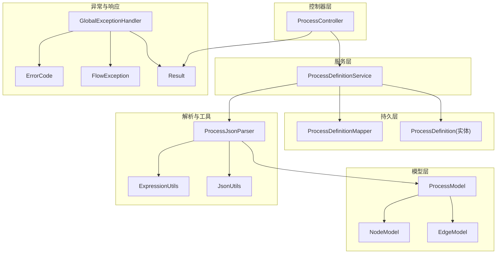
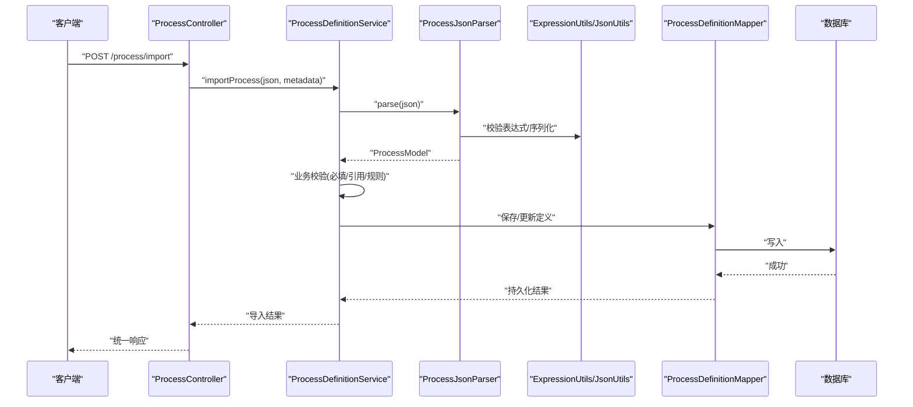
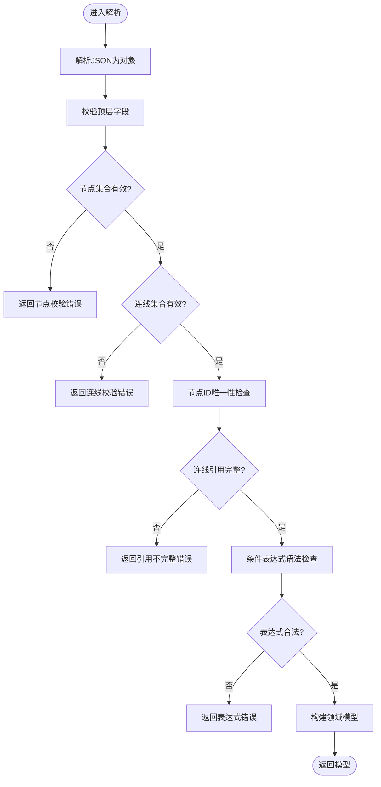
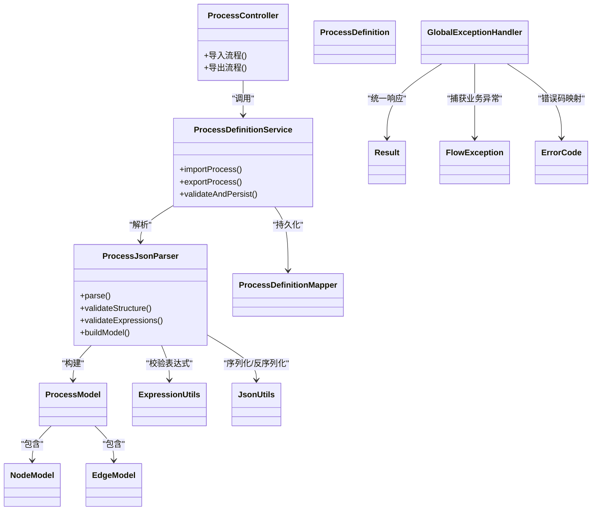

# 导入导出功能

<cite>
**本文引用的文件**
- [ProcessJsonParser.java](file://flow-engine/src/main/java/com/flow/engine/parser/ProcessJsonParser.java)
- [ProcessDefinitionImportRequest.java](file://flow-engine/src/main/java/com/flow/engine/dto/ProcessDefinitionImportRequest.java)
- [ProcessDefinitionCreateRequest.java](file://flow-engine/src/main/java/com/flow/engine/dto/ProcessDefinitionCreateRequest.java)
- [ProcessDefinitionResponse.java](file://flow-engine/src/main/java/com/flow/engine/dto/ProcessDefinitionResponse.java)
- [ProcessController.java](file://flow-engine/src/main/java/com/flow/engine/controller/ProcessController.java)
- [ProcessDefinitionService.java](file://flow-engine/src/main/java/com/flow/engine/service/ProcessDefinitionService.java)
- [ProcessDefinitionMapper.java](file://flow-engine/src/main/java/com/flow/engine/mapper/ProcessDefinitionMapper.java)
- [ProcessDefinition.java](file://flow-engine/src/main/java/com/flow/engine/entity/ProcessDefinition.java)
- [NodeModel.java](file://flow-engine/src/main/java/com/flow/engine/model/NodeModel.java)
- [EdgeModel.java](file://flow-engine/src/main/java/com/flow/engine/model/EdgeModel.java)
- [ProcessModel.java](file://flow-engine/src/main/java/com/flow/engine/model/ProcessModel.java)
- [ExpressionUtils.java](file://flow-engine/src/main/java/com/flow/engine/common/utils/ExpressionUtils.java)
- [JsonUtils.java](file://flow-engine/src/main/java/com/flow/engine/common/utils/JsonUtils.java)
- [GlobalExceptionHandler.java](file://flow-engine/src/main/java/com/flow/engine/common/GlobalExceptionHandler.java)
- [ErrorCode.java](file://flow-engine/src/main/java/com/flow/engine/common/ErrorCode.java)
- [FlowException.java](file://flow-engine/src/main/java/com/flow/engine/common/exception/FlowException.java)
- [Result.java](file://flow-engine/src/main/java/com/flow/engine/common/Result.java)
- [ProcessDefinitionApiTest.java](file://flow-engine/src/test/java/com/flow/engine/controller/ProcessDefinitionApiTest.java)
- [ProcessJsonParserTest.java](file://flow-engine/src/test/java/com/flow/engine/parser/ProcessJsonParserTest.java)
</cite>

## 目录
1. [简介](#简介)
2. [项目结构](#项目结构)
3. [核心组件](#核心组件)
4. [架构总览](#架构总览)
5. [详细组件分析](#详细组件分析)
6. [依赖关系分析](#依赖关系分析)
7. [性能考虑](#性能考虑)
8. [故障排查指南](#故障排查指南)
9. [结论](#结论)
10. [附录](#附录)

## 简介
本章节聚焦流程定义的“导入/导出”能力，覆盖以下要点：
- 流程定义JSON数据结构规范（节点、连线、条件表达式等）
- ProcessJsonParser解析器实现原理（格式校验、语法检查、数据转换）
- 导入功能的数据校验机制（必填字段、引用完整性、业务规则）
- 导出功能的格式化输出（标准JSON与可视化流程图生成）
- 完整的导入导出API接口文档与使用示例
- 批量导入能力与错误处理策略

## 项目结构
与导入导出相关的关键代码位于后端模块 flow-engine 中，主要涉及控制器、服务层、模型、解析器与工具类。前端通过HTTP API调用后端完成导入导出操作。

图表来源
- [ProcessController.java](file://flow-engine/src/main/java/com/flow/engine/controller/ProcessController.java)
- [ProcessDefinitionService.java](file://flow-engine/src/main/java/com/flow/engine/service/ProcessDefinitionService.java)
- [ProcessDefinitionMapper.java](file://flow-engine/src/main/java/com/flow/engine/mapper/ProcessDefinitionMapper.java)
- [ProcessDefinition.java](file://flow-engine/src/main/java/com/flow/engine/entity/ProcessDefinition.java)
- [ProcessModel.java](file://flow-engine/src/main/java/com/flow/engine/model/ProcessModel.java)
- [NodeModel.java](file://flow-engine/src/main/java/com/flow/engine/model/NodeModel.java)
- [EdgeModel.java](file://flow-engine/src/main/java/com/flow/engine/model/EdgeModel.java)
- [ProcessJsonParser.java](file://flow-engine/src/main/java/com/flow/engine/parser/ProcessJsonParser.java)
- [ExpressionUtils.java](file://flow-engine/src/main/java/com/flow/engine/common/utils/ExpressionUtils.java)
- [JsonUtils.java](file://flow-engine/src/main/java/com/flow/engine/common/utils/JsonUtils.java)
- [GlobalExceptionHandler.java](file://flow-engine/src/main/java/com/flow/engine/common/GlobalExceptionHandler.java)
- [ErrorCode.java](file://flow-engine/src/main/java/com/flow/engine/common/ErrorCode.java)
- [FlowException.java](file://flow-engine/src/main/java/com/flow/engine/common/exception/FlowException.java)
- [Result.java](file://flow-engine/src/main/java/com/flow/engine/common/Result.java)

章节来源
- [ProcessController.java](file://flow-engine/src/main/java/com/flow/engine/controller/ProcessController.java)
- [ProcessDefinitionService.java](file://flow-engine/src/main/java/com/flow/engine/service/ProcessDefinitionService.java)
- [ProcessJsonParser.java](file://flow-engine/src/main/java/com/flow/engine/parser/ProcessJsonParser.java)

## 核心组件
- 控制器：提供导入/导出REST端点，接收请求参数并返回统一结果对象。
- 服务层：编排导入/导出流程，负责调用解析器、执行校验、持久化与查询。
- 解析器：将JSON字符串解析为内部模型，进行格式与语法校验，并转换为可执行的流程定义。
- 模型层：描述流程、节点、连线的领域模型。
- 工具类：表达式求值与JSON序列化/反序列化工具。
- 异常与响应：全局异常处理与统一响应封装。

章节来源
- [ProcessController.java](file://flow-engine/src/main/java/com/flow/engine/controller/ProcessController.java)
- [ProcessDefinitionService.java](file://flow-engine/src/main/java/com/flow/engine/service/ProcessDefinitionService.java)
- [ProcessJsonParser.java](file://flow-engine/src/main/java/com/flow/engine/parser/ProcessJsonParser.java)
- [ProcessModel.java](file://flow-engine/src/main/java/com/flow/engine/model/ProcessModel.java)
- [NodeModel.java](file://flow-engine/src/main/java/com/flow/engine/model/NodeModel.java)
- [EdgeModel.java](file://flow-engine/src/main/java/com/flow/engine/model/EdgeModel.java)
- [ExpressionUtils.java](file://flow-engine/src/main/java/com/flow/engine/common/utils/ExpressionUtils.java)
- [JsonUtils.java](file://flow-engine/src/main/java/com/flow/engine/common/utils/JsonUtils.java)
- [GlobalExceptionHandler.java](file://flow-engine/src/main/java/com/flow/engine/common/GlobalExceptionHandler.java)
- [Result.java](file://flow-engine/src/main/java/com/flow/engine/common/Result.java)

## 架构总览
导入导出的整体调用链如下：

图表来源
- [ProcessController.java](file://flow-engine/src/main/java/com/flow/engine/controller/ProcessController.java)
- [ProcessDefinitionService.java](file://flow-engine/src/main/java/com/flow/engine/service/ProcessDefinitionService.java)
- [ProcessJsonParser.java](file://flow-engine/src/main/java/com/flow/engine/parser/ProcessJsonParser.java)
- [ExpressionUtils.java](file://flow-engine/src/main/java/com/flow/engine/common/utils/ExpressionUtils.java)
- [JsonUtils.java](file://flow-engine/src/main/java/com/flow/engine/common/utils/JsonUtils.java)
- [ProcessDefinitionMapper.java](file://flow-engine/src/main/java/com/flow/engine/mapper/ProcessDefinitionMapper.java)

## 详细组件分析

### JSON数据结构规范（流程定义）
- 顶层对象包含流程元信息与图形元素集合：
  - 元信息：流程标识、名称、版本、描述、创建者等
  - 节点集合：每个节点包含唯一ID、类型、显示名、配置项、扩展属性等
  - 连线集合：每条连线包含起点ID、终点ID、连线标签、条件表达式等
- 节点类型：
  - 开始节点、结束节点、用户任务、服务任务、脚本任务、排他网关、包容网关、并行网关、子流程、自定义节点等
- 连线与条件：
  - 连线需明确源节点和目标节点
  - 条件表达式用于分支选择，支持变量访问与运算符
- 可视化属性：
  - 节点坐标、尺寸、样式等可选字段，便于前端渲染流程图

说明
- 该规范由解析器在服务端进行严格校验，确保导入数据的正确性与一致性。

章节来源
- [ProcessJsonParser.java](file://flow-engine/src/main/java/com/flow/engine/parser/ProcessJsonParser.java)
- [NodeModel.java](file://flow-engine/src/main/java/com/flow/engine/model/NodeModel.java)
- [EdgeModel.java](file://flow-engine/src/main/java/com/flow/engine/model/EdgeModel.java)
- [ProcessModel.java](file://flow-engine/src/main/java/com/flow/engine/model/ProcessModel.java)

### ProcessJsonParser解析器实现原理
- 输入：JSON字符串或对象
- 步骤：
  - 基础格式校验：是否为合法JSON、是否包含必需字段
  - 结构校验：节点集合与连线集合存在且非空；节点ID唯一；连线指向的节点存在
  - 语义校验：开始节点有且仅有一个；结束节点至少一个；无环路与孤立节点检测
  - 表达式校验：对连线条件表达式进行语法检查与变量可用性验证
  - 数据转换：将JSON映射为内部模型（ProcessModel/NodeModel/EdgeModel），并进行规范化处理
- 输出：
  - 解析成功的领域模型，供后续持久化与运行引擎使用
  - 失败时抛出结构化异常，包含错误位置与修复建议

图表来源
- [ProcessJsonParser.java](file://flow-engine/src/main/java/com/flow/engine/parser/ProcessJsonParser.java)
- [ExpressionUtils.java](file://flow-engine/src/main/java/com/flow/engine/common/utils/ExpressionUtils.java)
- [JsonUtils.java](file://flow-engine/src/main/java/com/flow/engine/common/utils/JsonUtils.java)

章节来源
- [ProcessJsonParser.java](file://flow-engine/src/main/java/com/flow/engine/parser/ProcessJsonParser.java)
- [ExpressionUtils.java](file://flow-engine/src/main/java/com/flow/engine/common/utils/ExpressionUtils.java)
- [JsonUtils.java](file://flow-engine/src/main/java/com/flow/engine/common/utils/JsonUtils.java)

### 导入功能的数据校验机制
- 必填字段检查：
  - 流程标识、名称、版本、节点ID、连线源/目标ID等
- 引用完整性验证：
  - 连线必须指向存在的节点
  - 条件表达式引用的变量需在上下文中可用
- 业务规则校验：
  - 开始节点数量限制
  - 结束节点存在性
  - 环路检测与连通性检查
  - 节点类型与配置的合法性

章节来源
- [ProcessDefinitionService.java](file://flow-engine/src/main/java/com/flow/engine/service/ProcessDefinitionService.java)
- [ProcessJsonParser.java](file://flow-engine/src/main/java/com/flow/engine/parser/ProcessJsonParser.java)

### 导出功能的格式化输出
- 标准JSON导出：
  - 将领域模型序列化为符合规范的JSON字符串
  - 包含元信息、节点、连线及可视化属性
- 可视化流程图生成：
  - 基于节点坐标与连线关系生成SVG/PNG等图片
  - 支持缩放、标注与高亮当前路径

章节来源
- [ProcessDefinitionService.java](file://flow-engine/src/main/java/com/flow/engine/service/ProcessDefinitionService.java)
- [JsonUtils.java](file://flow-engine/src/main/java/com/flow/engine/common/utils/JsonUtils.java)

### 导入导出API接口文档
- 导入流程定义
  - 方法：POST
  - 路径：/process/import
  - 请求体：
    - json：流程定义JSON字符串
    - metadata：可选的元信息（如导入人、备注）
  - 响应：统一结果对象，包含导入状态与详情
- 导出流程定义
  - 方法：GET
  - 路径：/process/export/{definitionId}
  - 查询参数：
    - format：json或image（默认json）
  - 响应：
    - json：返回标准JSON字符串
    - image：返回图片二进制流或URL

章节来源
- [ProcessController.java](file://flow-engine/src/main/java/com/flow/engine/controller/ProcessController.java)
- [ProcessDefinitionResponse.java](file://flow-engine/src/main/java/com/flow/engine/dto/ProcessDefinitionResponse.java)
- [ProcessDefinitionImportRequest.java](file://flow-engine/src/main/java/com/flow/engine/dto/ProcessDefinitionImportRequest.java)
- [ProcessDefinitionCreateRequest.java](file://flow-engine/src/main/java/com/flow/engine/dto/ProcessDefinitionCreateRequest.java)

### 使用示例
- 导入示例
  - 构造包含节点与连线的JSON
  - 调用导入接口，传入json与metadata
  - 根据返回码判断导入是否成功
- 导出示例
  - 指定definitionId与format=json
  - 获取标准JSON后在前端渲染流程图

章节来源
- [ProcessDefinitionApiTest.java](file://flow-engine/src/test/java/com/flow/engine/controller/ProcessDefinitionApiTest.java)
- [ProcessJsonParserTest.java](file://flow-engine/src/test/java/com/flow/engine/parser/ProcessJsonParserTest.java)

### 批量导入功能
- 设计思路
  - 提供批量导入接口，接收JSON数组或ZIP包
  - 逐条解析与校验，记录成功与失败明细
  - 事务控制：全部成功则提交，任一失败则回滚或按策略部分提交
- 错误聚合
  - 汇总各条目的错误原因与行号
  - 返回结构化错误报告，便于定位问题

章节来源
- [ProcessDefinitionService.java](file://flow-engine/src/main/java/com/flow/engine/service/ProcessDefinitionService.java)
- [ProcessJsonParser.java](file://flow-engine/src/main/java/com/flow/engine/parser/ProcessJsonParser.java)

### 错误处理策略
- 统一异常封装：
  - 业务异常FlowException携带错误码与消息
  - 全局异常处理器GlobalExceptionHandler捕获并转换为统一响应
- 常见错误码：
  - 非法JSON、缺失必填字段、引用不完整、表达式语法错误、业务规则冲突等
- 日志与审计：
  - 记录导入失败的上下文与堆栈，便于追踪

章节来源
- [GlobalExceptionHandler.java](file://flow-engine/src/main/java/com/flow/engine/common/GlobalExceptionHandler.java)
- [ErrorCode.java](file://flow-engine/src/main/java/com/flow/engine/common/ErrorCode.java)
- [FlowException.java](file://flow-engine/src/main/java/com/flow/engine/common/exception/FlowException.java)
- [Result.java](file://flow-engine/src/main/java/com/flow/engine/common/Result.java)

## 依赖关系分析
- 控制器依赖服务层，服务层依赖解析器与持久层
- 解析器依赖表达式与JSON工具类
- 模型层被解析器与服务层共同使用
- 异常与响应贯穿整个调用链

图表来源
- [ProcessController.java](file://flow-engine/src/main/java/com/flow/engine/controller/ProcessController.java)
- [ProcessDefinitionService.java](file://flow-engine/src/main/java/com/flow/engine/service/ProcessDefinitionService.java)
- [ProcessJsonParser.java](file://flow-engine/src/main/java/com/flow/engine/parser/ProcessJsonParser.java)
- [ProcessModel.java](file://flow-engine/src/main/java/com/flow/engine/model/ProcessModel.java)
- [NodeModel.java](file://flow-engine/src/main/java/com/flow/engine/model/NodeModel.java)
- [EdgeModel.java](file://flow-engine/src/main/java/com/flow/engine/model/EdgeModel.java)
- [ExpressionUtils.java](file://flow-engine/src/main/java/com/flow/engine/common/utils/ExpressionUtils.java)
- [JsonUtils.java](file://flow-engine/src/main/java/com/flow/engine/common/utils/JsonUtils.java)
- [ProcessDefinitionMapper.java](file://flow-engine/src/main/java/com/flow/engine/mapper/ProcessDefinitionMapper.java)
- [ProcessDefinition.java](file://flow-engine/src/main/java/com/flow/engine/entity/ProcessDefinition.java)
- [GlobalExceptionHandler.java](file://flow-engine/src/main/java/com/flow/engine/common/GlobalExceptionHandler.java)
- [Result.java](file://flow-engine/src/main/java/com/flow/engine/common/Result.java)
- [FlowException.java](file://flow-engine/src/main/java/com/flow/engine/common/exception/FlowException.java)
- [ErrorCode.java](file://flow-engine/src/main/java/com/flow/engine/common/ErrorCode.java)

## 性能考虑
- 解析阶段优化：
  - 增量校验与短路返回，避免不必要的深度遍历
  - 表达式预编译与缓存，减少重复计算
- 导出阶段优化：
  - 大图生成采用异步任务与分块渲染
  - 图片压缩与缓存策略
- 批量导入优化：
  - 分批提交与断点续传
  - 并发解析与限流保护

[本节为通用指导，不直接分析具体文件]

## 故障排查指南
- 常见问题
  - JSON格式错误：检查括号匹配与键名引号
  - 必填字段缺失：对照导入请求体规范补齐
  - 引用不完整：确认连线指向的节点ID存在
  - 表达式语法错误：简化表达式或使用调试工具验证
- 定位手段
  - 查看统一响应的错误码与消息
  - 结合全局异常日志与解析器错误位置提示
  - 使用单元测试用例对比正常与异常输入

章节来源
- [GlobalExceptionHandler.java](file://flow-engine/src/main/java/com/flow/engine/common/GlobalExceptionHandler.java)
- [ErrorCode.java](file://flow-engine/src/main/java/com/flow/engine/common/ErrorCode.java)
- [FlowException.java](file://flow-engine/src/main/java/com/flow/engine/common/exception/FlowException.java)
- [ProcessJsonParserTest.java](file://flow-engine/src/test/java/com/flow/engine/parser/ProcessJsonParserTest.java)

## 结论
导入导出功能以ProcessJsonParser为核心，结合严格的校验与统一的异常处理，确保流程定义在跨系统迁移时的准确性与一致性。通过标准化JSON结构与完善的API接口，既满足自动化集成需求，也支持可视化流程图的生成与展示。批量导入与错误聚合进一步提升了工程实践中的易用性与可靠性。

## 附录
- 术语表
  - 流程定义：描述业务流程的结构化数据
  - 节点：流程中的执行单元
  - 连线：节点之间的流转关系
  - 条件表达式：决定分支走向的规则
- 参考测试
  - 控制器API测试与解析器单元测试可作为最佳实践参考

章节来源
- [ProcessDefinitionApiTest.java](file://flow-engine/src/test/java/com/flow/engine/controller/ProcessDefinitionApiTest.java)
- [ProcessJsonParserTest.java](file://flow-engine/src/test/java/com/flow/engine/parser/ProcessJsonParserTest.java)