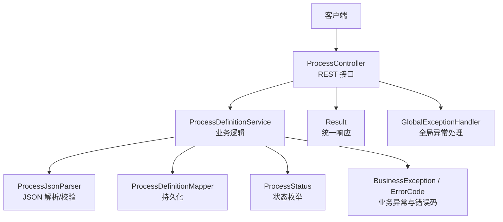
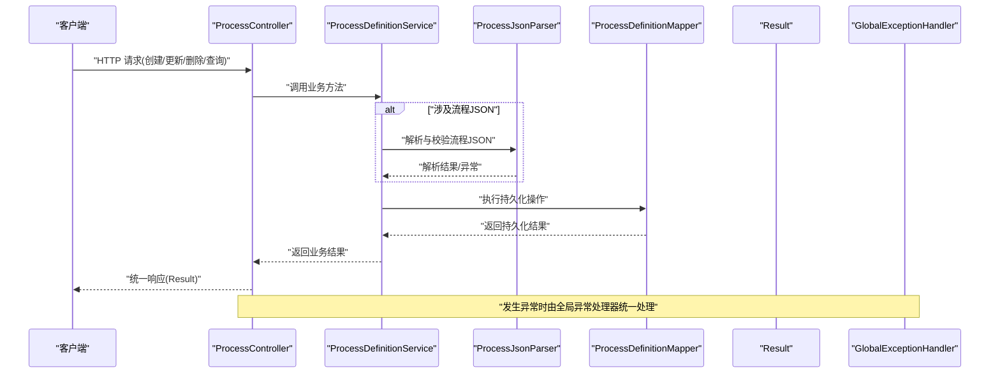
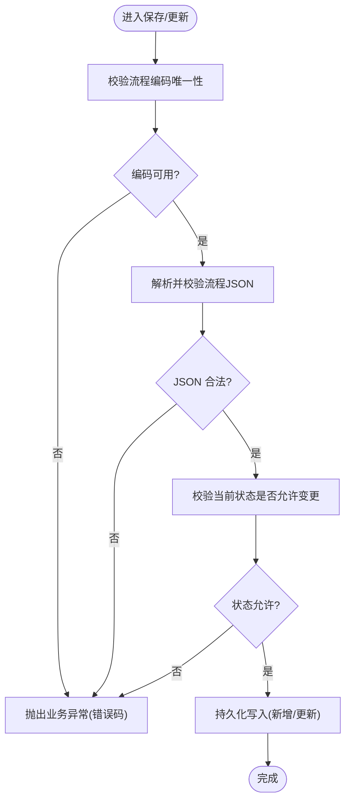
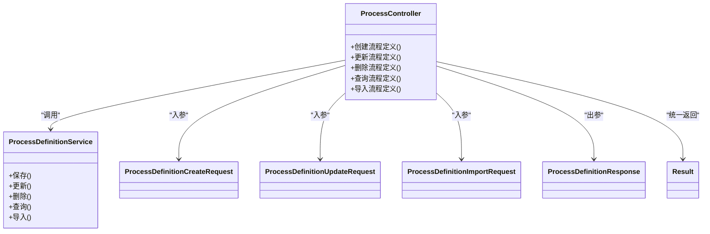
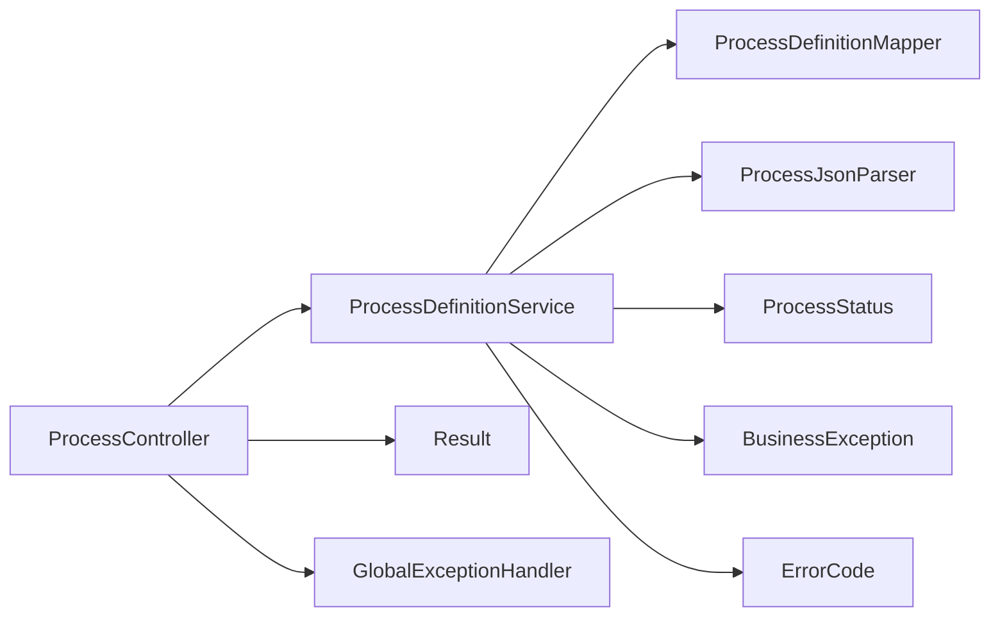

# 流程定义管理

<cite>
**本文引用的文件**   
- [ProcessDefinition.java](file://flow-engine/src/main/java/com/flow/engine/entity/ProcessDefinition.java)
- [ProcessDefinitionService.java](file://flow-engine/src/main/java/com/flow/engine/service/ProcessDefinitionService.java)
- [ProcessController.java](file://flow-engine/src/main/java/com/flow/engine/controller/ProcessController.java)
- [ProcessDefinitionMapper.java](file://flow-engine/src/main/java/com/flow/engine/mapper/ProcessDefinitionMapper.java)
- [ProcessDefinitionCreateRequest.java](file://flow-engine/src/main/java/com/flow/engine/dto/ProcessDefinitionCreateRequest.java)
- [ProcessDefinitionUpdateRequest.java](file://flow-engine/src/main/java/com/flow/engine/dto/ProcessDefinitionUpdateRequest.java)
- [ProcessDefinitionImportRequest.java](file://flow-engine/src/main/java/com/flow/engine/dto/ProcessDefinitionImportRequest.java)
- [ProcessDefinitionResponse.java](file://flow-engine/src/main/java/com/flow/engine/dto/ProcessDefinitionResponse.java)
- [ErrorCode.java](file://flow-engine/src/main/java/com/flow/engine/common/ErrorCode.java)
- [BusinessException.java](file://flow-engine/src/main/java/com/flow/engine/common/BusinessException.java)
- [GlobalExceptionHandler.java](file://flow-engine/src/main/java/com/flow/engine/common/GlobalExceptionHandler.java)
- [Result.java](file://flow-engine/src/main/java/com/flow/engine/common/Result.java)
- [ProcessStatus.java](file://flow-engine/src/main/java/com/flow/engine/common/enums/ProcessStatus.java)
- [ProcessJsonParser.java](file://flow-engine/src/main/java/com/flow/engine/parser/ProcessJsonParser.java)
- [FlowEngineApplication.java](file://flow-engine/src/main/java/com/flow/engine/FlowEngineApplication.java)
</cite>

## 目录
1. [简介](#简介)
2. [项目结构](#项目结构)
3. [核心组件](#核心组件)
4. [架构总览](#架构总览)
5. [详细组件分析](#详细组件分析)
6. [依赖关系分析](#依赖关系分析)
7. [性能考虑](#性能考虑)
8. [故障排查指南](#故障排查指南)
9. [结论](#结论)
10. [附录：API 参考与调用示例](#附录api-参考与调用示例)

## 简介
本章节聚焦“流程定义管理”的完整实现，覆盖以下要点：
- 流程定义的实体结构与业务含义（编码、名称、版本、状态等）
- 服务层 ProcessDefinitionService 的核心业务逻辑（保存、更新、删除、导入、查询）
- 控制器 ProcessController 暴露的 RESTful API（请求参数、响应格式、错误处理）
- 状态管理机制与权限控制策略
- 面向前后端的调用示例与最佳实践

## 项目结构
围绕流程定义管理的后端关键路径如下：
- 控制器层：ProcessController 提供对外 HTTP 接口
- 服务层：ProcessDefinitionService 封装业务流程与校验
- 数据访问层：ProcessDefinitionMapper 负责持久化操作
- 模型与 DTO：ProcessDefinition 实体及创建/更新/导入/响应 DTO
- 解析器：ProcessJsonParser 用于流程 JSON 的解析与校验
- 通用能力：统一异常、错误码、全局异常处理器、统一返回体

图表来源
- [ProcessController.java](file://flow-engine/src/main/java/com/flow/engine/controller/ProcessController.java)
- [ProcessDefinitionService.java](file://flow-engine/src/main/java/com/flow/engine/service/ProcessDefinitionService.java)
- [ProcessDefinitionMapper.java](file://flow-engine/src/main/java/com/flow/engine/mapper/ProcessDefinitionMapper.java)
- [ProcessJsonParser.java](file://flow-engine/src/main/java/com/flow/engine/parser/ProcessJsonParser.java)
- [ProcessStatus.java](file://flow-engine/src/main/java/com/flow/engine/common/enums/ProcessStatus.java)
- [BusinessException.java](file://flow-engine/src/main/java/com/flow/engine/common/BusinessException.java)
- [ErrorCode.java](file://flow-engine/src/main/java/com/flow/engine/common/ErrorCode.java)
- [GlobalExceptionHandler.java](file://flow-engine/src/main/java/com/flow/engine/common/GlobalExceptionHandler.java)
- [Result.java](file://flow-engine/src/main/java/com/flow/engine/common/Result.java)

章节来源
- [FlowEngineApplication.java](file://flow-engine/src/main/java/com/flow/engine/FlowEngineApplication.java)

## 核心组件
- 实体 ProcessDefinition：表示一个流程定义，包含编码、名称、版本、状态、描述、JSON 内容、创建/更新时间等字段。
- 服务 ProcessDefinitionService：封装流程定义的创建、更新、删除、导入、查询、版本管理等核心业务。
- 控制器 ProcessController：将上述业务能力以 RESTful 风格暴露给前端或第三方系统。
- 解析器 ProcessJsonParser：对流程 JSON 进行解析与基础校验，确保流程结构合法。
- 状态枚举 ProcessStatus：定义流程定义的生命周期状态（如草稿、已发布、已下线等）。
- 统一异常与错误码：通过 BusinessException 与 ErrorCode 表达业务错误；GlobalExceptionHandler 统一捕获并转换为标准响应。

章节来源
- [ProcessDefinition.java](file://flow-engine/src/main/java/com/flow/engine/entity/ProcessDefinition.java)
- [ProcessDefinitionService.java](file://flow-engine/src/main/java/com/flow/engine/service/ProcessDefinitionService.java)
- [ProcessController.java](file://flow-engine/src/main/java/com/flow/engine/controller/ProcessController.java)
- [ProcessJsonParser.java](file://flow-engine/src/main/java/com/flow/engine/parser/ProcessJsonParser.java)
- [ProcessStatus.java](file://flow-engine/src/main/java/com/flow/engine/common/enums/ProcessStatus.java)
- [BusinessException.java](file://flow-engine/src/main/java/com/flow/engine/common/BusinessException.java)
- [ErrorCode.java](file://flow-engine/src/main/java/com/flow/engine/common/ErrorCode.java)
- [GlobalExceptionHandler.java](file://flow-engine/src/main/java/com/flow/engine/common/GlobalExceptionHandler.java)

## 架构总览
下图展示了从请求到响应的整体链路，以及各组件的职责边界。

图表来源
- [ProcessController.java](file://flow-engine/src/main/java/com/flow/engine/controller/ProcessController.java)
- [ProcessDefinitionService.java](file://flow-engine/src/main/java/com/flow/engine/service/ProcessDefinitionService.java)
- [ProcessJsonParser.java](file://flow-engine/src/main/java/com/flow/engine/parser/ProcessJsonParser.java)
- [ProcessDefinitionMapper.java](file://flow-engine/src/main/java/com/flow/engine/mapper/ProcessDefinitionMapper.java)
- [GlobalExceptionHandler.java](file://flow-engine/src/main/java/com/flow/engine/common/GlobalExceptionHandler.java)
- [Result.java](file://flow-engine/src/main/java/com/flow/engine/common/Result.java)

## 详细组件分析

### 实体：ProcessDefinition
- 字段与业务含义
  - 编码：流程的唯一标识，通常作为路由与版本分发的依据
  - 名称：人类可读的流程标题
  - 版本：同一编码下的不同迭代版本，支持多版本并存
  - 状态：草稿、已发布、已下线等生命周期状态
  - 描述：流程说明信息
  - JSON：流程定义的结构化描述（节点、连线、属性等）
  - 时间戳：创建时间、更新时间
- 设计要点
  - 编码+版本组合唯一性约束，避免重复定义
  - 状态机驱动的状态流转，禁止非法跳转
  - JSON 字段需配合解析器进行合法性校验

章节来源
- [ProcessDefinition.java](file://flow-engine/src/main/java/com/flow/engine/entity/ProcessDefinition.java)
- [ProcessStatus.java](file://flow-engine/src/main/java/com/flow/engine/common/enums/ProcessStatus.java)

### 服务：ProcessDefinitionService
- 核心职责
  - 创建：接收创建请求，校验编码唯一性与 JSON 合法性，生成默认版本与状态
  - 更新：根据 ID 定位记录，校验可编辑状态，合并更新字段，必要时触发版本升级
  - 删除：软删除或硬删除，受权限与状态限制
  - 导入：批量导入流程定义，含去重、冲突处理与回滚策略
  - 查询：按编码、名称、状态、分页条件检索
  - 版本管理：同编码下版本递增、历史版本保留、当前版本切换
- 关键校验与约束
  - 编码唯一性检查
  - JSON 结构校验（使用 ProcessJsonParser）
  - 状态机校验（例如仅草稿可编辑、已发布不可直接删除）
  - 并发安全：基于数据库唯一索引与乐观锁（若存在版本号字段）
- 事务与一致性
  - 写操作在事务中执行，保证数据一致性
  - 导入操作支持分批提交与失败回滚

图表来源
- [ProcessDefinitionService.java](file://flow-engine/src/main/java/com/flow/engine/service/ProcessDefinitionService.java)
- [ProcessJsonParser.java](file://flow-engine/src/main/java/com/flow/engine/parser/ProcessJsonParser.java)
- [ErrorCode.java](file://flow-engine/src/main/java/com/flow/engine/common/ErrorCode.java)
- [BusinessException.java](file://flow-engine/src/main/java/com/flow/engine/common/BusinessException.java)

章节来源
- [ProcessDefinitionService.java](file://flow-engine/src/main/java/com/flow/engine/service/ProcessDefinitionService.java)
- [ProcessJsonParser.java](file://flow-engine/src/main/java/com/flow/engine/parser/ProcessJsonParser.java)
- [ErrorCode.java](file://flow-engine/src/main/java/com/flow/engine/common/ErrorCode.java)
- [BusinessException.java](file://flow-engine/src/main/java/com/flow/engine/common/BusinessException.java)

### 控制器：ProcessController
- 暴露的 RESTful 接口（建议）
  - 创建流程定义：POST /process/definitions
  - 更新流程定义：PUT /process/definitions/{id}
  - 删除流程定义：DELETE /process/definitions/{id}
  - 查询流程定义：GET /process/definitions?code=&name=&status=&page=&size=
  - 导入流程定义：POST /process/definitions/import
- 请求参数
  - 创建/更新：使用 ProcessDefinitionCreateRequest / ProcessDefinitionUpdateRequest
  - 导入：使用 ProcessDefinitionImportRequest
  - 查询：支持按编码、名称、状态、分页参数过滤
- 响应格式
  - 统一包装为 Result<T>，包含状态码、消息与数据体
- 错误处理
  - 业务异常通过 BusinessException + ErrorCode 表达
  - 全局异常处理器 GlobalExceptionHandler 统一捕获并返回标准错误响应

图表来源
- [ProcessController.java](file://flow-engine/src/main/java/com/flow/engine/controller/ProcessController.java)
- [ProcessDefinitionService.java](file://flow-engine/src/main/java/com/flow/engine/service/ProcessDefinitionService.java)
- [ProcessDefinitionCreateRequest.java](file://flow-engine/src/main/java/com/flow/engine/dto/ProcessDefinitionCreateRequest.java)
- [ProcessDefinitionUpdateRequest.java](file://flow-engine/src/main/java/com/flow/engine/dto/ProcessDefinitionUpdateRequest.java)
- [ProcessDefinitionImportRequest.java](file://flow-engine/src/main/java/com/flow/engine/dto/ProcessDefinitionImportRequest.java)
- [ProcessDefinitionResponse.java](file://flow-engine/src/main/java/com/flow/engine/dto/ProcessDefinitionResponse.java)
- [Result.java](file://flow-engine/src/main/java/com/flow/engine/common/Result.java)

章节来源
- [ProcessController.java](file://flow-engine/src/main/java/com/flow/engine/controller/ProcessController.java)
- [ProcessDefinitionCreateRequest.java](file://flow-engine/src/main/java/com/flow/engine/dto/ProcessDefinitionCreateRequest.java)
- [ProcessDefinitionUpdateRequest.java](file://flow-engine/src/main/java/com/flow/engine/dto/ProcessDefinitionUpdateRequest.java)
- [ProcessDefinitionImportRequest.java](file://flow-engine/src/main/java/com/flow/engine/dto/ProcessDefinitionImportRequest.java)
- [ProcessDefinitionResponse.java](file://flow-engine/src/main/java/com/flow/engine/dto/ProcessDefinitionResponse.java)
- [Result.java](file://flow-engine/src/main/java/com/flow/engine/common/Result.java)

### 数据访问：ProcessDefinitionMapper
- 职责
  - 提供流程定义的增删改查 SQL 映射
  - 支持按编码、名称、状态、分页等条件查询
- 设计要点
  - 合理使用索引（编码、状态、更新时间）提升查询性能
  - 复杂查询建议使用动态 SQL 构建

章节来源
- [ProcessDefinitionMapper.java](file://flow-engine/src/main/java/com/flow/engine/mapper/ProcessDefinitionMapper.java)

### 解析器：ProcessJsonParser
- 职责
  - 解析流程 JSON，提取节点、边、属性等信息
  - 校验必填字段、连通性、循环引用等
- 输出
  - 解析成功：返回结构化对象供后续持久化
  - 解析失败：抛出异常或返回错误信息

章节来源
- [ProcessJsonParser.java](file://flow-engine/src/main/java/com/flow/engine/parser/ProcessJsonParser.java)

### 状态管理与权限控制
- 状态管理
  - 状态枚举 ProcessStatus 定义流程定义生命周期
  - 典型流转：草稿 → 已发布 → 已下线；草稿可编辑，已发布不可直接删除
- 权限控制
  - 建议在控制器或服务层结合用户角色/权限进行鉴权
  - 未授权或越权操作应返回统一错误码与消息

章节来源
- [ProcessStatus.java](file://flow-engine/src/main/java/com/flow/engine/common/enums/ProcessStatus.java)
- [ErrorCode.java](file://flow-engine/src/main/java/com/flow/engine/common/ErrorCode.java)
- [BusinessException.java](file://flow-engine/src/main/java/com/flow/engine/common/BusinessException.java)

## 依赖关系分析
- 组件耦合
  - ProcessController 依赖 ProcessDefinitionService
  - ProcessDefinitionService 依赖 ProcessDefinitionMapper 与 ProcessJsonParser
  - 全局异常处理器拦截所有未处理异常，统一返回
- 外部依赖
  - 数据库（通过 MyBatis Plus 或原生 JDBC，具体取决于 Mapper 实现）
  - 统一返回体 Result 与错误码 ErrorCode

图表来源
- [ProcessController.java](file://flow-engine/src/main/java/com/flow/engine/controller/ProcessController.java)
- [ProcessDefinitionService.java](file://flow-engine/src/main/java/com/flow/engine/service/ProcessDefinitionService.java)
- [ProcessDefinitionMapper.java](file://flow-engine/src/main/java/com/flow/engine/mapper/ProcessDefinitionMapper.java)
- [ProcessJsonParser.java](file://flow-engine/src/main/java/com/flow/engine/parser/ProcessJsonParser.java)
- [ProcessStatus.java](file://flow-engine/src/main/java/com/flow/engine/common/enums/ProcessStatus.java)
- [BusinessException.java](file://flow-engine/src/main/java/com/flow/engine/common/BusinessException.java)
- [ErrorCode.java](file://flow-engine/src/main/java/com/flow/engine/common/ErrorCode.java)
- [GlobalExceptionHandler.java](file://flow-engine/src/main/java/com/flow/engine/common/GlobalExceptionHandler.java)
- [Result.java](file://flow-engine/src/main/java/com/flow/engine/common/Result.java)

章节来源
- [ProcessController.java](file://flow-engine/src/main/java/com/flow/engine/controller/ProcessController.java)
- [ProcessDefinitionService.java](file://flow-engine/src/main/java/com/flow/engine/service/ProcessDefinitionService.java)
- [ProcessDefinitionMapper.java](file://flow-engine/src/main/java/com/flow/engine/mapper/ProcessDefinitionMapper.java)
- [ProcessJsonParser.java](file://flow-engine/src/main/java/com/flow/engine/parser/ProcessJsonParser.java)
- [ProcessStatus.java](file://flow-engine/src/main/java/com/flow/engine/common/enums/ProcessStatus.java)
- [BusinessException.java](file://flow-engine/src/main/java/com/flow/engine/common/BusinessException.java)
- [ErrorCode.java](file://flow-engine/src/main/java/com/flow/engine/common/ErrorCode.java)
- [GlobalExceptionHandler.java](file://flow-engine/src/main/java/com/flow/engine/common/GlobalExceptionHandler.java)
- [Result.java](file://flow-engine/src/main/java/com/flow/engine/common/Result.java)

## 性能考虑
- 索引优化
  - 为编码、状态、更新时间建立合适索引，加速列表查询与筛选
- 分页与排序
  - 查询接口默认分页，避免一次性加载大量数据
- 解析开销
  - 流程 JSON 解析可能较耗时，可在服务层增加缓存（如 Redis）存储解析结果
- 事务粒度
  - 合理划分事务范围，避免长事务影响吞吐
- 并发控制
  - 针对同编码的并发更新，采用数据库唯一约束与乐观锁减少冲突

[本节为通用指导，不直接分析具体文件]

## 故障排查指南
- 常见错误
  - 编码重复：检查唯一性约束与业务校验
  - JSON 不合法：查看解析器抛出的错误信息
  - 状态不允许操作：确认当前状态是否符合状态机规则
- 日志与追踪
  - 利用全局异常处理器输出的错误码与消息快速定位问题
  - 建议在服务层增加关键步骤日志（解析、持久化、状态变更）
- 复现与回归
  - 使用导入接口批量构造测试数据，覆盖边界场景

章节来源
- [GlobalExceptionHandler.java](file://flow-engine/src/main/java/com/flow/engine/common/GlobalExceptionHandler.java)
- [ErrorCode.java](file://flow-engine/src/main/java/com/flow/engine/common/ErrorCode.java)
- [BusinessException.java](file://flow-engine/src/main/java/com/flow/engine/common/BusinessException.java)

## 结论
流程定义管理模块通过清晰的层次划分与统一的异常/返回机制，提供了稳定可靠的 CRUD 能力。服务层严格遵循状态机与 JSON 校验，控制器层暴露简洁的 RESTful 接口，便于前后端集成。建议在生产环境完善权限控制与审计日志，并结合缓存与索引优化性能。

[本节为总结性内容，不直接分析具体文件]

## 附录：API 参考与调用示例

### 接口清单
- 创建流程定义
  - 方法：POST
  - 路径：/process/definitions
  - 请求体：ProcessDefinitionCreateRequest
  - 响应：Result<ProcessDefinitionResponse>
- 更新流程定义
  - 方法：PUT
  - 路径：/process/definitions/{id}
  - 请求体：ProcessDefinitionUpdateRequest
  - 响应：Result<ProcessDefinitionResponse>
- 删除流程定义
  - 方法：DELETE
  - 路径：/process/definitions/{id}
  - 响应：Result<Void>
- 查询流程定义
  - 方法：GET
  - 路径：/process/definitions
  - 查询参数：code, name, status, page, size
  - 响应：Result<List<ProcessDefinitionResponse>>
- 导入流程定义
  - 方法：POST
  - 路径：/process/definitions/import
  - 请求体：ProcessDefinitionImportRequest
  - 响应：Result<ImportSummary>

章节来源
- [ProcessController.java](file://flow-engine/src/main/java/com/flow/engine/controller/ProcessController.java)
- [ProcessDefinitionCreateRequest.java](file://flow-engine/src/main/java/com/flow/engine/dto/ProcessDefinitionCreateRequest.java)
- [ProcessDefinitionUpdateRequest.java](file://flow-engine/src/main/java/com/flow/engine/dto/ProcessDefinitionUpdateRequest.java)
- [ProcessDefinitionImportRequest.java](file://flow-engine/src/main/java/com/flow/engine/dto/ProcessDefinitionImportRequest.java)
- [ProcessDefinitionResponse.java](file://flow-engine/src/main/java/com/flow/engine/dto/ProcessDefinitionResponse.java)
- [Result.java](file://flow-engine/src/main/java/com/flow/engine/common/Result.java)

### 调用示例（概念性）
- 创建流程定义
  - 请求示例：POST /process/definitions
  - 请求体字段：编码、名称、描述、JSON 内容
  - 成功响应：Result 中包含新创建的流程定义信息
  - 失败响应：Result 中包含错误码与消息
- 更新流程定义
  - 请求示例：PUT /process/definitions/{id}
  - 请求体字段：需要更新的字段（名称、描述、JSON 等）
  - 成功响应：Result 中包含更新后的流程定义信息
  - 失败响应：Result 中包含错误码与消息
- 删除流程定义
  - 请求示例：DELETE /process/definitions/{id}
  - 成功响应：Result 中无数据体
  - 失败响应：Result 中包含错误码与消息
- 查询流程定义
  - 请求示例：GET /process/definitions?code=xxx&status=1&page=1&size=10
  - 成功响应：Result 中包含分页列表
  - 失败响应：Result 中包含错误码与消息
- 导入流程定义
  - 请求示例：POST /process/definitions/import
  - 请求体字段：待导入的流程定义集合
  - 成功响应：Result 中包含导入摘要（成功数、失败数、错误详情）
  - 失败响应：Result 中包含错误码与消息

[本节为概念性示例，不直接展示代码内容]