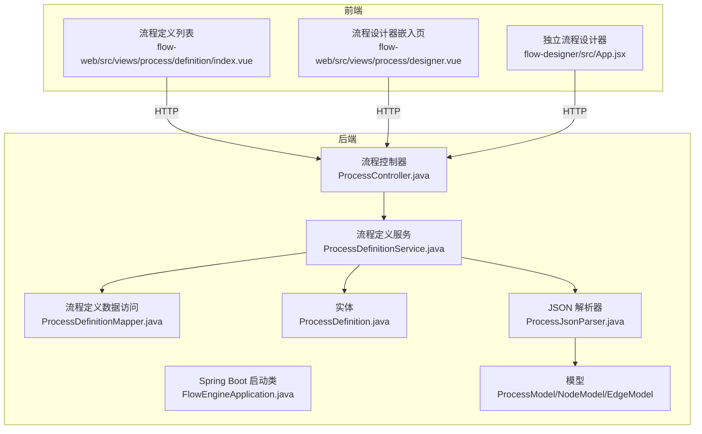
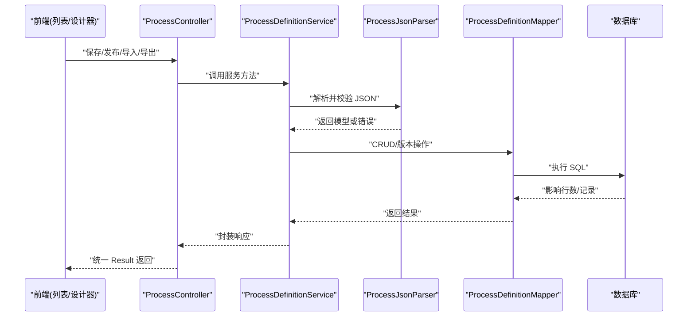
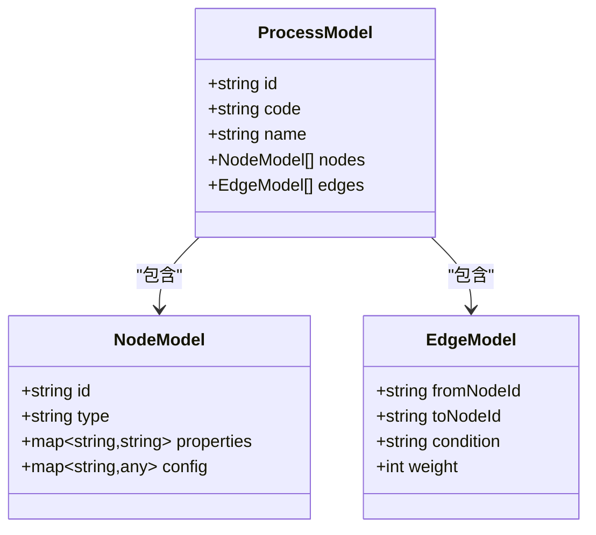
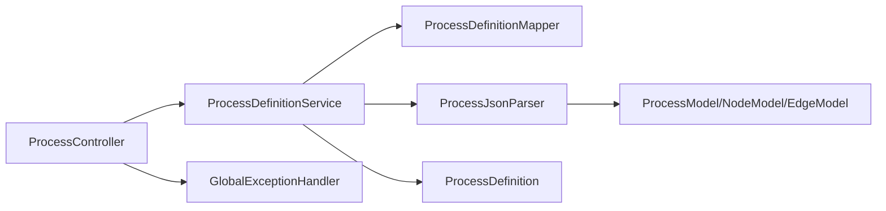

# 流程管理

<cite>
**本文引用的文件**   
- [ProcessController.java](file://flow-engine/src/main/java/com/flow/engine/controller/ProcessController.java)
- [ProcessDefinitionService.java](file://flow-engine/src/main/java/com/flow/engine/service/ProcessDefinitionService.java)
- [ProcessDefinitionMapper.java](file://flow-engine/src/main/java/com/flow/engine/mapper/ProcessDefinitionMapper.java)
- [ProcessDefinition.java](file://flow-engine/src/main/java/com/flow/engine/entity/ProcessDefinition.java)
- [ProcessJsonParser.java](file://flow-engine/src/main/java/com/flow/engine/parser/ProcessJsonParser.java)
- [ProcessModel.java](file://flow-engine/src/main/java/com/flow/engine/model/ProcessModel.java)
- [NodeModel.java](file://flow-engine/src/main/java/com/flow/engine/model/NodeModel.java)
- [EdgeModel.java](file://flow-engine/src/main/java/com/flow/engine/model/EdgeModel.java)
- [ProcessDefinitionCreateRequest.java](file://flow-engine/src/main/java/com/flow/engine/dto/ProcessDefinitionCreateRequest.java)
- [ProcessDefinitionUpdateRequest.java](file://flow-engine/src/main/java/com/flow/engine/dto/ProcessDefinitionUpdateRequest.java)
- [ProcessDefinitionImportRequest.java](file://flow-engine/src/main/java/com/flow/engine/dto/ProcessDefinitionImportRequest.java)
- [ProcessDefinitionResponse.java](file://flow-engine/src/main/java/com/flow/engine/dto/ProcessDefinitionResponse.java)
- [ErrorCode.java](file://flow-engine/src/main/java/com/flow/engine/common/ErrorCode.java)
- [BusinessException.java](file://flow-engine/src/main/java/com/flow/engine/common/BusinessException.java)
- [GlobalExceptionHandler.java](file://flow-engine/src/main/java/com/flow/engine/common/GlobalExceptionHandler.java)
- [Result.java](file://flow-engine/src/main/java/com/flow/engine/common/Result.java)
- [FlowEngineApplication.java](file://flow-engine/src/main/java/com/flow/engine/FlowEngineApplication.java)
- [application.yml](file://flow-engine/src/main/resources/application.yml)
- [schema.sql](file://flow-engine/src/main/resources/db/schema.sql)
- [index.vue](file://flow-web/src/views/process/definition/index.vue)
- [process.js](file://flow-web/src/api/process.js)
- [designer.vue](file://flow-web/src/views/process/designer.vue)
- [api.js](file://flow-designer/src/api.js)
- [nodeTypes.js](file://flow-designer/src/nodeTypes.js)
</cite>

## 目录
1. [简介](#简介)
2. [项目结构](#项目结构)
3. [核心组件](#核心组件)
4. [架构总览](#架构总览)
5. [详细组件分析](#详细组件分析)
6. [依赖分析](#依赖分析)
7. [性能考虑](#性能考虑)
8. [故障排查指南](#故障排查指南)
9. [结论](#结论)
10. [附录：API 接口文档与使用示例](#附录api-接口文档与使用示例)

## 简介
本文件围绕“流程定义”的完整生命周期，提供从设计、校验、版本控制到发布、导入导出的综合说明。内容覆盖后端控制器与服务层实现、JSON 模型规范、验证规则与错误处理、版本管理与状态机、前端页面与调用方式，以及完整的 API 文档与示例。目标是帮助开发者快速理解并正确使用流程管理功能。

## 项目结构
本项目采用前后端分离架构：
- 后端（flow-engine）：Spring Boot 应用，提供流程定义的 CRUD、版本管理、导入导出、解析与校验等能力。
- 前端（flow-web）：后台管理系统，包含流程定义列表、编辑与发布入口。
- 流程设计器（flow-designer）：可视化流程编辑器，输出标准 JSON 结构供后端解析与持久化。

图表来源
- [FlowEngineApplication.java](file://flow-engine/src/main/java/com/flow/engine/FlowEngineApplication.java)
- [ProcessController.java](file://flow-engine/src/main/java/com/flow/engine/controller/ProcessController.java)
- [ProcessDefinitionService.java](file://flow-engine/src/main/java/com/flow/engine/service/ProcessDefinitionService.java)
- [ProcessDefinitionMapper.java](file://flow-engine/src/main/java/com/flow/engine/mapper/ProcessDefinitionMapper.java)
- [ProcessDefinition.java](file://flow-engine/src/main/java/com/flow/engine/entity/ProcessDefinition.java)
- [ProcessJsonParser.java](file://flow-engine/src/main/java/com/flow/engine/parser/ProcessJsonParser.java)
- [ProcessModel.java](file://flow-engine/src/main/java/com/flow/engine/model/ProcessModel.java)
- [NodeModel.java](file://flow-engine/src/main/java/com/flow/engine/model/NodeModel.java)
- [EdgeModel.java](file://flow-engine/src/main/java/com/flow/engine/model/EdgeModel.java)
- [index.vue](file://flow-web/src/views/process/definition/index.vue)
- [designer.vue](file://flow-web/src/views/process/designer.vue)
- [api.js](file://flow-designer/src/api.js)

章节来源
- [FlowEngineApplication.java](file://flow-engine/src/main/java/com/flow/engine/FlowEngineApplication.java)
- [application.yml](file://flow-engine/src/main/resources/application.yml)
- [schema.sql](file://flow-engine/src/main/resources/db/schema.sql)

## 核心组件
- 控制器层：暴露流程定义相关 REST 接口，负责参数接收、响应封装与异常统一处理。
- 服务层：实现流程定义的创建、更新、发布、版本切换、导入导出、校验与解析逻辑。
- 数据访问层：基于 MyBatis-Plus 对流程定义表进行增删改查。
- 解析器：将前端设计器输出的 JSON 转换为内部模型，并进行结构与业务校验。
- 模型层：描述流程、节点、连线的结构化数据。
- 异常与结果：统一的错误码、业务异常与全局异常处理器，保证一致的返回格式。

章节来源
- [ProcessController.java](file://flow-engine/src/main/java/com/flow/engine/controller/ProcessController.java)
- [ProcessDefinitionService.java](file://flow-engine/src/main/java/com/flow/engine/service/ProcessDefinitionService.java)
- [ProcessDefinitionMapper.java](file://flow-engine/src/main/java/com/flow/engine/mapper/ProcessDefinitionMapper.java)
- [ProcessJsonParser.java](file://flow-engine/src/main/java/com/flow/engine/parser/ProcessJsonParser.java)
- [ProcessModel.java](file://flow-engine/src/main/java/com/flow/engine/model/ProcessModel.java)
- [NodeModel.java](file://flow-engine/src/main/java/com/flow/engine/model/NodeModel.java)
- [EdgeModel.java](file://flow-engine/src/main/java/com/flow/engine/model/EdgeModel.java)
- [ErrorCode.java](file://flow-engine/src/main/java/com/flow/engine/common/ErrorCode.java)
- [BusinessException.java](file://flow-engine/src/main/java/com/flow/engine/common/BusinessException.java)
- [GlobalExceptionHandler.java](file://flow-engine/src/main/java/com/flow/engine/common/GlobalExceptionHandler.java)
- [Result.java](file://flow-engine/src/main/java/com/flow/engine/common/Result.java)

## 架构总览
下图展示了流程定义从前端到后端的整体交互路径，包括设计器生成 JSON、后端解析校验、版本管理与发布流程。

图表来源
- [ProcessController.java](file://flow-engine/src/main/java/com/flow/engine/controller/ProcessController.java)
- [ProcessDefinitionService.java](file://flow-engine/src/main/java/com/flow/engine/service/ProcessDefinitionService.java)
- [ProcessJsonParser.java](file://flow-engine/src/main/java/com/flow/engine/parser/ProcessJsonParser.java)
- [ProcessDefinitionMapper.java](file://flow-engine/src/main/java/com/flow/engine/mapper/ProcessDefinitionMapper.java)
- [ProcessDefinition.java](file://flow-engine/src/main/java/com/flow/engine/entity/ProcessDefinition.java)

## 详细组件分析

### 流程定义控制器（ProcessController）
- 职责：对外暴露流程定义的 REST 接口，包括创建、更新、删除、查询、发布、回滚、导入、导出等。
- 关键点：
  - 请求参数绑定 DTO（创建/更新/导入）。
  - 调用服务层完成业务逻辑。
  - 统一返回 Result 包装。
  - 与全局异常处理器协作，确保错误信息标准化。

章节来源
- [ProcessController.java](file://flow-engine/src/main/java/com/flow/engine/controller/ProcessController.java)
- [Result.java](file://flow-engine/src/main/java/com/flow/engine/common/Result.java)
- [GlobalExceptionHandler.java](file://flow-engine/src/main/java/com/flow/engine/common/GlobalExceptionHandler.java)

### 流程定义服务（ProcessDefinitionService）
- 职责：流程定义的核心业务编排，涵盖：
  - 创建与更新：接收 DTO，构建实体，落库。
  - 发布与回滚：基于版本号进行状态切换与激活策略。
  - 导入导出：读取/写入 JSON 定义，支持批量导入。
  - 版本管理：维护历史版本、当前激活版本、版本切换。
  - 校验与解析：委托解析器进行 JSON 结构与业务规则校验。
- 关键点：
  - 版本字段与状态字段协同控制生命周期。
  - 导入时进行唯一性检查与冲突处理。
  - 导出时仅导出已发布或指定版本的定义。

章节来源
- [ProcessDefinitionService.java](file://flow-engine/src/main/java/com/flow/engine/service/ProcessDefinitionService.java)
- [ProcessDefinition.java](file://flow-engine/src/main/java/com/flow/engine/entity/ProcessDefinition.java)
- [ProcessDefinitionMapper.java](file://flow-engine/src/main/java/com/flow/engine/mapper/ProcessDefinitionMapper.java)

### 流程定义实体与数据访问（ProcessDefinition + Mapper）
- 实体字段：标识、编码、名称、版本、状态、JSON 定义、创建/更新时间等。
- 数据访问：MyBatis-Plus 提供的通用 CRUD 与分页查询。
- 索引建议：按编码+版本建立唯一约束，避免重复；按状态与更新时间建立查询索引。

章节来源
- [ProcessDefinition.java](file://flow-engine/src/main/java/com/flow/engine/entity/ProcessDefinition.java)
- [ProcessDefinitionMapper.java](file://flow-engine/src/main/java/com/flow/engine/mapper/ProcessDefinitionMapper.java)
- [schema.sql](file://flow-engine/src/main/resources/db/schema.sql)

### JSON 解析与模型（ProcessJsonParser + ProcessModel/NodeModel/EdgeModel）
- 解析流程：
  - 输入：前端设计器生成的 JSON。
  - 转换：映射为 ProcessModel，包含节点集合与连线集合。
  - 校验：节点必填项、连线连通性、条件表达式语法、循环与死锁检测。
- 模型关系：
  - ProcessModel 聚合 NodeModel 与 EdgeModel。
  - NodeModel 描述节点类型、属性、表单与任务配置。
  - EdgeModel 描述起点、终点、条件表达式与权重。

图表来源
- [ProcessModel.java](file://flow-engine/src/main/java/com/flow/engine/model/ProcessModel.java)
- [NodeModel.java](file://flow-engine/src/main/java/com/flow/engine/model/NodeModel.java)
- [EdgeModel.java](file://flow-engine/src/main/java/com/flow/engine/model/EdgeModel.java)
- [ProcessJsonParser.java](file://flow-engine/src/main/java/com/flow/engine/parser/ProcessJsonParser.java)

章节来源
- [ProcessJsonParser.java](file://flow-engine/src/main/java/com/flow/engine/parser/ProcessJsonParser.java)
- [ProcessModel.java](file://flow-engine/src/main/java/com/flow/engine/model/ProcessModel.java)
- [NodeModel.java](file://flow-engine/src/main/java/com/flow/engine/model/NodeModel.java)
- [EdgeModel.java](file://flow-engine/src/main/java/com/flow/engine/model/EdgeModel.java)

### 前端集成（flow-web 与 flow-designer）
- 流程定义列表页：展示定义列表、搜索、新建、编辑、发布、导入导出等操作入口。
- 设计器嵌入页：在后台管理中直接打开流程设计器，保存/发布时调用后端接口。
- 独立设计器：通过 api.js 调用后端接口，输出标准 JSON 结构。

章节来源
- [index.vue](file://flow-web/src/views/process/definition/index.vue)
- [designer.vue](file://flow-web/src/views/process/designer.vue)
- [process.js](file://flow-web/src/api/process.js)
- [api.js](file://flow-designer/src/api.js)
- [nodeTypes.js](file://flow-designer/src/nodeTypes.js)

## 依赖分析
- 控制器依赖服务层，服务层依赖数据访问层与解析器。
- 解析器依赖模型层，用于结构与业务校验。
- 全局异常处理器拦截业务异常与系统异常，统一返回错误码与消息。
- 配置文件与数据库脚本提供运行环境与初始结构。

图表来源
- [ProcessController.java](file://flow-engine/src/main/java/com/flow/engine/controller/ProcessController.java)
- [ProcessDefinitionService.java](file://flow-engine/src/main/java/com/flow/engine/service/ProcessDefinitionService.java)
- [ProcessDefinitionMapper.java](file://flow-engine/src/main/java/com/flow/engine/mapper/ProcessDefinitionMapper.java)
- [ProcessJsonParser.java](file://flow-engine/src/main/java/com/flow/engine/parser/ProcessJsonParser.java)
- [ProcessModel.java](file://flow-engine/src/main/java/com/flow/engine/model/ProcessModel.java)
- [NodeModel.java](file://flow-engine/src/main/java/com/flow/engine/model/NodeModel.java)
- [EdgeModel.java](file://flow-engine/src/main/java/com/flow/engine/model/EdgeModel.java)
- [ProcessDefinition.java](file://flow-engine/src/main/java/com/flow/engine/entity/ProcessDefinition.java)
- [GlobalExceptionHandler.java](file://flow-engine/src/main/java/com/flow/engine/common/GlobalExceptionHandler.java)

章节来源
- [FlowEngineApplication.java](file://flow-engine/src/main/java/com/flow/engine/FlowEngineApplication.java)
- [application.yml](file://flow-engine/src/main/resources/application.yml)
- [schema.sql](file://flow-engine/src/main/resources/db/schema.sql)

## 性能考虑
- 解析与校验：
  - 对大型 JSON 定义进行分块校验，避免一次性加载导致内存压力。
  - 缓存常用字典与表达式上下文，减少重复计算。
- 数据库：
  - 针对编码+版本建立唯一索引，避免重复插入。
  - 分页查询与只读视图优化列表与历史记录查询。
- 并发：
  - 发布与回滚操作需加锁，防止同一版本被并发修改。
  - 导入批量操作采用事务与分批提交，提升稳定性。

[本节为通用指导，不直接分析具体文件]

## 故障排查指南
- 常见错误码与业务异常：
  - 使用 ErrorCode 定义的错误码与 BusinessException 抛出的业务异常，由 GlobalExceptionHandler 统一捕获并返回。
- 日志与审计：
  - 结合操作日志与访问日志定位问题，关注解析失败、版本冲突、权限不足等场景。
- 调试建议：
  - 打印 JSON 解析前后的模型结构，确认节点与连线是否符合预期。
  - 检查版本字段与状态字段的变更是否满足状态机规则。

章节来源
- [ErrorCode.java](file://flow-engine/src/main/java/com/flow/engine/common/ErrorCode.java)
- [BusinessException.java](file://flow-engine/src/main/java/com/flow/engine/common/BusinessException.java)
- [GlobalExceptionHandler.java](file://flow-engine/src/main/java/com/flow/engine/common/GlobalExceptionHandler.java)

## 结论
流程管理功能以“设计器生成 JSON -> 后端解析校验 -> 版本管理 -> 发布运行”为主线，通过清晰的层次划分与统一的异常处理，提供了稳定可靠的流程定义管理能力。建议在后续迭代中完善表达式引擎、扩展更多节点类型，并增强导入导出的兼容性与可追溯性。

[本节为总结，不直接分析具体文件]

## 附录：API 接口文档与使用示例

### 接口总览
- 基础路径：/api/process-definition
- 认证：根据系统鉴权配置，部分接口需要登录态或角色权限。
- 返回格式：统一 Result 包装，包含状态码、消息与数据体。

章节来源
- [ProcessController.java](file://flow-engine/src/main/java/com/flow/engine/controller/ProcessController.java)
- [Result.java](file://flow-engine/src/main/java/com/flow/engine/common/Result.java)

### 创建流程定义
- 方法：POST /api/process-definition/create
- 请求体：ProcessDefinitionCreateRequest
- 行为：
  - 校验 JSON 结构与业务规则。
  - 生成默认版本与草稿状态。
  - 持久化并返回新定义。
- 成功响应：包含定义 ID、版本、状态等信息。
- 失败响应：错误码与消息。

章节来源
- [ProcessDefinitionCreateRequest.java](file://flow-engine/src/main/java/com/flow/engine/dto/ProcessDefinitionCreateRequest.java)
- [ProcessDefinitionService.java](file://flow-engine/src/main/java/com/flow/engine/service/ProcessDefinitionService.java)
- [ProcessDefinition.java](file://flow-engine/src/main/java/com/flow/engine/entity/ProcessDefinition.java)

### 更新流程定义
- 方法：PUT /api/process-definition/update
- 请求体：ProcessDefinitionUpdateRequest
- 行为：
  - 校验 JSON 结构与业务规则。
  - 更新定义内容与元信息。
  - 保持版本递增或按策略处理。
- 成功响应：返回更新后的定义信息。
- 失败响应：错误码与消息。

章节来源
- [ProcessDefinitionUpdateRequest.java](file://flow-engine/src/main/java/com/flow/engine/dto/ProcessDefinitionUpdateRequest.java)
- [ProcessDefinitionService.java](file://flow-engine/src/main/java/com/flow/engine/service/ProcessDefinitionService.java)

### 删除流程定义
- 方法：DELETE /api/process-definition/delete/{id}
- 行为：软删除或物理删除（依据实现），清理关联数据。
- 成功响应：空数据体。
- 失败响应：错误码与消息。

章节来源
- [ProcessDefinitionService.java](file://flow-engine/src/main/java/com/flow/engine/service/ProcessDefinitionService.java)

### 查询流程定义
- 方法：GET /api/process-definition/detail/{id}
- 行为：返回指定定义的详细信息，含 JSON 定义与版本状态。
- 成功响应：ProcessDefinitionResponse。
- 失败响应：错误码与消息。

章节来源
- [ProcessDefinitionResponse.java](file://flow-engine/src/main/java/com/flow/engine/dto/ProcessDefinitionResponse.java)
- [ProcessDefinitionService.java](file://flow-engine/src/main/java/com/flow/engine/service/ProcessDefinitionService.java)

### 发布流程定义
- 方法：POST /api/process-definition/publish/{id}
- 行为：
  - 校验定义完整性。
  - 切换状态为已发布，设置当前激活版本。
  - 记录版本历史。
- 成功响应：返回发布后的定义信息。
- 失败响应：错误码与消息。

章节来源
- [ProcessDefinitionService.java](file://flow-engine/src/main/java/com/flow/engine/service/ProcessDefinitionService.java)

### 回滚/切换版本
- 方法：POST /api/process-definition/rollback/{id}
- 行为：
  - 选择历史版本进行回滚。
  - 更新当前激活版本与状态。
- 成功响应：返回切换后的定义信息。
- 失败响应：错误码与消息。

章节来源
- [ProcessDefinitionService.java](file://flow-engine/src/main/java/com/flow/engine/service/ProcessDefinitionService.java)

### 导入流程定义
- 方法：POST /api/process-definition/import
- 请求体：ProcessDefinitionImportRequest
- 行为：
  - 解析 JSON 并校验。
  - 处理重复编码与版本冲突。
  - 批量导入并返回结果摘要。
- 成功响应：导入统计与错误明细。
- 失败响应：错误码与消息。

章节来源
- [ProcessDefinitionImportRequest.java](file://flow-engine/src/main/java/com/flow/engine/dto/ProcessDefinitionImportRequest.java)
- [ProcessDefinitionService.java](file://flow-engine/src/main/java/com/flow/engine/service/ProcessDefinitionService.java)

### 导出流程定义
- 方法：GET /api/process-definition/export/{id}
- 行为：返回指定定义的 JSON 结构，便于备份或迁移。
- 成功响应：JSON 定义与元信息。
- 失败响应：错误码与消息。

章节来源
- [ProcessDefinitionService.java](file://flow-engine/src/main/java/com/flow/engine/service/ProcessDefinitionService.java)

### 前端调用示例
- 列表页调用：
  - 使用 process.js 中的方法发起 HTTP 请求，渲染表格与操作按钮。
- 设计器保存/发布：
  - 在 designer.vue 中收集 JSON 定义，调用后端保存/发布接口。
- 独立设计器：
  - 通过 api.js 调用后端接口，输出标准 JSON 结构。

章节来源
- [index.vue](file://flow-web/src/views/process/definition/index.vue)
- [designer.vue](file://flow-web/src/views/process/designer.vue)
- [process.js](file://flow-web/src/api/process.js)
- [api.js](file://flow-designer/src/api.js)

### JSON 结构设计规范
- 顶层字段：
  - id：流程唯一标识。
  - code：流程编码（业务维度唯一）。
  - name：流程名称。
  - version：版本号。
  - status：状态（草稿/已发布/已回滚）。
  - nodes：节点数组。
  - edges：连线数组。
- 节点字段（NodeModel）：
  - id：节点唯一标识。
  - type：节点类型（开始、用户任务、排他网关、并行网关、包容网关、脚本任务、服务任务、子流程、结束等）。
  - properties：节点通用属性（名称、描述、可见性等）。
  - config：节点特定配置（表单、审批人、超时、重试等）。
- 连线字段（EdgeModel）：
  - fromNodeId：起点节点 ID。
  - toNodeId：终点节点 ID。
  - condition：条件表达式（如 EL 表达式）。
  - weight：权重（用于负载均衡或概率分支）。
- 条件表达式：
  - 支持变量引用与运算符。
  - 表达式需通过解析器校验，避免语法错误。
- 连通性与循环：
  - 必须存在且仅一个开始节点与至少一个结束节点。
  - 禁止环路与不可达节点。

章节来源
- [ProcessModel.java](file://flow-engine/src/main/java/com/flow/engine/model/ProcessModel.java)
- [NodeModel.java](file://flow-engine/src/main/java/com/flow/engine/model/NodeModel.java)
- [EdgeModel.java](file://flow-engine/src/main/java/com/flow/engine/model/EdgeModel.java)
- [ProcessJsonParser.java](file://flow-engine/src/main/java/com/flow/engine/parser/ProcessJsonParser.java)

### 版本管理与历史记录
- 版本策略：
  - 每次保存或发布自动递增版本号。
  - 当前激活版本与历史版本分离存储。
- 切换规则：
  - 仅允许从历史版本切换到草稿或已发布状态。
  - 切换时需校验目标版本的有效性。
- 历史记录查询：
  - 按流程编码与版本范围分页查询。
  - 支持对比不同版本的差异。

章节来源
- [ProcessDefinitionService.java](file://flow-engine/src/main/java/com/flow/engine/service/ProcessDefinitionService.java)
- [ProcessDefinition.java](file://flow-engine/src/main/java/com/flow/engine/entity/ProcessDefinition.java)

### 生命周期与状态转换
- 状态集合：草稿、已发布、已回滚。
- 转换规则：
  - 草稿 -> 已发布：通过发布接口触发。
  - 已发布 -> 已回滚：通过回滚接口触发。
  - 已回滚 -> 草稿：允许继续编辑。
- 约束：
  - 同一编码下，仅一个版本处于已发布状态。
  - 发布前需通过全部校验。

章节来源
- [ProcessDefinitionService.java](file://flow-engine/src/main/java/com/flow/engine/service/ProcessDefinitionService.java)
- [ProcessDefinition.java](file://flow-engine/src/main/java/com/flow/engine/entity/ProcessDefinition.java)

### 模板管理与批量操作
- 模板管理：
  - 可将常用流程定义为模板，支持复用与快速创建。
  - 模板与正式定义共享 JSON 结构，但具备独立的元信息。
- 批量操作：
  - 批量导入：支持多文件或多条记录的导入。
  - 批量发布/回滚：按批次执行，提供进度与结果汇总。

章节来源
- [ProcessDefinitionService.java](file://flow-engine/src/main/java/com/flow/engine/service/ProcessDefinitionService.java)
- [ProcessDefinitionImportRequest.java](file://flow-engine/src/main/java/com/flow/engine/dto/ProcessDefinitionImportRequest.java)