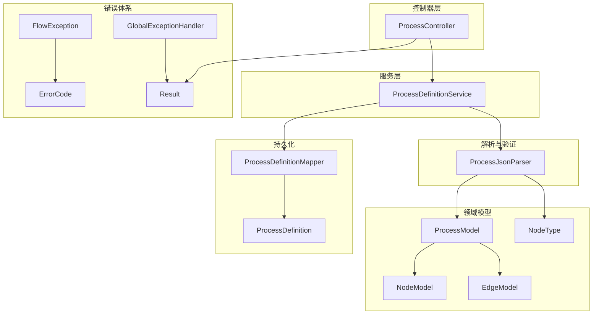
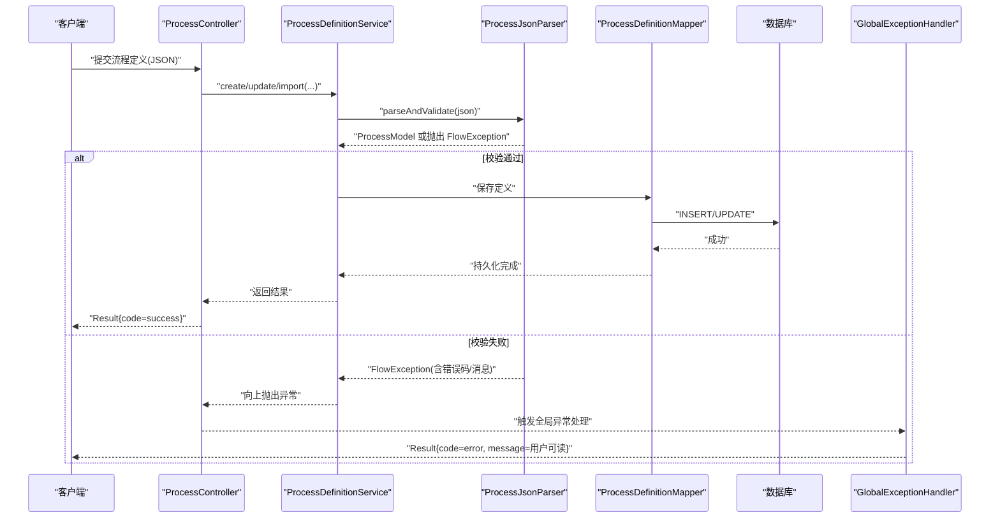
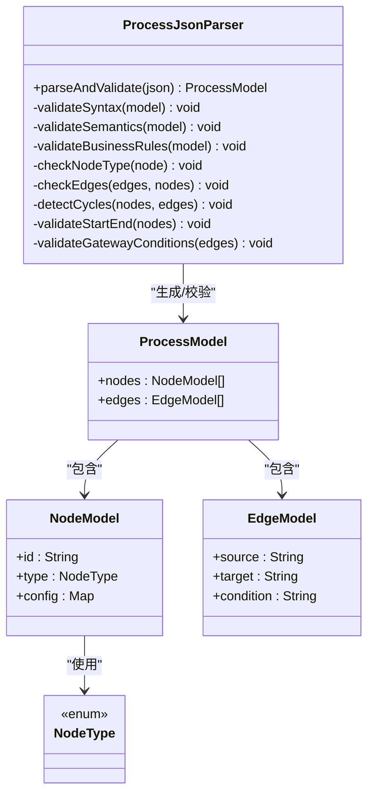
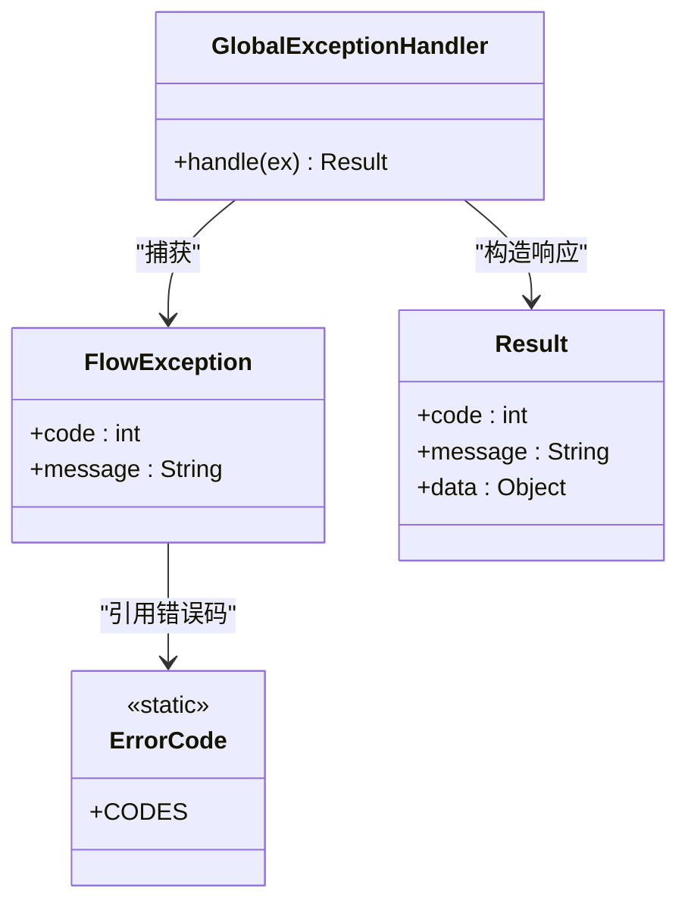
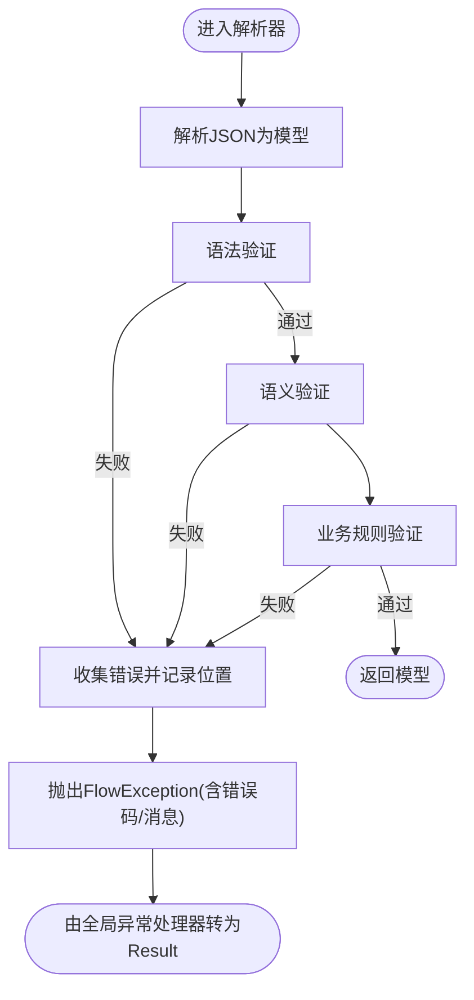
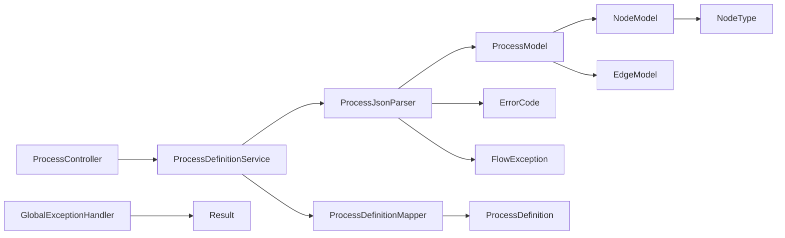

# 流程验证规则

<cite>
**本文引用的文件**   
- [ProcessJsonParser.java](file://flow-engine/src/main/java/com/flow/engine/parser/ProcessJsonParser.java)
- [ProcessDefinitionService.java](file://flow-engine/src/main/java/com/flow/engine/service/ProcessDefinitionService.java)
- [ProcessController.java](file://flow-engine/src/main/java/com/flow/engine/controller/ProcessController.java)
- [ErrorCode.java](file://flow-engine/src/main/java/com/flow/engine/common/ErrorCode.java)
- [GlobalExceptionHandler.java](file://flow-engine/src/main/java/com/flow/engine/common/GlobalExceptionHandler.java)
- [FlowException.java](file://flow-engine/src/main/java/com/flow/engine/common/exception/FlowException.java)
- [Result.java](file://flow-engine/src/main/java/com/flow/engine/common/Result.java)
- [NodeType.java](file://flow-engine/src/main/java/com/flow/engine/common/enums/NodeType.java)
- [ProcessModel.java](file://flow-engine/src/main/java/com/flow/engine/model/ProcessModel.java)
- [NodeModel.java](file://flow-engine/src/main/java/com/flow/engine/model/NodeModel.java)
- [EdgeModel.java](file://flow-engine/src/main/java/com/flow/engine/model/EdgeModel.java)
- [ProcessDefinitionCreateRequest.java](file://flow-engine/src/main/java/com/flow/engine/dto/ProcessDefinitionCreateRequest.java)
- [ProcessDefinitionUpdateRequest.java](file://flow-engine/src/main/java/com/flow/engine/dto/ProcessDefinitionUpdateRequest.java)
- [ProcessDefinitionImportRequest.java](file://flow-engine/src/main/java/com/flow/engine/dto/ProcessDefinitionImportRequest.java)
- [ProcessDefinitionResponse.java](file://flow-engine/src/main/java/com/flow/engine/dto/ProcessDefinitionResponse.java)
- [ProcessDefinitionMapper.java](file://flow-engine/src/main/java/com/flow/engine/mapper/ProcessDefinitionMapper.java)
- [ProcessDefinition.java](file://flow-engine/src/main/java/com/flow/engine/entity/ProcessDefinition.java)
- [ProcessJsonParserTest.java](file://flow-engine/src/test/java/com/flow/engine/parser/ProcessJsonParserTest.java)
</cite>

## 目录
1. [简介](#简介)
2. [项目结构](#项目结构)
3. [核心组件](#核心组件)
4. [架构总览](#架构总览)
5. [详细组件分析](#详细组件分析)
6. [依赖关系分析](#依赖关系分析)
7. [性能考虑](#性能考虑)
8. [故障排查指南](#故障排查指南)
9. [结论](#结论)
10. [附录](#附录)

## 简介
本文件聚焦于“流程定义”的验证机制，覆盖语法验证、语义验证与业务规则验证。重点解析 ProcessJsonParser 中的验证逻辑（节点类型检查、连线关系验证、循环依赖检测等），并说明错误码定义、错误消息格式化、自定义验证规则的扩展方式、失败处理策略与用户友好提示，以及针对大文件的性能优化方案。

## 项目结构
与流程验证相关的后端代码主要位于 flow-engine 模块中：
- 解析与验证入口：parser/ProcessJsonParser.java
- 服务层编排：service/ProcessDefinitionService.java
- 控制器暴露接口：controller/ProcessController.java
- 模型与枚举：model/*, common/enums/NodeType.java
- 错误体系：common/ErrorCode.java, common/exception/FlowException.java, common/GlobalExceptionHandler.java, common/Result.java
- DTO 与持久化：dto/*, entity/ProcessDefinition.java, mapper/ProcessDefinitionMapper.java
- 单元测试：test/.../ProcessJsonParserTest.java

图表来源
- [ProcessController.java](file://flow-engine/src/main/java/com/flow/engine/controller/ProcessController.java)
- [ProcessDefinitionService.java](file://flow-engine/src/main/java/com/flow/engine/service/ProcessDefinitionService.java)
- [ProcessJsonParser.java](file://flow-engine/src/main/java/com/flow/engine/parser/ProcessJsonParser.java)
- [ProcessModel.java](file://flow-engine/src/main/java/com/flow/engine/model/ProcessModel.java)
- [NodeModel.java](file://flow-engine/src/main/java/com/flow/engine/model/NodeModel.java)
- [EdgeModel.java](file://flow-engine/src/main/java/com/flow/engine/model/EdgeModel.java)
- [NodeType.java](file://flow-engine/src/main/java/com/flow/engine/common/enums/NodeType.java)
- [ErrorCode.java](file://flow-engine/src/main/java/com/flow/engine/common/ErrorCode.java)
- [FlowException.java](file://flow-engine/src/main/java/com/flow/engine/common/exception/FlowException.java)
- [GlobalExceptionHandler.java](file://flow-engine/src/main/java/com/flow/engine/common/GlobalExceptionHandler.java)
- [Result.java](file://flow-engine/src/main/java/com/flow/engine/common/Result.java)
- [ProcessDefinition.java](file://flow-engine/src/main/java/com/flow/engine/entity/ProcessDefinition.java)
- [ProcessDefinitionMapper.java](file://flow-engine/src/main/java/com/flow/engine/mapper/ProcessDefinitionMapper.java)

章节来源
- [ProcessController.java](file://flow-engine/src/main/java/com/flow/engine/controller/ProcessController.java)
- [ProcessDefinitionService.java](file://flow-engine/src/main/java/com/flow/engine/service/ProcessDefinitionService.java)
- [ProcessJsonParser.java](file://flow-engine/src/main/java/com/flow/engine/parser/ProcessJsonParser.java)
- [ProcessModel.java](file://flow-engine/src/main/java/com/flow/engine/model/ProcessModel.java)
- [NodeModel.java](file://flow-engine/src/main/java/com/flow/engine/model/NodeModel.java)
- [EdgeModel.java](file://flow-engine/src/main/java/com/flow/engine/model/EdgeModel.java)
- [NodeType.java](file://flow-engine/src/main/java/com/flow/engine/common/enums/NodeType.java)
- [ErrorCode.java](file://flow-engine/src/main/java/com/flow/engine/common/ErrorCode.java)
- [FlowException.java](file://flow-engine/src/main/java/com/flow/engine/common/exception/FlowException.java)
- [GlobalExceptionHandler.java](file://flow-engine/src/main/java/com/flow/engine/common/GlobalExceptionHandler.java)
- [Result.java](file://flow-engine/src/main/java/com/flow/engine/common/Result.java)
- [ProcessDefinition.java](file://flow-engine/src/main/java/com/flow/engine/entity/ProcessDefinition.java)
- [ProcessDefinitionMapper.java](file://flow-engine/src/main/java/com/flow/engine/mapper/ProcessDefinitionMapper.java)

## 核心组件
- ProcessJsonParser：负责将流程 JSON 解析为内部模型并进行多层验证（语法、语义、业务规则）。
- ProcessDefinitionService：在保存/更新/导入前调用解析器进行校验，并将结果持久化。
- 控制器：对外暴露流程定义的创建、更新、导入与校验接口，统一返回 Result。
- 错误体系：ErrorCode 提供错误码；FlowException 承载业务异常；GlobalExceptionHandler 统一捕获并转换为 Result。
- 领域模型：ProcessModel/NodeModel/EdgeModel 表示流程拓扑；NodeType 限定合法节点类型。

章节来源
- [ProcessJsonParser.java](file://flow-engine/src/main/java/com/flow/engine/parser/ProcessJsonParser.java)
- [ProcessDefinitionService.java](file://flow-engine/src/main/java/com/flow/engine/service/ProcessDefinitionService.java)
- [ProcessController.java](file://flow-engine/src/main/java/com/flow/engine/controller/ProcessController.java)
- [ErrorCode.java](file://flow-engine/src/main/java/com/flow/engine/common/ErrorCode.java)
- [FlowException.java](file://flow-engine/src/main/java/com/flow/engine/common/exception/FlowException.java)
- [GlobalExceptionHandler.java](file://flow-engine/src/main/java/com/flow/engine/common/GlobalExceptionHandler.java)
- [Result.java](file://flow-engine/src/main/java/com/flow/engine/common/Result.java)
- [ProcessModel.java](file://flow-engine/src/main/java/com/flow/engine/model/ProcessModel.java)
- [NodeModel.java](file://flow-engine/src/main/java/com/flow/engine/model/NodeModel.java)
- [EdgeModel.java](file://flow-engine/src/main/java/com/flow/engine/model/EdgeModel.java)
- [NodeType.java](file://flow-engine/src/main/java/com/flow/engine/common/enums/NodeType.java)

## 架构总览
下图展示了从控制器到解析器的调用链及错误传播路径。

图表来源
- [ProcessController.java](file://flow-engine/src/main/java/com/flow/engine/controller/ProcessController.java)
- [ProcessDefinitionService.java](file://flow-engine/src/main/java/com/flow/engine/service/ProcessDefinitionService.java)
- [ProcessJsonParser.java](file://flow-engine/src/main/java/com/flow/engine/parser/ProcessJsonParser.java)
- [ProcessDefinitionMapper.java](file://flow-engine/src/main/java/com/flow/engine/mapper/ProcessDefinitionMapper.java)
- [GlobalExceptionHandler.java](file://flow-engine/src/main/java/com/flow/engine/common/GlobalExceptionHandler.java)

## 详细组件分析

### 解析与验证：ProcessJsonParser
职责
- 将 JSON 字符串解析为 ProcessModel（包含 NodeModel 集合与 EdgeModel 集合）。
- 执行三类验证：
  - 语法验证：JSON 结构完整性、必填字段、类型约束。
  - 语义验证：节点类型合法性、起点/终点唯一性、连线目标存在性、分支条件表达式合法性等。
  - 业务规则验证：循环依赖检测、连通性、网关行为一致性等。

关键验证点
- 节点类型检查：仅允许 NodeType 枚举中定义的节点类型。
- 连线关系验证：每条边的 source/target 必须存在于节点集合；目标节点不得为空；对网关出边数量与条件约束进行检查。
- 循环依赖检测：基于有向图构建与环检测算法，避免死循环流转。
- 起点/终点约束：流程应包含且仅包含一个起点和一个终点（具体以业务约定为准）。
- 条件表达式校验：对分支条件进行基础语法检查（如括号匹配、变量引用格式等）。

错误处理
- 遇到非法输入时抛出 FlowException，携带 ErrorCode 与可展示的消息。
- 支持批量收集错误（例如同时报告多个不合法的边），以便前端一次性修正。

图表来源
- [ProcessJsonParser.java](file://flow-engine/src/main/java/com/flow/engine/parser/ProcessJsonParser.java)
- [ProcessModel.java](file://flow-engine/src/main/java/com/flow/engine/model/ProcessModel.java)
- [NodeModel.java](file://flow-engine/src/main/java/com/flow/engine/model/NodeModel.java)
- [EdgeModel.java](file://flow-engine/src/main/java/com/flow/engine/model/EdgeModel.java)
- [NodeType.java](file://flow-engine/src/main/java/com/flow/engine/common/enums/NodeType.java)

章节来源
- [ProcessJsonParser.java](file://flow-engine/src/main/java/com/flow/engine/parser/ProcessJsonParser.java)
- [ProcessModel.java](file://flow-engine/src/main/java/com/flow/engine/model/ProcessModel.java)
- [NodeModel.java](file://flow-engine/src/main/java/com/flow/engine/model/NodeModel.java)
- [EdgeModel.java](file://flow-engine/src/main/java/com/flow/engine/model/EdgeModel.java)
- [NodeType.java](file://flow-engine/src/main/java/com/flow/engine/common/enums/NodeType.java)

### 服务层：ProcessDefinitionService
职责
- 在创建/更新/导入流程定义前，调用解析器进行完整校验。
- 校验通过后，将 ProcessModel 序列化为 JSON 并持久化。
- 封装业务异常，确保上层控制器获得一致的响应。

交互要点
- 若解析器抛出 FlowException，则直接上抛，交由全局异常处理器统一转换。
- 校验成功后，再访问数据层，保证“先验后写”。

章节来源
- [ProcessDefinitionService.java](file://flow-engine/src/main/java/com/flow/engine/service/ProcessDefinitionService.java)
- [ProcessDefinitionMapper.java](file://flow-engine/src/main/java/com/flow/engine/mapper/ProcessDefinitionMapper.java)
- [ProcessDefinition.java](file://flow-engine/src/main/java/com/flow/engine/entity/ProcessDefinition.java)

### 控制器：ProcessController
职责
- 暴露流程定义的创建、更新、导入与校验接口。
- 接收请求体 DTO，委托服务层处理，返回 Result。

章节来源
- [ProcessController.java](file://flow-engine/src/main/java/com/flow/engine/controller/ProcessController.java)
- [ProcessDefinitionCreateRequest.java](file://flow-engine/src/main/java/com/flow/engine/dto/ProcessDefinitionCreateRequest.java)
- [ProcessDefinitionUpdateRequest.java](file://flow-engine/src/main/java/com/flow/engine/dto/ProcessDefinitionUpdateRequest.java)
- [ProcessDefinitionImportRequest.java](file://flow-engine/src/main/java/com/flow/engine/dto/ProcessDefinitionImportRequest.java)
- [ProcessDefinitionResponse.java](file://flow-engine/src/main/java/com/flow/engine/dto/ProcessDefinitionResponse.java)
- [Result.java](file://flow-engine/src/main/java/com/flow/engine/common/Result.java)

### 错误体系与统一处理
- ErrorCode：集中定义错误码常量，便于分类与国际化映射。
- FlowException：业务异常载体，包含错误码与原始信息。
- GlobalExceptionHandler：捕获 FlowException 及其他异常，转换为 Result，屏蔽内部细节，输出用户友好的消息。
- Result：统一响应结构，包含 code/message/data。

图表来源
- [ErrorCode.java](file://flow-engine/src/main/java/com/flow/engine/common/ErrorCode.java)
- [FlowException.java](file://flow-engine/src/main/java/com/flow/engine/common/exception/FlowException.java)
- [GlobalExceptionHandler.java](file://flow-engine/src/main/java/com/flow/engine/common/GlobalExceptionHandler.java)
- [Result.java](file://flow-engine/src/main/java/com/flow/engine/common/Result.java)

章节来源
- [ErrorCode.java](file://flow-engine/src/main/java/com/flow/engine/common/ErrorCode.java)
- [FlowException.java](file://flow-engine/src/main/java/com/flow/engine/common/exception/FlowException.java)
- [GlobalExceptionHandler.java](file://flow-engine/src/main/java/com/flow/engine/common/GlobalExceptionHandler.java)
- [Result.java](file://flow-engine/src/main/java/com/flow/engine/common/Result.java)

### 验证失败的错误处理流程

图表来源
- [ProcessJsonParser.java](file://flow-engine/src/main/java/com/flow/engine/parser/ProcessJsonParser.java)
- [FlowException.java](file://flow-engine/src/main/java/com/flow/engine/common/exception/FlowException.java)
- [GlobalExceptionHandler.java](file://flow-engine/src/main/java/com/flow/engine/common/GlobalExceptionHandler.java)

## 依赖关系分析
- 控制器依赖服务层，服务层依赖解析器与数据访问层。
- 解析器依赖领域模型与枚举，不直接依赖数据层。
- 错误体系贯穿全链路，解析器与服务层通过异常契约协作。

图表来源
- [ProcessController.java](file://flow-engine/src/main/java/com/flow/engine/controller/ProcessController.java)
- [ProcessDefinitionService.java](file://flow-engine/src/main/java/com/flow/engine/service/ProcessDefinitionService.java)
- [ProcessJsonParser.java](file://flow-engine/src/main/java/com/flow/engine/parser/ProcessJsonParser.java)
- [ProcessModel.java](file://flow-engine/src/main/java/com/flow/engine/model/ProcessModel.java)
- [NodeModel.java](file://flow-engine/src/main/java/com/flow/engine/model/NodeModel.java)
- [EdgeModel.java](file://flow-engine/src/main/java/com/flow/engine/model/EdgeModel.java)
- [NodeType.java](file://flow-engine/src/main/java/com/flow/engine/common/enums/NodeType.java)
- [ProcessDefinitionMapper.java](file://flow-engine/src/main/java/com/flow/engine/mapper/ProcessDefinitionMapper.java)
- [ProcessDefinition.java](file://flow-engine/src/main/java/com/flow/engine/entity/ProcessDefinition.java)
- [ErrorCode.java](file://flow-engine/src/main/java/com/flow/engine/common/ErrorCode.java)
- [FlowException.java](file://flow-engine/src/main/java/com/flow/engine/common/exception/FlowException.java)
- [GlobalExceptionHandler.java](file://flow-engine/src/main/java/com/flow/engine/common/GlobalExceptionHandler.java)
- [Result.java](file://flow-engine/src/main/java/com/flow/engine/common/Result.java)

章节来源
- [ProcessController.java](file://flow-engine/src/main/java/com/flow/engine/controller/ProcessController.java)
- [ProcessDefinitionService.java](file://flow-engine/src/main/java/com/flow/engine/service/ProcessDefinitionService.java)
- [ProcessJsonParser.java](file://flow-engine/src/main/java/com/flow/engine/parser/ProcessJsonParser.java)
- [ProcessModel.java](file://flow-engine/src/main/java/com/flow/engine/model/ProcessModel.java)
- [NodeModel.java](file://flow-engine/src/main/java/com/flow/engine/model/NodeModel.java)
- [EdgeModel.java](file://flow-engine/src/main/java/com/flow/engine/model/EdgeModel.java)
- [NodeType.java](file://flow-engine/src/main/java/com/flow/engine/common/enums/NodeType.java)
- [ProcessDefinitionMapper.java](file://flow-engine/src/main/java/com/flow/engine/mapper/ProcessDefinitionMapper.java)
- [ProcessDefinition.java](file://flow-engine/src/main/java/com/flow/engine/entity/ProcessDefinition.java)
- [ErrorCode.java](file://flow-engine/src/main/java/com/flow/engine/common/ErrorCode.java)
- [FlowException.java](file://flow-engine/src/main/java/com/flow/engine/common/exception/FlowException.java)
- [GlobalExceptionHandler.java](file://flow-engine/src/main/java/com/flow/engine/common/GlobalExceptionHandler.java)
- [Result.java](file://flow-engine/src/main/java/com/flow/engine/common/Result.java)

## 性能考虑
- 分阶段验证：优先执行低成本校验（如 JSON 结构、节点集合非空），再执行高成本校验（如环检测、连通性）。
- 增量校验：在编辑器侧做实时校验，服务端仅做最终一致性校验，减少无效请求。
- 并行校验：对相互独立的规则（如节点类型、边目标存在性）采用并行流或线程池执行，缩短整体耗时。
- 短路策略：发现致命错误（如无起点/无终点）立即中止后续校验，快速失败。
- 大文件处理：
  - 限制最大 JSON 大小，避免内存溢出。
  - 流式解析与分批校验，降低峰值内存占用。
  - 对超大规模流程启用异步校验任务，返回任务 ID 供查询进度。
- 缓存热点：对重复使用的字典/枚举/配置进行缓存，减少重复计算。

[本节为通用性能建议，无需源码引用]

## 故障排查指南
- 常见错误类型
  - 语法错误：JSON 缺失必填字段、类型不符、结构不完整。
  - 语义错误：节点类型不在白名单、边目标不存在、起点/终点不满足约束、网关出边条件缺失。
  - 业务错误：存在循环依赖、不可达节点、分支条件表达式非法。
- 定位方法
  - 查看 Result 中的 code 与 message，结合错误码对照表定位问题。
  - 若返回多条错误，按顺序逐一修复。
  - 对于复杂流程，先简化至最小可运行版本，逐步添加节点与边以复现问题。
- 日志与调试
  - 开启服务端调试日志，关注解析阶段的异常堆栈。
  - 使用单元测试用例对比期望与实际的模型结构。

章节来源
- [ErrorCode.java](file://flow-engine/src/main/java/com/flow/engine/common/ErrorCode.java)
- [FlowException.java](file://flow-engine/src/main/java/com/flow/engine/common/exception/FlowException.java)
- [GlobalExceptionHandler.java](file://flow-engine/src/main/java/com/flow/engine/common/GlobalExceptionHandler.java)
- [ProcessJsonParserTest.java](file://flow-engine/src/test/java/com/flow/engine/parser/ProcessJsonParserTest.java)

## 结论
流程验证通过“解析—语法—语义—业务规则”的分层设计，既保证了流程定义的健壮性，又提供了清晰的错误反馈与可扩展的验证框架。配合统一的错误体系与全局异常处理，可在前后端之间形成一致的错误语义与用户体验。针对大文件与高频校验场景，可通过并行、短路、流式与异步等手段进一步优化性能。

[本节为总结性内容，无需源码引用]

## 附录

### 自定义验证规则实现方法
- 扩展点设计
  - 在解析器中预留“验证器注册表”，支持动态注入自定义验证器。
  - 每个验证器实现统一接口，包含 validate(ProcessModel) 方法，返回错误或空。
- 注册机制
  - 通过 Spring 容器自动扫描并注册验证器，或在配置类中显式注册。
  - 支持优先级排序，确保关键规则优先执行。
- 错误上报
  - 自定义验证器抛出 FlowException 或收集错误列表，由解析器统一聚合。
- 测试与回归
  - 为新规则编写单元测试，覆盖正常与异常路径。

章节来源
- [ProcessJsonParser.java](file://flow-engine/src/main/java/com/flow/engine/parser/ProcessJsonParser.java)
- [FlowException.java](file://flow-engine/src/main/java/com/flow/engine/common/exception/FlowException.java)
- [ProcessJsonParserTest.java](file://flow-engine/src/test/java/com/flow/engine/parser/ProcessJsonParserTest.java)