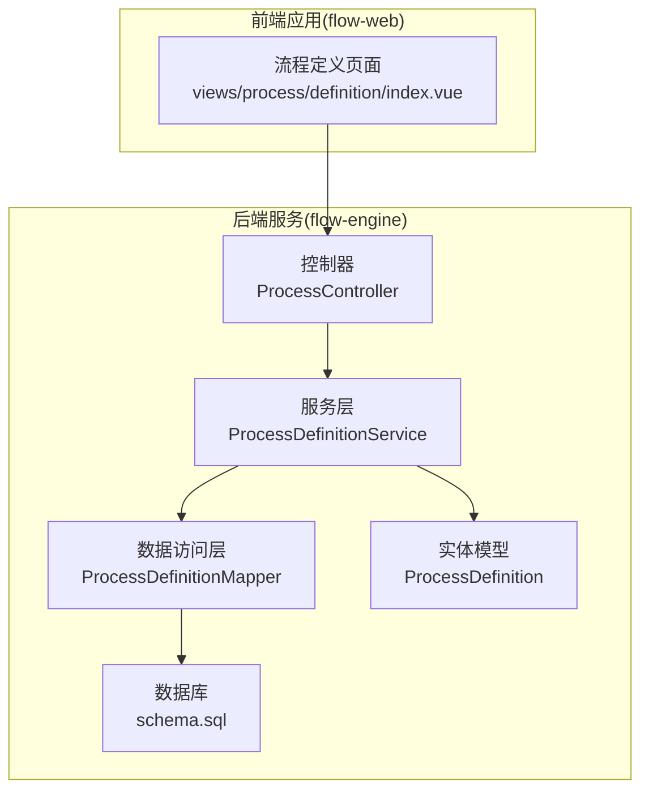
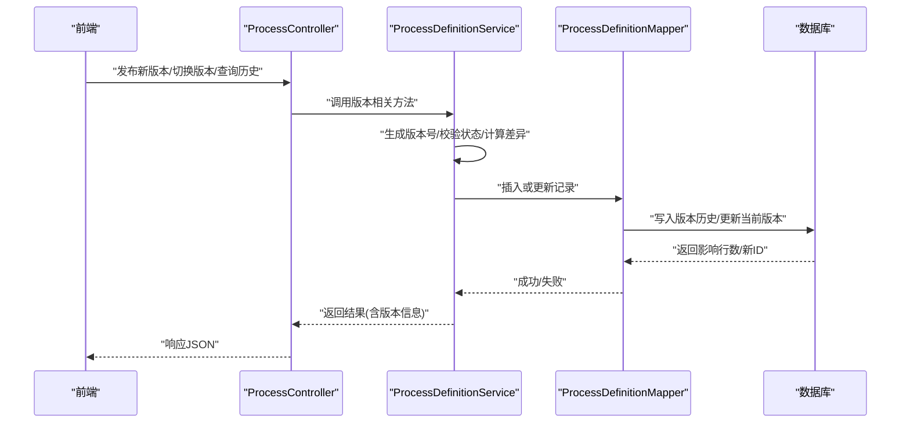
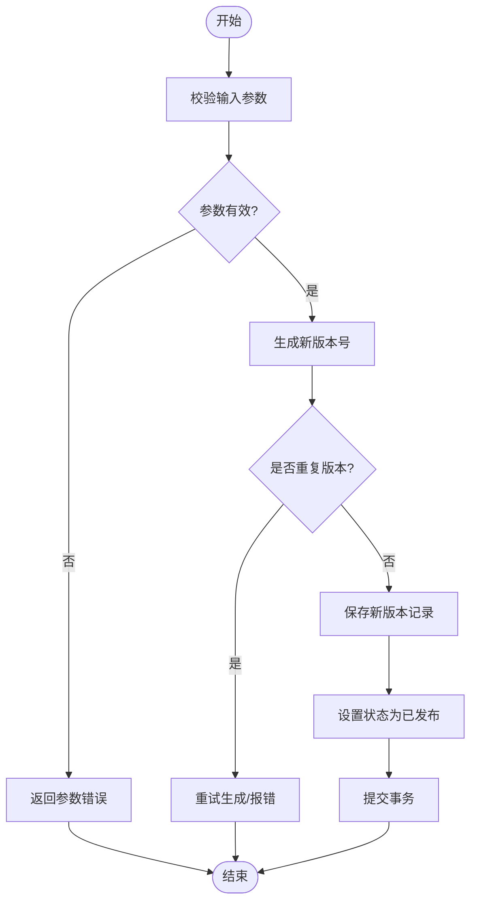
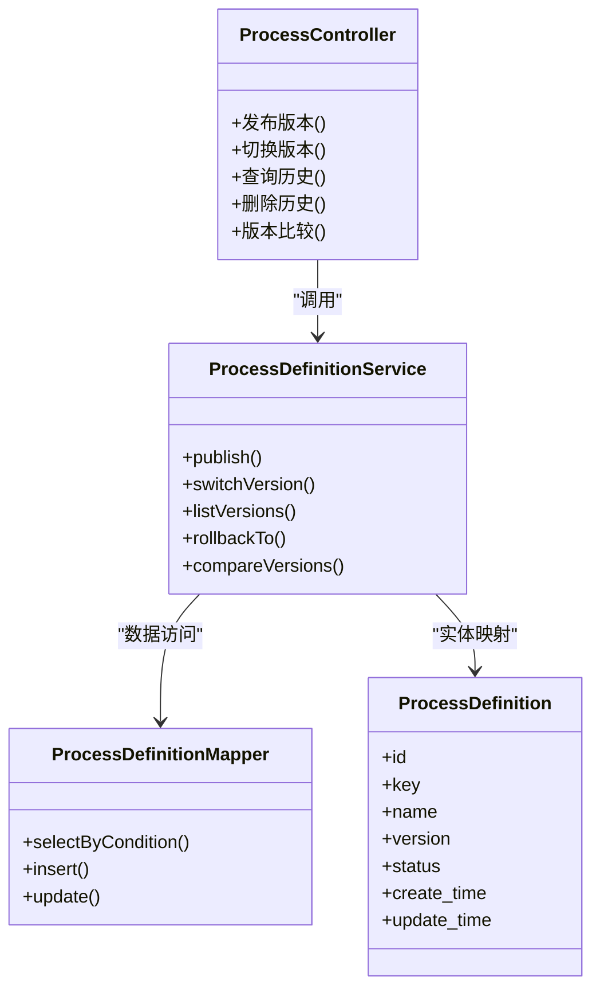

# 版本控制机制

<cite>
**本文引用的文件**   
- [ProcessDefinition.java](file://flow-engine/src/main/java/com/flow/engine/entity/ProcessDefinition.java)
- [ProcessDefinitionService.java](file://flow-engine/src/main/java/com/flow/engine/service/ProcessDefinitionService.java)
- [ProcessController.java](file://flow-engine/src/main/java/com/flow/engine/controller/ProcessController.java)
- [ProcessDefinitionMapper.java](file://flow-engine/src/main/java/com/flow/engine/mapper/ProcessDefinitionMapper.java)
- [schema.sql](file://flow-engine/src/main/resources/db/schema.sql)
- [ProcessDefinitionCreateRequest.java](file://flow-engine/src/main/java/com/flow/engine/dto/ProcessDefinitionCreateRequest.java)
- [ProcessDefinitionUpdateRequest.java](file://flow-engine/src/main/java/com/flow/engine/dto/ProcessDefinitionUpdateRequest.java)
- [ProcessDefinitionImportRequest.java](file://flow-engine/src/main/java/com/flow/engine/dto/ProcessDefinitionImportRequest.java)
- [ProcessDefinitionResponse.java](file://flow-engine/src/main/java/com/flow/engine/dto/ProcessDefinitionResponse.java)
</cite>

## 目录
1. [简介](#简介)
2. [项目结构](#项目结构)
3. [核心组件](#核心组件)
4. [架构总览](#架构总览)
5. [详细组件分析](#详细组件分析)
6. [依赖关系分析](#依赖关系分析)
7. [性能考虑](#性能考虑)
8. [故障排查指南](#故障排查指南)
9. [结论](#结论)
10. [附录](#附录)

## 简介
本文件围绕流程版本控制机制进行系统化说明，重点覆盖以下方面：
- 版本号生成策略与版本切换逻辑
- 历史版本存储与查询管理
- ProcessDefinition实体中version、status等字段的设计与作用
- 版本发布、回滚、比较等核心业务规则
- API接口使用示例（获取版本列表、切换到指定版本等）
- 版本冲突处理与并发控制策略

## 项目结构
与版本控制相关的后端代码主要位于flow-engine模块的entity、service、controller、mapper以及resources/db目录。前端展示与交互位于flow-web模块的process定义页面。

图表来源
- [ProcessController.java](file://flow-engine/src/main/java/com/flow/engine/controller/ProcessController.java)
- [ProcessDefinitionService.java](file://flow-engine/src/main/java/com/flow/engine/service/ProcessDefinitionService.java)
- [ProcessDefinitionMapper.java](file://flow-engine/src/main/java/com/flow/engine/mapper/ProcessDefinitionMapper.java)
- [ProcessDefinition.java](file://flow-engine/src/main/java/com/flow/engine/entity/ProcessDefinition.java)
- [schema.sql](file://flow-engine/src/main/resources/db/schema.sql)

章节来源
- [ProcessController.java](file://flow-engine/src/main/java/com/flow/engine/controller/ProcessController.java)
- [ProcessDefinitionService.java](file://flow-engine/src/main/java/com/flow/engine/service/ProcessDefinitionService.java)
- [ProcessDefinitionMapper.java](file://flow-engine/src/main/java/com/flow/engine/mapper/ProcessDefinitionMapper.java)
- [ProcessDefinition.java](file://flow-engine/src/main/java/com/flow/engine/entity/ProcessDefinition.java)
- [schema.sql](file://flow-engine/src/main/resources/db/schema.sql)

## 核心组件
- 实体模型：ProcessDefinition承载流程定义的元数据与版本信息，包含版本标识、状态、创建时间等字段。
- 服务层：ProcessDefinitionService封装版本发布、切换、历史查询、回滚、比较等核心业务逻辑。
- 控制器：ProcessController暴露REST接口，接收前端请求并调用服务层完成版本操作。
- 数据访问层：ProcessDefinitionMapper提供对流程定义表的CRUD与按条件查询能力。
- 数据库：schema.sql定义流程定义表结构与索引，支撑版本历史与查询性能。

章节来源
- [ProcessDefinition.java](file://flow-engine/src/main/java/com/flow/engine/entity/ProcessDefinition.java)
- [ProcessDefinitionService.java](file://flow-engine/src/main/java/com/flow/engine/service/ProcessDefinitionService.java)
- [ProcessController.java](file://flow-engine/src/main/java/com/flow/engine/controller/ProcessController.java)
- [ProcessDefinitionMapper.java](file://flow-engine/src/main/java/com/flow/engine/mapper/ProcessDefinitionMapper.java)
- [schema.sql](file://flow-engine/src/main/resources/db/schema.sql)

## 架构总览
版本控制的整体调用链路如下：前端通过API触发版本操作，控制器校验参数后交由服务层执行；服务层在事务内完成版本号的生成、状态的更新与历史记录的持久化，并通过数据访问层与数据库交互。

图表来源
- [ProcessController.java](file://flow-engine/src/main/java/com/flow/engine/controller/ProcessController.java)
- [ProcessDefinitionService.java](file://flow-engine/src/main/java/com/flow/engine/service/ProcessDefinitionService.java)
- [ProcessDefinitionMapper.java](file://flow-engine/src/main/java/com/flow/engine/mapper/ProcessDefinitionMapper.java)
- [schema.sql](file://flow-engine/src/main/resources/db/schema.sql)

## 详细组件分析

### 实体模型：ProcessDefinition
- 关键字段
  - id：主键，唯一标识一条流程定义记录
  - key：流程定义的业务键，用于区分不同流程
  - name：流程名称
  - version：版本号，表示该流程定义的版本序号
  - status：状态，如草稿、已发布、已停用等
  - create_time/update_time：审计时间戳
- 设计要点
  - version与key组合可唯一标识一个版本的流程定义
  - status用于控制版本生命周期与可用性
  - 建议为(key, version)建立唯一索引，避免重复发布同一版本

章节来源
- [ProcessDefinition.java](file://flow-engine/src/main/java/com/flow/engine/entity/ProcessDefinition.java)
- [schema.sql](file://flow-engine/src/main/resources/db/schema.sql)

### 服务层：ProcessDefinitionService
- 职责
  - 版本发布：根据输入的流程定义内容生成新版本号，设置状态为“已发布”，并保存历史记录
  - 版本切换：将指定key的流程定义切换到目标version，更新当前可用版本的状态
  - 历史查询：按key分页查询历史版本，支持按状态过滤
  - 版本回滚：将某个历史版本提升为当前可用版本
  - 版本比较：对比两个版本的差异（节点、连线、变量等），输出结构化差异
- 并发与一致性
  - 使用数据库唯一约束(key, version)防止重复版本
  - 在发布/切换操作中采用事务保证原子性
  - 引入乐观锁或CAS机制避免并发覆盖
- 错误处理
  - 非法参数校验（key为空、version不合法）
  - 状态机校验（仅允许从特定状态切换到目标状态）
  - 统一异常类型与错误码，便于前端提示

章节来源
- [ProcessDefinitionService.java](file://flow-engine/src/main/java/com/flow/engine/service/ProcessDefinitionService.java)

### 控制器：ProcessController
- 暴露接口
  - 发布版本：POST /process/definitions/publish
  - 切换版本：PUT /process/definitions/{key}/versions/{version}
  - 查询历史：GET /process/definitions/{key}/versions?status=...&page=...&size=...
  - 删除历史：DELETE /process/definitions/{key}/versions/{version}
  - 版本比较：GET /process/definitions/{key}/versions/{v1}/compare/{v2}
- 参数校验与响应
  - 使用DTO对象接收请求体，统一包装Result返回
  - 对关键路径增加权限校验与审计日志

章节来源
- [ProcessController.java](file://flow-engine/src/main/java/com/flow/engine/controller/ProcessController.java)

### 数据访问层：ProcessDefinitionMapper
- 能力
  - 按key查询所有版本
  - 按key+version精确查询
  - 按key+status统计与分页
  - 插入新版本记录
- 性能优化
  - 针对key、status、create_time建立合适索引
  - 分页查询避免全表扫描

章节来源
- [ProcessDefinitionMapper.java](file://flow-engine/src/main/java/com/flow/engine/mapper/ProcessDefinitionMapper.java)
- [schema.sql](file://flow-engine/src/main/resources/db/schema.sql)

### 数据库设计：schema.sql
- 表结构
  - process_definition：包含id、key、name、version、status、json_content、create_time、update_time等字段
- 索引与约束
  - 主键索引：id
  - 唯一索引：(key, version)
  - 普通索引：key、status、create_time
- 扩展点
  - 可扩展comment字段记录发布说明
  - 可扩展operator_id记录操作人

章节来源
- [schema.sql](file://flow-engine/src/main/resources/db/schema.sql)

### DTO与请求/响应模型
- 请求
  - ProcessDefinitionCreateRequest：发布新版本时的输入
  - ProcessDefinitionUpdateRequest：切换版本时的输入
  - ProcessDefinitionImportRequest：批量导入流程定义时的输入
- 响应
  - ProcessDefinitionResponse：统一的版本信息返回结构

章节来源
- [ProcessDefinitionCreateRequest.java](file://flow-engine/src/main/java/com/flow/engine/dto/ProcessDefinitionCreateRequest.java)
- [ProcessDefinitionUpdateRequest.java](file://flow-engine/src/main/java/com/flow/engine/dto/ProcessDefinitionUpdateRequest.java)
- [ProcessDefinitionImportRequest.java](file://flow-engine/src/main/java/com/flow/engine/dto/ProcessDefinitionImportRequest.java)
- [ProcessDefinitionResponse.java](file://flow-engine/src/main/java/com/flow/engine/dto/ProcessDefinitionResponse.java)

### 版本号生成策略
- 策略原则
  - 单调递增：确保新版本号大于旧版本
  - 可读性与稳定性：建议使用整数自增或语义化版本（主版本.次版本.修订号）
- 实现方式
  - 基于数据库序列或最大版本号+1
  - 结合分布式ID生成器（如雪花算法）保证全局唯一
- 冲突处理
  - 若并发导致版本号重复，捕获唯一约束异常并重试一次

章节来源
- [ProcessDefinitionService.java](file://flow-engine/src/main/java/com/flow/engine/service/ProcessDefinitionService.java)
- [schema.sql](file://flow-engine/src/main/resources/db/schema.sql)

### 版本切换逻辑
- 前置校验
  - 目标version存在且属于同一key
  - 目标version状态允许被切换（如已发布）
- 切换步骤
  - 将原当前版本标记为非当前（可选）
  - 将目标版本标记为当前可用
  - 记录切换审计日志
- 并发控制
  - 使用行级锁或乐观锁字段（如version_no）避免并发覆盖

章节来源
- [ProcessDefinitionService.java](file://flow-engine/src/main/java/com/flow/engine/service/ProcessDefinitionService.java)

### 历史版本存储与查询
- 存储
  - 每次发布均新增一条记录，保留完整json_content
  - 支持软删除或归档策略
- 查询
  - 按key分页查询，支持按status过滤
  - 支持按create_time排序，便于查看最新历史
- 性能
  - 大文本字段(json_content)可单独存表或压缩存储
  - 合理分页与索引提升查询效率

章节来源
- [ProcessDefinitionService.java](file://flow-engine/src/main/java/com/flow/engine/service/ProcessDefinitionService.java)
- [ProcessDefinitionMapper.java](file://flow-engine/src/main/java/com/flow/engine/mapper/ProcessDefinitionMapper.java)
- [schema.sql](file://flow-engine/src/main/resources/db/schema.sql)

### 版本比较功能
- 比较维度
  - 节点集合差异（新增/删除/修改）
  - 连线差异（起点/终点/条件）
  - 变量与表单配置差异
- 输出格式
  - 结构化diff对象，包含added/removed/modified三类变更
- 应用场景
  - 发布前预览差异
  - 回滚前确认影响范围

章节来源
- [ProcessDefinitionService.java](file://flow-engine/src/main/java/com/flow/engine/service/ProcessDefinitionService.java)

### 版本发布流程图

图表来源
- [ProcessDefinitionService.java](file://flow-engine/src/main/java/com/flow/engine/service/ProcessDefinitionService.java)
- [ProcessDefinitionMapper.java](file://flow-engine/src/main/java/com/flow/engine/mapper/ProcessDefinitionMapper.java)
- [schema.sql](file://flow-engine/src/main/resources/db/schema.sql)

## 依赖关系分析
- 控制器依赖服务层，服务层依赖数据访问层与实体模型
- 数据访问层依赖数据库表结构
- 前端依赖控制器暴露的REST接口

图表来源
- [ProcessController.java](file://flow-engine/src/main/java/com/flow/engine/controller/ProcessController.java)
- [ProcessDefinitionService.java](file://flow-engine/src/main/java/com/flow/engine/service/ProcessDefinitionService.java)
- [ProcessDefinitionMapper.java](file://flow-engine/src/main/java/com/flow/engine/mapper/ProcessDefinitionMapper.java)
- [ProcessDefinition.java](file://flow-engine/src/main/java/com/flow/engine/entity/ProcessDefinition.java)

## 性能考虑
- 索引优化
  - 为key、status、create_time建立索引，提高查询与分页性能
- 大字段处理
  - json_content较大时可分表存储或使用压缩
- 缓存策略
  - 热点版本的元数据可加入缓存，减少数据库压力
- 事务粒度
  - 尽量缩小事务范围，避免长事务阻塞

[本节为通用指导，无需具体文件引用]

## 故障排查指南
- 常见问题
  - 唯一约束冲突：检查(key, version)是否重复，确认版本号生成策略
  - 状态机错误：确认当前状态到目标状态的转换是否合法
  - 并发覆盖：检查是否缺少乐观锁或行级锁
- 定位手段
  - 查看服务层日志与异常堆栈
  - 核对数据库记录与索引使用情况
  - 复现场景并开启SQL慢查询日志

章节来源
- [ProcessDefinitionService.java](file://flow-engine/src/main/java/com/flow/engine/service/ProcessDefinitionService.java)
- [schema.sql](file://flow-engine/src/main/resources/db/schema.sql)

## 结论
本版本控制机制以ProcessDefinition为核心，通过服务层封装发布、切换、历史查询、回滚与比较等能力，配合数据库唯一约束与索引保障一致性与性能。建议在后续迭代中完善乐观锁、审计日志与缓存策略，进一步提升系统的健壮性与可观测性。

[本节为总结性内容，无需具体文件引用]

## 附录

### API接口使用示例
- 发布新版本
  - 方法：POST
  - 路径：/process/definitions/publish
  - 请求体：ProcessDefinitionCreateRequest
  - 响应：ProcessDefinitionResponse
- 切换到指定版本
  - 方法：PUT
  - 路径：/process/definitions/{key}/versions/{version}
  - 请求体：ProcessDefinitionUpdateRequest
  - 响应：ProcessDefinitionResponse
- 查询历史版本
  - 方法：GET
  - 路径：/process/definitions/{key}/versions
  - 查询参数：status、page、size
  - 响应：分页的ProcessDefinitionResponse列表
- 删除历史版本
  - 方法：DELETE
  - 路径：/process/definitions/{key}/versions/{version}
  - 响应：统一Result
- 版本比较
  - 方法：GET
  - 路径：/process/definitions/{key}/versions/{v1}/compare/{v2}
  - 响应：差异对象

章节来源
- [ProcessController.java](file://flow-engine/src/main/java/com/flow/engine/controller/ProcessController.java)
- [ProcessDefinitionCreateRequest.java](file://flow-engine/src/main/java/com/flow/engine/dto/ProcessDefinitionCreateRequest.java)
- [ProcessDefinitionUpdateRequest.java](file://flow-engine/src/main/java/com/flow/engine/dto/ProcessDefinitionUpdateRequest.java)
- [ProcessDefinitionResponse.java](file://flow-engine/src/main/java/com/flow/engine/dto/ProcessDefinitionResponse.java)

### 并发控制与冲突处理策略
- 乐观锁
  - 在实体中增加version_no字段，更新时校验版本号
- 唯一约束
  - (key, version)唯一索引，防止重复发布
- 重试机制
  - 捕获唯一约束异常后自动重试一次
- 幂等性
  - 对外部调用提供幂等键，避免重复提交

章节来源
- [ProcessDefinitionService.java](file://flow-engine/src/main/java/com/flow/engine/service/ProcessDefinitionService.java)
- [schema.sql](file://flow-engine/src/main/resources/db/schema.sql)