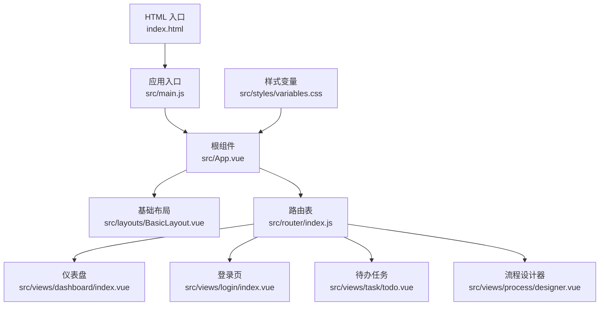
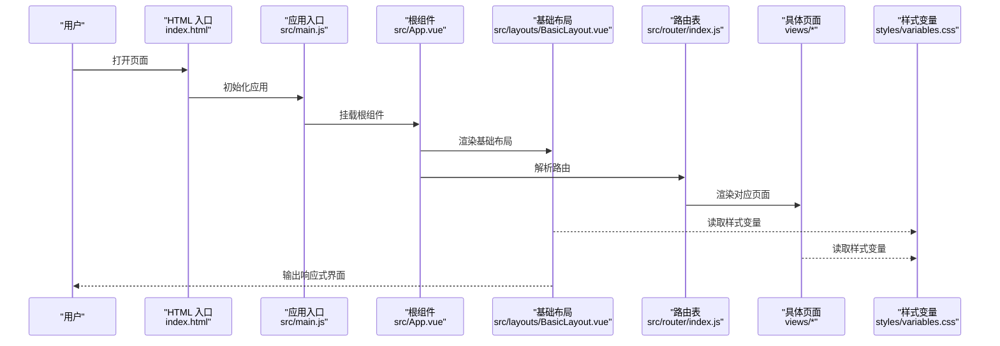
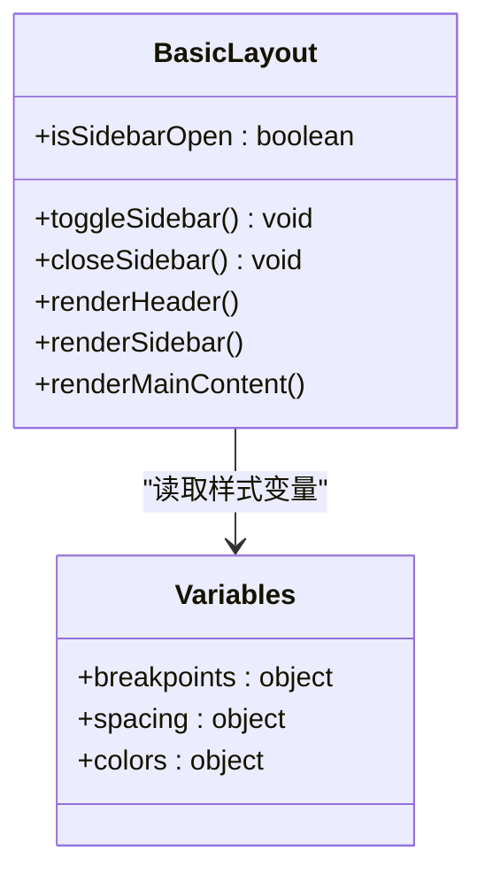
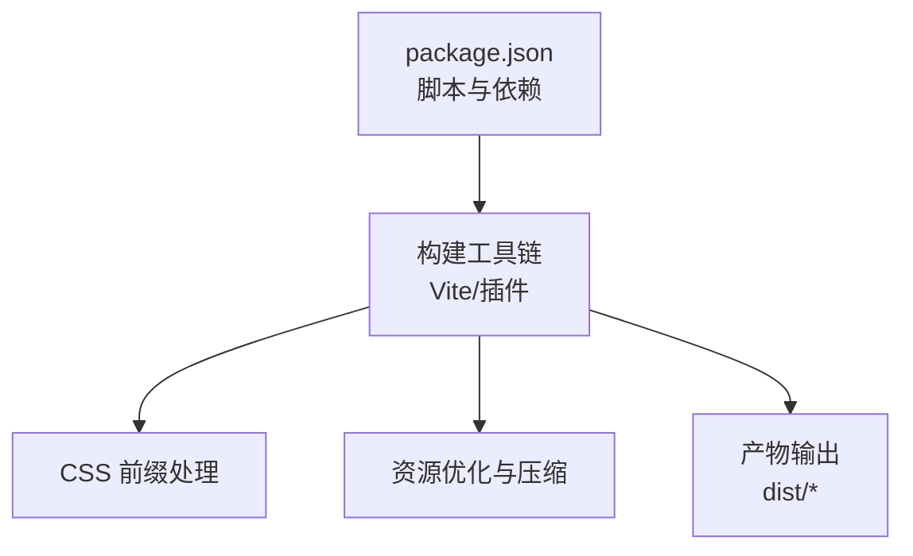

# 响应式设计

<cite>
**本文引用的文件**   
- [index.html](file://flow-web/index.html)
- [variables.css](file://flow-web/src/styles/variables.css)
- [BasicLayout.vue](file://flow-web/src/layouts/BasicLayout.vue)
- [App.vue](file://flow-web/src/App.vue)
- [main.js](file://flow-web/src/main.js)
- [index.js](file://flow-web/src/router/index.js)
- [dashboard/index.vue](file://flow-web/src/views/dashboard/index.vue)
- [login/index.vue](file://flow-web/src/views/login/index.vue)
- [task/todo.vue](file://flow-web/src/views/task/todo.vue)
- [process/designer.vue](file://flow-web/src/views/process/designer.vue)
- [package.json](file://flow-web/package.json)
</cite>

## 目录
1. [简介](#简介)
2. [项目结构](#项目结构)
3. [核心组件](#核心组件)
4. [架构总览](#架构总览)
5. [详细组件分析](#详细组件分析)
6. [依赖关系分析](#依赖关系分析)
7. [性能考虑](#性能考虑)
8. [故障排查指南](#故障排查指南)
9. [结论](#结论)
10. [附录](#附录)

## 简介
本文件面向前端工程 flow-web，系统化梳理并沉淀一套“响应式设计与移动端适配”的落地方案。内容覆盖视口配置、弹性布局与媒体查询、断点设计原则、自适应组件（可折叠侧边栏、触摸友好按钮、移动端表单优化）、图片资源优化（响应式图片、懒加载与缓存策略）、跨浏览器兼容性（CSS 前缀、JS polyfill、特性检测），以及移动端性能优化与用户体验最佳实践。文档同时结合仓库中现有页面与样式文件，给出可直接落地的建议与检查清单。

## 项目结构
flow-web 采用 Vue 3 + Vite 的前端工程化方案，路由与视图按功能域组织，样式变量集中管理。响应式相关的关键位置包括：
- HTML 入口：用于配置视口与全局 meta
- 样式变量：集中定义颜色、字号、间距等基础变量
- 布局与页面：包含基础布局与典型业务页面，便于统一接入响应式策略
- 构建配置：通过 package.json 中的脚本与依赖，驱动 CSS 前缀处理与打包流程

图表来源
- [index.html](file://flow-web/index.html)
- [main.js](file://flow-web/src/main.js)
- [App.vue](file://flow-web/src/App.vue)
- [BasicLayout.vue](file://flow-web/src/layouts/BasicLayout.vue)
- [index.js](file://flow-web/src/router/index.js)
- [dashboard/index.vue](file://flow-web/src/views/dashboard/index.vue)
- [login/index.vue](file://flow-web/src/views/login/index.vue)
- [todo.vue](file://flow-web/src/views/task/todo.vue)
- [designer.vue](file://flow-web/src/views/process/designer.vue)
- [variables.css](file://flow-web/src/styles/variables.css)

章节来源
- [index.html](file://flow-web/index.html)
- [variables.css](file://flow-web/src/styles/variables.css)
- [BasicLayout.vue](file://flow-web/src/layouts/BasicLayout.vue)
- [App.vue](file://flow-web/src/App.vue)
- [main.js](file://flow-web/src/main.js)
- [index.js](file://flow-web/src/router/index.js)
- [dashboard/index.vue](file://flow-web/src/views/dashboard/index.vue)
- [login/index.vue](file://flow-web/src/views/login/index.vue)
- [todo.vue](file://flow-web/src/views/task/todo.vue)
- [designer.vue](file://flow-web/src/views/process/designer.vue)

## 核心组件
本节聚焦响应式相关的核心实现要点与落地建议，结合现有文件进行说明。

- 视口配置与基础元信息
  - 在 HTML 入口中设置视口宽度为设备宽度、初始缩放为 1、禁止用户缩放，确保移动端渲染一致性与触控行为可控。
  - 建议补充主题色与 SEO 相关 meta，提升多端一致性体验。

- 弹性布局与网格系统
  - 使用 Flexbox 作为主要布局模型，配合 gap、wrap、align-items、justify-content 等属性实现自适应排布。
  - 对复杂列表或卡片区域，优先采用单列到多列的流式布局，避免固定宽度导致的溢出。

- 媒体查询与断点体系
  - 以“移动优先”为原则，先写小屏样式，再通过媒体查询逐步增强大屏体验。
  - 推荐断点：手机窄屏、手机宽屏、平板竖屏、平板横屏、桌面小屏、桌面常规、桌面大屏。
  - 将常用断点值抽象为 CSS 变量，便于统一维护与扩展。

- 可折叠侧边栏
  - 默认在小屏隐藏侧边栏，通过顶部导航触发抽屉式展开；在大屏常驻显示。
  - 提供键盘与焦点可达性支持，确保无障碍体验。

- 触摸友好的按钮与交互
  - 最小点击目标不小于 44x44px，增加触控反馈（按下态、涟漪效果）。
  - 避免 hover-only 交互，提供 click/tap 替代路径。

- 移动端表单优化
  - 输入框高度与行高适配触控，合理设置 inputmode、type、autocomplete、placeholder。
  - 错误提示就近展示，避免弹窗遮挡输入区。

- 图片资源优化
  - 使用 srcset/sizes 或 picture 元素提供多分辨率图片，减少带宽消耗。
  - 对长列表与首屏外的图片启用懒加载，降低首屏压力。
  - 开启浏览器缓存与 CDN 缓存，配合版本化文件名提高命中率。

- 跨浏览器兼容
  - 通过构建工具链自动添加 CSS 前缀，保证主流浏览器一致表现。
  - 针对缺失 API 的场景引入轻量 polyfill，并进行特性检测按需加载。

章节来源
- [index.html](file://flow-web/index.html)
- [variables.css](file://flow-web/src/styles/variables.css)
- [BasicLayout.vue](file://flow-web/src/layouts/BasicLayout.vue)
- [App.vue](file://flow-web/src/App.vue)
- [dashboard/index.vue](file://flow-web/src/views/dashboard/index.vue)
- [login/index.vue](file://flow-web/src/views/login/index.vue)
- [todo.vue](file://flow-web/src/views/task/todo.vue)
- [designer.vue](file://flow-web/src/views/process/designer.vue)

## 架构总览
下图展示了从 HTML 入口到各页面的响应式渲染链路，以及样式变量在各组件中的复用方式。

图表来源
- [index.html](file://flow-web/index.html)
- [main.js](file://flow-web/src/main.js)
- [App.vue](file://flow-web/src/App.vue)
- [BasicLayout.vue](file://flow-web/src/layouts/BasicLayout.vue)
- [index.js](file://flow-web/src/router/index.js)
- [dashboard/index.vue](file://flow-web/src/views/dashboard/index.vue)
- [login/index.vue](file://flow-web/src/views/login/index.vue)
- [todo.vue](file://flow-web/src/views/task/todo.vue)
- [designer.vue](file://flow-web/src/views/process/designer.vue)
- [variables.css](file://flow-web/src/styles/variables.css)

## 详细组件分析

### 基础布局 BasicLayout
- 职责：承载顶部导航、侧边栏与主内容区，负责在不同屏幕尺寸下切换布局模式。
- 响应式策略：
  - 小屏：侧边栏隐藏，顶部出现汉堡菜单，点击后以抽屉形式滑出。
  - 中屏：侧边栏半屏显示，主内容区自适应剩余宽度。
  - 大屏：侧边栏全量显示，主内容区保持最大可读宽度。
- 可访问性：
  - 提供 focus trap 与 ESC 关闭抽屉。
  - 为关键交互元素添加 aria-* 属性。

图表来源
- [BasicLayout.vue](file://flow-web/src/layouts/BasicLayout.vue)
- [variables.css](file://flow-web/src/styles/variables.css)

章节来源
- [BasicLayout.vue](file://flow-web/src/layouts/BasicLayout.vue)
- [variables.css](file://flow-web/src/styles/variables.css)

### 仪表盘 dashboard/index.vue
- 职责：展示关键指标与概览卡片，适合演示响应式卡片网格。
- 响应式策略：
  - 小屏：单列卡片，纵向滚动。
  - 中屏：两列卡片，保持等宽。
  - 大屏：三列及以上，充分利用横向空间。
- 数据与交互：
  - 列表项点击跳转详情，移动端优先使用整块点击区域。

章节来源
- [dashboard/index.vue](file://flow-web/src/views/dashboard/index.vue)

### 登录页 login/index.vue
- 职责：用户认证入口，强调触控友好与输入效率。
- 响应式策略：
  - 表单居中显示，限制最大宽度，避免在小屏上过度拉伸。
  - 输入框高度与行高适配触控，错误提示就近展示。
- 可访问性：
  - 为必填字段添加标签与提示信息，支持键盘导航。

章节来源
- [login/index.vue](file://flow-web/src/views/login/index.vue)

### 待办任务 todo.vue
- 职责：任务列表与操作入口，适合演示列表与操作的响应式适配。
- 响应式策略：
  - 小屏：单列列表，操作按钮内嵌于行内或底部固定操作条。
  - 中屏：双列或带缩略图列表，操作按钮外显。
  - 大屏：表格视图，支持排序与筛选。
- 交互优化：
  - 滑动删除或长按弹出操作菜单，兼顾触控与鼠标场景。

章节来源
- [todo.vue](file://flow-web/src/views/task/todo.vue)

### 流程设计器 designer.vue
- 职责：可视化流程编排，属于重度交互页面。
- 响应式策略：
  - 小屏：简化画布，仅保留必要节点与连线，提供“编辑模式/预览模式”切换。
  - 中屏：分栏布局，左侧面板收起为图标抽屉。
  - 大屏：完整三栏布局（节点面板、画布、属性面板）。
- 性能考量：
  - 大画布使用虚拟滚动或分页渲染，避免一次性绘制过多 DOM。
  - 事件节流与防抖，降低高频交互带来的重排重绘。

章节来源
- [designer.vue](file://flow-web/src/views/process/designer.vue)

### 根组件 App.vue 与应用入口 main.js
- 职责：应用初始化、全局状态注入、全局样式与插件注册。
- 响应式相关：
  - 在全局样式中引入 CSS 变量与基础 reset。
  - 根据环境条件动态加载 polyfill 或特性检测模块。

章节来源
- [App.vue](file://flow-web/src/App.vue)
- [main.js](file://flow-web/src/main.js)

### 路由 index.js
- 职责：定义页面路由与懒加载策略。
- 响应式相关：
  - 路由级懒加载减少首屏体积，利于移动端快速启动。
  - 可按需为不同设备加载差异化页面组件（谨慎使用，优先通过同一组件的响应式逻辑解决）。

章节来源
- [index.js](file://flow-web/src/router/index.js)

## 依赖关系分析
- 构建与兼容性
  - 通过 package.json 中的脚本与依赖，驱动 CSS 前缀处理、代码压缩与资源优化。
  - 建议在构建阶段启用 CSS 前缀自动补全，确保主流浏览器一致表现。

图表来源
- [package.json](file://flow-web/package.json)

章节来源
- [package.json](file://flow-web/package.json)

## 性能考虑
- 首屏优化
  - 路由懒加载、组件按需加载、关键 CSS 内联、非关键资源延迟加载。
  - 图片使用现代格式（WebP/AVIF）与多分辨率源，结合懒加载与占位图。
- 交互性能
  - 高频事件节流/防抖，避免阻塞主线程。
  - 列表虚拟化、增量渲染，控制 DOM 数量。
- 网络与缓存
  - 静态资源开启强缓存与协商缓存，CDN 分发，HTTP/2 多路复用。
  - 预取与预连接关键资源，缩短关键路径。
- 内存与稳定性
  - 及时解绑事件监听与定时器，避免内存泄漏。
  - 错误边界与降级策略，保障弱网与低端设备的可用性。

[本节为通用指导，不直接分析具体文件]

## 故障排查指南
- 视口异常
  - 症状：页面缩放异常、字体过小或过大。
  - 排查：确认 HTML 入口的视口 meta 是否正确设置，是否存在第三方脚本修改 document.body 缩放。
- 布局错乱
  - 症状：小屏内容溢出、侧边栏遮挡。
  - 排查：检查媒体查询断点是否冲突，Flex/Grid 容器是否设置了固定宽度或 overflow 未处理。
- 触控不灵敏
  - 症状：按钮点击无反馈、误触频繁。
  - 排查：确认点击目标尺寸与间距，避免 hover-only 交互，检查 pointer-events 与 z-index。
- 图片加载慢
  - 症状：首屏白屏时间长、滚动卡顿。
  - 排查：确认懒加载是否生效，图片是否启用 srcset/picture，是否开启缓存与 CDN。
- 兼容性问题
  - 症状：部分浏览器样式不一致或 API 不可用。
  - 排查：确认 CSS 前缀已生成，polyfill 按需加载，使用特性检测分支逻辑。

章节来源
- [index.html](file://flow-web/index.html)
- [variables.css](file://flow-web/src/styles/variables.css)
- [BasicLayout.vue](file://flow-web/src/layouts/BasicLayout.vue)
- [App.vue](file://flow-web/src/App.vue)
- [dashboard/index.vue](file://flow-web/src/views/dashboard/index.vue)
- [login/index.vue](file://flow-web/src/views/login/index.vue)
- [todo.vue](file://flow-web/src/views/task/todo.vue)
- [designer.vue](file://flow-web/src/views/process/designer.vue)

## 结论
通过统一的视口配置、移动优先的弹性布局与清晰的断点体系，结合可折叠侧边栏、触控友好按钮与移动端表单优化，可在多设备上获得一致的可用性与性能表现。图片资源的多分辨率与懒加载策略、构建阶段的 CSS 前缀处理与 JS polyfill 机制，进一步保障了跨浏览器兼容与加载效率。建议在迭代中持续完善样式变量与组件库，形成企业级的响应式规范与最佳实践。

[本节为总结性内容，不直接分析具体文件]

## 附录

### 断点设计原则与常用尺寸
- 移动优先：先写小屏样式，再逐步增强。
- 常用断点参考：
  - 手机窄屏：≤ 360px
  - 手机宽屏：361–480px
  - 平板竖屏：481–768px
  - 平板横屏：769–1024px
  - 桌面小屏：1025–1280px
  - 桌面常规：1281–1536px
  - 桌面大屏：≥ 1537px
- 将断点值纳入样式变量，便于统一调整与扩展。

章节来源
- [variables.css](file://flow-web/src/styles/variables.css)

### 图片资源优化清单
- 使用 srcset/sizes 或 picture 提供多分辨率图片
- 启用懒加载与占位图
- 选择现代图片格式（WebP/AVIF）
- 开启浏览器与 CDN 缓存，配合版本化文件名
- 大图使用 Web Worker 解码或渐进式加载

[本节为通用指导，不直接分析具体文件]

### 跨浏览器兼容性清单
- CSS 前缀：构建时自动补全
- JS polyfill：按需引入，避免全局污染
- 特性检测：基于能力分支而非 UA 判断
- 降级策略：关键功能具备回退路径

[本节为通用指导，不直接分析具体文件]