# 交互事件处理

<cite>
**本文引用的文件**   
- [App.jsx](file://flow-designer/src/App.jsx)
- [FlowNode.jsx](file://flow-designer/src/components/FlowNode.jsx)
- [ConfigPanel.jsx](file://flow-designer/src/components/ConfigPanel.jsx)
- [NodePalette.jsx](file://flow-designer/src/components/NodePalette.jsx)
- [nodeTypes.js](file://flow-designer/src/nodeTypes.js)
- [index.css](file://flow-designer/src/index.css)
- [main.jsx](file://flow-designer/src/main.jsx)
- [designer.vue](file://flow-web/src/views/process/designer.vue)
</cite>

## 目录
1. [简介](#简介)
2. [项目结构](#项目结构)
3. [核心组件](#核心组件)
4. [架构总览](#架构总览)
5. [详细组件分析](#详细组件分析)
6. [依赖关系分析](#依赖关系分析)
7. [性能考量](#性能考量)
8. [故障排查指南](#故障排查指南)
9. [结论](#结论)
10. [附录](#附录)

## 简介
本文件聚焦于流程设计器中的“交互事件处理”，覆盖鼠标、键盘与手势的输入处理，节点选择（单选、多选、框选）、批量操作，节点编辑模式（属性面板动态显示、表单验证、实时预览），连线绘制（起点选择、路径预览、终点吸附），撤销重做机制（历史栈、状态快照、批量合并），拖拽排序（目标检测、插入位置计算、动画过渡），以及响应式设计与移动端适配方案。文档以仓库中前端实现为依据，提供可追溯的代码级来源与可视化图示，帮助读者快速理解并扩展交互能力。

## 项目结构
流程设计器由两个前端工程组成：
- flow-designer：基于 React 的轻量流程画布与节点组件集，负责交互主逻辑与渲染。
- flow-web：基于 Vue 的管理端应用，集成流程设计器页面入口与路由。

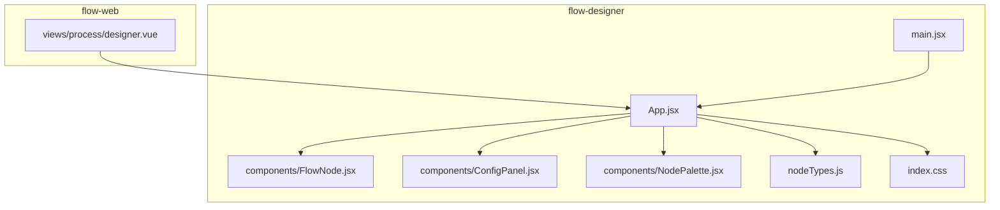

图表来源
- [App.jsx](file://flow-designer/src/App.jsx)
- [FlowNode.jsx](file://flow-designer/src/components/FlowNode.jsx)
- [ConfigPanel.jsx](file://flow-designer/src/components/ConfigPanel.jsx)
- [NodePalette.jsx](file://flow-designer/src/components/NodePalette.jsx)
- [nodeTypes.js](file://flow-designer/src/nodeTypes.js)
- [index.css](file://flow-designer/src/index.css)
- [main.jsx](file://flow-designer/src/main.jsx)
- [designer.vue](file://flow-web/src/views/process/designer.vue)

章节来源
- [App.jsx](file://flow-designer/src/App.jsx)
- [FlowNode.jsx](file://flow-designer/src/components/FlowNode.jsx)
- [ConfigPanel.jsx](file://flow-designer/src/components/ConfigPanel.jsx)
- [NodePalette.jsx](file://flow-designer/src/components/NodePalette.jsx)
- [nodeTypes.js](file://flow-designer/src/nodeTypes.js)
- [index.css](file://flow-designer/src/index.css)
- [main.jsx](file://flow-designer/src/main.jsx)
- [designer.vue](file://flow-web/src/views/process/designer.vue)

## 核心组件
- App.jsx：作为画布容器，集中管理全局交互状态（选中集合、拖拽状态、连线绘制状态、撤销重做栈等），分发事件到子组件。
- FlowNode.jsx：单个节点的交互封装，处理点击、双击、右键菜单、拖拽移动、端口连接等。
- ConfigPanel.jsx：右侧属性面板，根据选中节点类型动态渲染表单，支持校验与实时预览。
- NodePalette.jsx：左侧节点面板，承载拖拽生成新节点的能力。
- nodeTypes.js：节点类型定义与默认配置，驱动面板渲染与行为差异。
- index.css：画布样式、选中态、连线层、拖拽高亮等视觉反馈。
- designer.vue：在管理端嵌入流程设计器的入口页，负责生命周期与数据持久化。

章节来源
- [App.jsx](file://flow-designer/src/App.jsx)
- [FlowNode.jsx](file://flow-designer/src/components/FlowNode.jsx)
- [ConfigPanel.jsx](file://flow-designer/src/components/ConfigPanel.jsx)
- [NodePalette.jsx](file://flow-designer/src/components/NodePalette.jsx)
- [nodeTypes.js](file://flow-designer/src/nodeTypes.js)
- [index.css](file://flow-designer/src/index.css)
- [designer.vue](file://flow-web/src/views/process/designer.vue)

## 架构总览
交互事件从浏览器事件源进入，经画布容器统一调度，再分派至具体组件或状态机。关键路径包括：
- 鼠标事件：mousedown/mousemove/mouseup 组合用于拖拽、框选、连线绘制。
- 键盘事件：keydown 监听快捷键，触发选择、删除、撤销重做等。
- 手势事件：touchstart/touchmove/touchend 映射为拖拽与框选。
- 状态管理：选中集合、临时连线、历史栈、面板可见性。
- 渲染更新：React/Vue 驱动视图增量更新，CSS 控制动效与反馈。

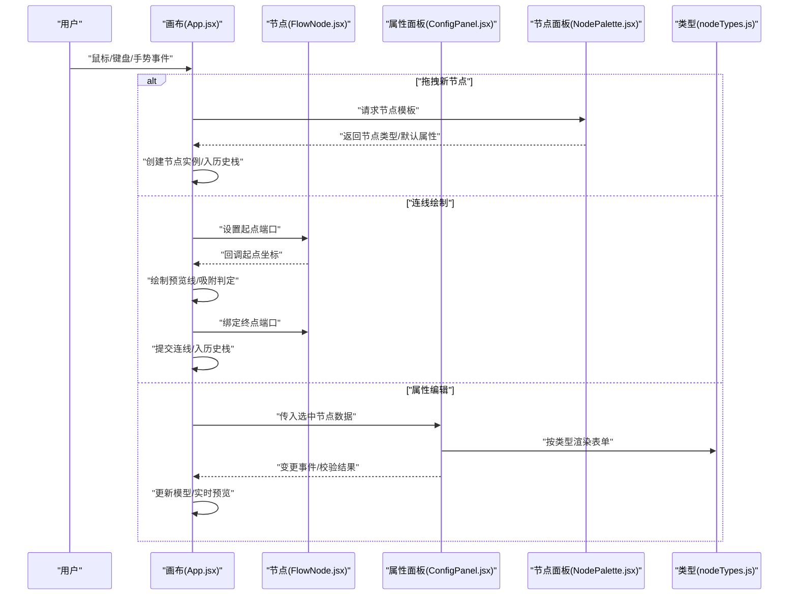

图表来源
- [App.jsx](file://flow-designer/src/App.jsx)
- [FlowNode.jsx](file://flow-designer/src/components/FlowNode.jsx)
- [ConfigPanel.jsx](file://flow-designer/src/components/ConfigPanel.jsx)
- [NodePalette.jsx](file://flow-designer/src/components/NodePalette.jsx)
- [nodeTypes.js](file://flow-designer/src/nodeTypes.js)

## 详细组件分析

### 鼠标事件处理（点击、双击、右键菜单）
- 单击选择：在画布区域捕获 mousedown，判断命中节点或空白区域，维护选中集合；支持 Shift/Ctrl 多选。
- 双击编辑：在节点上捕获 dblclick，打开属性面板并定位到对应字段。
- 右键菜单：在节点或画布空白处捕获 contextmenu，阻止默认菜单，展示自定义菜单项（复制、删除、对齐等）。
- 事件冒泡与穿透：通过 stopPropagation 避免父容器重复处理；对 SVG/Canvas 层进行命中测试。

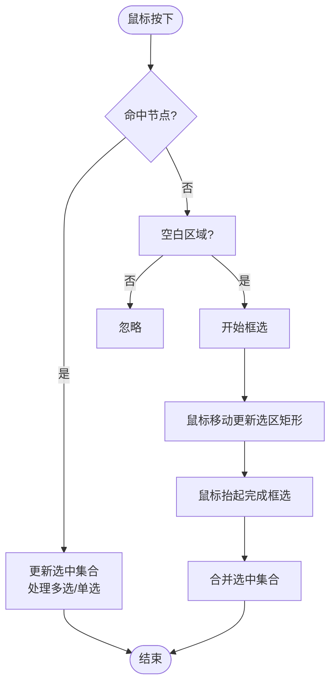

图表来源
- [App.jsx](file://flow-designer/src/App.jsx)
- [FlowNode.jsx](file://flow-designer/src/components/FlowNode.jsx)
- [index.css](file://flow-designer/src/index.css)

章节来源
- [App.jsx](file://flow-designer/src/App.jsx)
- [FlowNode.jsx](file://flow-designer/src/components/FlowNode.jsx)
- [index.css](file://flow-designer/src/index.css)

### 键盘快捷键绑定
- 常用键位：Delete/Backspace 删除选中；Ctrl/Cmd+Z 撤销；Ctrl/Cmd+Shift+Z 重做；Ctrl/Cmd+C/V 复制粘贴；A 全选；方向键微调位置。
- 防冲突：在输入框内禁用全局快捷键；在连线绘制时禁用部分键位。
- 焦点管理：确保画布获得焦点以接收键盘事件。

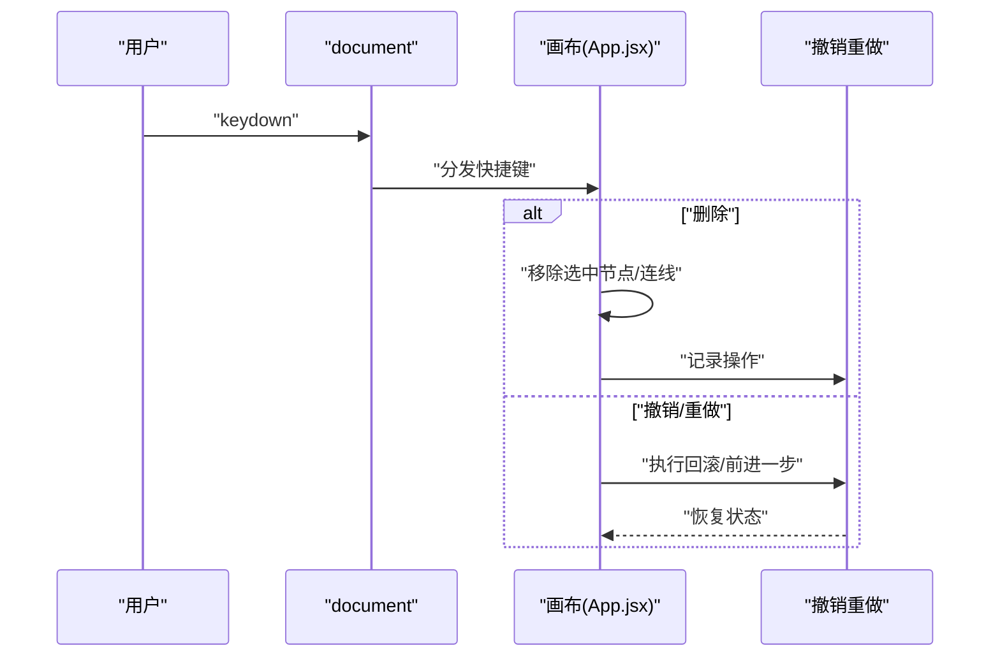

图表来源
- [App.jsx](file://flow-designer/src/App.jsx)

章节来源
- [App.jsx](file://flow-designer/src/App.jsx)

### 手势操作支持（移动端）
- 触摸事件：touchstart/touchmove/touchend 映射为拖拽、框选、连线绘制。
- 多点触控：区分单指拖拽与双指缩放/平移（如需要）。
- 滚动与长按：在画布容器阻止默认滚动，长按弹出上下文菜单。
- 命中测试优化：增大命中区域，提升移动端命中率。

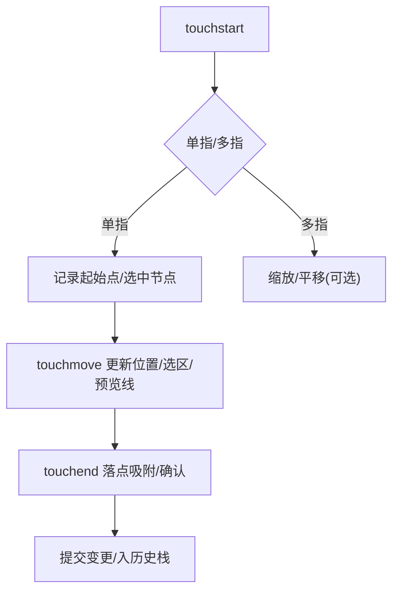

图表来源
- [App.jsx](file://flow-designer/src/App.jsx)
- [FlowNode.jsx](file://flow-designer/src/components/FlowNode.jsx)

章节来源
- [App.jsx](file://flow-designer/src/App.jsx)
- [FlowNode.jsx](file://flow-designer/src/components/FlowNode.jsx)

### 节点选择系统（单选、多选、框选、批量操作）
- 数据结构：使用 Set/Map 维护选中节点 ID 集合，保证去重与 O(1) 查询。
- 框选算法：计算矩形与节点包围盒的相交，合并到选中集合。
- 批量操作：批量删除、批量移动、批量对齐、批量复制。
- 视觉反馈：选中边框、锚点高亮、批量操作提示。

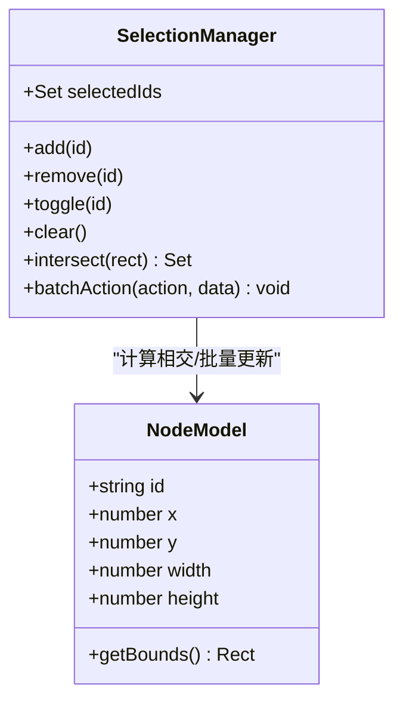

图表来源
- [App.jsx](file://flow-designer/src/App.jsx)
- [FlowNode.jsx](file://flow-designer/src/components/FlowNode.jsx)

章节来源
- [App.jsx](file://flow-designer/src/App.jsx)
- [FlowNode.jsx](file://flow-designer/src/components/FlowNode.jsx)

### 节点编辑模式（属性面板、表单验证、实时预览）
- 动态渲染：根据 nodeTypes.js 的类型定义，动态生成表单字段与布局。
- 双向绑定：表单变更即时同步到选中节点模型，触发预览更新。
- 表单验证：必填、格式、范围校验，错误提示与阻止提交。
- 实时预览：边改边渲染，减少切换成本。

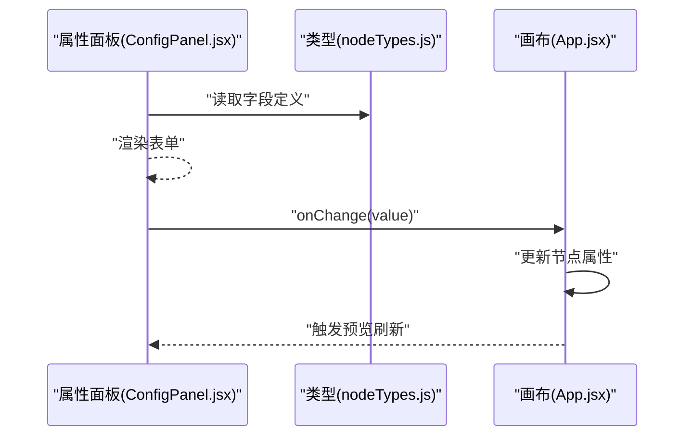

图表来源
- [ConfigPanel.jsx](file://flow-designer/src/components/ConfigPanel.jsx)
- [nodeTypes.js](file://flow-designer/src/nodeTypes.js)
- [App.jsx](file://flow-designer/src/App.jsx)

章节来源
- [ConfigPanel.jsx](file://flow-designer/src/components/ConfigPanel.jsx)
- [nodeTypes.js](file://flow-designer/src/nodeTypes.js)
- [App.jsx](file://flow-designer/src/App.jsx)

### 连线绘制交互（起点选择、路径预览、终点吸附）
- 起点选择：在节点端口上 mousedown 启动连线绘制，记录起点坐标与类型。
- 路径预览：mousemove 实时更新贝塞尔曲线或折线预览。
- 终点吸附：mouseup 时计算最近有效端口，若满足规则则吸附并创建连线。
- 合法性校验：禁止自环、重复连线、非法类型组合。

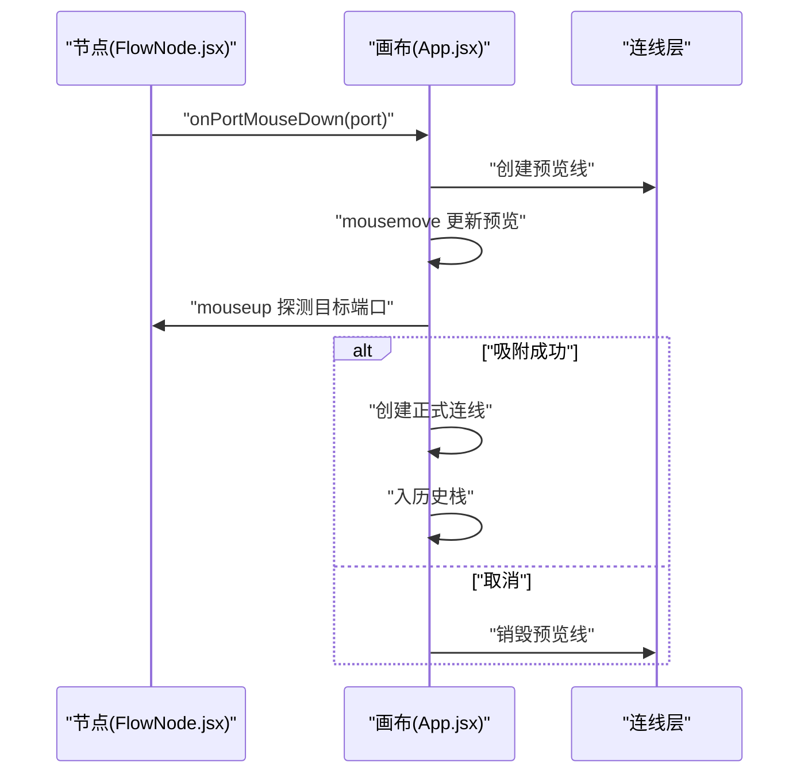

图表来源
- [FlowNode.jsx](file://flow-designer/src/components/FlowNode.jsx)
- [App.jsx](file://flow-designer/src/App.jsx)

章节来源
- [FlowNode.jsx](file://flow-designer/src/components/FlowNode.jsx)
- [App.jsx](file://flow-designer/src/App.jsx)

### 撤销重做机制（历史栈、状态快照、批量合并）
- 操作单元：将增删改视为原子操作，包含前后状态快照或差异补丁。
- 栈管理：维护 undoStack 与 redoStack，限制最大长度，防止内存泄漏。
- 批量合并：同一批次内的多次变更合并为一个操作，减少栈深度。
- 执行策略：撤销时恢复快照或反向应用补丁；重做时正向应用。

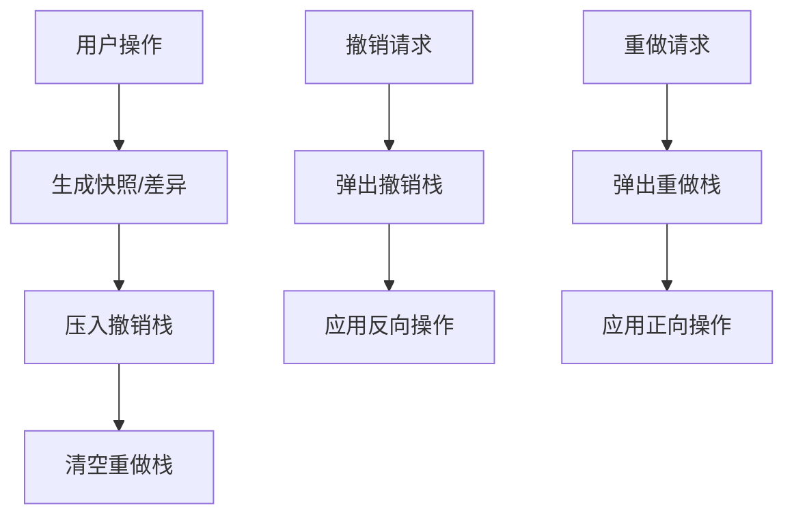

图表来源
- [App.jsx](file://flow-designer/src/App.jsx)

章节来源
- [App.jsx](file://flow-designer/src/App.jsx)

### 拖拽排序功能（目标检测、插入位置计算、动画过渡）
- 目标检测：dragover/dragenter 计算插入位置（前/后/替换）。
- 插入计算：根据 Y 轴坐标与节点高度决定插入索引。
- 动画过渡：使用 CSS transition 或 requestAnimationFrame 平滑移动。
- 数据一致性：更新顺序后同步到模型，并记录操作以便撤销。

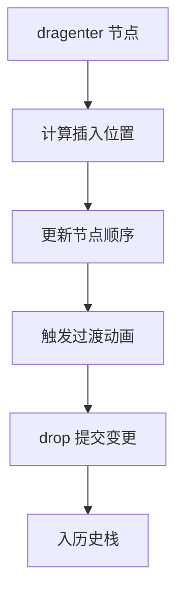

图表来源
- [FlowNode.jsx](file://flow-designer/src/components/FlowNode.jsx)
- [App.jsx](file://flow-designer/src/App.jsx)

章节来源
- [FlowNode.jsx](file://flow-designer/src/components/FlowNode.jsx)
- [App.jsx](file://flow-designer/src/App.jsx)

### 响应式设计与移动端适配
- 画布自适应：容器宽高随视口变化，重算节点布局与连线。
- 触控优化：增大点击区域、简化菜单、提供滑动导航。
- 字体与间距：使用相对单位，适配不同 DPI。
- 性能降级：在低端设备上关闭复杂动画与阴影。

章节来源
- [index.css](file://flow-designer/src/index.css)
- [App.jsx](file://flow-designer/src/App.jsx)

## 依赖关系分析
- 组件耦合：App.jsx 作为中枢，依赖 FlowNode、ConfigPanel、NodePalette 与 nodeTypes。
- 类型驱动：nodeTypes.js 决定面板渲染与行为分支。
- 样式依赖：index.css 提供选中、连线、拖拽等视觉状态。
- 入口集成：designer.vue 引入 App.jsx 作为子模块。

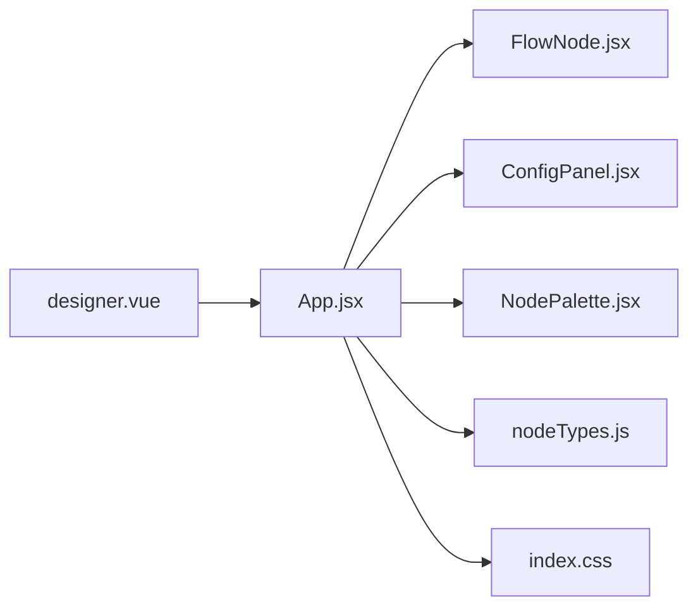

图表来源
- [designer.vue](file://flow-web/src/views/process/designer.vue)
- [App.jsx](file://flow-designer/src/App.jsx)
- [FlowNode.jsx](file://flow-designer/src/components/FlowNode.jsx)
- [ConfigPanel.jsx](file://flow-designer/src/components/ConfigPanel.jsx)
- [NodePalette.jsx](file://flow-designer/src/components/NodePalette.jsx)
- [nodeTypes.js](file://flow-designer/src/nodeTypes.js)
- [index.css](file://flow-designer/src/index.css)

章节来源
- [designer.vue](file://flow-web/src/views/process/designer.vue)
- [App.jsx](file://flow-designer/src/App.jsx)
- [FlowNode.jsx](file://flow-designer/src/components/FlowNode.jsx)
- [ConfigPanel.jsx](file://flow-designer/src/components/ConfigPanel.jsx)
- [NodePalette.jsx](file://flow-designer/src/components/NodePalette.jsx)
- [nodeTypes.js](file://flow-designer/src/nodeTypes.js)
- [index.css](file://flow-designer/src/index.css)

## 性能考量
- 事件节流/防抖：mousemove/touchmove 高频事件需节流，避免频繁重绘。
- 命中测试优化：使用空间索引或四叉树加速框选与吸附。
- 渲染批处理：批量更新节点位置与连线，减少重排。
- 内存管理：限制历史栈大小，及时释放预览线与临时对象。
- 移动端降采样：降低预览线精度与动画帧率。

[本节为通用指导，不直接分析具体文件]

## 故障排查指南
- 事件未触发：检查画布是否获得焦点、是否被其他元素遮挡、是否阻止了默认行为。
- 多选失效：确认 Shift/Ctrl 键状态与事件修饰符绑定是否正确。
- 连线无法吸附：检查端口坐标计算、命中阈值与连线规则。
- 面板不更新：确认表单 onChange 是否调用、选中节点是否同步。
- 撤销异常：核对快照生成时机与操作合并策略。

章节来源
- [App.jsx](file://flow-designer/src/App.jsx)
- [FlowNode.jsx](file://flow-designer/src/components/FlowNode.jsx)
- [ConfigPanel.jsx](file://flow-designer/src/components/ConfigPanel.jsx)

## 结论
通过对鼠标、键盘与手势的统一事件抽象，结合状态管理与撤销重做机制，流程设计器实现了稳定且可扩展的交互体验。节点选择、连线绘制、属性编辑与拖拽排序等核心能力均以组件化方式组织，便于后续迭代与跨平台适配。建议在高频事件与大数据量场景下进一步优化命中测试与渲染批处理，以提升整体流畅度。

[本节为总结性内容，不直接分析具体文件]

## 附录
- 术语说明：
  - 端口：节点上的连接点，用于建立连线。
  - 快照：某一时刻的完整模型状态，用于撤销重做。
  - 命中测试：判断鼠标/触摸位置是否落在目标区域内。
- 参考入口：
  - 设计器页面入口：[designer.vue](file://flow-web/src/views/process/designer.vue)
  - 画布主逻辑：[App.jsx](file://flow-designer/src/App.jsx)
  - 节点交互：[FlowNode.jsx](file://flow-designer/src/components/FlowNode.jsx)
  - 属性面板：[ConfigPanel.jsx](file://flow-designer/src/components/ConfigPanel.jsx)
  - 节点面板：[NodePalette.jsx](file://flow-designer/src/components/NodePalette.jsx)
  - 类型定义：[nodeTypes.js](file://flow-designer/src/nodeTypes.js)
  - 样式资源：[index.css](file://flow-designer/src/index.css)
  - 应用入口：[main.jsx](file://flow-designer/src/main.jsx)