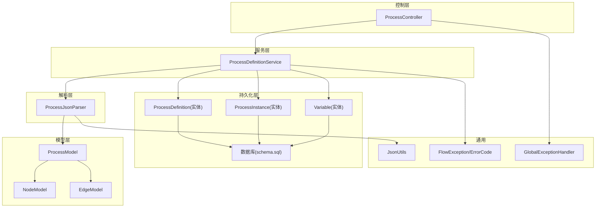
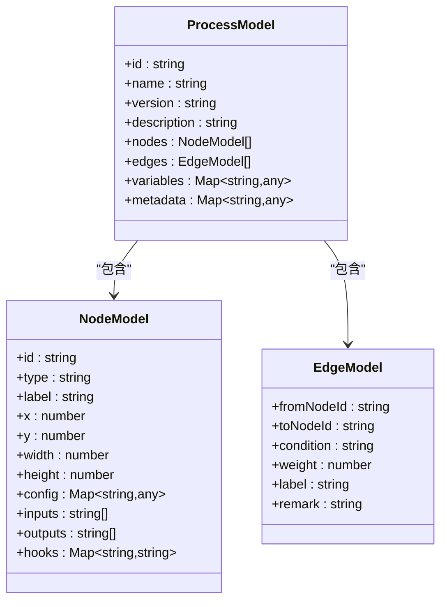
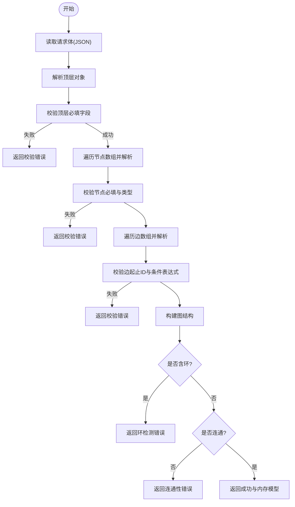
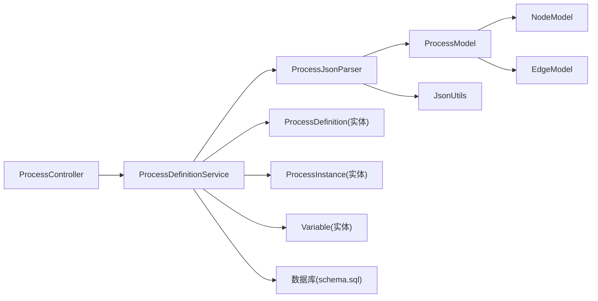

# 数据结构与序列化

<cite>
**本文引用的文件**
- [ProcessModel.java](file://flow-engine/src/main/java/com/flow/engine/model/ProcessModel.java)
- [NodeModel.java](file://flow-engine/src/main/java/com/flow/engine/model/NodeModel.java)
- [EdgeModel.java](file://flow-engine/src/main/java/com/flow/engine/model/EdgeModel.java)
- [ProcessJsonParser.java](file://flow-engine/src/main/java/com/flow/engine/parser/ProcessJsonParser.java)
- [ProcessDefinitionService.java](file://flow-engine/src/main/java/com/flow/engine/service/ProcessDefinitionService.java)
- [ProcessDefinitionController.java](file://flow-engine/src/main/java/com/flow/engine/controller/ProcessController.java)
- [ProcessDefinitionImportRequest.java](file://flow-engine/src/main/java/com/flow/engine/dto/ProcessDefinitionImportRequest.java)
- [ProcessDefinitionResponse.java](file://flow-engine/src/main/java/com/flow/engine/dto/ProcessDefinitionResponse.java)
- [ProcessDefinitionCreateRequest.java](file://flow-engine/src/main/java/com/flow/engine/dto/ProcessDefinitionCreateRequest.java)
- [ProcessDefinitionUpdateRequest.java](file://flow-engine/src/main/java/com/flow/engine/dto/ProcessDefinitionUpdateRequest.java)
- [ProcessDefinition.java](file://flow-engine/src/main/java/com/flow/engine/entity/ProcessDefinition.java)
- [ProcessInstance.java](file://flow-engine/src/main/java/com/flow/engine/entity/ProcessInstance.java)
- [Variable.java](file://flow-engine/src/main/java/com/flow/engine/entity/Variable.java)
- [JsonUtils.java](file://flow-engine/src/main/java/com/flow/engine/common/utils/JsonUtils.java)
- [FlowException.java](file://flow-engine/src/main/java/com/flow/engine/common/exception/FlowException.java)
- [ErrorCode.java](file://flow-engine/src/main/java/com/flow/engine/common/ErrorCode.java)
- [GlobalExceptionHandler.java](file://flow-engine/src/main/java/com/flow/engine/common/GlobalExceptionHandler.java)
- [schema.sql](file://flow-engine/src/main/resources/db/schema.sql)
- [application.yml](file://flow-engine/src/main/resources/application.yml)
</cite>

## 目录
1. [简介](#简介)
2. [项目结构](#项目结构)
3. [核心组件](#核心组件)
4. [架构总览](#架构总览)
5. [详细组件分析](#详细组件分析)
6. [依赖关系分析](#依赖关系分析)
7. [性能考虑](#性能考虑)
8. [故障排查指南](#故障排查指南)
9. [结论](#结论)
10. [附录](#附录)

## 简介
本文件聚焦于流程图的“数据结构与序列化”主题，围绕流程图的数据模型设计、JSON 格式规范、数据验证机制、导入导出能力、版本兼容策略以及持久化方案进行系统化说明。目标读者包括前端设计师、后端开发者与运维人员，力求在保持技术深度的同时提供可操作的实践指导。

## 项目结构
与“数据结构与序列化”直接相关的代码主要位于后端模块 flow-engine 中：
- 数据模型层：model 包下的 ProcessModel、NodeModel、EdgeModel 定义了流程图的核心对象结构。
- 解析与校验层：parser 包下的 ProcessJsonParser 负责 JSON 到内存模型的转换与校验。
- 服务与控制器层：service 与 controller 包提供导入导出、定义管理、实例运行等能力。
- 实体与存储层：entity 包与 resources/db/schema.sql 定义持久化结构与数据库映射。
- 工具与异常：common 包提供 JSON 工具、统一异常与错误码。



图表来源
- [ProcessModel.java](file://flow-engine/src/main/java/com/flow/engine/model/ProcessModel.java)
- [NodeModel.java](file://flow-engine/src/main/java/com/flow/engine/model/NodeModel.java)
- [EdgeModel.java](file://flow-engine/src/main/java/com/flow/engine/model/EdgeModel.java)
- [ProcessJsonParser.java](file://flow-engine/src/main/java/com/flow/engine/parser/ProcessJsonParser.java)
- [ProcessDefinitionService.java](file://flow-engine/src/main/java/com/flow/engine/service/ProcessDefinitionService.java)
- [ProcessController.java](file://flow-engine/src/main/java/com/flow/engine/controller/ProcessController.java)
- [ProcessDefinition.java](file://flow-engine/src/main/java/com/flow/engine/entity/ProcessDefinition.java)
- [ProcessInstance.java](file://flow-engine/src/main/java/com/flow/engine/entity/ProcessInstance.java)
- [Variable.java](file://flow-engine/src/main/java/com/flow/engine/entity/Variable.java)
- [JsonUtils.java](file://flow-engine/src/main/java/com/flow/engine/common/utils/JsonUtils.java)
- [FlowException.java](file://flow-engine/src/main/java/com/flow/engine/common/exception/FlowException.java)
- [ErrorCode.java](file://flow-engine/src/main/java/com/flow/engine/common/ErrorCode.java)
- [GlobalExceptionHandler.java](file://flow-engine/src/main/java/com/flow/engine/common/GlobalExceptionHandler.java)
- [schema.sql](file://flow-engine/src/main/resources/db/schema.sql)

章节来源
- [ProcessModel.java](file://flow-engine/src/main/java/com/flow/engine/model/ProcessModel.java)
- [NodeModel.java](file://flow-engine/src/main/java/com/flow/engine/model/NodeModel.java)
- [EdgeModel.java](file://flow-engine/src/main/java/com/flow/engine/model/EdgeModel.java)
- [ProcessJsonParser.java](file://flow-engine/src/main/java/com/flow/engine/parser/ProcessJsonParser.java)
- [ProcessDefinitionService.java](file://flow-engine/src/main/java/com/flow/engine/service/ProcessDefinitionService.java)
- [ProcessController.java](file://flow-engine/src/main/java/com/flow/engine/controller/ProcessController.java)
- [ProcessDefinition.java](file://flow-engine/src/main/java/com/flow/engine/entity/ProcessDefinition.java)
- [ProcessInstance.java](file://flow-engine/src/main/java/com/flow/engine/entity/ProcessInstance.java)
- [Variable.java](file://flow-engine/src/main/java/com/flow/engine/entity/Variable.java)
- [JsonUtils.java](file://flow-engine/src/main/java/com/flow/engine/common/utils/JsonUtils.java)
- [FlowException.java](file://flow-engine/src/main/java/com/flow/engine/common/exception/FlowException.java)
- [ErrorCode.java](file://flow-engine/src/main/java/com/flow/engine/common/ErrorCode.java)
- [GlobalExceptionHandler.java](file://flow-engine/src/main/java/com/flow/engine/common/GlobalExceptionHandler.java)
- [schema.sql](file://flow-engine/src/main/resources/db/schema.sql)

## 核心组件
本节从“节点对象结构、连线关系定义、流程元数据存储”三个维度展开，并给出 JSON 字段约定与校验规则。

- 节点对象结构（NodeModel）
  - 标识与类型：包含唯一标识、显示名称、节点类型等基础属性。
  - 布局与样式：包含画布坐标、尺寸、颜色等可视化相关字段。
  - 业务配置：以扩展字段形式承载各节点类型的自定义参数。
  - 变量绑定：支持输入/输出变量的声明与映射。
  - 事件钩子：用于触发前置/后置逻辑的回调或脚本入口。

- 连线关系定义（EdgeModel）
  - 端点信息：起点节点 ID、终点节点 ID。
  - 条件表达式：用于排他网关或条件分支的判定表达式。
  - 权重与路由：在多出口场景下决定选择概率或优先级。
  - 标签与备注：便于可视化标注与审计追踪。

- 流程元数据存储（ProcessModel）
  - 流程基本信息：ID、名称、版本、描述、状态等。
  - 节点集合与边集合：维护完整的图拓扑。
  - 全局变量与上下文：流程级变量定义与默认值。
  - 扩展元数据：国际化、权限、表单关联等附加信息。

- JSON 格式规范（由解析器驱动）
  - 顶层对象：包含流程元信息与节点、边数组。
  - 节点数组：每个节点遵循 NodeModel 约定的键名与类型。
  - 边数组：每条边遵循 EdgeModel 约定的键名与类型。
  - 扩展字段：以特定前缀或命名空间隔离，避免与核心字段冲突。

- 数据验证机制
  - 必填字段检查：如节点 ID、类型、边起止 ID 等。
  - 类型验证：字符串、数值、布尔、枚举等类型约束。
  - 业务规则校验：无环图、连通性、条件表达式语法、变量引用合法性等。
  - 错误聚合：将多条校验失败信息汇总返回，便于前端提示。

章节来源
- [NodeModel.java](file://flow-engine/src/main/java/com/flow/engine/model/NodeModel.java)
- [EdgeModel.java](file://flow-engine/src/main/java/com/flow/engine/model/EdgeModel.java)
- [ProcessModel.java](file://flow-engine/src/main/java/com/flow/engine/model/ProcessModel.java)
- [ProcessJsonParser.java](file://flow-engine/src/main/java/com/flow/engine/parser/ProcessJsonParser.java)

## 架构总览
下图展示了从前端上传 JSON 到后端解析、校验、持久化的完整链路，以及运行时实例与变量的关系。

```mermaid
sequenceDiagram
participant FE as "前端/客户端"
participant API as "ProcessController"
participant SVC as "ProcessDefinitionService"
participant PAR as "ProcessJsonParser"
participant MOD as "模型(ProcessModel/NodeModel/EdgeModel)"
participant ENT as "实体(ProcessDefinition/ProcessInstance/Variable)"
participant DB as "数据库"
FE->>API : "POST /process/definition/import"
API->>SVC : "importDefinition(request)"
SVC->>PAR : "parseAndValidate(json)"
PAR->>MOD : "构建内存模型"
PAR-->>SVC : "返回校验结果与模型"
SVC->>ENT : "保存定义/更新版本"
ENT->>DB : "写入流程定义表"
SVC-->>API : "返回成功响应"
API-->>FE : "导入成功"
Note over FE,DB : "导入成功后，可通过启动接口创建实例<br/>实例与变量通过实体与数据库持久化"
```

图表来源
- [ProcessController.java](file://flow-engine/src/main/java/com/flow/engine/controller/ProcessController.java)
- [ProcessDefinitionService.java](file://flow-engine/src/main/java/com/flow/engine/service/ProcessDefinitionService.java)
- [ProcessJsonParser.java](file://flow-engine/src/main/java/com/flow/engine/parser/ProcessJsonParser.java)
- [ProcessModel.java](file://flow-engine/src/main/java/com/flow/engine/model/ProcessModel.java)
- [NodeModel.java](file://flow-engine/src/main/java/com/flow/engine/model/NodeModel.java)
- [EdgeModel.java](file://flow-engine/src/main/java/com/flow/engine/model/EdgeModel.java)
- [ProcessDefinition.java](file://flow-engine/src/main/java/com/flow/engine/entity/ProcessDefinition.java)
- [ProcessInstance.java](file://flow-engine/src/main/java/com/flow/engine/entity/ProcessInstance.java)
- [Variable.java](file://flow-engine/src/main/java/com/flow/engine/entity/Variable.java)
- [schema.sql](file://flow-engine/src/main/resources/db/schema.sql)

## 详细组件分析

### 数据模型类图


图表来源
- [ProcessModel.java](file://flow-engine/src/main/java/com/flow/engine/model/ProcessModel.java)
- [NodeModel.java](file://flow-engine/src/main/java/com/flow/engine/model/NodeModel.java)
- [EdgeModel.java](file://flow-engine/src/main/java/com/flow/engine/model/EdgeModel.java)

章节来源
- [ProcessModel.java](file://flow-engine/src/main/java/com/flow/engine/model/ProcessModel.java)
- [NodeModel.java](file://flow-engine/src/main/java/com/flow/engine/model/NodeModel.java)
- [EdgeModel.java](file://flow-engine/src/main/java/com/flow/engine/model/EdgeModel.java)

### 解析与校验流程


图表来源
- [ProcessJsonParser.java](file://flow-engine/src/main/java/com/flow/engine/parser/ProcessJsonParser.java)
- [ProcessModel.java](file://flow-engine/src/main/java/com/flow/engine/model/ProcessModel.java)
- [NodeModel.java](file://flow-engine/src/main/java/com/flow/engine/model/NodeModel.java)
- [EdgeModel.java](file://flow-engine/src/main/java/com/flow/engine/model/EdgeModel.java)

章节来源
- [ProcessJsonParser.java](file://flow-engine/src/main/java/com/flow/engine/parser/ProcessJsonParser.java)

### 导入导出与版本兼容
- 导入流程
  - 控制器接收导入请求，调用服务层进行解析与校验。
  - 服务层将内存模型转换为实体并持久化，记录版本信息。
  - 返回统一的导入结果，包含成功/失败详情。

- 导出流程
  - 根据定义 ID 查询实体，反序列化为内存模型。
  - 转换为 JSON 响应，供前端下载或预览。

- 版本兼容策略
  - 版本号字段参与持久化，支持向后兼容与升级迁移。
  - 解析器对未知字段采用宽容模式，保留扩展字段。
  - 升级时优先保证旧版 JSON 能正常解析，再逐步引入新字段。

章节来源
- [ProcessController.java](file://flow-engine/src/main/java/com/flow/engine/controller/ProcessController.java)
- [ProcessDefinitionService.java](file://flow-engine/src/main/java/com/flow/engine/service/ProcessDefinitionService.java)
- [ProcessDefinitionImportRequest.java](file://flow-engine/src/main/java/com/flow/engine/dto/ProcessDefinitionImportRequest.java)
- [ProcessDefinitionResponse.java](file://flow-engine/src/main/java/com/flow/engine/dto/ProcessDefinitionResponse.java)
- [ProcessDefinitionCreateRequest.java](file://flow-engine/src/main/java/com/flow/engine/dto/ProcessDefinitionCreateRequest.java)
- [ProcessDefinitionUpdateRequest.java](file://flow-engine/src/main/java/com/flow/engine/dto/ProcessDefinitionUpdateRequest.java)
- [ProcessDefinition.java](file://flow-engine/src/main/java/com/flow/engine/entity/ProcessDefinition.java)

### 数据持久化与同步
- 本地存储
  - 使用 MyBatis Plus 与 schema.sql 定义的表结构进行持久化。
  - 流程定义、实例、变量分别落库，确保事务一致性。

- 云端同步
  - 通过服务层抽象，可在不同环境间导出/导入 JSON 实现跨环境同步。
  - 结合版本字段与时间戳，避免覆盖最新变更。

- 冲突解决
  - 基于版本号乐观锁策略，冲突时提示用户合并或重新导入。
  - 提供差异对比接口（可扩展），辅助人工决策。

章节来源
- [ProcessDefinitionService.java](file://flow-engine/src/main/java/com/flow/engine/service/ProcessDefinitionService.java)
- [ProcessDefinition.java](file://flow-engine/src/main/java/com/flow/engine/entity/ProcessDefinition.java)
- [ProcessInstance.java](file://flow-engine/src/main/java/com/flow/engine/entity/ProcessInstance.java)
- [Variable.java](file://flow-engine/src/main/java/com/flow/engine/entity/Variable.java)
- [schema.sql](file://flow-engine/src/main/resources/db/schema.sql)

### 数据完整性检查与错误恢复
- 完整性检查
  - 节点 ID 唯一性与存在性校验。
  - 边起止节点必须存在于节点集合中。
  - 条件表达式语法校验与变量引用合法性检查。
  - 图无环与连通性检查。

- 错误恢复
  - 解析失败时返回结构化错误列表，便于前端定位问题。
  - 持久化失败时回滚事务，保证数据一致性。
  - 提供重试与幂等导入策略，避免重复导入导致数据不一致。

章节来源
- [ProcessJsonParser.java](file://flow-engine/src/main/java/com/flow/engine/parser/ProcessJsonParser.java)
- [FlowException.java](file://flow-engine/src/main/java/com/flow/engine/common/exception/FlowException.java)
- [ErrorCode.java](file://flow-engine/src/main/java/com/flow/engine/common/ErrorCode.java)
- [GlobalExceptionHandler.java](file://flow-engine/src/main/java/com/flow/engine/common/GlobalExceptionHandler.java)

## 依赖关系分析
- 组件耦合
  - 控制器依赖服务层，服务层依赖解析器与实体层。
  - 解析器仅依赖模型与 JSON 工具，保持低耦合。
- 外部依赖
  - JSON 序列化/反序列化通过 JsonUtils 统一管理。
  - 数据库访问通过 MyBatis Plus 与 schema.sql 定义。
- 潜在循环依赖
  - 当前分层清晰，未发现循环依赖迹象。



图表来源
- [ProcessController.java](file://flow-engine/src/main/java/com/flow/engine/controller/ProcessController.java)
- [ProcessDefinitionService.java](file://flow-engine/src/main/java/com/flow/engine/service/ProcessDefinitionService.java)
- [ProcessJsonParser.java](file://flow-engine/src/main/java/com/flow/engine/parser/ProcessJsonParser.java)
- [ProcessModel.java](file://flow-engine/src/main/java/com/flow/engine/model/ProcessModel.java)
- [NodeModel.java](file://flow-engine/src/main/java/com/flow/engine/model/NodeModel.java)
- [EdgeModel.java](file://flow-engine/src/main/java/com/flow/engine/model/EdgeModel.java)
- [ProcessDefinition.java](file://flow-engine/src/main/java/com/flow/engine/entity/ProcessDefinition.java)
- [ProcessInstance.java](file://flow-engine/src/main/java/com/flow/engine/entity/ProcessInstance.java)
- [Variable.java](file://flow-engine/src/main/java/com/flow/engine/entity/Variable.java)
- [JsonUtils.java](file://flow-engine/src/main/java/com/flow/engine/common/utils/JsonUtils.java)
- [schema.sql](file://flow-engine/src/main/resources/db/schema.sql)

章节来源
- [ProcessController.java](file://flow-engine/src/main/java/com/flow/engine/controller/ProcessController.java)
- [ProcessDefinitionService.java](file://flow-engine/src/main/java/com/flow/engine/service/ProcessDefinitionService.java)
- [ProcessJsonParser.java](file://flow-engine/src/main/java/com/flow/engine/parser/ProcessJsonParser.java)
- [ProcessModel.java](file://flow-engine/src/main/java/com/flow/engine/model/ProcessModel.java)
- [NodeModel.java](file://flow-engine/src/main/java/com/flow/engine/model/NodeModel.java)
- [EdgeModel.java](file://flow-engine/src/main/java/com/flow/engine/model/EdgeModel.java)
- [ProcessDefinition.java](file://flow-engine/src/main/java/com/flow/engine/entity/ProcessDefinition.java)
- [ProcessInstance.java](file://flow-engine/src/main/java/com/flow/engine/entity/ProcessInstance.java)
- [Variable.java](file://flow-engine/src/main/java/com/flow/engine/entity/Variable.java)
- [JsonUtils.java](file://flow-engine/src/main/java/com/flow/engine/common/utils/JsonUtils.java)
- [schema.sql](file://flow-engine/src/main/resources/db/schema.sql)

## 性能考虑
- 解析性能
  - 大流程建议分批解析与校验，避免单次处理过大对象。
  - 条件表达式预编译与缓存可减少运行时开销。
- 存储性能
  - 为常用查询字段建立索引（如流程 ID、版本号）。
  - 历史版本归档与冷热分离提升查询效率。
- 网络传输
  - 压缩 JSON 响应体，减少带宽占用。
  - 分页与增量导出适用于大型流程集。

[本节为通用性能建议，不直接分析具体文件]

## 故障排查指南
- 常见错误
  - JSON 解析失败：检查字段名拼写与数据类型是否符合规范。
  - 校验失败：查看返回的错误列表，逐项修复必填项与业务规则。
  - 导入冲突：确认版本号与时间戳，必要时先拉取最新版本再合并。
- 日志与调试
  - 开启应用日志，关注解析与服务层的异常堆栈。
  - 使用全局异常处理器返回的统一错误码快速定位问题。
- 恢复策略
  - 使用最近一次成功的导入快照进行回滚。
  - 对关键流程启用备份与定期导出，降低数据丢失风险。

章节来源
- [FlowException.java](file://flow-engine/src/main/java/com/flow/engine/common/exception/FlowException.java)
- [ErrorCode.java](file://flow-engine/src/main/java/com/flow/engine/common/ErrorCode.java)
- [GlobalExceptionHandler.java](file://flow-engine/src/main/java/com/flow/engine/common/GlobalExceptionHandler.java)
- [application.yml](file://flow-engine/src/main/resources/application.yml)

## 结论
通过对流程图数据模型、JSON 规范、解析校验、导入导出、版本兼容与持久化的系统梳理，可以构建出稳定、可扩展且易于维护的流程设计与运行体系。建议在后续迭代中持续完善条件表达式引擎、变量作用域管理与多租户隔离，进一步提升系统的健壮性与易用性。

[本节为总结性内容，不直接分析具体文件]

## 附录
- 术语表
  - 流程定义：描述流程拓扑与配置的静态数据。
  - 流程实例：根据流程定义创建的动态执行过程。
  - 变量：流程级或任务级的键值对数据载体。
- 参考文件
  - 模型定义：[ProcessModel.java](file://flow-engine/src/main/java/com/flow/engine/model/ProcessModel.java)、[NodeModel.java](file://flow-engine/src/main/java/com/flow/engine/model/NodeModel.java)、[EdgeModel.java](file://flow-engine/src/main/java/com/flow/engine/model/EdgeModel.java)
  - 解析与校验：[ProcessJsonParser.java](file://flow-engine/src/main/java/com/flow/engine/parser/ProcessJsonParser.java)
  - 服务与控制：[ProcessDefinitionService.java](file://flow-engine/src/main/java/com/flow/engine/service/ProcessDefinitionService.java)、[ProcessController.java](file://flow-engine/src/main/java/com/flow/engine/controller/ProcessController.java)
  - 实体与存储：[ProcessDefinition.java](file://flow-engine/src/main/java/com/flow/engine/entity/ProcessDefinition.java)、[ProcessInstance.java](file://flow-engine/src/main/java/com/flow/engine/entity/ProcessInstance.java)、[Variable.java](file://flow-engine/src/main/java/com/flow/engine/entity/Variable.java)、[schema.sql](file://flow-engine/src/main/resources/db/schema.sql)
  - 工具与异常：[JsonUtils.java](file://flow-engine/src/main/java/com/flow/engine/common/utils/JsonUtils.java)、[FlowException.java](file://flow-engine/src/main/java/com/flow/engine/common/exception/FlowException.java)、[ErrorCode.java](file://flow-engine/src/main/java/com/flow/engine/common/ErrorCode.java)、[GlobalExceptionHandler.java](file://flow-engine/src/main/java/com/flow/engine/common/GlobalExceptionHandler.java)