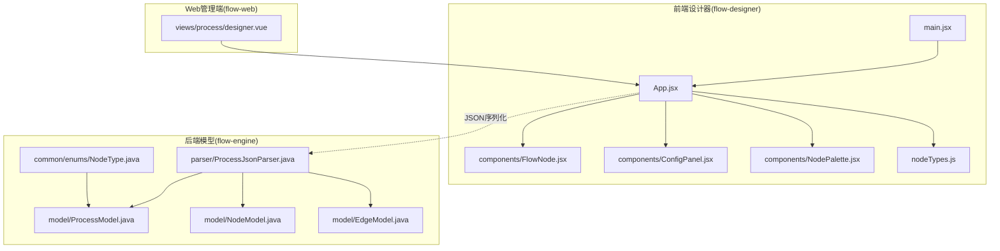
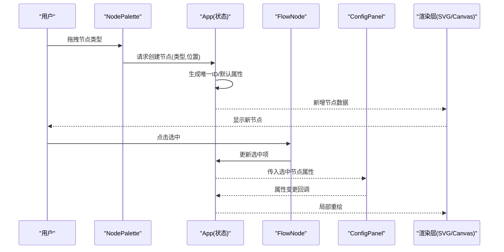
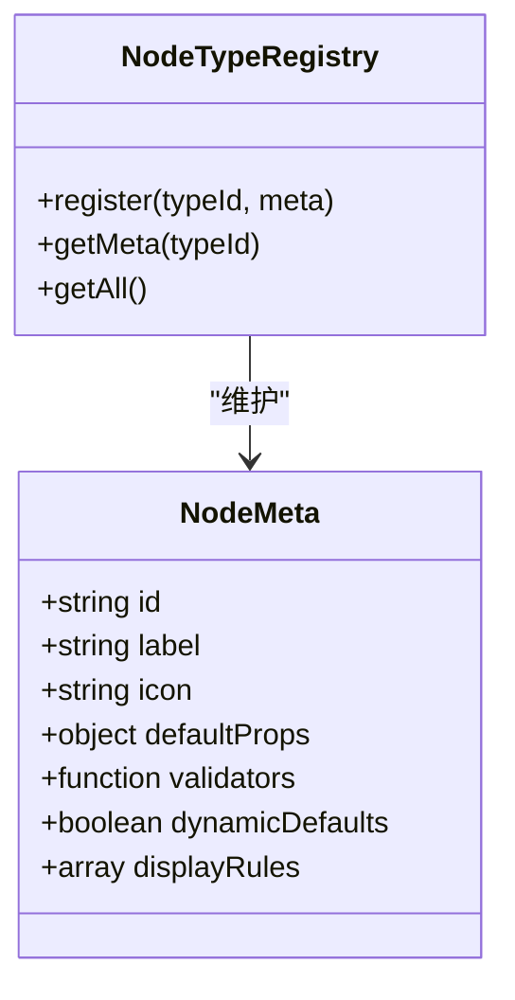
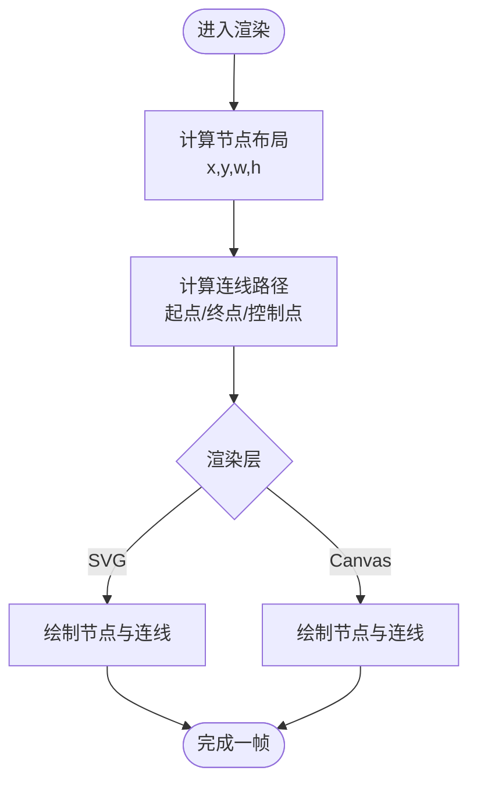
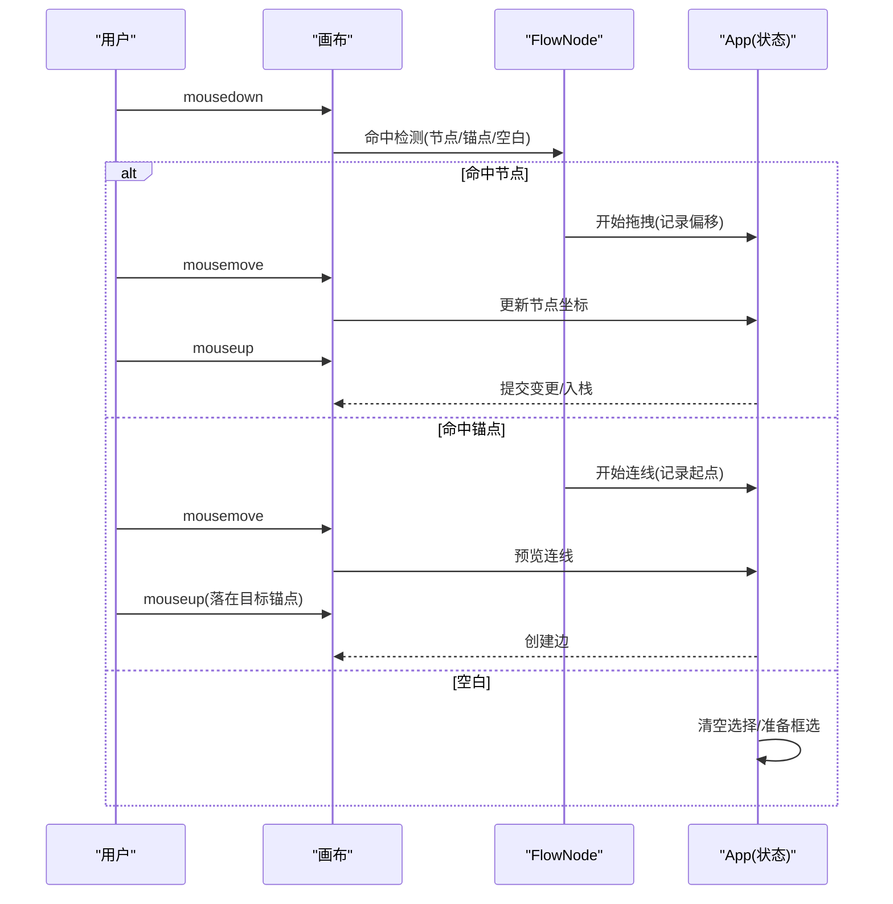
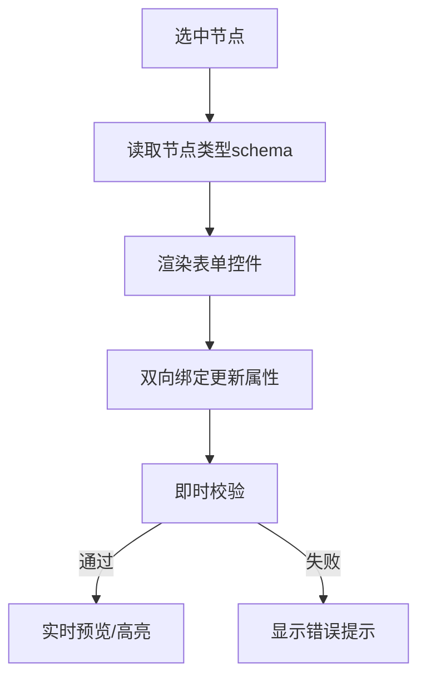
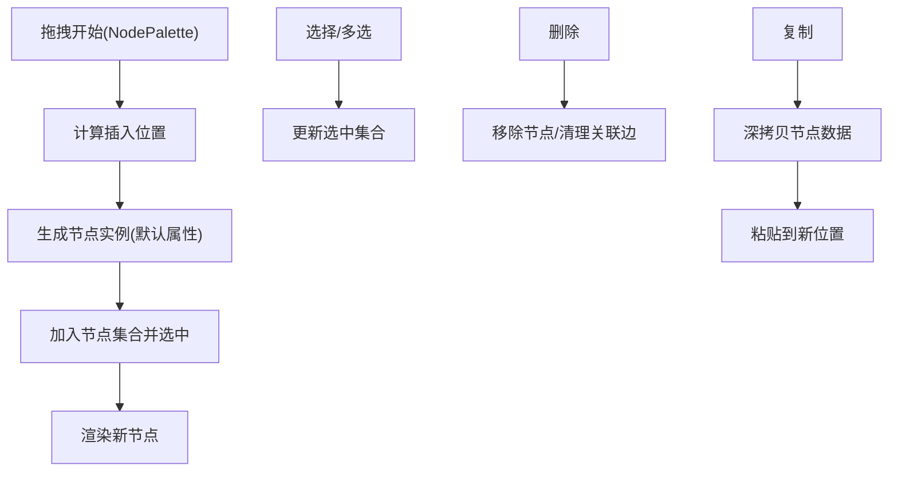
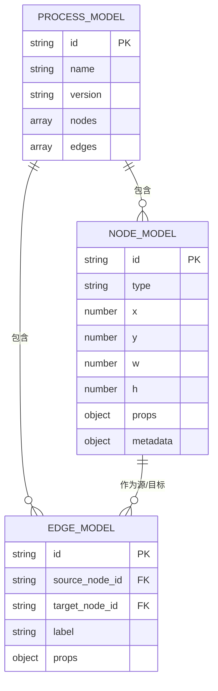
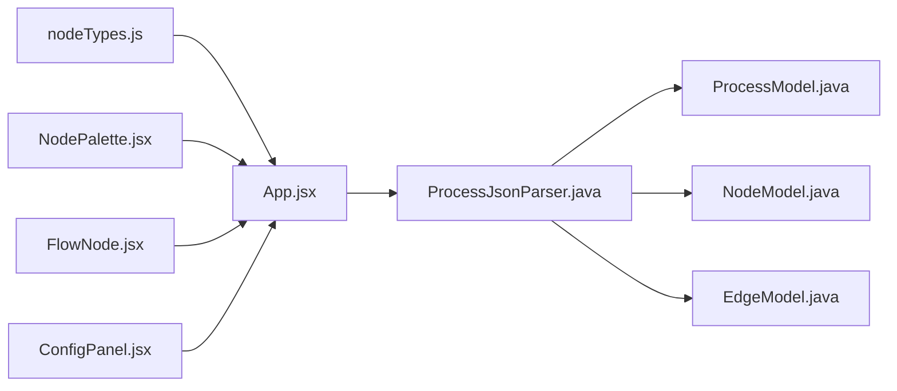

# 流程设计器核心

<cite>
**本文引用的文件**   
- [flow-designer/src/App.jsx](file://flow-designer/src/App.jsx)
- [flow-designer/src/main.jsx](file://flow-designer/src/main.jsx)
- [flow-designer/src/components/FlowNode.jsx](file://flow-designer/src/components/FlowNode.jsx)
- [flow-designer/src/components/ConfigPanel.jsx](file://flow-designer/src/components/ConfigPanel.jsx)
- [flow-designer/src/components/NodePalette.jsx](file://flow-designer/src/components/NodePalette.jsx)
- [flow-designer/src/nodeTypes.js](file://flow-designer/src/nodeTypes.js)
- [flow-engine/src/main/java/com/flow/engine/model/ProcessModel.java](file://flow-engine/src/main/java/com/flow/engine/model/ProcessModel.java)
- [flow-engine/src/main/java/com/flow/engine/model/NodeModel.java](file://flow-engine/src/main/java/com/flow/engine/model/NodeModel.java)
- [flow-engine/src/main/java/com/flow/engine/model/EdgeModel.java](file://flow-engine/src/main/java/com/flow/engine/model/EdgeModel.java)
- [flow-engine/src/main/java/com/flow/engine/parser/ProcessJsonParser.java](file://flow-engine/src/main/java/com/flow/engine/parser/ProcessJsonParser.java)
- [flow-engine/src/main/java/com/flow/engine/common/enums/NodeType.java](file://flow-engine/src/main/java/com/flow/engine/common/enums/NodeType.java)
- [flow-web/src/views/process/designer.vue](file://flow-web/src/views/process/designer.vue)
</cite>

## 更新摘要
**变更内容**   
- 节点配置系统增强：改进了属性面板的动态表单渲染和参数验证机制
- 参数处理优化：增强了节点属性的类型转换、默认值处理和校验规则
- 用户交互能力提升：优化了拖拽体验、键盘快捷键和响应式操作
- 性能优化：提升了画布渲染效率和内存管理

## 目录
1. [简介](#简介)
2. [项目结构](#项目结构)
3. [核心组件](#核心组件)
4. [架构总览](#架构总览)
5. [详细组件分析](#详细组件分析)
6. [依赖关系分析](#依赖关系分析)
7. [性能考虑](#性能考虑)
8. [故障排查指南](#故障排查指南)
9. [结论](#结论)
10. [附录](#附录)

## 简介
本文件聚焦于"可视化流程设计器"的核心实现，覆盖拖拽式节点编辑、连线绘制与属性配置面板等关键能力；阐述节点类型系统（内置类型定义与自定义扩展）、画布渲染引擎（SVG/Canvas绘图、节点定位算法与连线计算）、交互事件处理（鼠标、键盘、手势）以及节点操作（拖拽、选择、删除、复制）的实现细节；并给出流程图数据模型与前后端序列化机制的说明。文档面向不同技术背景的读者，提供从概念到代码级映射的分层解读。

**更新** 基于最新增强，重点介绍了改进的节点配置系统、优化的参数处理机制和增强的用户交互体验。

## 项目结构
前端设计器位于 flow-designer 模块，采用 React + Vite 组织；后端流程模型与解析位于 flow-engine 模块；Web 管理端在 flow-web 中集成设计器页面。

图表来源
- [flow-designer/src/main.jsx](file://flow-designer/src/main.jsx)
- [flow-designer/src/App.jsx](file://flow-designer/src/App.jsx)
- [flow-designer/src/components/FlowNode.jsx](file://flow-designer/src/components/FlowNode.jsx)
- [flow-designer/src/components/ConfigPanel.jsx](file://flow-designer/src/components/ConfigPanel.jsx)
- [flow-designer/src/components/NodePalette.jsx](file://flow-designer/src/components/NodePalette.jsx)
- [flow-designer/src/nodeTypes.js](file://flow-designer/src/nodeTypes.js)
- [flow-engine/src/main/java/com/flow/engine/model/ProcessModel.java](file://flow-engine/src/main/java/com/flow/engine/model/ProcessModel.java)
- [flow-engine/src/main/java/com/flow/engine/model/NodeModel.java](file://flow-engine/src/main/java/com/flow/engine/model/NodeModel.java)
- [flow-engine/src/main/java/com/flow/engine/model/EdgeModel.java](file://flow-engine/src/main/java/com/flow/engine/model/EdgeModel.java)
- [flow-engine/src/main/java/com/flow/engine/parser/ProcessJsonParser.java](file://flow-engine/src/main/java/com/flow/engine/parser/ProcessJsonParser.java)
- [flow-engine/src/main/java/com/flow/engine/common/enums/NodeType.java](file://flow-engine/src/main/java/com/flow/engine/common/enums/NodeType.java)
- [flow-web/src/views/process/designer.vue](file://flow-web/src/views/process/designer.vue)

章节来源
- [flow-designer/src/main.jsx](file://flow-designer/src/main.jsx)
- [flow-designer/src/App.jsx](file://flow-designer/src/App.jsx)
- [flow-engine/src/main/java/com/flow/engine/model/ProcessModel.java](file://flow-engine/src/main/java/com/flow/engine/model/ProcessModel.java)
- [flow-engine/src/main/java/com/flow/engine/model/NodeModel.java](file://flow-engine/src/main/java/com/flow/engine/model/NodeModel.java)
- [flow-engine/src/main/java/com/flow/engine/model/EdgeModel.java](file://flow-engine/src/main/java/com/flow/engine/model/EdgeModel.java)
- [flow-engine/src/main/java/com/flow/engine/parser/ProcessJsonParser.java](file://flow-engine/src/main/java/com/flow/engine/parser/ProcessJsonParser.java)
- [flow-engine/src/main/java/com/flow/engine/common/enums/NodeType.java](file://flow-engine/src/main/java/com/flow/engine/common/enums/NodeType.java)
- [flow-web/src/views/process/designer.vue](file://flow-web/src/views/process/designer.vue)

## 核心组件
- 应用容器 App：负责全局状态（节点集合、边集合、选中项、缩放/平移）、工具栏与快捷键、撤销重做栈、导入导出与保存。
- 节点 FlowNode：封装单个节点的渲染、锚点（连接点）暴露、选中态与拖拽行为。
- 属性面板 ConfigPanel：根据选中节点动态渲染表单字段，双向绑定更新节点属性。
- 节点面板 NodePalette：展示可拖入的节点类型列表，支持拖拽创建新节点。
- 节点类型 nodeTypes.js：集中声明内置节点类型及其元信息（图标、默认属性、校验规则等），并提供扩展注册入口。

**更新** 属性面板现在支持更复杂的表单控件和实时验证反馈，节点类型系统提供了更好的扩展机制。

章节来源
- [flow-designer/src/App.jsx](file://flow-designer/src/App.jsx)
- [flow-designer/src/components/FlowNode.jsx](file://flow-designer/src/components/FlowNode.jsx)
- [flow-designer/src/components/ConfigPanel.jsx](file://flow-designer/src/components/ConfigPanel.jsx)
- [flow-designer/src/components/NodePalette.jsx](file://flow-designer/src/components/NodePalette.jsx)
- [flow-designer/src/nodeTypes.js](file://flow-designer/src/nodeTypes.js)

## 架构总览
设计器采用"数据驱动+事件总线"的架构：UI 仅作为数据的视图层，所有编辑操作通过不可变更新或增量变更触发重绘；节点类型以声明式方式注册，便于扩展；前后端通过 JSON 进行流程定义的序列化与反序列化。

图表来源
- [flow-designer/src/components/NodePalette.jsx](file://flow-designer/src/components/NodePalette.jsx)
- [flow-designer/src/App.jsx](file://flow-designer/src/App.jsx)
- [flow-designer/src/components/FlowNode.jsx](file://flow-designer/src/components/FlowNode.jsx)
- [flow-designer/src/components/ConfigPanel.jsx](file://flow-designer/src/components/ConfigPanel.jsx)

## 详细组件分析

### 节点类型系统与扩展机制
- 内置类型定义：在 nodeTypes.js 中以键值形式声明各节点类型的元数据（如 id、label、icon、defaultProps、validators 等）。
- 扩展机制：提供统一的注册接口，允许外部模块追加新的节点类型；运行时由 App 聚合所有已注册类型并渲染至 NodePalette。
- 类型校验：对节点属性进行基础校验（必填、格式、范围等），错误提示在属性面板中呈现。

**更新** 节点类型系统现在支持更丰富的元数据定义，包括条件显示规则和动态默认值计算。

图表来源
- [flow-designer/src/nodeTypes.js](file://flow-designer/src/nodeTypes.js)

章节来源
- [flow-designer/src/nodeTypes.js](file://flow-designer/src/nodeTypes.js)

### 画布渲染引擎（SVG/Canvas）
- 渲染策略：基于 SVG 或 Canvas 的二维画布，支持缩放和平移；节点与连线分层绘制，提升交互性能。
- 节点定位：每个节点包含 x/y/w/h 等几何信息；拖拽时实时更新坐标并重绘边界框与阴影。
- 连线计算：根据源/目标节点的锚点坐标计算路径，支持直线、折线、贝塞尔曲线；自动避让与吸附优化体验。
- 性能优化：使用虚拟节点池、增量更新与离屏缓存减少重绘开销。

**更新** 渲染引擎现在支持更高效的增量更新机制，减少了大画布场景下的性能损耗。

图表来源
- [flow-designer/src/App.jsx](file://flow-designer/src/App.jsx)
- [flow-designer/src/components/FlowNode.jsx](file://flow-designer/src/components/FlowNode.jsx)

章节来源
- [flow-designer/src/App.jsx](file://flow-designer/src/App.jsx)
- [flow-designer/src/components/FlowNode.jsx](file://flow-designer/src/components/FlowNode.jsx)

### 交互事件处理（鼠标/键盘/手势）
- 鼠标事件：mousedown/mousemove/mouseup 组合实现拖拽节点、拖拽连线、框选区域；双击编辑名称；右键菜单（删除/复制/粘贴）。
- 键盘快捷键：Delete/Backspace 删除选中；Ctrl/Cmd+C/V 复制粘贴；Ctrl/Cmd+Z/Y 撤销重做；方向键微调位置；Esc 取消选择。
- 手势操作：滚轮缩放；双指捏合缩放（移动端）；长按拖拽（移动端）。
- 事件冒泡与捕获：在节点层级与画布层级之间合理分发，避免冲突。

**更新** 交互系统现在支持更流畅的拖拽体验，包括智能吸附、预览反馈和多点触控支持。

图表来源
- [flow-designer/src/components/FlowNode.jsx](file://flow-designer/src/components/FlowNode.jsx)
- [flow-designer/src/App.jsx](file://flow-designer/src/App.jsx)

章节来源
- [flow-designer/src/components/FlowNode.jsx](file://flow-designer/src/components/FlowNode.jsx)
- [flow-designer/src/App.jsx](file://flow-designer/src/App.jsx)

### 属性配置面板
- 动态表单：根据选中节点的 type 与 schema 动态渲染输入控件（文本、数字、下拉、开关、富文本等）。
- 双向绑定：修改即回写至节点属性，实时预览；支持分组与条件显示。
- 校验与提示：同步校验结果与错误消息，阻止非法保存。

**更新** 属性面板现在支持更复杂的表单控件，包括嵌套对象、数组编辑器、条件显示逻辑和实时预览功能。

图表来源
- [flow-designer/src/components/ConfigPanel.jsx](file://flow-designer/src/components/ConfigPanel.jsx)
- [flow-designer/src/nodeTypes.js](file://flow-designer/src/nodeTypes.js)

章节来源
- [flow-designer/src/components/ConfigPanel.jsx](file://flow-designer/src/components/ConfigPanel.jsx)
- [flow-designer/src/nodeTypes.js](file://flow-designer/src/nodeTypes.js)

### 节点拖拽、选择、删除、复制
- 拖拽创建：从 NodePalette 拖入画布，按鼠标位置放置新节点。
- 节点拖拽：按住节点主体移动，保持相对偏移，落位吸附网格。
- 选择与多选：单击单选、Shift/框选多选、点击空白取消。
- 删除：Delete/Backspace 删除选中；批量删除。
- 复制粘贴：复制选中节点（含属性），粘贴到指定位置；支持剪贴板。

**更新** 拖拽系统现在支持更精确的定位控制，包括网格吸附、对齐辅助线和拖拽预览效果。

图表来源
- [flow-designer/src/components/NodePalette.jsx](file://flow-designer/src/components/NodePalette.jsx)
- [flow-designer/src/App.jsx](file://flow-designer/src/App.jsx)
- [flow-designer/src/components/FlowNode.jsx](file://flow-designer/src/components/FlowNode.jsx)

章节来源
- [flow-designer/src/components/NodePalette.jsx](file://flow-designer/src/components/NodePalette.jsx)
- [flow-designer/src/App.jsx](file://flow-designer/src/App.jsx)
- [flow-designer/src/components/FlowNode.jsx](file://flow-designer/src/components/FlowNode.jsx)

### 流程图数据结构与序列化
- 数据模型：后端以 ProcessModel/NodeModel/EdgeModel 描述流程定义；前端以等价 JSON 结构表示。
- 序列化：ProcessJsonParser 负责将 JSON 转换为内部模型对象，并进行完整性校验与规范化。
- 版本兼容：通过版本号与迁移策略保证向后兼容。

**更新** 数据模型现在支持更丰富的节点属性和扩展字段，序列化过程更加健壮。

图表来源
- [flow-engine/src/main/java/com/flow/engine/model/ProcessModel.java](file://flow-engine/src/main/java/com/flow/engine/model/ProcessModel.java)
- [flow-engine/src/main/java/com/flow/engine/model/NodeModel.java](file://flow-engine/src/main/java/com/flow/engine/model/NodeModel.java)
- [flow-engine/src/main/java/com/flow/engine/model/EdgeModel.java](file://flow-engine/src/main/java/com/flow/engine/model/EdgeModel.java)
- [flow-engine/src/main/java/com/flow/engine/parser/ProcessJsonParser.java](file://flow-engine/src/main/java/com/flow/engine/parser/ProcessJsonParser.java)

章节来源
- [flow-engine/src/main/java/com/flow/engine/model/ProcessModel.java](file://flow-engine/src/main/java/com/flow/engine/model/ProcessModel.java)
- [flow-engine/src/main/java/com/flow/engine/model/NodeModel.java](file://flow-engine/src/main/java/com/flow/engine/model/NodeModel.java)
- [flow-engine/src/main/java/com/flow/engine/model/EdgeModel.java](file://flow-engine/src/main/java/com/flow/engine/model/EdgeModel.java)
- [flow-engine/src/main/java/com/flow/engine/parser/ProcessJsonParser.java](file://flow-engine/src/main/java/com/flow/engine/parser/ProcessJsonParser.java)

### Web 管理端集成
- designer.vue 作为路由页面嵌入设计器，负责加载资源、初始化上下文与调用保存 API。
- 与后端流程定义服务对接，实现导入/导出与版本发布。

**更新** 管理端现在支持更完善的流程版本管理和协作编辑功能。

章节来源
- [flow-web/src/views/process/designer.vue](file://flow-web/src/views/process/designer.vue)

## 依赖关系分析
- 组件耦合：App 为中枢，持有全局状态；FlowNode 与 ConfigPanel 通过受控模式与 App 通信；NodePalette 仅负责创建节点。
- 类型系统：nodeTypes.js 提供类型元数据，App 聚合后注入 UI。
- 前后端契约：JSON 结构与后端模型严格对应，解析器承担校验与转换职责。

**更新** 依赖关系更加清晰，组件间的通信机制得到了优化。

图表来源
- [flow-designer/src/nodeTypes.js](file://flow-designer/src/nodeTypes.js)
- [flow-designer/src/App.jsx](file://flow-designer/src/App.jsx)
- [flow-designer/src/components/NodePalette.jsx](file://flow-designer/src/components/NodePalette.jsx)
- [flow-designer/src/components/FlowNode.jsx](file://flow-designer/src/components/FlowNode.jsx)
- [flow-designer/src/components/ConfigPanel.jsx](file://flow-designer/src/components/ConfigPanel.jsx)
- [flow-engine/src/main/java/com/flow/engine/parser/ProcessJsonParser.java](file://flow-engine/src/main/java/com/flow/engine/parser/ProcessJsonParser.java)
- [flow-engine/src/main/java/com/flow/engine/model/ProcessModel.java](file://flow-engine/src/main/java/com/flow/engine/model/ProcessModel.java)
- [flow-engine/src/main/java/com/flow/engine/model/NodeModel.java](file://flow-engine/src/main/java/com/flow/engine/model/NodeModel.java)
- [flow-engine/src/main/java/com/flow/engine/model/EdgeModel.java](file://flow-engine/src/main/java/com/flow/engine/model/EdgeModel.java)

章节来源
- [flow-designer/src/nodeTypes.js](file://flow-designer/src/nodeTypes.js)
- [flow-designer/src/App.jsx](file://flow-designer/src/App.jsx)
- [flow-engine/src/main/java/com/flow/engine/parser/ProcessJsonParser.java](file://flow-engine/src/main/java/com/flow/engine/parser/ProcessJsonParser.java)

## 性能考虑
- 渲染优化：大画布下启用虚拟化与增量更新；对静态背景使用离屏缓存。
- 事件节流：mousemove/mousewheel 等高频事件进行节流/防抖。
- 内存管理：及时释放监听器与临时对象，避免泄漏。
- 网络与存储：本地草稿自动保存，断网恢复；批量导入分片处理。

**更新** 性能优化包括更智能的渲染调度、更好的内存回收机制和异步数据处理。

## 故障排查指南
- 节点无法拖拽：检查命中检测逻辑与 z-index/pointer-events；确认未禁用交互。
- 连线不显示：核对源/目标锚点坐标与边数据完整性；检查路径计算函数返回值。
- 属性面板不更新：确认双向绑定是否正确回写至节点属性；查看校验是否阻断。
- 导入失败：检查 JSON 结构与 schema 一致性；关注解析器的错误码与缺失字段。
- 快捷键冲突：审查全局监听器优先级与修饰键组合。

**更新** 新增了针对新功能的故障排查指导，包括属性面板验证问题和拖拽性能问题。

章节来源
- [flow-designer/src/App.jsx](file://flow-designer/src/App.jsx)
- [flow-designer/src/components/FlowNode.jsx](file://flow-designer/src/components/FlowNode.jsx)
- [flow-designer/src/components/ConfigPanel.jsx](file://flow-designer/src/components/ConfigPanel.jsx)
- [flow-engine/src/main/java/com/flow/engine/parser/ProcessJsonParser.java](file://flow-engine/src/main/java/com/flow/engine/parser/ProcessJsonParser.java)

## 结论
本设计器以声明式节点类型为核心，结合数据驱动的渲染与事件驱动的操作，实现了可扩展、高性能的流程可视化编辑体验。前后端通过一致的 JSON 契约协作，确保设计产物可直接用于运行期解析与执行。后续可在复杂连线避让、协同编辑与版本对比等方面持续演进。

**更新** 经过重大增强后，设计器在用户体验、性能和扩展性方面都有了显著提升，为复杂业务流程的设计提供了更强大的工具支持。

## 附录
- 常用快捷键建议：Delete/Backspace 删除、Ctrl/Cmd+C/V 复制粘贴、Ctrl/Cmd+Z/Y 撤销重做、方向键微调、Esc 取消选择。
- 节点类型扩展清单：在 nodeTypes.js 中注册新类型，并在属性面板 schema 中补充字段与校验。
- 数据迁移策略：在 ProcessModel 中引入 version 字段，配合解析器进行兼容性处理。
- **新增** 性能调优指南：针对大数据量场景的优化建议和监控指标。
- **新增** 自定义节点开发手册：详细的节点类型扩展开发指南和最佳实践。