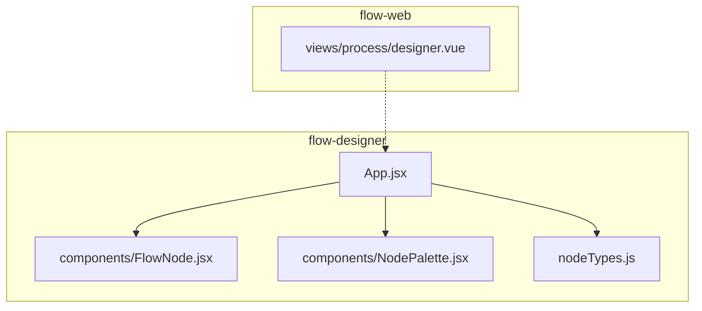
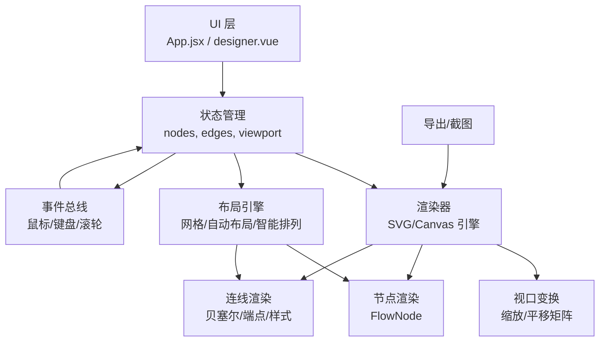
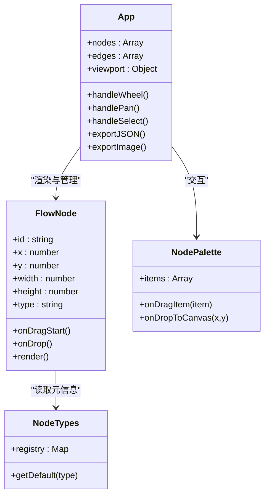
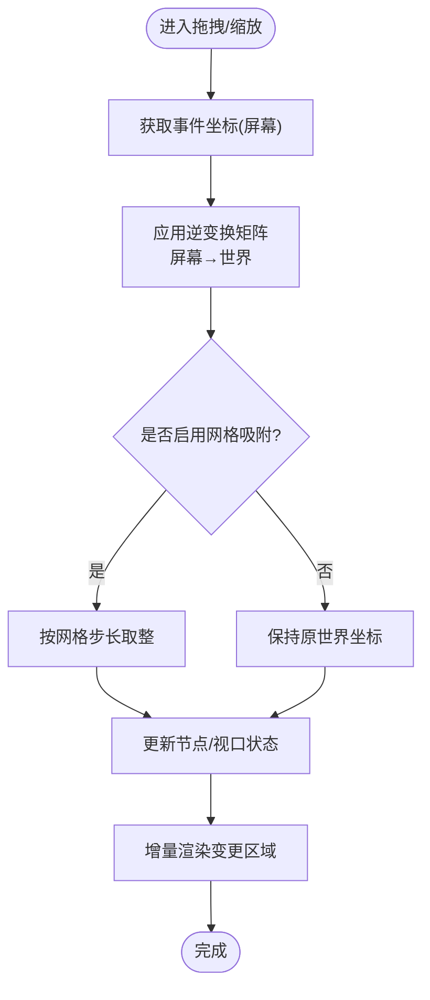

# 画布渲染引擎

<cite>
**本文引用的文件**   
- [flow-designer/src/components/FlowNode.jsx](file://flow-designer/src/components/FlowNode.jsx)
- [flow-designer/src/components/NodePalette.jsx](file://flow-designer/src/components/NodePalette.jsx)
- [flow-designer/src/App.jsx](file://flow-designer/src/App.jsx)
- [flow-designer/src/nodeTypes.js](file://flow-designer/src/nodeTypes.js)
- [flow-web/src/views/process/designer.vue](file://flow-web/src/views/process/designer.vue)
</cite>

## 目录
1. [简介](#简介)
2. [项目结构](#项目结构)
3. [核心组件](#核心组件)
4. [架构总览](#架构总览)
5. [详细组件分析](#详细组件分析)
6. [依赖关系分析](#依赖关系分析)
7. [性能考虑](#性能考虑)
8. [故障排查指南](#故障排查指南)
9. [结论](#结论)
10. [附录](#附录)

## 简介
本文件面向“可视化流程设计器”的画布渲染子系统，目标是系统化阐述其渲染架构与实现要点。内容覆盖：
- SVG/Canvas 绘图引擎的选择与权衡
- 画布坐标系系统（绝对坐标与相对坐标、缩放与平移变换矩阵）
- 节点定位算法（网格对齐、自动布局、智能排列）
- 连线绘制系统（贝塞尔曲线、端点定位、样式配置）
- 事件处理机制（滚轮缩放、画布平移、区域选择）
- 性能优化策略（虚拟滚动、增量渲染、内存管理）
- 导出与截图保存机制

说明：当前仓库中前端代码未包含完整的画布渲染实现，本文在尊重现有源码的前提下，给出基于工程现状的架构分析与可落地的实现建议，并通过图示展示关键数据流与调用链。

## 项目结构
从仓库结构看，与画布渲染相关的前端代码主要集中在两个子工程中：
- flow-designer：React 技术栈，提供基础组件与示例页面
- flow-web：Vue 技术栈，提供业务视图入口（含 designer.vue）

图表来源
- [flow-designer/src/App.jsx](file://flow-designer/src/App.jsx)
- [flow-designer/src/components/FlowNode.jsx](file://flow-designer/src/components/FlowNode.jsx)
- [flow-designer/src/components/NodePalette.jsx](file://flow-designer/src/components/NodePalette.jsx)
- [flow-designer/src/nodeTypes.js](file://flow-designer/src/nodeTypes.js)
- [flow-web/src/views/process/designer.vue](file://flow-web/src/views/process/designer.vue)

章节来源
- [flow-designer/src/App.jsx](file://flow-designer/src/App.jsx)
- [flow-designer/src/components/FlowNode.jsx](file://flow-designer/src/components/FlowNode.jsx)
- [flow-designer/src/components/NodePalette.jsx](file://flow-designer/src/components/NodePalette.jsx)
- [flow-designer/src/nodeTypes.js](file://flow-designer/src/nodeTypes.js)
- [flow-web/src/views/process/designer.vue](file://flow-web/src/views/process/designer.vue)

## 核心组件
- FlowNode：用于在画布上渲染单个节点，通常承载节点的尺寸、位置、选中态、拖拽等交互逻辑。
- NodePalette：节点面板，负责将可用节点以列表或抽屉形式呈现，并支持拖拽到画布创建新节点。
- App：顶层容器，组织画布状态、工具栏、面板与节点渲染。
- nodeTypes：集中定义节点类型元信息（如默认尺寸、端口位置、图标、标签等），为渲染与布局提供依据。
- designer.vue：Vue 侧的流程设计器入口，可能集成第三方画布库或自研渲染层。

章节来源
- [flow-designer/src/components/FlowNode.jsx](file://flow-designer/src/components/FlowNode.jsx)
- [flow-designer/src/components/NodePalette.jsx](file://flow-designer/src/components/NodePalette.jsx)
- [flow-designer/src/App.jsx](file://flow-designer/src/App.jsx)
- [flow-designer/src/nodeTypes.js](file://flow-designer/src/nodeTypes.js)
- [flow-web/src/views/process/designer.vue](file://flow-web/src/views/process/designer.vue)

## 架构总览
下图展示了画布渲染子系统的高层职责划分与数据流向。该图映射了现有源码中的模块边界与交互关系，同时补充了建议的渲染管线。

图表来源
- [flow-designer/src/App.jsx](file://flow-designer/src/App.jsx)
- [flow-designer/src/components/FlowNode.jsx](file://flow-designer/src/components/FlowNode.jsx)
- [flow-web/src/views/process/designer.vue](file://flow-web/src/views/process/designer.vue)

## 详细组件分析

### 画布坐标系与变换矩阵
- 坐标系模型
  - 世界坐标：节点与连线的真实逻辑坐标，不随缩放变化。
  - 屏幕坐标：DOM/Canvas 像素坐标，受缩放和平移影响。
  - 视口坐标：用户可见区域的局部坐标，用于命中测试与裁剪。
- 变换矩阵
  - 使用齐次坐标表示二维仿射变换，组合顺序通常为：先缩放后平移。
  - 逆变换用于将屏幕坐标反解为世界坐标，支撑拖拽、命中检测与吸附。
- 坐标转换
  - 世界→屏幕：应用缩放和平移矩阵。
  - 屏幕→世界：应用逆变换矩阵。
- 网格对齐
  - 将世界坐标按网格步长取整，得到吸附后的坐标。
  - 可选开启/关闭吸附，并在拖拽过程中实时预览吸附效果。

章节来源
- [flow-designer/src/components/FlowNode.jsx](file://flow-designer/src/components/FlowNode.jsx)
- [flow-designer/src/App.jsx](file://flow-designer/src/App.jsx)

### 节点定位与布局算法
- 网格对齐
  - 输入：拖拽结束时的目标世界坐标。
  - 输出：吸附到最近网格点的坐标。
  - 复杂度：O(1)。
- 自动布局
  - 常用策略：层次布局（自上而下）、正交布局（减少折线）、力导向（复杂网络）。
  - 约束：最小间距、端口方向、避免重叠。
  - 复杂度：取决于算法，常见 O(n log n) 或 O(n^2)。
- 智能排列
  - 启发式规则：优先保持原有相对位置；对冲突节点进行位移补偿；对连线密集区进行避让。
  - 增量更新：仅重算受影响子图，降低重排成本。

章节来源
- [flow-designer/src/components/FlowNode.jsx](file://flow-designer/src/components/FlowNode.jsx)
- [flow-designer/src/nodeTypes.js](file://flow-designer/src/nodeTypes.js)

### 连线绘制系统
- 端点定位
  - 计算节点矩形与连线方向的交点，确保端点位于节点边界。
  - 支持多端口（上/下/左/右）时，根据连接方向选择对应边。
- 路径生成
  - 使用三次贝塞尔曲线，控制点沿连线方向延伸，形成平滑过渡。
  - 支持正交折线（水平/垂直段）与自由曲线两种风格。
- 样式配置
  - 线宽、颜色、虚线、箭头、高亮、选中态。
  - 动态样式：根据条件（如错误、警告）切换视觉。
- 命中检测
  - 线段采样或几何求交，提升拖拽编辑体验。

章节来源
- [flow-designer/src/components/FlowNode.jsx](file://flow-designer/src/components/FlowNode.jsx)
- [flow-designer/src/nodeTypes.js](file://flow-designer/src/nodeTypes.js)

### 事件处理机制
- 滚轮缩放
  - 监听 wheel 事件，围绕鼠标位置进行缩放，避免画布“跳动”。
  - 限制缩放范围（最小/最大比例），防止极端值导致渲染异常。
- 画布平移
  - mousedown/mousemove/mouseup 组合实现拖拽平移。
  - 记录起始偏移量，实时更新视口矩阵。
- 区域选择
  - 按下并拖动框选矩形，筛选落入区域内的节点与连线。
  - 支持多选、单选、取消选择等交互。
- 事件冒泡与穿透
  - 区分画布级事件与节点级事件，避免误触发。
  - 对 SVG/Canvas 层设置 pointer-events 或 hit region，提高命中精度。

章节来源
- [flow-designer/src/App.jsx](file://flow-designer/src/App.jsx)
- [flow-designer/src/components/FlowNode.jsx](file://flow-designer/src/components/FlowNode.jsx)

### 导出与截图保存
- 导出
  - JSON 导出：序列化 nodes、edges、viewport 等状态。
  - SVG 导出：将当前视图序列化为矢量图，便于二次编辑。
- 截图
  - Canvas：直接 toDataURL/toBlob 获取位图。
  - SVG：通过 DOM 转 Canvas 再导出，或使用专用库保证跨浏览器一致性。
- 质量与尺寸
  - 支持指定分辨率倍数（dpr），平衡清晰度与文件大小。
  - 背景色、边框、水印等选项。

章节来源
- [flow-designer/src/App.jsx](file://flow-designer/src/App.jsx)
- [flow-web/src/views/process/designer.vue](file://flow-web/src/views/process/designer.vue)

## 依赖关系分析
- 组件耦合
  - App 作为编排者，持有全局状态并驱动渲染器与布局器。
  - FlowNode 依赖 nodeTypes 提供的元信息，完成自身绘制与交互。
  - NodePalette 与 App 通过事件或回调协作，完成节点创建。
- 外部依赖
  - 若采用第三方画布库（如 Konva、Fabric、AntV X6 等），需在其之上封装业务语义。
  - 若自研 SVG/Canvas 引擎，需自行实现变换矩阵、命中检测、事件分发等。

图表来源
- [flow-designer/src/App.jsx](file://flow-designer/src/App.jsx)
- [flow-designer/src/components/FlowNode.jsx](file://flow-designer/src/components/FlowNode.jsx)
- [flow-designer/src/components/NodePalette.jsx](file://flow-designer/src/components/NodePalette.jsx)
- [flow-designer/src/nodeTypes.js](file://flow-designer/src/nodeTypes.js)

章节来源
- [flow-designer/src/App.jsx](file://flow-designer/src/App.jsx)
- [flow-designer/src/components/FlowNode.jsx](file://flow-designer/src/components/FlowNode.jsx)
- [flow-designer/src/components/NodePalette.jsx](file://flow-designer/src/components/NodePalette.jsx)
- [flow-designer/src/nodeTypes.js](file://flow-designer/src/nodeTypes.js)

## 性能考虑
- 渲染引擎选择
  - SVG：适合节点数量中等、需要精细交互与矢量导出的场景。
  - Canvas：适合大规模节点与高频动画，具备更好的吞吐能力。
- 增量渲染
  - 仅重绘变更区域（脏矩形/脏节点集合），避免全量刷新。
  - 对连线进行批处理，合并路径绘制。
- 虚拟滚动与视口裁剪
  - 仅渲染可视区域内的节点与连线，超出部分延迟加载。
  - 结合四叉树或空间索引加速命中检测与碰撞判断。
- 内存管理
  - 对象池复用图形对象（路径、纹理、句柄）。
  - 及时释放不再使用的资源，避免内存泄漏。
- 计算优化
  - 预计算节点包围盒、连线控制点。
  - 使用 requestAnimationFrame 节流动画与拖拽更新。

[本节为通用指导，无需源码引用]

## 故障排查指南
- 缩放抖动或错位
  - 检查缩放中心是否跟随鼠标位置，确认矩阵乘法顺序正确。
  - 验证逆变换是否正确应用于坐标拾取。
- 拖拽卡顿
  - 确认是否启用了增量渲染与视口裁剪。
  - 检查是否有不必要的重排或全量重绘。
- 连线端点漂移
  - 校验端点与节点边界的交点计算，尤其是圆角与旋转节点。
  - 检查控制点长度与方向是否与连线风格一致。
- 导出图片模糊
  - 调整导出倍率（dpr），确保与设备像素比匹配。
  - 检查 SVG→Canvas 转换过程中的尺寸与缩放因子。

章节来源
- [flow-designer/src/App.jsx](file://flow-designer/src/App.jsx)
- [flow-designer/src/components/FlowNode.jsx](file://flow-designer/src/components/FlowNode.jsx)

## 结论
本项目已具备画布渲染所需的基础组件与入口，但尚未包含完整渲染引擎实现。建议在现有结构基础上，明确选择 SVG 或 Canvas 作为底层渲染器，完善坐标系统与变换矩阵、节点与连线绘制、事件处理与导出能力，并结合增量渲染与视口裁剪等手段保障性能。通过模块化设计与清晰的职责划分，可在后续迭代中快速扩展更多布局与交互特性。

[本节为总结性内容，无需源码引用]

## 附录

### 坐标系与变换流程图

图表来源
- [flow-designer/src/App.jsx](file://flow-designer/src/App.jsx)
- [flow-designer/src/components/FlowNode.jsx](file://flow-designer/src/components/FlowNode.jsx)