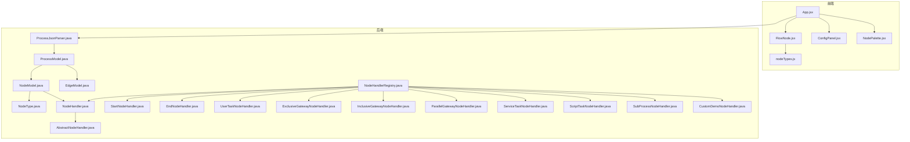
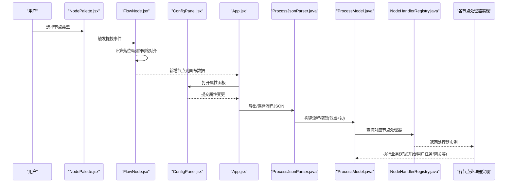
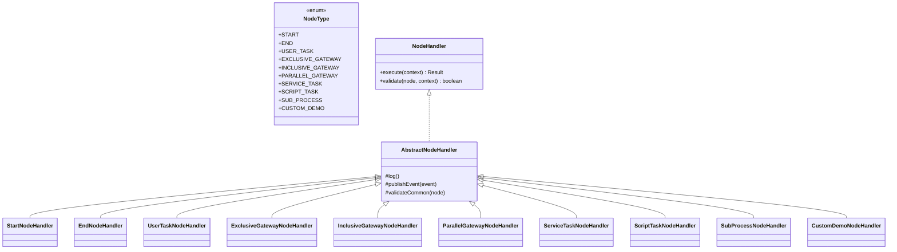
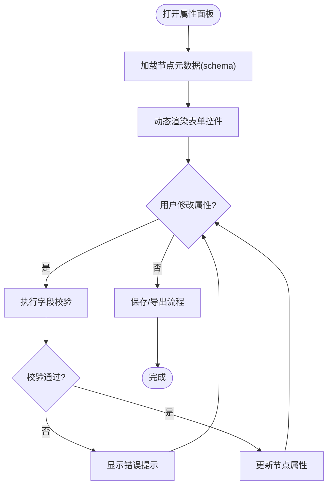
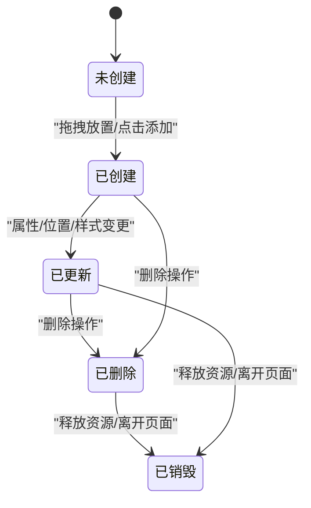
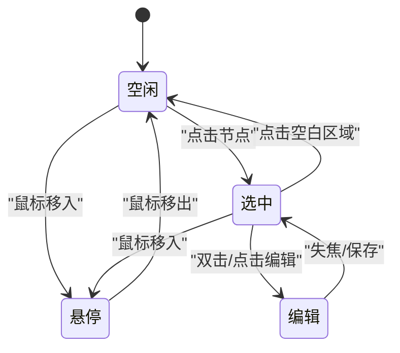
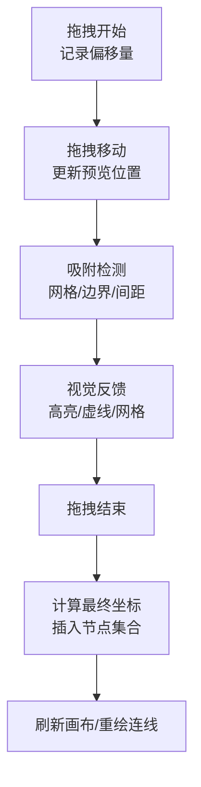
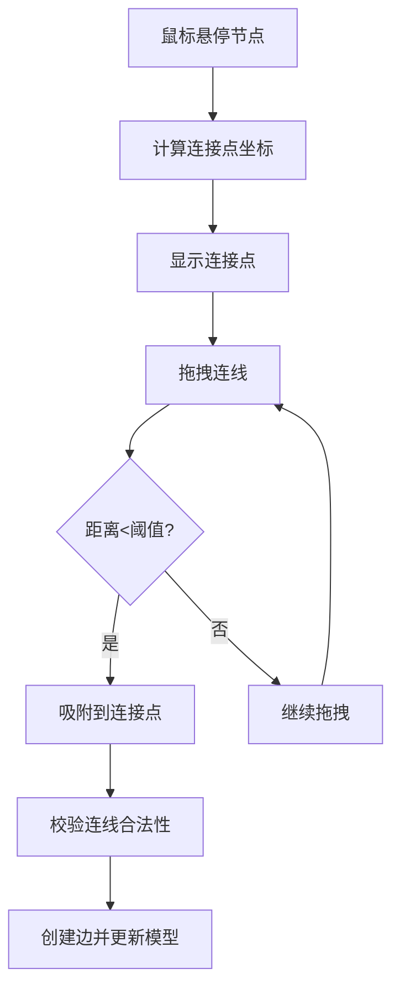
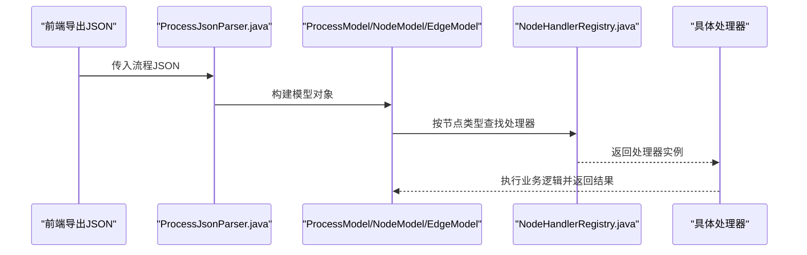
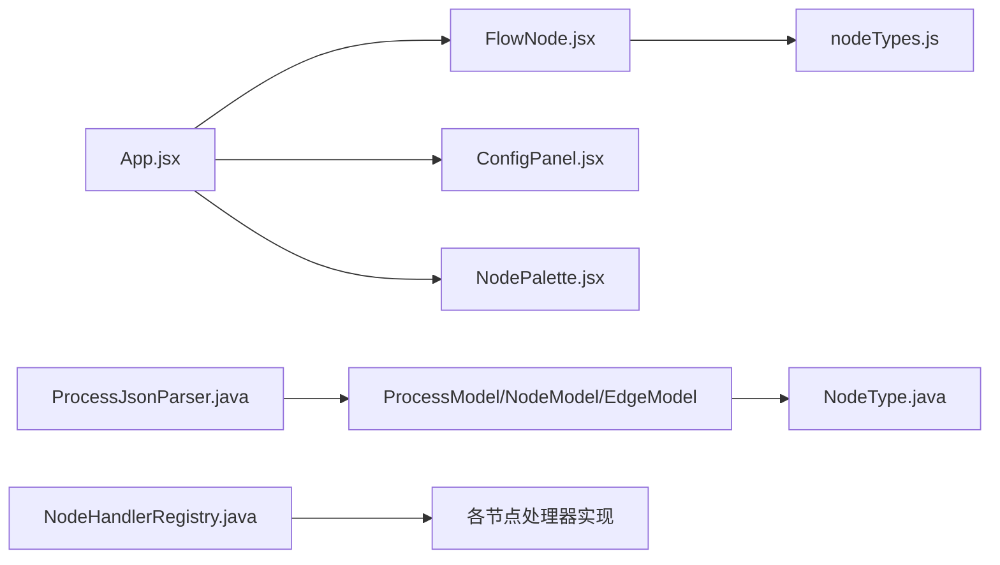

# 节点系统

<cite>
**本文引用的文件**   
- [nodeTypes.js](file://flow-designer/src/nodeTypes.js)
- [FlowNode.jsx](file://flow-designer/src/components/FlowNode.jsx)
- [ConfigPanel.jsx](file://flow-designer/src/components/ConfigPanel.jsx)
- [NodePalette.jsx](file://flow-designer/src/components/NodePalette.jsx)
- [App.jsx](file://flow-designer/src/App.jsx)
- [ProcessModel.java](file://flow-engine/src/main/java/com/flow/engine/model/ProcessModel.java)
- [NodeModel.java](file://flow-engine/src/main/java/com/flow/engine/model/NodeModel.java)
- [EdgeModel.java](file://flow-engine/src/main/java/com/flow/engine/model/EdgeModel.java)
- [NodeType.java](file://flow-engine/src/main/java/com/flow/engine/common/enums/NodeType.java)
- [NodeHandler.java](file://flow-engine/src/main/java/com/flow/engine/node/NodeHandler.java)
- [AbstractNodeHandler.java](file://flow-engine/src/main/java/com/flow/engine/node/AbstractNodeHandler.java)
- [NodeHandlerRegistry.java](file://flow-engine/src/main/java/com/flow/engine/node/NodeHandlerRegistry.java)
- [StartNodeHandler.java](file://flow-engine/src/main/java/com/flow/engine/node/impl/StartNodeHandler.java)
- [EndNodeHandler.java](file://flow-engine/src/main/java/com/flow/engine/node/impl/EndNodeHandler.java)
- [UserTaskNodeHandler.java](file://flow-engine/src/main/java/com/flow/engine/node/impl/UserTaskNodeHandler.java)
- [ExclusiveGatewayNodeHandler.java](file://flow-engine/src/main/java/com/flow/engine/node/impl/ExclusiveGatewayNodeHandler.java)
- [InclusiveGatewayNodeHandler.java](file://flow-engine/src/main/java/com/flow/engine/node/impl/InclusiveGatewayNodeHandler.java)
- [ParallelGatewayNodeHandler.java](file://flow-engine/src/main/java/com/flow/engine/node/impl/ParallelGatewayNodeHandler.java)
- [ServiceTaskNodeHandler.java](file://flow-engine/src/main/java/com/flow/engine/node/impl/ServiceTaskNodeHandler.java)
- [ScriptTaskNodeHandler.java](file://flow-engine/src/main/java/com/flow/engine/node/impl/ScriptTaskNodeHandler.java)
- [SubProcessNodeHandler.java](file://flow-engine/src/main/java/com/flow/engine/node/impl/SubProcessNodeHandler.java)
- [CustomDemoNodeHandler.java](file://flow-engine/src/main/java/com/flow/engine/node/impl/CustomDemoNodeHandler.java)
- [ProcessJsonParser.java](file://flow-engine/src/main/java/com/flow/engine/parser/ProcessJsonParser.java)
</cite>

## 目录
1. [简介](#简介)
2. [项目结构](#项目结构)
3. [核心组件](#核心组件)
4. [架构总览](#架构总览)
5. [详细组件分析](#详细组件分析)
6. [依赖关系分析](#依赖关系分析)
7. [性能考虑](#性能考虑)
8. [故障排查指南](#故障排查指南)
9. [结论](#结论)
10. [附录](#附录)

## 简介
本文件聚焦于流程设计器中的“节点系统”，覆盖前端可视化与后端执行引擎两端的协同设计。内容涵盖：
- 节点类型体系（开始、结束、用户任务、网关节点等）及自定义扩展机制
- 节点属性配置系统（元数据定义、验证规则、动态表单生成）
- 节点生命周期管理（创建、更新、删除、销毁）
- 节点状态管理（选中、悬停、编辑切换）
- 拖拽行为实现（起始点计算、视觉反馈、落位确定）
- 连接点自动计算与连线吸附

## 项目结构
本项目由前后端两部分组成，围绕“节点”形成完整闭环：
- 前端（flow-designer）：提供画布、节点渲染、属性面板、调色板、拖拽交互等
- 后端（flow-engine）：定义节点模型、处理器注册与执行、解析流程 JSON 为可执行模型

图表来源
- [App.jsx](file://flow-designer/src/App.jsx)
- [FlowNode.jsx](file://flow-designer/src/components/FlowNode.jsx)
- [ConfigPanel.jsx](file://flow-designer/src/components/ConfigPanel.jsx)
- [NodePalette.jsx](file://flow-designer/src/components/NodePalette.jsx)
- [nodeTypes.js](file://flow-designer/src/nodeTypes.js)
- [ProcessModel.java](file://flow-engine/src/main/java/com/flow/engine/model/ProcessModel.java)
- [NodeModel.java](file://flow-engine/src/main/java/com/flow/engine/model/NodeModel.java)
- [EdgeModel.java](file://flow-engine/src/main/java/com/flow/engine/model/EdgeModel.java)
- [NodeType.java](file://flow-engine/src/main/java/com/flow/engine/common/enums/NodeType.java)
- [NodeHandler.java](file://flow-engine/src/main/java/com/flow/engine/node/NodeHandler.java)
- [AbstractNodeHandler.java](file://flow-engine/src/main/java/com/flow/engine/node/AbstractNodeHandler.java)
- [NodeHandlerRegistry.java](file://flow-engine/src/main/java/com/flow/engine/node/NodeHandlerRegistry.java)
- [ProcessJsonParser.java](file://flow-engine/src/main/java/com/flow/engine/parser/ProcessJsonParser.java)
- [StartNodeHandler.java](file://flow-engine/src/main/java/com/flow/engine/node/impl/StartNodeHandler.java)
- [EndNodeHandler.java](file://flow-engine/src/main/java/com/flow/engine/node/impl/EndNodeHandler.java)
- [UserTaskNodeHandler.java](file://flow-engine/src/main/java/com/flow/engine/node/impl/UserTaskNodeHandler.java)
- [ExclusiveGatewayNodeHandler.java](file://flow-engine/src/main/java/com/flow/engine/node/impl/ExclusiveGatewayNodeHandler.java)
- [InclusiveGatewayNodeHandler.java](file://flow-engine/src/main/java/com/flow/engine/node/impl/InclusiveGatewayNodeHandler.java)
- [ParallelGatewayNodeHandler.java](file://flow-engine/src/main/java/com/flow/engine/node/impl/ParallelGatewayNodeHandler.java)
- [ServiceTaskNodeHandler.java](file://flow-engine/src/main/java/com/flow/engine/node/impl/ServiceTaskNodeHandler.java)
- [ScriptTaskNodeHandler.java](file://flow-engine/src/main/java/com/flow/engine/node/impl/ScriptTaskNodeHandler.java)
- [SubProcessNodeHandler.java](file://flow-engine/src/main/java/com/flow/engine/node/impl/SubProcessNodeHandler.java)
- [CustomDemoNodeHandler.java](file://flow-engine/src/main/java/com/flow/engine/node/impl/CustomDemoNodeHandler.java)

章节来源
- [App.jsx](file://flow-designer/src/App.jsx)
- [FlowNode.jsx](file://flow-designer/src/components/FlowNode.jsx)
- [ConfigPanel.jsx](file://flow-designer/src/components/ConfigPanel.jsx)
- [NodePalette.jsx](file://flow-designer/src/components/NodePalette.jsx)
- [nodeTypes.js](file://flow-designer/src/nodeTypes.js)
- [ProcessModel.java](file://flow-engine/src/main/java/com/flow/engine/model/ProcessModel.java)
- [NodeModel.java](file://flow-engine/src/main/java/com/flow/engine/model/NodeModel.java)
- [EdgeModel.java](file://flow-engine/src/main/java/com/flow/engine/model/EdgeModel.java)
- [NodeType.java](file://flow-engine/src/main/java/com/flow/engine/common/enums/NodeType.java)
- [NodeHandler.java](file://flow-engine/src/main/java/com/flow/engine/node/NodeHandler.java)
- [AbstractNodeHandler.java](file://flow-engine/src/main/java/com/flow/engine/node/AbstractNodeHandler.java)
- [NodeHandlerRegistry.java](file://flow-engine/src/main/java/com/flow/engine/node/NodeHandlerRegistry.java)
- [ProcessJsonParser.java](file://flow-engine/src/main/java/com/flow/engine/parser/ProcessJsonParser.java)

## 核心组件
本节从“类型—模型—处理器—解析—渲染—配置”的链路出发，梳理节点系统的核心构件及其职责。

- 节点类型枚举与定义
  - 后端通过枚举集中声明支持的节点类型，作为类型契约
  - 前端通过类型定义文件维护节点元数据、默认属性、图标、分组等，驱动调色板与渲染

- 节点模型与边模型
  - 节点模型承载节点 ID、类型、位置、尺寸、属性等
  - 边模型描述起点节点、终点节点、条件表达式、标签等
  - 流程模型聚合节点集合与边集合，构成完整的流程图

- 节点处理器接口与抽象基类
  - 处理器接口定义统一的执行入口与上下文
  - 抽象基类封装通用能力（如参数校验、日志、事件发布等），具体节点实现业务逻辑

- 处理器注册中心
  - 启动时扫描并注册所有处理器实现，按类型映射到处理器实例
  - 运行时根据节点类型快速定位处理器

- 流程 JSON 解析器
  - 将前端导出的流程 JSON 解析为后端模型对象
  - 校验节点类型合法性、必填字段、边连通性等

- 前端渲染与交互
  - FlowNode 负责单个节点的绘制、选中/悬停/编辑态样式、连接点展示
  - NodePalette 提供拖拽源，支持将节点拖入画布
  - ConfigPanel 基于节点元数据动态生成属性表单，支持校验与回写

章节来源
- [NodeType.java](file://flow-engine/src/main/java/com/flow/engine/common/enums/NodeType.java)
- [NodeModel.java](file://flow-engine/src/main/java/com/flow/engine/model/NodeModel.java)
- [EdgeModel.java](file://flow-engine/src/main/java/com/flow/engine/model/EdgeModel.java)
- [ProcessModel.java](file://flow-engine/src/main/java/com/flow/engine/model/ProcessModel.java)
- [NodeHandler.java](file://flow-engine/src/main/java/com/flow/engine/node/NodeHandler.java)
- [AbstractNodeHandler.java](file://flow-engine/src/main/java/com/flow/engine/node/AbstractNodeHandler.java)
- [NodeHandlerRegistry.java](file://flow-engine/src/main/java/com/flow/engine/node/NodeHandlerRegistry.java)
- [ProcessJsonParser.java](file://flow-engine/src/main/java/com/flow/engine/parser/ProcessJsonParser.java)
- [FlowNode.jsx](file://flow-designer/src/components/FlowNode.jsx)
- [NodePalette.jsx](file://flow-designer/src/components/NodePalette.jsx)
- [ConfigPanel.jsx](file://flow-designer/src/components/ConfigPanel.jsx)
- [nodeTypes.js](file://flow-designer/src/nodeTypes.js)

## 架构总览
下图展示了从“前端拖拽创建节点”到“后端解析与执行”的整体流程，以及节点处理器在运行时的角色。

图表来源
- [NodePalette.jsx](file://flow-designer/src/components/NodePalette.jsx)
- [FlowNode.jsx](file://flow-designer/src/components/FlowNode.jsx)
- [ConfigPanel.jsx](file://flow-designer/src/components/ConfigPanel.jsx)
- [App.jsx](file://flow-designer/src/App.jsx)
- [ProcessJsonParser.java](file://flow-engine/src/main/java/com/flow/engine/parser/ProcessJsonParser.java)
- [ProcessModel.java](file://flow-engine/src/main/java/com/flow/engine/model/ProcessModel.java)
- [NodeHandlerRegistry.java](file://flow-engine/src/main/java/com/flow/engine/node/NodeHandlerRegistry.java)
- [StartNodeHandler.java](file://flow-engine/src/main/java/com/flow/engine/node/impl/StartNodeHandler.java)
- [EndNodeHandler.java](file://flow-engine/src/main/java/com/flow/engine/node/impl/EndNodeHandler.java)
- [UserTaskNodeHandler.java](file://flow-engine/src/main/java/com/flow/engine/node/impl/UserTaskNodeHandler.java)
- [ExclusiveGatewayNodeHandler.java](file://flow-engine/src/main/java/com/flow/engine/node/impl/ExclusiveGatewayNodeHandler.java)
- [InclusiveGatewayNodeHandler.java](file://flow-engine/src/main/java/com/flow/engine/node/impl/InclusiveGatewayNodeHandler.java)
- [ParallelGatewayNodeHandler.java](file://flow-engine/src/main/java/com/flow/engine/node/impl/ParallelGatewayNodeHandler.java)
- [ServiceTaskNodeHandler.java](file://flow-engine/src/main/java/com/flow/engine/node/impl/ServiceTaskNodeHandler.java)
- [ScriptTaskNodeHandler.java](file://flow-engine/src/main/java/com/flow/engine/node/impl/ScriptTaskNodeHandler.java)
- [SubProcessNodeHandler.java](file://flow-engine/src/main/java/com/flow/engine/node/impl/SubProcessNodeHandler.java)
- [CustomDemoNodeHandler.java](file://flow-engine/src/main/java/com/flow/engine/node/impl/CustomDemoNodeHandler.java)

## 详细组件分析

### 节点类型系统与内置节点
- 类型定义
  - 后端枚举统一声明节点类型，确保前后端一致
  - 前端 nodeTypes.js 维护每种类型的元数据（名称、图标、默认属性、分组、是否允许出边/入边等）
- 内置节点
  - 开始节点：流程入口，通常无入边，有出边
  - 结束节点：流程出口，通常有入边，无出边
  - 用户任务节点：需要人工审批或处理
  - 排他网关：单路分支，条件互斥
  - 包容网关：多路分支，满足条件的路径并行
  - 并行网关：多路汇聚/分叉，同步并发
  - 服务任务/脚本任务：调用外部服务或执行脚本
  - 子流程：嵌套流程
  - 自定义示例：演示如何扩展新节点类型
- 自定义扩展
  - 后端：新增处理器实现并注册至注册中心；前端：在 nodeTypes.js 中补充元数据与渲染/配置逻辑

图表来源
- [NodeType.java](file://flow-engine/src/main/java/com/flow/engine/common/enums/NodeType.java)
- [NodeHandler.java](file://flow-engine/src/main/java/com/flow/engine/node/NodeHandler.java)
- [AbstractNodeHandler.java](file://flow-engine/src/main/java/com/flow/engine/node/AbstractNodeHandler.java)
- [StartNodeHandler.java](file://flow-engine/src/main/java/com/flow/engine/node/impl/StartNodeHandler.java)
- [EndNodeHandler.java](file://flow-engine/src/main/java/com/flow/engine/node/impl/EndNodeHandler.java)
- [UserTaskNodeHandler.java](file://flow-engine/src/main/java/com/flow/engine/node/impl/UserTaskNodeHandler.java)
- [ExclusiveGatewayNodeHandler.java](file://flow-engine/src/main/java/com/flow/engine/node/impl/ExclusiveGatewayNodeHandler.java)
- [InclusiveGatewayNodeHandler.java](file://flow-engine/src/main/java/com/flow/engine/node/impl/InclusiveGatewayNodeHandler.java)
- [ParallelGatewayNodeHandler.java](file://flow-engine/src/main/java/com/flow/engine/node/impl/ParallelGatewayNodeHandler.java)
- [ServiceTaskNodeHandler.java](file://flow-engine/src/main/java/com/flow/engine/node/impl/ServiceTaskNodeHandler.java)
- [ScriptTaskNodeHandler.java](file://flow-engine/src/main/java/com/flow/engine/node/impl/ScriptTaskNodeHandler.java)
- [SubProcessNodeHandler.java](file://flow-engine/src/main/java/com/flow/engine/node/impl/SubProcessNodeHandler.java)
- [CustomDemoNodeHandler.java](file://flow-engine/src/main/java/com/flow/engine/node/impl/CustomDemoNodeHandler.java)

章节来源
- [nodeTypes.js](file://flow-designer/src/nodeTypes.js)
- [NodeType.java](file://flow-engine/src/main/java/com/flow/engine/common/enums/NodeType.java)
- [NodeHandler.java](file://flow-engine/src/main/java/com/flow/engine/node/NodeHandler.java)
- [AbstractNodeHandler.java](file://flow-engine/src/main/java/com/flow/engine/node/AbstractNodeHandler.java)
- [StartNodeHandler.java](file://flow-engine/src/main/java/com/flow/engine/node/impl/StartNodeHandler.java)
- [EndNodeHandler.java](file://flow-engine/src/main/java/com/flow/engine/node/impl/EndNodeHandler.java)
- [UserTaskNodeHandler.java](file://flow-engine/src/main/java/com/flow/engine/node/impl/UserTaskNodeHandler.java)
- [ExclusiveGatewayNodeHandler.java](file://flow-engine/src/main/java/com/flow/engine/node/impl/ExclusiveGatewayNodeHandler.java)
- [InclusiveGatewayNodeHandler.java](file://flow-engine/src/main/java/com/flow/engine/node/impl/InclusiveGatewayNodeHandler.java)
- [ParallelGatewayNodeHandler.java](file://flow-engine/src/main/java/com/flow/engine/node/impl/ParallelGatewayNodeHandler.java)
- [ServiceTaskNodeHandler.java](file://flow-engine/src/main/java/com/flow/engine/node/impl/ServiceTaskNodeHandler.java)
- [ScriptTaskNodeHandler.java](file://flow-engine/src/main/java/com/flow/engine/node/impl/ScriptTaskNodeHandler.java)
- [SubProcessNodeHandler.java](file://flow-engine/src/main/java/com/flow/engine/node/impl/SubProcessNodeHandler.java)
- [CustomDemoNodeHandler.java](file://flow-engine/src/main/java/com/flow/engine/node/impl/CustomDemoNodeHandler.java)

### 节点属性配置系统（元数据、验证、动态表单）
- 元数据定义
  - 前端 nodeTypes.js 中为每种节点类型定义属性 schema（字段名、类型、默认值、选项、提示文案、是否必填等）
- 动态表单生成
  - ConfigPanel 读取当前选中节点的元数据，动态渲染输入控件（文本框、下拉、开关、富文本等）
- 属性验证
  - 提交前进行基础校验（非空、格式、范围），错误信息即时反馈
- 属性回写
  - 表单变更实时写入节点属性，保持画布数据与面板一致

图表来源
- [ConfigPanel.jsx](file://flow-designer/src/components/ConfigPanel.jsx)
- [nodeTypes.js](file://flow-designer/src/nodeTypes.js)

章节来源
- [ConfigPanel.jsx](file://flow-designer/src/components/ConfigPanel.jsx)
- [nodeTypes.js](file://flow-designer/src/nodeTypes.js)

### 节点生命周期管理（创建、更新、删除、销毁）
- 创建
  - 从调色板拖拽节点到画布，计算初始坐标与吸附对齐，插入节点集合
- 更新
  - 属性面板变更、移动、缩放、连线增删等操作触发节点/边集合更新
- 删除
  - 删除节点时需级联清理关联边，避免悬挂引用
- 销毁
  - 切换页面或关闭设计器时释放资源（事件监听、定时器、缓存等）

章节来源
- [FlowNode.jsx](file://flow-designer/src/components/FlowNode.jsx)
- [NodePalette.jsx](file://flow-designer/src/components/NodePalette.jsx)
- [App.jsx](file://flow-designer/src/App.jsx)

### 节点状态管理（选中、悬停、编辑）
- 选中状态
  - 点击节点进入选中态，高亮边框、显示控制手柄与连接点
- 悬停状态
  - 鼠标移入节点区域显示预览效果（如阴影、虚线边框）
- 编辑状态
  - 双击节点或点击“编辑”按钮进入编辑态，右侧弹出属性面板
- 状态切换
  - 点击空白区域取消选中；失焦或切换节点时退出编辑态

章节来源
- [FlowNode.jsx](file://flow-designer/src/components/FlowNode.jsx)
- [ConfigPanel.jsx](file://flow-designer/src/components/ConfigPanel.jsx)

### 拖拽行为实现（起始点、视觉反馈、落位）
- 起始点计算
  - 从调色板拖拽时记录鼠标相对节点左上角的偏移，保证拖拽过程中节点跟随光标稳定
- 视觉反馈
  - 拖拽中显示半透明副本、网格辅助线、吸附指示
- 落位确定
  - 释放时进行网格对齐、边界约束、与其他节点的最小间距检查
  - 若命中目标节点附近，则触发“合并/替换”策略（可选）

图表来源
- [NodePalette.jsx](file://flow-designer/src/components/NodePalette.jsx)
- [FlowNode.jsx](file://flow-designer/src/components/FlowNode.jsx)

章节来源
- [NodePalette.jsx](file://flow-designer/src/components/NodePalette.jsx)
- [FlowNode.jsx](file://flow-designer/src/components/FlowNode.jsx)

### 连接点自动计算与连线吸附
- 连接点计算
  - 根据节点形状与尺寸，自动计算上/下/左/右四个连接点坐标
- 连线吸附
  - 拖拽连线时，当靠近目标连接点阈值范围内自动吸附，减少手动对齐成本
- 连线校验
  - 禁止自环、重复边、非法方向（如结束节点出边）等

图表来源
- [FlowNode.jsx](file://flow-designer/src/components/FlowNode.jsx)
- [EdgeModel.java](file://flow-engine/src/main/java/com/flow/engine/model/EdgeModel.java)

章节来源
- [FlowNode.jsx](file://flow-designer/src/components/FlowNode.jsx)
- [EdgeModel.java](file://flow-engine/src/main/java/com/flow/engine/model/EdgeModel.java)

### 后端解析与执行（JSON→模型→处理器）
- 解析流程
  - ProcessJsonParser 将前端导出的 JSON 解析为 ProcessModel/NodeModel/EdgeModel
  - 校验节点类型、必填字段、连通性
- 处理器调度
  - NodeHandlerRegistry 根据节点类型返回对应处理器
  - 各处理器实现具体业务逻辑（开始/结束/用户任务/网关/服务等）

图表来源
- [ProcessJsonParser.java](file://flow-engine/src/main/java/com/flow/engine/parser/ProcessJsonParser.java)
- [ProcessModel.java](file://flow-engine/src/main/java/com/flow/engine/model/ProcessModel.java)
- [NodeModel.java](file://flow-engine/src/main/java/com/flow/engine/model/NodeModel.java)
- [EdgeModel.java](file://flow-engine/src/main/java/com/flow/engine/model/EdgeModel.java)
- [NodeHandlerRegistry.java](file://flow-engine/src/main/java/com/flow/engine/node/NodeHandlerRegistry.java)
- [StartNodeHandler.java](file://flow-engine/src/main/java/com/flow/engine/node/impl/StartNodeHandler.java)
- [EndNodeHandler.java](file://flow-engine/src/main/java/com/flow/engine/node/impl/EndNodeHandler.java)
- [UserTaskNodeHandler.java](file://flow-engine/src/main/java/com/flow/engine/node/impl/UserTaskNodeHandler.java)
- [ExclusiveGatewayNodeHandler.java](file://flow-engine/src/main/java/com/flow/engine/node/impl/ExclusiveGatewayNodeHandler.java)
- [InclusiveGatewayNodeHandler.java](file://flow-engine/src/main/java/com/flow/engine/node/impl/InclusiveGatewayNodeHandler.java)
- [ParallelGatewayNodeHandler.java](file://flow-engine/src/main/java/com/flow/engine/node/impl/ParallelGatewayNodeHandler.java)
- [ServiceTaskNodeHandler.java](file://flow-engine/src/main/java/com/flow/engine/node/impl/ServiceTaskNodeHandler.java)
- [ScriptTaskNodeHandler.java](file://flow-engine/src/main/java/com/flow/engine/node/impl/ScriptTaskNodeHandler.java)
- [SubProcessNodeHandler.java](file://flow-engine/src/main/java/com/flow/engine/node/impl/SubProcessNodeHandler.java)
- [CustomDemoNodeHandler.java](file://flow-engine/src/main/java/com/flow/engine/node/impl/CustomDemoNodeHandler.java)

章节来源
- [ProcessJsonParser.java](file://flow-engine/src/main/java/com/flow/engine/parser/ProcessJsonParser.java)
- [ProcessModel.java](file://flow-engine/src/main/java/com/flow/engine/model/ProcessModel.java)
- [NodeModel.java](file://flow-engine/src/main/java/com/flow/engine/model/NodeModel.java)
- [EdgeModel.java](file://flow-engine/src/main/java/com/flow/engine/model/EdgeModel.java)
- [NodeHandlerRegistry.java](file://flow-engine/src/main/java/com/flow/engine/node/NodeHandlerRegistry.java)
- [StartNodeHandler.java](file://flow-engine/src/main/java/com/flow/engine/node/impl/StartNodeHandler.java)
- [EndNodeHandler.java](file://flow-engine/src/main/java/com/flow/engine/node/impl/EndNodeHandler.java)
- [UserTaskNodeHandler.java](file://flow-engine/src/main/java/com/flow/engine/node/impl/UserTaskNodeHandler.java)
- [ExclusiveGatewayNodeHandler.java](file://flow-engine/src/main/java/com/flow/engine/node/impl/ExclusiveGatewayNodeHandler.java)
- [InclusiveGatewayNodeHandler.java](file://flow-engine/src/main/java/com/flow/engine/node/impl/InclusiveGatewayNodeHandler.java)
- [ParallelGatewayNodeHandler.java](file://flow-engine/src/main/java/com/flow/engine/node/impl/ParallelGatewayNodeHandler.java)
- [ServiceTaskNodeHandler.java](file://flow-engine/src/main/java/com/flow/engine/node/impl/ServiceTaskNodeHandler.java)
- [ScriptTaskNodeHandler.java](file://flow-engine/src/main/java/com/flow/engine/node/impl/ScriptTaskNodeHandler.java)
- [SubProcessNodeHandler.java](file://flow-engine/src/main/java/com/flow/engine/node/impl/SubProcessNodeHandler.java)
- [CustomDemoNodeHandler.java](file://flow-engine/src/main/java/com/flow/engine/node/impl/CustomDemoNodeHandler.java)

## 依赖关系分析
- 前端依赖
  - App.jsx 协调 FlowNode、ConfigPanel、NodePalette 的交互
  - FlowNode 依赖 nodeTypes.js 的元数据以渲染不同节点
- 后端依赖
  - ProcessJsonParser 依赖模型类与类型枚举
  - NodeHandlerRegistry 依赖所有处理器实现，按类型分发
  - 各处理器继承抽象基类，复用通用能力

图表来源
- [App.jsx](file://flow-designer/src/App.jsx)
- [FlowNode.jsx](file://flow-designer/src/components/FlowNode.jsx)
- [ConfigPanel.jsx](file://flow-designer/src/components/ConfigPanel.jsx)
- [NodePalette.jsx](file://flow-designer/src/components/NodePalette.jsx)
- [nodeTypes.js](file://flow-designer/src/nodeTypes.js)
- [ProcessJsonParser.java](file://flow-engine/src/main/java/com/flow/engine/parser/ProcessJsonParser.java)
- [ProcessModel.java](file://flow-engine/src/main/java/com/flow/engine/model/ProcessModel.java)
- [NodeModel.java](file://flow-engine/src/main/java/com/flow/engine/model/NodeModel.java)
- [EdgeModel.java](file://flow-engine/src/main/java/com/flow/engine/model/EdgeModel.java)
- [NodeType.java](file://flow-engine/src/main/java/com/flow/engine/common/enums/NodeType.java)
- [NodeHandlerRegistry.java](file://flow-engine/src/main/java/com/flow/engine/node/NodeHandlerRegistry.java)
- [StartNodeHandler.java](file://flow-engine/src/main/java/com/flow/engine/node/impl/StartNodeHandler.java)
- [EndNodeHandler.java](file://flow-engine/src/main/java/com/flow/engine/node/impl/EndNodeHandler.java)
- [UserTaskNodeHandler.java](file://flow-engine/src/main/java/com/flow/engine/node/impl/UserTaskNodeHandler.java)
- [ExclusiveGatewayNodeHandler.java](file://flow-engine/src/main/java/com/flow/engine/node/impl/ExclusiveGatewayNodeHandler.java)
- [InclusiveGatewayNodeHandler.java](file://flow-engine/src/main/java/com/flow/engine/node/impl/InclusiveGatewayNodeHandler.java)
- [ParallelGatewayNodeHandler.java](file://flow-engine/src/main/java/com/flow/engine/node/impl/ParallelGatewayNodeHandler.java)
- [ServiceTaskNodeHandler.java](file://flow-engine/src/main/java/com/flow/engine/node/impl/ServiceTaskNodeHandler.java)
- [ScriptTaskNodeHandler.java](file://flow-engine/src/main/java/com/flow/engine/node/impl/ScriptTaskNodeHandler.java)
- [SubProcessNodeHandler.java](file://flow-engine/src/main/java/com/flow/engine/node/impl/SubProcessNodeHandler.java)
- [CustomDemoNodeHandler.java](file://flow-engine/src/main/java/com/flow/engine/node/impl/CustomDemoNodeHandler.java)

章节来源
- [App.jsx](file://flow-designer/src/App.jsx)
- [FlowNode.jsx](file://flow-designer/src/components/FlowNode.jsx)
- [ConfigPanel.jsx](file://flow-designer/src/components/ConfigPanel.jsx)
- [NodePalette.jsx](file://flow-designer/src/components/NodePalette.jsx)
- [nodeTypes.js](file://flow-designer/src/nodeTypes.js)
- [ProcessJsonParser.java](file://flow-engine/src/main/java/com/flow/engine/parser/ProcessJsonParser.java)
- [ProcessModel.java](file://flow-engine/src/main/java/com/flow/engine/model/ProcessModel.java)
- [NodeModel.java](file://flow-engine/src/main/java/com/flow/engine/model/NodeModel.java)
- [EdgeModel.java](file://flow-engine/src/main/java/com/flow/engine/model/EdgeModel.java)
- [NodeType.java](file://flow-engine/src/main/java/com/flow/engine/common/enums/NodeType.java)
- [NodeHandlerRegistry.java](file://flow-engine/src/main/java/com/flow/engine/node/NodeHandlerRegistry.java)
- [StartNodeHandler.java](file://flow-engine/src/main/java/com/flow/engine/node/impl/StartNodeHandler.java)
- [EndNodeHandler.java](file://flow-engine/src/main/java/com/flow/engine/node/impl/EndNodeHandler.java)
- [UserTaskNodeHandler.java](file://flow-engine/src/main/java/com/flow/engine/node/impl/UserTaskNodeHandler.java)
- [ExclusiveGatewayNodeHandler.java](file://flow-engine/src/main/java/com/flow/engine/node/impl/ExclusiveGatewayNodeHandler.java)
- [InclusiveGatewayNodeHandler.java](file://flow-engine/src/main/java/com/flow/engine/node/impl/InclusiveGatewayNodeHandler.java)
- [ParallelGatewayNodeHandler.java](file://flow-engine/src/main/java/com/flow/engine/node/impl/ParallelGatewayNodeHandler.java)
- [ServiceTaskNodeHandler.java](file://flow-engine/src/main/java/com/flow/engine/node/impl/ServiceTaskNodeHandler.java)
- [ScriptTaskNodeHandler.java](file://flow-engine/src/main/java/com/flow/engine/node/impl/ScriptTaskNodeHandler.java)
- [SubProcessNodeHandler.java](file://flow-engine/src/main/java/com/flow/engine/node/impl/SubProcessNodeHandler.java)
- [CustomDemoNodeHandler.java](file://flow-engine/src/main/java/com/flow/engine/node/impl/CustomDemoNodeHandler.java)

## 性能考虑
- 渲染优化
  - 仅对可见区域节点进行重绘，使用虚拟滚动或按需渲染
  - 大流程场景下采用增量更新，避免全量重算
- 拖拽与吸附
  - 吸附阈值与网格步长可调，避免频繁计算
  - 使用节流/防抖降低高频事件开销
- 处理器执行
  - 异步执行耗时任务，避免阻塞主线程
  - 对网关分支进行短路评估，减少无效路径计算

## 故障排查指南
- 节点无法拖拽
  - 检查调色板事件绑定与画布接收区域是否正确
  - 确认 nodeTypes.js 中该类型是否启用拖拽
- 属性面板不显示或报错
  - 核对节点元数据 schema 字段是否与后端模型一致
  - 查看表单校验规则是否过于严格导致无法提交
- 连线无法创建或断开
  - 检查连接点坐标计算与吸附阈值
  - 确认边模型字段（起点/终点/条件）是否完整
- 处理器未生效
  - 确认处理器实现已正确注册至 NodeHandlerRegistry
  - 检查节点类型枚举值与处理器映射是否一致

章节来源
- [NodePalette.jsx](file://flow-designer/src/components/NodePalette.jsx)
- [FlowNode.jsx](file://flow-designer/src/components/FlowNode.jsx)
- [ConfigPanel.jsx](file://flow-designer/src/components/ConfigPanel.jsx)
- [nodeTypes.js](file://flow-designer/src/nodeTypes.js)
- [EdgeModel.java](file://flow-engine/src/main/java/com/flow/engine/model/EdgeModel.java)
- [NodeHandlerRegistry.java](file://flow-engine/src/main/java/com/flow/engine/node/NodeHandlerRegistry.java)
- [NodeType.java](file://flow-engine/src/main/java/com/flow/engine/common/enums/NodeType.java)

## 结论
节点系统通过“前端可视化 + 后端处理器”的双端协作，实现了可扩展、可配置的流程设计能力。类型体系、属性配置、生命周期、状态管理、拖拽与连线吸附共同构成了良好的用户体验；后端的解析与处理器注册机制保证了流程的可执行性与扩展性。建议在后续迭代中持续完善校验规则、性能优化与异常恢复策略，以提升复杂流程下的稳定性与易用性。

## 附录
- 术语
  - 节点：流程中的一个步骤或决策点
  - 边：连接两个节点的流向，可携带条件表达式
  - 处理器：针对特定节点类型的执行逻辑实现
  - 元数据：描述节点类型与属性的结构化定义
- 最佳实践
  - 新增节点类型时，同步更新前后端元数据与处理器
  - 属性校验尽量在前端尽早拦截，减少后端压力
  - 拖拽与吸附算法应保持可配置，便于适配不同画布风格