# 用户界面设计

<cite>
**本文引用的文件**   
- [flow-web/src/main.js](file://flow-web/src/main.js)
- [flow-web/src/App.vue](file://flow-web/src/App.vue)
- [flow-web/src/router/index.js](file://flow-web/src/router/index.js)
- [flow-web/src/layouts/BasicLayout.vue](file://flow-web/src/layouts/BasicLayout.vue)
- [flow-web/src/views/login/index.vue](file://flow-web/src/views/login/index.vue)
- [flow-web/src/views/dashboard/index.vue](file://flow-web/src/views/dashboard/index.vue)
- [flow-web/src/views/process/designer.vue](file://flow-web/src/views/process/designer.vue)
- [flow-web/src/views/process/definition/index.vue](file://flow-web/src/views/process/definition/index.vue)
- [flow-web/src/views/process/instance/index.vue](file://flow-web/src/views/process/instance/index.vue)
- [flow-web/src/views/system/admin.vue](file://flow-web/src/views/system/admin.vue)
- [flow-web/src/views/system/dept.vue](file://flow-web/src/views/system/dept.vue)
- [flow-web/src/views/system/dict.vue](file://flow-web/src/views/system/dict.vue)
- [flow-web/src/views/system/log.vue](file://flow-web/src/views/system/log.vue)
- [flow-web/src/views/system/role.vue](file://flow-web/src/views/system/role.vue)
- [flow-web/src/views/system/user.vue](file://flow-web/src/views/system/user.vue)
- [flow-web/src/views/task/todo.vue](file://flow-web/src/views/task/todo.vue)
- [flow-web/src/views/task/done.vue](file://flow-web/src/views/task/done.vue)
- [flow-web/src/views/task/start.vue](file://flow-web/src/views/task/start.vue)
- [flow-web/src/components/TaskFormDrawer.vue](file://flow-web/src/components/TaskFormDrawer.vue)
- [flow-web/src/stores/user.js](file://flow-web/src/stores/user.js)
- [flow-web/src/api/request.js](file://flow-web/src/api/request.js)
- [flow-web/src/api/auth.js](file://flow-web/src/api/auth.js)
- [flow-web/src/api/process.js](file://flow-web/src/api/process.js)
- [flow-web/src/api/system.js](file://flow-web/src/api/system.js)
- [flow-web/src/api/task.js](file://flow-web/src/api/task.js)
- [flow-web/src/styles/variables.css](file://flow-web/src/styles/variables.css)
- [flow-web/vite.config.js](file://flow-web/vite.config.js)
- [flow-web/package.json](file://flow-web/package.json)
- [flow-designer/src/main.jsx](file://flow-designer/src/main.jsx)
- [flow-designer/src/App.jsx](file://flow-designer/src/App.jsx)
- [flow-designer/src/components/FlowNode.jsx](file://flow-designer/src/components/FlowNode.jsx)
- [flow-designer/src/components/ConfigPanel.jsx](file://flow-designer/src/components/ConfigPanel.jsx)
- [flow-designer/src/components/NodePalette.jsx](file://flow-designer/src/components/NodePalette.jsx)
- [flow-designer/src/nodeTypes.js](file://flow-designer/src/nodeTypes.js)
- [flow-designer/vite.config.js](file://flow-designer/vite.config.js)
- [flow-designer/package.json](file://flow-designer/package.json)
</cite>

## 更新摘要
**变更内容**   
- 新增 TaskFormDrawer 组件，提供任务表单抽屉式交互体验（468行代码）
- 新增 start.vue 流程启动页面，支持流程实例的创建与参数配置
- 重大改进任务待办页面 todo.vue，增强任务处理功能（+158行代码）
- 优化任务中心整体用户体验，提升操作便捷性和界面友好性

## 目录
1. [简介](#简介)
2. [项目结构](#项目结构)
3. [核心组件](#核心组件)
4. [架构总览](#架构总览)
5. [详细组件分析](#详细组件分析)
6. [依赖分析](#依赖分析)
7. [性能考虑](#性能考虑)
8. [故障排查指南](#故障排查指南)
9. [结论](#结论)
10. [附录](#附录)

## 简介
本文件聚焦于管理后台的用户界面设计与实现，覆盖前端技术栈选型、项目组织、路由与布局、流程设计器交互、响应式与移动端适配、组件设计规范、主题与国际化、构建与部署优化等关键维度。整体采用 Vue 3 + Vite 的前端技术栈，结合模块化目录结构与可复用布局，支撑流程定义、实例监控、任务中心与系统管理等业务场景。**更新** 本次更新重点增强了任务处理体验，新增任务表单抽屉组件和流程启动页面，大幅提升了用户界面的交互性和功能性。

## 项目结构
管理后台前端位于 flow-web 子工程，采用按功能域划分的目录组织方式：
- src/main.js：应用入口，负责初始化全局状态、插件与根组件挂载
- src/App.vue：根组件，承载全局样式与基础结构
- src/router/index.js：路由表集中配置，统一声明页面级路由与元信息
- src/layouts/BasicLayout.vue：主布局容器，包含顶部导航、侧边栏与内容区
- src/views/*：页面视图，按模块划分（登录、仪表盘、流程、系统、任务）
- src/components/*：可复用组件，包括新增的任务表单抽屉组件
- src/stores/*：基于组合式或状态库的全局状态（如用户信息）
- src/api/*：HTTP 请求封装与各模块接口聚合
- src/styles/variables.css：主题变量与全局样式约定
- vite.config.js：Vite 构建与开发服务器配置
- package.json：脚本命令与依赖清单

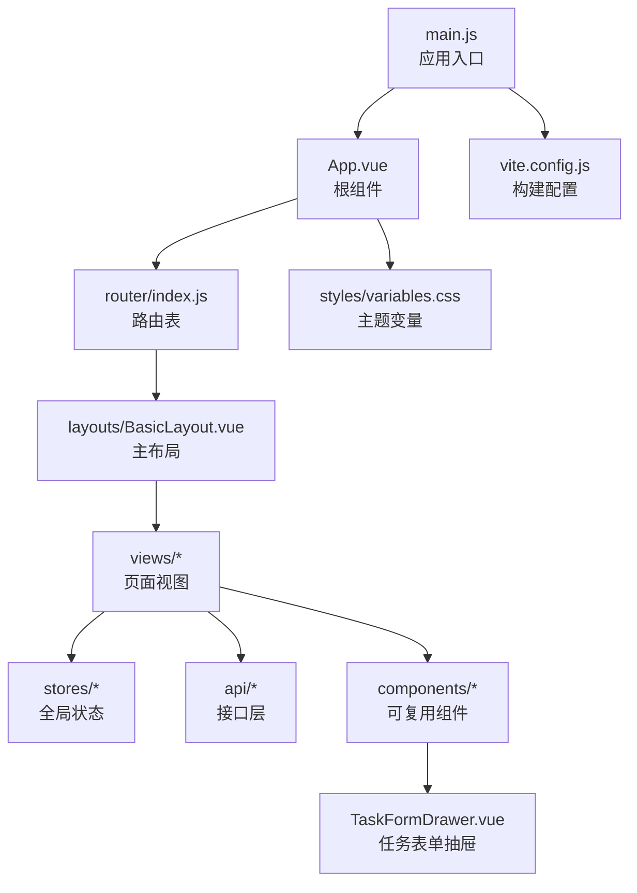

图表来源
- [flow-web/src/main.js](file://flow-web/src/main.js)
- [flow-web/src/App.vue](file://flow-web/src/App.vue)
- [flow-web/src/router/index.js](file://flow-web/src/router/index.js)
- [flow-web/src/layouts/BasicLayout.vue](file://flow-web/src/layouts/BasicLayout.vue)
- [flow-web/src/components/TaskFormDrawer.vue](file://flow-web/src/components/TaskFormDrawer.vue)
- [flow-web/src/styles/variables.css](file://flow-web/src/styles/variables.css)
- [flow-web/vite.config.js](file://flow-web/vite.config.js)

章节来源
- [flow-web/src/main.js](file://flow-web/src/main.js)
- [flow-web/src/App.vue](file://flow-web/src/App.vue)
- [flow-web/src/router/index.js](file://flow-web/src/router/index.js)
- [flow-web/src/layouts/BasicLayout.vue](file://flow-web/src/layouts/BasicLayout.vue)
- [flow-web/src/components/TaskFormDrawer.vue](file://flow-web/src/components/TaskFormDrawer.vue)
- [flow-web/src/styles/variables.css](file://flow-web/src/styles/variables.css)
- [flow-web/vite.config.js](file://flow-web/vite.config.js)

## 核心组件
- 应用入口与根组件
  - main.js 负责初始化应用、注册插件、挂载根组件
  - App.vue 作为根容器，提供全局样式注入与基础结构
- 路由与布局
  - router/index.js 集中定义路由表，支持嵌套路由与权限元信息
  - BasicLayout.vue 提供顶部导航、侧边栏与面包屑区域，承载 views 渲染
- 状态与网络
  - stores/user.js 维护用户会话与权限信息
  - api/request.js 封装请求拦截、错误处理与重试策略
  - api/* 模块按领域聚合接口调用，保持视图层简洁
- 主题与样式
  - styles/variables.css 定义颜色、字号、间距等设计令牌，便于主题切换
- **新增** 任务表单抽屉组件
  - TaskFormDrawer.vue 提供抽屉式任务表单交互，支持表单验证、数据提交与状态管理
  - 集成到任务处理流程中，提升用户操作体验

章节来源
- [flow-web/src/main.js](file://flow-web/src/main.js)
- [flow-web/src/App.vue](file://flow-web/src/App.vue)
- [flow-web/src/router/index.js](file://flow-web/src/router/index.js)
- [flow-web/src/layouts/BasicLayout.vue](file://flow-web/src/layouts/BasicLayout.vue)
- [flow-web/src/stores/user.js](file://flow-web/src/stores/user.js)
- [flow-web/src/api/request.js](file://flow-web/src/api/request.js)
- [flow-web/src/components/TaskFormDrawer.vue](file://flow-web/src/components/TaskFormDrawer.vue)
- [flow-web/src/styles/variables.css](file://flow-web/src/styles/variables.css)

## 架构总览
管理后台采用"布局驱动 + 路由驱动"的架构模式：
- 布局层：BasicLayout 提供稳定的页面骨架，包括顶部导航、侧边栏、面包屑与内容区
- 路由层：router/index.js 将 URL 映射到具体视图，并携带权限与菜单元信息
- 视图层：各 views 模块专注业务展示与交互，通过 stores 与 api 获取数据
- 组件层：可复用组件如 TaskFormDrawer 提供统一的交互模式
- 主题层：通过 variables.css 暴露设计令牌，配合 CSS 变量实现主题定制

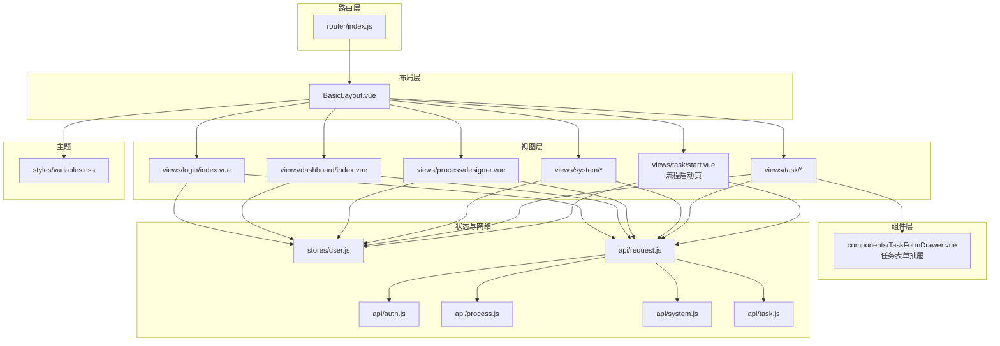

图表来源
- [flow-web/src/router/index.js](file://flow-web/src/router/index.js)
- [flow-web/src/layouts/BasicLayout.vue](file://flow-web/src/layouts/BasicLayout.vue)
- [flow-web/src/views/login/index.vue](file://flow-web/src/views/login/index.vue)
- [flow-web/src/views/dashboard/index.vue](file://flow-web/src/views/dashboard/index.vue)
- [flow-web/src/views/process/designer.vue](file://flow-web/src/views/process/designer.vue)
- [flow-web/src/views/system/admin.vue](file://flow-web/src/views/system/admin.vue)
- [flow-web/src/views/system/dept.vue](file://flow-web/src/views/system/dept.vue)
- [flow-web/src/views/system/dict.vue](file://flow-web/src/views/system/dict.vue)
- [flow-web/src/views/system/log.vue](file://flow-web/src/views/system/log.vue)
- [flow-web/src/views/system/role.vue](file://flow-web/src/views/system/role.vue)
- [flow-web/src/views/system/user.vue](file://flow-web/src/views/system/user.vue)
- [flow-web/src/views/task/todo.vue](file://flow-web/src/views/task/todo.vue)
- [flow-web/src/views/task/done.vue](file://flow-web/src/views/task/done.vue)
- [flow-web/src/views/task/start.vue](file://flow-web/src/views/task/start.vue)
- [flow-web/src/components/TaskFormDrawer.vue](file://flow-web/src/components/TaskFormDrawer.vue)
- [flow-web/src/stores/user.js](file://flow-web/src/stores/user.js)
- [flow-web/src/api/request.js](file://flow-web/src/api/request.js)
- [flow-web/src/api/auth.js](file://flow-web/src/api/auth.js)
- [flow-web/src/api/process.js](file://flow-web/src/api/process.js)
- [flow-web/src/api/system.js](file://flow-web/src/api/system.js)
- [flow-web/src/api/task.js](file://flow-web/src/api/task.js)
- [flow-web/src/styles/variables.css](file://flow-web/src/styles/variables.css)

## 详细组件分析

### 路由设计与页面布局
- 路由设计
  - 使用集中式路由表，为每个页面定义路径、组件与元信息（如标题、权限标识）
  - 支持嵌套路由，用于在 BasicLayout 下渲染不同模块的子页面
  - **新增** 流程启动页面路由，支持 /task/start 路径访问
- 主布局
  - BasicLayout 提供顶部导航、侧边栏与面包屑区域，并在内容区渲染当前路由对应的视图
  - 侧边栏根据路由元信息动态生成菜单项，支持折叠与高亮
- 面包屑导航
  - 基于路由层级自动生成面包屑，显示当前页面的上下文路径
  - 支持自定义面包屑文本与跳转行为

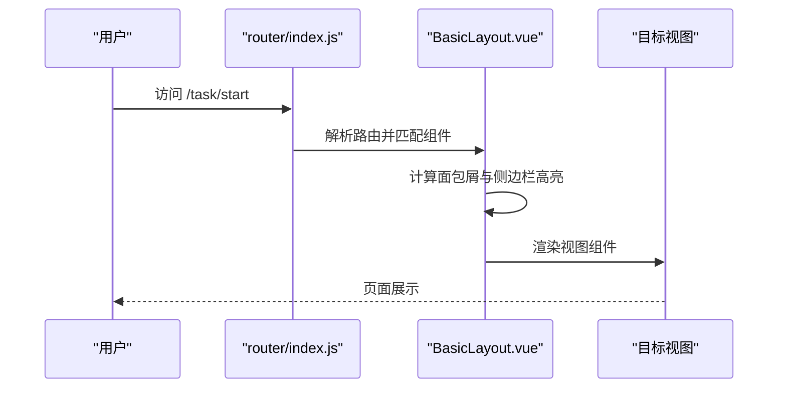

图表来源
- [flow-web/src/router/index.js](file://flow-web/src/router/index.js)
- [flow-web/src/layouts/BasicLayout.vue](file://flow-web/src/layouts/BasicLayout.vue)
- [flow-web/src/views/task/start.vue](file://flow-web/src/views/task/start.vue)

章节来源
- [flow-web/src/router/index.js](file://flow-web/src/router/index.js)
- [flow-web/src/layouts/BasicLayout.vue](file://flow-web/src/layouts/BasicLayout.vue)

### 流程设计器核心功能
流程设计器位于 process/designer.vue，提供拖拽节点编辑、连线绘制与属性配置面板等交互能力。其核心交互流程如下：
- 拖拽式节点编辑
  - 从节点调色板（NodePalette）拖拽节点到画布
  - FlowNode 组件负责节点的渲染、选中与移动
- 连线绘制
  - 在节点之间创建连接，支持条件分支与汇聚
  - 连线状态与节点状态联动更新
- 属性配置面板
  - ConfigPanel 监听选中节点，展示并编辑节点属性
  - 属性变更实时同步至画布模型

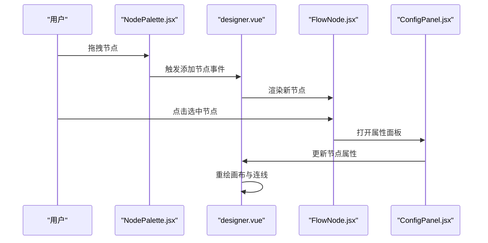

图表来源
- [flow-web/src/views/process/designer.vue](file://flow-web/src/views/process/designer.vue)
- [flow-designer/src/components/NodePalette.jsx](file://flow-designer/src/components/NodePalette.jsx)
- [flow-designer/src/components/FlowNode.jsx](file://flow-designer/src/components/FlowNode.jsx)
- [flow-designer/src/components/ConfigPanel.jsx](file://flow-designer/src/components/ConfigPanel.jsx)

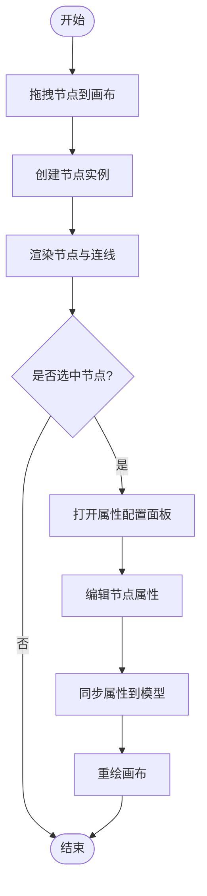

图表来源
- [flow-web/src/views/process/designer.vue](file://flow-web/src/views/process/designer.vue)
- [flow-designer/src/components/FlowNode.jsx](file://flow-designer/src/components/FlowNode.jsx)
- [flow-designer/src/components/ConfigPanel.jsx](file://flow-designer/src/components/ConfigPanel.jsx)

章节来源
- [flow-web/src/views/process/designer.vue](file://flow-web/src/views/process/designer.vue)
- [flow-designer/src/components/FlowNode.jsx](file://flow-designer/src/components/FlowNode.jsx)
- [flow-designer/src/components/ConfigPanel.jsx](file://flow-designer/src/components/ConfigPanel.jsx)
- [flow-designer/src/components/NodePalette.jsx](file://flow-designer/src/components/NodePalette.jsx)

### 登录与鉴权流程
- 登录页面 login/index.vue 提交用户名与密码
- auth.js 调用认证接口，返回用户信息与权限
- user.js 存储用户状态，供后续路由守卫与菜单渲染使用

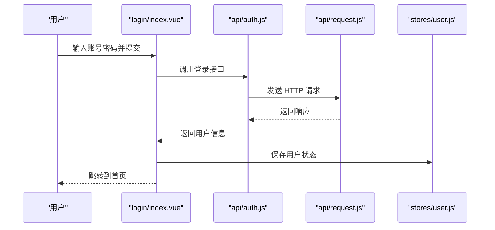

图表来源
- [flow-web/src/views/login/index.vue](file://flow-web/src/views/login/index.vue)
- [flow-web/src/api/auth.js](file://flow-web/src/api/auth.js)
- [flow-web/src/api/request.js](file://flow-web/src/api/request.js)
- [flow-web/src/stores/user.js](file://flow-web/src/stores/user.js)

章节来源
- [flow-web/src/views/login/index.vue](file://flow-web/src/views/login/index.vue)
- [flow-web/src/api/auth.js](file://flow-web/src/api/auth.js)
- [flow-web/src/api/request.js](file://flow-web/src/api/request.js)
- [flow-web/src/stores/user.js](file://flow-web/src/stores/user.js)

### 流程定义与实例管理
- 流程定义列表与编辑器
  - definition/index.vue 展示流程定义列表，支持新建、导入与版本管理
  - designer.vue 提供可视化编辑与导出
- 流程实例监控
  - instance/index.vue 展示运行中的实例，支持查看进度与日志

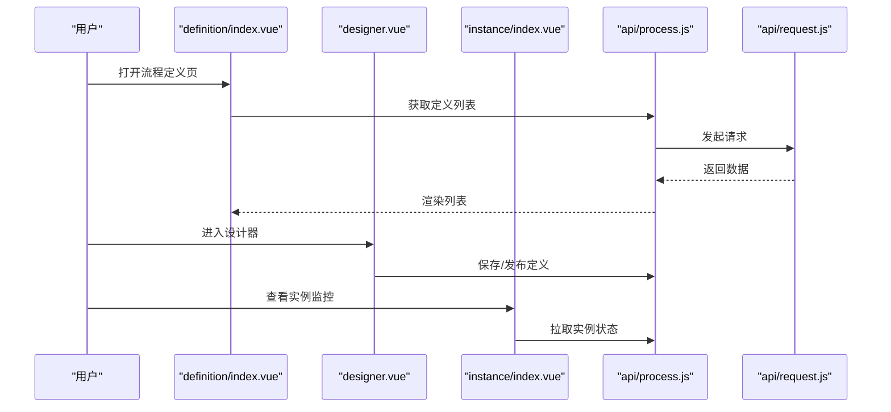

图表来源
- [flow-web/src/views/process/definition/index.vue](file://flow-web/src/views/process/definition/index.vue)
- [flow-web/src/views/process/designer.vue](file://flow-web/src/views/process/designer.vue)
- [flow-web/src/views/process/instance/index.vue](file://flow-web/src/views/process/instance/index.vue)
- [flow-web/src/api/process.js](file://flow-web/src/api/process.js)
- [flow-web/src/api/request.js](file://flow-web/src/api/request.js)

章节来源
- [flow-web/src/views/process/definition/index.vue](file://flow-web/src/views/process/definition/index.vue)
- [flow-web/src/views/process/designer.vue](file://flow-web/src/views/process/designer.vue)
- [flow-web/src/views/process/instance/index.vue](file://flow-web/src/views/process/instance/index.vue)
- [flow-web/src/api/process.js](file://flow-web/src/api/process.js)

### 系统与任务管理
- 系统管理
  - admin.vue、user.vue、role.vue、dept.vue、dict.vue、log.vue 分别对应管理员、用户、角色、部门、字典与审计日志
  - **更新** 用户管理界面 user.vue 进行了小改进，增强了用户管理功能的前端体验，提升了操作便捷性和界面友好性
- **重大更新** 任务中心
  - todo.vue 与 done.vue 分别展示待办与已办任务，支持认领、完成与转交
  - **新增** start.vue 流程启动页面，提供流程实例创建与参数配置功能
  - **新增** TaskFormDrawer 组件，提供抽屉式任务表单交互体验
  - **重大改进** 任务待办页面 todo.vue 增强了任务处理功能，代码量增加158行

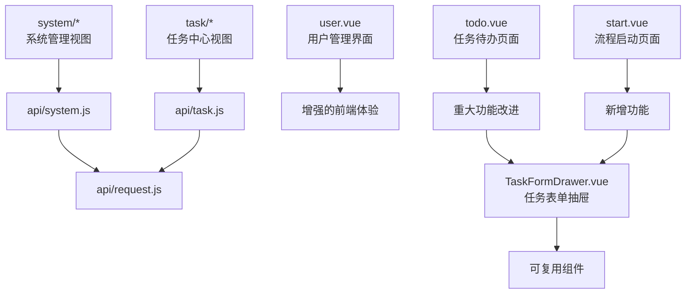

图表来源
- [flow-web/src/views/system/admin.vue](file://flow-web/src/views/system/admin.vue)
- [flow-web/src/views/system/user.vue](file://flow-web/src/views/system/user.vue)
- [flow-web/src/views/system/role.vue](file://flow-web/src/views/system/role.vue)
- [flow-web/src/views/system/dept.vue](file://flow-web/src/views/system/dept.vue)
- [flow-web/src/views/system/dict.vue](file://flow-web/src/views/system/dict.vue)
- [flow-web/src/views/system/log.vue](file://flow-web/src/views/system/log.vue)
- [flow-web/src/views/task/todo.vue](file://flow-web/src/views/task/todo.vue)
- [flow-web/src/views/task/done.vue](file://flow-web/src/views/task/done.vue)
- [flow-web/src/views/task/start.vue](file://flow-web/src/views/task/start.vue)
- [flow-web/src/components/TaskFormDrawer.vue](file://flow-web/src/components/TaskFormDrawer.vue)
- [flow-web/src/api/system.js](file://flow-web/src/api/system.js)
- [flow-web/src/api/task.js](file://flow-web/src/api/task.js)
- [flow-web/src/api/request.js](file://flow-web/src/api/request.js)

章节来源
- [flow-web/src/views/system/admin.vue](file://flow-web/src/views/system/admin.vue)
- [flow-web/src/views/system/user.vue](file://flow-web/src/views/system/user.vue)
- [flow-web/src/views/system/role.vue](file://flow-web/src/views/system/role.vue)
- [flow-web/src/views/system/dept.vue](file://flow-web/src/views/system/dept.vue)
- [flow-web/src/views/system/dict.vue](file://flow-web/src/views/system/dict.vue)
- [flow-web/src/views/system/log.vue](file://flow-web/src/views/system/log.vue)
- [flow-web/src/views/task/todo.vue](file://flow-web/src/views/task/todo.vue)
- [flow-web/src/views/task/done.vue](file://flow-web/src/views/task/done.vue)
- [flow-web/src/views/task/start.vue](file://flow-web/src/views/task/start.vue)
- [flow-web/src/components/TaskFormDrawer.vue](file://flow-web/src/components/TaskFormDrawer.vue)
- [flow-web/src/api/system.js](file://flow-web/src/api/system.js)
- [flow-web/src/api/task.js](file://flow-web/src/api/task.js)
- [flow-web/src/api/request.js](file://flow-web/src/api/request.js)

### 任务表单抽屉组件
**新增** TaskFormDrawer 组件提供了现代化的抽屉式任务表单交互体验：
- 抽屉式布局
  - 从右侧滑入的抽屉界面，不遮挡主要内容区域
  - 支持手动关闭与自动关闭逻辑
- 表单功能
  - 集成表单验证机制，确保数据完整性
  - 支持多种表单控件与动态字段
  - 实时数据绑定与状态管理
- 任务集成
  - 与任务待办页面无缝集成
  - 支持任务认领、完成、转交等操作
  - 提供操作反馈与错误处理

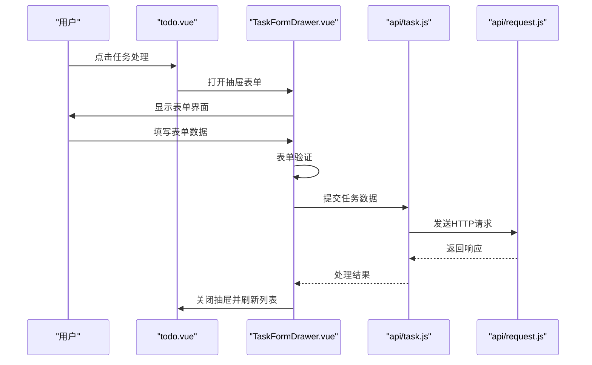

图表来源
- [flow-web/src/views/task/todo.vue](file://flow-web/src/views/task/todo.vue)
- [flow-web/src/components/TaskFormDrawer.vue](file://flow-web/src/components/TaskFormDrawer.vue)
- [flow-web/src/api/task.js](file://flow-web/src/api/task.js)
- [flow-web/src/api/request.js](file://flow-web/src/api/request.js)

章节来源
- [flow-web/src/components/TaskFormDrawer.vue](file://flow-web/src/components/TaskFormDrawer.vue)
- [flow-web/src/views/task/todo.vue](file://flow-web/src/views/task/todo.vue)
- [flow-web/src/api/task.js](file://flow-web/src/api/task.js)

### 流程启动页面
**新增** start.vue 流程启动页面提供了完整的流程实例创建功能：
- 流程选择
  - 展示可用的流程定义列表
  - 支持搜索与筛选功能
- 参数配置
  - 动态加载流程启动表单
  - 支持必填字段验证
  - 提供表单帮助与提示
- 实例创建
  - 调用后端接口创建流程实例
  - 处理创建结果与错误情况
  - 成功后跳转到实例详情页面

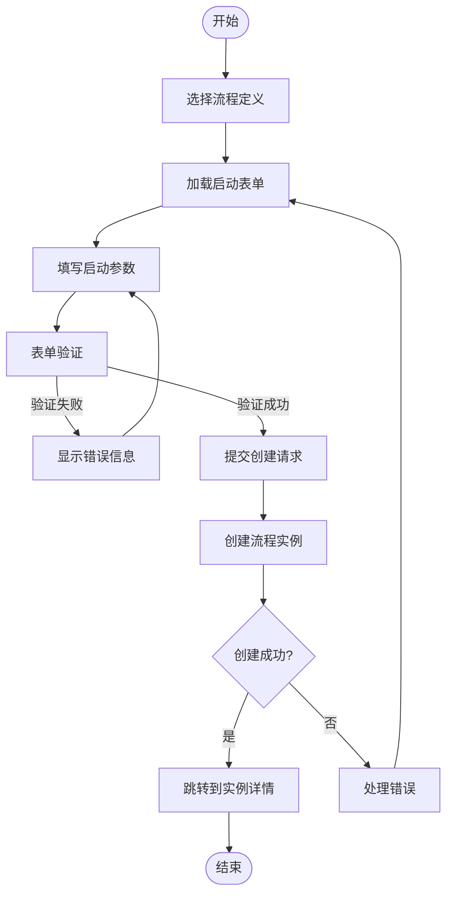

图表来源
- [flow-web/src/views/task/start.vue](file://flow-web/src/views/task/start.vue)
- [flow-web/src/api/process.js](file://flow-web/src/api/process.js)
- [flow-web/src/api/request.js](file://flow-web/src/api/request.js)

章节来源
- [flow-web/src/views/task/start.vue](file://flow-web/src/views/task/start.vue)
- [flow-web/src/api/process.js](file://flow-web/src/api/process.js)
- [flow-web/src/api/request.js](file://flow-web/src/api/request.js)

### 响应式设计与移动端适配
- 栅格与断点
  - 使用 CSS 变量与媒体查询定义断点，确保在不同屏幕尺寸下的布局一致性
- 侧边栏与导航
  - 在小屏设备自动折叠侧边栏，提供抽屉式菜单与顶部汉堡按钮
- 表单与表格
  - 在小屏设备上启用横向滚动与卡片化布局，提升可读性与操作体验
- 触控优化
  - 增大点击热区，优化拖拽与长按交互，适配移动端手势
- **新增** 抽屉组件适配
  - TaskFormDrawer 组件针对移动端进行优化
  - 在小屏设备上自动调整抽屉宽度与交互方式

[本节为通用指导，不直接分析具体文件]

### 组件设计规范
- 命名约定
  - 组件与文件采用 PascalCase 命名，视图以 index.vue 作为默认入口
  - 路由路径使用小写与短横线分隔，语义清晰
- 样式规范
  - 使用 CSS 变量统一管理颜色、字号、间距与阴影
  - 组件样式遵循 BEM 或类似命名空间，避免全局污染
- 交互标准
  - 统一的反馈机制（成功、失败、加载中），通过 request.js 拦截器集中处理
  - 表单校验与错误提示标准化，提升用户体验
- **新增** 抽屉组件规范
  - TaskFormDrawer 遵循统一的抽屉交互模式
  - 提供标准的 props 接口与事件回调
  - 支持主题定制与样式覆盖

[本节为通用指导，不直接分析具体文件]

### 主题定制与国际化
- 主题定制
  - 通过 styles/variables.css 暴露设计令牌，支持明暗主题与品牌色替换
  - 在 BasicLayout 中注入主题类名，实现全局主题切换
- 国际化支持
  - 建议引入 i18n 库，按模块拆分语言包
  - 在路由元信息与视图文案中使用翻译键，避免硬编码字符串

[本节为通用指导，不直接分析具体文件]

### 构建配置与部署优化
- 构建配置
  - vite.config.js 配置开发服务器代理、别名与插件链
  - 按需加载与代码分割，减少首屏体积
- 部署优化
  - 静态资源缓存与 CDN 加速
  - 生产环境开启压缩与 Tree Shaking
  - 错误上报与性能监控接入

章节来源
- [flow-web/vite.config.js](file://flow-web/vite.config.js)
- [flow-web/package.json](file://flow-web/package.json)

## 依赖分析
- 内部依赖
  - 视图层依赖路由与布局，布局依赖主题变量
  - 视图层依赖状态与接口层，接口层统一由 request.js 管理
  - **新增** 任务相关视图依赖 TaskFormDrawer 组件
- 外部依赖
  - 构建工具 Vite 与打包产物优化
  - 可选 UI 框架与图标库（按需集成）

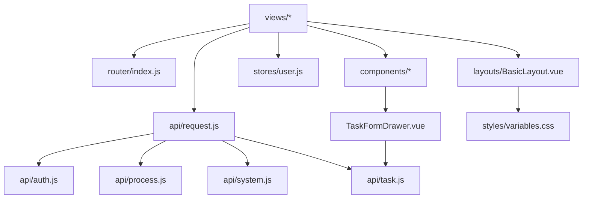

图表来源
- [flow-web/src/router/index.js](file://flow-web/src/router/index.js)
- [flow-web/src/layouts/BasicLayout.vue](file://flow-web/src/layouts/BasicLayout.vue)
- [flow-web/src/stores/user.js](file://flow-web/src/stores/user.js)
- [flow-web/src/api/request.js](file://flow-web/src/api/request.js)
- [flow-web/src/components/TaskFormDrawer.vue](file://flow-web/src/components/TaskFormDrawer.vue)
- [flow-web/src/api/auth.js](file://flow-web/src/api/auth.js)
- [flow-web/src/api/process.js](file://flow-web/src/api/process.js)
- [flow-web/src/api/system.js](file://flow-web/src/api/system.js)
- [flow-web/src/api/task.js](file://flow-web/src/api/task.js)
- [flow-web/src/styles/variables.css](file://flow-web/src/styles/variables.css)

章节来源
- [flow-web/src/router/index.js](file://flow-web/src/router/index.js)
- [flow-web/src/layouts/BasicLayout.vue](file://flow-web/src/layouts/BasicLayout.vue)
- [flow-web/src/stores/user.js](file://flow-web/src/stores/user.js)
- [flow-web/src/api/request.js](file://flow-web/src/api/request.js)
- [flow-web/src/components/TaskFormDrawer.vue](file://flow-web/src/components/TaskFormDrawer.vue)
- [flow-web/src/api/auth.js](file://flow-web/src/api/auth.js)
- [flow-web/src/api/process.js](file://flow-web/src/api/process.js)
- [flow-web/src/api/system.js](file://flow-web/src/api/system.js)
- [flow-web/src/api/task.js](file://flow-web/src/api/task.js)
- [flow-web/src/styles/variables.css](file://flow-web/src/styles/variables.css)

## 性能考虑
- 首屏优化
  - 路由懒加载与组件异步加载，减少初始包体
  - 静态资源预加载与关键 CSS 内联
- 运行时优化
  - 列表虚拟化与分页加载，避免大数据量卡顿
  - 防抖与节流优化高频交互（搜索、拖拽）
- 缓存策略
  - 接口响应缓存与本地持久化，降低重复请求
  - 图片与字体资源缓存控制
- **新增** 抽屉组件优化
  - TaskFormDrawer 组件采用按需加载策略
  - 表单数据局部状态管理，避免不必要的重新渲染

[本节为通用指导，不直接分析具体文件]

## 故障排查指南
- 网络请求问题
  - 检查 request.js 拦截器是否正确处理错误码与超时
  - 确认后端 CORS 与网关转发配置
- 路由与权限
  - 核对路由元信息与用户权限是否一致
  - 检查登录后状态是否正确写入 stores/user.js
- 主题与样式
  - 确认 CSS 变量是否被正确注入到根节点
  - 排查样式冲突与优先级问题
- **新增** 抽屉组件问题
  - 检查 TaskFormDrawer 的 props 传递是否正确
  - 确认抽屉状态管理与生命周期钩子
  - 验证表单验证规则与数据绑定

章节来源
- [flow-web/src/api/request.js](file://flow-web/src/api/request.js)
- [flow-web/src/stores/user.js](file://flow-web/src/stores/user.js)
- [flow-web/src/styles/variables.css](file://flow-web/src/styles/variables.css)
- [flow-web/src/components/TaskFormDrawer.vue](file://flow-web/src/components/TaskFormDrawer.vue)

## 结论
本设计文档围绕管理后台的用户界面展开，明确了 Vue 3 + Vite 的技术选型与项目组织结构，阐述了路由与布局的设计思路，深入分析了流程设计器的核心交互，提供了响应式与移动端适配策略、组件设计规范、主题与国际化方案，以及构建与部署优化建议。通过模块化与可复用的架构，系统具备良好的扩展性与可维护性。**重大更新** 本次更新显著增强了任务处理能力，新增的 TaskFormDrawer 组件提供了现代化的抽屉式交互体验，start.vue 流程启动页面完善了流程实例创建功能，而 todo.vue 的重大改进进一步提升了用户的操作效率与体验。这些改进共同构建了更加完善和友好的任务处理工作流。

## 附录
- 相关工程说明
  - flow-designer 子工程提供流程设计器的独立实现，包含节点、连线与属性面板等核心组件，可作为流程设计能力的参考与复用

章节来源
- [flow-designer/src/main.jsx](file://flow-designer/src/main.jsx)
- [flow-designer/src/App.jsx](file://flow-designer/src/App.jsx)
- [flow-designer/src/components/FlowNode.jsx](file://flow-designer/src/components/FlowNode.jsx)
- [flow-designer/src/components/ConfigPanel.jsx](file://flow-designer/src/components/ConfigPanel.jsx)
- [flow-designer/src/components/NodePalette.jsx](file://flow-designer/src/components/NodePalette.jsx)
- [flow-designer/src/nodeTypes.js](file://flow-designer/src/nodeTypes.js)
- [flow-designer/vite.config.js](file://flow-designer/vite.config.js)
- [flow-designer/package.json](file://flow-designer/package.json)