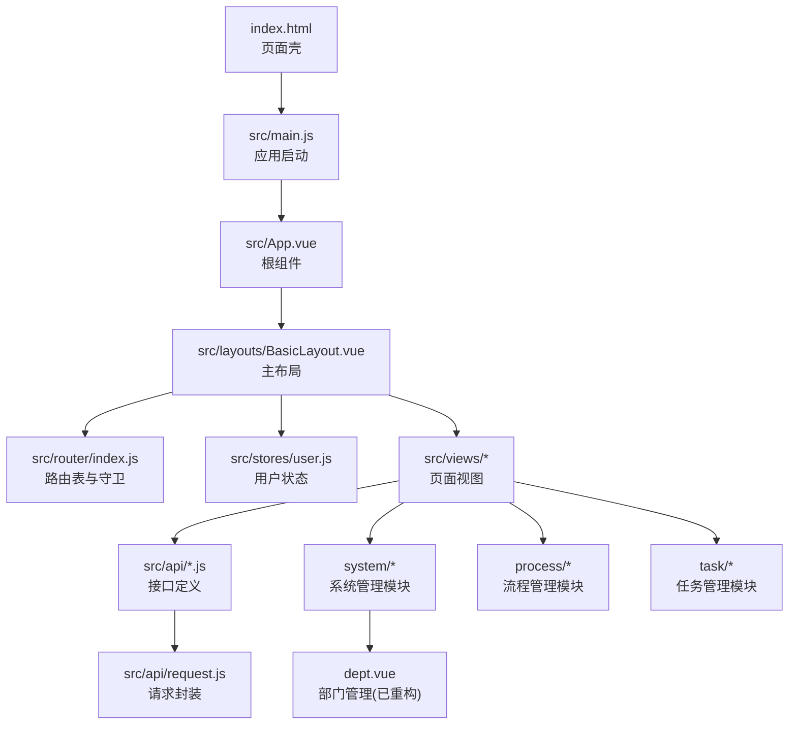
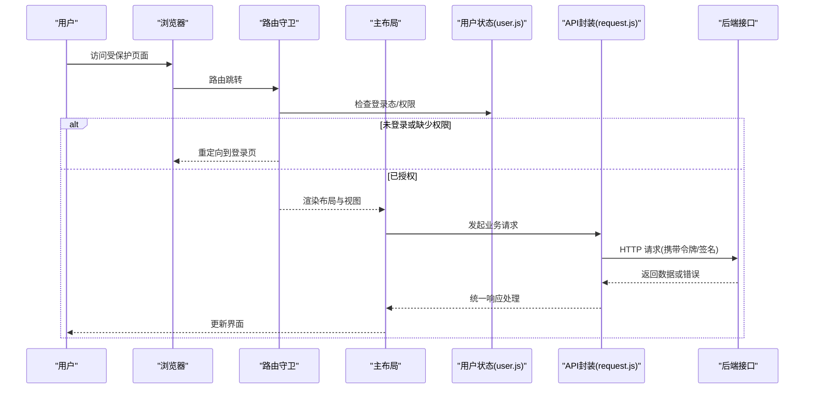
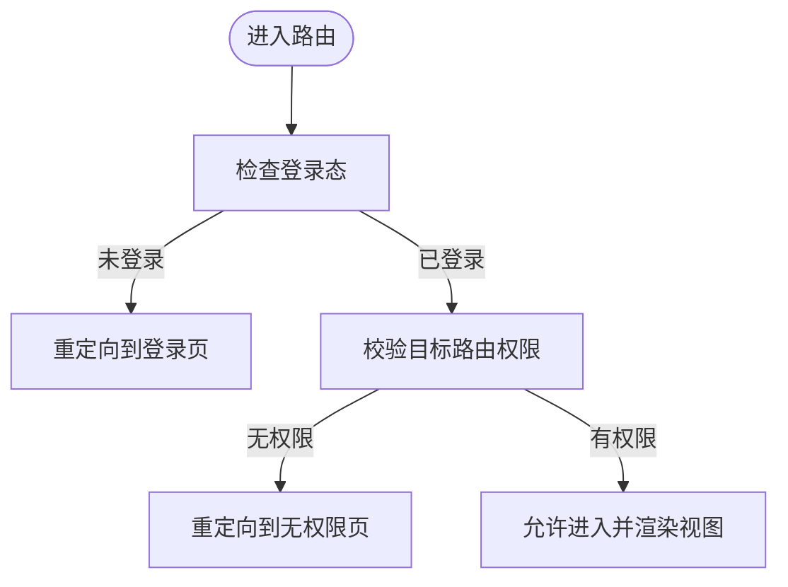
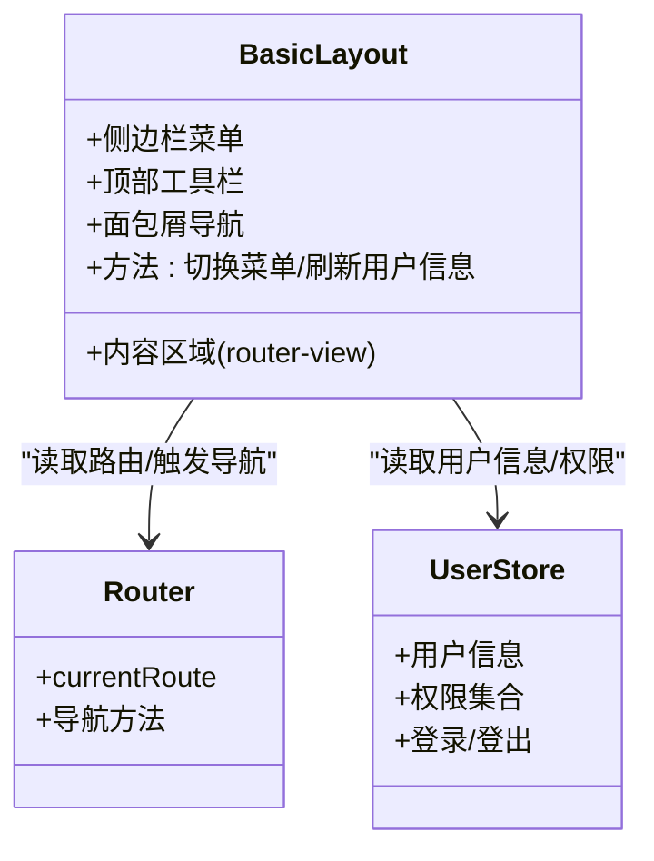
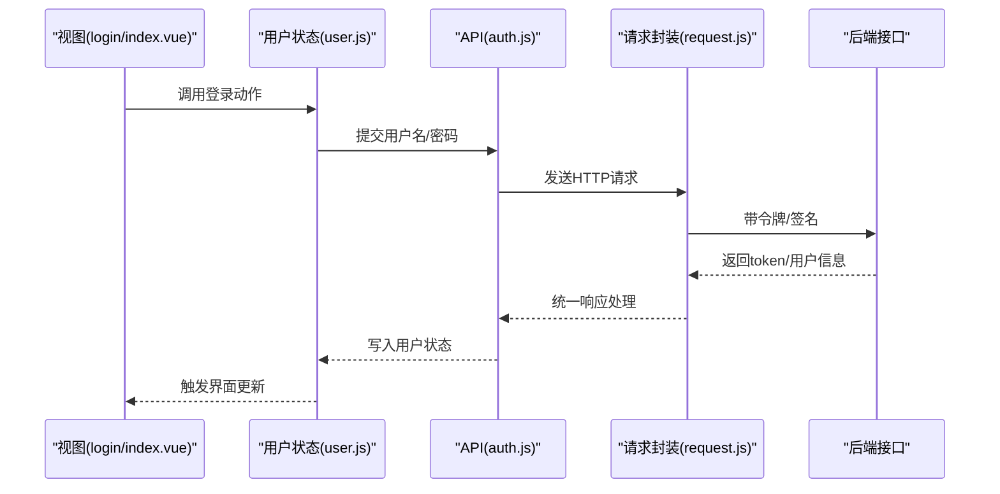
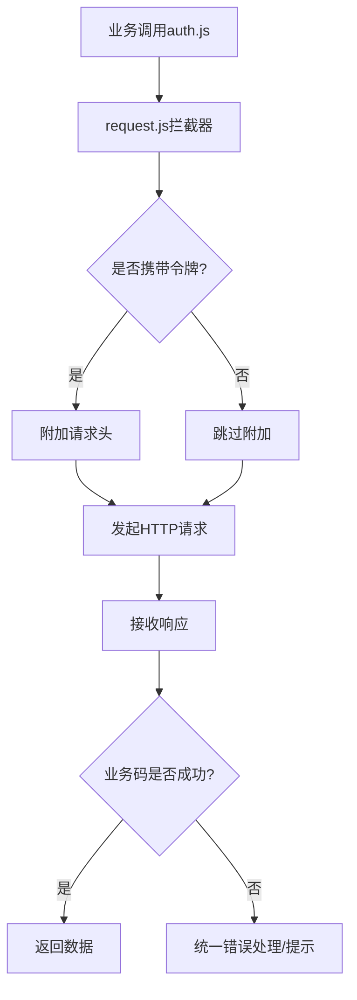
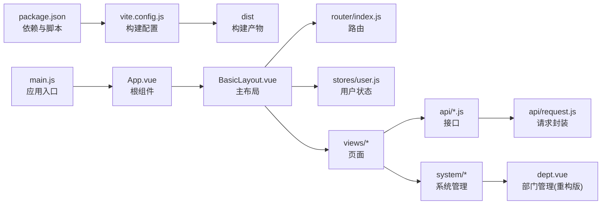

# 管理后台架构

<cite>
**本文引用的文件**   
- [flow-web/package.json](file://flow-web/package.json)
- [flow-web/vite.config.js](file://flow-web/vite.config.js)
- [flow-web/index.html](file://flow-web/index.html)
- [flow-web/src/main.js](file://flow-web/src/main.js)
- [flow-web/src/App.vue](file://flow-web/src/App.vue)
- [flow-web/src/layouts/BasicLayout.vue](file://flow-web/src/layouts/BasicLayout.vue)
- [flow-web/src/router/index.js](file://flow-web/src/router/index.js)
- [flow-web/src/stores/user.js](file://flow-web/src/stores/user.js)
- [flow-web/src/api/request.js](file://flow-web/src/api/request.js)
- [flow-web/src/api/auth.js](file://flow-web/src/api/auth.js)
- [flow-web/src/views/login/index.vue](file://flow-web/src/views/login/index.vue)
- [flow-web/src/views/dashboard/index.vue](file://flow-web/src/views/dashboard/index.vue)
- [flow-web/src/views/system/dept.vue](file://flow-web/src/views/system/dept.vue)
- [flow-web/src/views/process/definition/index.vue](file://flow-web/src/views/process/definition/index.vue)
- [flow-web/src/views/process/instance/index.vue](file://flow-web/src/views/process/instance/index.vue)
- [flow-web/src/views/task/todo.vue](file://flow-web/src/views/task/todo.vue)
- [flow-web/src/views/task/done.vue](file://flow-web/src/views/task/done.vue)
</cite>

## 更新摘要
**变更内容**   
- 部门管理界面重大重构：dept.vue 完成全面重新设计，新增 432 行代码，删除 134 行
- 一致性更新：仪表板、流程定义、实例管理和任务相关页面的统一改进
- 前端架构优化：增强了系统管理模块的交互体验和视觉一致性

## 目录
1. [简介](#简介)
2. [项目结构](#项目结构)
3. [核心组件](#核心组件)
4. [架构总览](#架构总览)
5. [详细组件分析](#详细组件分析)
6. [依赖分析](#依赖分析)
7. [性能考虑](#性能考虑)
8. [故障排查指南](#故障排查指南)
9. [结论](#结论)
10. [附录](#附录)

## 简介
本文件面向"管理后台"前端工程（位于 flow-web），围绕 Vue 3 + Vite 技术栈，系统阐述：
- 技术选型原因与初始化配置
- 应用整体架构：组件层次、状态管理、API 请求封装
- 路由系统：动态路由、权限控制与路由守卫
- 主布局：侧边栏导航、顶部工具栏、面包屑与内容区组织
- 目录结构与代码规范最佳实践
- 构建优化与开发环境设置

**最新更新**：部门管理界面已完成重大重构，提供了更现代化的用户界面和增强的功能体验。

## 项目结构
flow-web 采用基于功能域的前端分层组织方式：入口与全局配置集中在根目录与 src 顶层，业务视图按模块划分至 views，通用布局在 layouts，状态在 stores，网络层在 api。

图表来源
- [flow-web/index.html](file://flow-web/index.html)
- [flow-web/src/main.js](file://flow-web/src/main.js)
- [flow-web/src/App.vue](file://flow-web/src/App.vue)
- [flow-web/src/layouts/BasicLayout.vue](file://flow-web/src/layouts/BasicLayout.vue)
- [flow-web/src/router/index.js](file://flow-web/src/router/index.js)
- [flow-web/src/stores/user.js](file://flow-web/src/stores/user.js)
- [flow-web/src/api/request.js](file://flow-web/src/api/request.js)
- [flow-web/src/views/system/dept.vue](file://flow-web/src/views/system/dept.vue)

章节来源
- [flow-web/package.json](file://flow-web/package.json)
- [flow-web/vite.config.js](file://flow-web/vite.config.js)
- [flow-web/index.html](file://flow-web/index.html)
- [flow-web/src/main.js](file://flow-web/src/main.js)
- [flow-web/src/App.vue](file://flow-web/src/App.vue)
- [flow-web/src/layouts/BasicLayout.vue](file://flow-web/src/layouts/BasicLayout.vue)
- [flow-web/src/router/index.js](file://flow-web/src/router/index.js)
- [flow-web/src/stores/user.js](file://flow-web/src/stores/user.js)
- [flow-web/src/api/request.js](file://flow-web/src/api/request.js)

## 核心组件
- 应用入口 main.js：创建 Vue 应用实例、挂载插件（如路由、状态管理）、注入全局配置并挂载到 DOM。
- 根组件 App.vue：承载全局样式与基础容器，通常作为布局的父级或占位符。
- 主布局 BasicLayout.vue：提供侧边栏、顶部工具栏、面包屑与内容区域，统一页面骨架。
- 路由 index.js：集中声明路由表、注册懒加载、实现路由守卫与动态路由扩展点。
- 用户状态 user.js：维护登录态、用户信息与权限集合，供界面与守卫使用。
- API 层 request.js：封装 axios 实例，统一拦截器（鉴权、错误处理、重试等）。
- 业务接口 auth.js：封装认证相关接口（登录、刷新令牌、获取用户信息等）。
- 视图 login/index.vue 与 dashboard/index.vue：典型登录页与首页示例。
- **新增**：系统管理模块 dept.vue 已完成重大重构，提供更现代化的部门管理界面。

章节来源
- [flow-web/src/main.js](file://flow-web/src/main.js)
- [flow-web/src/App.vue](file://flow-web/src/App.vue)
- [flow-web/src/layouts/BasicLayout.vue](file://flow-web/src/layouts/BasicLayout.vue)
- [flow-web/src/router/index.js](file://flow-web/src/router/index.js)
- [flow-web/src/stores/user.js](file://flow-web/src/stores/user.js)
- [flow-web/src/api/request.js](file://flow-web/src/api/request.js)
- [flow-web/src/api/auth.js](file://flow-web/src/api/auth.js)
- [flow-web/src/views/login/index.vue](file://flow-web/src/views/login/index.vue)
- [flow-web/src/views/dashboard/index.vue](file://flow-web/src/views/dashboard/index.vue)
- [flow-web/src/views/system/dept.vue](file://flow-web/src/views/system/dept.vue)

## 架构总览
下图展示从浏览器到后端的关键交互路径，以及前端内部各层的职责边界。

图表来源
- [flow-web/src/router/index.js](file://flow-web/src/router/index.js)
- [flow-web/src/stores/user.js](file://flow-web/src/stores/user.js)
- [flow-web/src/api/request.js](file://flow-web/src/api/request.js)
- [flow-web/src/layouts/BasicLayout.vue](file://flow-web/src/layouts/BasicLayout.vue)

## 详细组件分析

### 技术选型与初始化配置
- Vue 3 组合式 API 与单文件组件提升可维护性与复用性；Vite 提供极速冷启动与按需热更新，适合中大型后台项目。
- 初始化要点：
  - package.json 中声明依赖与脚本命令，便于本地开发与构建。
  - vite.config.js 配置代理、别名、插件与构建产物策略。
  - index.html 作为 SPA 入口，挂载根节点。
  - main.js 完成应用实例化、插件注册与挂载。

章节来源
- [flow-web/package.json](file://flow-web/package.json)
- [flow-web/vite.config.js](file://flow-web/vite.config.js)
- [flow-web/index.html](file://flow-web/index.html)
- [flow-web/src/main.js](file://flow-web/src/main.js)

### 路由系统与权限控制
- 路由表集中管理，支持懒加载与嵌套路由。
- 路由守卫负责：
  - 校验登录态与过期令牌
  - 根据用户角色/权限决定放行或重定向
  - 动态追加菜单与路由（可选）
- 建议将静态路由与动态路由分离，登录后拉取权限并生成可访问路由。

图表来源
- [flow-web/src/router/index.js](file://flow-web/src/router/index.js)
- [flow-web/src/stores/user.js](file://flow-web/src/stores/user.js)

章节来源
- [flow-web/src/router/index.js](file://flow-web/src/router/index.js)
- [flow-web/src/stores/user.js](file://flow-web/src/stores/user.js)

### 主布局组件设计
- 侧边栏导航：根据路由元信息或权限列表渲染菜单项，支持折叠与高亮当前路由。
- 顶部工具栏：包含搜索、通知、用户头像下拉（退出、切换主题等）。
- 面包屑导航：由路由层级自动生成，支持快速跳转。
- 内容区域：通过 <router-view /> 渲染具体页面。

图表来源
- [flow-web/src/layouts/BasicLayout.vue](file://flow-web/src/layouts/BasicLayout.vue)
- [flow-web/src/router/index.js](file://flow-web/src/router/index.js)
- [flow-web/src/stores/user.js](file://flow-web/src/stores/user.js)

章节来源
- [flow-web/src/layouts/BasicLayout.vue](file://flow-web/src/layouts/BasicLayout.vue)
- [flow-web/src/router/index.js](file://flow-web/src/router/index.js)
- [flow-web/src/stores/user.js](file://flow-web/src/stores/user.js)

### 状态管理模式
- 用户状态 user.js 维护登录态、用户基本信息与权限集合，供路由守卫与 UI 组件消费。
- 建议遵循单一数据源原则，避免分散存储登录态；必要时结合持久化策略（如 localStorage）保障刷新后状态恢复。

图表来源
- [flow-web/src/views/login/index.vue](file://flow-web/src/views/login/index.vue)
- [flow-web/src/stores/user.js](file://flow-web/src/stores/user.js)
- [flow-web/src/api/auth.js](file://flow-web/src/api/auth.js)
- [flow-web/src/api/request.js](file://flow-web/src/api/request.js)

章节来源
- [flow-web/src/stores/user.js](file://flow-web/src/stores/user.js)
- [flow-web/src/api/auth.js](file://flow-web/src/api/auth.js)
- [flow-web/src/api/request.js](file://flow-web/src/api/request.js)
- [flow-web/src/views/login/index.vue](file://flow-web/src/views/login/index.vue)

### API 请求封装
- request.js 统一封装请求实例，集中处理：
  - 请求头注入（如 Authorization、TraceId）
  - 响应拦截（统一成功/失败码处理、错误提示）
  - 超时与重试策略（可选）
  - 环境区分（baseURL、代理）
- auth.js 等业务接口仅关注参数与返回值映射，保持薄封装。

图表来源
- [flow-web/src/api/request.js](file://flow-web/src/api/request.js)
- [flow-web/src/api/auth.js](file://flow-web/src/api/auth.js)

章节来源
- [flow-web/src/api/request.js](file://flow-web/src/api/request.js)
- [flow-web/src/api/auth.js](file://flow-web/src/api/auth.js)

### 页面与视图组织

#### 登录与仪表板
- login/index.vue：登录表单、错误提示、跳转逻辑。
- dashboard/index.vue：首页概览，展示关键指标与快捷入口。

#### 系统管理模块
- **dept.vue**：部门管理界面已完成重大重构，提供现代化的树形结构展示、批量操作和实时搜索功能。
- 其他系统管理页面保持一致的交互模式和视觉风格。

#### 流程管理模块
- process/definition/index.vue：流程定义管理，支持流程模板的创建、编辑和版本控制。
- process/instance/index.vue：流程实例管理，提供实例监控、追踪和操作功能。

#### 任务管理模块
- task/todo.vue：待办任务列表，支持任务分配、优先级排序和状态跟踪。
- task/done.vue：已完成任务历史，提供查询统计和归档管理。

**更新** 所有页面都经过一致性优化，确保统一的用户体验和交互模式。

章节来源
- [flow-web/src/views/login/index.vue](file://flow-web/src/views/login/index.vue)
- [flow-web/src/views/dashboard/index.vue](file://flow-web/src/views/dashboard/index.vue)
- [flow-web/src/views/system/dept.vue](file://flow-web/src/views/system/dept.vue)
- [flow-web/src/views/process/definition/index.vue](file://flow-web/src/views/process/definition/index.vue)
- [flow-web/src/views/process/instance/index.vue](file://flow-web/src/views/process/instance/index.vue)
- [flow-web/src/views/task/todo.vue](file://flow-web/src/views/task/todo.vue)
- [flow-web/src/views/task/done.vue](file://flow-web/src/views/task/done.vue)

## 依赖分析
- 运行时依赖：Vue 3、路由、状态管理等核心库。
- 开发依赖：Vite、ESLint、TypeScript（可选）、CSS 预处理器等。
- 构建产物：dist 目录用于部署，vite.config.js 控制输出与优化策略。

图表来源
- [flow-web/package.json](file://flow-web/package.json)
- [flow-web/vite.config.js](file://flow-web/vite.config.js)
- [flow-web/src/main.js](file://flow-web/src/main.js)
- [flow-web/src/App.vue](file://flow-web/src/App.vue)
- [flow-web/src/layouts/BasicLayout.vue](file://flow-web/src/layouts/BasicLayout.vue)
- [flow-web/src/router/index.js](file://flow-web/src/router/index.js)
- [flow-web/src/stores/user.js](file://flow-web/src/stores/user.js)
- [flow-web/src/api/request.js](file://flow-web/src/api/request.js)
- [flow-web/src/views/system/dept.vue](file://flow-web/src/views/system/dept.vue)

章节来源
- [flow-web/package.json](file://flow-web/package.json)
- [flow-web/vite.config.js](file://flow-web/vite.config.js)

## 性能考虑
- 路由懒加载：对大体积页面进行按需加载，减少首屏资源。
- 组件与图片优化：按需引入第三方库、压缩静态资源、启用缓存策略。
- 请求优化：合并请求、防抖节流、错误重试与降级策略。
- 构建优化：开启代码分割、Tree Shaking、生产环境 SourceMap 控制。
- **新增**：部门管理界面的重构采用了虚拟滚动和分页加载，提升了大数据量下的性能表现。

## 故障排查指南
- 登录流程异常：
  - 检查路由守卫是否正确判断登录态与权限。
  - 确认请求封装是否注入令牌与统一错误处理。
  - 核对用户状态是否持久化并在刷新后恢复。
- 页面空白或白屏：
  - 检查入口挂载与路由匹配是否正常。
  - 查看控制台报错与网络请求状态码。
- 构建失败：
  - 核对依赖版本与 Node 版本兼容性。
  - 检查 vite.config.js 中的路径别名与插件配置。
- **新增**：部门管理界面问题：
  - 检查树形数据的加载和渲染逻辑。
  - 验证批量操作的并发处理和错误回滚机制。
  - 确认搜索功能的实时过滤性能。

章节来源
- [flow-web/src/router/index.js](file://flow-web/src/router/index.js)
- [flow-web/src/api/request.js](file://flow-web/src/api/request.js)
- [flow-web/src/stores/user.js](file://flow-web/src/stores/user.js)
- [flow-web/vite.config.js](file://flow-web/vite.config.js)
- [flow-web/src/views/system/dept.vue](file://flow-web/src/views/system/dept.vue)

## 结论
本项目以 Vue 3 + Vite 为核心，采用清晰的分层与模块化组织：路由集中管理、布局统一骨架、状态单一数据源、请求统一封装。在此基础上，通过路由守卫与权限模型实现安全访问控制，配合构建优化与开发体验提升，形成可扩展、易维护的管理后台前端架构。

**最新进展**：部门管理界面的重大重构显著提升了用户体验和功能完整性，同时保持了与其他模块的一致性。整个系统现在提供了更加现代化和高效的后台管理解决方案。

## 附录
- 目录结构最佳实践
  - 按功能域划分 views 与 api，公共能力放入 components、layouts、utils、styles。
  - 文件命名采用小写短横线风格，组件名使用 PascalCase。
  - 每个模块自描述：README 或注释说明职责与依赖。
- 开发环境设置
  - 安装依赖、启动开发服务器、配置代理与端口。
  - 使用 ESLint/Prettier 统一代码风格。
- 构建与部署
  - 生产构建、产物清理、CDN 与缓存策略。
  - 环境变量管理与多环境打包。
- **新增**：界面设计规范
  - 统一的色彩方案和字体规范。
  - 响应式布局适配不同屏幕尺寸。
  - 无障碍访问支持和键盘导航。
  - 加载状态和错误处理的标准化实现。