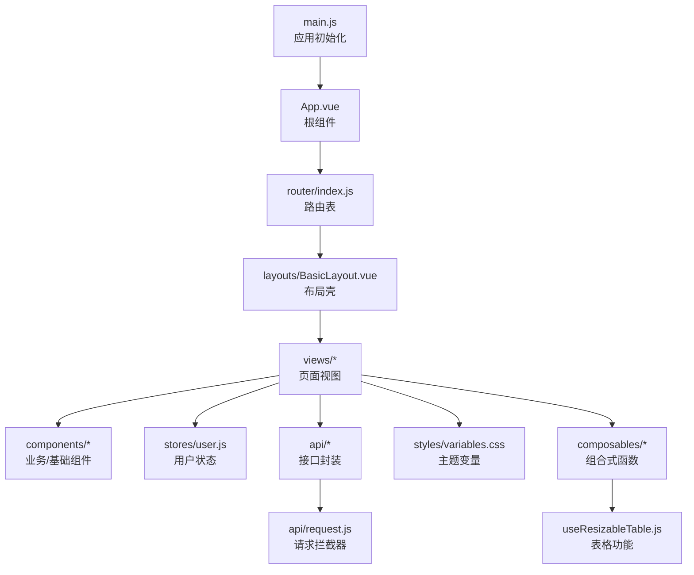
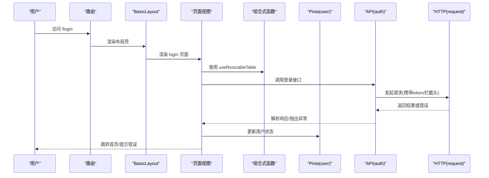
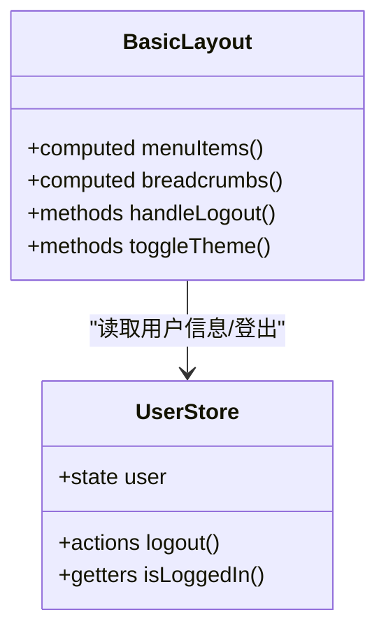
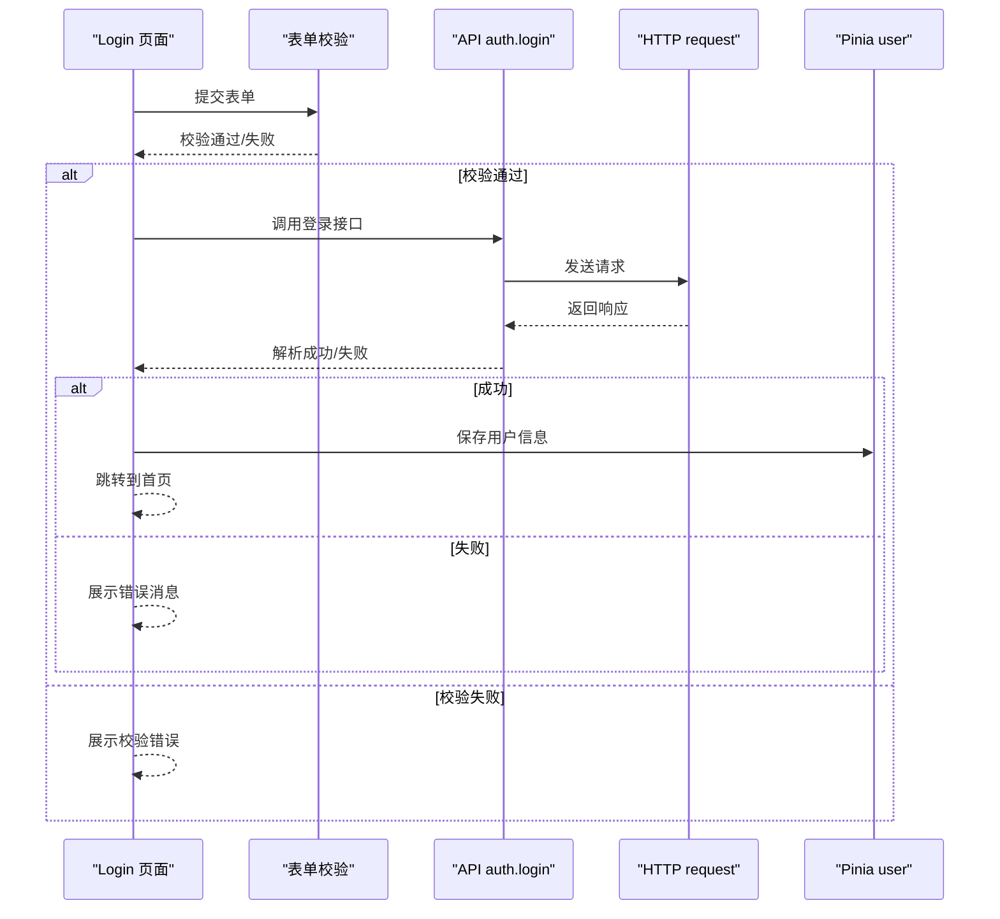
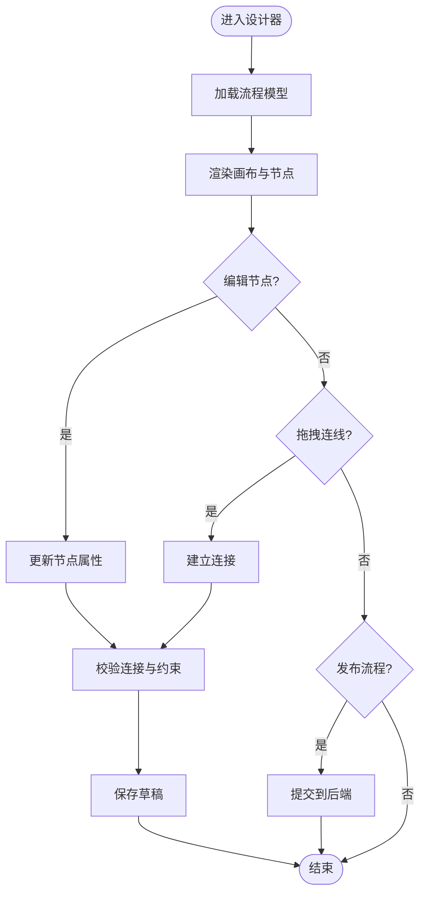
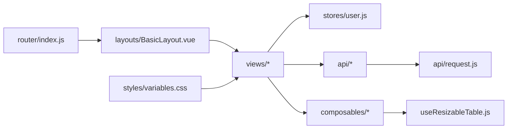

# 组件设计规范

<cite>
**本文引用的文件**   
- [flow-web/src/main.js](file://flow-web/src/main.js)
- [flow-web/src/App.vue](file://flow-web/src/App.vue)
- [flow-web/src/layouts/BasicLayout.vue](file://flow-web/src/layouts/BasicLayout.vue)
- [flow-web/src/router/index.js](file://flow-web/src/router/index.js)
- [flow-web/src/stores/user.js](file://flow-web/src/stores/user.js)
- [flow-web/src/styles/variables.css](file://flow-web/src/styles/variables.css)
- [flow-web/src/views/dashboard/index.vue](file://flow-web/src/views/dashboard/index.vue)
- [flow-web/src/views/login/index.vue](file://flow-web/src/views/login/index.vue)
- [flow-web/src/views/process/designer.vue](file://flow-web/src/views/process/designer.vue)
- [flow-web/src/api/request.js](file://flow-web/src/api/request.js)
- [flow-web/src/api/auth.js](file://flow-web/src/api/auth.js)
- [flow-web/src/composables/useResizableTable.js](file://flow-web/src/composables/useResizableTable.js)
</cite>

## 更新摘要
**所做更改**   
- 新增可调整大小表格功能规范章节
- 更新组件复用策略，增加表格组件标准化行为模式
- 扩展组合式函数使用规范，包含 useResizableTable 的使用指南
- 增强表格组件设计模式的详细说明

## 目录
1. [引言](#引言)
2. [项目结构](#项目结构)
3. [核心组件与约定](#核心组件与约定)
4. [架构总览](#架构总览)
5. [详细组件分析](#详细组件分析)
6. [可调整大小表格组件规范](#可调整大小表格组件规范)
7. [依赖关系分析](#依赖关系分析)
8. [性能考虑](#性能考虑)
9. [故障排查指南](#故障排查指南)
10. [结论](#结论)
11. [附录](#附录)

## 引言
本规范面向Vue前端工程，目标是统一组件开发、复用、状态管理、样式组织、表单设计、测试与性能优化实践。结合仓库中现有前端工程（flow-web），给出可落地的命名约定、目录组织、API契约、主题变量与响应式策略，以及基于Pinia的状态管理模式和表单验证最佳实践。**最新更新**：增强了组件规格说明，新增了可调整大小表格功能和标准化的表格行为模式。

## 项目结构
当前前端工程采用按功能域划分的目录组织方式：
- src/components：通用与业务组件（当前为空，建议逐步沉淀基础组件库）
- src/layouts：布局组件（如 BasicLayout）
- src/views：页面级视图（dashboard、login、process、system、task等）
- src/stores：Pinia状态模块（user.js）
- src/styles：全局样式与主题变量（variables.css）
- src/api：接口封装与请求拦截（request.js、auth.js等）
- src/router：路由配置（index.js）
- src/composables：组合式函数（useResizableTable.js等）
- src/main.js、src/App.vue：应用入口与根组件


```mermaid
graph TB
A["main.js<br/>应用初始化"] --> B["App.vue<br/>根组件"]
B --> C["router/index.js<br/>路由表"]
C --> D["layouts/BasicLayout.vue<br/>布局壳"]
D --> E["views/*<br/>页面视图"]
E --> F["components/*<br/>业务/基础组件"]
E --> G["stores/user.js<br/>用户状态"]
E --> H["api/*<br/>接口封装"]
H --> I["api/request.js<br/>请求拦截器"]
E --> J["styles/variables.css<br/>主题变量"]
E --> K["composables/*<br/>组合式函数"]
K --> L["useResizableTable.js<br/>表格功能"]
```

**图表来源**
- [flow-web/src/main.js](file://flow-web/src/main.js)
- [flow-web/src/App.vue](file://flow-web/src/App.vue)
- [flow-web/src/router/index.js](file://flow-web/src/router/index.js)
- [flow-web/src/layouts/BasicLayout.vue](file://flow-web/src/layouts/BasicLayout.vue)
- [flow-web/src/stores/user.js](file://flow-web/src/stores/user.js)
- [flow-web/src/api/request.js](file://flow-web/src/api/request.js)
- [flow-web/src/styles/variables.css](file://flow-web/src/styles/variables.css)
- [flow-web/src/composables/useResizableTable.js](file://flow-web/src/composables/useResizableTable.js)

**章节来源**
- [flow-web/src/main.js](file://flow-web/src/main.js)
- [flow-web/src/App.vue](file://flow-web/src/App.vue)
- [flow-web/src/router/index.js](file://flow-web/src/router/index.js)
- [flow-web/src/layouts/BasicLayout.vue](file://flow-web/src/layouts/BasicLayout.vue)
- [flow-web/src/stores/user.js](file://flow-web/src/stores/user.js)
- [flow-web/src/api/request.js](file://flow-web/src/api/request.js)
- [flow-web/src/styles/variables.css](file://flow-web/src/styles/variables.css)
- [flow-web/src/composables/useResizableTable.js](file://flow-web/src/composables/useResizableTable.js)

## 核心组件与约定
- 命名约定
  - 组件名使用大驼峰，文件名与组件名一致，后缀 .vue
  - 基础组件以 Base 或 U 前缀区分（如 BaseButton、UInput）
  - 业务组件按领域命名（如 ProcessDesigner、TaskList）
  - 组合式函数以 use 开头（如 useForm、usePagination、useResizableTable）
- 文件组织
  - 单文件组件（SFC）内顺序：template → script → style
  - 子组件与样式尽量就近放置；公共样式放入 styles 目录
  - 路由懒加载：views 下页面按需引入
- Props 与事件
  - Props 必须声明类型、默认值与校验规则
  - 事件命名使用小写+连字符（如 on-submit、on-change）
  - 避免在组件内部直接修改父级数据，通过 emit 通知
- 插槽与作用域插槽
  - 提供具名插槽与默认插槽，便于扩展
  - 作用域插槽暴露必要字段，保持最小暴露原则
- 组件文档
  - 每个组件配套 README 或注释说明用途、Props、Events、Slots、示例

**章节来源**
- [flow-web/src/layouts/BasicLayout.vue](file://flow-web/src/layouts/BasicLayout.vue)
- [flow-web/src/views/dashboard/index.vue](file://flow-web/src/views/dashboard/index.vue)
- [flow-web/src/views/login/index.vue](file://flow-web/src/views/login/index.vue)
- [flow-web/src/views/process/designer.vue](file://flow-web/src/views/process/designer.vue)
- [flow-web/src/composables/useResizableTable.js](file://flow-web/src/composables/useResizableTable.js)

## 架构总览
前端整体采用"路由驱动 + Pinia 状态 + API 封装"的轻量架构：
- 应用入口 main.js 初始化 Vue 实例、插件与全局配置
- App.vue 作为根容器，挂载路由与全局错误边界
- router/index.js 集中管理路由与导航守卫
- layouts/BasicLayout.vue 提供统一布局壳（侧边栏、头部、内容区）
- views/* 承载页面逻辑，组合 components/* 中的基础/业务组件
- stores/user.js 维护用户相关的全局状态
- api/* 封装 HTTP 请求，统一处理鉴权、错误码与重试
- composables/* 提供可复用的组合式函数（如表格功能）
- styles/variables.css 定义主题变量与全局样式基线


```mermaid
sequenceDiagram
participant U as "用户"
participant R as "路由"
participant L as "BasicLayout"
participant V as "页面视图"
participant C as "组合式函数"
participant S as "Pinia(user)"
participant A as "API(auth)"
participant X as "HTTP(request)"
U->>R : 访问 /login
R->>L : 渲染布局壳
L->>V : 渲染 login 页面
V->>C : 使用 useResizableTable
V->>A : 调用登录接口
A->>X : 发起请求(携带token/拦截头)
X-->>A : 返回结果或错误
A-->>V : 解析响应/抛出异常
V->>S : 更新用户状态
V-->>U : 跳转首页/提示错误
```

**图表来源**
- [flow-web/src/router/index.js](file://flow-web/src/router/index.js)
- [flow-web/src/layouts/BasicLayout.vue](file://flow-web/src/layouts/BasicLayout.vue)
- [flow-web/src/views/login/index.vue](file://flow-web/src/views/login/index.vue)
- [flow-web/src/stores/user.js](file://flow-web/src/stores/user.js)
- [flow-web/src/api/auth.js](file://flow-web/src/api/auth.js)
- [flow-web/src/api/request.js](file://flow-web/src/api/request.js)
- [flow-web/src/composables/useResizableTable.js](file://flow-web/src/composables/useResizableTable.js)

## 详细组件分析

### 布局组件 BasicLayout
职责
- 提供统一的头部、侧边栏与主内容区域
- 集成路由出口与面包屑/导航高亮
- 承载全局菜单权限控制与主题切换

关键实现要点
- 使用路由 meta 信息控制菜单显示与权限
- 通过 Pinia 获取用户信息与角色
- 支持动态标题与面包屑生成


```mermaid
classDiagram
class BasicLayout {
+computed menuItems()
+computed breadcrumbs()
+methods handleLogout()
+methods toggleTheme()
}
class UserStore {
+state user
+actions logout()
+getters isLoggedIn()
}
BasicLayout --> UserStore : "读取用户信息/登出"
```

**图表来源**
- [flow-web/src/layouts/BasicLayout.vue](file://flow-web/src/layouts/BasicLayout.vue)
- [flow-web/src/stores/user.js](file://flow-web/src/stores/user.js)

**章节来源**
- [flow-web/src/layouts/BasicLayout.vue](file://flow-web/src/layouts/BasicLayout.vue)
- [flow-web/src/stores/user.js](file://flow-web/src/stores/user.js)

### 登录页面 Login
职责
- 收集用户名/密码并触发登录流程
- 展示表单校验错误与网络异常
- 成功后写入用户状态并跳转

关键实现要点
- 表单校验：必填、格式、长度限制
- 错误处理：统一从 request 拦截器捕获并展示
- 状态同步：登录成功更新 Pinia 用户信息


```mermaid
sequenceDiagram
participant V as "Login 页面"
participant F as "表单校验"
participant A as "API auth.login"
participant X as "HTTP request"
participant S as "Pinia user"
V->>F : 提交表单
F-->>V : 校验通过/失败
alt 校验通过
V->>A : 调用登录接口
A->>X : 发送请求
X-->>A : 返回响应
A-->>V : 解析成功/失败
alt 成功
V->>S : 保存用户信息
V-->>V : 跳转到首页
else 失败
V-->>V : 展示错误消息
end
else 校验失败
V-->>V : 展示校验错误
end
```

**图表来源**
- [flow-web/src/views/login/index.vue](file://flow-web/src/views/login/index.vue)
- [flow-web/src/api/auth.js](file://flow-web/src/api/auth.js)
- [flow-web/src/api/request.js](file://flow-web/src/api/request.js)
- [flow-web/src/stores/user.js](file://flow-web/src/stores/user.js)

**章节来源**
- [flow-web/src/views/login/index.vue](file://flow-web/src/views/login/index.vue)
- [flow-web/src/api/auth.js](file://flow-web/src/api/auth.js)
- [flow-web/src/api/request.js](file://flow-web/src/api/request.js)
- [flow-web/src/stores/user.js](file://flow-web/src/stores/user.js)

### 流程设计器 Designer
职责
- 集成流程可视化编辑能力
- 管理节点类型、连线与属性面板
- 与后端交互保存/发布流程定义

关键实现要点
- 将流程模型与UI解耦，使用 store 或本地状态管理
- 对第三方图形库进行二次封装，暴露稳定API
- 提供撤销/重做、版本对比与导出导入能力


```mermaid
flowchart TD
Start(["进入设计器"]) --> LoadModel["加载流程模型"]
LoadModel --> RenderCanvas["渲染画布与节点"]
RenderCanvas --> EditNode{"编辑节点?"}
EditNode --> |是| UpdateAttrs["更新节点属性"]
UpdateAttrs --> Validate["校验连接与约束"]
Validate --> SaveDraft["保存草稿"]
EditNode --> |否| DragEdge{"拖拽连线?"}
DragEdge --> |是| ConnectNodes["建立连接"]
ConnectNodes --> Validate
DragEdge --> |否| Publish{"发布流程?"}
Publish --> |是| Submit["提交到后端"]
Publish --> |否| End(["结束"])
Submit --> End
SaveDraft --> End
```

**图表来源**
- [flow-web/src/views/process/designer.vue](file://flow-web/src/views/process/designer.vue)

**章节来源**
- [flow-web/src/views/process/designer.vue](file://flow-web/src/views/process/designer.vue)

### 仪表盘 Dashboard
职责
- 展示关键指标与统计卡片
- 聚合多个数据源并呈现图表

关键实现要点
- 数据分页与缓存策略
- 空态与错误态占位
- 响应式布局适配不同屏幕

**章节来源**
- [flow-web/src/views/dashboard/index.vue](file://flow-web/src/views/dashboard/index.vue)

## 可调整大小表格组件规范

### 概述
可调整大小表格功能是项目中新增的核心表格组件能力，通过 `useResizableTable` 组合式函数提供统一的表格列宽调整体验。该功能支持用户自定义列宽、持久化存储和响应式适配。

### 核心特性
- **列宽调整**：支持鼠标拖拽调整列宽，实时预览效果
- **宽度持久化**：自动保存用户设置的列宽到 localStorage
- **响应式适配**：根据屏幕尺寸自动调整表格行为
- **性能优化**：使用防抖技术优化拖拽性能
- **无障碍支持**：键盘操作支持和屏幕阅读器兼容

### 使用方法

#### 基础用法
```javascript
import { useResizableTable } from '@/composables/useResizableTable'

const { 
  tableRef,
  columns,
  handleColumnResize,
  resetColumnWidths 
} = useResizableTable({
  storageKey: 'table-columns',
  minWidth: 50,
  maxWidth: 500
})
```

#### 在模板中使用
```vue
<template>
  <div ref="tableRef">
    <table>
      <thead>
        <tr>
          <th v-for="column in columns" :key="column.key">
            {{ column.title }}
            <div class="resize-handle" @mousedown="handleColumnResize($event, column.key)">
              <span></span>
            </div>
          </th>
        </tr>
      </thead>
      <tbody>
        <!-- 表格内容 -->
      </tbody>
    </table>
  </div>
</template>
```

### API 参考

#### useResizableTable 参数
| 参数 | 类型 | 默认值 | 说明 |
|------|------|--------|------|
| storageKey | string | 'table-columns' | 本地存储键名 |
| minWidth | number | 50 | 最小列宽 |
| maxWidth | number | 500 | 最大列宽 |
| initialWidths | object | {} | 初始列宽配置 |

#### 返回值
| 方法/属性 | 类型 | 说明 |
|-----------|------|------|
| tableRef | Ref | 表格容器引用 |
| columns | ComputedRef | 计算后的列配置 |
| handleColumnResize | Function | 处理列宽调整 |
| resetColumnWidths | Function | 重置所有列宽 |
| isResizing | Ref | 是否正在调整中 |

### 样式规范
```css
.resize-handle {
  position: absolute;
  right: 0;
  top: 0;
  bottom: 0;
  width: 5px;
  cursor: col-resize;
  background: transparent;
  transition: background 0.2s;
}

.resize-handle:hover {
  background: rgba(0, 123, 255, 0.3);
}

.resize-handle.active {
  background: rgba(0, 123, 255, 0.5);
}
```

### 最佳实践
1. **合理设置列宽范围**：根据内容类型设置合适的 min/max 宽度
2. **使用有意义的 storageKey**：为不同表格使用唯一的存储键
3. **提供重置功能**：允许用户恢复默认列宽
4. **移动端适配**：在小屏幕上禁用列宽调整功能
5. **性能考虑**：大数据表格使用虚拟滚动配合列宽调整

**章节来源**
- [flow-web/src/composables/useResizableTable.js](file://flow-web/src/composables/useResizableTable.js)

## 依赖关系分析
- 组件耦合
  - 布局与路由强耦合（菜单、面包屑依赖路由元信息）
  - 页面与API弱耦合（通过接口层抽象，便于替换实现）
  - 页面与状态管理松耦合（通过Pinia actions/getters）
  - 表格组件与组合式函数解耦（通过useResizableTable提供能力）
- 外部依赖
  - 路由：vue-router
  - 状态：Pinia
  - HTTP：axios（由 request.js 封装）
  - UI库：按需引入（建议）
- 潜在循环依赖
  - 避免在组件中直接引用其他组件的store实例，统一通过模块导出
  - 组合式函数不依赖具体组件实现，保持独立性


```mermaid
graph LR
Router["router/index.js"] --> Layout["layouts/BasicLayout.vue"]
Layout --> Views["views/*"]
Views --> Stores["stores/user.js"]
Views --> Api["api/*"]
Api --> Request["api/request.js"]
Views --> Composables["composables/*"]
Composables --> ResizableTable["useResizableTable.js"]
Styles["styles/variables.css"] --> Views
```

**图表来源**
- [flow-web/src/router/index.js](file://flow-web/src/router/index.js)
- [flow-web/src/layouts/BasicLayout.vue](file://flow-web/src/layouts/BasicLayout.vue)
- [flow-web/src/stores/user.js](file://flow-web/src/stores/user.js)
- [flow-web/src/api/request.js](file://flow-web/src/api/request.js)
- [flow-web/src/styles/variables.css](file://flow-web/src/styles/variables.css)
- [flow-web/src/composables/useResizableTable.js](file://flow-web/src/composables/useResizableTable.js)

**章节来源**
- [flow-web/src/router/index.js](file://flow-web/src/router/index.js)
- [flow-web/src/layouts/BasicLayout.vue](file://flow-web/src/layouts/BasicLayout.vue)
- [flow-web/src/stores/user.js](file://flow-web/src/stores/user.js)
- [flow-web/src/api/request.js](file://flow-web/src/api/request.js)
- [flow-web/src/styles/variables.css](file://flow-web/src/styles/variables.css)
- [flow-web/src/composables/useResizableTable.js](file://flow-web/src/composables/useResizableTable.js)

## 性能考虑
- 路由懒加载：为大型页面启用分块加载，减少首屏体积
- 组件按需加载：第三方库按需引入，避免全量打包
- 列表虚拟化：大数据表格/列表使用虚拟滚动
- 图片与资源优化：压缩、懒加载、CDN
- 计算与监听优化：合理使用 computed/watch，避免深层监听
- 请求优化：防抖/节流、并发控制、缓存策略
- 主题与样式：CSS变量与模块化，减少重复样式
- **表格性能优化**：使用防抖技术优化列宽调整，避免频繁DOM操作

**章节来源**
- [flow-web/src/composables/useResizableTable.js](file://flow-web/src/composables/useResizableTable.js)

## 故障排查指南
- 网络与鉴权
  - 检查 request.js 拦截器是否正确注入 token 与错误码处理
  - 确认登录成功后用户状态是否持久化与刷新后恢复
- 路由与权限
  - 检查路由 meta 与导航守卫逻辑，确保未授权页面不可达
- 表单与交互
  - 校验规则是否覆盖所有输入场景
  - 错误提示是否清晰且可定位到具体字段
- 状态一致性
  - 跨页面共享状态是否通过 Pinia 统一管理
  - 避免在组件内直接修改全局状态
- **表格功能问题**
  - 检查 localStorage 权限和存储空间
  - 验证 storageKey 的唯一性避免冲突
  - 确认列宽调整事件绑定正确
  - 检查移动端触摸事件兼容性

**章节来源**
- [flow-web/src/api/request.js](file://flow-web/src/api/request.js)
- [flow-web/src/stores/user.js](file://flow-web/src/stores/user.js)
- [flow-web/src/router/index.js](file://flow-web/src/router/index.js)
- [flow-web/src/composables/useResizableTable.js](file://flow-web/src/composables/useResizableTable.js)

## 结论
本规围绕组件命名与组织、Props/事件契约、状态管理与样式体系，给出了可执行的落地方案。**最新更新**：增强了可调整大小表格功能的完整规范，包括API参考、使用方法和最佳实践。建议在后续迭代中持续沉淀基础组件库、完善表单与主题系统，并通过自动化测试与性能监控保障质量与体验。

## 附录

### 组件命名与文件组织清单
- 组件命名：大驼峰，文件同名 .vue
- 基础组件：Base* 或 U* 前缀
- 业务组件：按领域命名，避免过度拆分
- 组合式函数：use* 前缀（如 useResizableTable）
- 目录组织：components、layouts、views、stores、styles、api、router、composables

**章节来源**
- [flow-web/src/layouts/BasicLayout.vue](file://flow-web/src/layouts/BasicLayout.vue)
- [flow-web/src/views/dashboard/index.vue](file://flow-web/src/views/dashboard/index.vue)
- [flow-web/src/views/login/index.vue](file://flow-web/src/views/login/index.vue)
- [flow-web/src/views/process/designer.vue](file://flow-web/src/views/process/designer.vue)
- [flow-web/src/composables/useResizableTable.js](file://flow-web/src/composables/useResizableTable.js)

### Props 与事件规范清单
- Props：type、required、default、validator
- 事件：on-* 命名，仅传递必要载荷
- 插槽：默认插槽 + 具名插槽，作用域插槽最小暴露

**章节来源**
- [flow-web/src/layouts/BasicLayout.vue](file://flow-web/src/layouts/BasicLayout.vue)
- [flow-web/src/views/login/index.vue](file://flow-web/src/views/login/index.vue)

### 状态管理方案（Pinia）
- 模块划分：按领域拆分（user、process、dict 等）
- 状态设计：扁平化、只读 getters、异步 actions
- 持久化：关键状态持久化（如用户信息）
- 调试：开启 devtools，记录关键 action 日志

**章节来源**
- [flow-web/src/stores/user.js](file://flow-web/src/stores/user.js)

### 样式组织规范
- CSS 模块化：组件级样式优先，必要时使用 scoped
- 主题变量：集中在 variables.css，通过 CSS 变量注入
- 响应式：媒体查询与弹性布局，避免硬编码像素
- 工具类：抽取常用工具类，减少重复

**章节来源**
- [flow-web/src/styles/variables.css](file://flow-web/src/styles/variables.css)

### 表单组件设计规范
- 验证规则：集中定义，支持国际化
- 错误处理：统一错误提示与字段级错误
- 用户体验：实时校验、防抖提交、加载态反馈
- 可访问性：标签关联、键盘导航、ARIA 属性

**章节来源**
- [flow-web/src/views/login/index.vue](file://flow-web/src/views/login/index.vue)

### 组合式函数使用规范
- 命名约定：use* 前缀，描述性功能
- 参数设计：配置对象形式，提供默认值
- 返回值：响应式数据和操作方法
- 错误处理：统一错误处理和日志记录
- 性能优化：合理使用计算属性和防抖

**章节来源**
- [flow-web/src/composables/useResizableTable.js](file://flow-web/src/composables/useResizableTable.js)

### 组件测试策略
- 单元测试：组件渲染、Props/事件、插槽行为
- 集成测试：页面流程、路由守卫、状态联动
- 接口模拟：使用 mock 或 vitest 的 fetch/axios 拦截
- 覆盖率：关键路径达到阈值

### 性能优化建议
- 首屏优化：路由懒加载、关键资源预取
- 运行时优化：虚拟列表、防抖节流、缓存
- 构建优化：Tree-shaking、分包、压缩
- 监控：错误上报、性能埋点、慢请求告警

### 表格组件标准化行为模式
- **统一交互**：所有表格组件遵循相同的列宽调整交互模式
- **一致的外观**：统一的拖拽手柄样式和视觉反馈
- **标准API**：统一的组合式函数接口和配置选项
- **可访问性**：完整的键盘操作和屏幕阅读器支持
- **响应式设计**：移动端友好的自适应行为

**章节来源**
- [flow-web/src/composables/useResizableTable.js](file://flow-web/src/composables/useResizableTable.js)