# 告警通知机制

<cite>
**本文引用的文件**   
- [GlobalExceptionHandler.java](file://flow-engine/src/main/java/com/flow/engine/common/GlobalExceptionHandler.java)
- [BusinessException.java](file://flow-engine/src/main/java/com/flow/engine/common/BusinessException.java)
- [ErrorCode.java](file://flow-engine/src/main/java/com/flow/engine/common/ErrorCode.java)
- [IResultCode.java](file://flow-engine/src/main/java/com/flow/engine/common/IResultCode.java)
- [Result.java](file://flow-engine/src/main/java/com/flow/engine/common/Result.java)
- [RequestContext.java](file://flow-engine/src/main/java/com/flow/engine/common/RequestContext.java)
- [RequestIdFilter.java](file://flow-engine/src/main/java/com/flow/engine/common/RequestIdFilter.java)
- [WebhookConfig.java](file://flow-engine/src/main/java/com/flow/engine/config/WebhookConfig.java)
- [WebhookController.java](file://flow-engine/src/main/java/com/flow/engine/controllers/WebhookController.java)
- [WebhookService.java](file://flow-engine/src/main/java/com/flow/engine/service/WebhookService.java)
- [WebhookScheduler.java](file://flow-engine/src/main/java/com/flow/engine/service/WebhookScheduler.java)
- [Webhook.java](file://flow-engine/src/main/java/com/flow/engine/entity/Webhook.java)
- [WebhookLog.java](file://flow-engine/src/main/java/com/flow/engine/entity/WebhookLog.java)
- [WebhookMapper.java](file://flow-engine/src/main/java/com/flow/engine/mapper/WebhookMapper.java)
- [WebhookLogMapper.java](file://flow-engine/src/main/java/com/flow/engine/mapper/WebhookLogMapper.java)
- [MonitorController.java](file://flow-engine/src/main/java/com/flow/engine/controllers/MonitorController.java)
- [ProcessMonitorService.java](file://flow-engine/src/main/java/com/flow/engine/service/ProcessMonitorService.java)
- [AccessLogInterceptor.java](file://flow-engine/src/main/java/com/flow/engine/interceptor/AccessLogInterceptor.java)
- [AccessLog.java](file://flow-engine/src/main/java/com/flow/engine/entity/AccessLog.java)
- [AccessLogMapper.java](file://flow-engine/src/main/java/com/flow/engine/mapper/AccessLogMapper.java)
- [application.yml](file://flow-engine/src/main/resources/application.yml)
</cite>

## 目录
1. [简介](#简介)
2. [项目结构](#项目结构)
3. [核心组件](#核心组件)
4. [架构总览](#架构总览)
5. [详细组件分析](#详细组件分析)
6. [依赖关系分析](#依赖关系分析)
7. [性能考虑](#性能考虑)
8. [故障排查指南](#故障排查指南)
9. [结论](#结论)
10. [附录](#附录)

## 简介
本技术文档围绕“告警通知机制”展开，聚焦于异常监控与错误处理的统一机制、业务异常的分级分类体系、告警触发条件与规则配置、通知渠道集成方式（邮件、短信、企业微信等）、告警规则自定义与管理界面、告警去重抑制与升级策略，以及告警历史查询与统计分析能力。文档面向开发者与运维人员，提供从代码到架构的完整说明，并给出可视化图示与排障建议。

## 项目结构
后端模块 flow-engine 采用分层架构：common 层定义全局异常处理与统一响应；config 层提供 Webhook 相关配置；controllers 层暴露监控与 Webhook 接口；service 层实现调度与服务逻辑；entity/mapper 层负责持久化；interceptor 层记录访问日志。前端 flow-web 提供监控与系统管理页面。

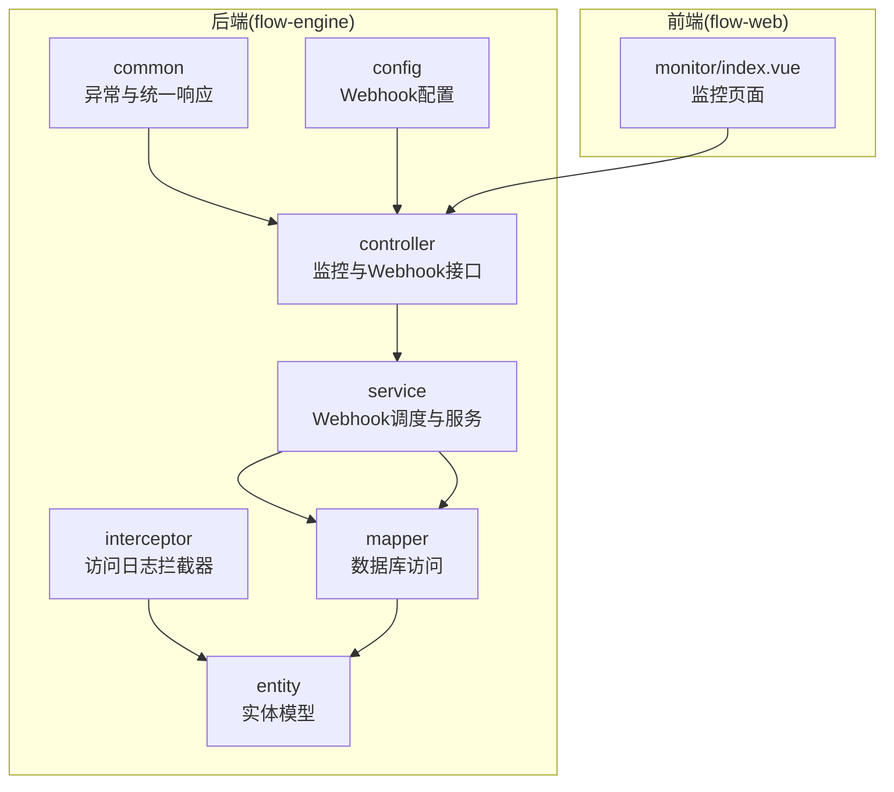

图表来源
- [GlobalExceptionHandler.java](file://flow-engine/src/main/java/com/flow/engine/common/GlobalExceptionHandler.java)
- [WebhookController.java](file://flow-engine/src/main/java/com/flow/engine/controllers/WebhookController.java)
- [WebhookService.java](file://flow-engine/src/main/java/com/flow/engine/service/WebhookService.java)
- [WebhookScheduler.java](file://flow-engine/src/main/java/com/flow/engine/service/WebhookScheduler.java)
- [WebhookMapper.java](file://flow-engine/src/main/java/com/flow/engine/mapper/WebhookMapper.java)
- [WebhookLogMapper.java](file://flow-engine/src/main/java/com/flow/engine/mapper/WebhookLogMapper.java)
- [AccessLogInterceptor.java](file://flow-engine/src/main/java/com/flow/engine/interceptor/AccessLogInterceptor.java)
- [AccessLog.java](file://flow-engine/src/main/java/com/flow/engine/entity/AccessLog.java)
- [MonitorController.java](file://flow-engine/src/main/java/com/flow/engine/controllers/MonitorController.java)

章节来源
- [GlobalExceptionHandler.java](file://flow-engine/src/main/java/com/flow/engine/common/GlobalExceptionHandler.java)
- [WebhookController.java](file://flow-engine/src/main/java/com/flow/engine/controllers/WebhookController.java)
- [WebhookService.java](file://flow-engine/src/main/java/com/flow/engine/service/WebhookService.java)
- [WebhookScheduler.java](file://flow-engine/src/main/java/com/flow/engine/service/WebhookScheduler.java)
- [WebhookMapper.java](file://flow-engine/src/main/java/com/flow/engine/mapper/WebhookMapper.java)
- [WebhookLogMapper.java](file://flow-engine/src/main/java/com/flow/engine/mapper/WebhookLogMapper.java)
- [AccessLogInterceptor.java](file://flow-engine/src/main/java/com/flow/engine/interceptor/AccessLogInterceptor.java)
- [AccessLog.java](file://flow-engine/src/main/java/com/flow/engine/entity/AccessLog.java)
- [MonitorController.java](file://flow-engine/src/main/java/com/flow/engine/controllers/MonitorController.java)

## 核心组件
- 全局异常捕获与处理：通过全局异常处理器统一捕获控制器抛出的异常，结合统一响应体返回结构化错误信息，便于前端展示与后续告警采集。
- 业务异常与错误码：定义业务异常类型与错误码枚举，支撑错误分级分类与标准化输出。
- 请求上下文与追踪：在请求上下文中注入请求ID，贯穿日志与告警链路，提升问题定位效率。
- Webhook 配置与执行：提供 Webhook 配置项、定时任务与执行服务，用于将告警事件投递至外部系统。
- 监控接口与指标：提供监控数据查询接口，支撑错误率、超时等指标的统计与展示。
- 访问日志拦截：记录关键访问信息，为告警与审计提供基础数据。

章节来源
- [GlobalExceptionHandler.java](file://flow-engine/src/main/java/com/flow/engine/common/GlobalExceptionHandler.java)
- [BusinessException.java](file://flow-engine/src/main/java/com/flow/engine/common/BusinessException.java)
- [ErrorCode.java](file://flow-engine/src/main/java/com/flow/engine/common/ErrorCode.java)
- [IResultCode.java](file://flow-engine/src/main/java/com/flow/engine/common/IResultCode.java)
- [Result.java](file://flow-engine/src/main/java/com/flow/engine/common/Result.java)
- [RequestContext.java](file://flow-engine/src/main/java/com/flow/engine/common/RequestContext.java)
- [RequestIdFilter.java](file://flow-engine/src/main/java/com/flow/engine/common/RequestIdFilter.java)
- [WebhookConfig.java](file://flow-engine/src/main/java/com/flow/engine/config/WebhookConfig.java)
- [WebhookController.java](file://flow-engine/src/main/java/com/flow/engine/controllers/WebhookController.java)
- [WebhookService.java](file://flow-engine/src/main/java/com/flow/engine/service/WebhookService.java)
- [WebhookScheduler.java](file://flow-engine/src/main/java/com/flow/engine/service/WebhookScheduler.java)
- [MonitorController.java](file://flow-engine/src/main/java/com/flow/engine/controllers/MonitorController.java)
- [AccessLogInterceptor.java](file://flow-engine/src/main/java/com/flow/engine/interceptor/AccessLogInterceptor.java)

## 架构总览
整体流程包括：请求进入后由过滤器生成请求ID并写入上下文；控制器执行业务逻辑，遇到异常时由全局异常处理器统一捕获并返回标准错误；监控服务基于访问日志与业务指标计算错误率与超时情况；当满足告警阈值时，调度器触发告警事件，服务层根据规则进行去重、抑制与升级，并通过 Webhook 投递到外部通知渠道；告警结果与历史持久化，前端通过监控接口查询与展示。

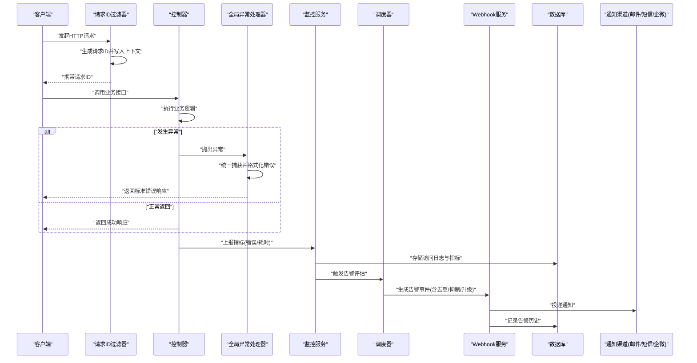

图表来源
- [RequestIdFilter.java](file://flow-engine/src/main/java/com/flow/engine/common/RequestIdFilter.java)
- [RequestContext.java](file://flow-engine/src/main/java/com/flow/engine/common/RequestContext.java)
- [GlobalExceptionHandler.java](file://flow-engine/src/main/java/com/flow/engine/common/GlobalExceptionHandler.java)
- [AccessLogInterceptor.java](file://flow-engine/src/main/java/com/flow/engine/interceptor/AccessLogInterceptor.java)
- [AccessLog.java](file://flow-engine/src/main/java/com/flow/engine/entity/AccessLog.java)
- [MonitorController.java](file://flow-engine/src/main/java/com/flow/engine/controllers/MonitorController.java)
- [ProcessMonitorService.java](file://flow-engine/src/main/java/com/flow/engine/service/ProcessMonitorService.java)
- [WebhookScheduler.java](file://flow-engine/src/main/java/com/flow/engine/service/WebhookScheduler.java)
- [WebhookService.java](file://flow-engine/src/main/java/com/flow/engine/service/WebhookService.java)
- [WebhookLogMapper.java](file://flow-engine/src/main/java/com/flow/engine/mapper/WebhookLogMapper.java)

## 详细组件分析

### 全局异常处理与统一响应
- 职责：集中捕获控制器层抛出的所有异常，区分业务异常与非业务异常，统一封装为标准响应体，确保前端一致体验与可观测性。
- 关键点：
  - 对业务异常按错误码与级别返回，便于上层规则引擎识别与告警。
  - 对未知异常记录必要上下文（如请求ID），避免泄露敏感信息。
  - 与统一响应体协作，保证字段规范与版本兼容。

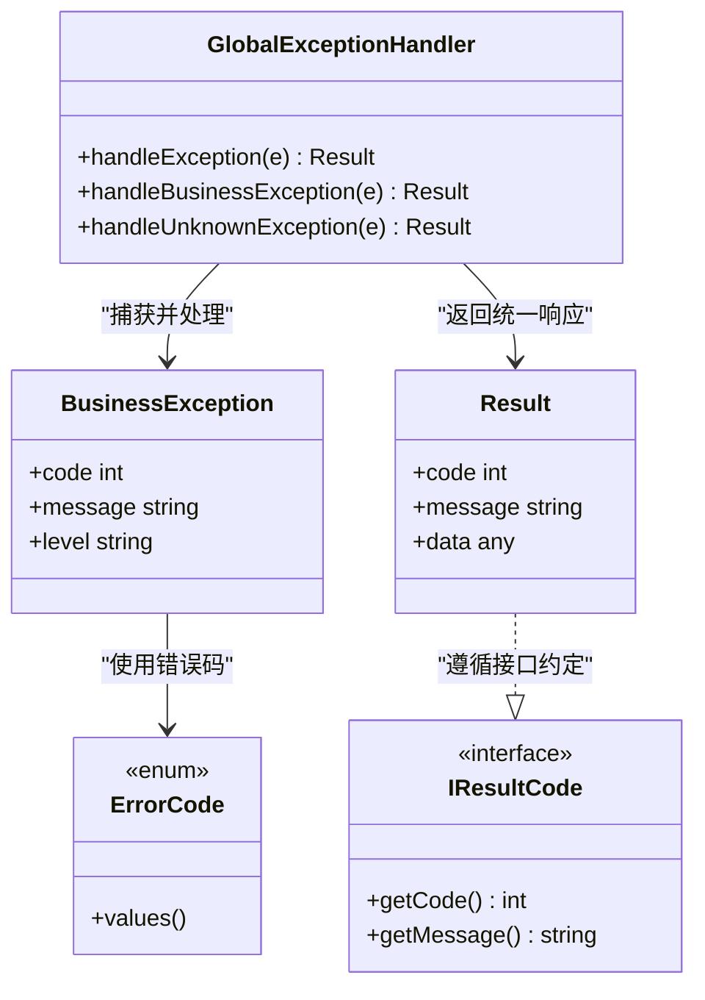

图表来源
- [GlobalExceptionHandler.java](file://flow-engine/src/main/java/com/flow/engine/common/GlobalExceptionHandler.java)
- [BusinessException.java](file://flow-engine/src/main/java/com/flow/engine/common/BusinessException.java)
- [ErrorCode.java](file://flow-engine/src/main/java/com/flow/engine/common/ErrorCode.java)
- [IResultCode.java](file://flow-engine/src/main/java/com/flow/engine/common/IResultCode.java)
- [Result.java](file://flow-engine/src/main/java/com/flow/engine/common/Result.java)

章节来源
- [GlobalExceptionHandler.java](file://flow-engine/src/main/java/com/flow/engine/common/GlobalExceptionHandler.java)
- [BusinessException.java](file://flow-engine/src/main/java/com/flow/engine/common/BusinessException.java)
- [ErrorCode.java](file://flow-engine/src/main/java/com/flow/engine/common/ErrorCode.java)
- [IResultCode.java](file://flow-engine/src/main/java/com/flow/engine/common/IResultCode.java)
- [Result.java](file://flow-engine/src/main/java/com/flow/engine/common/Result.java)

### 业务异常分级分类与错误码规范
- 设计要点：
  - 业务异常包含错误码、消息与严重级别，支持按级别划分告警优先级。
  - 错误码枚举统一管理，覆盖常见业务场景与系统错误，便于扩展与维护。
  - 接口契约通过统一结果码接口约束，确保前后端一致性。

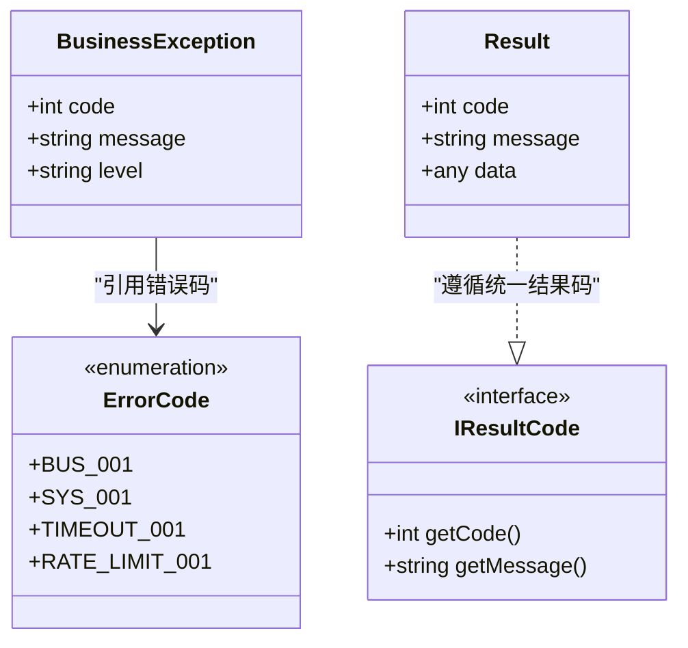

图表来源
- [BusinessException.java](file://flow-engine/src/main/java/com/flow/engine/common/BusinessException.java)
- [ErrorCode.java](file://flow-engine/src/main/java/com/flow/engine/common/ErrorCode.java)
- [IResultCode.java](file://flow-engine/src/main/java/com/flow/engine/common/IResultCode.java)
- [Result.java](file://flow-engine/src/main/java/com/flow/engine/common/Result.java)

章节来源
- [BusinessException.java](file://flow-engine/src/main/java/com/flow/engine/common/BusinessException.java)
- [ErrorCode.java](file://flow-engine/src/main/java/com/flow/engine/common/ErrorCode.java)
- [IResultCode.java](file://flow-engine/src/main/java/com/flow/engine/common/IResultCode.java)
- [Result.java](file://flow-engine/src/main/java/com/flow/engine/common/Result.java)

### 请求上下文与追踪
- 目标：为每个请求生成唯一标识，贯穿日志、监控与告警链路，提升问题定位效率。
- 实现：
  - 过滤器在请求入口处生成请求ID并写入上下文。
  - 上下文对象在后续处理中读取并附加到日志与告警事件中。

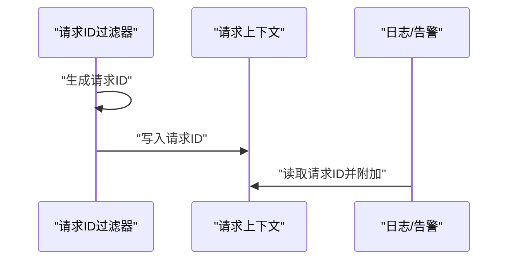

图表来源
- [RequestIdFilter.java](file://flow-engine/src/main/java/com/flow/engine/common/RequestIdFilter.java)
- [RequestContext.java](file://flow-engine/src/main/java/com/flow/engine/common/RequestContext.java)

章节来源
- [RequestIdFilter.java](file://flow-engine/src/main/java/com/flow/engine/common/RequestIdFilter.java)
- [RequestContext.java](file://flow-engine/src/main/java/com/flow/engine/common/RequestContext.java)

### 监控指标与告警触发
- 指标来源：
  - 访问日志拦截器记录请求耗时、状态码等，供监控服务聚合。
  - 监控服务提供接口查询错误率、超时比例等指标。
- 触发条件：
  - 错误率阈值：单位时间内错误请求占比超过阈值。
  - 响应时间超时：P95/P99 或平均响应时间超过阈值。
  - 业务错误码频率：特定错误码出现频次超过阈值。
- 规则配置：
  - 通过配置文件或数据库维护阈值与窗口大小。
  - 支持按接口、业务域、租户维度配置不同规则。

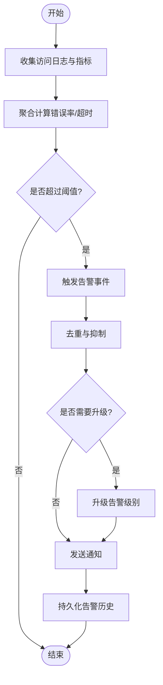

图表来源
- [AccessLogInterceptor.java](file://flow-engine/src/main/java/com/flow/engine/interceptor/AccessLogInterceptor.java)
- [AccessLog.java](file://flow-engine/src/main/java/com/flow/engine/entity/AccessLog.java)
- [MonitorController.java](file://flow-engine/src/main/java/com/flow/engine/controllers/MonitorController.java)
- [ProcessMonitorService.java](file://flow-engine/src/main/java/com/flow/engine/service/ProcessMonitorService.java)

章节来源
- [AccessLogInterceptor.java](file://flow-engine/src/main/java/com/flow/engine/interceptor/AccessLogInterceptor.java)
- [AccessLog.java](file://flow-engine/src/main/java/com/flow/engine/entity/AccessLog.java)
- [MonitorController.java](file://flow-engine/src/main/java/com/flow/engine/controllers/MonitorController.java)
- [ProcessMonitorService.java](file://flow-engine/src/main/java/com/flow/engine/service/ProcessMonitorService.java)

### 通知渠道集成（邮件、短信、企业微信）
- 集成方式：
  - 通过 Webhook 配置项定义各渠道的接入参数（URL、密钥、模板等）。
  - Webhook 服务根据告警事件选择对应渠道并发送通知。
  - 支持重试与失败回退，保障投递可靠性。
- 扩展性：
  - 新增渠道只需实现相应适配器并在配置中注册。
  - 通过规则引擎控制渠道选择与内容模板。

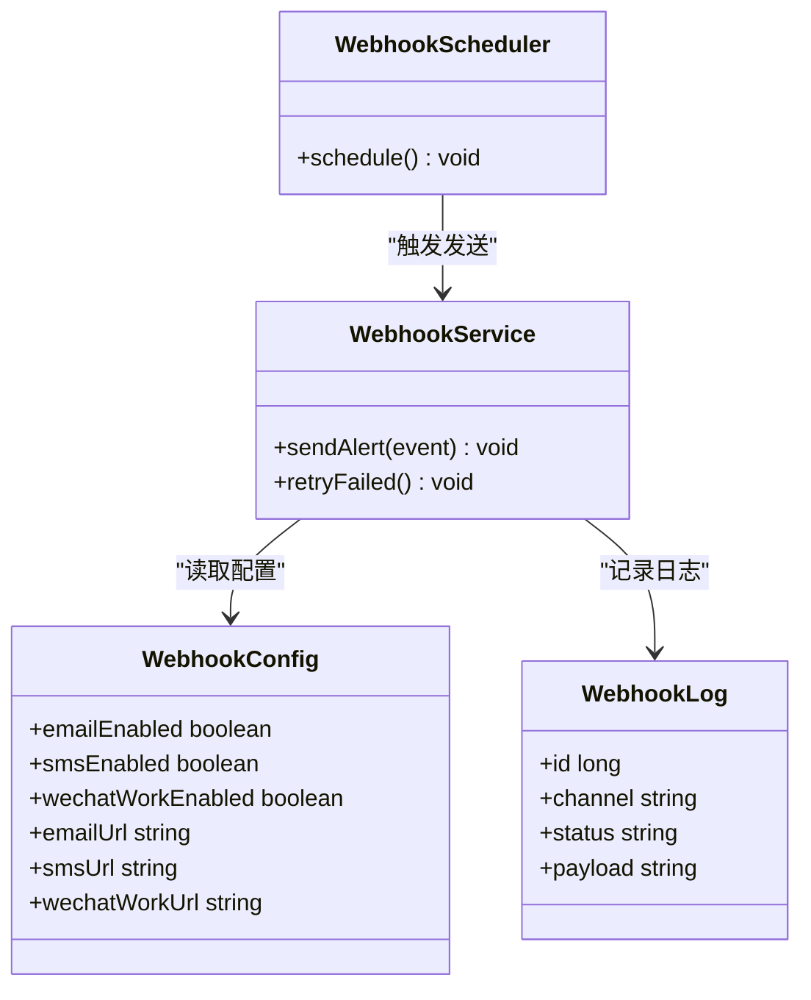

图表来源
- [WebhookConfig.java](file://flow-engine/src/main/java/com/flow/engine/config/WebhookConfig.java)
- [WebhookService.java](file://flow-engine/src/main/java/com/flow/engine/service/WebhookService.java)
- [WebhookScheduler.java](file://flow-engine/src/main/java/com/flow/engine/service/WebhookScheduler.java)
- [WebhookLog.java](file://flow-engine/src/main/java/com/flow/engine/entity/WebhookLog.java)

章节来源
- [WebhookConfig.java](file://flow-engine/src/main/java/com/flow/engine/config/WebhookConfig.java)
- [WebhookService.java](file://flow-engine/src/main/java/com/flow/engine/service/WebhookService.java)
- [WebhookScheduler.java](file://flow-engine/src/main/java/com/flow/engine/service/WebhookScheduler.java)
- [WebhookLog.java](file://flow-engine/src/main/java/com/flow/engine/entity/WebhookLog.java)

### 告警规则自定义配置与管理界面
- 配置管理：
  - 通过数据库表与实体模型维护告警规则（阈值、窗口、维度、渠道等）。
  - 提供管理接口用于增删改查规则。
- 管理界面：
  - 前端监控页面提供规则配置表单与列表展示。
  - 支持实时预览与测试发送。

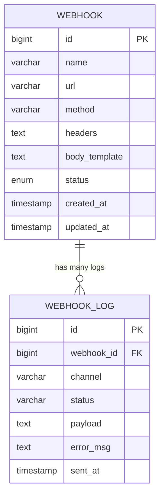

图表来源
- [Webhook.java](file://flow-engine/src/main/java/com/flow/engine/entity/Webhook.java)
- [WebhookLog.java](file://flow-engine/src/main/java/com/flow/engine/entity/WebhookLog.java)
- [WebhookController.java](file://flow-engine/src/main/java/com/flow/engine/controllers/WebhookController.java)

章节来源
- [Webhook.java](file://flow-engine/src/main/java/com/flow/engine/entity/Webhook.java)
- [WebhookLog.java](file://flow-engine/src/main/java/com/flow/engine/entity/WebhookLog.java)
- [WebhookController.java](file://flow-engine/src/main/java/com/flow/engine/controllers/WebhookController.java)

### 告警去重、抑制与升级策略
- 去重：
  - 基于告警键（如接口+错误码+维度）在时间窗口内合并重复告警。
- 抑制：
  - 根据环境、维护窗口或上游依赖状态抑制非关键告警。
- 升级：
  - 当告警持续未解决或影响范围扩大时自动升级级别并切换更紧急的通知渠道。

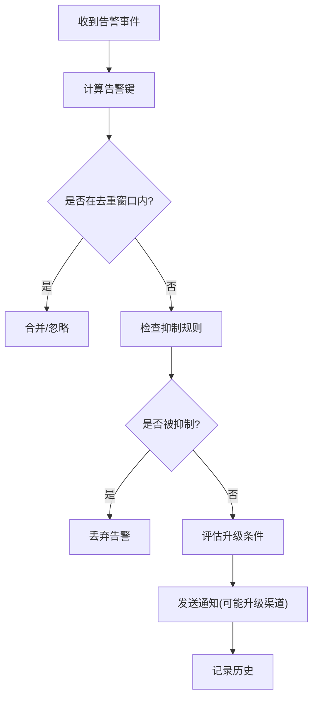

图表来源
- [WebhookService.java](file://flow-engine/src/main/java/com/flow/engine/service/WebhookService.java)
- [WebhookScheduler.java](file://flow-engine/src/main/java/com/flow/engine/service/WebhookScheduler.java)

章节来源
- [WebhookService.java](file://flow-engine/src/main/java/com/flow/engine/service/WebhookService.java)
- [WebhookScheduler.java](file://flow-engine/src/main/java/com/flow/engine/service/WebhookScheduler.java)

### 告警历史查询与统计分析
- 历史查询：
  - 提供接口按时间范围、渠道、状态、告警键等维度查询告警历史。
- 统计分析：
  - 统计告警数量、成功率、失败原因分布、平均恢复时间等。
  - 结合访问日志与监控指标，形成趋势图与报表。

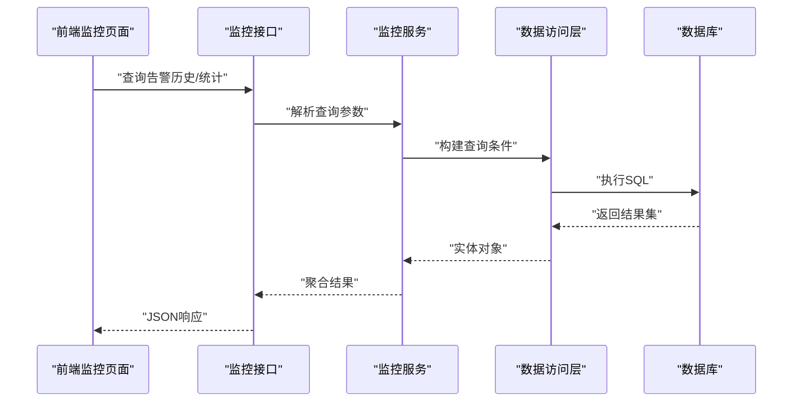

图表来源
- [MonitorController.java](file://flow-engine/src/main/java/com/flow/engine/controllers/MonitorController.java)
- [ProcessMonitorService.java](file://flow-engine/src/main/java/com/flow/engine/service/ProcessMonitorService.java)
- [WebhookLogMapper.java](file://flow-engine/src/main/java/com/flow/engine/mapper/WebhookLogMapper.java)
- [AccessLogMapper.java](file://flow-engine/src/main/java/com/flow/engine/mapper/AccessLogMapper.java)

章节来源
- [MonitorController.java](file://flow-engine/src/main/java/com/flow/engine/controllers/MonitorController.java)
- [ProcessMonitorService.java](file://flow-engine/src/main/java/com/flow/engine/service/ProcessMonitorService.java)
- [WebhookLogMapper.java](file://flow-engine/src/main/java/com/flow/engine/mapper/WebhookLogMapper.java)
- [AccessLogMapper.java](file://flow-engine/src/main/java/com/flow/engine/mapper/AccessLogMapper.java)

## 依赖关系分析
- 组件耦合：
  - 全局异常处理器依赖统一响应体与业务异常类型。
  - 监控服务依赖访问日志与数据库访问层。
  - Webhook 服务依赖配置与调度器，并与通知渠道解耦。
- 外部依赖：
  - 邮件、短信、企业微信等外部服务通过 Webhook 配置与适配层接入。
- 潜在风险：
  - 监控与告警链路过长可能导致延迟，需关注异步与批处理优化。
  - 外部渠道不可用时的重试与熔断策略需完善。

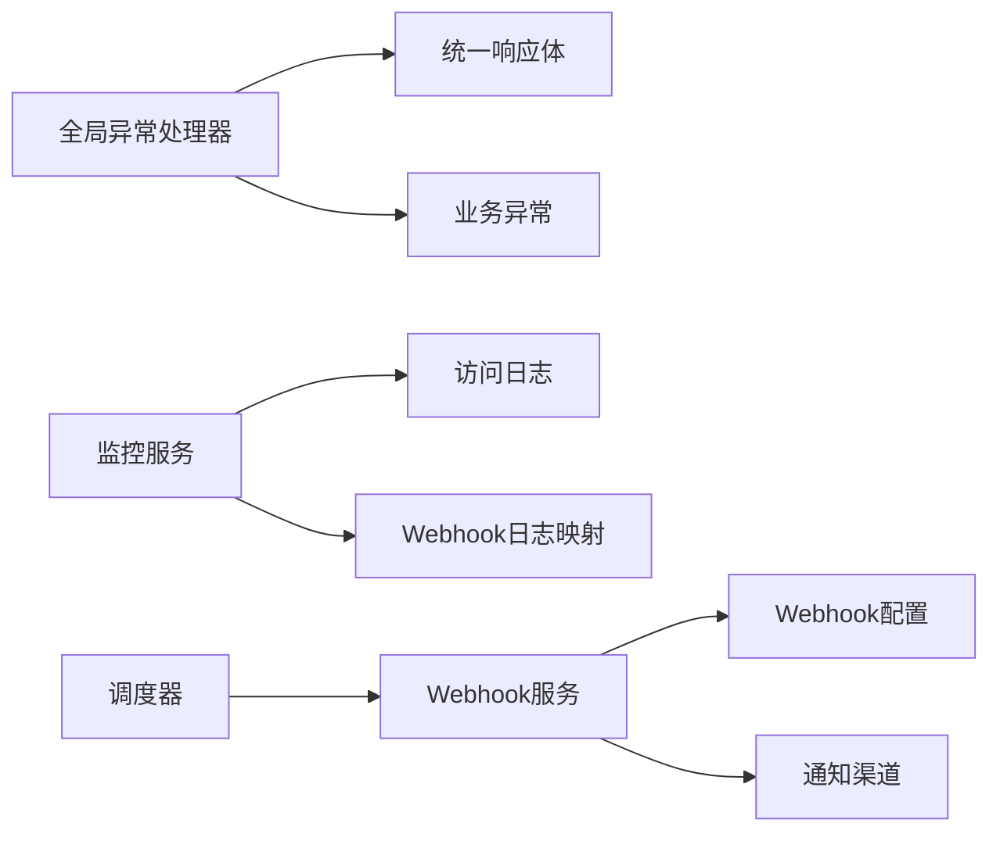

图表来源
- [GlobalExceptionHandler.java](file://flow-engine/src/main/java/com/flow/engine/common/GlobalExceptionHandler.java)
- [Result.java](file://flow-engine/src/main/java/com/flow/engine/common/Result.java)
- [BusinessException.java](file://flow-engine/src/main/java/com/flow/engine/common/BusinessException.java)
- [AccessLogInterceptor.java](file://flow-engine/src/main/java/com/flow/engine/interceptor/AccessLogInterceptor.java)
- [WebhookLogMapper.java](file://flow-engine/src/main/java/com/flow/engine/mapper/WebhookLogMapper.java)
- [WebhookScheduler.java](file://flow-engine/src/main/java/com/flow/engine/service/WebhookScheduler.java)
- [WebhookService.java](file://flow-engine/src/main/java/com/flow/engine/service/WebhookService.java)
- [WebhookConfig.java](file://flow-engine/src/main/java/com/flow/engine/config/WebhookConfig.java)

章节来源
- [GlobalExceptionHandler.java](file://flow-engine/src/main/java/com/flow/engine/common/GlobalExceptionHandler.java)
- [Result.java](file://flow-engine/src/main/java/com/flow/engine/common/Result.java)
- [BusinessException.java](file://flow-engine/src/main/java/com/flow/engine/common/BusinessException.java)
- [AccessLogInterceptor.java](file://flow-engine/src/main/java/com/flow/engine/interceptor/AccessLogInterceptor.java)
- [WebhookLogMapper.java](file://flow-engine/src/main/java/com/flow/engine/mapper/WebhookLogMapper.java)
- [WebhookScheduler.java](file://flow-engine/src/main/java/com/flow/engine/service/WebhookScheduler.java)
- [WebhookService.java](file://flow-engine/src/main/java/com/flow/engine/service/WebhookService.java)
- [WebhookConfig.java](file://flow-engine/src/main/java/com/flow/engine/config/WebhookConfig.java)

## 性能考虑
- 指标聚合与窗口计算：
  - 使用滑动窗口与增量聚合降低内存占用与CPU开销。
- 异步处理：
  - 告警事件入队异步处理，削峰填谷，避免阻塞主流程。
- 去重与抑制：
  - 基于缓存的时间窗口去重，减少重复计算与网络开销。
- 外部渠道：
  - 批量发送与连接池复用，配合重试与熔断策略提高稳定性。

[本节为通用指导，不直接分析具体文件]

## 故障排查指南
- 常见问题：
  - 告警未触发：检查阈值配置、窗口大小与指标采集是否正常。
  - 通知失败：查看 Webhook 日志与渠道返回码，确认配置与网络连通性。
  - 告警风暴：调整去重窗口与抑制规则，必要时启用升级策略。
- 定位手段：
  - 通过请求ID关联日志与告警事件。
  - 使用监控接口查询错误率与超时指标，定位热点接口。
  - 检查 Webhook 配置与调度任务运行状态。

章节来源
- [WebhookLogMapper.java](file://flow-engine/src/main/java/com/flow/engine/mapper/WebhookLogMapper.java)
- [WebhookService.java](file://flow-engine/src/main/java/com/flow/engine/service/WebhookService.java)
- [WebhookScheduler.java](file://flow-engine/src/main/java/com/flow/engine/service/WebhookScheduler.java)
- [MonitorController.java](file://flow-engine/src/main/java/com/flow/engine/controllers/MonitorController.java)
- [ProcessMonitorService.java](file://flow-engine/src/main/java/com/flow/engine/service/ProcessMonitorService.java)

## 结论
本告警通知机制以统一异常处理为基础，结合访问日志与监控指标，实现了可扩展的告警触发与多渠道通知能力。通过规则配置、去重抑制与升级策略，有效避免了告警风暴并提升了运维效率。未来可进一步引入流式计算与机器学习算法，实现动态阈值与智能降噪。

[本节为总结性内容，不直接分析具体文件]

## 附录
- 配置参考：
  - 应用配置文件中包含 Webhook 相关开关与默认值，可按需调整。
- 数据模型：
  - Webhook 与 WebhookLog 实体定义了通知配置与历史记录的结构。

章节来源
- [application.yml](file://flow-engine/src/main/resources/application.yml)
- [Webhook.java](file://flow-engine/src/main/java/com/flow/engine/entity/Webhook.java)
- [WebhookLog.java](file://flow-engine/src/main/java/com/flow/engine/entity/WebhookLog.java)