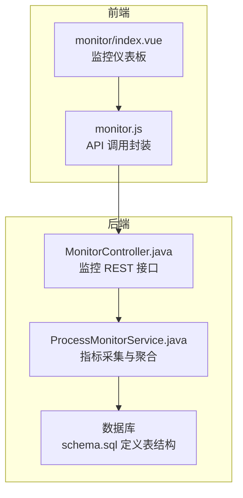
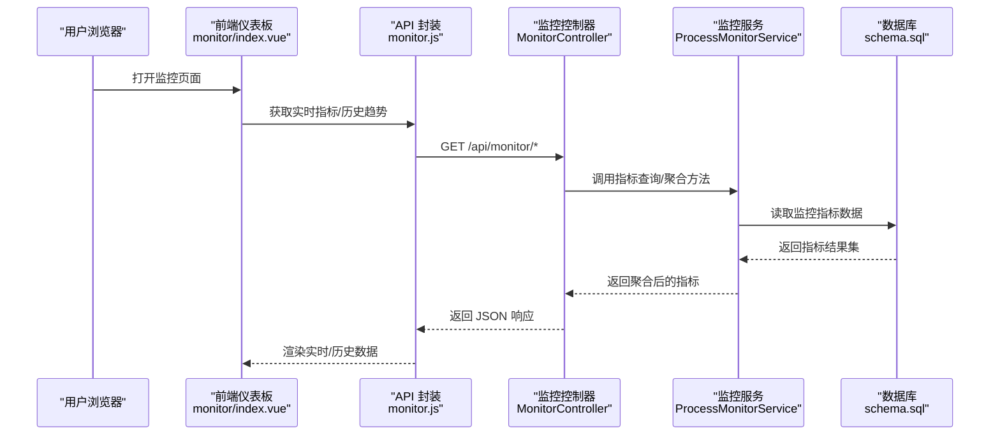
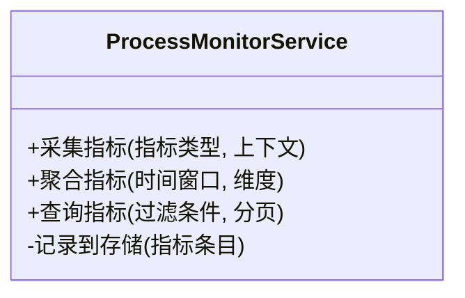
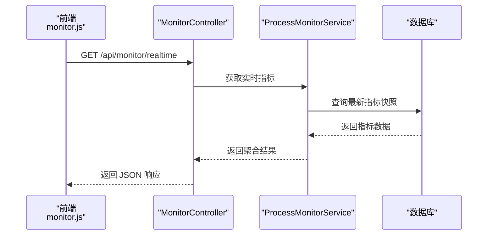
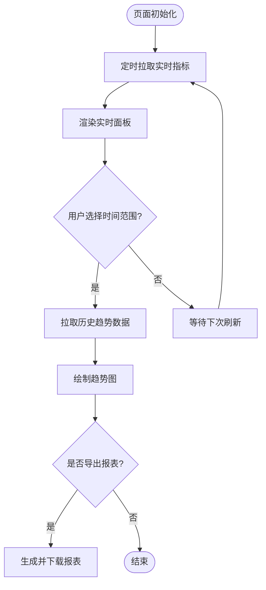
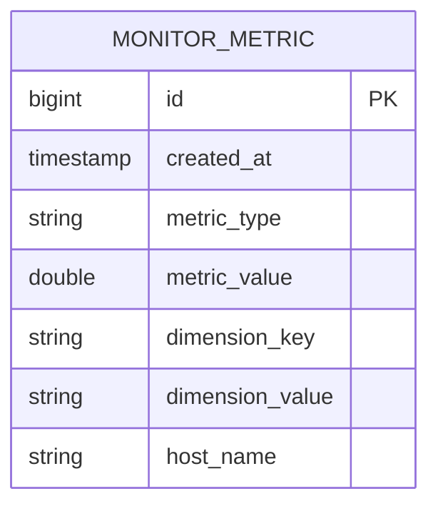
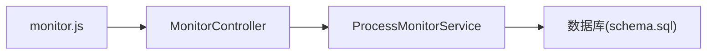

# 性能监控

<cite>
**本文引用的文件**   
- [ProcessMonitorService.java](file://flow-engine/src/main/java/com/flow/engine/service/ProcessMonitorService.java)
- [MonitorController.java](file://flow-engine/src/main/java/com/flow/engine/controllers/MonitorController.java)
- [monitor.js](file://flow-web/src/api/monitor.js)
- [index.vue（监控页面）](file://flow-web/src/views/monitor/index.vue)
- [application.yml](file://flow-engine/src/main/resources/application.yml)
- [schema.sql](file://flow-engine/src/main/resources/db/schema.sql)
- [ProcessMonitorServiceTest.java](file://flow-engine/src/test/java/com/flow/engine/service/ProcessMonitorServiceTest.java)
</cite>

## 目录
1. [简介](#简介)
2. [项目结构](#项目结构)
3. [核心组件](#核心组件)
4. [架构总览](#架构总览)
5. [详细组件分析](#详细组件分析)
6. [依赖关系分析](#依赖关系分析)
7. [性能考量](#性能考量)
8. [故障排查指南](#故障排查指南)
9. [结论](#结论)
10. [附录](#附录)

## 简介
本技术文档围绕“性能监控”能力，聚焦 ProcessMonitorService 的性能指标采集机制、数据存储与查询优化、仪表板展示逻辑、瓶颈识别与告警阈值配置、监控 API 使用指南以及配置与调优建议。目标是帮助读者快速理解并高效使用该监控系统，同时确保监控对系统整体性能的影响最小化。

## 项目结构
本项目采用前后端分离的架构：
- 后端（flow-engine）提供监控数据收集、存储与查询接口
- 前端（flow-web）提供监控仪表板，负责实时刷新与历史趋势展示

图表来源
- [MonitorController.java](file://flow-engine/src/main/java/com/flow/engine/controllers/MonitorController.java)
- [ProcessMonitorService.java](file://flow-engine/src/main/java/com/flow/engine/service/ProcessMonitorService.java)
- [monitor.js](file://flow-web/src/api/monitor.js)
- [index.vue（监控页面）](file://flow-web/src/views/monitor/index.vue)
- [schema.sql](file://flow-engine/src/main/resources/db/schema.sql)

章节来源
- [MonitorController.java](file://flow-engine/src/main/java/com/flow/engine/controllers/MonitorController.java)
- [ProcessMonitorService.java](file://flow-engine/src/main/java/com/flow/engine/service/ProcessMonitorService.java)
- [monitor.js](file://flow-web/src/api/monitor.js)
- [index.vue（监控页面）](file://flow-web/src/views/monitor/index.vue)
- [schema.sql](file://flow-engine/src/main/resources/db/schema.sql)

## 核心组件
- 指标采集服务：ProcessMonitorService
  - 职责：统一采集接口响应时间、数据库查询耗时、内存使用等关键指标；提供聚合与查询能力
- 监控控制器：MonitorController
  - 职责：暴露监控相关 REST 接口，供前端仪表板或外部系统调用
- 前端监控模块：monitor.js 与 monitor/index.vue
  - 职责：封装监控 API 调用，实现实时刷新与历史趋势展示
- 配置与持久化：application.yml 与 schema.sql
  - 职责：监控开关、采样率、保留策略等配置；监控指标表结构定义

章节来源
- [ProcessMonitorService.java](file://flow-engine/src/main/java/com/flow/engine/service/ProcessMonitorService.java)
- [MonitorController.java](file://flow-engine/src/main/java/com/flow/engine/controllers/MonitorController.java)
- [monitor.js](file://flow-web/src/api/monitor.js)
- [index.vue（监控页面）](file://flow-web/src/views/monitor/index.vue)
- [application.yml](file://flow-engine/src/main/resources/application.yml)
- [schema.sql](file://flow-engine/src/main/resources/db/schema.sql)

## 架构总览
监控系统的端到端流程如下：
- 业务请求进入后端，由 MonitorController 接收监控查询请求
- MonitorController 委托 ProcessMonitorService 进行指标聚合与查询
- ProcessMonitorService 从数据库读取监控指标数据，返回给前端
- 前端通过 monitor.js 发起请求，并在 monitor/index.vue 中渲染实时与历史数据

图表来源
- [MonitorController.java](file://flow-engine/src/main/java/com/flow/engine/controllers/MonitorController.java)
- [ProcessMonitorService.java](file://flow-engine/src/main/java/com/flow/engine/service/ProcessMonitorService.java)
- [monitor.js](file://flow-web/src/api/monitor.js)
- [index.vue（监控页面）](file://flow-web/src/views/monitor/index.vue)
- [schema.sql](file://flow-engine/src/main/resources/db/schema.sql)

## 详细组件分析

### 指标采集服务（ProcessMonitorService）
- 功能要点
  - 指标采集：接口响应时间、数据库查询耗时、内存使用等
  - 指标聚合：按时间窗口、维度（如接口路径、SQL 语句、主机名）进行统计
  - 指标查询：支持按时间范围、过滤条件查询历史数据
- 设计模式
  - 分层职责清晰：控制器仅做路由与参数校验，服务层专注指标处理
  - 可插拔扩展：新增指标类型时，可在服务层增加采集与聚合逻辑
- 复杂度与优化
  - 聚合计算通常涉及分组与窗口函数，建议在数据库侧完成大部分聚合以减少网络传输
  - 大时间范围查询应结合分页与索引优化

图表来源
- [ProcessMonitorService.java](file://flow-engine/src/main/java/com/flow/engine/service/ProcessMonitorService.java)

章节来源
- [ProcessMonitorService.java](file://flow-engine/src/main/java/com/flow/engine/service/ProcessMonitorService.java)
- [ProcessMonitorServiceTest.java](file://flow-engine/src/test/java/com/flow/engine/service/ProcessMonitorServiceTest.java)

### 监控控制器（MonitorController）
- 功能要点
  - 暴露监控查询 REST 接口，如实时指标、历史趋势、报表生成等
  - 参数校验与错误处理，返回统一响应格式
- 集成点
  - 与 ProcessMonitorService 协作，将查询参数转换为服务层方法调用
  - 与前端 monitor.js 对接，遵循一致的请求/响应约定

图表来源
- [MonitorController.java](file://flow-engine/src/main/java/com/flow/engine/controllers/MonitorController.java)
- [ProcessMonitorService.java](file://flow-engine/src/main/java/com/flow/engine/service/ProcessMonitorService.java)
- [schema.sql](file://flow-engine/src/main/resources/db/schema.sql)

章节来源
- [MonitorController.java](file://flow-engine/src/main/java/com/flow/engine/controllers/MonitorController.java)

### 前端监控模块（monitor.js 与 index.vue）
- 功能要点
  - monitor.js：封装监控 API 调用，统一处理请求头、错误码与重试策略
  - index.vue：实现实时监控刷新（轮询或 WebSocket）、历史趋势图渲染、筛选与导出
- 交互流程
  - 页面加载后定时拉取实时指标
  - 用户选择时间范围后拉取历史数据并绘制趋势图
  - 支持导出报表（CSV/Excel）

图表来源
- [monitor.js](file://flow-web/src/api/monitor.js)
- [index.vue（监控页面）](file://flow-web/src/views/monitor/index.vue)

章节来源
- [monitor.js](file://flow-web/src/api/monitor.js)
- [index.vue（监控页面）](file://flow-web/src/views/monitor/index.vue)

### 配置与持久化（application.yml 与 schema.sql）
- application.yml
  - 监控开关：控制是否启用指标采集与存储
  - 采样率：控制指标采样频率，平衡精度与开销
  - 保留策略：设置历史数据保留天数与归档策略
- schema.sql
  - 监控指标表结构：包含时间戳、指标类型、指标值、维度字段（如接口路径、SQL 语句、主机名）
  - 索引设计：针对时间戳与维度字段建立索引以优化查询性能

图表来源
- [schema.sql](file://flow-engine/src/main/resources/db/schema.sql)

章节来源
- [application.yml](file://flow-engine/src/main/resources/application.yml)
- [schema.sql](file://flow-engine/src/main/resources/db/schema.sql)

## 依赖关系分析
- 组件耦合
  - MonitorController 依赖 ProcessMonitorService，职责边界清晰
  - 前端 monitor.js 与后端 MonitorController 通过 REST 接口解耦
- 外部依赖
  - 数据库：用于持久化监控指标
  - 可选：缓存（如 Redis）可用于热点指标加速，但需权衡一致性

图表来源
- [monitor.js](file://flow-web/src/api/monitor.js)
- [MonitorController.java](file://flow-engine/src/main/java/com/flow/engine/controllers/MonitorController.java)
- [ProcessMonitorService.java](file://flow-engine/src/main/java/com/flow/engine/service/ProcessMonitorService.java)
- [schema.sql](file://flow-engine/src/main/resources/db/schema.sql)

章节来源
- [monitor.js](file://flow-web/src/api/monitor.js)
- [MonitorController.java](file://flow-engine/src/main/java/com/flow/engine/controllers/MonitorController.java)
- [ProcessMonitorService.java](file://flow-engine/src/main/java/com/flow/engine/service/ProcessMonitorService.java)
- [schema.sql](file://flow-engine/src/main/resources/db/schema.sql)

## 性能考量
- 采集开销控制
  - 合理设置采样率，避免全量采集导致额外负载
  - 对高频指标进行降采样或合并上报
- 查询优化
  - 在数据库侧完成聚合，减少数据传输
  - 为时间戳与维度字段建立合适索引
- 存储策略
  - 设置合理的保留周期，定期归档或删除过期数据
- 前端刷新策略
  - 合理设置轮询间隔，避免频繁请求造成压力
  - 对热点数据进行本地缓存，提升用户体验

[本节为通用指导，不直接分析具体文件]

## 故障排查指南
- 常见问题
  - 监控数据缺失：检查监控开关与采样率配置是否正确
  - 查询缓慢：确认索引是否存在且命中，必要时调整时间范围或增加分页
  - 前端无数据：检查 API 连通性与错误码处理
- 定位步骤
  - 查看后端日志与异常堆栈
  - 核对数据库表结构与索引
  - 验证前端请求参数与时间范围

章节来源
- [ProcessMonitorServiceTest.java](file://flow-engine/src/test/java/com/flow/engine/service/ProcessMonitorServiceTest.java)

## 结论
通过 ProcessMonitorService 与 MonitorController 的协同，配合前端的实时与历史展示，本监控系统能够全面覆盖接口响应时间、数据库查询性能、内存使用等关键指标。通过合理的配置与调优，可以在保证监控精度的同时，将对系统性能的影响降至最低。

[本节为总结性内容，不直接分析具体文件]

## 附录
- 监控 API 使用指南
  - 实时指标查询：GET /api/monitor/realtime
  - 历史趋势查询：GET /api/monitor/history?startTime=&endTime=&metricType=
  - 报表生成：GET /api/monitor/report?format=csv&startTime=&endTime=
- 配置选项
  - 监控开关：enable-monitor=true/false
  - 采样率：monitor.sample-rate=1..N
  - 保留策略：monitor.retention-days=N
- 最佳实践
  - 分环境差异化配置（开发/测试/生产）
  - 对关键接口与 SQL 单独设置更细粒度的采集策略
  - 定期评估指标价值，剔除低价值指标以降低开销

[本节为补充信息，不直接分析具体文件]