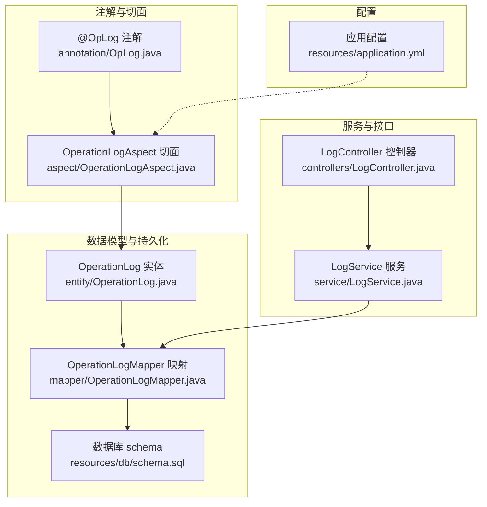
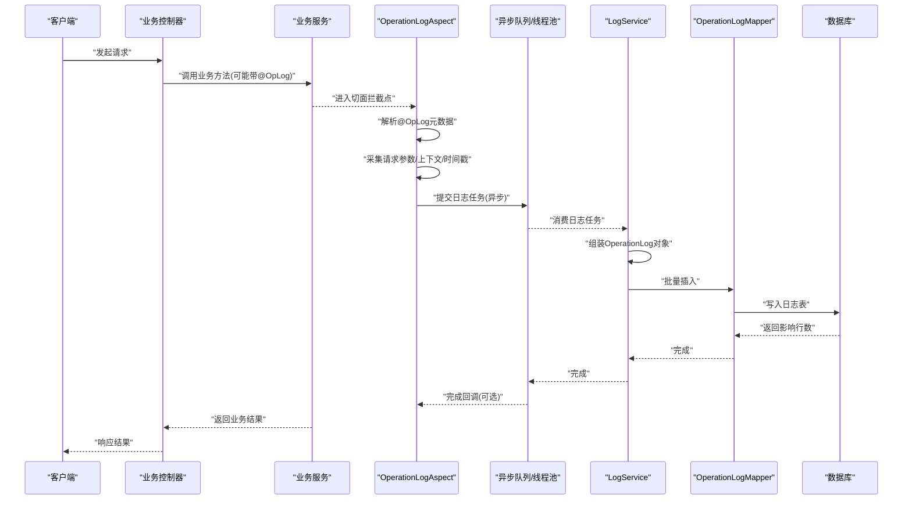
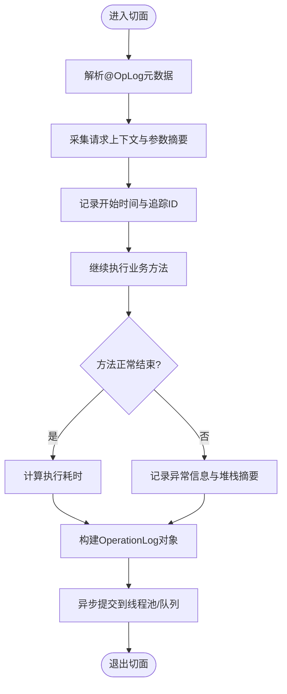
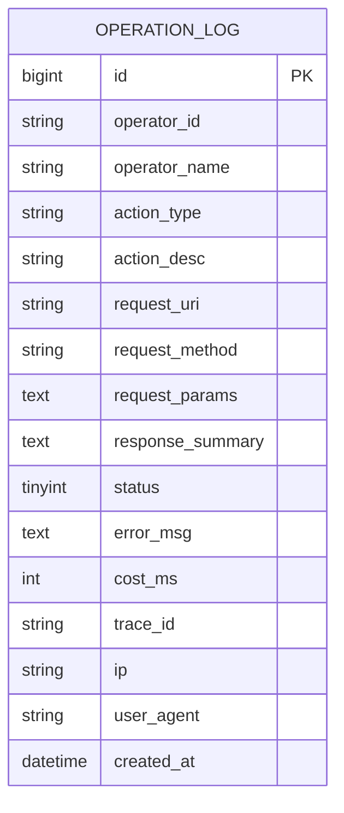
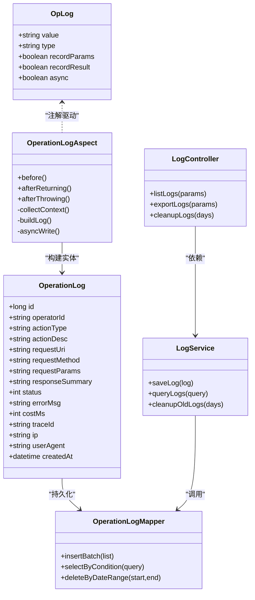

# 操作日志系统

<cite>
**本文引用的文件**   
- [OpLog.java](file://flow-engine/src/main/java/com/flow/engine/annotation/OpLog.java)
- [OperationLogAspect.java](file://flow-engine/src/main/java/com/flow/engine/aspect/OperationLogAspect.java)
- [OperationLog.java](file://flow-engine/src/main/java/com/flow/engine/entity/OperationLog.java)
- [OperationLogMapper.java](file://flow-engine/src/main/java/com/flow/engine/mapper/OperationLogMapper.java)
- [LogController.java](file://flow-engine/src/main/java/com/flow/engine/controllers/LogController.java)
- [LogService.java](file://flow-engine/src/main/java/com/flow/engine/service/LogService.java)
- [application.yml](file://flow-engine/src/main/resources/application.yml)
- [schema.sql](file://flow-engine/src/main/resources/db/schema.sql)
</cite>

## 目录
1. [简介](#简介)
2. [项目结构](#项目结构)
3. [核心组件](#核心组件)
4. [架构总览](#架构总览)
5. [详细组件分析](#详细组件分析)
6. [依赖关系分析](#依赖关系分析)
7. [性能考虑](#性能考虑)
8. [故障排查指南](#故障排查指南)
9. [结论](#结论)
10. [附录](#附录)

## 简介
本技术文档围绕“操作日志系统”展开，重点阐述以下方面：
- AOP切面 OperationLogAspect 的实现原理与织入机制
- @OpLog 自定义注解的设计与使用方式
- 操作日志数据模型（OperationLog）的字段、表结构与索引优化策略
- 日志记录的触发时机与内容采集机制（请求参数、响应结果、执行时间等）
- 异步存储策略与批量写入优化方案
- 日志查询接口设计与使用示例（按用户、操作类型、时间范围等多维度筛选）
- 日志清理策略与存储空间管理方案

## 项目结构
与操作日志相关的核心代码位于 flow-engine 模块中，主要包含注解、AOP切面、实体、持久化映射、控制器与服务层。

图表来源
- [OpLog.java](file://flow-engine/src/main/java/com/flow/engine/annotation/OpLog.java)
- [OperationLogAspect.java](file://flow-engine/src/main/java/com/flow/engine/aspect/OperationLogAspect.java)
- [OperationLog.java](file://flow-engine/src/main/java/com/flow/engine/entity/OperationLog.java)
- [OperationLogMapper.java](file://flow-engine/src/main/java/com/flow/engine/mapper/OperationLogMapper.java)
- [LogController.java](file://flow-engine/src/main/java/com/flow/engine/controllers/LogController.java)
- [LogService.java](file://flow-engine/src/main/java/com/flow/engine/service/LogService.java)
- [schema.sql](file://flow-engine/src/main/resources/db/schema.sql)
- [application.yml](file://flow-engine/src/main/resources/application.yml)

章节来源
- [OpLog.java](file://flow-engine/src/main/java/com/flow/engine/annotation/OpLog.java)
- [OperationLogAspect.java](file://flow-engine/src/main/java/com/flow/engine/aspect/OperationLogAspect.java)
- [OperationLog.java](file://flow-engine/src/main/java/com/flow/engine/entity/OperationLog.java)
- [OperationLogMapper.java](file://flow-engine/src/main/java/com/flow/engine/mapper/OperationLogMapper.java)
- [LogController.java](file://flow-engine/src/main/java/com/flow/engine/controllers/LogController.java)
- [LogService.java](file://flow-engine/src/main/java/com/flow/engine/service/LogService.java)
- [schema.sql](file://flow-engine/src/main/resources/db/schema.sql)
- [application.yml](file://flow-engine/src/main/resources/application.yml)

## 核心组件
- 自定义注解 @OpLog：用于在业务方法上声明式地标记需要记录的操作日志，支持描述、操作类型等元信息。
- AOP切面 OperationLogAspect：拦截被 @OpLog 标注的方法，统一收集上下文信息并落库。
- 实体 OperationLog：定义日志数据的字段与约束，对应数据库表结构。
- 持久化 OperationLogMapper：提供对 OperationLog 表的增删改查能力。
- 服务 LogService：封装日志写入、查询、清理等业务逻辑。
- 控制器 LogController：暴露日志查询与管理接口，供前端或外部系统调用。
- 配置 application.yml：可配置切面开关、线程池、批量大小、保留天数等。
- 数据库 schema.sql：定义日志表结构与索引。

章节来源
- [OpLog.java](file://flow-engine/src/main/java/com/flow/engine/annotation/OpLog.java)
- [OperationLogAspect.java](file://flow-engine/src/main/java/com/flow/engine/aspect/OperationLogAspect.java)
- [OperationLog.java](file://flow-engine/src/main/java/com/flow/engine/entity/OperationLog.java)
- [OperationLogMapper.java](file://flow-engine/src/main/java/com/flow/engine/mapper/OperationLogMapper.java)
- [LogService.java](file://flow-engine/src/main/java/com/flow/engine/service/LogService.java)
- [LogController.java](file://flow-engine/src/main/java/com/flow/engine/controllers/LogController.java)
- [application.yml](file://flow-engine/src/main/resources/application.yml)
- [schema.sql](file://flow-engine/src/main/resources/db/schema.sql)

## 架构总览
下图展示了从方法调用到日志落库的整体流程，包括注解解析、切面拦截、上下文采集、异步写入与查询路径。

图表来源
- [OperationLogAspect.java](file://flow-engine/src/main/java/com/flow/engine/aspect/OperationLogAspect.java)
- [LogService.java](file://flow-engine/src/main/java/com/flow/engine/service/LogService.java)
- [OperationLogMapper.java](file://flow-engine/src/main/java/com/flow/engine/mapper/OperationLogMapper.java)
- [schema.sql](file://flow-engine/src/main/resources/db/schema.sql)

## 详细组件分析

### 自定义注解 @OpLog 设计
- 作用目标与方法级别：用于标注需要记录操作日志的业务方法。
- 关键属性建议：
  - 操作描述：便于审计与展示
  - 操作类型：如创建、更新、删除、审批等，便于分类统计
  - 是否记录参数/结果：控制敏感信息是否入库
  - 是否异步：默认异步，避免阻塞主流程
- 使用方式：在业务方法上添加 @OpLog 并填写必要元信息；切面自动识别并处理。

章节来源
- [OpLog.java](file://flow-engine/src/main/java/com/flow/engine/annotation/OpLog.java)

### AOP切面 OperationLogAspect 实现原理
- 织入机制：基于Spring AOP，通过注解驱动的方式在目标方法前后进行增强。
- 拦截点：匹配所有被 @OpLog 标注的方法。
- 前置处理：
  - 解析注解元数据（描述、类型、是否记录参数/结果等）
  - 采集请求上下文（用户、IP、请求头、请求体摘要等）
  - 记录开始时间与追踪ID
- 后置处理：
  - 计算执行耗时
  - 捕获异常状态与错误信息
  - 根据配置决定是否记录响应结果
- 异步写入：将日志任务投递至线程池或消息队列，避免同步IO阻塞主流程。
- 幂等与容错：
  - 为每条日志生成唯一标识，防止重复写入
  - 失败重试与死信队列（可选）
- 性能保护：
  - 参数/结果大小限制与脱敏
  - 采样率控制（可选）

图表来源
- [OperationLogAspect.java](file://flow-engine/src/main/java/com/flow/engine/aspect/OperationLogAspect.java)

章节来源
- [OperationLogAspect.java](file://flow-engine/src/main/java/com/flow/engine/aspect/OperationLogAspect.java)

### 数据模型与表结构设计
- 实体 OperationLog 字段建议：
  - id：主键
  - operator_id：操作人ID
  - operator_name：操作人名称
  - action_type：操作类型
  - action_desc：操作描述
  - request_uri：请求URI
  - request_method：请求方法
  - request_params：请求参数（脱敏/摘要）
  - response_summary：响应摘要（可选）
  - status：执行状态（成功/失败）
  - error_msg：错误信息摘要
  - cost_ms：执行耗时（毫秒）
  - trace_id：链路追踪ID
  - ip：客户端IP
  - user_agent：客户端UA
  - created_at：创建时间
- 表结构关系：
  - 单表设计，便于高并发写入与查询
  - 关联用户表时可通过外键或冗余字段提升查询性能
- 索引优化策略：
  - 复合索引：operator_id + created_at（按用户+时间查询）
  - 复合索引：action_type + created_at（按操作类型+时间查询）
  - 单列索引：trace_id（链路追踪定位）
  - 分区策略：按月份或天分区，利于历史数据归档与清理

图表来源
- [OperationLog.java](file://flow-engine/src/main/java/com/flow/engine/entity/OperationLog.java)
- [schema.sql](file://flow-engine/src/main/resources/db/schema.sql)

章节来源
- [OperationLog.java](file://flow-engine/src/main/java/com/flow/engine/entity/OperationLog.java)
- [schema.sql](file://flow-engine/src/main/resources/db/schema.sql)

### 日志记录触发时机与内容采集
- 触发时机：
  - 方法进入前：采集请求参数、用户上下文、时间戳
  - 方法结束后：记录耗时、状态、异常信息
- 内容采集：
  - 请求参数：仅采集必要字段，并进行脱敏与长度限制
  - 响应结果：仅记录摘要或状态码，避免大对象入库
  - 执行时间：精确到毫秒，便于性能分析
  - 追踪ID：贯穿一次请求的全链路，便于问题定位
- 安全与合规：
  - 敏感字段过滤（密码、Token等）
  - 最大体积限制与采样策略

章节来源
- [OperationLogAspect.java](file://flow-engine/src/main/java/com/flow/engine/aspect/OperationLogAspect.java)

### 异步存储与批量写入优化
- 异步策略：
  - 使用线程池或消息队列解耦写入，降低主流程延迟
  - 支持背压与限流，避免内存溢出
- 批量写入：
  - 聚合多条日志后一次性插入，减少事务开销
  - 批次大小与刷新间隔可配置
- 可靠性保障：
  - 失败重试与告警
  - 本地缓冲与持久化（可选）

章节来源
- [LogService.java](file://flow-engine/src/main/java/com/flow/engine/service/LogService.java)
- [application.yml](file://flow-engine/src/main/resources/application.yml)

### 日志查询接口设计
- 查询条件：
  - 用户ID/用户名
  - 操作类型
  - 时间范围（开始-结束）
  - 状态（成功/失败）
  - 关键字（URI、描述模糊匹配）
- 分页与排序：
  - 支持页码与每页条数
  - 默认按创建时间倒序
- 返回字段：
  - 基础信息、状态、耗时、摘要等
- 使用示例（概念性说明）：
  - GET /api/logs?operatorId=xxx&actionType=update&startTime=...&endTime=...&page=1&size=20

章节来源
- [LogController.java](file://flow-engine/src/main/java/com/flow/engine/controllers/LogController.java)
- [LogService.java](file://flow-engine/src/main/java/com/flow/engine/service/LogService.java)

### 日志清理策略与空间管理
- 清理策略：
  - 按保留天数自动清理过期日志
  - 按月/周分表或分区，便于归档与压缩
- 空间管理：
  - 监控表大小与增长趋势
  - 冷数据迁移至低成本存储（对象存储/归档库）
- 自动化任务：
  - 定时任务定期执行清理与归档
  - 清理完成后释放磁盘空间并更新统计指标

章节来源
- [LogService.java](file://flow-engine/src/main/java/com/flow/engine/service/LogService.java)
- [application.yml](file://flow-engine/src/main/resources/application.yml)

## 依赖关系分析
- 组件耦合：
  - 切面依赖注解与实体，低耦合于具体业务
  - 服务层封装持久化细节，对外暴露统一API
- 外部依赖：
  - Spring AOP
  - MyBatis-Plus（若使用）
  - 数据库（MySQL/PostgreSQL等）
  - 线程池/消息队列（可选）

图表来源
- [OpLog.java](file://flow-engine/src/main/java/com/flow/engine/annotation/OpLog.java)
- [OperationLogAspect.java](file://flow-engine/src/main/java/com/flow/engine/aspect/OperationLogAspect.java)
- [OperationLog.java](file://flow-engine/src/main/java/com/flow/engine/entity/OperationLog.java)
- [OperationLogMapper.java](file://flow-engine/src/main/java/com/flow/engine/mapper/OperationLogMapper.java)
- [LogService.java](file://flow-engine/src/main/java/com/flow/engine/service/LogService.java)
- [LogController.java](file://flow-engine/src/main/java/com/flow/engine/controllers/LogController.java)

章节来源
- [OpLog.java](file://flow-engine/src/main/java/com/flow/engine/annotation/OpLog.java)
- [OperationLogAspect.java](file://flow-engine/src/main/java/com/flow/engine/aspect/OperationLogAspect.java)
- [OperationLog.java](file://flow-engine/src/main/java/com/flow/engine/entity/OperationLog.java)
- [OperationLogMapper.java](file://flow-engine/src/main/java/com/flow/engine/mapper/OperationLogMapper.java)
- [LogService.java](file://flow-engine/src/main/java/com/flow/engine/service/LogService.java)
- [LogController.java](file://flow-engine/src/main/java/com/flow/engine/controllers/LogController.java)

## 性能考虑
- 异步写入：避免同步IO阻塞主流程，提高吞吐
- 批量插入：合并多次写入，降低事务与网络开销
- 索引优化：合理设置复合索引，提升查询效率
- 数据裁剪：仅记录必要字段，限制大小与脱敏
- 采样与限流：在高负载场景下启用采样与限流，保护系统稳定性
- 分区与归档：按时间分区，冷热分离，缩短扫描范围

[本节为通用指导，不直接分析具体文件]

## 故障排查指南
- 常见问题：
  - 日志未写入：检查切面是否生效、注解是否正确、线程池是否满
  - 查询缓慢：确认索引是否存在、SQL是否走索引、是否全表扫描
  - 数据丢失：检查异步队列堆积、重试策略、死信处理
- 诊断手段：
  - 开启调试日志，观察切面执行轨迹
  - 监控线程池与队列指标（队列长度、拒绝次数）
  - 查看数据库慢查询与锁等待
- 恢复措施：
  - 扩容线程池与队列容量
  - 调整批量大小与刷新间隔
  - 临时关闭非关键日志采集，优先保障核心功能

章节来源
- [OperationLogAspect.java](file://flow-engine/src/main/java/com/flow/engine/aspect/OperationLogAspect.java)
- [LogService.java](file://flow-engine/src/main/java/com/flow/engine/service/LogService.java)

## 结论
本操作日志系统通过注解+AOP实现无侵入式埋点，结合异步与批量写入提升性能，配合合理的索引与分区策略满足大规模审计需求。建议在上线前完善脱敏、限流与监控告警，确保系统在稳定与可观测之间取得平衡。

[本节为总结性内容，不直接分析具体文件]

## 附录
- 配置项建议（application.yml）：
  - 切面开关、线程池核心/最大线程数、队列容量
  - 批量大小、刷新间隔、保留天数
  - 采样率、脱敏规则、大小限制
- 使用示例（概念性）：
  - 在业务方法上添加 @OpLog(value="更新用户", type="UPDATE")
  - 调用查询接口获取指定时间范围内的日志列表

章节来源
- [application.yml](file://flow-engine/src/main/resources/application.yml)