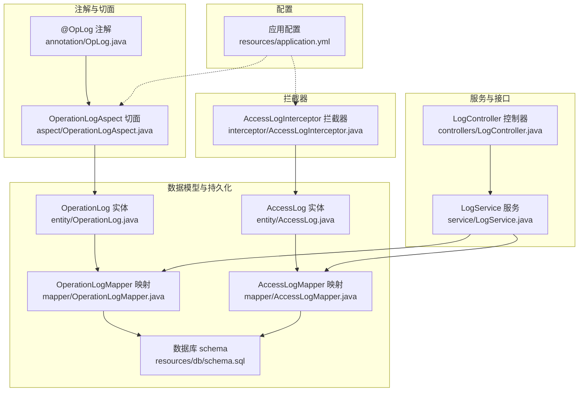
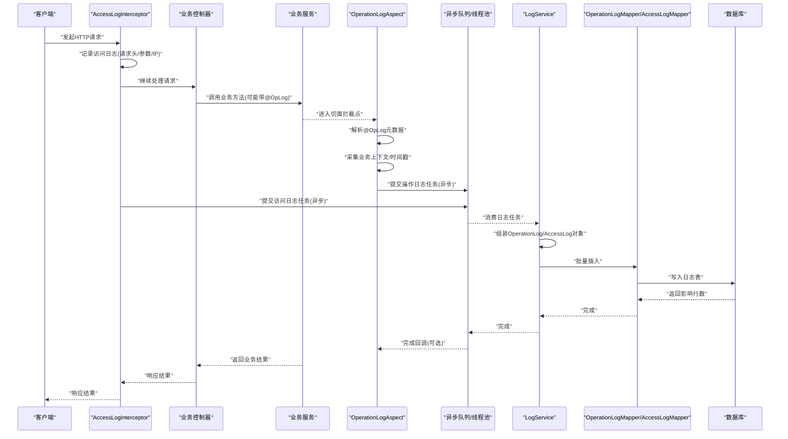
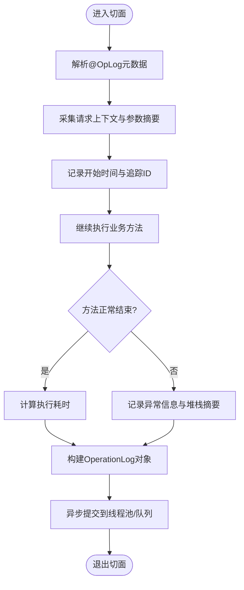
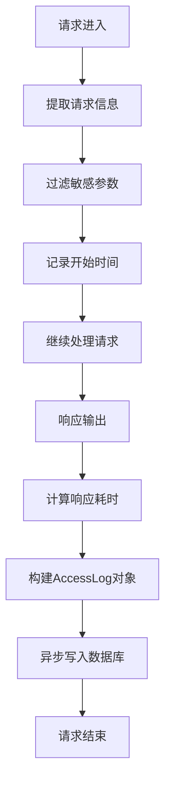
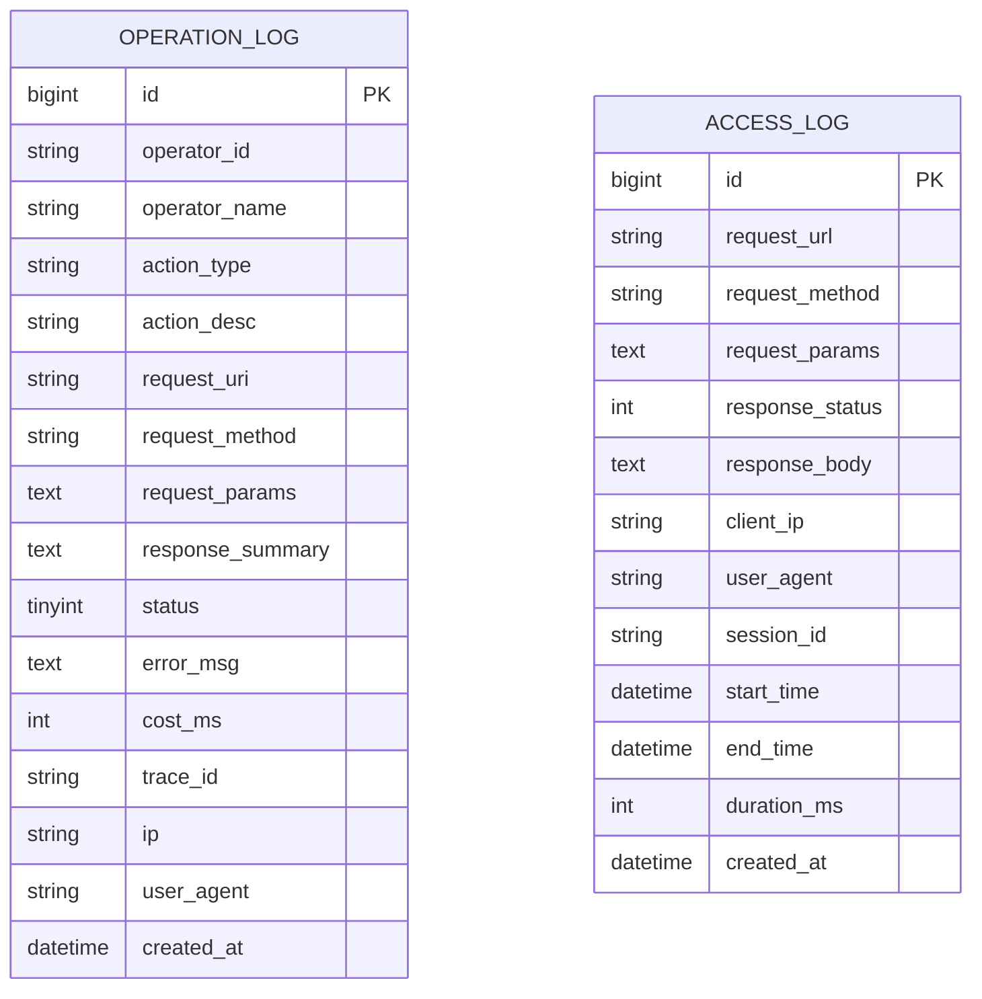
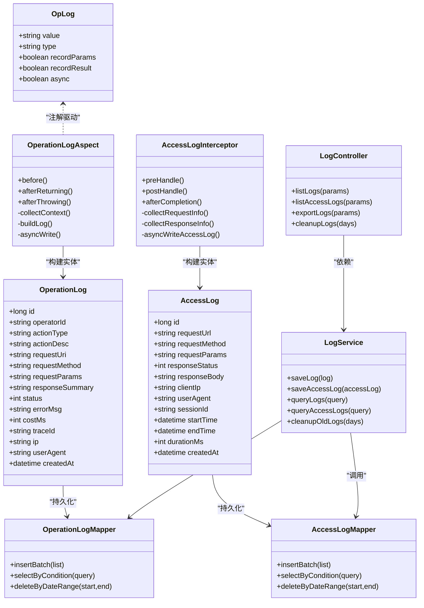

# 操作日志系统

<cite>
**本文引用的文件**   
- [OpLog.java](file://flow-engine/src/main/java/com/flow/engine/annotation/OpLog.java)
- [OperationLogAspect.java](file://flow-engine/src/main/java/com/flow/engine/aspect/OperationLogAspect.java)
- [AccessLogInterceptor.java](file://flow-engine/src/main/java/com/flow/engine/interceptor/AccessLogInterceptor.java)
- [OperationLog.java](file://flow-engine/src/main/java/com/flow/engine/entity/OperationLog.java)
- [AccessLog.java](file://flow-engine/src/main/java/com/flow/engine/entity/AccessLog.java)
- [OperationLogMapper.java](file://flow-engine/src/main/java/com/flow/engine/mapper/OperationLogMapper.java)
- [AccessLogMapper.java](file://flow-engine/src/main/java/com/flow/engine/mapper/AccessLogMapper.java)
- [LogController.java](file://flow-engine/src/main/java/com/flow/engine/controllers/LogController.java)
- [LogService.java](file://flow-engine/src/main/java/com/flow/engine/service/LogService.java)
- [application.yml](file://flow-engine/src/main/resources/application.yml)
- [schema.sql](file://flow-engine/src/main/resources/db/schema.sql)
</cite>

## 更新摘要
**所做更改**   
- 新增 AccessLogInterceptor 访问日志拦截器，实现统一的请求访问日志收集
- 增强所有控制器的日志记录功能，提供集中化的访问日志管理
- 完善审计追踪能力，支持更全面的请求响应跟踪
- 优化日志存储策略，提升查询性能和存储空间管理

## 目录
1. [简介](#简介)
2. [项目结构](#项目结构)
3. [核心组件](#核心组件)
4. [架构总览](#架构总览)
5. [详细组件分析](#详细组件分析)
6. [依赖关系分析](#依赖关系分析)
7. [性能考虑](#性能考虑)
8. [故障排查指南](#故障排查指南)
9. [结论](#结论)
10. [附录](#附录)

## 简介
本技术文档围绕"操作日志系统"展开，重点阐述以下方面：
- AOP切面 OperationLogAspect 的实现原理与织入机制
- @OpLog 自定义注解的设计与使用方式
- **新增** AccessLogInterceptor 访问日志拦截器的统一请求收集机制
- 操作日志数据模型（OperationLog）的字段、表结构与索引优化策略
- **新增** 访问日志数据模型（AccessLog）的设计与用途
- 日志记录的触发时机与内容采集机制（请求参数、响应结果、执行时间等）
- 异步存储策略与批量写入优化方案
- 日志查询接口设计与使用示例（按用户、操作类型、时间范围等多维度筛选）
- 日志清理策略与存储空间管理方案

## 项目结构
与操作日志相关的核心代码位于 flow-engine 模块中，主要包含注解、AOP切面、拦截器、实体、持久化映射、控制器与服务层。

```mermaid
graph TB
subgraph "注解与切面"
A["@OpLog 注解<br/>annotation/OpLog.java"]
B["OperationLogAspect 切面<br/>aspect/OperationLogAspect.java"]
end
subgraph "拦截器"
C["AccessLogInterceptor 拦截器<br/>interceptor/AccessLogInterceptor.java"]
end
subgraph "数据模型与持久化"
D["OperationLog 实体<br/>entity/OperationLog.java"]
E["AccessLog 实体<br/>entity/AccessLog.java"]
F["OperationLogMapper 映射<br/>mapper/OperationLogMapper.java"]
G["AccessLogMapper 映射<br/>mapper/AccessLogMapper.java"]
H["数据库 schema<br/>resources/db/schema.sql"]
end
subgraph "服务与接口"
I["LogService 服务<br/>service/LogService.java"]
J["LogController 控制器<br/>controllers/LogController.java"]
end
subgraph "配置"
K["应用配置<br/>resources/application.yml"]
end
A --> B
B --> D
C --> E
D --> F
E --> G
F --> H
G --> H
J --> I
I --> F
I --> G
K -.-> B
K -.-> C
```

**图表来源**
- [OpLog.java](file://flow-engine/src/main/java/com/flow/engine/annotation/OpLog.java)
- [OperationLogAspect.java](file://flow-engine/src/main/java/com/flow/engine/aspect/OperationLogAspect.java)
- [AccessLogInterceptor.java](file://flow-engine/src/main/java/com/flow/engine/interceptor/AccessLogInterceptor.java)
- [OperationLog.java](file://flow-engine/src/main/java/com/flow/engine/entity/OperationLog.java)
- [AccessLog.java](file://flow-engine/src/main/java/com/flow/engine/entity/AccessLog.java)
- [OperationLogMapper.java](file://flow-engine/src/main/java/com/flow/engine/mapper/OperationLogMapper.java)
- [AccessLogMapper.java](file://flow-engine/src/main/java/com/flow/engine/mapper/AccessLogMapper.java)
- [LogController.java](file://flow-engine/src/main/java/com/flow/engine/controllers/LogController.java)
- [LogService.java](file://flow-engine/src/main/java/com/flow/engine/service/LogService.java)
- [schema.sql](file://flow-engine/src/main/resources/db/schema.sql)
- [application.yml](file://flow-engine/src/main/resources/application.yml)

## 核心组件
- 自定义注解 @OpLog：用于在业务方法上声明式地标记需要记录的操作日志，支持描述、操作类型等元信息。
- AOP切面 OperationLogAspect：拦截被 @OpLog 标注的方法，统一收集上下文信息并落库。
- **新增** AccessLogInterceptor：HTTP请求拦截器，统一收集所有Web请求的访问日志。
- 实体 OperationLog：定义操作日志数据的字段与约束，对应数据库表结构。
- **新增** 实体 AccessLog：定义访问日志数据的字段与约束，记录HTTP请求访问信息。
- 持久化 OperationLogMapper：提供对 OperationLog 表的增删改查能力。
- **新增** 持久化 AccessLogMapper：提供对 AccessLog 表的增删改查能力。
- 服务 LogService：封装日志写入、查询、清理等业务逻辑。
- 控制器 LogController：暴露日志查询与管理接口，供前端或外部系统调用。
- 配置 application.yml：可配置切面开关、线程池、批量大小、保留天数等。
- 数据库 schema.sql：定义日志表结构与索引。

**章节来源**
- [OpLog.java](file://flow-engine/src/main/java/com/flow/engine/annotation/OpLog.java)
- [OperationLogAspect.java](file://flow-engine/src/main/java/com/flow/engine/aspect/OperationLogAspect.java)
- [AccessLogInterceptor.java](file://flow-engine/src/main/java/com/flow/engine/interceptor/AccessLogInterceptor.java)
- [OperationLog.java](file://flow-engine/src/main/java/com/flow/engine/entity/OperationLog.java)
- [AccessLog.java](file://flow-engine/src/main/java/com/flow/engine/entity/AccessLog.java)
- [OperationLogMapper.java](file://flow-engine/src/main/java/com/flow/engine/mapper/OperationLogMapper.java)
- [AccessLogMapper.java](file://flow-engine/src/main/java/com/flow/engine/mapper/AccessLogMapper.java)
- [LogService.java](file://flow-engine/src/main/java/com/flow/engine/service/LogService.java)
- [LogController.java](file://flow-engine/src/main/java/com/flow/engine/controllers/LogController.java)
- [application.yml](file://flow-engine/src/main/resources/application.yml)
- [schema.sql](file://flow-engine/src/main/resources/db/schema.sql)

## 架构总览
下图展示了从方法调用到日志落库的整体流程，包括注解解析、切面拦截、拦截器处理、上下文采集、异步写入与查询路径。

```mermaid
sequenceDiagram
participant Client as "客户端"
participant Interceptor as "AccessLogInterceptor"
participant Controller as "业务控制器"
participant Service as "业务服务"
participant Aspect as "OperationLogAspect"
participant MQ as "异步队列/线程池"
participant Svc as "LogService"
participant Mapper as "OperationLogMapper/AccessLogMapper"
participant DB as "数据库"
Client->>Interceptor : "发起HTTP请求"
Interceptor->>Interceptor : "记录访问日志(请求头/参数/IP)"
Interceptor->>Controller : "继续处理请求"
Controller->>Service : "调用业务方法(可能带@OpLog)"
Service-->>Aspect : "进入切面拦截点"
Aspect->>Aspect : "解析@OpLog元数据"
Aspect->>Aspect : "采集业务上下文/时间戳"
Aspect->>MQ : "提交操作日志任务(异步)"
Interceptor->>MQ : "提交访问日志任务(异步)"
MQ-->>Svc : "消费日志任务"
Svc->>Svc : "组装OperationLog/AccessLog对象"
Svc->>Mapper : "批量插入"
Mapper->>DB : "写入日志表"
DB-->>Mapper : "返回影响行数"
Mapper-->>Svc : "完成"
Svc-->>MQ : "完成"
MQ-->>Aspect : "完成回调(可选)"
Service-->>Controller : "返回业务结果"
Controller-->>Interceptor : "响应结果"
Interceptor-->>Client : "响应结果"
```

**图表来源**
- [AccessLogInterceptor.java](file://flow-engine/src/main/java/com/flow/engine/interceptor/AccessLogInterceptor.java)
- [OperationLogAspect.java](file://flow-engine/src/main/java/com/flow/engine/aspect/OperationLogAspect.java)
- [LogService.java](file://flow-engine/src/main/java/com/flow/engine/service/LogService.java)
- [OperationLogMapper.java](file://flow-engine/src/main/java/com/flow/engine/mapper/OperationLogMapper.java)
- [AccessLogMapper.java](file://flow-engine/src/main/java/com/flow/engine/mapper/AccessLogMapper.java)
- [schema.sql](file://flow-engine/src/main/resources/db/schema.sql)

## 详细组件分析

### 自定义注解 @OpLog 设计
- 作用目标与方法级别：用于标注需要记录操作日志的业务方法。
- 关键属性建议：
  - 操作描述：便于审计与展示
  - 操作类型：如创建、更新、删除、审批等，便于分类统计
  - 是否记录参数/结果：控制敏感信息是否入库
  - 是否异步：默认异步，避免阻塞主流程
- 使用方式：在业务方法上添加 @OpLog 并填写必要元信息；切面自动识别并处理。

**章节来源**
- [OpLog.java](file://flow-engine/src/main/java/com/flow/engine/annotation/OpLog.java)

### AOP切面 OperationLogAspect 实现原理
- 织入机制：基于Spring AOP，通过注解驱动的方式在目标方法前后进行增强。
- 拦截点：匹配所有被 @OpLog 标注的方法。
- 前置处理：
  - 解析注解元数据（描述、类型、是否记录参数/结果等）
  - 采集请求上下文（用户、IP、请求头、请求体摘要等）
  - 记录开始时间与追踪ID
- 后置处理：
  - 计算执行耗时
  - 捕获异常状态与错误信息
  - 根据配置决定是否记录响应结果
- 异步写入：将日志任务投递至线程池或消息队列，避免同步IO阻塞主流程。
- 幂等与容错：
  - 为每条日志生成唯一标识，防止重复写入
  - 失败重试与死信队列（可选）
- 性能保护：
  - 参数/结果大小限制与脱敏
  - 采样率控制（可选）

```mermaid
flowchart TD
Start(["进入切面"]) --> ParseAnno["解析@OpLog元数据"]
ParseAnno --> CollectCtx["采集请求上下文与参数摘要"]
CollectCtx --> RecordStart["记录开始时间与追踪ID"]
RecordStart --> Proceed["继续执行业务方法"]
Proceed --> After{"方法正常结束?"}
After --> |是| CalcTime["计算执行耗时"]
After --> |否| HandleErr["记录异常信息与堆栈摘要"]
CalcTime --> BuildLog["构建OperationLog对象"]
HandleErr --> BuildLog
BuildLog --> AsyncSubmit["异步提交到线程池/队列"]
AsyncSubmit --> End(["退出切面"])
```

**图表来源**
- [OperationLogAspect.java](file://flow-engine/src/main/java/com/flow/engine/aspect/OperationLogAspect.java)

**章节来源**
- [OperationLogAspect.java](file://flow-engine/src/main/java/com/flow/engine/aspect/OperationLogAspect.java)

### **新增** AccessLogInterceptor 访问日志拦截器
- **拦截机制**：基于Spring MVC拦截器，在请求进入和离开时自动记录访问信息。
- **收集内容**：
  - HTTP方法、URL、请求参数
  - 客户端IP地址、User-Agent
  - 请求开始时间、响应时间、耗时
  - 响应状态码、响应体摘要
  - 会话信息、认证用户
- **异步处理**：访问日志采用异步写入，不影响主业务流程性能。
- **安全过滤**：自动过滤敏感参数（密码、Token等），防止敏感信息泄露。
- **性能优化**：支持采样策略，在高负载场景下减少日志量。

```mermaid
flowchart TD
RequestIn["请求进入"] --> ExtractInfo["提取请求信息"]
ExtractInfo --> FilterSensitive["过滤敏感参数"]
FilterSensitive --> RecordStart["记录开始时间"]
RecordStart --> Continue["继续处理请求"]
Continue --> ResponseOut["响应输出"]
ResponseOut --> CalcDuration["计算响应耗时"]
CalcDuration --> BuildAccessLog["构建AccessLog对象"]
BuildAccessLog --> AsyncWrite["异步写入数据库"]
AsyncWrite --> RequestEnd["请求结束"]
```

**图表来源**
- [AccessLogInterceptor.java](file://flow-engine/src/main/java/com/flow/engine/interceptor/AccessLogInterceptor.java)

**章节来源**
- [AccessLogInterceptor.java](file://flow-engine/src/main/java/com/flow/engine/interceptor/AccessLogInterceptor.java)

### 数据模型与表结构设计
- **OperationLog 实体字段**：
  - id：主键
  - operator_id：操作人ID
  - operator_name：操作人名称
  - action_type：操作类型
  - action_desc：操作描述
  - request_uri：请求URI
  - request_method：请求方法
  - request_params：请求参数（脱敏/摘要）
  - response_summary：响应摘要（可选）
  - status：执行状态（成功/失败）
  - error_msg：错误信息摘要
  - cost_ms：执行耗时（毫秒）
  - trace_id：链路追踪ID
  - ip：客户端IP
  - user_agent：客户端UA
  - created_at：创建时间
- **AccessLog 实体字段**：
  - id：主键
  - request_url：请求URL
  - request_method：请求方法
  - request_params：请求参数
  - response_status：响应状态码
  - response_body：响应体摘要
  - client_ip：客户端IP
  - user_agent：用户代理
  - session_id：会话ID
  - start_time：请求开始时间
  - end_time：请求结束时间
  - duration_ms：响应耗时
  - created_at：创建时间
- **表结构关系**：
  - 双表设计：OperationLog记录业务操作，AccessLog记录HTTP访问
  - 单表设计便于高并发写入与查询
  - 关联用户表时可通过外键或冗余字段提升查询性能
- **索引优化策略**：
  - 复合索引：operator_id + created_at（按用户+时间查询）
  - 复合索引：action_type + created_at（按操作类型+时间查询）
  - 复合索引：request_url + start_time（按URL+时间查询）
  - 单列索引：trace_id（链路追踪定位）
  - 分区策略：按月份或天分区，利于历史数据归档与清理

```mermaid
erDiagram
OPERATION_LOG {
bigint id PK
string operator_id
string operator_name
string action_type
string action_desc
string request_uri
string request_method
text request_params
text response_summary
tinyint status
text error_msg
int cost_ms
string trace_id
string ip
string user_agent
datetime created_at
}
ACCESS_LOG {
bigint id PK
string request_url
string request_method
text request_params
int response_status
text response_body
string client_ip
string user_agent
string session_id
datetime start_time
datetime end_time
int duration_ms
datetime created_at
}
```

**图表来源**
- [OperationLog.java](file://flow-engine/src/main/java/com/flow/engine/entity/OperationLog.java)
- [AccessLog.java](file://flow-engine/src/main/java/com/flow/engine/entity/AccessLog.java)
- [schema.sql](file://flow-engine/src/main/resources/db/schema.sql)

**章节来源**
- [OperationLog.java](file://flow-engine/src/main/java/com/flow/engine/entity/OperationLog.java)
- [AccessLog.java](file://flow-engine/src/main/java/com/flow/engine/entity/AccessLog.java)
- [schema.sql](file://flow-engine/src/main/resources/db/schema.sql)

### 日志记录触发时机与内容采集
- **OperationLog 触发时机**：
  - 方法进入前：采集请求参数、用户上下文、时间戳
  - 方法结束后：记录耗时、状态、异常信息
- **AccessLog 触发时机**：
  - 请求进入时：记录请求信息、开始时间
  - 请求结束时：记录响应信息、耗时
- **内容采集**：
  - 请求参数：仅采集必要字段，并进行脱敏与长度限制
  - 响应结果：仅记录摘要或状态码，避免大对象入库
  - 执行时间：精确到毫秒，便于性能分析
  - 追踪ID：贯穿一次请求的全链路，便于问题定位
- **安全与合规**：
  - 敏感字段过滤（密码、Token等）
  - 最大体积限制与采样策略

**章节来源**
- [OperationLogAspect.java](file://flow-engine/src/main/java/com/flow/engine/aspect/OperationLogAspect.java)
- [AccessLogInterceptor.java](file://flow-engine/src/main/java/com/flow/engine/interceptor/AccessLogInterceptor.java)

### 异步存储与批量写入优化
- **异步策略**：
  - 使用线程池或消息队列解耦写入，降低主流程延迟
  - 支持背压与限流，避免内存溢出
- **批量写入**：
  - 聚合多条日志后一次性插入，减少事务开销
  - 批次大小与刷新间隔可配置
- **可靠性保障**：
  - 失败重试与告警
  - 本地缓冲与持久化（可选）

**章节来源**
- [LogService.java](file://flow-engine/src/main/java/com/flow/engine/service/LogService.java)
- [application.yml](file://flow-engine/src/main/resources/application.yml)

### 日志查询接口设计
- **查询条件**：
  - 用户ID/用户名
  - 操作类型
  - 时间范围（开始-结束）
  - 状态（成功/失败）
  - 关键字（URI、描述模糊匹配）
  - **新增** URL路径、HTTP方法、响应状态码
- **分页与排序**：
  - 支持页码与每页条数
  - 默认按创建时间倒序
- **返回字段**：
  - 基础信息、状态、耗时、摘要等
- **使用示例（概念性说明）**：
  - GET /api/logs?operatorId=xxx&actionType=update&startTime=...&endTime=...&page=1&size=20
  - **新增** GET /api/access-logs?url=/api/user&status=200&startTime=...&endTime=...

**章节来源**
- [LogController.java](file://flow-engine/src/main/java/com/flow/engine/controllers/LogController.java)
- [LogService.java](file://flow-engine/src/main/java/com/flow/engine/service/LogService.java)

### 日志清理策略与空间管理
- **清理策略**：
  - 按保留天数自动清理过期日志
  - 按月/周分表或分区，便于归档与压缩
- **空间管理**：
  - 监控表大小与增长趋势
  - 冷数据迁移至低成本存储（对象存储/归档库）
- **自动化任务**：
  - 定时任务定期执行清理与归档
  - 清理完成后释放磁盘空间并更新统计指标

**章节来源**
- [LogService.java](file://flow-engine/src/main/java/com/flow/engine/service/LogService.java)
- [application.yml](file://flow-engine/src/main/resources/application.yml)

## 依赖关系分析
- **组件耦合**：
  - 切面依赖注解与实体，低耦合于具体业务
  - 拦截器独立于业务逻辑，专注于HTTP请求处理
  - 服务层封装持久化细节，对外暴露统一API
- **外部依赖**：
  - Spring AOP
  - Spring MVC拦截器
  - MyBatis-Plus（若使用）
  - 数据库（MySQL/PostgreSQL等）
  - 线程池/消息队列（可选）

```mermaid
classDiagram
class OpLog {
+string value
+string type
+boolean recordParams
+boolean recordResult
+boolean async
}
class OperationLogAspect {
+before()
+afterReturning()
+afterThrowing()
-collectContext()
-buildLog()
-asyncWrite()
}
class AccessLogInterceptor {
+preHandle()
+postHandle()
+afterCompletion()
-collectRequestInfo()
-collectResponseInfo()
-asyncWriteAccessLog()
}
class OperationLog {
+long id
+string operatorId
+string actionType
+string actionDesc
+string requestUri
+string requestMethod
+string requestParams
+string responseSummary
+int status
+string errorMsg
+int costMs
+string traceId
+string ip
+string userAgent
+datetime createdAt
}
class AccessLog {
+long id
+string requestUrl
+string requestMethod
+string requestParams
+int responseStatus
+string responseBody
+string clientIp
+string userAgent
+string sessionId
+datetime startTime
+datetime endTime
+int durationMs
+datetime createdAt
}
class OperationLogMapper {
+insertBatch(list)
+selectByCondition(query)
+deleteByDateRange(start,end)
}
class AccessLogMapper {
+insertBatch(list)
+selectByCondition(query)
+deleteByDateRange(start,end)
}
class LogService {
+saveLog(log)
+saveAccessLog(accessLog)
+queryLogs(query)
+queryAccessLogs(query)
+cleanupOldLogs(days)
}
class LogController {
+listLogs(params)
+listAccessLogs(params)
+exportLogs(params)
+cleanupLogs(days)
}
OpLog <.. OperationLogAspect : "注解驱动"
OperationLogAspect --> OperationLog : "构建实体"
AccessLogInterceptor --> AccessLog : "构建实体"
OperationLog --> OperationLogMapper : "持久化"
AccessLog --> AccessLogMapper : "持久化"
LogService --> OperationLogMapper : "调用"
LogService --> AccessLogMapper : "调用"
LogController --> LogService : "依赖"
```

**图表来源**
- [OpLog.java](file://flow-engine/src/main/java/com/flow/engine/annotation/OpLog.java)
- [OperationLogAspect.java](file://flow-engine/src/main/java/com/flow/engine/aspect/OperationLogAspect.java)
- [AccessLogInterceptor.java](file://flow-engine/src/main/java/com/flow/engine/interceptor/AccessLogInterceptor.java)
- [OperationLog.java](file://flow-engine/src/main/java/com/flow/engine/entity/OperationLog.java)
- [AccessLog.java](file://flow-engine/src/main/java/com/flow/engine/entity/AccessLog.java)
- [OperationLogMapper.java](file://flow-engine/src/main/java/com/flow/engine/mapper/OperationLogMapper.java)
- [AccessLogMapper.java](file://flow-engine/src/main/java/com/flow/engine/mapper/AccessLogMapper.java)
- [LogService.java](file://flow-engine/src/main/java/com/flow/engine/service/LogService.java)
- [LogController.java](file://flow-engine/src/main/java/com/flow/engine/controllers/LogController.java)

**章节来源**
- [OpLog.java](file://flow-engine/src/main/java/com/flow/engine/annotation/OpLog.java)
- [OperationLogAspect.java](file://flow-engine/src/main/java/com/flow/engine/aspect/OperationLogAspect.java)
- [AccessLogInterceptor.java](file://flow-engine/src/main/java/com/flow/engine/interceptor/AccessLogInterceptor.java)
- [OperationLog.java](file://flow-engine/src/main/java/com/flow/engine/entity/OperationLog.java)
- [AccessLog.java](file://flow-engine/src/main/java/com/flow/engine/entity/AccessLog.java)
- [OperationLogMapper.java](file://flow-engine/src/main/java/com/flow/engine/mapper/OperationLogMapper.java)
- [AccessLogMapper.java](file://flow-engine/src/main/java/com/flow/engine/mapper/AccessLogMapper.java)
- [LogService.java](file://flow-engine/src/main/java/com/flow/engine/service/LogService.java)
- [LogController.java](file://flow-engine/src/main/java/com/flow/engine/controllers/LogController.java)

## 性能考虑
- **异步写入**：避免同步IO阻塞主流程，提高吞吐
- **批量插入**：合并多次写入，降低事务与网络开销
- **索引优化**：合理设置复合索引，提升查询效率
- **数据裁剪**：仅记录必要字段，限制大小与脱敏
- **采样与限流**：在高负载场景下启用采样与限流，保护系统稳定性
- **分区与归档**：按时间分区，冷热分离，缩短扫描范围
- **拦截器优化**：访问日志异步处理，避免影响请求响应时间

## 故障排查指南
- **常见问题**：
  - 日志未写入：检查切面是否生效、注解是否正确、线程池是否满
  - 访问日志缺失：检查拦截器注册、过滤器配置、异步队列状态
  - 查询缓慢：确认索引是否存在、SQL是否走索引、是否全表扫描
  - 数据丢失：检查异步队列堆积、重试策略、死信处理
- **诊断手段**：
  - 开启调试日志，观察切面执行轨迹
  - 监控线程池与队列指标（队列长度、拒绝次数）
  - 查看数据库慢查询与锁等待
  - 检查拦截器链执行情况
- **恢复措施**：
  - 扩容线程池与队列容量
  - 调整批量大小与刷新间隔
  - 临时关闭非关键日志采集，优先保障核心功能

**章节来源**
- [OperationLogAspect.java](file://flow-engine/src/main/java/com/flow/engine/aspect/OperationLogAspect.java)
- [AccessLogInterceptor.java](file://flow-engine/src/main/java/com/flow/engine/interceptor/AccessLogInterceptor.java)
- [LogService.java](file://flow-engine/src/main/java/com/flow/engine/service/LogService.java)

## 结论
本操作日志系统通过注解+AOP实现无侵入式埋点，结合拦截器实现统一的HTTP访问日志收集，配合异步与批量写入提升性能，配合合理的索引与分区策略满足大规模审计需求。**新增的AccessLogInterceptor提供了完整的请求访问追踪能力**，使系统具备更全面的监控和审计功能。建议在上线前完善脱敏、限流与监控告警，确保系统在稳定与可观测之间取得平衡。

## 附录
- **配置项建议（application.yml）**：
  - 切面开关、线程池核心/最大线程数、队列容量
  - 拦截器开关、采样率、敏感参数过滤规则
  - 批量大小、刷新间隔、保留天数
  - 采样率、脱敏规则、大小限制
- **使用示例（概念性）**：
  - 在业务方法上添加 @OpLog(value="更新用户", type="UPDATE")
  - 调用查询接口获取指定时间范围内的日志列表
  - **新增** 访问日志自动记录，无需额外配置
  - **新增** 支持按URL、状态码、时间范围查询访问日志

**章节来源**
- [application.yml](file://flow-engine/src/main/resources/application.yml)