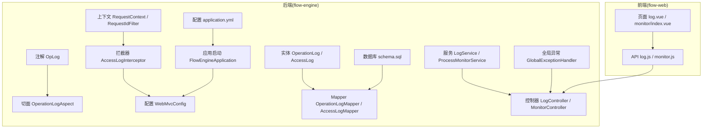
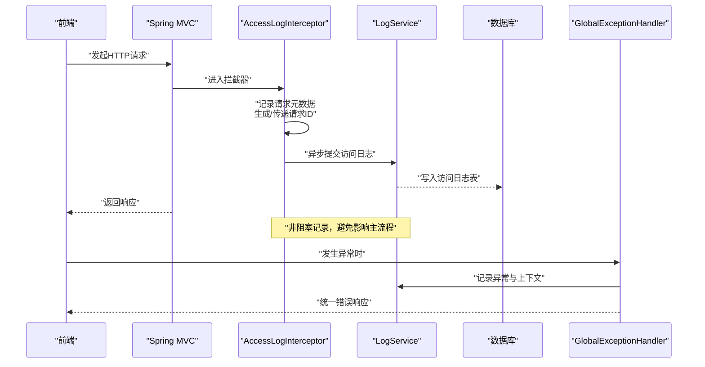
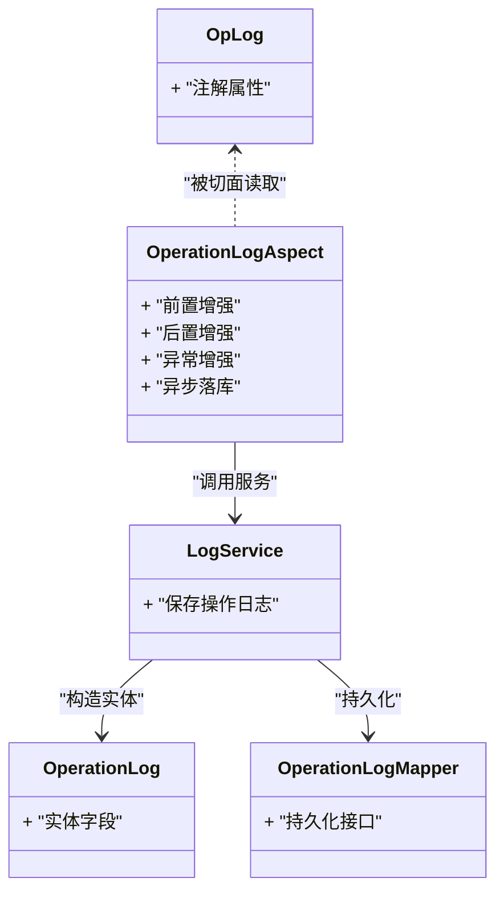
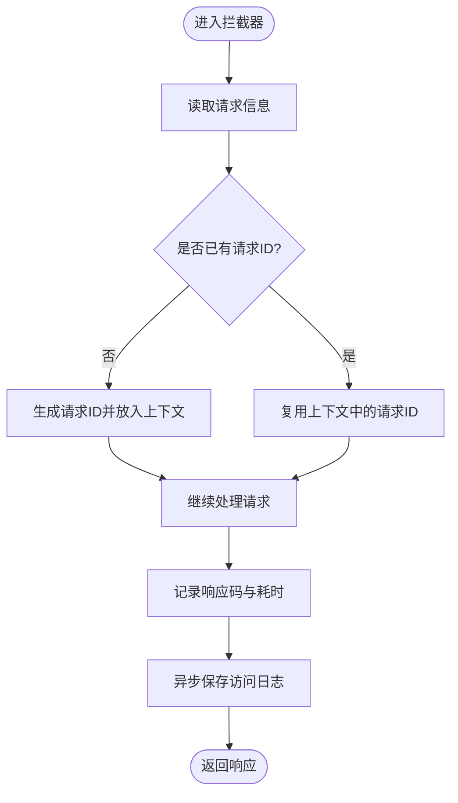
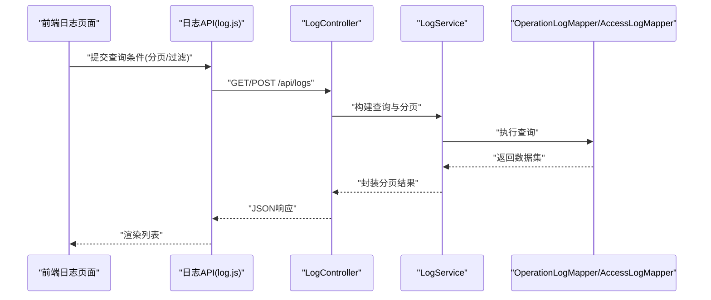
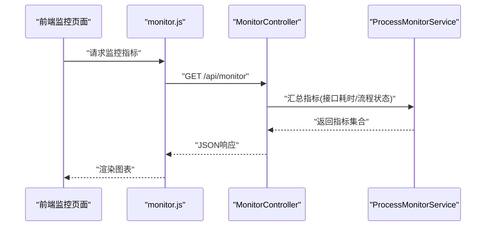
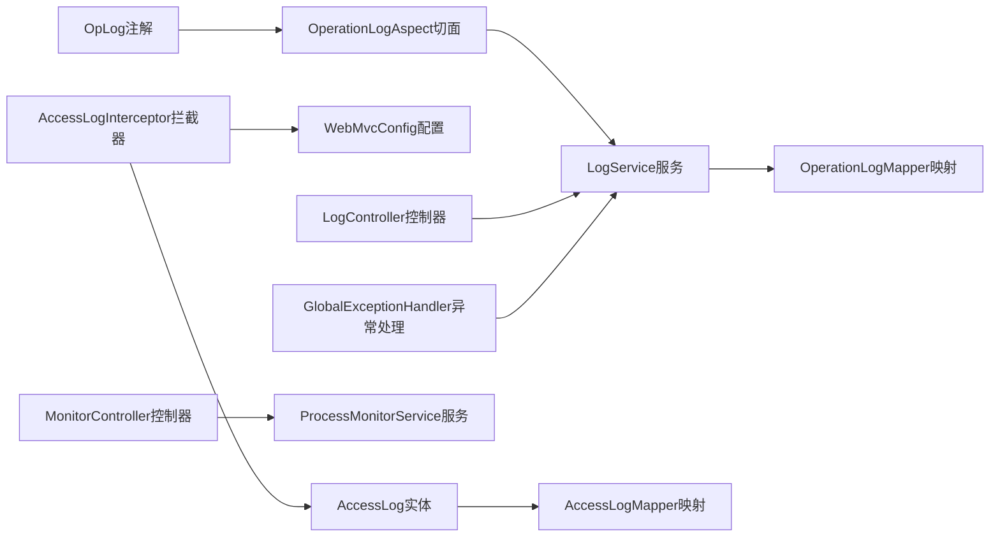

# 监控审计系统

<cite>
**本文引用的文件**   
- [OperationLogAspect.java](file://flow-engine/src/main/java/com/flow/engine/aspect/OperationLogAspect.java)
- [OpLog.java](file://flow-engine/src/main/java/com/flow/engine/annotation/OpLog.java)
- [AccessLogInterceptor.java](file://flow-engine/src/main/java/com/flow/engine/interceptor/AccessLogInterceptor.java)
- [WebMvcConfig.java](file://flow-engine/src/main/java/com/flow/engine/config/WebMvcConfig.java)
- [RequestContext.java](file://flow-engine/src/main/java/com/flow/engine/common/RequestContext.java)
- [RequestIdFilter.java](file://flow-engine/src/main/java/com/flow/engine/common/RequestIdFilter.java)
- [OperationLog.java](file://flow-engine/src/main/java/com/flow/engine/entity/OperationLog.java)
- [AccessLog.java](file://flow-engine/src/main/java/com/flow/engine/entity/AccessLog.java)
- [OperationLogMapper.java](file://flow-engine/src/main/java/com/flow/engine/mapper/OperationLogMapper.java)
- [AccessLogMapper.java](file://flow-engine/src/main/java/com/flow/engine/mapper/AccessLogMapper.java)
- [LogService.java](file://flow-engine/src/main/java/com/flow/engine/service/LogService.java)
- [LogController.java](file://flow-engine/src/main/java/com/flow/engine/controllers/LogController.java)
- [MonitorController.java](file://flow-engine/src/main/java/com/flow/engine/controllers/MonitorController.java)
- [ProcessMonitorService.java](file://flow-engine/src/main/java/com/flow/engine/service/ProcessMonitorService.java)
- [GlobalExceptionHandler.java](file://flow-engine/src/main/java/com/flow/engine/common/GlobalExceptionHandler.java)
- [FlowEngineApplication.java](file://flow-engine/src/main/java/com/flow/engine/FlowEngineApplication.java)
- [application.yml](file://flow-engine/src/main/resources/application.yml)
- [schema.sql](file://flow-engine/src/main/resources/db/schema.sql)
- [index.vue（日志）](file://flow-web/src/views/system/log.vue)
- [log.js（前端API）](file://flow-web/src/api/log.js)
- [monitor.js（前端API）](file://flow-web/src/api/monitor.js)
- [index.vue（监控）](file://flow-web/src/views/monitor/index.vue)
</cite>

## 目录
1. [简介](#简介)
2. [项目结构](#项目结构)
3. [核心组件](#核心组件)
4. [架构总览](#架构总览)
5. [详细组件分析](#详细组件分析)
6. [依赖关系分析](#依赖关系分析)
7. [性能考虑](#性能考虑)
8. [故障排查指南](#故障排查指南)
9. [结论](#结论)
10. [附录](#附录)

## 简介
本技术文档围绕“监控审计系统”的实现与使用，覆盖以下关键能力：
- 操作日志：基于AOP切面记录业务操作，结构化字段设计，异步持久化策略。
- 访问日志：通过请求拦截器收集HTTP请求与响应信息，统一存储与分析。
- 性能监控：接口响应时间、数据库查询性能等指标的采集与展示。
- 告警通知：异常监控与阈值告警机制。
- 日志查询与分析：多维度筛选与统计报表。
- 清理策略与空间管理：日志生命周期管理与存储优化。
- 监控仪表板：配置与使用指南。

## 项目结构
后端模块 flow-engine 提供监控审计的核心能力，包括注解、切面、拦截器、实体、服务、控制器及数据映射；前端模块 flow-web 提供日志查询与监控仪表板页面。

图表来源
- [OperationLogAspect.java:1-200](file://flow-engine/src/main/java/com/flow/engine/aspect/OperationLogAspect.java#L1-L200)
- [OpLog.java:1-200](file://flow-engine/src/main/java/com/flow/engine/annotation/OpLog.java#L1-L200)
- [AccessLogInterceptor.java:1-200](file://flow-engine/src/main/java/com/flow/engine/interceptor/AccessLogInterceptor.java#L1-L200)
- [WebMvcConfig.java:1-200](file://flow-engine/src/main/java/com/flow/engine/config/WebMvcConfig.java#L1-L200)
- [RequestContext.java:1-200](file://flow-engine/src/main/java/com/flow/engine/common/RequestContext.java#L1-L200)
- [RequestIdFilter.java:1-200](file://flow-engine/src/main/java/com/flow/engine/common/RequestIdFilter.java#L1-L200)
- [OperationLog.java:1-200](file://flow-engine/src/main/java/com/flow/engine/entity/OperationLog.java#L1-L200)
- [AccessLog.java:1-200](file://flow-engine/src/main/java/com/flow/engine/entity/AccessLog.java#L1-L200)
- [OperationLogMapper.java:1-200](file://flow-engine/src/main/java/com/flow/engine/mapper/OperationLogMapper.java#L1-L200)
- [AccessLogMapper.java:1-200](file://flow-engine/src/main/java/com/flow/engine/mapper/AccessLogMapper.java#L1-L200)
- [LogService.java:1-200](file://flow-engine/src/main/java/com/flow/engine/service/LogService.java#L1-L200)
- [LogController.java:1-200](file://flow-engine/src/main/java/com/flow/engine/controllers/LogController.java#L1-L200)
- [MonitorController.java:1-200](file://flow-engine/src/main/java/com/flow/engine/controllers/MonitorController.java#L1-L200)
- [ProcessMonitorService.java:1-200](file://flow-engine/src/main/java/com/flow/engine/service/ProcessMonitorService.java#L1-L200)
- [GlobalExceptionHandler.java:1-200](file://flow-engine/src/main/java/com/flow/engine/common/GlobalExceptionHandler.java#L1-L200)
- [FlowEngineApplication.java:1-200](file://flow-engine/src/main/java/com/flow/engine/FlowEngineApplication.java#L1-L200)
- [application.yml:1-200](file://flow-engine/src/main/resources/application.yml#L1-L200)
- [schema.sql:1-200](file://flow-engine/src/main/resources/db/schema.sql#L1-L200)
- [index.vue（日志）:1-200](file://flow-web/src/views/system/log.vue#L1-L200)
- [log.js（前端API）:1-200](file://flow-web/src/api/log.js#L1-L200)
- [monitor.js（前端API）:1-200](file://flow-web/src/api/monitor.js#L1-L200)
- [index.vue（监控）:1-200](file://flow-web/src/views/monitor/index.vue#L1-L200)

章节来源
- [FlowEngineApplication.java:1-200](file://flow-engine/src/main/java/com/flow/engine/FlowEngineApplication.java#L1-L200)
- [application.yml:1-200](file://flow-engine/src/main/resources/application.yml#L1-L200)

## 核心组件
- 操作日志AOP
  - 注解定义：用于标记需要记录操作日志的方法或类。
  - 切面实现：在方法执行前后采集入参、出参、耗时、异常等信息，并触发异步落库。
- 访问日志拦截器
  - 拦截所有HTTP请求，记录URL、方法、参数、响应码、耗时、用户标识、请求ID等。
- 日志服务与控制器
  - 提供统一的日志写入与查询接口，支持分页、过滤、排序。
- 监控控制器与服务
  - 暴露系统运行指标与流程相关监控数据，供前端仪表板消费。
- 全局异常处理
  - 统一捕获异常，记录错误堆栈与上下文，便于审计与排障。
- 上下文与过滤器
  - 为每次请求生成唯一请求ID，贯穿整个调用链，便于关联日志。

章节来源
- [OpLog.java:1-200](file://flow-engine/src/main/java/com/flow/engine/annotation/OpLog.java#L1-L200)
- [OperationLogAspect.java:1-200](file://flow-engine/src/main/java/com/flow/engine/aspect/OperationLogAspect.java#L1-L200)
- [AccessLogInterceptor.java:1-200](file://flow-engine/src/main/java/com/flow/engine/interceptor/AccessLogInterceptor.java#L1-L200)
- [LogService.java:1-200](file://flow-engine/src/main/java/com/flow/engine/service/LogService.java#L1-L200)
- [LogController.java:1-200](file://flow-engine/src/main/java/com/flow/engine/controllers/LogController.java#L1-L200)
- [MonitorController.java:1-200](file://flow-engine/src/main/java/com/flow/engine/controllers/MonitorController.java#L1-L200)
- [ProcessMonitorService.java:1-200](file://flow-engine/src/main/java/com/flow/engine/service/ProcessMonitorService.java#L1-L200)
- [GlobalExceptionHandler.java:1-200](file://flow-engine/src/main/java/com/flow/engine/common/GlobalExceptionHandler.java#L1-L200)
- [RequestContext.java:1-200](file://flow-engine/src/main/java/com/flow/engine/common/RequestContext.java#L1-L200)
- [RequestIdFilter.java:1-200](file://flow-engine/src/main/java/com/flow/engine/common/RequestIdFilter.java#L1-L200)

## 架构总览
整体采用“注解+AOP+拦截器+服务+控制器+数据库”的分层架构，前后端分离，前端通过REST API获取日志与监控数据。

图表来源
- [AccessLogInterceptor.java:1-200](file://flow-engine/src/main/java/com/flow/engine/interceptor/AccessLogInterceptor.java#L1-L200)
- [LogService.java:1-200](file://flow-engine/src/main/java/com/flow/engine/service/LogService.java#L1-L200)
- [GlobalExceptionHandler.java:1-200](file://flow-engine/src/main/java/com/flow/engine/common/GlobalExceptionHandler.java#L1-L200)

## 详细组件分析

### 操作日志AOP组件
- 设计要点
  - 注解驱动：通过自定义注解声明需记录的操作点，支持方法级与类级。
  - 切面采集：在目标方法执行前采集入参与上下文，执行后采集返回值与耗时，异常分支采集异常信息与堆栈。
  - 结构化字段：包含操作人、操作类型、模块、资源标识、请求ID、耗时、结果状态、摘要信息等。
  - 异步存储：将日志对象投递至线程池或消息队列，降低对主流程的影响。
- 数据模型
  - 操作日志实体包含基础字段与扩展字段，便于检索与聚合。
- 关键流程
  - 方法匹配 -> 前置增强 -> 执行业务 -> 后置增强 -> 异常增强 -> 异步落库。

图表来源
- [OpLog.java:1-200](file://flow-engine/src/main/java/com/flow/engine/annotation/OpLog.java#L1-L200)
- [OperationLogAspect.java:1-200](file://flow-engine/src/main/java/com/flow/engine/aspect/OperationLogAspect.java#L1-L200)
- [OperationLog.java:1-200](file://flow-engine/src/main/java/com/flow/engine/entity/OperationLog.java#L1-L200)
- [LogService.java:1-200](file://flow-engine/src/main/java/com/flow/engine/service/LogService.java#L1-L200)
- [OperationLogMapper.java:1-200](file://flow-engine/src/main/java/com/flow/engine/mapper/OperationLogMapper.java#L1-L200)

章节来源
- [OpLog.java:1-200](file://flow-engine/src/main/java/com/flow/engine/annotation/OpLog.java#L1-L200)
- [OperationLogAspect.java:1-200](file://flow-engine/src/main/java/com/flow/engine/aspect/OperationLogAspect.java#L1-L200)
- [OperationLog.java:1-200](file://flow-engine/src/main/java/com/flow/engine/entity/OperationLog.java#L1-L200)
- [LogService.java:1-200](file://flow-engine/src/main/java/com/flow/engine/service/LogService.java#L1-L200)
- [OperationLogMapper.java:1-200](file://flow-engine/src/main/java/com/flow/engine/mapper/OperationLogMapper.java#L1-L200)

### 访问日志拦截器组件
- 设计要点
  - 拦截范围：注册到Web MVC，拦截所有请求路径。
  - 采集内容：请求方法、URL、参数、头部、客户端IP、用户标识、请求ID、响应码、耗时等。
  - 异步落库：通过服务层异步写入，避免增加请求延迟。
- 配置方式
  - 在Web配置中注册拦截器，并可设置排除路径。

图表来源
- [AccessLogInterceptor.java:1-200](file://flow-engine/src/main/java/com/flow/engine/interceptor/AccessLogInterceptor.java#L1-L200)
- [WebMvcConfig.java:1-200](file://flow-engine/src/main/java/com/flow/engine/config/WebMvcConfig.java#L1-L200)
- [RequestContext.java:1-200](file://flow-engine/src/main/java/com/flow/engine/common/RequestContext.java#L1-L200)
- [AccessLog.java:1-200](file://flow-engine/src/main/java/com/flow/engine/entity/AccessLog.java#L1-L200)
- [AccessLogMapper.java:1-200](file://flow-engine/src/main/java/com/flow/engine/mapper/AccessLogMapper.java#L1-L200)

章节来源
- [AccessLogInterceptor.java:1-200](file://flow-engine/src/main/java/com/flow/engine/interceptor/AccessLogInterceptor.java#L1-L200)
- [WebMvcConfig.java:1-200](file://flow-engine/src/main/java/com/flow/engine/config/WebMvcConfig.java#L1-L200)
- [RequestContext.java:1-200](file://flow-engine/src/main/java/com/flow/engine/common/RequestContext.java#L1-L200)
- [AccessLog.java:1-200](file://flow-engine/src/main/java/com/flow/engine/entity/AccessLog.java#L1-L200)
- [AccessLogMapper.java:1-200](file://flow-engine/src/main/java/com/flow/engine/mapper/AccessLogMapper.java#L1-L200)

### 日志查询与分析功能
- 后端接口
  - 提供分页查询、条件过滤（如时间范围、操作类型、用户、模块）、排序与导出能力。
- 前端界面
  - 日志页面提供筛选表单、表格展示、分页控件与导出按钮。
- 数据流
  - 前端调用日志API -> 后端控制器接收参数 -> 服务层组装查询条件 -> Mapper执行SQL -> 返回分页结果。

图表来源
- [LogController.java:1-200](file://flow-engine/src/main/java/com/flow/engine/controllers/LogController.java#L1-L200)
- [LogService.java:1-200](file://flow-engine/src/main/java/com/flow/engine/service/LogService.java#L1-L200)
- [OperationLogMapper.java:1-200](file://flow-engine/src/main/java/com/flow/engine/mapper/OperationLogMapper.java#L1-L200)
- [AccessLogMapper.java:1-200](file://flow-engine/src/main/java/com/flow/engine/mapper/AccessLogMapper.java#L1-L200)
- [log.js（前端API）:1-200](file://flow-web/src/api/log.js#L1-L200)
- [index.vue（日志）:1-200](file://flow-web/src/views/system/log.vue#L1-L200)

章节来源
- [LogController.java:1-200](file://flow-engine/src/main/java/com/flow/engine/controllers/LogController.java#L1-L200)
- [LogService.java:1-200](file://flow-engine/src/main/java/com/flow/engine/service/LogService.java#L1-L200)
- [log.js（前端API）:1-200](file://flow-web/src/api/log.js#L1-L200)
- [index.vue（日志）:1-200](file://flow-web/src/views/system/log.vue#L1-L200)

### 性能监控指标与展示
- 指标采集
  - 接口响应时间：由拦截器计算请求耗时。
  - 数据库查询性能：可通过MyBatis Plus配置打印SQL与耗时，或在服务层埋点。
  - 流程监控：ProcessMonitorService提供流程维度指标。
- 展示方式
  - MonitorController暴露指标数据，前端monitor页面进行可视化展示。

图表来源
- [MonitorController.java:1-200](file://flow-engine/src/main/java/com/flow/engine/controllers/MonitorController.java#L1-L200)
- [ProcessMonitorService.java:1-200](file://flow-engine/src/main/java/com/flow/engine/service/ProcessMonitorService.java#L1-L200)
- [monitor.js（前端API）:1-200](file://flow-web/src/api/monitor.js#L1-L200)
- [index.vue（监控）:1-200](file://flow-web/src/views/monitor/index.vue#L1-L200)

章节来源
- [MonitorController.java:1-200](file://flow-engine/src/main/java/com/flow/engine/controllers/MonitorController.java#L1-L200)
- [ProcessMonitorService.java:1-200](file://flow-engine/src/main/java/com/flow/engine/service/ProcessMonitorService.java#L1-L200)
- [monitor.js（前端API）:1-200](file://flow-web/src/api/monitor.js#L1-L200)
- [index.vue（监控）:1-200](file://flow-web/src/views/monitor/index.vue#L1-L200)

### 告警通知机制
- 异常监控
  - 全局异常处理器统一捕获异常，记录异常类型、堆栈、上下文与请求ID，便于后续分析与告警。
- 阈值告警
  - 可在服务层或定时任务中检查关键指标（如错误率、慢查询比例），超过阈值则触发告警（邮件、短信、IM等）。
- 建议实现
  - 将告警事件抽象为独立服务，结合消息队列实现可靠投递与重试。

章节来源
- [GlobalExceptionHandler.java:1-200](file://flow-engine/src/main/java/com/flow/engine/common/GlobalExceptionHandler.java#L1-L200)

### 日志清理策略与存储空间管理
- 清理策略
  - 按时间窗口清理历史日志（如保留最近N天），支持手动触发与定时任务。
- 存储优化
  - 大字段压缩、冷热分层、归档到对象存储。
- 配置项
  - 在应用配置中定义保留天数、批量清理大小、清理频率等。

章节来源
- [application.yml:1-200](file://flow-engine/src/main/resources/application.yml#L1-L200)

## 依赖关系分析
- 组件耦合
  - 切面依赖注解、服务与实体；拦截器依赖上下文与配置；控制器依赖服务；服务依赖Mapper。
- 外部依赖
  - Spring MVC、MyBatis Plus、数据库。
- 潜在循环依赖
  - 当前结构清晰，未见循环依赖迹象。

图表来源
- [OpLog.java:1-200](file://flow-engine/src/main/java/com/flow/engine/annotation/OpLog.java#L1-L200)
- [OperationLogAspect.java:1-200](file://flow-engine/src/main/java/com/flow/engine/aspect/OperationLogAspect.java#L1-L200)
- [LogService.java:1-200](file://flow-engine/src/main/java/com/flow/engine/service/LogService.java#L1-L200)
- [OperationLogMapper.java:1-200](file://flow-engine/src/main/java/com/flow/engine/mapper/OperationLogMapper.java#L1-L200)
- [AccessLogInterceptor.java:1-200](file://flow-engine/src/main/java/com/flow/engine/interceptor/AccessLogInterceptor.java#L1-L200)
- [WebMvcConfig.java:1-200](file://flow-engine/src/main/java/com/flow/engine/config/WebMvcConfig.java#L1-L200)
- [AccessLog.java:1-200](file://flow-engine/src/main/java/com/flow/engine/entity/AccessLog.java#L1-L200)
- [AccessLogMapper.java:1-200](file://flow-engine/src/main/java/com/flow/engine/mapper/AccessLogMapper.java#L1-L200)
- [LogController.java:1-200](file://flow-engine/src/main/java/com/flow/engine/controllers/LogController.java#L1-L200)
- [MonitorController.java:1-200](file://flow-engine/src/main/java/com/flow/engine/controllers/MonitorController.java#L1-L200)
- [ProcessMonitorService.java:1-200](file://flow-engine/src/main/java/com/flow/engine/service/ProcessMonitorService.java#L1-L200)
- [GlobalExceptionHandler.java:1-200](file://flow-engine/src/main/java/com/flow/engine/common/GlobalExceptionHandler.java#L1-L200)

章节来源
- [WebMvcConfig.java:1-200](file://flow-engine/src/main/java/com/flow/engine/config/WebMvcConfig.java#L1-L200)
- [FlowEngineApplication.java:1-200](file://flow-engine/src/main/java/com/flow/engine/FlowEngineApplication.java#L1-L200)

## 性能考虑
- 异步落库
  - 访问日志与操作日志均采用异步写入，避免阻塞主流程。
- 连接与线程池
  - 合理配置数据库连接池与异步线程池大小，防止资源耗尽。
- 索引与查询
  - 为高频查询字段建立索引，减少全表扫描。
- 采样与限流
  - 对高吞吐接口可启用采样记录，限制日志写入速率。
- 缓存热点
  - 对字典、权限等热点数据使用缓存，降低数据库压力。

[本节为通用指导，不直接分析具体文件]

## 故障排查指南
- 常见问题
  - 日志未落库：检查异步线程池是否饱和、数据库连接是否正常。
  - 请求ID缺失：确认过滤器是否正确注入并传递上下文。
  - 查询缓慢：检查索引与分页参数，避免过大偏移量。
  - 异常未记录：确认全局异常处理器是否生效，切面是否被正确织入。
- 定位手段
  - 通过请求ID串联访问日志与操作日志。
  - 查看全局异常记录的堆栈与上下文信息。
  - 开启SQL日志观察慢查询。

章节来源
- [GlobalExceptionHandler.java:1-200](file://flow-engine/src/main/java/com/flow/engine/common/GlobalExceptionHandler.java#L1-L200)
- [RequestIdFilter.java:1-200](file://flow-engine/src/main/java/com/flow/engine/common/RequestIdFilter.java#L1-L200)
- [RequestContext.java:1-200](file://flow-engine/src/main/java/com/flow/engine/common/RequestContext.java#L1-L200)

## 结论
本监控审计系统以AOP与拦截器为核心，实现了操作日志与访问日志的结构化采集与异步存储，并通过控制器与服务暴露查询与监控能力。配合全局异常处理与上下文追踪，形成完整的审计与排障闭环。建议在后续迭代中完善告警通知、指标可视化与存储治理，以提升系统的可观测性与稳定性。

[本节为总结性内容，不直接分析具体文件]

## 附录
- 数据库表结构参考
  - 操作日志表与访问日志表的字段定义请参考初始化脚本。
- 前端页面与API
  - 日志页面与监控页面分别对应相应的前端视图与API文件。

章节来源
- [schema.sql:1-200](file://flow-engine/src/main/resources/db/schema.sql#L1-L200)
- [index.vue（日志）:1-200](file://flow-web/src/views/system/log.vue#L1-L200)
- [log.js（前端API）:1-200](file://flow-web/src/api/log.js#L1-L200)
- [index.vue（监控）:1-200](file://flow-web/src/views/monitor/index.vue#L1-L200)
- [monitor.js（前端API）:1-200](file://flow-web/src/api/monitor.js#L1-L200)