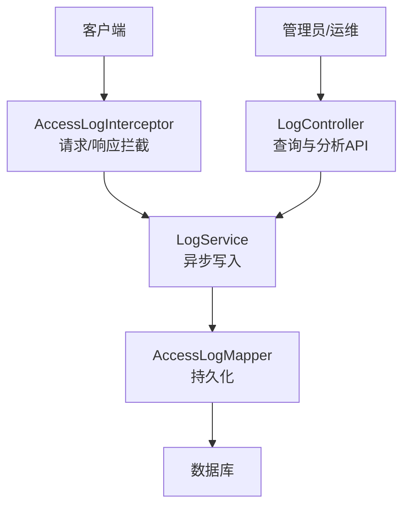
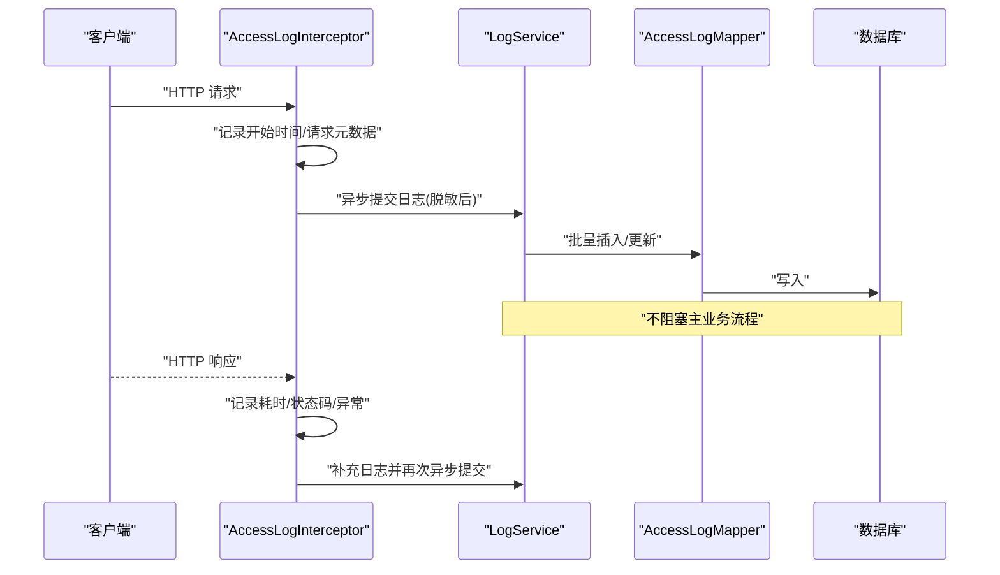
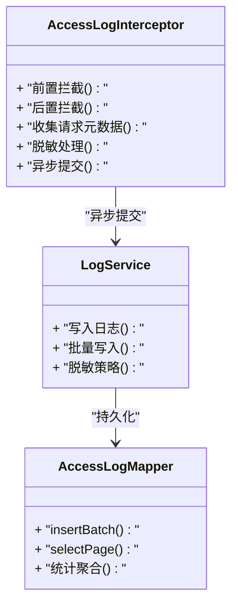
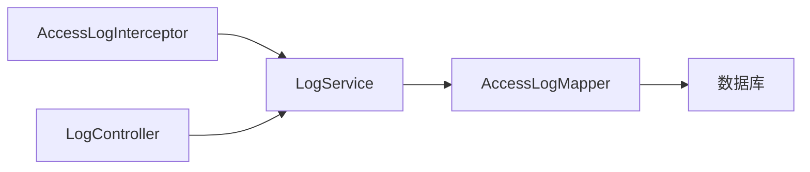

# 访问日志收集

<cite>
**本文引用的文件**   
- [AccessLogInterceptor.java](file://flow-engine/src/main/java/com/flow/engine/interceptor/AccessLogInterceptor.java)
- [AccessLog.java](file://flow-engine/src/main/java/com/flow/engine/entity/AccessLog.java)
- [AccessLogMapper.java](file://flow-engine/src/main/java/com/flow/engine/mapper/AccessLogMapper.java)
- [LogController.java](file://flow-engine/src/main/java/com/flow/engine/controllers/LogController.java)
- [LogService.java](file://flow-engine/src/main/java/com/flow/engine/service/LogService.java)
- [application.yml](file://flow-engine/src/main/resources/application.yml)
</cite>

## 目录
1. [简介](#简介)
2. [项目结构](#项目结构)
3. [核心组件](#核心组件)
4. [架构总览](#架构总览)
5. [详细组件分析](#详细组件分析)
6. [依赖分析](#依赖分析)
7. [性能考虑](#性能考虑)
8. [故障排查指南](#故障排查指南)
9. [结论](#结论)
10. [附录](#附录)

## 简介
本技术文档围绕访问日志收集系统，重点说明HTTP请求拦截器 AccessLogInterceptor 的实现机制、访问日志数据结构设计、参数安全与脱敏策略、异步记录与性能优化方案，以及查询分析与生命周期管理。目标是帮助开发者快速理解并扩展该模块，确保在保障业务性能的同时提供可靠的访问审计与分析能力。

## 项目结构
访问日志相关代码位于后端工程 flow-engine 中，主要涉及以下层次：
- 拦截层：AccessLogInterceptor 负责在请求进入和响应返回时进行拦截，采集关键信息并触发异步落库。
- 数据模型层：AccessLog 实体定义访问日志字段。
- 持久化层：AccessLogMapper 提供数据库访问接口。
- 服务与控制层：LogService 封装日志写入逻辑；LogController 暴露查询与分析接口。
- 配置层：application.yml 包含线程池、脱敏规则等配置项。

图表来源
- [AccessLogInterceptor.java](file://flow-engine/src/main/java/com/flow/engine/interceptor/AccessLogInterceptor.java)
- [LogService.java](file://flow-engine/src/main/java/com/flow/engine/service/LogService.java)
- [AccessLogMapper.java](file://flow-engine/src/main/java/com/flow/engine/mapper/AccessLogMapper.java)
- [LogController.java](file://flow-engine/src/main/java/com/flow/engine/controllers/LogController.java)

章节来源
- [AccessLogInterceptor.java](file://flow-engine/src/main/java/com/flow/engine/interceptor/AccessLogInterceptor.java)
- [AccessLog.java](file://flow-engine/src/main/java/com/flow/engine/entity/AccessLog.java)
- [AccessLogMapper.java](file://flow-engine/src/main/java/com/flow/engine/mapper/AccessLogMapper.java)
- [LogController.java](file://flow-engine/src/main/java/com/flow/engine/controllers/LogController.java)
- [LogService.java](file://flow-engine/src/main/java/com/flow/engine/service/LogService.java)
- [application.yml](file://flow-engine/src/main/resources/application.yml)

## 核心组件
- 请求拦截器 AccessLogInterceptor
  - 职责：在请求进入前记录开始时间、方法、URL、IP、UA、请求头关键字段；在响应结束后记录耗时、状态码、异常信息（如有）；对请求体/参数执行脱敏后入库。
  - 关键点：使用异步线程池避免阻塞主流程；对大体积请求体进行采样或截断；对敏感字段按策略脱敏。
- 实体 AccessLog
  - 职责：定义访问日志的持久化字段，包括请求标识、时间戳、方法、路径、IP、UA、耗时、状态码、请求摘要、响应摘要、错误信息等。
- 持久化 AccessLogMapper
  - 职责：提供插入、分页查询、统计聚合等数据库操作。
- 服务 LogService
  - 职责：封装日志写入、脱敏处理、异步提交、批量写入等逻辑；对外暴露查询与分析接口。
- 控制器 LogController
  - 职责：暴露查询与分析REST接口，如分页列表、IP统计、接口调用频率、错误率等。

章节来源
- [AccessLogInterceptor.java](file://flow-engine/src/main/java/com/flow/engine/interceptor/AccessLogInterceptor.java)
- [AccessLog.java](file://flow-engine/src/main/java/com/flow/engine/entity/AccessLog.java)
- [AccessLogMapper.java](file://flow-engine/src/main/java/com/flow/engine/mapper/AccessLogMapper.java)
- [LogService.java](file://flow-engine/src/main/java/com/flow/engine/service/LogService.java)
- [LogController.java](file://flow-engine/src/main/java/com/flow/engine/controllers/LogController.java)

## 架构总览
访问日志的整体流程如下：
- 请求进入：拦截器捕获请求元数据，计算开始时间，必要时读取并脱敏请求体。
- 业务处理：由具体Controller处理业务逻辑。
- 响应返回：拦截器记录结束时间、状态码、异常信息，组装日志对象。
- 异步落库：通过线程池将日志写入队列，后台消费者批量持久化。
- 查询分析：管理端通过LogController提供的接口进行查询与统计分析。

图表来源
- [AccessLogInterceptor.java](file://flow-engine/src/main/java/com/flow/engine/interceptor/AccessLogInterceptor.java)
- [LogService.java](file://flow-engine/src/main/java/com/flow/engine/service/LogService.java)
- [AccessLogMapper.java](file://flow-engine/src/main/java/com/flow/engine/mapper/AccessLogMapper.java)

## 详细组件分析

### 拦截器 AccessLogInterceptor 实现机制
- 拦截点设计
  - 前置拦截：记录请求ID、方法、URI、协议版本、客户端IP、User-Agent、必要请求头；初始化计时器。
  - 后置拦截：记录响应状态码、耗时；若发生异常则记录异常类型与消息；对请求体/参数进行脱敏后再落库。
- 异步处理
  - 通过配置的线程池提交任务，避免同步IO影响接口响应时间。
  - 支持批量写入以降低数据库压力。
- 安全与脱敏
  - 针对常见敏感字段（如密码、令牌、身份证号、手机号、银行卡号等）进行匹配替换。
  - 对超大请求体进行长度限制或采样，防止内存膨胀。
- 可观测性
  - 为每次请求生成唯一ID，便于链路追踪与问题定位。
  - 记录关键指标（耗时分布、错误率）用于监控告警。

图表来源
- [AccessLogInterceptor.java](file://flow-engine/src/main/java/com/flow/engine/interceptor/AccessLogInterceptor.java)
- [LogService.java](file://flow-engine/src/main/java/com/flow/engine/service/LogService.java)
- [AccessLogMapper.java](file://flow-engine/src/main/java/com/flow/engine/mapper/AccessLogMapper.java)

章节来源
- [AccessLogInterceptor.java](file://flow-engine/src/main/java/com/flow/engine/interceptor/AccessLogInterceptor.java)
- [LogService.java](file://flow-engine/src/main/java/com/flow/engine/service/LogService.java)

### 访问日志数据结构 AccessLog
- 字段定义要点
  - 基础信息：请求ID、方法、路径、协议、客户端IP、User-Agent、时间戳。
  - 业务信息：租户/用户标识（可选）、路由映射名、接口分组。
  - 请求/响应摘要：请求体摘要、响应状态码、响应大小、错误信息。
  - 性能指标：开始时间、结束时间、耗时毫秒数。
  - 审计标记：是否成功、是否脱敏、采样标记。
- 复杂度与索引建议
  - 高频查询字段（如时间范围、路径、状态码、IP）应建立合适索引以提升查询效率。
  - 大文本字段（请求体/响应体）建议采用压缩或仅存储摘要，降低存储成本。

章节来源
- [AccessLog.java](file://flow-engine/src/main/java/com/flow/engine/entity/AccessLog.java)

### 请求参数安全处理与脱敏策略
- 脱敏规则
  - 基于正则或白名单匹配敏感字段，如密码、令牌、身份证、手机号、邮箱、银行卡等。
  - 对JSON/XML中的嵌套字段进行递归匹配替换。
- 风险控制
  - 对请求体大小设置上限，超过阈值仅记录摘要或丢弃原始内容。
  - 对异常堆栈信息进行过滤，避免泄露内部实现细节。
- 配置化
  - 通过配置文件启用/禁用特定脱敏规则，支持不同环境差异化策略。

章节来源
- [LogService.java](file://flow-engine/src/main/java/com/flow/engine/service/LogService.java)
- [application.yml](file://flow-engine/src/main/resources/application.yml)

### 异步处理与性能优化
- 线程池配置
  - 独立线程池用于日志写入，避免与业务线程竞争。
  - 合理设置核心线程数、最大线程数、队列容量与拒绝策略。
- 批量写入
  - 将多条日志合并为批次提交，减少数据库往返次数。
  - 支持定时刷新与队列满时的降级策略。
- 采样与限流
  - 对高QPS接口开启采样记录，降低存储与CPU开销。
  - 在异常风暴场景下自动限流，保护系统稳定性。

章节来源
- [application.yml](file://flow-engine/src/main/resources/application.yml)
- [LogService.java](file://flow-engine/src/main/java/com/flow/engine/service/LogService.java)

### 查询与分析功能
- 查询接口
  - 分页列表：支持按时间范围、路径、状态码、IP、用户等多条件筛选。
  - 详情查看：展示请求/响应摘要、耗时、错误信息。
- 统计分析
  - IP统计：Top N活跃IP、请求量趋势。
  - 接口调用频率：按路径统计QPS、峰值时段。
  - 错误率分析：按接口维度统计失败比例与异常类型分布。
- 可视化建议
  - 结合前端图表展示趋势与分布，辅助运维与研发快速定位问题。

章节来源
- [LogController.java](file://flow-engine/src/main/java/com/flow/engine/controllers/LogController.java)
- [LogService.java](file://flow-engine/src/main/java/com/flow/engine/service/LogService.java)
- [AccessLogMapper.java](file://flow-engine/src/main/java/com/flow/engine/mapper/AccessLogMapper.java)

### 生命周期管理与自动清理
- 保留策略
  - 按时间窗口保留（如最近30天），超期数据归档或删除。
  - 按大小阈值清理，当表空间达到上限时优先删除最旧数据。
- 清理方式
  - 定时任务扫描过期记录，分批删除以避免锁表。
  - 支持冷热分层：热数据存于高性能存储，冷数据迁移至低成本存储。
- 合规与安全
  - 清理过程需满足审计要求，保留最小必要信息。
  - 对敏感字段在归档阶段进一步脱敏或加密。

章节来源
- [application.yml](file://flow-engine/src/main/resources/application.yml)
- [AccessLogMapper.java](file://flow-engine/src/main/java/com/flow/engine/mapper/AccessLogMapper.java)

## 依赖分析
- 组件耦合
  - AccessLogInterceptor 依赖 LogService 完成异步写入，低耦合且职责清晰。
  - LogService 依赖 AccessLogMapper 进行持久化，屏蔽底层SQL差异。
  - LogController 面向外部提供查询与分析能力，与服务层解耦。
- 外部依赖
  - 数据库：用于持久化访问日志与统计数据。
  - 线程池：由应用配置注入，支撑异步写入。
- 潜在风险
  - 循环依赖：当前未见循环引用。
  - 资源泄漏：需确保线程池关闭与连接释放。

图表来源
- [AccessLogInterceptor.java](file://flow-engine/src/main/java/com/flow/engine/interceptor/AccessLogInterceptor.java)
- [LogService.java](file://flow-engine/src/main/java/com/flow/engine/service/LogService.java)
- [AccessLogMapper.java](file://flow-engine/src/main/java/com/flow/engine/mapper/AccessLogMapper.java)
- [LogController.java](file://flow-engine/src/main/java/com/flow/engine/controllers/LogController.java)

章节来源
- [AccessLogInterceptor.java](file://flow-engine/src/main/java/com/flow/engine/interceptor/AccessLogInterceptor.java)
- [LogService.java](file://flow-engine/src/main/java/com/flow/engine/service/LogService.java)
- [AccessLogMapper.java](file://flow-engine/src/main/java/com/flow/engine/mapper/AccessLogMapper.java)
- [LogController.java](file://flow-engine/src/main/java/com/flow/engine/controllers/LogController.java)

## 性能考虑
- 异步写入：确保日志记录不阻塞主流程，提升接口响应时间。
- 批量提交：减少数据库往返，提高吞吐。
- 采样与限流：在高QPS场景下控制记录粒度，平衡准确性与性能。
- 索引优化：为常用查询字段建立索引，缩短查询延迟。
- 存储压缩：对大文本字段进行压缩或仅保存摘要，降低存储成本。

[本节为通用指导，无需源码引用]

## 故障排查指南
- 常见问题
  - 日志丢失：检查线程池队列是否溢出、拒绝策略是否导致丢弃。
  - 性能抖动：确认是否出现同步IO、批量大小是否合理、是否存在慢查询。
  - 脱敏失效：核对脱敏规则配置与字段匹配策略是否正确。
- 诊断步骤
  - 查看拦截器埋点日志，确认请求/响应拦截点是否正常触发。
  - 检查数据库写入延迟与锁等待情况。
  - 验证配置项（线程池、脱敏规则、保留策略）是否符合预期。
- 恢复措施
  - 调整线程池参数与批量大小。
  - 临时关闭非关键日志或开启采样模式。
  - 清理过期数据以释放存储空间。

章节来源
- [AccessLogInterceptor.java](file://flow-engine/src/main/java/com/flow/engine/interceptor/AccessLogInterceptor.java)
- [LogService.java](file://flow-engine/src/main/java/com/flow/engine/service/LogService.java)
- [application.yml](file://flow-engine/src/main/resources/application.yml)

## 结论
访问日志收集系统通过拦截器与异步写入机制，在保证业务性能的前提下实现了完整的请求审计与分析能力。合理的脱敏策略、索引设计与生命周期管理进一步提升了安全性与可维护性。建议在生产环境中持续监控日志写入性能与存储增长，按需调整采样与清理策略，确保系统在稳定与高效之间取得平衡。

[本节为总结性内容，无需源码引用]

## 附录
- 术语
  - QPS：每秒查询数
  - UA：User-Agent，浏览器或客户端标识
  - 脱敏：对敏感信息进行遮蔽或替换
- 最佳实践
  - 为高频查询字段建立复合索引。
  - 对异常堆栈进行精简，避免泄露内部实现。
  - 定期评估脱敏规则与保留策略，满足合规要求。

[本节为概念性内容，无需源码引用]