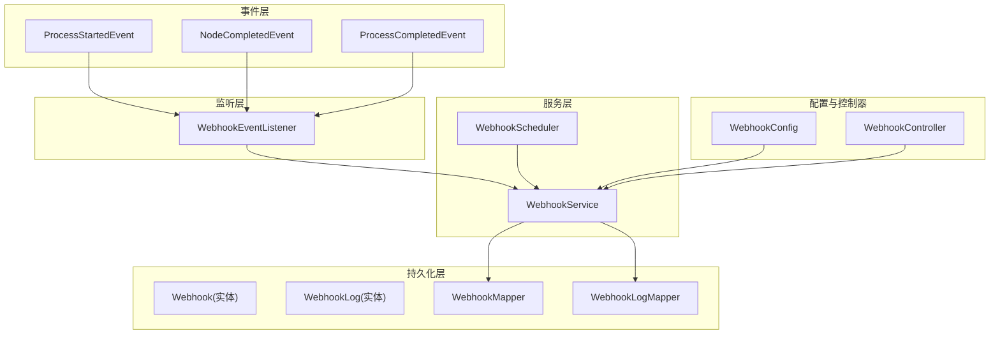
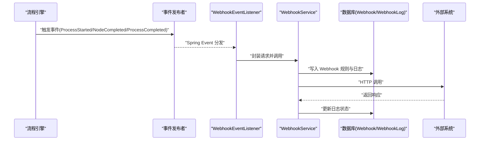
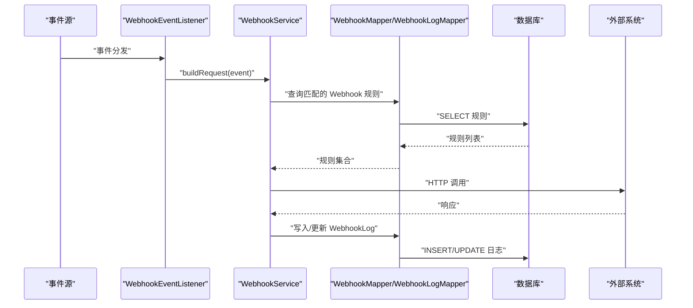
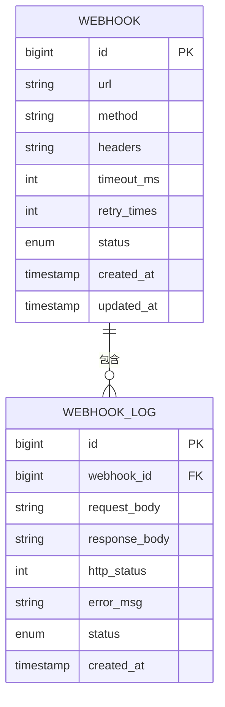
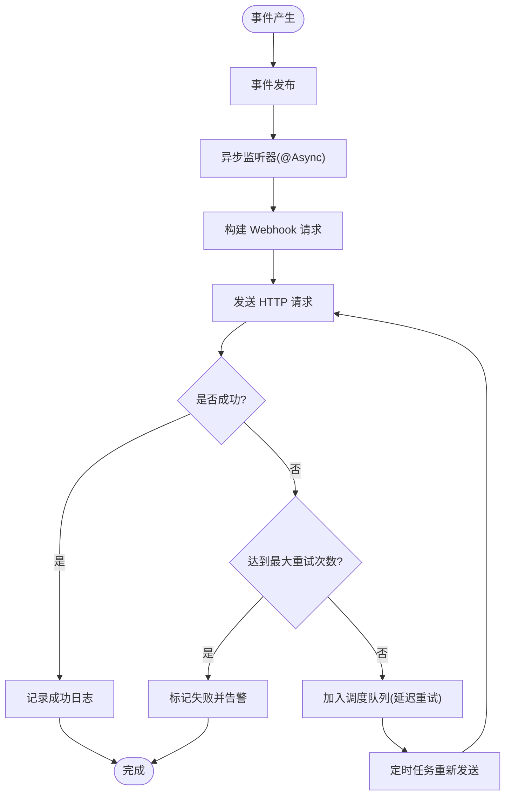
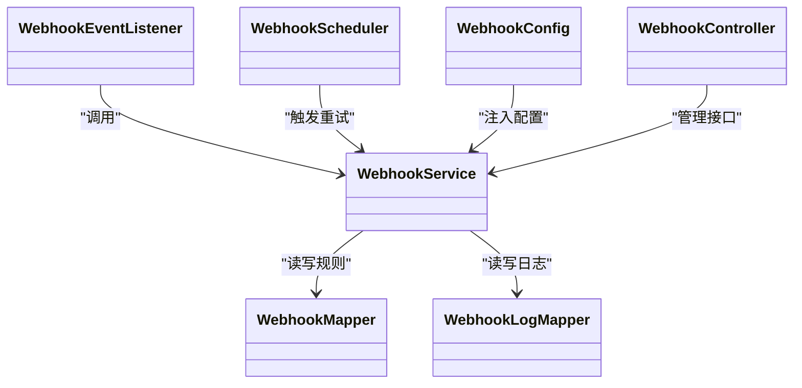

# 事件驱动机制

<cite>
**本文引用的文件**   
- [FlowEngine.java](file://flow-engine/src/main/java/com/flow/engine/engine/FlowEngine.java)
- [NodeCompletedEvent.java](file://flow-engine/src/main/java/com/flow/engine/event/NodeCompletedEvent.java)
- [ProcessStartedEvent.java](file://flow-engine/src/main/java/com/flow/engine/event/ProcessStartedEvent.java)
- [ProcessCompletedEvent.java](file://flow-engine/src/main/java/com/flow/engine/event/ProcessCompletedEvent.java)
- [WebhookEventListener.java](file://flow-engine/src/main/java/com/flow/engine/listener/WebhookEventListener.java)
- [WebhookService.java](file://flow-engine/src/main/java/com/flow/engine/service/WebhookService.java)
- [WebhookScheduler.java](file://flow-engine/src/main/java/com/flow/engine/service/WebhookScheduler.java)
- [WebhookController.java](file://flow-engine/src/main/java/com/flow/engine/controllers/WebhookController.java)
- [WebhookConfig.java](file://flow-engine/src/main/java/com/flow/engine/config/WebhookConfig.java)
- [Webhook.java](file://flow-engine/src/main/java/com/flow/engine/entity/Webhook.java)
- [WebhookLog.java](file://flow-engine/src/main/java/com/flow/engine/entity/WebhookLog.java)
- [WebhookMapper.java](file://flow-engine/src/main/java/com/flow/engine/mapper/WebhookMapper.java)
- [WebhookLogMapper.java](file://flow-engine/src/main/java/com/flow/engine/mapper/WebhookLogMapper.java)
- [WebhookRequest.java](file://flow-engine/src/main/java/com/flow/engine/dto/WebhookRequest.java)
- [WebhookResponse.java](file://flow-engine/src/main/java/com/flow/engine/dto/WebhookResponse.java)
- [WebhookLogResponse.java](file://flow-engine/src/main/java/com/flow/engine/dto/WebhookLogResponse.java)
</cite>

## 目录
1. [简介](#简介)
2. [项目结构](#项目结构)
3. [核心组件](#核心组件)
4. [架构总览](#架构总览)
5. [详细组件分析](#详细组件分析)
6. [依赖关系分析](#依赖关系分析)
7. [性能考虑](#性能考虑)
8. [故障排查指南](#故障排查指南)
9. [结论](#结论)
10. [附录](#附录)

## 简介
本章节面向流程引擎中的事件驱动机制，重点说明 Spring Event 在流程执行过程中的应用场景与实现原理。文档将围绕以下目标展开：
- 解释核心事件类型（如 ProcessStartedEvent、NodeCompletedEvent、ProcessCompletedEvent）的触发时机与数据结构
- 说明事件监听器的注册机制与异步处理模式
- 以 WebhookEventListener 为例，展示外部系统集成的事件处理模式
- 阐述发布订阅模型的优势（解耦、可扩展性、可观测性）
- 提供从事件产生到处理的完整生命周期流程图
- 给出自定义事件与监听器的开发指南，包括异常处理与重试机制

## 项目结构
事件相关代码主要分布在以下包中：
- event：定义流程事件类型
- listener：定义事件监听器（如 WebhookEventListener）
- service：封装 Webhook 调用、调度等能力
- entity/mapper/dto：持久化与传输对象
- config：Webhook 相关配置
- controllers：对外暴露 Webhook 管理接口

图表来源
- [ProcessStartedEvent.java](file://flow-engine/src/main/java/com/flow/engine/event/ProcessStartedEvent.java)
- [NodeCompletedEvent.java](file://flow-engine/src/main/java/com/flow/engine/event/NodeCompletedEvent.java)
- [ProcessCompletedEvent.java](file://flow-engine/src/main/java/com/flow/engine/event/ProcessCompletedEvent.java)
- [WebhookEventListener.java](file://flow-engine/src/main/java/com/flow/engine/listener/WebhookEventListener.java)
- [WebhookService.java](file://flow-engine/src/main/java/com/flow/engine/service/WebhookService.java)
- [WebhookScheduler.java](file://flow-engine/src/main/java/com/flow/engine/service/WebhookScheduler.java)
- [WebhookConfig.java](file://flow-engine/src/main/java/com/flow/engine/config/WebhookConfig.java)
- [WebhookController.java](file://flow-engine/src/main/java/com/flow/engine/controllers/WebhookController.java)
- [Webhook.java](file://flow-engine/src/main/java/com/flow/engine/entity/Webhook.java)
- [WebhookLog.java](file://flow-engine/src/main/java/com/flow/engine/entity/WebhookLog.java)
- [WebhookMapper.java](file://flow-engine/src/main/java/com/flow/engine/mapper/WebhookMapper.java)
- [WebhookLogMapper.java](file://flow-engine/src/main/java/com/flow/engine/mapper/WebhookLogMapper.java)

章节来源
- [WebhookEventListener.java](file://flow-engine/src/main/java/com/flow/engine/listener/WebhookEventListener.java)
- [WebhookService.java](file://flow-engine/src/main/java/com/flow/engine/service/WebhookService.java)
- [WebhookScheduler.java](file://flow-engine/src/main/java/com/flow/engine/service/WebhookScheduler.java)
- [WebhookConfig.java](file://flow-engine/src/main/java/com/flow/engine/config/WebhookConfig.java)
- [WebhookController.java](file://flow-engine/src/main/java/com/flow/engine/controllers/WebhookController.java)
- [Webhook.java](file://flow-engine/src/main/java/com/flow/engine/entity/Webhook.java)
- [WebhookLog.java](file://flow-engine/src/main/java/com/flow/engine/entity/WebhookLog.java)
- [WebhookMapper.java](file://flow-engine/src/main/java/com/flow/engine/mapper/WebhookMapper.java)
- [WebhookLogMapper.java](file://flow-engine/src/main/java/com/flow/engine/mapper/WebhookLogMapper.java)

## 核心组件
本节聚焦事件驱动的核心要素：事件类型、监听器、服务与调度。

- 事件类型
  - ProcessStartedEvent：流程实例启动时触发，用于记录或通知外部系统流程开始
  - NodeCompletedEvent：节点完成时触发，用于记录节点执行结果或触发下游动作
  - ProcessCompletedEvent：流程实例结束时触发，用于归档、统计或通知外部系统流程结束
- 监听器
  - WebhookEventListener：作为通用事件监听器，将关键事件转换为 Webhook 请求并调用外部系统
- 服务与调度
  - WebhookService：封装 Webhook 的构建、发送、日志落库与错误处理
  - WebhookScheduler：定时任务，负责重试失败或未确认的 Webhook 调用
- 配置与控制器
  - WebhookConfig：加载 Webhook 相关配置项
  - WebhookController：提供 Webhook 规则管理与日志查询接口

章节来源
- [ProcessStartedEvent.java](file://flow-engine/src/main/java/com/flow/engine/event/ProcessStartedEvent.java)
- [NodeCompletedEvent.java](file://flow-engine/src/main/java/com/flow/engine/event/NodeCompletedEvent.java)
- [ProcessCompletedEvent.java](file://flow-engine/src/main/java/com/flow/engine/event/ProcessCompletedEvent.java)
- [WebhookEventListener.java](file://flow-engine/src/main/java/com/flow/engine/listener/WebhookEventListener.java)
- [WebhookService.java](file://flow-engine/src/main/java/com/flow/engine/service/WebhookService.java)
- [WebhookScheduler.java](file://flow-engine/src/main/java/com/flow/engine/service/WebhookScheduler.java)
- [WebhookConfig.java](file://flow-engine/src/main/java/com/flow/engine/config/WebhookConfig.java)
- [WebhookController.java](file://flow-engine/src/main/java/com/flow/engine/controllers/WebhookController.java)

## 架构总览
下图展示了事件从产生到被监听器消费，再到外部系统调用的整体链路。

图表来源
- [WebhookEventListener.java](file://flow-engine/src/main/java/com/flow/engine/listener/WebhookEventListener.java)
- [WebhookService.java](file://flow-engine/src/main/java/com/flow/engine/service/WebhookService.java)
- [Webhook.java](file://flow-engine/src/main/java/com/flow/engine/entity/Webhook.java)
- [WebhookLog.java](file://flow-engine/src/main/java/com/flow/engine/entity/WebhookLog.java)
- [WebhookMapper.java](file://flow-engine/src/main/java/com/flow/engine/mapper/WebhookMapper.java)
- [WebhookLogMapper.java](file://flow-engine/src/main/java/com/flow/engine/mapper/WebhookLogMapper.java)

## 详细组件分析

### 事件类型与触发时机
- ProcessStartedEvent
  - 触发时机：流程实例创建并进入首个节点前
  - 典型用途：初始化外部系统数据、审计记录、指标上报
- NodeCompletedEvent
  - 触发时机：任意节点执行完成后
  - 典型用途：同步节点产出变量、触发下游集成、增量日志
- ProcessCompletedEvent
  - 触发时机：流程实例到达结束节点或异常终止
  - 典型用途：归档、结算、通知、报表汇总

章节来源
- [ProcessStartedEvent.java](file://flow-engine/src/main/java/com/flow/engine/event/ProcessStartedEvent.java)
- [NodeCompletedEvent.java](file://flow-engine/src/main/java/com/flow/engine/event/NodeCompletedEvent.java)
- [ProcessCompletedEvent.java](file://flow-engine/src/main/java/com/flow/engine/event/ProcessCompletedEvent.java)

### 监听器注册与异步处理
- 监听器注册
  - 通过 Spring 的事件机制自动发现并注册 @EventListener 标注的监听器
  - WebhookEventListener 作为统一入口，根据事件类型路由到具体处理逻辑
- 异步处理
  - 使用 @Async 注解将监听器方法提交至线程池执行，避免阻塞主流程
  - 结合 WebhookScheduler 进行失败重试与补偿

章节来源
- [WebhookEventListener.java](file://flow-engine/src/main/java/com/flow/engine/listener/WebhookEventListener.java)
- [WebhookScheduler.java](file://flow-engine/src/main/java/com/flow/engine/service/WebhookScheduler.java)

### Webhook 事件处理模式（以 WebhookEventListener 为例）
该监听器将流程事件转换为 Webhook 请求，交由 WebhookService 完成发送与日志记录。

图表来源
- [WebhookEventListener.java](file://flow-engine/src/main/java/com/flow/engine/listener/WebhookEventListener.java)
- [WebhookService.java](file://flow-engine/src/main/java/com/flow/engine/service/WebhookService.java)
- [WebhookMapper.java](file://flow-engine/src/main/java/com/flow/engine/mapper/WebhookMapper.java)
- [WebhookLogMapper.java](file://flow-engine/src/main/java/com/flow/engine/mapper/WebhookLogMapper.java)
- [Webhook.java](file://flow-engine/src/main/java/com/flow/engine/entity/Webhook.java)
- [WebhookLog.java](file://flow-engine/src/main/java/com/flow/engine/entity/WebhookLog.java)

章节来源
- [WebhookEventListener.java](file://flow-engine/src/main/java/com/flow/engine/listener/WebhookEventListener.java)
- [WebhookService.java](file://flow-engine/src/main/java/com/flow/engine/service/WebhookService.java)
- [WebhookMapper.java](file://flow-engine/src/main/java/com/flow/engine/mapper/WebhookMapper.java)
- [WebhookLogMapper.java](file://flow-engine/src/main/java/com/flow/engine/mapper/WebhookLogMapper.java)
- [Webhook.java](file://flow-engine/src/main/java/com/flow/engine/entity/Webhook.java)
- [WebhookLog.java](file://flow-engine/src/main/java/com/flow/engine/entity/WebhookLog.java)

### 数据模型与传输对象
- 实体
  - Webhook：定义 Webhook 规则（如 URL、匹配条件、超时、重试策略等）
  - WebhookLog：记录每次 Webhook 调用的请求、响应、状态与时间戳
- 传输对象
  - WebhookRequest：封装一次 Webhook 调用的入参
  - WebhookResponse：封装一次 Webhook 调用的出参
  - WebhookLogResponse：对外暴露的日志查询响应体

图表来源
- [Webhook.java](file://flow-engine/src/main/java/com/flow/engine/entity/Webhook.java)
- [WebhookLog.java](file://flow-engine/src/main/java/com/flow/engine/entity/WebhookLog.java)
- [WebhookRequest.java](file://flow-engine/src/main/java/com/flow/engine/dto/WebhookRequest.java)
- [WebhookResponse.java](file://flow-engine/src/main/java/com/flow/engine/dto/WebhookResponse.java)
- [WebhookLogResponse.java](file://flow-engine/src/main/java/com/flow/engine/dto/WebhookLogResponse.java)

章节来源
- [Webhook.java](file://flow-engine/src/main/java/com/flow/engine/entity/Webhook.java)
- [WebhookLog.java](file://flow-engine/src/main/java/com/flow/engine/entity/WebhookLog.java)
- [WebhookRequest.java](file://flow-engine/src/main/java/com/flow/engine/dto/WebhookRequest.java)
- [WebhookResponse.java](file://flow-engine/src/main/java/com/flow/engine/dto/WebhookResponse.java)
- [WebhookLogResponse.java](file://flow-engine/src/main/java/com/flow/engine/dto/WebhookLogResponse.java)

### 事件生命周期流程图
下图展示了从事件产生到最终处理的完整生命周期，包括异步执行与重试路径。

图表来源
- [WebhookEventListener.java](file://flow-engine/src/main/java/com/flow/engine/listener/WebhookEventListener.java)
- [WebhookService.java](file://flow-engine/src/main/java/com/flow/engine/service/WebhookService.java)
- [WebhookScheduler.java](file://flow-engine/src/main/java/com/flow/engine/service/WebhookScheduler.java)

## 依赖关系分析
事件驱动模块的关键依赖如下：
- WebhookEventListener 依赖 WebhookService 完成业务编排
- WebhookService 依赖 WebhookMapper 与 WebhookLogMapper 访问数据库
- WebhookScheduler 周期性扫描失败记录并触发重试
- WebhookConfig 提供运行时配置注入
- WebhookController 提供管理接口，间接依赖 WebhookService

图表来源
- [WebhookEventListener.java](file://flow-engine/src/main/java/com/flow/engine/listener/WebhookEventListener.java)
- [WebhookService.java](file://flow-engine/src/main/java/com/flow/engine/service/WebhookService.java)
- [WebhookScheduler.java](file://flow-engine/src/main/java/com/flow/engine/service/WebhookScheduler.java)
- [WebhookConfig.java](file://flow-engine/src/main/java/com/flow/engine/config/WebhookConfig.java)
- [WebhookController.java](file://flow-engine/src/main/java/com/flow/engine/controllers/WebhookController.java)
- [WebhookMapper.java](file://flow-engine/src/main/java/com/flow/engine/mapper/WebhookMapper.java)
- [WebhookLogMapper.java](file://flow-engine/src/main/java/com/flow/engine/mapper/WebhookLogMapper.java)

章节来源
- [WebhookEventListener.java](file://flow-engine/src/main/java/com/flow/engine/listener/WebhookEventListener.java)
- [WebhookService.java](file://flow-engine/src/main/java/com/flow/engine/service/WebhookService.java)
- [WebhookScheduler.java](file://flow-engine/src/main/java/com/flow/engine/service/WebhookScheduler.java)
- [WebhookConfig.java](file://flow-engine/src/main/java/com/flow/engine/config/WebhookConfig.java)
- [WebhookController.java](file://flow-engine/src/main/java/com/flow/engine/controllers/WebhookController.java)
- [WebhookMapper.java](file://flow-engine/src/main/java/com/flow/engine/mapper/WebhookMapper.java)
- [WebhookLogMapper.java](file://flow-engine/src/main/java/com/flow/engine/mapper/WebhookLogMapper.java)

## 性能考虑
- 异步解耦：监听器使用异步执行，避免阻塞流程主线程，提升吞吐
- 批量与限流：对高频事件场景建议引入批处理与速率限制，降低外部系统压力
- 连接池与超时：合理设置 HTTP 客户端连接池大小与超时时间，避免资源耗尽
- 幂等设计：外部系统应支持幂等接收，防止重复投递导致副作用
- 存储优化：WebhookLog 表按时间分区或归档，控制查询与写入性能

[本节为通用指导，不直接分析具体文件]

## 故障排查指南
- 常见问题定位
  - 监听器未生效：检查监听器类是否被 Spring 扫描到，以及是否正确标注事件监听注解
  - 异步线程池饱和：观察线程池队列堆积情况，调整核心线程数与队列容量
  - Webhook 调用失败：查看 WebhookLog 中的错误信息与 HTTP 状态码，确认外部系统可达性与鉴权
  - 重试风暴：检查重试间隔与最大次数，避免指数退避参数过大或过小
- 排查步骤
  - 通过 WebhookController 提供的接口查询最近失败的日志
  - 核对 Webhook 规则配置（URL、方法、头信息、超时、重试次数）
  - 在 WebhookService 中添加更详细的诊断日志（请求体、响应体、异常堆栈）
  - 针对特定事件类型增加监控指标（成功率、耗时分布、失败原因分类）

章节来源
- [WebhookController.java](file://flow-engine/src/main/java/com/flow/engine/controllers/WebhookController.java)
- [WebhookService.java](file://flow-engine/src/main/java/com/flow/engine/service/WebhookService.java)
- [WebhookLog.java](file://flow-engine/src/main/java/com/flow/engine/entity/WebhookLog.java)

## 结论
通过 Spring Event 的发布订阅模型，流程引擎实现了事件生产与消费的解耦，提升了系统的可扩展性与可观测性。以 WebhookEventListener 为代表的监听器模式，使得外部系统集成变得简单且稳定；配合 WebhookService 与 WebhookScheduler，形成了可靠的异步处理与重试机制。建议在后续迭代中持续完善监控、指标与治理手段，进一步提升系统的稳定性与可维护性。

[本节为总结性内容，不直接分析具体文件]

## 附录

### 自定义事件与监听器开发指南
- 定义事件
  - 新建事件类，继承 Spring 事件基类，包含必要的上下文字段（如流程实例 ID、节点标识、变量快照等）
- 发布事件
  - 在流程关键路径（启动、节点完成、结束）处发布对应事件
- 编写监听器
  - 使用事件监听注解声明监听方法，按需添加异步注解
  - 在监听器中编排业务逻辑，必要时委托给服务层
- 异常处理
  - 在监听器或服务层捕获异常，记录详细日志，避免影响主流程
  - 对于可恢复错误，采用重试策略；不可恢复错误及时告警
- 重试机制
  - 基于 WebhookScheduler 的模式，将失败任务持久化并延迟重试
  - 使用指数退避与抖动策略，避免雪崩效应
- 测试建议
  - 单元测试：验证事件数据结构与监听器分支逻辑
  - 集成测试：模拟外部系统响应，覆盖成功、失败、超时等场景

[本节为通用指导，不直接分析具体文件]