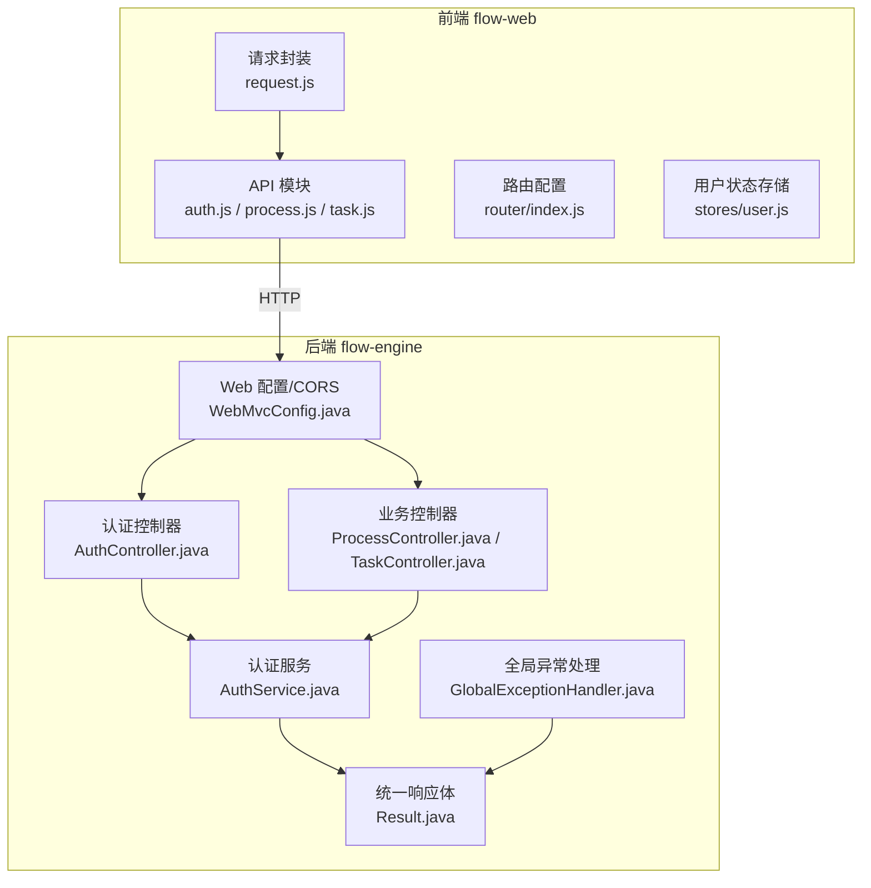
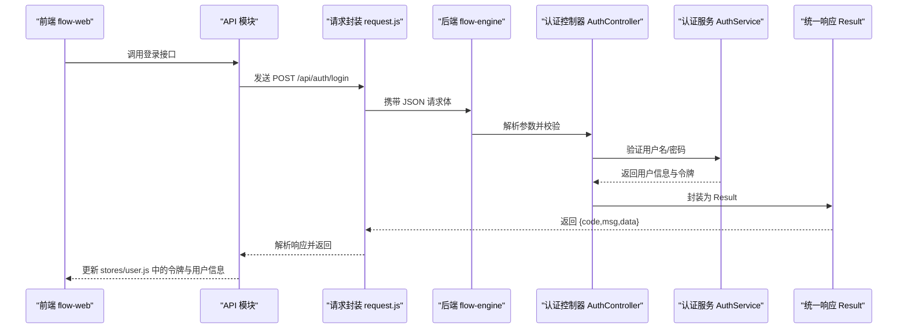
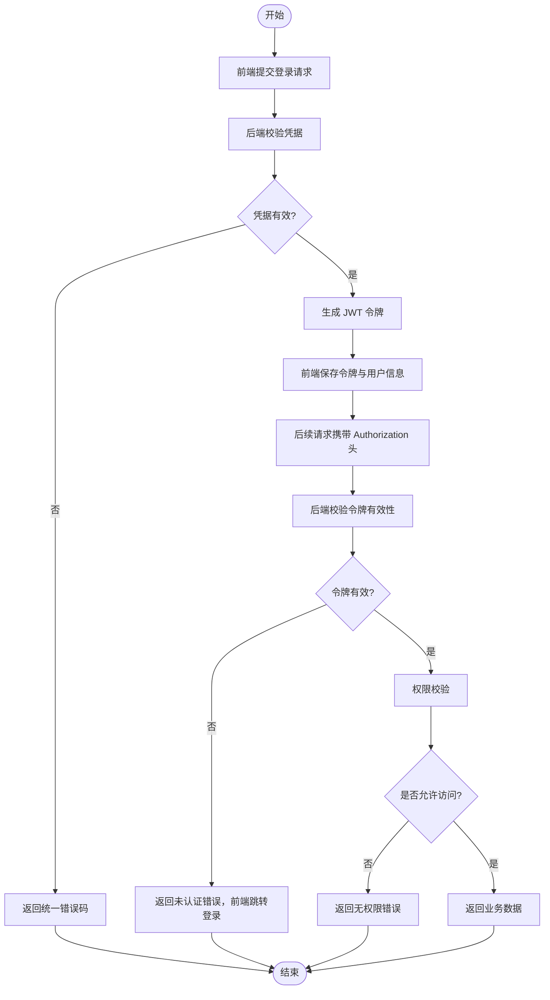
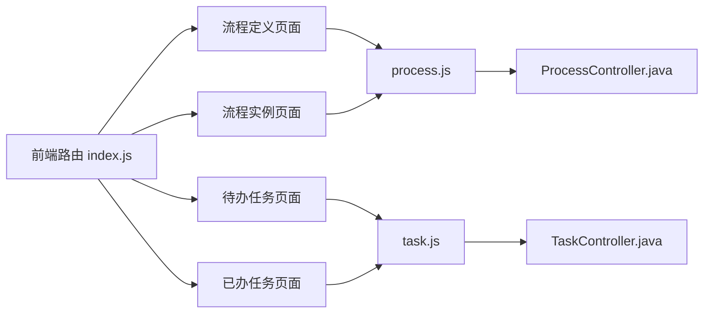
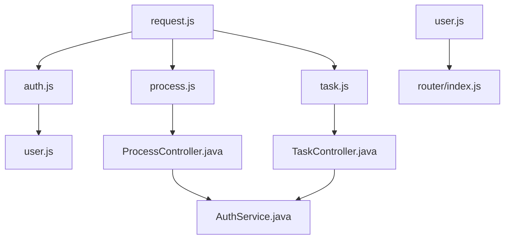

# 前后端分离设计

<cite>
**本文引用的文件**   
- [flow-web/src/api/request.js](file://flow-web/src/api/request.js)
- [flow-web/src/api/auth.js](file://flow-web/src/api/auth.js)
- [flow-web/src/router/index.js](file://flow-web/src/router/index.js)
- [flow-web/src/stores/user.js](file://flow-web/src/stores/user.js)
- [flow-web/vite.config.js](file://flow-web/vite.config.js)
- [flow-engine/src/main/java/com/flow/engine/common/Result.java](file://flow-engine/src/main/java/com/flow/engine/common/Result.java)
- [flow-engine/src/main/java/com/flow/engine/common/GlobalExceptionHandler.java](file://flow-engine/src/main/java/com/flow/engine/common/GlobalExceptionHandler.java)
- [flow-engine/src/main/java/com/flow/engine/config/WebMvcConfig.java](file://flow-engine/src/main/java/com/flow/engine/config/WebMvcConfig.java)
- [flow-engine/src/main/java/com/flow/engine/controllers/AuthController.java](file://flow-engine/src/main/java/com/flow/engine/controllers/AuthController.java)
- [flow-engine/src/main/java/com/flow/engine/service/AuthService.java](file://flow-engine/src/main/java/com/flow/engine/service/AuthService.java)
- [flow-engine/src/main/java/com/flow/engine/controller/ProcessController.java](file://flow-engine/src/main/java/com/flow/engine/controller/ProcessController.java)
- [flow-engine/src/main/java/com/flow/engine/controller/TaskController.java](file://flow-engine/src/main/java/com/flow/engine/controller/TaskController.java)
</cite>

## 目录
1. [简介](#简介)
2. [项目结构](#项目结构)
3. [核心组件](#核心组件)
4. [架构总览](#架构总览)
5. [详细组件分析](#详细组件分析)
6. [依赖关系分析](#依赖关系分析)
7. [性能考虑](#性能考虑)
8. [故障排查指南](#故障排查指南)
9. [结论](#结论)
10. [附录](#附录)

## 简介
本文件面向前后端分离的“流程引擎”系统，聚焦于 flow-web 前端应用与 flow-engine 后端服务的职责划分、通信机制与接口规范。文档涵盖：
- RESTful API 设计规范（URL 命名、HTTP 方法、请求响应格式、错误处理）
- 认证授权流程（JWT 生成到权限校验）
- 跨域配置与 CORS 设置
- 前端路由与后端控制器映射关系
- API 调用流程图与最佳实践

## 项目结构
- 前端（flow-web）
  - 基于 Vue 3 + Vite 的单页应用
  - 通过统一的 HTTP 客户端封装发起请求，集中管理鉴权头与全局错误
  - 路由按业务模块组织，页面级组件负责交互与数据展示
- 后端（flow-engine）
  - Spring Boot 服务，提供 RESTful API
  - 统一响应体与全局异常处理器
  - 安全拦截与权限控制由过滤器/拦截器实现
  - 业务逻辑集中在 Service 层，控制器仅做参数绑定与转发

图示来源
- [flow-web/src/api/request.js](file://flow-web/src/api/request.js)
- [flow-web/src/api/auth.js](file://flow-web/src/api/auth.js)
- [flow-web/src/router/index.js](file://flow-web/src/router/index.js)
- [flow-web/src/stores/user.js](file://flow-web/src/stores/user.js)
- [flow-engine/src/main/java/com/flow/engine/config/WebMvcConfig.java](file://flow-engine/src/main/java/com/flow/engine/config/WebMvcConfig.java)
- [flow-engine/src/main/java/com/flow/engine/common/GlobalExceptionHandler.java](file://flow-engine/src/main/java/com/flow/engine/common/GlobalExceptionHandler.java)
- [flow-engine/src/main/java/com/flow/engine/common/Result.java](file://flow-engine/src/main/java/com/flow/engine/common/Result.java)
- [flow-engine/src/main/java/com/flow/engine/controllers/AuthController.java](file://flow-engine/src/main/java/com/flow/engine/controllers/AuthController.java)
- [flow-engine/src/main/java/com/flow/engine/service/AuthService.java](file://flow-engine/src/main/java/com/flow/engine/service/AuthService.java)
- [flow-engine/src/main/java/com/flow/engine/controller/ProcessController.java](file://flow-engine/src/main/java/com/flow/engine/controller/ProcessController.java)
- [flow-engine/src/main/java/com/flow/engine/controller/TaskController.java](file://flow-engine/src/main/java/com/flow/engine/controller/TaskController.java)

章节来源
- [flow-web/src/api/request.js](file://flow-web/src/api/request.js)
- [flow-web/src/api/auth.js](file://flow-web/src/api/auth.js)
- [flow-web/src/router/index.js](file://flow-web/src/router/index.js)
- [flow-web/src/stores/user.js](file://flow-web/src/stores/user.js)
- [flow-engine/src/main/java/com/flow/engine/config/WebMvcConfig.java](file://flow-engine/src/main/java/com/flow/engine/config/WebMvcConfig.java)
- [flow-engine/src/main/java/com/flow/engine/common/GlobalExceptionHandler.java](file://flow-engine/src/main/java/com/flow/engine/common/GlobalExceptionHandler.java)
- [flow-engine/src/main/java/com/flow/engine/common/Result.java](file://flow-engine/src/main/java/com/flow/engine/common/Result.java)
- [flow-engine/src/main/java/com/flow/engine/controllers/AuthController.java](file://flow-engine/src/main/java/com/flow/engine/controllers/AuthController.java)
- [flow-engine/src/main/java/com/flow/engine/service/AuthService.java](file://flow-engine/src/main/java/com/flow/engine/service/AuthService.java)
- [flow-engine/src/main/java/com/flow/engine/controller/ProcessController.java](file://flow-engine/src/main/java/com/flow/engine/controller/ProcessController.java)
- [flow-engine/src/main/java/com/flow/engine/controller/TaskController.java](file://flow-engine/src/main/java/com/flow/engine/controller/TaskController.java)

## 核心组件
- 前端
  - 请求封装：统一 baseURL、超时、拦截器（添加鉴权头、统一错误提示）、重试策略等
  - API 模块：按领域拆分（认证、流程、任务、系统管理等），对外暴露函数式接口
  - 路由：按页面维度定义路由表，支持嵌套与守卫
  - 状态：集中保存登录态、用户信息、令牌等
- 后端
  - 控制器：RESTful 资源映射，参数校验，返回统一结果
  - 服务：业务编排、事务边界、领域规则
  - 通用：统一响应体 Result、全局异常 GlobalExceptionHandler、CORS 配置 WebMvcConfig

章节来源
- [flow-web/src/api/request.js](file://flow-web/src/api/request.js)
- [flow-web/src/api/auth.js](file://flow-web/src/api/auth.js)
- [flow-web/src/router/index.js](file://flow-web/src/router/index.js)
- [flow-web/src/stores/user.js](file://flow-web/src/stores/user.js)
- [flow-engine/src/main/java/com/flow/engine/common/Result.java](file://flow-engine/src/main/java/com/flow/engine/common/Result.java)
- [flow-engine/src/main/java/com/flow/engine/common/GlobalExceptionHandler.java](file://flow-engine/src/main/java/com/flow/engine/common/GlobalExceptionHandler.java)
- [flow-engine/src/main/java/com/flow/engine/config/WebMvcConfig.java](file://flow-engine/src/main/java/com/flow/engine/config/WebMvcConfig.java)

## 架构总览
前后端通过 HTTP/JSON 进行解耦通信。前端在请求前注入鉴权头，后端对未认证或无权限的请求进行拦截并返回标准错误码；成功响应使用统一 Result 包装。

图示来源
- [flow-web/src/api/request.js](file://flow-web/src/api/request.js)
- [flow-web/src/api/auth.js](file://flow-web/src/api/auth.js)
- [flow-web/src/stores/user.js](file://flow-web/src/stores/user.js)
- [flow-engine/src/main/java/com/flow/engine/controllers/AuthController.java](file://flow-engine/src/main/java/com/flow/engine/controllers/AuthController.java)
- [flow-engine/src/main/java/com/flow/engine/service/AuthService.java](file://flow-engine/src/main/java/com/flow/engine/service/AuthService.java)
- [flow-engine/src/main/java/com/flow/engine/common/Result.java](file://flow-engine/src/main/java/com/flow/engine/common/Result.java)

## 详细组件分析

### 认证与授权流程（JWT）
- 登录
  - 前端提交账号密码至认证接口
  - 后端校验成功后签发 JWT，包含用户标识与角色/权限信息
  - 前端将令牌持久化并在后续请求自动附加到请求头
- 鉴权
  - 后端过滤器/拦截器校验请求头中的令牌
  - 根据令牌解析用户身份与权限，结合资源访问策略决定是否放行
- 登出
  - 前端清除本地令牌与用户信息
  - 后端可选择性维护黑名单或短期令牌以增强安全性

图示来源
- [flow-web/src/api/auth.js](file://flow-web/src/api/auth.js)
- [flow-web/src/stores/user.js](file://flow-web/src/stores/user.js)
- [flow-engine/src/main/java/com/flow/engine/controllers/AuthController.java](file://flow-engine/src/main/java/com/flow/engine/controllers/AuthController.java)
- [flow-engine/src/main/java/com/flow/engine/service/AuthService.java](file://flow-engine/src/main/java/com/flow/engine/service/AuthService.java)
- [flow-engine/src/main/java/com/flow/engine/common/Result.java](file://flow-engine/src/main/java/com/flow/engine/common/Result.java)

章节来源
- [flow-web/src/api/auth.js](file://flow-web/src/api/auth.js)
- [flow-web/src/stores/user.js](file://flow-web/src/stores/user.js)
- [flow-engine/src/main/java/com/flow/engine/controllers/AuthController.java](file://flow-engine/src/main/java/com/flow/engine/controllers/AuthController.java)
- [flow-engine/src/main/java/com/flow/engine/service/AuthService.java](file://flow-engine/src/main/java/com/flow/engine/service/AuthService.java)

### RESTful API 设计规范
- URL 命名约定
  - 使用名词复数表示资源集合，如 /api/processes、/api/tasks
  - 子资源使用路径层级表达从属关系，如 /api/processes/{id}/instances
  - 避免动词出现在 URL 中，动作通过 HTTP 方法表达
- HTTP 方法使用
  - GET：查询资源列表或详情
  - POST：创建资源或触发不可幂等的操作
  - PUT：全量更新资源
  - PATCH：部分更新资源
  - DELETE：删除资源
- 请求/响应格式
  - Content-Type: application/json
  - 统一响应体 Result，包含 code、msg、data 字段
- 错误处理策略
  - 业务异常由全局异常处理器捕获，转换为统一 Result 错误码
  - 未认证/无权限返回特定错误码，前端据此跳转登录或提示
  - 参数校验失败返回明确字段级错误信息

章节来源
- [flow-engine/src/main/java/com/flow/engine/common/Result.java](file://flow-engine/src/main/java/com/flow/engine/common/Result.java)
- [flow-engine/src/main/java/com/flow/engine/common/GlobalExceptionHandler.java](file://flow-engine/src/main/java/com/flow/engine/common/GlobalExceptionHandler.java)

### 跨域配置与 CORS
- 后端
  - 通过 WebMvcConfig 配置允许的源、方法与头部
  - 建议在生产环境严格限制 allowedOrigins，并启用预检缓存
- 前端
  - 开发阶段可通过 Vite 代理转发到后端，避免跨域问题
  - 生产环境确保后端正确配置 CORS，且前端 baseURL 指向实际域名

章节来源
- [flow-engine/src/main/java/com/flow/engine/config/WebMvcConfig.java](file://flow-engine/src/main/java/com/flow/engine/config/WebMvcConfig.java)
- [flow-web/vite.config.js](file://flow-web/vite.config.js)

### 前端路由与后端控制器映射
- 前端路由
  - router/index.js 定义页面路由，支持嵌套与守卫
  - 路由守卫可检查本地令牌与用户信息，未登录时重定向至登录页
- 后端控制器
  - ProcessController、TaskController 等按资源维度暴露接口
  - 控制器与前端 API 模块一一对应，便于维护与测试

图示来源
- [flow-web/src/router/index.js](file://flow-web/src/router/index.js)
- [flow-web/src/api/process.js](file://flow-web/src/api/process.js)
- [flow-web/src/api/task.js](file://flow-web/src/api/task.js)
- [flow-engine/src/main/java/com/flow/engine/controller/ProcessController.java](file://flow-engine/src/main/java/com/flow/engine/controller/ProcessController.java)
- [flow-engine/src/main/java/com/flow/engine/controller/TaskController.java](file://flow-engine/src/main/java/com/flow/engine/controller/TaskController.java)

章节来源
- [flow-web/src/router/index.js](file://flow-web/src/router/index.js)
- [flow-engine/src/main/java/com/flow/engine/controller/ProcessController.java](file://flow-engine/src/main/java/com/flow/engine/controller/ProcessController.java)
- [flow-engine/src/main/java/com/flow/engine/controller/TaskController.java](file://flow-engine/src/main/java/com/flow/engine/controller/TaskController.java)

### API 调用示例与最佳实践
- 登录
  - 前端调用认证模块的登录函数，成功后将令牌与用户信息写入 stores/user.js
  - 后续请求由 request.js 自动附加 Authorization 头
- 获取流程列表
  - 前端调用 process.js 的列表接口，后端 ProcessController 返回分页数据
- 完成任务
  - 前端调用 task.js 的完成接口，后端 TaskController 执行业务并返回统一结果
- 错误处理最佳实践
  - 前端统一拦截器捕获网络错误与业务错误码，给出友好提示
  - 对于 401 未认证，自动跳转登录并清空本地状态
  - 对于 403 无权限，提示用户联系管理员或切换账号
  - 服务端通过全局异常处理器输出结构化错误，便于前端定位问题

章节来源
- [flow-web/src/api/request.js](file://flow-web/src/api/request.js)
- [flow-web/src/api/auth.js](file://flow-web/src/api/auth.js)
- [flow-web/src/stores/user.js](file://flow-web/src/stores/user.js)
- [flow-engine/src/main/java/com/flow/engine/common/GlobalExceptionHandler.java](file://flow-engine/src/main/java/com/flow/engine/common/GlobalExceptionHandler.java)

## 依赖关系分析
- 前端内部依赖
  - api/request.js 被所有 API 模块复用，提供一致的请求行为
  - stores/user.js 被路由守卫与页面组件读取，用于鉴权与显示
- 前后端耦合点
  - 统一响应体 Result 与错误码约定
  - 认证头名称与令牌格式
  - CORS 白名单与代理配置

图示来源
- [flow-web/src/api/request.js](file://flow-web/src/api/request.js)
- [flow-web/src/api/auth.js](file://flow-web/src/api/auth.js)
- [flow-web/src/api/process.js](file://flow-web/src/api/process.js)
- [flow-web/src/api/task.js](file://flow-web/src/api/task.js)
- [flow-web/src/stores/user.js](file://flow-web/src/stores/user.js)
- [flow-web/src/router/index.js](file://flow-web/src/router/index.js)
- [flow-engine/src/main/java/com/flow/engine/controller/ProcessController.java](file://flow-engine/src/main/java/com/flow/engine/controller/ProcessController.java)
- [flow-engine/src/main/java/com/flow/engine/controller/TaskController.java](file://flow-engine/src/main/java/com/flow/engine/controller/TaskController.java)
- [flow-engine/src/main/java/com/flow/engine/service/AuthService.java](file://flow-engine/src/main/java/com/flow/engine/service/AuthService.java)

章节来源
- [flow-web/src/api/request.js](file://flow-web/src/api/request.js)
- [flow-web/src/api/auth.js](file://flow-web/src/api/auth.js)
- [flow-web/src/api/process.js](file://flow-web/src/api/process.js)
- [flow-web/src/api/task.js](file://flow-web/src/api/task.js)
- [flow-web/src/stores/user.js](file://flow-web/src/stores/user.js)
- [flow-web/src/router/index.js](file://flow-web/src/router/index.js)
- [flow-engine/src/main/java/com/flow/engine/controller/ProcessController.java](file://flow-engine/src/main/java/com/flow/engine/controller/ProcessController.java)
- [flow-engine/src/main/java/com/flow/engine/controller/TaskController.java](file://flow-engine/src/main/java/com/flow/engine/controller/TaskController.java)
- [flow-engine/src/main/java/com/flow/engine/service/AuthService.java](file://flow-engine/src/main/java/com/flow/engine/service/AuthService.java)

## 性能考虑
- 前端
  - 合理设置请求超时与重试次数，避免雪崩
  - 列表接口支持分页与增量加载，减少首屏压力
  - 静态资源与图标按需加载，提升渲染速度
- 后端
  - 数据库查询加索引，避免 N+1 查询
  - 热点数据引入缓存（如 Redis），降低 DB 压力
  - 大对象传输采用分片或流式处理

[本节为通用指导，不直接分析具体文件]

## 故障排查指南
- 常见问题
  - 401 未认证：检查前端是否携带 Authorization 头，后端过滤器是否正确解析
  - 403 无权限：确认用户角色/权限与资源访问策略匹配
  - 跨域错误：核对后端 CORS 配置与前端 baseURL/代理设置
  - 业务错误：查看后端全局异常处理器输出的错误码与消息
- 调试建议
  - 前端控制台查看请求/响应与拦截器日志
  - 后端开启调试日志，关注异常堆栈与参数校验结果
  - 使用 Postman 或 curl 直接调用后端接口，隔离前端问题

章节来源
- [flow-engine/src/main/java/com/flow/engine/common/GlobalExceptionHandler.java](file://flow-engine/src/main/java/com/flow/engine/common/GlobalExceptionHandler.java)
- [flow-engine/src/main/java/com/flow/engine/config/WebMvcConfig.java](file://flow-engine/src/main/java/com/flow/engine/config/WebMvcConfig.java)
- [flow-web/src/api/request.js](file://flow-web/src/api/request.js)

## 结论
本项目采用清晰的前后端分离架构：前端专注交互与状态管理，后端提供稳定、规范的 RESTful API。通过统一响应体、全局异常处理与 CORS 配置，保障了系统的可维护性与可扩展性。建议在后续迭代中持续完善权限模型、监控与审计能力，以提升整体质量与用户体验。

[本节为总结性内容，不直接分析具体文件]

## 附录
- 术语
  - JWT：JSON Web Token，用于无状态的身份认证
  - CORS：跨域资源共享，浏览器安全策略的一部分
  - Result：后端统一响应体，包含 code、msg、data
- 参考文件
  - 前端请求封装与 API 模块
  - 后端控制器与服务层
  - 统一响应与异常处理
  - CORS 与代理配置

[本节为补充说明，不直接分析具体文件]