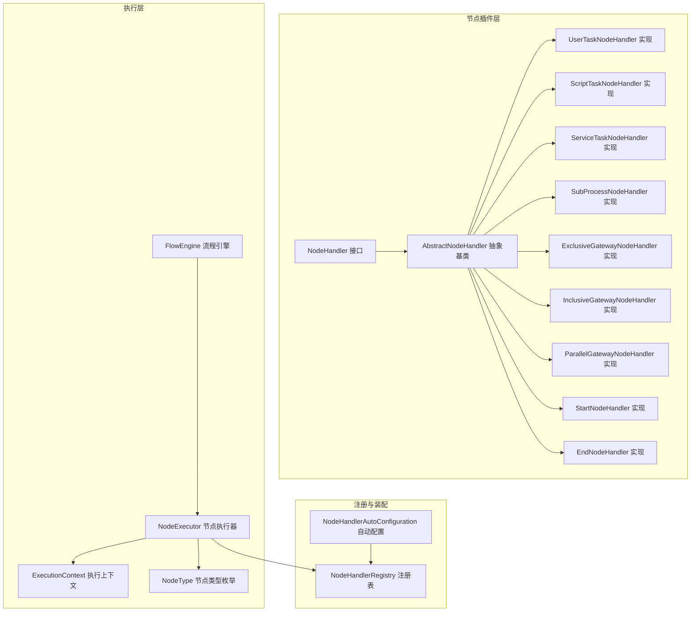
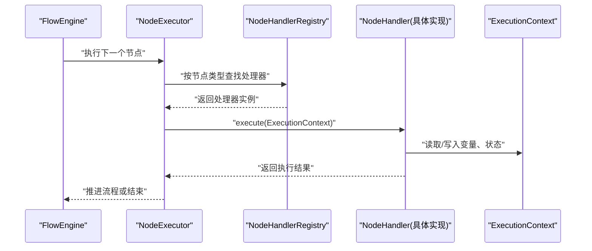
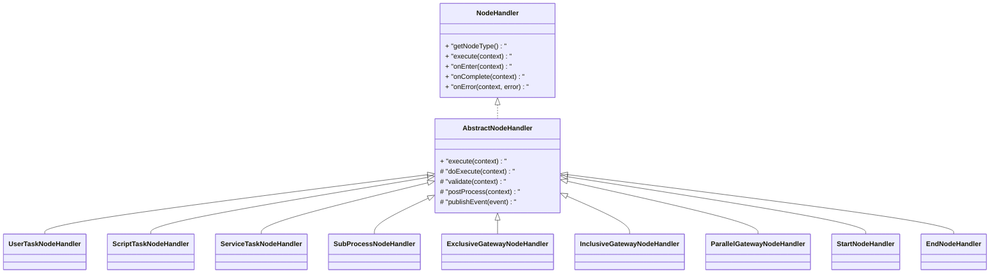
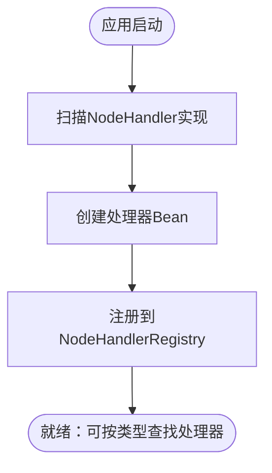
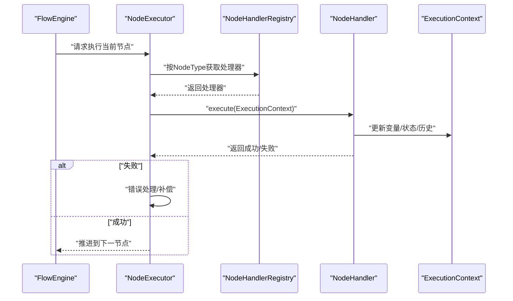
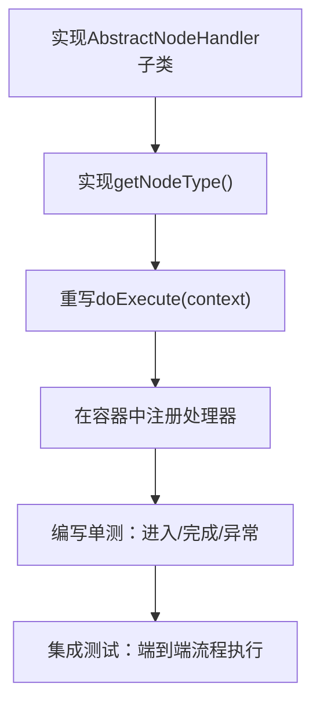
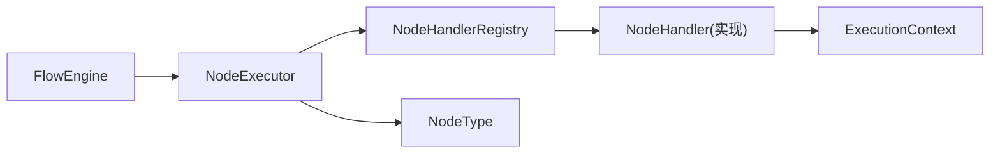

# 插件化架构设计

<cite>
**本文引用的文件**
- [NodeHandler.java](file://flow-engine/src/main/java/com/flow/engine/node/NodeHandler.java)
- [AbstractNodeHandler.java](file://flow-engine/src/main/java/com/flow/engine/node/AbstractNodeHandler.java)
- [NodeHandlerRegistry.java](file://flow-engine/src/main/java/com/flow/engine/node/NodeHandlerRegistry.java)
- [NodeHandlerAutoConfiguration.java](file://flow-engine/src/main/java/com/flow/engine/node/NodeHandlerAutoConfiguration.java)
- [UserTaskNodeHandler.java](file://flow-engine/src/main/java/com/flow/engine/node/impl/UserTaskNodeHandler.java)
- [NodeType.java](file://flow-engine/src/main/java/com/flow/engine/common/enums/NodeType.java)
- [NodeExecutor.java](file://flow-engine/src/main/java/com/flow/engine/engine/NodeExecutor.java)
- [FlowEngine.java](file://flow-engine/src/main/java/com/flow/engine/engine/FlowEngine.java)
- [ExecutionContext.java](file://flow-engine/src/main/java/com/flow/engine/node/ExecutionContext.java)
- [CustomDemoNodeHandler.java](file://flow-engine/src/main/java/com/flow/engine/node/impl/CustomDemoNodeHandler.java)
- [StartNodeHandler.java](file://flow-engine/src/main/java/com/flow/engine/node/impl/StartNodeHandler.java)
- [EndNodeHandler.java](file://flow-engine/src/main/java/com/flow/engine/node/impl/EndNodeHandler.java)
- [ExclusiveGatewayNodeHandler.java](file://flow-engine/src/main/java/com/flow/engine/node/impl/ExclusiveGatewayNodeHandler.java)
- [InclusiveGatewayNodeHandler.java](file://flow-engine/src/main/java/com/flow/engine/node/impl/InclusiveGatewayNodeHandler.java)
- [ParallelGatewayNodeHandler.java](file://flow-engine/src/main/java/com/flow/engine/node/impl/ParallelGatewayNodeHandler.java)
- [ScriptTaskNodeHandler.java](file://flow-engine/src/main/java/com/flow/engine/node/impl/ScriptTaskNodeHandler.java)
- [ServiceTaskNodeHandler.java](file://flow-engine/src/main/java/com/flow/engine/node/impl/ServiceTaskNodeHandler.java)
- [SubProcessNodeHandler.java](file://flow-engine/src/main/java/com/flow/engine/node/impl/SubProcessNodeHandler.java)
- [NodeHandlerAutoRegisterTest.java](file://flow-engine/src/test/java/com/flow/engine/node/NodeHandlerAutoRegisterTest.java)
- [NodeHandlerRegistryTest.java](file://flow-engine/src/test/java/com/flow/engine/node/NodeHandlerRegistryTest.java)
</cite>

## 目录
1. [简介](#简介)
2. [项目结构](#项目结构)
3. [核心组件](#核心组件)
4. [架构总览](#架构总览)
5. [详细组件分析](#详细组件分析)
6. [依赖关系分析](#依赖关系分析)
7. [性能考虑](#性能考虑)
8. [故障排查指南](#故障排查指南)
9. [结论](#结论)
10. [附录：插件开发指南](#附录插件开发指南)

## 简介
本文件围绕流程引擎的插件化架构进行系统化说明，重点覆盖以下方面：
- NodeHandler接口的设计理念与扩展机制
- 节点处理器注册表的工作原理（自动扫描、依赖注入、生命周期管理）
- 抽象基类AbstractNodeHandler提供的通用能力与模板方法模式
- 以UserTaskNodeHandler为例，阐述自定义节点处理器的实现步骤
- 节点类型枚举与节点执行器的工作流程
- 插件版本兼容性与热加载机制建议
- 插件调试与测试最佳实践

## 项目结构
与插件化架构相关的核心代码位于 flow-engine 模块的 node 包及其实现子包 impl。关键入口包括：
- 接口与抽象基类：NodeHandler、AbstractNodeHandler
- 注册与自动装配：NodeHandlerRegistry、NodeHandlerAutoConfiguration
- 内置实现：impl 下的各类具体处理器
- 执行层：NodeExecutor、FlowEngine
- 上下文：ExecutionContext
- 类型定义：NodeType

图表来源
- [NodeHandler.java](file://flow-engine/src/main/java/com/flow/engine/node/NodeHandler.java)
- [AbstractNodeHandler.java](file://flow-engine/src/main/java/com/flow/engine/node/AbstractNodeHandler.java)
- [NodeHandlerRegistry.java](file://flow-engine/src/main/java/com/flow/engine/node/NodeHandlerRegistry.java)
- [NodeHandlerAutoConfiguration.java](file://flow-engine/src/main/java/com/flow/engine/node/NodeHandlerAutoConfiguration.java)
- [UserTaskNodeHandler.java](file://flow-engine/src/main/java/com/flow/engine/node/impl/UserTaskNodeHandler.java)
- [NodeType.java](file://flow-engine/src/main/java/com/flow/engine/common/enums/NodeType.java)
- [NodeExecutor.java](file://flow-engine/src/main/java/com/flow/engine/engine/NodeExecutor.java)
- [FlowEngine.java](file://flow-engine/src/main/java/com/flow/engine/engine/FlowEngine.java)
- [ExecutionContext.java](file://flow-engine/src/main/java/com/flow/engine/node/ExecutionContext.java)

章节来源
- [NodeHandler.java](file://flow-engine/src/main/java/com/flow/engine/node/NodeHandler.java)
- [AbstractNodeHandler.java](file://flow-engine/src/main/java/com/flow/engine/node/AbstractNodeHandler.java)
- [NodeHandlerRegistry.java](file://flow-engine/src/main/java/com/flow/engine/node/NodeHandlerRegistry.java)
- [NodeHandlerAutoConfiguration.java](file://flow-engine/src/main/java/com/flow/engine/node/NodeHandlerAutoConfiguration.java)
- [UserTaskNodeHandler.java](file://flow-engine/src/main/java/com/flow/engine/node/impl/UserTaskNodeHandler.java)
- [NodeType.java](file://flow-engine/src/main/java/com/flow/engine/common/enums/NodeType.java)
- [NodeExecutor.java](file://flow-engine/src/main/java/com/flow/engine/engine/NodeExecutor.java)
- [FlowEngine.java](file://flow-engine/src/main/java/com/flow/engine/engine/FlowEngine.java)
- [ExecutionContext.java](file://flow-engine/src/main/java/com/flow/engine/node/ExecutionContext.java)

## 核心组件
本节聚焦插件化架构的核心构件，解释其职责与协作方式。

- NodeHandler 接口
  - 定义节点处理契约，包含识别节点类型、进入节点、完成节点等生命周期钩子。
  - 通过统一的 execute(context) 方法驱动业务逻辑，使不同节点具备一致的执行语义。
  - 支持声明式元数据（如节点名称、描述、版本），便于前端展示与运行时校验。

- AbstractNodeHandler 抽象基类
  - 提供模板方法模式：在统一的生命周期中编排“前置校验—执行业务—后置处理”的流程。
  - 封装通用能力：参数解析、变量读写、事件发布、异常转换、日志埋点等。
  - 简化子类实现：子类仅需关注特定节点的业务细节。

- NodeHandlerRegistry 注册表
  - 维护节点类型到处理器实例的映射，提供按类型查找、批量查询、覆盖注册等能力。
  - 支持线程安全的并发访问，保证高并发场景下节点解析的性能与一致性。

- NodeHandlerAutoConfiguration 自动配置
  - 基于Spring容器扫描并自动注册所有实现了NodeHandler的Bean。
  - 将处理器实例注入注册表，完成“发现—装配—注册”的一体化流程。

- ExecutionContext 执行上下文
  - 承载流程实例、节点实例、变量、历史、事件等运行时信息。
  - 为处理器提供一致的上下文访问API，屏蔽底层存储与计算细节。

- NodeType 节点类型枚举
  - 集中定义支持的节点类型常量，确保前后端与运行时的类型一致性。

- NodeExecutor 节点执行器
  - 负责根据当前节点类型从注册表获取对应处理器，并调用其execute方法。
  - 协调上下文更新、事务边界、错误处理与事件广播。

章节来源
- [NodeHandler.java](file://flow-engine/src/main/java/com/flow/engine/node/NodeHandler.java)
- [AbstractNodeHandler.java](file://flow-engine/src/main/java/com/flow/engine/node/AbstractNodeHandler.java)
- [NodeHandlerRegistry.java](file://flow-engine/src/main/java/com/flow/engine/node/NodeHandlerRegistry.java)
- [NodeHandlerAutoConfiguration.java](file://flow-engine/src/main/java/com/flow/engine/node/NodeHandlerAutoConfiguration.java)
- [ExecutionContext.java](file://flow-engine/src/main/java/com/flow/engine/node/ExecutionContext.java)
- [NodeType.java](file://flow-engine/src/main/java/com/flow/engine/common/enums/NodeType.java)
- [NodeExecutor.java](file://flow-engine/src/main/java/com/flow/engine/engine/NodeExecutor.java)

## 架构总览
下图展示了从流程引擎到具体节点处理器的完整调用链，以及注册与装配过程。

图表来源
- [FlowEngine.java](file://flow-engine/src/main/java/com/flow/engine/engine/FlowEngine.java)
- [NodeExecutor.java](file://flow-engine/src/main/java/com/flow/engine/engine/NodeExecutor.java)
- [NodeHandlerRegistry.java](file://flow-engine/src/main/java/com/flow/engine/node/NodeHandlerRegistry.java)
- [NodeHandler.java](file://flow-engine/src/main/java/com/flow/engine/node/NodeHandler.java)
- [ExecutionContext.java](file://flow-engine/src/main/java/com/flow/engine/node/ExecutionContext.java)

## 详细组件分析

### NodeHandler 接口与模板方法
- 设计理念
  - 以“类型+行为”解耦：NodeType决定选择哪个处理器，NodeHandler定义如何处理。
  - 生命周期清晰：进入节点、执行业务、完成节点、失败回滚等阶段可被统一编排。
- 扩展机制
  - 新增节点类型只需实现NodeHandler并在容器中注册，无需修改核心执行路径。
  - 通过AbstractNodeHandler复用通用逻辑，降低重复代码与维护成本。

图表来源
- [NodeHandler.java](file://flow-engine/src/main/java/com/flow/engine/node/NodeHandler.java)
- [AbstractNodeHandler.java](file://flow-engine/src/main/java/com/flow/engine/node/AbstractNodeHandler.java)
- [UserTaskNodeHandler.java](file://flow-engine/src/main/java/com/flow/engine/node/impl/UserTaskNodeHandler.java)
- [ScriptTaskNodeHandler.java](file://flow-engine/src/main/java/com/flow/engine/node/impl/ScriptTaskNodeHandler.java)
- [ServiceTaskNodeHandler.java](file://flow-engine/src/main/java/com/flow/engine/node/impl/ServiceTaskNodeHandler.java)
- [SubProcessNodeHandler.java](file://flow-engine/src/main/java/com/flow/engine/node/impl/SubProcessNodeHandler.java)
- [ExclusiveGatewayNodeHandler.java](file://flow-engine/src/main/java/com/flow/engine/node/impl/ExclusiveGatewayNodeHandler.java)
- [InclusiveGatewayNodeHandler.java](file://flow-engine/src/main/java/com/flow/engine/node/impl/InclusiveGatewayNodeHandler.java)
- [ParallelGatewayNodeHandler.java](file://flow-engine/src/main/java/com/flow/engine/node/impl/ParallelGatewayNodeHandler.java)
- [StartNodeHandler.java](file://flow-engine/src/main/java/com/flow/engine/node/impl/StartNodeHandler.java)
- [EndNodeHandler.java](file://flow-engine/src/main/java/com/flow/engine/node/impl/EndNodeHandler.java)

章节来源
- [NodeHandler.java](file://flow-engine/src/main/java/com/flow/engine/node/NodeHandler.java)
- [AbstractNodeHandler.java](file://flow-engine/src/main/java/com/flow/engine/node/AbstractNodeHandler.java)

### 节点处理器注册表与自动装配
- 自动扫描
  - 通过NodeHandlerAutoConfiguration在应用启动时扫描所有NodeHandler实现，将其注入NodeHandlerRegistry。
- 依赖注入
  - 使用Spring容器管理处理器实例的生命周期，支持构造器注入、属性注入等。
- 生命周期管理
  - 注册表在应用启动期完成初始化，运行期提供只读查找；可在需要时支持动态覆盖注册。
- 线程安全
  - 注册表内部采用并发安全的数据结构，避免多实例并发访问导致的状态不一致。

图表来源
- [NodeHandlerAutoConfiguration.java](file://flow-engine/src/main/java/com/flow/engine/node/NodeHandlerAutoConfiguration.java)
- [NodeHandlerRegistry.java](file://flow-engine/src/main/java/com/flow/engine/node/NodeHandlerRegistry.java)

章节来源
- [NodeHandlerAutoConfiguration.java](file://flow-engine/src/main/java/com/flow/engine/node/NodeHandlerAutoConfiguration.java)
- [NodeHandlerRegistry.java](file://flow-engine/src/main/java/com/flow/engine/node/NodeHandlerRegistry.java)

### 节点执行器工作流程
- 执行入口
  - FlowEngine委托NodeExecutor执行当前节点。
- 处理器选择
  - NodeExecutor依据当前节点的NodeType从注册表获取处理器实例。
- 执行与上下文更新
  - 调用处理器execute，处理器通过ExecutionContext读写变量、记录历史、触发事件。
- 错误处理
  - 捕获异常并转换为统一错误模型，必要时触发回滚或补偿逻辑。

图表来源
- [FlowEngine.java](file://flow-engine/src/main/java/com/flow/engine/engine/FlowEngine.java)
- [NodeExecutor.java](file://flow-engine/src/main/java/com/flow/engine/engine/NodeExecutor.java)
- [NodeHandlerRegistry.java](file://flow-engine/src/main/java/com/flow/engine/node/NodeHandlerRegistry.java)
- [NodeHandler.java](file://flow-engine/src/main/java/com/flow/engine/node/NodeHandler.java)
- [ExecutionContext.java](file://flow-engine/src/main/java/com/flow/engine/node/ExecutionContext.java)

章节来源
- [FlowEngine.java](file://flow-engine/src/main/java/com/flow/engine/engine/FlowEngine.java)
- [NodeExecutor.java](file://flow-engine/src/main/java/com/flow/engine/engine/NodeExecutor.java)
- [NodeHandlerRegistry.java](file://flow-engine/src/main/java/com/flow/engine/node/NodeHandlerRegistry.java)
- [ExecutionContext.java](file://flow-engine/src/main/java/com/flow/engine/node/ExecutionContext.java)

### 以 UserTaskNodeHandler 为例：自定义节点处理器实现步骤
- 步骤概览
  - 新建实现类继承AbstractNodeHandler，重写doExecute等方法。
  - 在getNodeType中返回对应的NodeType值。
  - 在容器中注册该处理器（通常由自动装配完成）。
  - 编写单元测试验证进入、完成、异常分支。
- 典型职责
  - 用户任务：生成待办、分配执行人、设置超时策略、记录审批意见等。
  - 与其他服务交互：通过上下文或服务层完成外部系统调用。
  - 事件与审计：在进入/完成时发布事件，记录操作日志。

图表来源
- [UserTaskNodeHandler.java](file://flow-engine/src/main/java/com/flow/engine/node/impl/UserTaskNodeHandler.java)
- [AbstractNodeHandler.java](file://flow-engine/src/main/java/com/flow/engine/node/AbstractNodeHandler.java)
- [NodeType.java](file://flow-engine/src/main/java/com/flow/engine/common/enums/NodeType.java)

章节来源
- [UserTaskNodeHandler.java](file://flow-engine/src/main/java/com/flow/engine/node/impl/UserTaskNodeHandler.java)
- [AbstractNodeHandler.java](file://flow-engine/src/main/java/com/flow/engine/node/AbstractNodeHandler.java)
- [NodeType.java](file://flow-engine/src/main/java/com/flow/engine/common/enums/NodeType.java)

### 其他内置节点处理器示例
- 脚本任务（ScriptTaskNodeHandler）：执行表达式或脚本，常用于数据转换与条件判断。
- 服务任务（ServiceTaskNodeHandler）：调用外部服务或领域服务，适合异步或同步集成。
- 子流程（SubProcessNodeHandler）：嵌套流程执行，支持参数传递与返回值合并。
- 排他网关（ExclusiveGatewayNodeHandler）：基于条件选择唯一分支。
- 包容网关（InclusiveGatewayNodeHandler）：基于条件选择多个分支。
- 并行网关（ParallelGatewayNodeHandler）：并行分支与汇聚。
- 开始/结束节点（StartNodeHandler/EndNodeHandler）：流程起点与终点控制。

章节来源
- [ScriptTaskNodeHandler.java](file://flow-engine/src/main/java/com/flow/engine/node/impl/ScriptTaskNodeHandler.java)
- [ServiceTaskNodeHandler.java](file://flow-engine/src/main/java/com/flow/engine/node/impl/ServiceTaskNodeHandler.java)
- [SubProcessNodeHandler.java](file://flow-engine/src/main/java/com/flow/engine/node/impl/SubProcessNodeHandler.java)
- [ExclusiveGatewayNodeHandler.java](file://flow-engine/src/main/java/com/flow/engine/node/impl/ExclusiveGatewayNodeHandler.java)
- [InclusiveGatewayNodeHandler.java](file://flow-engine/src/main/java/com/flow/engine/node/impl/InclusiveGatewayNodeHandler.java)
- [ParallelGatewayNodeHandler.java](file://flow-engine/src/main/java/com/flow/engine/node/impl/ParallelGatewayNodeHandler.java)
- [StartNodeHandler.java](file://flow-engine/src/main/java/com/flow/engine/node/impl/StartNodeHandler.java)
- [EndNodeHandler.java](file://flow-engine/src/main/java/com/flow/engine/node/impl/EndNodeHandler.java)

## 依赖关系分析
- 组件耦合
  - NodeExecutor对NodeHandlerRegistry低耦合，仅依赖接口与类型映射。
  - 处理器对AbstractNodeHandler依赖，复用通用逻辑，减少重复。
- 外部依赖
  - Spring容器用于自动装配与生命周期管理。
  - 数据库与缓存通过服务层间接访问，处理器不直接耦合持久化。
- 潜在循环依赖
  - 处理器之间应避免相互引用，通过上下文与服务层解耦。

图表来源
- [FlowEngine.java](file://flow-engine/src/main/java/com/flow/engine/engine/FlowEngine.java)
- [NodeExecutor.java](file://flow-engine/src/main/java/com/flow/engine/engine/NodeExecutor.java)
- [NodeHandlerRegistry.java](file://flow-engine/src/main/java/com/flow/engine/node/NodeHandlerRegistry.java)
- [NodeType.java](file://flow-engine/src/main/java/com/flow/engine/common/enums/NodeType.java)
- [NodeHandler.java](file://flow-engine/src/main/java/com/flow/engine/node/NodeHandler.java)
- [ExecutionContext.java](file://flow-engine/src/main/java/com/flow/engine/node/ExecutionContext.java)

章节来源
- [FlowEngine.java](file://flow-engine/src/main/java/com/flow/engine/engine/FlowEngine.java)
- [NodeExecutor.java](file://flow-engine/src/main/java/com/flow/engine/engine/NodeExecutor.java)
- [NodeHandlerRegistry.java](file://flow-engine/src/main/java/com/flow/engine/node/NodeHandlerRegistry.java)
- [NodeType.java](file://flow-engine/src/main/java/com/flow/engine/common/enums/NodeType.java)
- [NodeHandler.java](file://flow-engine/src/main/java/com/flow/engine/node/NodeHandler.java)
- [ExecutionContext.java](file://flow-engine/src/main/java/com/flow/engine/node/ExecutionContext.java)

## 性能考虑
- 注册表查找复杂度
  - 按类型查找通常为O(1)，适合高频调用。
- 处理器实现优化
  - 避免在execute中进行重型I/O阻塞操作，必要时引入异步队列或批处理。
- 上下文访问优化
  - 合理缓存热点变量，减少频繁读写。
- 事件与日志
  - 控制事件粒度与日志级别，避免过多输出影响吞吐。

[本节为通用指导，不涉及具体文件分析]

## 故障排查指南
- 常见问题
  - 未找到处理器：检查NodeType是否匹配、处理器是否正确注册。
  - 循环依赖：处理器间互相引用导致启动失败，应通过服务层解耦。
  - 上下文变量缺失：确认上游节点已正确写入所需变量。
- 定位手段
  - 启用调试日志，观察节点进入/完成/错误事件。
  - 使用单元测试快速复现问题，隔离外部依赖。
- 参考测试用例
  - 自动注册与注册表行为的测试有助于验证装配与查找逻辑。

章节来源
- [NodeHandlerAutoRegisterTest.java](file://flow-engine/src/test/java/com/flow/engine/node/NodeHandlerAutoRegisterTest.java)
- [NodeHandlerRegistryTest.java](file://flow-engine/src/test/java/com/flow/engine/node/NodeHandlerRegistryTest.java)

## 结论
本插件化架构通过清晰的接口与抽象基类，结合自动装配与注册表机制，实现了节点处理的高内聚、低耦合与易扩展。开发者只需关注具体节点的业务逻辑，即可无缝融入流程引擎。配合完善的测试与调试手段，可有效保障插件质量与稳定性。

[本节为总结性内容，不涉及具体文件分析]

## 附录：插件开发指南

### 自定义节点开发步骤
- 新建处理器
  - 继承AbstractNodeHandler，实现getNodeType与doExecute。
- 注册与装配
  - 将处理器作为Spring Bean暴露，自动装配会完成注册。
- 编写测试
  - 单测覆盖正常路径、异常路径与边界条件。
  - 集成测试验证端到端流程执行。
- 文档与元数据
  - 完善节点名称、描述、版本等元数据，便于前端展示与兼容性管理。

章节来源
- [AbstractNodeHandler.java](file://flow-engine/src/main/java/com/flow/engine/node/AbstractNodeHandler.java)
- [NodeHandlerAutoConfiguration.java](file://flow-engine/src/main/java/com/flow/engine/node/NodeHandlerAutoConfiguration.java)
- [NodeHandlerRegistry.java](file://flow-engine/src/main/java/com/flow/engine/node/NodeHandlerRegistry.java)

### 插件版本兼容性与热加载机制
- 版本兼容
  - 在处理器元数据中声明版本号，注册表在加载时进行兼容性校验。
  - 对破坏性变更提供迁移策略与降级方案。
- 热加载建议
  - 通过动态注册API在运行期替换处理器实现，注意原子性与回滚。
  - 结合灰度发布与流量切换，逐步替换旧实现。

[本节为概念性指导，不涉及具体文件分析]

### 插件调试与测试最佳实践
- 调试
  - 在处理器关键路径添加结构化日志，记录输入输出与耗时。
  - 使用断点与上下文快照辅助定位问题。
- 测试
  - 单测：Mock外部依赖，验证处理器逻辑。
  - 集成测试：使用真实或轻量级上下文，验证端到端流程。
  - 回归测试：覆盖常见节点组合与异常场景。

章节来源
- [CustomDemoNodeHandler.java](file://flow-engine/src/main/java/com/flow/engine/node/impl/CustomDemoNodeHandler.java)
- [NodeHandlerAutoRegisterTest.java](file://flow-engine/src/test/java/com/flow/engine/node/NodeHandlerAutoRegisterTest.java)
- [NodeHandlerRegistryTest.java](file://flow-engine/src/test/java/com/flow/engine/node/NodeHandlerRegistryTest.java)