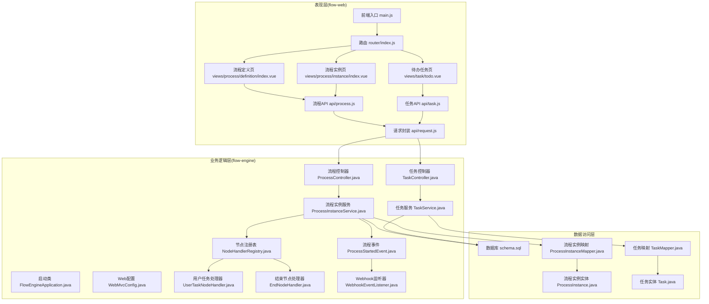
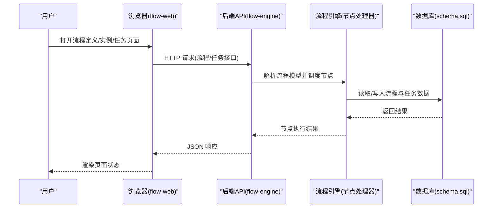
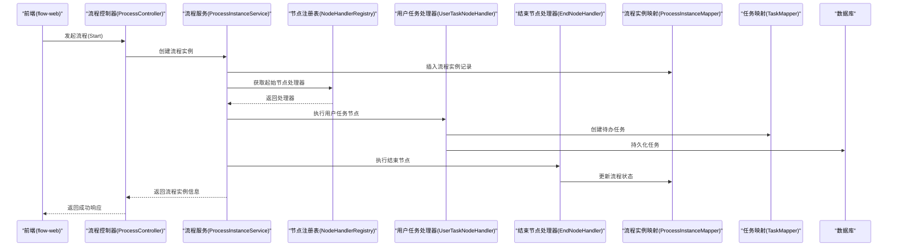
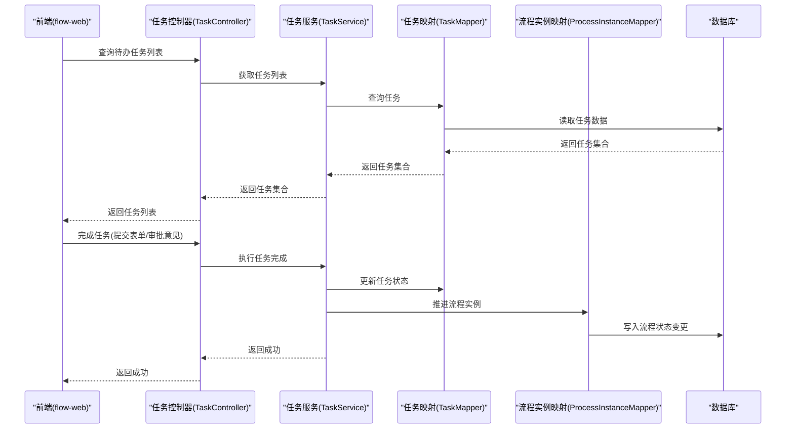
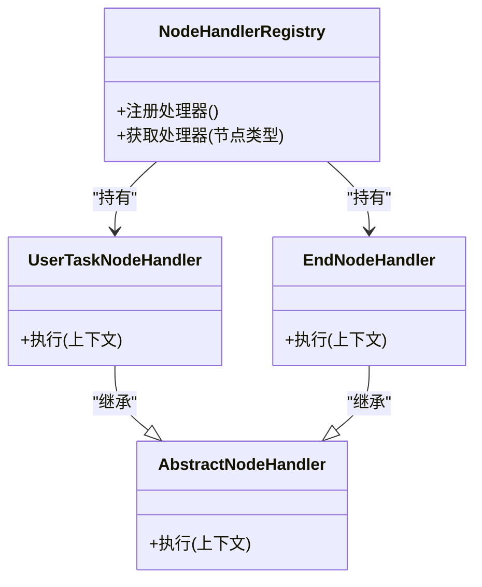
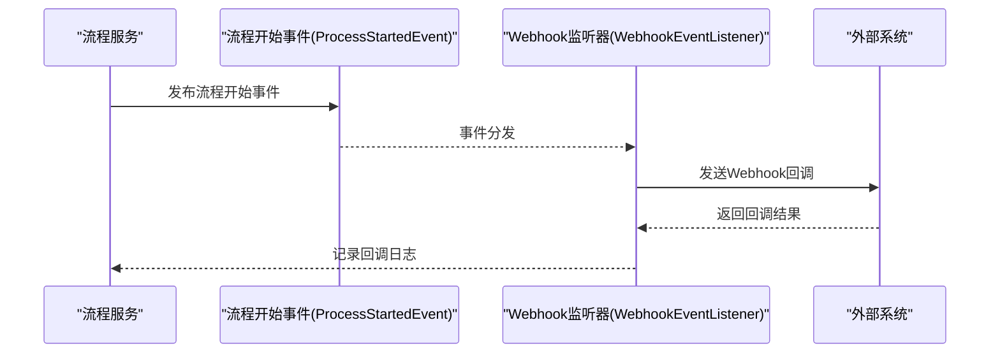
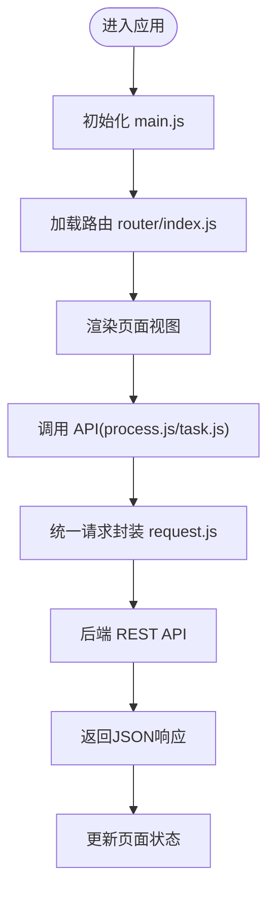
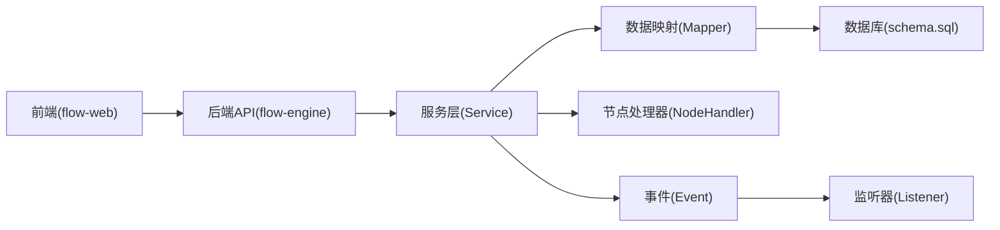

# 整体架构模式

<cite>
**本文引用的文件**   
- [flow-engine/src/main/java/com/flow/engine/FlowEngineApplication.java](file://flow-engine/src/main/java/com/flow/engine/FlowEngineApplication.java)
- [flow-engine/src/main/resources/application.yml](file://flow-engine/src/main/resources/application.yml)
- [flow-engine/src/main/resources/db/schema.sql](file://flow-engine/src/main/resources/db/schema.sql)
- [flow-engine/src/main/java/com/flow/engine/common/GlobalExceptionHandler.java](file://flow-engine/src/main/java/com/flow/engine/common/GlobalExceptionHandler.java)
- [flow-engine/src/main/java/com/flow/engine/common/RequestContext.java](file://flow-engine/src/main/java/com/flow/engine/common/RequestContext.java)
- [flow-engine/src/main/java/com/flow/engine/config/WebMvcConfig.java](file://flow-engine/src/main/java/com/flow/engine/config/WebMvcConfig.java)
- [flow-engine/src/main/java/com/flow/engine/controller/ProcessController.java](file://flow-engine/src/main/java/com/flow/engine/controller/ProcessController.java)
- [flow-engine/src/main/java/com/flow/engine/controller/TaskController.java](file://flow-engine/src/main/java/com/flow/engine/controller/TaskController.java)
- [flow-engine/src/main/java/com/flow/engine/service/ProcessInstanceService.java](file://flow-engine/src/main/java/com/flow/engine/service/ProcessInstanceService.java)
- [flow-engine/src/main/java/com/flow/engine/service/TaskService.java](file://flow-engine/src/main/java/com/flow/engine/service/TaskService.java)
- [flow-engine/src/main/java/com/flow/engine/mapper/ProcessInstanceMapper.java](file://flow-engine/src/main/java/com/flow/engine/mapper/ProcessInstanceMapper.java)
- [flow-engine/src/main/java/com/flow/engine/mapper/TaskMapper.java](file://flow-engine/src/main/java/com/flow/engine/mapper/TaskMapper.java)
- [flow-engine/src/main/java/com/flow/engine/entity/ProcessInstance.java](file://flow-engine/src/main/java/com/flow/engine/entity/ProcessInstance.java)
- [flow-engine/src/main/java/com/flow/engine/entity/Task.java](file://flow-engine/src/main/java/com/flow/engine/entity/Task.java)
- [flow-engine/src/main/java/com/flow/engine/node/NodeHandlerRegistry.java](file://flow-engine/src/main/java/com/flow/engine/node/NodeHandlerRegistry.java)
- [flow-engine/src/main/java/com/flow/engine/node/impl/UserTaskNodeHandler.java](file://flow-engine/src/main/java/com/flow/engine/node/impl/UserTaskNodeHandler.java)
- [flow-engine/src/main/java/com/flow/engine/node/impl/EndNodeHandler.java](file://flow-engine/src/main/java/com/flow/engine/node/impl/EndNodeHandler.java)
- [flow-engine/src/main/java/com/flow/engine/event/ProcessStartedEvent.java](file://flow-engine/src/main/java/com/flow/engine/event/ProcessStartedEvent.java)
- [flow-engine/src/main/java/com/flow/engine/listener/WebhookEventListener.java](file://flow-engine/src/main/java/com/flow/engine/listener/WebhookEventListener.java)
- [flow-web/src/main.js](file://flow-web/src/main.js)
- [flow-web/src/router/index.js](file://flow-web/src/router/index.js)
- [flow-web/src/api/request.js](file://flow-web/src/api/request.js)
- [flow-web/src/api/process.js](file://flow-web/src/api/process.js)
- [flow-web/src/api/task.js](file://flow-web/src/api/task.js)
- [flow-web/src/views/process/definition/index.vue](file://flow-web/src/views/process/definition/index.vue)
- [flow-web/src/views/process/instance/index.vue](file://flow-web/src/views/process/instance/index.vue)
- [flow-web/src/views/task/todo.vue](file://flow-web/src/views/task/todo.vue)
</cite>

## 目录
1. [简介](#简介)
2. [项目结构](#项目结构)
3. [核心组件](#核心组件)
4. [架构总览](#架构总览)
5. [详细组件分析](#详细组件分析)
6. [依赖关系分析](#依赖关系分析)
7. [性能与可扩展性](#性能与可扩展性)
8. [故障隔离与微服务考虑](#故障隔离与微服务考虑)
9. [排障指南](#排障指南)
10. [结论](#结论)

## 简介
本仓库采用前后端分离的三层架构：表现层（flow-web，Vue.js）、业务逻辑层（flow-engine，Spring Boot）和数据访问层（MyBatis-Plus + MySQL）。前端负责用户交互与流程可视化，后端提供REST API、流程引擎执行、权限与审计等能力，数据持久化由数据库承担。该架构具备独立部署、技术栈解耦、团队协作效率提升等优势，并为后续演进为微服务奠定良好基础。

## 项目结构
- 前端 flow-web
  - Vue 3 + Vite 构建，路由与页面按功能域组织，API 调用集中在 api 模块，统一请求封装在 request.js。
  - 关键入口与路由：main.js、router/index.js；页面包括流程定义、流程实例、待办任务等。
- 后端 flow-engine
  - Spring Boot 应用，分层清晰：controller -> service -> mapper -> entity，配合注解与配置完成Web、缓存、AOP日志、拦截器等横切关注点。
  - 流程引擎以节点处理器注册表为核心，支持用户任务、结束节点等内置实现，并通过事件机制扩展外部回调。
- 数据层
  - MyBatis-Plus Mapper 与实体映射，初始化脚本 schema.sql 提供建库建表。

图表来源
- [flow-web/src/main.js](file://flow-web/src/main.js)
- [flow-web/src/router/index.js](file://flow-web/src/router/index.js)
- [flow-web/src/api/request.js](file://flow-web/src/api/request.js)
- [flow-web/src/api/process.js](file://flow-web/src/api/process.js)
- [flow-web/src/api/task.js](file://flow-web/src/api/task.js)
- [flow-web/src/views/process/definition/index.vue](file://flow-web/src/views/process/definition/index.vue)
- [flow-web/src/views/process/instance/index.vue](file://flow-web/src/views/process/instance/index.vue)
- [flow-web/src/views/task/todo.vue](file://flow-web/src/views/task/todo.vue)
- [flow-engine/src/main/java/com/flow/engine/FlowEngineApplication.java](file://flow-engine/src/main/java/com/flow/engine/FlowEngineApplication.java)
- [flow-engine/src/main/java/com/flow/engine/config/WebMvcConfig.java](file://flow-engine/src/main/java/com/flow/engine/config/WebMvcConfig.java)
- [flow-engine/src/main/java/com/flow/engine/controller/ProcessController.java](file://flow-engine/src/main/java/com/flow/engine/controller/ProcessController.java)
- [flow-engine/src/main/java/com/flow/engine/controller/TaskController.java](file://flow-engine/src/main/java/com/flow/engine/controller/TaskController.java)
- [flow-engine/src/main/java/com/flow/engine/service/ProcessInstanceService.java](file://flow-engine/src/main/java/com/flow/engine/service/ProcessInstanceService.java)
- [flow-engine/src/main/java/com/flow/engine/service/TaskService.java](file://flow-engine/src/main/java/com/flow/engine/service/TaskService.java)
- [flow-engine/src/main/java/com/flow/engine/mapper/ProcessInstanceMapper.java](file://flow-engine/src/main/java/com/flow/engine/mapper/ProcessInstanceMapper.java)
- [flow-engine/src/main/java/com/flow/engine/mapper/TaskMapper.java](file://flow-engine/src/main/java/com/flow/engine/mapper/TaskMapper.java)
- [flow-engine/src/main/java/com/flow/engine/entity/ProcessInstance.java](file://flow-engine/src/main/java/com/flow/engine/entity/ProcessInstance.java)
- [flow-engine/src/main/java/com/flow/engine/entity/Task.java](file://flow-engine/src/main/java/com/flow/engine/entity/Task.java)
- [flow-engine/src/main/java/com/flow/engine/node/NodeHandlerRegistry.java](file://flow-engine/src/main/java/com/flow/engine/node/NodeHandlerRegistry.java)
- [flow-engine/src/main/java/com/flow/engine/node/impl/UserTaskNodeHandler.java](file://flow-engine/src/main/java/com/flow/engine/node/impl/UserTaskNodeHandler.java)
- [flow-engine/src/main/java/com/flow/engine/node/impl/EndNodeHandler.java](file://flow-engine/src/main/java/com/flow/engine/node/impl/EndNodeHandler.java)
- [flow-engine/src/main/java/com/flow/engine/event/ProcessStartedEvent.java](file://flow-engine/src/main/java/com/flow/engine/event/ProcessStartedEvent.java)
- [flow-engine/src/main/java/com/flow/engine/listener/WebhookEventListener.java](file://flow-engine/src/main/java/com/flow/engine/listener/WebhookEventListener.java)
- [flow-engine/src/main/resources/db/schema.sql](file://flow-engine/src/main/resources/db/schema.sql)

章节来源
- [flow-engine/src/main/java/com/flow/engine/FlowEngineApplication.java](file://flow-engine/src/main/java/com/flow/engine/FlowEngineApplication.java)
- [flow-engine/src/main/resources/application.yml](file://flow-engine/src/main/resources/application.yml)
- [flow-engine/src/main/resources/db/schema.sql](file://flow-engine/src/main/resources/db/schema.sql)
- [flow-web/src/main.js](file://flow-web/src/main.js)
- [flow-web/src/router/index.js](file://flow-web/src/router/index.js)

## 核心组件
- 前端表现层
  - 入口与路由：main.js 初始化应用，router/index.js 管理页面路由。
  - 请求封装：api/request.js 统一处理请求头、错误码与重试策略。
  - 领域API：api/process.js、api/task.js 分别封装流程与任务相关接口。
  - 页面视图：views/process/* 与 views/task/* 承载业务流程操作界面。
- 后端业务层
  - 启动与配置：FlowEngineApplication 作为应用入口，WebMvcConfig 配置跨域、拦截器等。
  - 控制器：ProcessController、TaskController 暴露REST接口。
  - 服务层：ProcessInstanceService、TaskService 编排流程与任务逻辑。
  - 节点执行：NodeHandlerRegistry 维护节点处理器，UserTaskNodeHandler、EndNodeHandler 等实现具体节点行为。
  - 事件与监听：ProcessStartedEvent 触发流程开始事件，WebhookEventListener 监听并执行外部回调。
- 数据访问层
  - 实体与映射：ProcessInstance、Task 及其对应的 Mapper。
  - 数据库初始化：schema.sql 提供建库建表脚本。

章节来源
- [flow-web/src/main.js](file://flow-web/src/main.js)
- [flow-web/src/router/index.js](file://flow-web/src/router/index.js)
- [flow-web/src/api/request.js](file://flow-web/src/api/request.js)
- [flow-web/src/api/process.js](file://flow-web/src/api/process.js)
- [flow-web/src/api/task.js](file://flow-web/src/api/task.js)
- [flow-web/src/views/process/definition/index.vue](file://flow-web/src/views/process/definition/index.vue)
- [flow-web/src/views/process/instance/index.vue](file://flow-web/src/views/process/instance/index.vue)
- [flow-web/src/views/task/todo.vue](file://flow-web/src/views/task/todo.vue)
- [flow-engine/src/main/java/com/flow/engine/FlowEngineApplication.java](file://flow-engine/src/main/java/com/flow/engine/FlowEngineApplication.java)
- [flow-engine/src/main/java/com/flow/engine/config/WebMvcConfig.java](file://flow-engine/src/main/java/com/flow/engine/config/WebMvcConfig.java)
- [flow-engine/src/main/java/com/flow/engine/controller/ProcessController.java](file://flow-engine/src/main/java/com/flow/engine/controller/ProcessController.java)
- [flow-engine/src/main/java/com/flow/engine/controller/TaskController.java](file://flow-engine/src/main/java/com/flow/engine/controller/TaskController.java)
- [flow-engine/src/main/java/com/flow/engine/service/ProcessInstanceService.java](file://flow-engine/src/main/java/com/flow/engine/service/ProcessInstanceService.java)
- [flow-engine/src/main/java/com/flow/engine/service/TaskService.java](file://flow-engine/src/main/java/com/flow/engine/service/TaskService.java)
- [flow-engine/src/main/java/com/flow/engine/node/NodeHandlerRegistry.java](file://flow-engine/src/main/java/com/flow/engine/node/NodeHandlerRegistry.java)
- [flow-engine/src/main/java/com/flow/engine/node/impl/UserTaskNodeHandler.java](file://flow-engine/src/main/java/com/flow/engine/node/impl/UserTaskNodeHandler.java)
- [flow-engine/src/main/java/com/flow/engine/node/impl/EndNodeHandler.java](file://flow-engine/src/main/java/com/flow/engine/node/impl/EndNodeHandler.java)
- [flow-engine/src/main/java/com/flow/engine/event/ProcessStartedEvent.java](file://flow-engine/src/main/java/com/flow/engine/event/ProcessStartedEvent.java)
- [flow-engine/src/main/java/com/flow/engine/listener/WebhookEventListener.java](file://flow-engine/src/main/java/com/flow/engine/listener/WebhookEventListener.java)
- [flow-engine/src/main/java/com/flow/engine/mapper/ProcessInstanceMapper.java](file://flow-engine/src/main/java/com/flow/engine/mapper/ProcessInstanceMapper.java)
- [flow-engine/src/main/java/com/flow/engine/mapper/TaskMapper.java](file://flow-engine/src/main/java/com/flow/engine/mapper/TaskMapper.java)
- [flow-engine/src/main/java/com/flow/engine/entity/ProcessInstance.java](file://flow-engine/src/main/java/com/flow/engine/entity/ProcessInstance.java)
- [flow-engine/src/main/java/com/flow/engine/entity/Task.java](file://flow-engine/src/main/java/com/flow/engine/entity/Task.java)
- [flow-engine/src/main/resources/db/schema.sql](file://flow-engine/src/main/resources/db/schema.sql)

## 架构总览
系统上下文图展示用户通过浏览器访问前端，前端通过HTTP调用后端REST API，后端执行业务逻辑与流程引擎，最终读写数据库。

图表来源
- [flow-web/src/api/request.js](file://flow-web/src/api/request.js)
- [flow-web/src/api/process.js](file://flow-web/src/api/process.js)
- [flow-web/src/api/task.js](file://flow-web/src/api/task.js)
- [flow-engine/src/main/java/com/flow/engine/controller/ProcessController.java](file://flow-engine/src/main/java/com/flow/engine/controller/ProcessController.java)
- [flow-engine/src/main/java/com/flow/engine/controller/TaskController.java](file://flow-engine/src/main/java/com/flow/engine/controller/TaskController.java)
- [flow-engine/src/main/java/com/flow/engine/node/NodeHandlerRegistry.java](file://flow-engine/src/main/java/com/flow/engine/node/NodeHandlerRegistry.java)
- [flow-engine/src/main/java/com/flow/engine/node/impl/UserTaskNodeHandler.java](file://flow-engine/src/main/java/com/flow/engine/node/impl/UserTaskNodeHandler.java)
- [flow-engine/src/main/java/com/flow/engine/node/impl/EndNodeHandler.java](file://flow-engine/src/main/java/com/flow/engine/node/impl/EndNodeHandler.java)
- [flow-engine/src/main/resources/db/schema.sql](file://flow-engine/src/main/resources/db/schema.sql)

## 详细组件分析

### 流程发起与推进序列
该序列展示了从前端发起流程到后端引擎执行节点的完整链路。

图表来源
- [flow-engine/src/main/java/com/flow/engine/controller/ProcessController.java](file://flow-engine/src/main/java/com/flow/engine/controller/ProcessController.java)
- [flow-engine/src/main/java/com/flow/engine/service/ProcessInstanceService.java](file://flow-engine/src/main/java/com/flow/engine/service/ProcessInstanceService.java)
- [flow-engine/src/main/java/com/flow/engine/node/NodeHandlerRegistry.java](file://flow-engine/src/main/java/com/flow/engine/node/NodeHandlerRegistry.java)
- [flow-engine/src/main/java/com/flow/engine/node/impl/UserTaskNodeHandler.java](file://flow-engine/src/main/java/com/flow/engine/node/impl/UserTaskNodeHandler.java)
- [flow-engine/src/main/java/com/flow/engine/node/impl/EndNodeHandler.java](file://flow-engine/src/main/java/com/flow/engine/node/impl/EndNodeHandler.java)
- [flow-engine/src/main/java/com/flow/engine/mapper/ProcessInstanceMapper.java](file://flow-engine/src/main/java/com/flow/engine/mapper/ProcessInstanceMapper.java)
- [flow-engine/src/main/java/com/flow/engine/mapper/TaskMapper.java](file://flow-engine/src/main/java/com/flow/engine/mapper/TaskMapper.java)

章节来源
- [flow-engine/src/main/java/com/flow/engine/controller/ProcessController.java](file://flow-engine/src/main/java/com/flow/engine/controller/ProcessController.java)
- [flow-engine/src/main/java/com/flow/engine/service/ProcessInstanceService.java](file://flow-engine/src/main/java/com/flow/engine/service/ProcessInstanceService.java)
- [flow-engine/src/main/java/com/flow/engine/node/NodeHandlerRegistry.java](file://flow-engine/src/main/java/com/flow/engine/node/NodeHandlerRegistry.java)
- [flow-engine/src/main/java/com/flow/engine/node/impl/UserTaskNodeHandler.java](file://flow-engine/src/main/java/com/flow/engine/node/impl/UserTaskNodeHandler.java)
- [flow-engine/src/main/java/com/flow/engine/node/impl/EndNodeHandler.java](file://flow-engine/src/main/java/com/flow/engine/node/impl/EndNodeHandler.java)
- [flow-engine/src/main/java/com/flow/engine/mapper/ProcessInstanceMapper.java](file://flow-engine/src/main/java/com/flow/engine/mapper/ProcessInstanceMapper.java)
- [flow-engine/src/main/java/com/flow/engine/mapper/TaskMapper.java](file://flow-engine/src/main/java/com/flow/engine/mapper/TaskMapper.java)

### 任务处理序列
前端“待办任务”页面调用任务接口，后端服务根据任务ID执行认领、完成或拒绝等操作。

图表来源
- [flow-engine/src/main/java/com/flow/engine/controller/TaskController.java](file://flow-engine/src/main/java/com/flow/engine/controller/TaskController.java)
- [flow-engine/src/main/java/com/flow/engine/service/TaskService.java](file://flow-engine/src/main/java/com/flow/engine/service/TaskService.java)
- [flow-engine/src/main/java/com/flow/engine/mapper/TaskMapper.java](file://flow-engine/src/main/java/com/flow/engine/mapper/TaskMapper.java)
- [flow-engine/src/main/java/com/flow/engine/mapper/ProcessInstanceMapper.java](file://flow-engine/src/main/java/com/flow/engine/mapper/ProcessInstanceMapper.java)

章节来源
- [flow-engine/src/main/java/com/flow/engine/controller/TaskController.java](file://flow-engine/src/main/java/com/flow/engine/controller/TaskController.java)
- [flow-engine/src/main/java/com/flow/engine/service/TaskService.java](file://flow-engine/src/main/java/com/flow/engine/service/TaskService.java)
- [flow-engine/src/main/java/com/flow/engine/mapper/TaskMapper.java](file://flow-engine/src/main/java/com/flow/engine/mapper/TaskMapper.java)
- [flow-engine/src/main/java/com/flow/engine/mapper/ProcessInstanceMapper.java](file://flow-engine/src/main/java/com/flow/engine/mapper/ProcessInstanceMapper.java)

### 节点处理器类关系
节点处理器采用注册表模式，便于扩展新节点类型。

图表来源
- [flow-engine/src/main/java/com/flow/engine/node/NodeHandlerRegistry.java](file://flow-engine/src/main/java/com/flow/engine/node/NodeHandlerRegistry.java)
- [flow-engine/src/main/java/com/flow/engine/node/impl/UserTaskNodeHandler.java](file://flow-engine/src/main/java/com/flow/engine/node/impl/UserTaskNodeHandler.java)
- [flow-engine/src/main/java/com/flow/engine/node/impl/EndNodeHandler.java](file://flow-engine/src/main/java/com/flow/engine/node/impl/EndNodeHandler.java)

章节来源
- [flow-engine/src/main/java/com/flow/engine/node/NodeHandlerRegistry.java](file://flow-engine/src/main/java/com/flow/engine/node/NodeHandlerRegistry.java)
- [flow-engine/src/main/java/com/flow/engine/node/impl/UserTaskNodeHandler.java](file://flow-engine/src/main/java/com/flow/engine/node/impl/UserTaskNodeHandler.java)
- [flow-engine/src/main/java/com/flow/engine/node/impl/EndNodeHandler.java](file://flow-engine/src/main/java/com/flow/engine/node/impl/EndNodeHandler.java)

### 事件驱动与外部回调
流程开始事件触发后，监听器可执行Webhook等外部动作，增强系统集成能力。

图表来源
- [flow-engine/src/main/java/com/flow/engine/event/ProcessStartedEvent.java](file://flow-engine/src/main/java/com/flow/engine/event/ProcessStartedEvent.java)
- [flow-engine/src/main/java/com/flow/engine/listener/WebhookEventListener.java](file://flow-engine/src/main/java/com/flow/engine/listener/WebhookEventListener.java)

章节来源
- [flow-engine/src/main/java/com/flow/engine/event/ProcessStartedEvent.java](file://flow-engine/src/main/java/com/flow/engine/event/ProcessStartedEvent.java)
- [flow-engine/src/main/java/com/flow/engine/listener/WebhookEventListener.java](file://flow-engine/src/main/java/com/flow/engine/listener/WebhookEventListener.java)

### 前端请求与路由流程
前端通过路由加载页面，页面调用API模块，统一请求封装处理鉴权与错误。

图表来源
- [flow-web/src/main.js](file://flow-web/src/main.js)
- [flow-web/src/router/index.js](file://flow-web/src/router/index.js)
- [flow-web/src/api/process.js](file://flow-web/src/api/process.js)
- [flow-web/src/api/task.js](file://flow-web/src/api/task.js)
- [flow-web/src/api/request.js](file://flow-web/src/api/request.js)

章节来源
- [flow-web/src/main.js](file://flow-web/src/main.js)
- [flow-web/src/router/index.js](file://flow-web/src/router/index.js)
- [flow-web/src/api/request.js](file://flow-web/src/api/request.js)
- [flow-web/src/api/process.js](file://flow-web/src/api/process.js)
- [flow-web/src/api/task.js](file://flow-web/src/api/task.js)

## 依赖关系分析
- 前后端解耦：前端仅依赖后端提供的REST接口，不感知内部实现细节。
- 后端分层依赖：Controller依赖Service，Service依赖Mapper与节点处理器，Mapper依赖实体与数据库。
- 事件与监听解耦：服务通过事件发布与监听器消费，降低耦合度。
- 配置与横切：WebMvcConfig集中配置跨域、拦截器；全局异常处理器统一错误响应。

图表来源
- [flow-engine/src/main/java/com/flow/engine/config/WebMvcConfig.java](file://flow-engine/src/main/java/com/flow/engine/config/WebMvcConfig.java)
- [flow-engine/src/main/java/com/flow/engine/common/GlobalExceptionHandler.java](file://flow-engine/src/main/java/com/flow/engine/common/GlobalExceptionHandler.java)
- [flow-engine/src/main/java/com/flow/engine/common/RequestContext.java](file://flow-engine/src/main/java/com/flow/engine/common/RequestContext.java)
- [flow-engine/src/main/resources/db/schema.sql](file://flow-engine/src/main/resources/db/schema.sql)

章节来源
- [flow-engine/src/main/java/com/flow/engine/config/WebMvcConfig.java](file://flow-engine/src/main/java/com/flow/engine/config/WebMvcConfig.java)
- [flow-engine/src/main/java/com/flow/engine/common/GlobalExceptionHandler.java](file://flow-engine/src/main/java/com/flow/engine/common/GlobalExceptionHandler.java)
- [flow-engine/src/main/java/com/flow/engine/common/RequestContext.java](file://flow-engine/src/main/java/com/flow/engine/common/RequestContext.java)
- [flow-engine/src/main/resources/db/schema.sql](file://flow-engine/src/main/resources/db/schema.sql)

## 性能与可扩展性
- 前后端分离优势
  - 独立部署：前端静态资源与后端服务可独立扩容与发布，缩短交付周期。
  - 技术栈解耦：前端使用Vue.js快速迭代UI，后端使用Spring Boot稳定提供业务能力。
  - 团队协作：前端与后端并行开发，通过接口契约协作，提升效率。
- 微服务架构考虑
  - 服务边界划分：当前将流程引擎与通用管理功能置于同一服务，未来可按领域拆分为流程服务、任务服务、权限服务等。
  - 通信机制：当前基于HTTP/REST，后续可引入消息队列进行异步解耦与削峰填谷。
  - 故障隔离：通过事件与监听器将副作用外置，避免主流程阻塞；结合熔断与限流策略提升韧性。
- 技术选型决策
  - Spring Boot + Vue.js组合成熟生态完善，社区资源丰富，利于快速落地与长期维护。
  - 三层架构清晰，职责单一，便于测试与演进。

[本节为总体指导，无需特定文件引用]

## 故障隔离与微服务考虑
- 横切关注点
  - 全局异常处理器统一错误格式，便于前端一致化处理。
  - 请求上下文与过滤器用于追踪请求链路与审计。
- 事件驱动
  - 流程事件与监听器解耦副作用，如Webhook回调失败不影响主流程。
- 微服务演进建议
  - 将流程引擎、任务中心、权限与字典管理等逐步拆分至独立服务。
  - 引入API网关统一鉴权、限流与监控。
  - 使用分布式事务或补偿机制保障跨服务一致性。

章节来源
- [flow-engine/src/main/java/com/flow/engine/common/GlobalExceptionHandler.java](file://flow-engine/src/main/java/com/flow/engine/common/GlobalExceptionHandler.java)
- [flow-engine/src/main/java/com/flow/engine/common/RequestContext.java](file://flow-engine/src/main/java/com/flow/engine/common/RequestContext.java)
- [flow-engine/src/main/java/com/flow/engine/event/ProcessStartedEvent.java](file://flow-engine/src/main/java/com/flow/engine/event/ProcessStartedEvent.java)
- [flow-engine/src/main/java/com/flow/engine/listener/WebhookEventListener.java](file://flow-engine/src/main/java/com/flow/engine/listener/WebhookEventListener.java)

## 排障指南
- 常见问题定位
  - 前端网络问题：检查request.js的错误处理与重试策略，确认后端接口可达性与跨域配置。
  - 后端异常：查看全局异常处理器返回的统一错误码与消息，结合请求上下文追踪链路。
  - 流程执行异常：检查节点处理器实现与流程模型定义，确认节点类型与参数匹配。
  - 数据不一致：核对Mapper与实体字段映射，检查schema.sql与运行环境数据库版本。
- 调试建议
  - 开启后端日志与审计，结合请求ID过滤日志。
  - 对关键路径编写单元测试与集成测试，覆盖正常与异常分支。
  - 使用Postman或前端控制台抓包，对比前后端数据结构。

章节来源
- [flow-engine/src/main/java/com/flow/engine/common/GlobalExceptionHandler.java](file://flow-engine/src/main/java/com/flow/engine/common/GlobalExceptionHandler.java)
- [flow-engine/src/main/java/com/flow/engine/common/RequestContext.java](file://flow-engine/src/main/java/com/flow/engine/common/RequestContext.java)
- [flow-engine/src/main/resources/db/schema.sql](file://flow-engine/src/main/resources/db/schema.sql)
- [flow-web/src/api/request.js](file://flow-web/src/api/request.js)

## 结论
本项目采用前后端分离的三层架构，前端Vue.js与后端Spring Boot各司其职，通过清晰的REST接口协作。流程引擎以节点处理器注册表为核心，结合事件与监听器实现可扩展与解耦。该架构具备良好的独立部署与技术栈解耦能力，并为向微服务演进提供了坚实基础。建议在后续发展中逐步拆分服务边界、引入消息中间件与API网关，进一步提升系统的可扩展性与韧性。