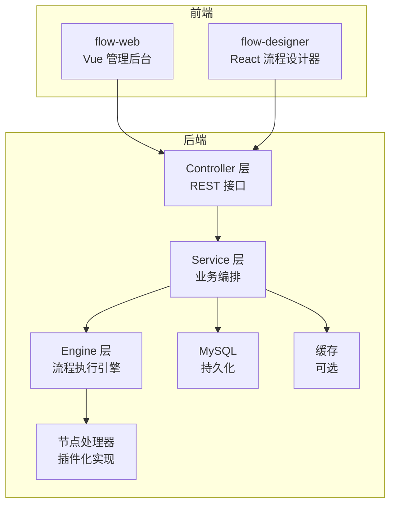
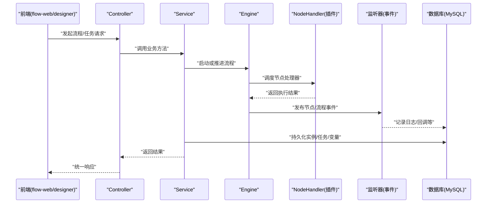
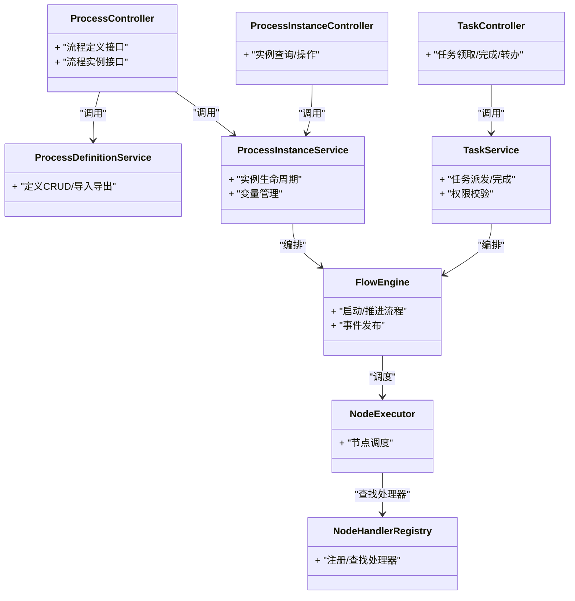
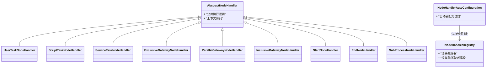
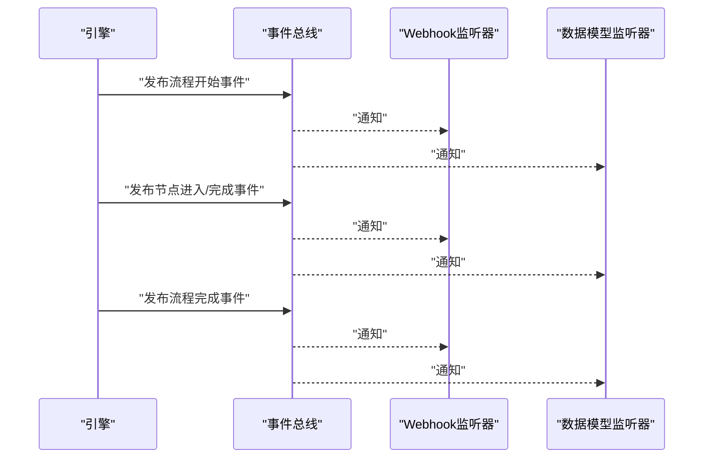
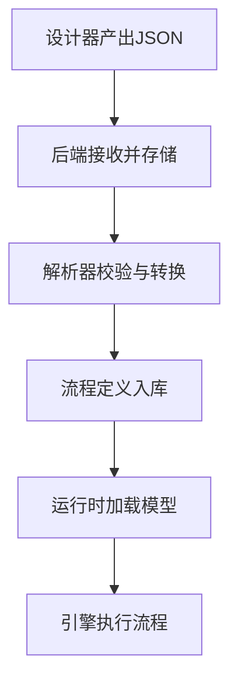
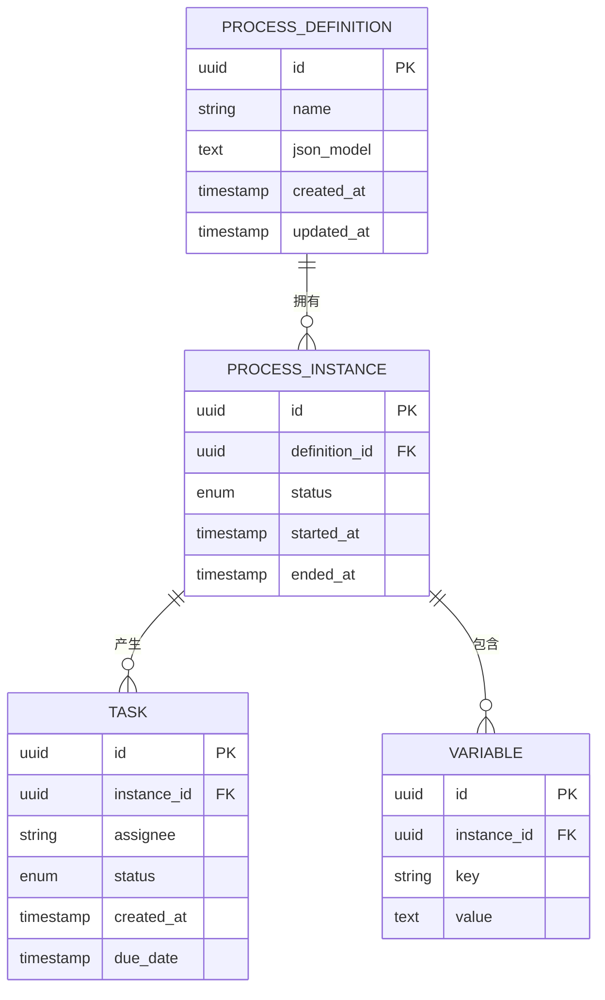
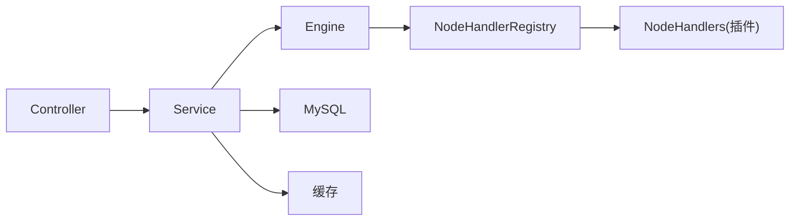
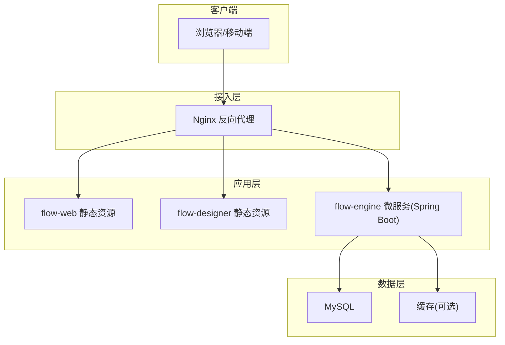

# 系统架构设计

<cite>
**本文引用的文件**   
- [FlowEngineApplication.java](file://flow-engine/src/main/java/com/flow/engine/FlowEngineApplication.java)
- [ProcessController.java](file://flow-engine/src/main/java/com/flow/engine/controller/ProcessController.java)
- [ProcessInstanceController.java](file://flow-engine/src/main/java/com/flow/engine/controller/ProcessInstanceController.java)
- [TaskController.java](file://flow-engine/src/main/java/com/flow/engine/controller/TaskController.java)
- [ProcessDefinitionService.java](file://flow-engine/src/main/java/com/flow/engine/service/ProcessDefinitionService.java)
- [ProcessInstanceService.java](file://flow-engine/src/main/java/com/flow/engine/service/ProcessInstanceService.java)
- [TaskService.java](file://flow-engine/src/main/java/com/flow/engine/service/TaskService.java)
- [FlowEngine.java](file://flow-engine/src/main/java/com/flow/engine/engine/FlowEngine.java)
- [NodeExecutor.java](file://flow-engine/src/main/java/com/flow/engine/engine/NodeExecutor.java)
- [NodeHandlerRegistry.java](file://flow-engine/src/main/java/com/flow/engine/node/NodeHandlerRegistry.java)
- [NodeHandlerAutoConfiguration.java](file://flow-engine/src/main/java/com/flow/engine/node/NodeHandlerAutoConfiguration.java)
- [AbstractNodeHandler.java](file://flow-engine/src/main/java/com/flow/engine/node/AbstractNodeHandler.java)
- [UserTaskNodeHandler.java](file://flow-engine/src/main/java/com/flow/engine/node/impl/UserTaskNodeHandler.java)
- [ScriptTaskNodeHandler.java](file://flow-engine/src/main/java/com/flow/engine/node/impl/ScriptTaskNodeHandler.java)
- [ServiceTaskNodeHandler.java](file://flow-engine/src/main/java/com/flow/engine/node/impl/ServiceTaskNodeHandler.java)
- [ExclusiveGatewayNodeHandler.java](file://flow-engine/src/main/java/com/flow/engine/node/impl/ExclusiveGatewayNodeHandler.java)
- [ParallelGatewayNodeHandler.java](file://flow-engine/src/main/java/com/flow/engine/node/impl/ParallelGatewayNodeHandler.java)
- [InclusiveGatewayNodeHandler.java](file://flow-engine/src/main/java/com/flow/engine/node/impl/InclusiveGatewayNodeHandler.java)
- [StartNodeHandler.java](file://flow-engine/src/main/java/com/flow/engine/node/impl/StartNodeHandler.java)
- [EndNodeHandler.java](file://flow-engine/src/main/java/com/flow/engine/node/impl/EndNodeHandler.java)
- [SubProcessNodeHandler.java](file://flow-engine/src/main/java/com/flow/engine/node/impl/SubProcessNodeHandler.java)
- [ProcessStartedEvent.java](file://flow-engine/src/main/java/com/flow/engine/event/ProcessStartedEvent.java)
- [ProcessCompletedEvent.java](file://flow-engine/src/main/java/com/flow/engine/event/ProcessCompletedEvent.java)
- [NodeEnteredEvent.java](file://flow-engine/src/main/java/com/flow/engine/event/NodeEnteredEvent.java)
- [NodeCompletedEvent.java](file://flow-engine/src/main/java/com/flow/engine/event/NodeCompletedEvent.java)
- [WebhookEventListener.java](file://flow-engine/src/main/java/com/flow/engine/listener/WebhookEventListener.java)
- [DataModelProcessListener.java](file://flow-engine/src/main/java/com/flow/engine/listener/DataModelProcessListener.java)
- [ProcessJsonParser.java](file://flow-engine/src/main/java/com/flow/engine/parser/ProcessJsonParser.java)
- [DataModelParser.java](file://flow-engine/src/main/java/com/flow/engine/parser/DataModelParser.java)
- [ProcessDefinition.java](file://flow-engine/src/main/java/com/flow/engine/entity/ProcessDefinition.java)
- [ProcessInstance.java](file://flow-engine/src/main/java/com/flow/engine/entity/ProcessInstance.java)
- [Task.java](file://flow-engine/src/main/java/com/flow/engine/entity/Task.java)
- [Variable.java](file://flow-engine/src/main/java/com/flow/engine/entity/Variable.java)
- [MybatisPlusConfig.java](file://flow-engine/src/main/java/com/flow/engine/config/MybatisPlusConfig.java)
- [CacheConfig.java](file://flow-engine/src/main/java/com/flow/engine/config/CacheConfig.java)
- [GlobalExceptionHandler.java](file://flow-engine/src/main/java/com/flow/engine/common/GlobalExceptionHandler.java)
- [Result.java](file://flow-engine/src/main/java/com/flow/engine/common/Result.java)
- [ErrorCode.java](file://flow-engine/src/main/java/com/flow/engine/common/ErrorCode.java)
- [application.yml](file://flow-engine/src/main/resources/application.yml)
- [schema.sql](file://flow-engine/src/main/resources/db/schema.sql)
- [index.js](file://flow-web/src/router/index.js)
- [BasicLayout.vue](file://flow-web/src/layouts/BasicLayout.vue)
- [process.js](file://flow-web/src/api/process.js)
- [task.js](file://flow-web/src/api/task.js)
- [definition/index.vue](file://flow-web/src/views/process/definition/index.vue)
- [instance/index.vue](file://flow-web/src/views/process/instance/index.vue)
- [designer.vue](file://flow-web/src/views/process/designer.vue)
- [App.jsx](file://flow-designer/src/App.jsx)
- [main.jsx](file://flow-designer/src/main.jsx)
- [nodeTypes.js](file://flow-designer/src/nodeTypes.js)
- [FlowNode.jsx](file://flow-designer/src/components/FlowNode.jsx)
- [NodePalette.jsx](file://flow-designer/src/components/NodePalette.jsx)
- [ConfigPanel.jsx](file://flow-designer/src/components/ConfigPanel.jsx)
</cite>

## 目录
1. [引言](#引言)
2. [项目结构](#项目结构)
3. [核心组件](#核心组件)
4. [架构总览](#架构总览)
5. [详细组件分析](#详细组件分析)
6. [依赖关系分析](#依赖关系分析)
7. [性能考量](#性能考量)
8. [故障排查指南](#故障排查指南)
9. [结论](#结论)
10. [附录](#附录)

## 引言
本文件面向“前后端分离 + 插件化 + 事件驱动”的自定义流程引擎系统，覆盖以下目标：
- 描述 flow-engine 后端微服务、flow-web 管理前端与 flow-designer 流程设计器组件的职责边界与交互。
- 解释分层架构（Controller → Service → Engine）及调用关系。
- 说明节点处理器插件化扩展机制。
- 阐述事件驱动在流程执行中的应用。
- 给出系统边界、组件交互图与数据流向图。
- 解释技术选型（Spring Boot、Vue.js、MySQL 等）的原因。
- 提供部署架构图与基础设施要求。

## 项目结构
仓库采用多模块组织：
- flow-engine：基于 Spring Boot 的流程引擎后端，提供流程定义、实例、任务、权限、字典、监控、Webhook 等能力。
- flow-web：基于 Vue.js 的管理后台，负责流程定义管理、实例监控、任务处理、系统管理等。
- flow-designer：基于 React 的流程设计器组件，用于可视化编排流程模型并生成 JSON 供后端解析。

图表来源
- [FlowEngineApplication.java](file://flow-engine/src/main/java/com/flow/engine/FlowEngineApplication.java)
- [ProcessController.java](file://flow-engine/src/main/java/com/flow/engine/controller/ProcessController.java)
- [ProcessInstanceController.java](file://flow-engine/src/main/java/com/flow/engine/controller/ProcessInstanceController.java)
- [TaskController.java](file://flow-engine/src/main/java/com/flow/engine/controller/TaskController.java)
- [ProcessDefinitionService.java](file://flow-engine/src/main/java/com/flow/engine/service/ProcessDefinitionService.java)
- [ProcessInstanceService.java](file://flow-engine/src/main/java/com/flow/engine/service/ProcessInstanceService.java)
- [TaskService.java](file://flow-engine/src/main/java/com/flow/engine/service/TaskService.java)
- [FlowEngine.java](file://flow-engine/src/main/java/com/flow/engine/engine/FlowEngine.java)
- [NodeExecutor.java](file://flow-engine/src/main/java/com/flow/engine/engine/NodeExecutor.java)
- [NodeHandlerRegistry.java](file://flow-engine/src/main/java/com/flow/engine/node/NodeHandlerRegistry.java)
- [MybatisPlusConfig.java](file://flow-engine/src/main/java/com/flow/engine/config/MybatisPlusConfig.java)
- [CacheConfig.java](file://flow-engine/src/main/java/com/flow/engine/config/CacheConfig.java)

章节来源
- [FlowEngineApplication.java](file://flow-engine/src/main/java/com/flow/engine/FlowEngineApplication.java)
- [application.yml](file://flow-engine/src/main/resources/application.yml)

## 核心组件
- 控制器层（Controller）
  - 暴露 REST 接口，接收请求参数，进行基础校验与统一响应封装。
  - 关键入口：流程定义、流程实例、任务相关接口。
- 服务层（Service）
  - 承载业务流程编排，协调持久化、权限、变量、监听器等。
  - 关键职责：流程定义 CRUD、实例生命周期、任务派发与完成、表单权限计算等。
- 引擎层（Engine）
  - 流程执行内核，负责解析流程模型、调度节点处理器、维护运行上下文与状态机。
- 节点处理器（Node Handlers）
  - 插件化实现，按节点类型注册与分发，支持用户任务、脚本任务、服务任务、网关、子流程等。
- 事件与监听器（Events & Listeners）
  - 基于事件驱动，流程开始/结束、节点进入/完成等事件触发监听器，如 Webhook 回调、数据模型联动。
- 解析器（Parsers）
  - 将设计器产出的 JSON 模型解析为内部模型，支撑流程定义导入与校验。
- 配置与基础设施
  - MyBatis-Plus 数据访问、缓存配置、全局异常处理、统一结果封装等。

章节来源
- [ProcessController.java](file://flow-engine/src/main/java/com/flow/engine/controller/ProcessController.java)
- [ProcessInstanceController.java](file://flow-engine/src/main/java/com/flow/engine/controller/ProcessInstanceController.java)
- [TaskController.java](file://flow-engine/src/main/java/com/flow/engine/controller/TaskController.java)
- [ProcessDefinitionService.java](file://flow-engine/src/main/java/com/flow/engine/service/ProcessDefinitionService.java)
- [ProcessInstanceService.java](file://flow-engine/src/main/java/com/flow/engine/service/ProcessInstanceService.java)
- [TaskService.java](file://flow-engine/src/main/java/com/flow/engine/service/TaskService.java)
- [FlowEngine.java](file://flow-engine/src/main/java/com/flow/engine/engine/FlowEngine.java)
- [NodeExecutor.java](file://flow-engine/src/main/java/com/flow/engine/engine/NodeExecutor.java)
- [NodeHandlerRegistry.java](file://flow-engine/src/main/java/com/flow/engine/node/NodeHandlerRegistry.java)
- [NodeHandlerAutoConfiguration.java](file://flow-engine/src/main/java/com/flow/engine/node/NodeHandlerAutoConfiguration.java)
- [ProcessJsonParser.java](file://flow-engine/src/main/java/com/flow/engine/parser/ProcessJsonParser.java)
- [DataModelParser.java](file://flow-engine/src/main/java/com/flow/engine/parser/DataModelParser.java)
- [GlobalExceptionHandler.java](file://flow-engine/src/main/java/com/flow/engine/common/GlobalExceptionHandler.java)
- [Result.java](file://flow-engine/src/main/java/com/flow/engine/common/Result.java)
- [ErrorCode.java](file://flow-engine/src/main/java/com/flow/engine/common/ErrorCode.java)
- [MybatisPlusConfig.java](file://flow-engine/src/main/java/com/flow/engine/config/MybatisPlusConfig.java)
- [CacheConfig.java](file://flow-engine/src/main/java/com/flow/engine/config/CacheConfig.java)

## 架构总览
整体采用前后端分离与分层架构：
- 前端（flow-web、flow-designer）通过 HTTP 与后端交互；flow-designer 输出流程 JSON，flow-web 负责管理与操作。
- 后端 Controller 仅做入参校验与响应包装，具体业务由 Service 编排。
- Service 调用 Engine 执行流程，Engine 根据节点类型从 NodeHandlerRegistry 中查找对应处理器执行。
- 引擎在执行过程中发布事件，监听器异步处理副作用（如 Webhook、数据模型联动）。
- 数据持久化通过 MyBatis-Plus 访问 MySQL，必要时使用缓存提升性能。

图表来源
- [ProcessController.java](file://flow-engine/src/main/java/com/flow/engine/controller/ProcessController.java)
- [ProcessInstanceController.java](file://flow-engine/src/main/java/com/flow/engine/controller/ProcessInstanceController.java)
- [TaskController.java](file://flow-engine/src/main/java/com/flow/engine/controller/TaskController.java)
- [ProcessDefinitionService.java](file://flow-engine/src/main/java/com/flow/engine/service/ProcessDefinitionService.java)
- [ProcessInstanceService.java](file://flow-engine/src/main/java/com/flow/engine/service/ProcessInstanceService.java)
- [TaskService.java](file://flow-engine/src/main/java/com/flow/engine/service/TaskService.java)
- [FlowEngine.java](file://flow-engine/src/main/java/com/flow/engine/engine/FlowEngine.java)
- [NodeExecutor.java](file://flow-engine/src/main/java/com/flow/engine/engine/NodeExecutor.java)
- [NodeHandlerRegistry.java](file://flow-engine/src/main/java/com/flow/engine/node/NodeHandlerRegistry.java)
- [ProcessStartedEvent.java](file://flow-engine/src/main/java/com/flow/engine/event/ProcessStartedEvent.java)
- [ProcessCompletedEvent.java](file://flow-engine/src/main/java/com/flow/engine/event/ProcessCompletedEvent.java)
- [NodeEnteredEvent.java](file://flow-engine/src/main/java/com/flow/engine/event/NodeEnteredEvent.java)
- [NodeCompletedEvent.java](file://flow-engine/src/main/java/com/flow/engine/event/NodeCompletedEvent.java)
- [WebhookEventListener.java](file://flow-engine/src/main/java/com/flow/engine/listener/WebhookEventListener.java)
- [DataModelProcessListener.java](file://flow-engine/src/main/java/com/flow/engine/listener/DataModelProcessListener.java)
- [schema.sql](file://flow-engine/src/main/resources/db/schema.sql)

## 详细组件分析

### 分层架构与调用关系
- Controller 层
  - 职责：接收请求、参数校验、统一响应封装、鉴权前置。
  - 典型接口：流程定义管理、流程实例启停、任务领取/完成/转办/加签等。
- Service 层
  - 职责：流程定义与实例的业务编排、权限与变量管理、监听器触发、事务控制。
  - 关键类：流程定义服务、流程实例服务、任务服务、变量服务、权限评估等。
- Engine 层
  - 职责：流程状态机、节点调度、上下文传递、事件发布。
  - 关键类：流程引擎、节点执行器、节点处理器注册表与自动装配。

图表来源
- [ProcessController.java](file://flow-engine/src/main/java/com/flow/engine/controller/ProcessController.java)
- [ProcessInstanceController.java](file://flow-engine/src/main/java/com/flow/engine/controller/ProcessInstanceController.java)
- [TaskController.java](file://flow-engine/src/main/java/com/flow/engine/controller/TaskController.java)
- [ProcessDefinitionService.java](file://flow-engine/src/main/java/com/flow/engine/service/ProcessDefinitionService.java)
- [ProcessInstanceService.java](file://flow-engine/src/main/java/com/flow/engine/service/ProcessInstanceService.java)
- [TaskService.java](file://flow-engine/src/main/java/com/flow/engine/service/TaskService.java)
- [FlowEngine.java](file://flow-engine/src/main/java/com/flow/engine/engine/FlowEngine.java)
- [NodeExecutor.java](file://flow-engine/src/main/java/com/flow/engine/engine/NodeExecutor.java)
- [NodeHandlerRegistry.java](file://flow-engine/src/main/java/com/flow/engine/node/NodeHandlerRegistry.java)

章节来源
- [ProcessController.java](file://flow-engine/src/main/java/com/flow/engine/controller/ProcessController.java)
- [ProcessInstanceController.java](file://flow-engine/src/main/java/com/flow/engine/controller/ProcessInstanceController.java)
- [TaskController.java](file://flow-engine/src/main/java/com/flow/engine/controller/TaskController.java)
- [ProcessDefinitionService.java](file://flow-engine/src/main/java/com/flow/engine/service/ProcessDefinitionService.java)
- [ProcessInstanceService.java](file://flow-engine/src/main/java/com/flow/engine/service/ProcessInstanceService.java)
- [TaskService.java](file://flow-engine/src/main/java/com/flow/engine/service/TaskService.java)
- [FlowEngine.java](file://flow-engine/src/main/java/com/flow/engine/engine/FlowEngine.java)
- [NodeExecutor.java](file://flow-engine/src/main/java/com/flow/engine/engine/NodeExecutor.java)
- [NodeHandlerRegistry.java](file://flow-engine/src/main/java/com/flow/engine/node/NodeHandlerRegistry.java)

### 插件化节点处理器扩展机制
- 抽象基类与接口
  - 抽象处理器提供通用逻辑与上下文封装，具体处理器继承实现特定节点行为。
- 自动装配与注册
  - 通过自动配置扫描所有处理器实现，统一注册到处理器注册表，按节点类型路由。
- 内置处理器
  - 包含开始/结束、用户任务、脚本任务、服务任务、排他/并行/包容网关、子流程等。
- 扩展方式
  - 新增节点类型：实现处理器接口/继承抽象类，标注自动装配注解，注册到注册表即可被引擎发现。

图表来源
- [AbstractNodeHandler.java](file://flow-engine/src/main/java/com/flow/engine/node/AbstractNodeHandler.java)
- [UserTaskNodeHandler.java](file://flow-engine/src/main/java/com/flow/engine/node/impl/UserTaskNodeHandler.java)
- [ScriptTaskNodeHandler.java](file://flow-engine/src/main/java/com/flow/engine/node/impl/ScriptTaskNodeHandler.java)
- [ServiceTaskNodeHandler.java](file://flow-engine/src/main/java/com/flow/engine/node/impl/ServiceTaskNodeHandler.java)
- [ExclusiveGatewayNodeHandler.java](file://flow-engine/src/main/java/com/flow/engine/node/impl/ExclusiveGatewayNodeHandler.java)
- [ParallelGatewayNodeHandler.java](file://flow-engine/src/main/java/com/flow/engine/node/impl/ParallelGatewayNodeHandler.java)
- [InclusiveGatewayNodeHandler.java](file://flow-engine/src/main/java/com/flow/engine/node/impl/InclusiveGatewayNodeHandler.java)
- [StartNodeHandler.java](file://flow-engine/src/main/java/com/flow/engine/node/impl/StartNodeHandler.java)
- [EndNodeHandler.java](file://flow-engine/src/main/java/com/flow/engine/node/impl/EndNodeHandler.java)
- [SubProcessNodeHandler.java](file://flow-engine/src/main/java/com/flow/engine/node/impl/SubProcessNodeHandler.java)
- [NodeHandlerRegistry.java](file://flow-engine/src/main/java/com/flow/engine/node/NodeHandlerRegistry.java)
- [NodeHandlerAutoConfiguration.java](file://flow-engine/src/main/java/com/flow/engine/node/NodeHandlerAutoConfiguration.java)

章节来源
- [NodeHandlerRegistry.java](file://flow-engine/src/main/java/com/flow/engine/node/NodeHandlerRegistry.java)
- [NodeHandlerAutoConfiguration.java](file://flow-engine/src/main/java/com/flow/engine/node/NodeHandlerAutoConfiguration.java)
- [AbstractNodeHandler.java](file://flow-engine/src/main/java/com/flow/engine/node/AbstractNodeHandler.java)
- [UserTaskNodeHandler.java](file://flow-engine/src/main/java/com/flow/engine/node/impl/UserTaskNodeHandler.java)
- [ScriptTaskNodeHandler.java](file://flow-engine/src/main/java/com/flow/engine/node/impl/ScriptTaskNodeHandler.java)
- [ServiceTaskNodeHandler.java](file://flow-engine/src/main/java/com/flow/engine/node/impl/ServiceTaskNodeHandler.java)
- [ExclusiveGatewayNodeHandler.java](file://flow-engine/src/main/java/com/flow/engine/node/impl/ExclusiveGatewayNodeHandler.java)
- [ParallelGatewayNodeHandler.java](file://flow-engine/src/main/java/com/flow/engine/node/impl/ParallelGatewayNodeHandler.java)
- [InclusiveGatewayNodeHandler.java](file://flow-engine/src/main/java/com/flow/engine/node/impl/InclusiveGatewayNodeHandler.java)
- [StartNodeHandler.java](file://flow-engine/src/main/java/com/flow/engine/node/impl/StartNodeHandler.java)
- [EndNodeHandler.java](file://flow-engine/src/main/java/com/flow/engine/node/impl/EndNodeHandler.java)
- [SubProcessNodeHandler.java](file://flow-engine/src/main/java/com/flow/engine/node/impl/SubProcessNodeHandler.java)

### 事件驱动架构在流程执行中的应用
- 事件类型
  - 流程开始、流程完成、节点进入、节点完成等。
- 监听器
  - Webhook 监听器：在事件发生时触发外部回调。
  - 数据模型监听器：在流程流转时联动数据模型变更。
- 解耦与扩展
  - 引擎发布事件，监听器订阅处理，降低耦合度，便于横向扩展。

图表来源
- [ProcessStartedEvent.java](file://flow-engine/src/main/java/com/flow/engine/event/ProcessStartedEvent.java)
- [ProcessCompletedEvent.java](file://flow-engine/src/main/java/com/flow/engine/event/ProcessCompletedEvent.java)
- [NodeEnteredEvent.java](file://flow-engine/src/main/java/com/flow/engine/event/NodeEnteredEvent.java)
- [NodeCompletedEvent.java](file://flow-engine/src/main/java/com/flow/engine/event/NodeCompletedEvent.java)
- [WebhookEventListener.java](file://flow-engine/src/main/java/com/flow/engine/listener/WebhookEventListener.java)
- [DataModelProcessListener.java](file://flow-engine/src/main/java/com/flow/engine/listener/DataModelProcessListener.java)

章节来源
- [ProcessStartedEvent.java](file://flow-engine/src/main/java/com/flow/engine/event/ProcessStartedEvent.java)
- [ProcessCompletedEvent.java](file://flow-engine/src/main/java/com/flow/engine/event/ProcessCompletedEvent.java)
- [NodeEnteredEvent.java](file://flow-engine/src/main/java/com/flow/engine/event/NodeEnteredEvent.java)
- [NodeCompletedEvent.java](file://flow-engine/src/main/java/com/flow/engine/event/NodeCompletedEvent.java)
- [WebhookEventListener.java](file://flow-engine/src/main/java/com/flow/engine/listener/WebhookEventListener.java)
- [DataModelProcessListener.java](file://flow-engine/src/main/java/com/flow/engine/listener/DataModelProcessListener.java)

### 流程模型解析与设计器集成
- 设计器（flow-designer）
  - 基于 React 的可视化编排，输出标准 JSON 流程模型。
  - 提供节点类型定义、画布组件、配置面板等。
- 解析器（flow-engine）
  - 将 JSON 模型解析为内部模型，进行校验与转换，供流程定义导入与执行。
- 集成方式
  - 前端保存流程 JSON 至后端，后端解析入库，运行时由引擎读取并执行。

图表来源
- [App.jsx](file://flow-designer/src/App.jsx)
- [main.jsx](file://flow-designer/src/main.jsx)
- [nodeTypes.js](file://flow-designer/src/nodeTypes.js)
- [FlowNode.jsx](file://flow-designer/src/components/FlowNode.jsx)
- [NodePalette.jsx](file://flow-designer/src/components/NodePalette.jsx)
- [ConfigPanel.jsx](file://flow-designer/src/components/ConfigPanel.jsx)
- [ProcessJsonParser.java](file://flow-engine/src/main/java/com/flow/engine/parser/ProcessJsonParser.java)
- [DataModelParser.java](file://flow-engine/src/main/java/com/flow/engine/parser/DataModelParser.java)

章节来源
- [App.jsx](file://flow-designer/src/App.jsx)
- [main.jsx](file://flow-designer/src/main.jsx)
- [nodeTypes.js](file://flow-designer/src/nodeTypes.js)
- [FlowNode.jsx](file://flow-designer/src/components/FlowNode.jsx)
- [NodePalette.jsx](file://flow-designer/src/components/NodePalette.jsx)
- [ConfigPanel.jsx](file://flow-designer/src/components/ConfigPanel.jsx)
- [ProcessJsonParser.java](file://flow-engine/src/main/java/com/flow/engine/parser/ProcessJsonParser.java)
- [DataModelParser.java](file://flow-engine/src/main/java/com/flow/engine/parser/DataModelParser.java)

### 数据模型与持久化
- 实体关系
  - 流程定义、流程实例、任务、变量等为核心实体，支撑流程全生命周期。
- 数据访问
  - 使用 MyBatis-Plus 简化 CRUD 与分页查询。
- 初始化
  - 通过 schema.sql 初始化数据库结构与初始数据。

图表来源
- [ProcessDefinition.java](file://flow-engine/src/main/java/com/flow/engine/entity/ProcessDefinition.java)
- [ProcessInstance.java](file://flow-engine/src/main/java/com/flow/engine/entity/ProcessInstance.java)
- [Task.java](file://flow-engine/src/main/java/com/flow/engine/entity/Task.java)
- [Variable.java](file://flow-engine/src/main/java/com/flow/engine/entity/Variable.java)
- [schema.sql](file://flow-engine/src/main/resources/db/schema.sql)

章节来源
- [ProcessDefinition.java](file://flow-engine/src/main/java/com/flow/engine/entity/ProcessDefinition.java)
- [ProcessInstance.java](file://flow-engine/src/main/java/com/flow/engine/entity/ProcessInstance.java)
- [Task.java](file://flow-engine/src/main/java/com/flow/engine/entity/Task.java)
- [Variable.java](file://flow-engine/src/main/java/com/flow/engine/entity/Variable.java)
- [schema.sql](file://flow-engine/src/main/resources/db/schema.sql)
- [MybatisPlusConfig.java](file://flow-engine/src/main/java/com/flow/engine/config/MybatisPlusConfig.java)

## 依赖关系分析
- 组件耦合
  - Controller 低耦合于 Service，Service 通过接口依赖 Engine，Engine 通过注册表依赖处理器，符合依赖倒置原则。
- 外部依赖
  - Spring Boot 提供容器与 Web 能力；MyBatis-Plus 简化数据访问；可选缓存提升性能。
- 潜在循环依赖
  - 通过注册表与自动装配避免直接硬编码引用，降低循环依赖风险。

图表来源
- [ProcessController.java](file://flow-engine/src/main/java/com/flow/engine/controller/ProcessController.java)
- [ProcessInstanceController.java](file://flow-engine/src/main/java/com/flow/engine/controller/ProcessInstanceController.java)
- [TaskController.java](file://flow-engine/src/main/java/com/flow/engine/controller/TaskController.java)
- [ProcessDefinitionService.java](file://flow-engine/src/main/java/com/flow/engine/service/ProcessDefinitionService.java)
- [ProcessInstanceService.java](file://flow-engine/src/main/java/com/flow/engine/service/ProcessInstanceService.java)
- [TaskService.java](file://flow-engine/src/main/java/com/flow/engine/service/TaskService.java)
- [FlowEngine.java](file://flow-engine/src/main/java/com/flow/engine/engine/FlowEngine.java)
- [NodeHandlerRegistry.java](file://flow-engine/src/main/java/com/flow/engine/node/NodeHandlerRegistry.java)
- [MybatisPlusConfig.java](file://flow-engine/src/main/java/com/flow/engine/config/MybatisPlusConfig.java)
- [CacheConfig.java](file://flow-engine/src/main/java/com/flow/engine/config/CacheConfig.java)

章节来源
- [NodeHandlerRegistry.java](file://flow-engine/src/main/java/com/flow/engine/node/NodeHandlerRegistry.java)
- [NodeHandlerAutoConfiguration.java](file://flow-engine/src/main/java/com/flow/engine/node/NodeHandlerAutoConfiguration.java)
- [MybatisPlusConfig.java](file://flow-engine/src/main/java/com/flow/engine/config/MybatisPlusConfig.java)
- [CacheConfig.java](file://flow-engine/src/main/java/com/flow/engine/config/CacheConfig.java)

## 性能考量
- 数据库
  - 合理索引与分页查询，避免大对象字段频繁读写。
- 缓存
  - 对热点字典、权限、流程定义元数据进行缓存，减少数据库压力。
- 事件处理
  - 监听器建议异步处理，避免阻塞主流程执行路径。
- 连接池与线程池
  - 调整数据库连接池与线程池大小以匹配负载。
- 序列化与表达式
  - 表达式计算与 JSON 序列化应优化，避免复杂计算在主线程。

[本节为通用指导，不直接分析具体文件]

## 故障排查指南
- 统一异常处理
  - 全局异常处理器捕获业务异常与系统异常，返回统一错误码与消息。
- 常见错误
  - 流程模型解析失败：检查 JSON 结构与必填字段。
  - 节点处理器未找到：确认处理器已正确注册且节点类型匹配。
  - 任务权限不足：检查用户角色与数据权限配置。
- 日志与审计
  - 访问日志与操作日志有助于定位问题。

章节来源
- [GlobalExceptionHandler.java](file://flow-engine/src/main/java/com/flow/engine/common/GlobalExceptionHandler.java)
- [Result.java](file://flow-engine/src/main/java/com/flow/engine/common/Result.java)
- [ErrorCode.java](file://flow-engine/src/main/java/com/flow/engine/common/ErrorCode.java)

## 结论
本系统通过前后端分离、分层架构、插件化节点处理器与事件驱动，实现了高内聚、低耦合的可扩展流程引擎。设计器与管理前端职责清晰，后端通过注册表与自动装配实现灵活扩展，事件机制保障了解耦与可观测性。结合合理的性能优化与完善的异常处理，可满足企业级工作流场景需求。

[本节为总结，不直接分析具体文件]

## 附录

### 技术选型决策
- Spring Boot
  - 快速构建、生态丰富、易于部署与运维。
- Vue.js（flow-web）
  - 渐进式框架、学习曲线平缓、组件化开发效率高。
- React（flow-designer）
  - 强大的生态系统与组件模型，适合复杂可视化编辑。
- MySQL
  - 成熟稳定、社区活跃、成本可控，满足事务与一致性需求。
- MyBatis-Plus
  - 简化 CRUD、分页与条件构造，提升开发效率。
- 缓存（可选）
  - 提升热点数据访问性能，降低数据库压力。

[本节为通用说明，不直接分析具体文件]

### 部署架构图与基础设施要求
- 部署架构
  - 前端静态资源由 Nginx 托管，后端以 Spring Boot 应用形式部署，数据库使用 MySQL，可选缓存中间件。
- 基础设施
  - JDK 版本、数据库版本、缓存中间件版本需与依赖兼容。
  - 环境变量与配置文件集中管理，支持多环境切换。

图表来源
- [application.yml](file://flow-engine/src/main/resources/application.yml)
- [MybatisPlusConfig.java](file://flow-engine/src/main/java/com/flow/engine/config/MybatisPlusConfig.java)
- [CacheConfig.java](file://flow-engine/src/main/java/com/flow/engine/config/CacheConfig.java)

章节来源
- [application.yml](file://flow-engine/src/main/resources/application.yml)
- [MybatisPlusConfig.java](file://flow-engine/src/main/java/com/flow/engine/config/MybatisPlusConfig.java)
- [CacheConfig.java](file://flow-engine/src/main/java/com/flow/engine/config/CacheConfig.java)

### 前端路由与页面组织
- 路由
  - 管理后台路由集中于路由配置文件，按功能域划分视图。
- 页面
  - 流程定义、实例、任务、系统管理等页面分别位于 views 下对应目录。
- 布局
  - 基础布局组件提供导航与侧边栏。

章节来源
- [index.js](file://flow-web/src/router/index.js)
- [BasicLayout.vue](file://flow-web/src/layouts/BasicLayout.vue)
- [definition/index.vue](file://flow-web/src/views/process/definition/index.vue)
- [instance/index.vue](file://flow-web/src/views/process/instance/index.vue)
- [designer.vue](file://flow-web/src/views/process/designer.vue)

### 前端 API 调用
- 流程相关
  - 流程定义与实例接口封装在 process.js。
- 任务相关
  - 任务领取、完成、转办等接口封装在 task.js。
- 请求封装
  - request.js 统一拦截器处理认证、错误码与重试策略。

章节来源
- [process.js](file://flow-web/src/api/process.js)
- [task.js](file://flow-web/src/api/task.js)