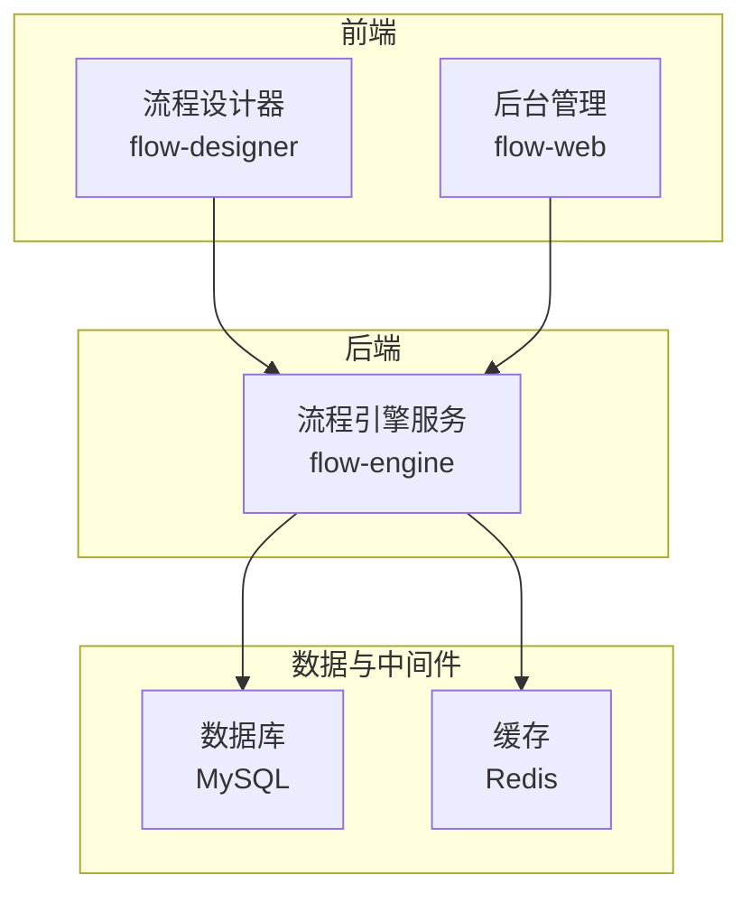
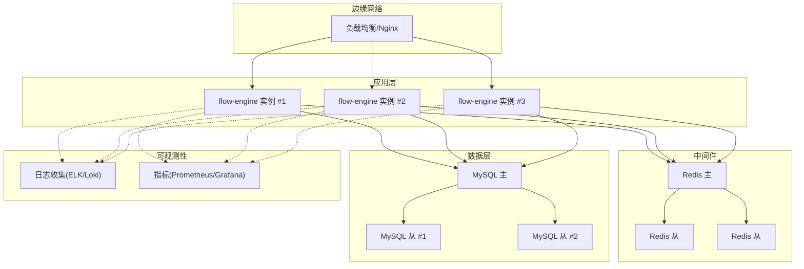
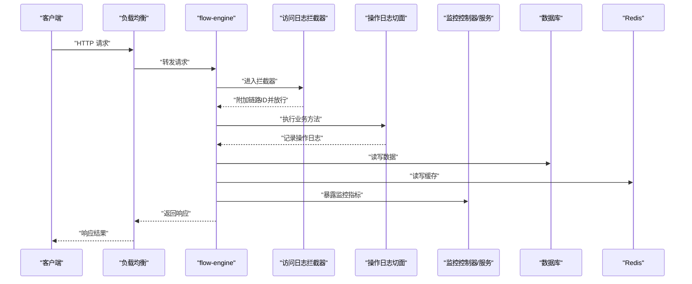
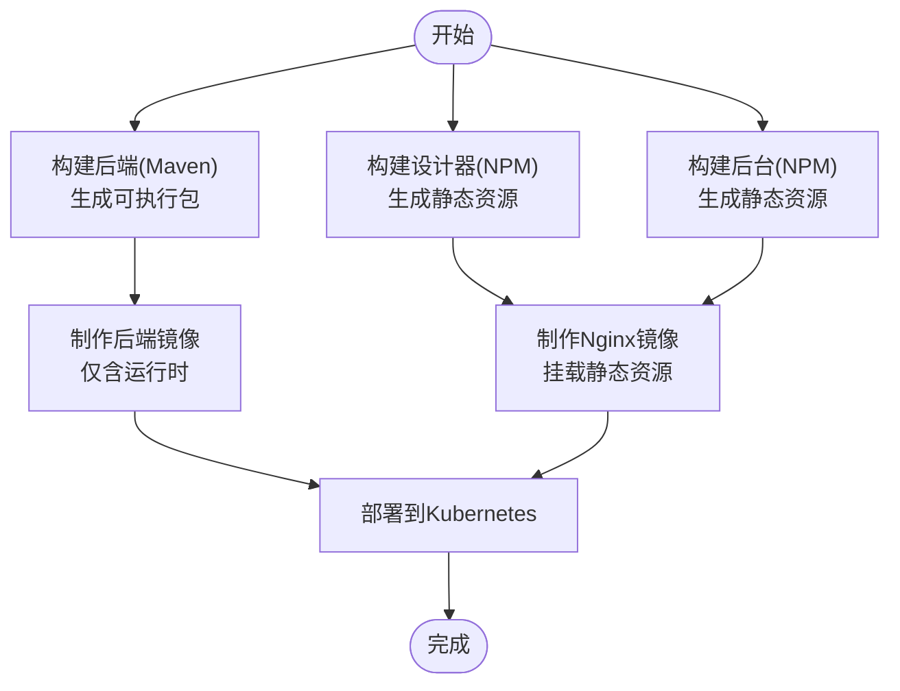
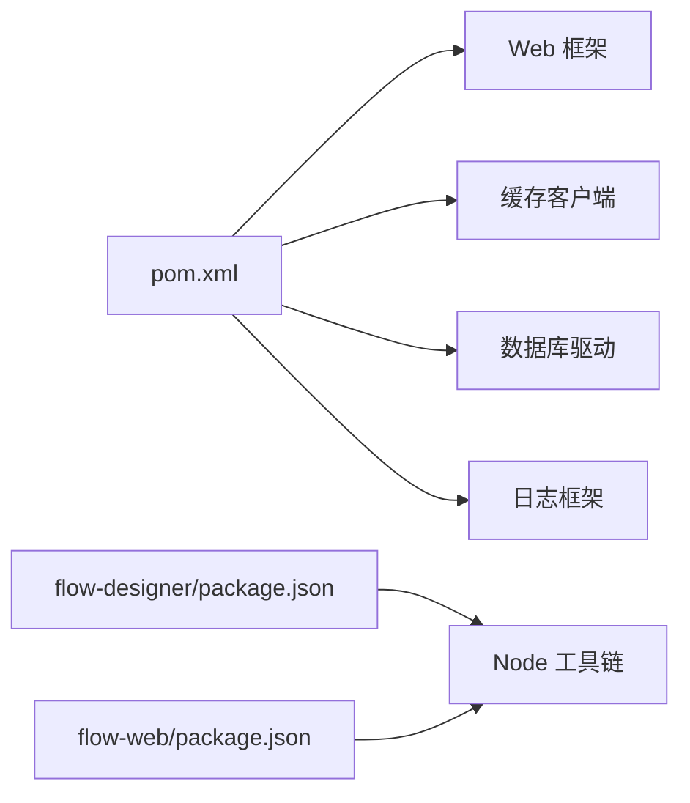
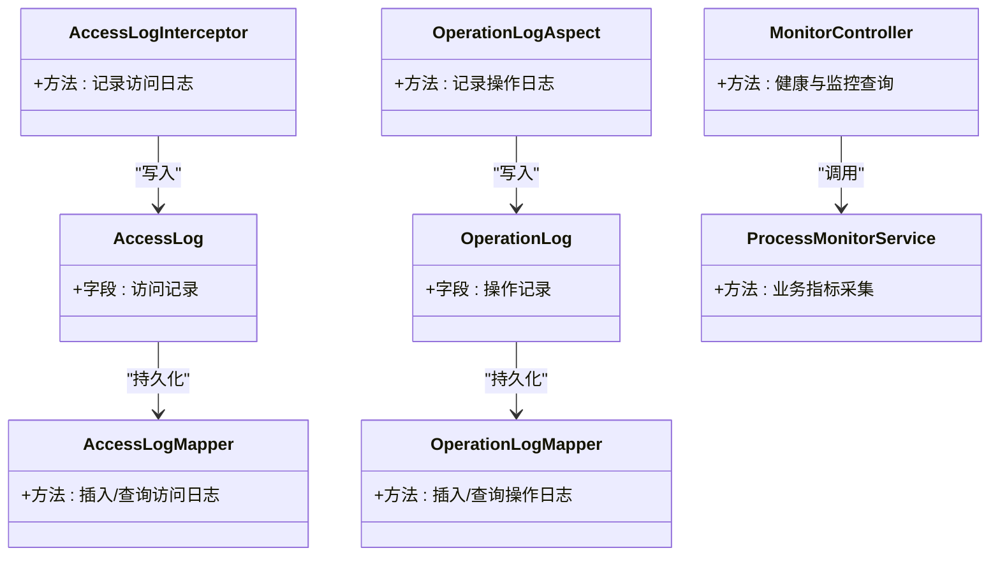

# 部署架构

<cite>
**本文引用的文件**   
- [flow-engine/src/main/resources/application.yml](file://flow-engine/src/main/resources/application.yml)
- [flow-engine/src/main/java/com/flow/engine/config/CacheConfig.java](file://flow-engine/src/main/java/com/flow/engine/config/CacheConfig.java)
- [flow-engine/src/main/java/com/flow/engine/config/WebMvcConfig.java](file://flow-engine/src/main/java/com/flow/engine/config/WebMvcConfig.java)
- [flow-engine/src/main/java/com/flow/engine/common/RequestIdFilter.java](file://flow-engine/src/main/java/com/flow/engine/common/RequestIdFilter.java)
- [flow-engine/src/main/java/com/flow/engine/controller/PingController.java](file://flow-engine/src/main/java/com/flow/engine/controller/PingController.java)
- [flow-engine/src/main/java/com/flow/engine/controllers/MonitorController.java](file://flow-engine/src/main/java/com/flow/engine/controllers/MonitorController.java)
- [flow-engine/src/main/java/com/flow/engine/service/ProcessMonitorService.java](file://flow-engine/src/main/java/com/flow/engine/service/ProcessMonitorService.java)
- [flow-engine/src/main/java/com/flow/engine/aspect/OperationLogAspect.java](file://flow-engine/src/main/java/com/flow/engine/aspect/OperationLogAspect.java)
- [flow-engine/src/main/java/com/flow/engine/interceptor/AccessLogInterceptor.java](file://flow-engine/src/main/java/com/flow/engine/interceptor/AccessLogInterceptor.java)
- [flow-engine/src/main/java/com/flow/engine/entity/AccessLog.java](file://flow-engine/src/main/java/com/flow/engine/entity/AccessLog.java)
- [flow-engine/src/main/java/com/flow/engine/entity/OperationLog.java](file://flow-engine/src/main/java/com/flow/engine/entity/OperationLog.java)
- [flow-engine/src/main/java/com/flow/engine/mapper/AccessLogMapper.java](file://flow-engine/src/main/java/com/flow/engine/mapper/AccessLogMapper.java)
- [flow-engine/src/main/java/com/flow/engine/mapper/OperationLogMapper.java](file://flow-engine/src/main/java/com/flow/engine/mapper/OperationLogMapper.java)
- [flow-engine/src/main/resources/db/schema.sql](file://flow-engine/src/main/resources/db/schema.sql)
- [flow-engine/pom.xml](file://flow-engine/pom.xml)
- [flow-engine/src/test/resources/application-test.yml](file://flow-engine/src/test/resources/application-test.yml)
- [flow-designer/package.json](file://flow-designer/package.json)
- [flow-designer/vite.config.js](file://flow-designer/vite.config.js)
- [flow-web/package.json](file://flow-web/package.json)
- [flow-web/vite.config.js](file://flow-web/vite.config.js)
</cite>

## 目录
1. [简介](#简介)
2. [项目结构](#项目结构)
3. [核心组件](#核心组件)
4. [架构总览](#架构总览)
5. [详细组件分析](#详细组件分析)
6. [依赖分析](#依赖分析)
7. [性能考虑](#性能考虑)
8. [故障排查指南](#故障排查指南)
9. [结论](#结论)
10. [附录](#附录)

## 简介
本部署架构文档面向生产环境，覆盖负载均衡、服务集群与数据库主从、容器化与Kubernetes编排、缓存层（Redis）高可用、监控告警体系（日志收集、性能监控、业务指标）、多环境配置管理、数据库迁移与备份恢复策略，并提供容量规划与性能调优建议。文档同时给出架构图与关键流程时序图，帮助读者快速理解各组件的部署位置与依赖关系。

## 项目结构
仓库包含前端设计器与后台管理系统、后端流程引擎以及相关的资源与测试配置：
- flow-engine：Java 后端服务，提供流程定义、实例、任务等能力，内置访问日志、操作审计、监控接口与缓存配置。
- flow-designer：流程设计器前端工程，构建产物为静态资源。
- flow-web：后台管理前端工程，构建产物为静态资源。
- docs：产品与设计文档。
- 其他根级配置文件用于前端工程依赖与脚本。

[本节未直接分析具体源文件，故不附“章节来源”]

## 核心组件
- Web 接入层：Spring MVC 控制器暴露 REST API，统一响应与异常处理，支持请求链路追踪标识注入。
- 流程引擎：流程定义、实例、任务管理与节点执行扩展点。
- 监控与审计：访问日志拦截器、操作日志切面、监控控制器与服务。
- 缓存配置：基于 Spring Cache 的缓存抽象与 Redis 集成配置。
- 数据库：MyBatis Plus 持久化，DDL 由 schema.sql 初始化。

**章节来源**
- [flow-engine/src/main/java/com/flow/engine/controller/PingController.java](file://flow-engine/src/main/java/com/flow/engine/controller/PingController.java)
- [flow-engine/src/main/java/com/flow/engine/controllers/MonitorController.java](file://flow-engine/src/main/java/com/flow/engine/controllers/MonitorController.java)
- [flow-engine/src/main/java/com/flow/engine/service/ProcessMonitorService.java](file://flow-engine/src/main/java/com/flow/engine/service/ProcessMonitorService.java)
- [flow-engine/src/main/java/com/flow/engine/aspect/OperationLogAspect.java](file://flow-engine/src/main/java/com/flow/engine/aspect/OperationLogAspect.java)
- [flow-engine/src/main/java/com/flow/engine/interceptor/AccessLogInterceptor.java](file://flow-engine/src/main/java/com/flow/engine/interceptor/AccessLogInterceptor.java)
- [flow-engine/src/main/java/com/flow/engine/config/CacheConfig.java](file://flow-engine/src/main/java/com/flow/engine/config/CacheConfig.java)
- [flow-engine/src/main/java/com/flow/engine/config/WebMvcConfig.java](file://flow-engine/src/main/java/com/flow/engine/config/WebMvcConfig.java)
- [flow-engine/src/main/java/com/flow/engine/common/RequestIdFilter.java](file://flow-engine/src/main/java/com/flow/engine/common/RequestIdFilter.java)
- [flow-engine/src/main/resources/db/schema.sql](file://flow-engine/src/main/resources/db/schema.sql)

## 架构总览
生产环境推荐拓扑如下：
- 入口网关/负载均衡：Nginx 或云厂商 LB，负责 HTTPS 终止、路由转发与健康检查。
- 应用集群：flow-engine 无状态服务多副本部署，水平扩展。
- 缓存层：Redis 哨兵或集群模式，保障高可用与读写分离。
- 数据库：MySQL 主从复制，读多写少场景下通过连接池与只读副本提升吞吐。
- 监控与日志：应用侧采集访问日志、操作日志与业务指标；集中式日志系统（如 ELK/ Loki）聚合；Prometheus + Grafana 采集 JVM、系统与应用指标。

[本图为概念性架构示意，未映射到具体源码文件，故不附“图表来源”]

## 详细组件分析

### 负载均衡与反向代理
- 职责：HTTPS 终止、静态资源缓存、按路径分发至后端服务、健康检查与熔断降级。
- 建议：
  - 使用 Nginx Ingress（Kubernetes）或云托管 LB。
  - 开启 gzip、HTTP/2、Keep-Alive。
  - 对 /actuator、/ping 等健康端点进行独立路由与鉴权控制。

[本节为通用实践说明，不附“章节来源”]

### 服务集群与无状态化
- flow-engine 应作为无状态服务运行，会话与状态外置到 Redis。
- 多副本部署，结合水平自动扩缩容（HPA）应对流量峰值。
- 进程内线程池、连接池参数需根据 CPU 核数与内存进行调优。

**章节来源**
- [flow-engine/src/main/java/com/flow/engine/config/WebMvcConfig.java](file://flow-engine/src/main/java/com/flow/engine/config/WebMvcConfig.java)
- [flow-engine/src/main/java/com/flow/engine/common/RequestIdFilter.java](file://flow-engine/src/main/java/com/flow/engine/common/RequestIdFilter.java)

### 数据库主从与连接策略
- 主库承担写入，从库承担读取，通过不同数据源与连接池隔离读写。
- DDL 变更通过 schema.sql 在 CI/CD 中执行，确保版本一致。
- 建议引入只读路由与重试机制，避免主从延迟导致的脏读。

**章节来源**
- [flow-engine/src/main/resources/db/schema.sql](file://flow-engine/src/main/resources/db/schema.sql)

### 缓存层（Redis）高可用
- 采用哨兵或集群模式，客户端启用故障转移与重试。
- 热点键本地缓存+分布式缓存双层策略，降低跨节点抖动影响。
- 设置合理的过期时间与淘汰策略，防止内存膨胀。

**章节来源**
- [flow-engine/src/main/java/com/flow/engine/config/CacheConfig.java](file://flow-engine/src/main/java/com/flow/engine/config/CacheConfig.java)

### 监控与告警体系
- 访问日志：通过拦截器记录请求维度信息，便于问题定位。
- 操作日志：通过切面记录关键业务操作，支撑审计与回溯。
- 监控接口：提供进程与业务健康度查询，供外部巡检与自愈。
- 指标采集：JVM、系统与应用指标上报 Prometheus，Grafana 可视化。

**图表来源**
- [flow-engine/src/main/java/com/flow/engine/interceptor/AccessLogInterceptor.java](file://flow-engine/src/main/java/com/flow/engine/interceptor/AccessLogInterceptor.java)
- [flow-engine/src/main/java/com/flow/engine/aspect/OperationLogAspect.java](file://flow-engine/src/main/java/com/flow/engine/aspect/OperationLogAspect.java)
- [flow-engine/src/main/java/com/flow/engine/controllers/MonitorController.java](file://flow-engine/src/main/java/com/flow/engine/controllers/MonitorController.java)
- [flow-engine/src/main/java/com/flow/engine/service/ProcessMonitorService.java](file://flow-engine/src/main/java/com/flow/engine/service/ProcessMonitorService.java)

**章节来源**
- [flow-engine/src/main/java/com/flow/engine/interceptor/AccessLogInterceptor.java](file://flow-engine/src/main/java/com/flow/engine/interceptor/AccessLogInterceptor.java)
- [flow-engine/src/main/java/com/flow/engine/aspect/OperationLogAspect.java](file://flow-engine/src/main/java/com/flow/engine/aspect/OperationLogAspect.java)
- [flow-engine/src/main/java/com/flow/engine/controllers/MonitorController.java](file://flow-engine/src/main/java/com/flow/engine/controllers/MonitorController.java)
- [flow-engine/src/main/java/com/flow/engine/service/ProcessMonitorService.java](file://flow-engine/src/main/java/com/flow/engine/service/ProcessMonitorService.java)

### 容器化与镜像构建
- 后端（flow-engine）：
  - 使用多阶段 Dockerfile，先构建 Maven 包，再打包运行时镜像。
  - 非 root 用户运行，精简基础镜像，固定 JDK 版本。
  - 暴露端口与探针端点，配合 K8s liveness/readiness。
- 前端（flow-designer、flow-web）：
  - 使用 Node 镜像构建静态资源，再由 Nginx 镜像托管。
  - 环境变量注入 API 地址与功能开关。

[本图为概念性流程示意，未映射到具体源码文件，故不附“图表来源”]

### Kubernetes 编排要点
- Deployment：flow-engine 多副本，设置资源请求/限制与滚动更新策略。
- Service：ClusterIP 暴露内部服务，Ingress 暴露外部入口。
- ConfigMap/Secret：集中管理配置与敏感信息。
- HPA：基于 CPU/内存或自定义指标自动扩缩容。
- PodDisruptionBudget：保障升级期间的最小可用副本。
- 存储：数据库与缓存使用托管服务或 StatefulSet 持久卷。

[本节为通用编排建议，不附“章节来源”]

### 多环境配置管理
- 开发/测试/生产差异化：
  - application.yml 作为默认配置，通过 spring.profiles.active 切换。
  - 测试环境使用 application-test.yml 覆盖必要项。
  - 生产环境通过 ConfigMap/Secret 注入，禁止硬编码。
- 安全与合规：
  - 数据库密码、Redis 密码、第三方密钥放入 Secret。
  - 日志脱敏与采样率按环境调整。

**章节来源**
- [flow-engine/src/main/resources/application.yml](file://flow-engine/src/main/resources/application.yml)
- [flow-engine/src/test/resources/application-test.yml](file://flow-engine/src/test/resources/application-test.yml)

### 数据库迁移与备份恢复
- 迁移策略：
  - 使用 schema.sql 作为基线，增量变更纳入版本控制，CI/CD 流水线执行。
  - 发布前在预发环境验证回滚方案。
- 备份恢复：
  - 全量备份（逻辑/物理）+ 增量 WAL/Binlog。
  - 定期演练恢复流程，明确 RPO/RTO 目标。

**章节来源**
- [flow-engine/src/main/resources/db/schema.sql](file://flow-engine/src/main/resources/db/schema.sql)

## 依赖分析
- 运行时依赖：
  - Java 运行时、JDBC 驱动、Redis 客户端、Web 框架。
- 构建期依赖：
  - Maven 插件、Node 工具链（前端）。
- 外部集成：
  - 数据库、缓存、日志与监控系统。

**图表来源**
- [flow-engine/pom.xml](file://flow-engine/pom.xml)
- [flow-designer/package.json](file://flow-designer/package.json)
- [flow-web/package.json](file://flow-web/package.json)

**章节来源**
- [flow-engine/pom.xml](file://flow-engine/pom.xml)
- [flow-designer/package.json](file://flow-designer/package.json)
- [flow-web/package.json](file://flow-web/package.json)

## 性能考虑
- 应用层
  - 合理设置线程池大小与队列长度，避免阻塞型调用。
  - 连接池参数与数据库最大连接数匹配，防止连接耗尽。
  - 启用 HTTP 压缩与长连接，减少带宽与握手开销。
- 缓存层
  - 热点键加 TTL 与随机抖动，避免雪崩。
  - 大对象拆分与序列化优化，减少网络与内存占用。
- 数据库
  - 读写分离、索引优化、慢查询治理。
  - 分库分表与归档策略，控制单表规模。
- 可观测性
  - 采集关键指标（QPS、RT、错误率、GC、连接池、缓存命中率）。
  - 设置阈值告警与自动化扩容策略。

[本节为通用指导，不附“章节来源”]

## 故障排查指南
- 健康检查
  - 使用 /ping 或 /actuator/health 判断服务存活。
- 日志定位
  - 通过 RequestIdFilter 注入链路 ID，串联访问日志与操作日志。
  - 关注 AccessLog 与 OperationLog 实体与 Mapper 输出。
- 监控诊断
  - 通过 MonitorController 与 ProcessMonitorService 获取进程与业务健康度。
  - 结合 Prometheus 指标与 Grafana 面板定位瓶颈。

**图表来源**
- [flow-engine/src/main/java/com/flow/engine/entity/AccessLog.java](file://flow-engine/src/main/java/com/flow/engine/entity/AccessLog.java)
- [flow-engine/src/main/java/com/flow/engine/entity/OperationLog.java](file://flow-engine/src/main/java/com/flow/engine/entity/OperationLog.java)
- [flow-engine/src/main/java/com/flow/engine/mapper/AccessLogMapper.java](file://flow-engine/src/main/java/com/flow/engine/mapper/AccessLogMapper.java)
- [flow-engine/src/main/java/com/flow/engine/mapper/OperationLogMapper.java](file://flow-engine/src/main/java/com/flow/engine/mapper/OperationLogMapper.java)
- [flow-engine/src/main/java/com/flow/engine/interceptor/AccessLogInterceptor.java](file://flow-engine/src/main/java/com/flow/engine/interceptor/AccessLogInterceptor.java)
- [flow-engine/src/main/java/com/flow/engine/aspect/OperationLogAspect.java](file://flow-engine/src/main/java/com/flow/engine/aspect/OperationLogAspect.java)
- [flow-engine/src/main/java/com/flow/engine/controllers/MonitorController.java](file://flow-engine/src/main/java/com/flow/engine/controllers/MonitorController.java)
- [flow-engine/src/main/java/com/flow/engine/service/ProcessMonitorService.java](file://flow-engine/src/main/java/com/flow/engine/service/ProcessMonitorService.java)

**章节来源**
- [flow-engine/src/main/java/com/flow/engine/controller/PingController.java](file://flow-engine/src/main/java/com/flow/engine/controller/PingController.java)
- [flow-engine/src/main/java/com/flow/engine/interceptor/AccessLogInterceptor.java](file://flow-engine/src/main/java/com/flow/engine/interceptor/AccessLogInterceptor.java)
- [flow-engine/src/main/java/com/flow/engine/aspect/OperationLogAspect.java](file://flow-engine/src/main/java/com/flow/engine/aspect/OperationLogAspect.java)
- [flow-engine/src/main/java/com/flow/engine/controllers/MonitorController.java](file://flow-engine/src/main/java/com/flow/engine/controllers/MonitorController.java)
- [flow-engine/src/main/java/com/flow/engine/service/ProcessMonitorService.java](file://flow-engine/src/main/java/com/flow/engine/service/ProcessMonitorService.java)

## 结论
本部署架构以无状态服务为核心，结合负载均衡、缓存与数据库主从实现高可用与可扩展性；通过容器化与 Kubernetes 编排提升交付效率与弹性能力；以访问日志、操作日志与监控指标构建完整的可观测性体系。在多环境配置、迁移与备份恢复方面，遵循版本化与自动化原则，确保稳定性与可回滚性。

[本节为总结性内容，不附“章节来源”]

## 附录
- 前端构建与托管
  - flow-designer 与 flow-web 均使用 Vite 构建，产出静态资源由 Nginx 托管。
  - 可通过环境变量注入后端 API 地址与功能开关。

**章节来源**
- [flow-designer/vite.config.js](file://flow-designer/vite.config.js)
- [flow-web/vite.config.js](file://flow-web/vite.config.js)