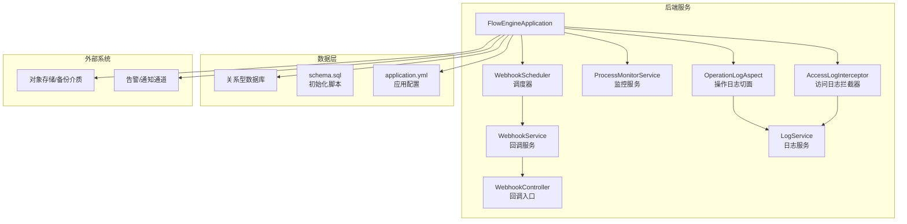
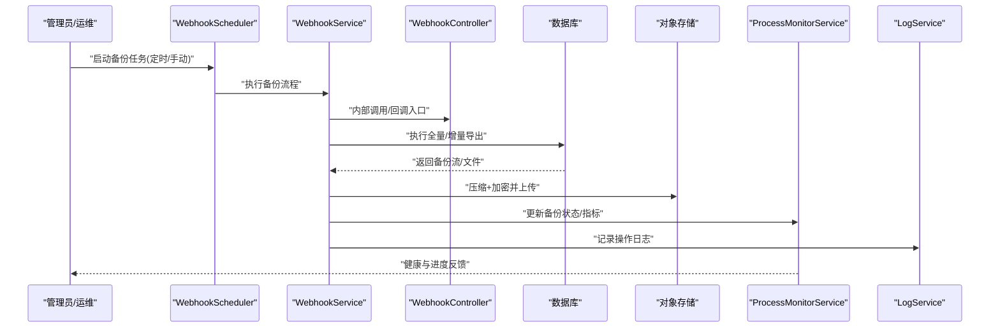
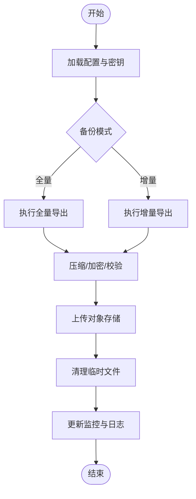
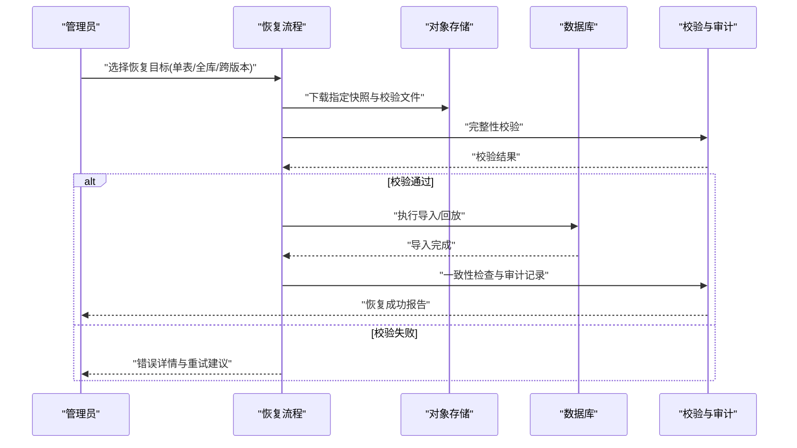
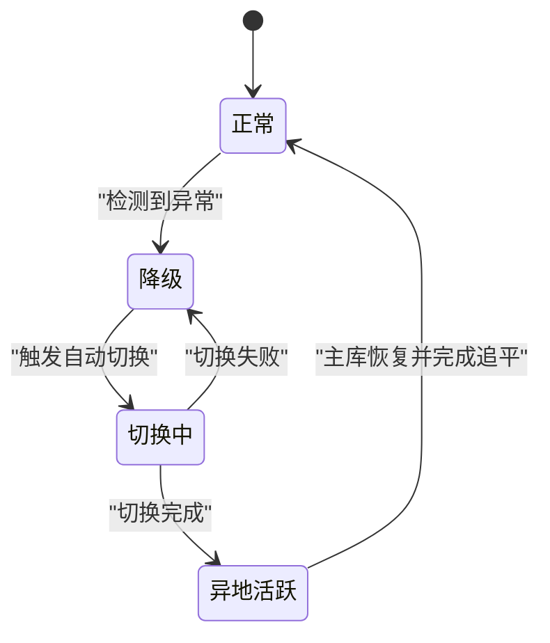
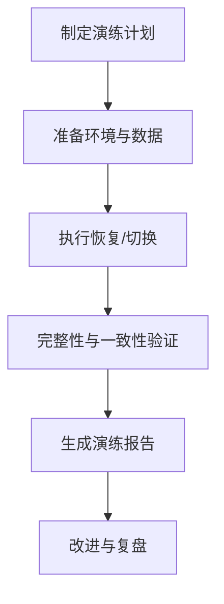
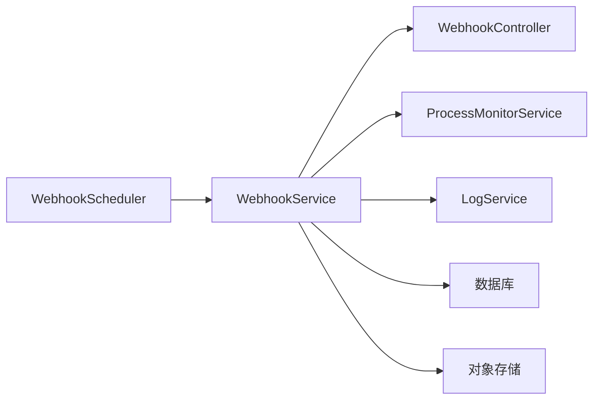

# 备份恢复

<cite>
**本文引用的文件**   
- [application.yml](file://flow-engine/src/main/resources/application.yml)
- [schema.sql](file://flow-engine/src/main/resources/db/schema.sql)
- [WebhookScheduler.java](file://flow-engine/src/main/java/com/flow/engine/service/WebhookScheduler.java)
- [WebhookService.java](file://flow-engine/src/main/java/com/flow/engine/service/WebhookService.java)
- [WebhookController.java](file://flow-engine/src/main/java/com/flow/engine/controllers/WebhookController.java)
- [ProcessMonitorService.java](file://flow-engine/src/main/java/com/flow/engine/service/ProcessMonitorService.java)
- [LogService.java](file://flow-engine/src/main/java/com/flow/engine/service/LogService.java)
- [OperationLogAspect.java](file://flow-engine/src/main/java/com/flow/engine/aspect/OperationLogAspect.java)
- [AccessLogInterceptor.java](file://flow-engine/src/main/java/com/flow/engine/interceptor/AccessLogInterceptor.java)
</cite>

## 目录
1. [简介](#简介)
2. [项目结构](#项目结构)
3. [核心组件](#核心组件)
4. [架构总览](#架构总览)
5. [详细组件分析](#详细组件分析)
6. [依赖分析](#依赖分析)
7. [性能考虑](#性能考虑)
8. [故障排查指南](#故障排查指南)
9. [结论](#结论)
10. [附录](#附录)

## 简介
本指南面向流程引擎的数据备份与灾难恢复，目标是提供可落地的操作手册：包括全量与增量备份策略、自动化脚本与定时任务、加密存储、数据恢复（单表/全库/跨版本迁移）、异地容灾与自动切换、备份验证与演练流程，以及RTO/RPO目标定义与实现路径。文档同时结合仓库中现有配置与能力（如调度器、日志审计、监控服务）给出落地建议与集成点。

## 项目结构
本项目为前后端分离的流程引擎系统，后端基于Spring Boot，数据库初始化脚本位于resources/db下，应用配置位于resources下；前端包含流程设计器与管理界面。备份与恢复主要涉及后端服务、数据库与外部存储/对象存储的集成。

图表来源
- [application.yml](file://flow-engine/src/main/resources/application.yml)
- [schema.sql](file://flow-engine/src/main/resources/db/schema.sql)
- [WebhookScheduler.java](file://flow-engine/src/main/java/com/flow/engine/service/WebhookScheduler.java)
- [WebhookService.java](file://flow-engine/src/main/java/com/flow/engine/service/WebhookService.java)
- [WebhookController.java](file://flow-engine/src/main/java/com/flow/engine/controllers/WebhookController.java)
- [ProcessMonitorService.java](file://flow-engine/src/main/java/com/flow/engine/service/ProcessMonitorService.java)
- [OperationLogAspect.java](file://flow-engine/src/main/java/com/flow/engine/aspect/OperationLogAspect.java)
- [AccessLogInterceptor.java](file://flow-engine/src/main/java/com/flow/engine/interceptor/AccessLogInterceptor.java)

章节来源
- [application.yml](file://flow-engine/src/main/resources/application.yml)
- [schema.sql](file://flow-engine/src/main/resources/db/schema.sql)

## 核心组件
- 调度器与回调：用于触发周期性或事件驱动的备份任务，并对外暴露回调接口以便外部编排系统驱动。
- 监控服务：提供健康检查与运行指标，便于在备份期间评估对业务的影响。
- 日志与审计：记录关键操作与访问行为，支撑备份/恢复过程的可追溯性。
- 配置与初始化：通过配置文件管理数据库连接、存储路径等；通过初始化脚本维护数据库结构。

章节来源
- [WebhookScheduler.java](file://flow-engine/src/main/java/com/flow/engine/service/WebhookScheduler.java)
- [WebhookService.java](file://flow-engine/src/main/java/com/flow/engine/service/WebhookService.java)
- [WebhookController.java](file://flow-engine/src/main/java/com/flow/engine/controllers/WebhookController.java)
- [ProcessMonitorService.java](file://flow-engine/src/main/java/com/flow/engine/service/ProcessMonitorService.java)
- [OperationLogAspect.java](file://flow-engine/src/main/java/com/flow/engine/aspect/OperationLogAspect.java)
- [AccessLogInterceptor.java](file://flow-engine/src/main/java/com/flow/engine/interceptor/AccessLogInterceptor.java)
- [application.yml](file://flow-engine/src/main/resources/application.yml)
- [schema.sql](file://flow-engine/src/main/resources/db/schema.sql)

## 架构总览
下图展示备份与恢复的整体架构：调度器按策略触发备份任务，服务层调用数据库导出工具生成备份文件，随后进行压缩与加密并上传至对象存储；恢复时从对象存储拉取指定快照，校验完整性后导入数据库；异地容灾通过双写或异步复制实现，故障切换由监控与调度协同完成。

图表来源
- [WebhookScheduler.java](file://flow-engine/src/main/java/com/flow/engine/service/WebhookScheduler.java)
- [WebhookService.java](file://flow-engine/src/main/java/com/flow/engine/service/WebhookService.java)
- [WebhookController.java](file://flow-engine/src/main/java/com/flow/engine/controllers/WebhookController.java)
- [ProcessMonitorService.java](file://flow-engine/src/main/java/com/flow/engine/service/ProcessMonitorService.java)
- [LogService.java](file://flow-engine/src/main/java/com/flow/engine/service/LogService.java)

## 详细组件分析

### 备份策略与计划
- 全量备份
  - 适用场景：首次完整快照、定期归档、跨版本迁移前的基线。
  - 执行频率：建议每周一次或重大变更前后。
  - 输出产物：全量SQL/逻辑备份文件，附带元数据（时间戳、版本、校验值）。
- 增量备份
  - 适用场景：高频业务数据的近实时保护。
  - 执行频率：建议每小时或更短周期，依据RPO目标调整。
  - 输出产物：差异/增量日志或基于事务日志的增量快照。
- 保留策略
  - 本地短期保留（例如7天），云端长期保留（例如90天以上），按合规要求设置生命周期。
- 加密与完整性
  - 传输与静态加密：使用强加密算法对备份文件进行加密，计算并保存哈希值用于校验。
  - 密钥管理：采用独立密钥管理服务或KMS，避免硬编码。

章节来源
- [application.yml](file://flow-engine/src/main/resources/application.yml)
- [WebhookScheduler.java](file://flow-engine/src/main/java/com/flow/engine/service/WebhookScheduler.java)
- [WebhookService.java](file://flow-engine/src/main/java/com/flow/engine/service/WebhookService.java)

### 自动化备份脚本与定时任务
- 定时任务
  - 使用内置调度器按Cron表达式触发备份任务，支持“全量”和“增量”两种模式。
  - 失败重试与退避策略：指数退避、最大重试次数、告警通知。
- 回调接口
  - 提供回调控制器以接收外部编排系统的指令，便于与CI/CD或运维平台联动。
- 执行步骤
  - 准备环境：加载配置、校验权限、创建临时工作目录。
  - 导出数据：根据策略选择全量或增量导出。
  - 后处理：压缩、加密、生成校验文件、上传对象存储。
  - 清理与上报：清理临时文件、更新监控指标、写入审计日志。

图表来源
- [WebhookScheduler.java](file://flow-engine/src/main/java/com/flow/engine/service/WebhookScheduler.java)
- [WebhookService.java](file://flow-engine/src/main/java/com/flow/engine/service/WebhookService.java)
- [WebhookController.java](file://flow-engine/src/main/java/com/flow/engine/controllers/WebhookController.java)

章节来源
- [WebhookScheduler.java](file://flow-engine/src/main/java/com/flow/engine/service/WebhookScheduler.java)
- [WebhookService.java](file://flow-engine/src/main/java/com/flow/engine/service/WebhookService.java)
- [WebhookController.java](file://flow-engine/src/main/java/com/flow/engine/controllers/WebhookController.java)

### 数据恢复流程
- 单表恢复
  - 定位目标表的最近有效备份（全量或增量组合）。
  - 校验备份完整性（哈希比对）。
  - 在隔离环境中先试恢复，确认无误后再在生产执行。
- 全库恢复
  - 选择最新的全量备份作为基线。
  - 按时间顺序回放后续增量备份。
  - 恢复后进行一致性校验与基础功能回归。
- 跨版本数据迁移
  - 在基线全量之上，按版本顺序回放增量。
  - 针对结构变更执行必要的迁移脚本（参考初始化脚本的结构定义）。
  - 回滚预案：保留上一版本快照，必要时快速回退。

图表来源
- [WebhookService.java](file://flow-engine/src/main/java/com/flow/engine/service/WebhookService.java)
- [LogService.java](file://flow-engine/src/main/java/com/flow/engine/service/LogService.java)
- [schema.sql](file://flow-engine/src/main/resources/db/schema.sql)

章节来源
- [schema.sql](file://flow-engine/src/main/resources/db/schema.sql)
- [WebhookService.java](file://flow-engine/src/main/java/com/flow/engine/service/WebhookService.java)
- [LogService.java](file://flow-engine/src/main/java/com/flow/engine/service/LogService.java)

### 异地容灾与自动切换
- 数据同步
  - 主备双写或异步复制：在主库写入成功后，将变更复制到异地副本。
  - 一致性保障：引入序列号或时间戳，确保回放顺序与幂等性。
- 故障检测与切换
  - 监控服务持续探测主库健康状态。
  - 达到阈值后触发自动切换，将流量指向异地副本。
  - 切换完成后继续执行增量回放，直至追平。
- 演练与验证
  - 定期演练切换流程，记录切换耗时与数据一致性结果。
  - 演练报告纳入审计与合规存档。

图表来源
- [ProcessMonitorService.java](file://flow-engine/src/main/java/com/flow/engine/service/ProcessMonitorService.java)
- [WebhookScheduler.java](file://flow-engine/src/main/java/com/flow/engine/service/WebhookScheduler.java)

章节来源
- [ProcessMonitorService.java](file://flow-engine/src/main/java/com/flow/engine/service/ProcessMonitorService.java)
- [WebhookScheduler.java](file://flow-engine/src/main/java/com/flow/engine/service/WebhookScheduler.java)

### 备份验证与演练流程
- 验证项
  - 完整性：哈希校验、文件大小与数量核对。
  - 可用性：在隔离环境执行恢复，验证关键表结构与数据。
  - 一致性：对比关键字段统计与抽样数据。
- 演练计划
  - 月度全库恢复演练，季度异地切换演练。
  - 演练前准备：冻结变更窗口、准备回滚方案。
  - 演练后总结：记录问题与改进措施。

[本节为概念性流程说明，不直接分析具体文件，故无章节来源]

### RTO与RPO定义与实现
- RTO（恢复时间目标）
  - 定义：从灾难发生到业务恢复可用的最长时间。
  - 实现要点：优化导入性能、并行回放、预分配资源、自动化切换。
- RPO（恢复点目标）
  - 定义：允许丢失的最大数据时间窗口。
  - 实现要点：提高增量备份频率、降低复制延迟、保证幂等回放。
- 目标建议
  - 一般业务：RTO≤30分钟，RPO≤5分钟。
  - 关键业务：RTO≤10分钟，RPO≤1分钟。
  - 非关键业务：RTO≤2小时，RPO≤1小时。

[本节为通用指导，不直接分析具体文件，故无章节来源]

## 依赖分析
- 组件耦合
  - 调度器与服务：调度器负责触发，服务负责执行，职责清晰，低耦合。
  - 监控与日志：监控关注健康与指标，日志关注审计与可追溯，二者共同支撑可观测性。
- 外部依赖
  - 数据库：备份/恢复的核心依赖，需保证连接池、超时与重试策略合理。
  - 对象存储：用于持久化备份文件，需配置安全访问与生命周期策略。
- 潜在风险
  - 循环依赖：应避免服务间相互调用形成环。
  - 外部不可用：对象存储或数据库异常时的降级与告警。

图表来源
- [WebhookScheduler.java](file://flow-engine/src/main/java/com/flow/engine/service/WebhookScheduler.java)
- [WebhookService.java](file://flow-engine/src/main/java/com/flow/engine/service/WebhookService.java)
- [WebhookController.java](file://flow-engine/src/main/java/com/flow/engine/controllers/WebhookController.java)
- [ProcessMonitorService.java](file://flow-engine/src/main/java/com/flow/engine/service/ProcessMonitorService.java)
- [LogService.java](file://flow-engine/src/main/java/com/flow/engine/service/LogService.java)

章节来源
- [WebhookScheduler.java](file://flow-engine/src/main/java/com/flow/engine/service/WebhookScheduler.java)
- [WebhookService.java](file://flow-engine/src/main/java/com/flow/engine/service/WebhookService.java)
- [WebhookController.java](file://flow-engine/src/main/java/com/flow/engine/controllers/WebhookController.java)
- [ProcessMonitorService.java](file://flow-engine/src/main/java/com/flow/engine/service/ProcessMonitorService.java)
- [LogService.java](file://flow-engine/src/main/java/com/flow/engine/service/LogService.java)

## 性能考虑
- 备份阶段
  - 分片导出：大表按范围或键分片，提升并发度。
  - 流式处理：边导出边压缩/加密，减少内存占用。
  - I/O优化：使用高性能磁盘或SSD，避免与业务查询争抢。
- 恢复阶段
  - 关闭非必要索引与约束，恢复后再重建。
  - 批量提交与事务控制，避免长事务锁表。
  - 预热缓存与连接池，缩短冷启动时间。
- 监控与限流
  - 在备份/恢复期间限制业务流量，避免雪崩。
  - 实时监控CPU、内存、I/O与数据库负载，动态调整并发。

[本节为通用指导，不直接分析具体文件，故无章节来源]

## 故障排查指南
- 常见问题
  - 备份失败：检查数据库连接、权限、存储空间与网络连通性。
  - 校验失败：核对哈希值与原始文件，确认传输未损坏。
  - 恢复慢：查看导入日志与数据库锁等待，优化批大小与索引策略。
- 可观测性
  - 使用监控服务获取健康状态与指标。
  - 通过日志服务与审计切面回溯关键操作。
- 应急措施
  - 暂停新备份任务，优先恢复关键业务。
  - 启用只读模式，防止恢复期间数据被修改。

章节来源
- [ProcessMonitorService.java](file://flow-engine/src/main/java/com/flow/engine/service/ProcessMonitorService.java)
- [LogService.java](file://flow-engine/src/main/java/com/flow/engine/service/LogService.java)
- [OperationLogAspect.java](file://flow-engine/src/main/java/com/flow/engine/aspect/OperationLogAspect.java)
- [AccessLogInterceptor.java](file://flow-engine/src/main/java/com/flow/engine/interceptor/AccessLogInterceptor.java)

## 结论
通过明确的全量与增量备份策略、自动化调度与回调机制、严格的加密与校验、完善的恢复流程与异地容灾方案，并结合监控与审计能力，可有效保障流程引擎的数据可用性与业务连续性。建议在生产环境定期演练，持续优化RTO/RPO指标，确保灾难发生时能快速、可靠地恢复。

[本节为总结性内容，不直接分析具体文件，故无章节来源]

## 附录
- 配置清单
  - 数据库连接、超时与重试参数。
  - 对象存储访问凭证与桶策略。
  - 加密算法与密钥管理配置。
- 脚本清单
  - 全量备份脚本、增量备份脚本、恢复脚本、校验脚本。
- 模板清单
  - 演练计划模板、恢复报告模板、回滚预案模板。

[本节为补充信息，不直接分析具体文件，故无章节来源]