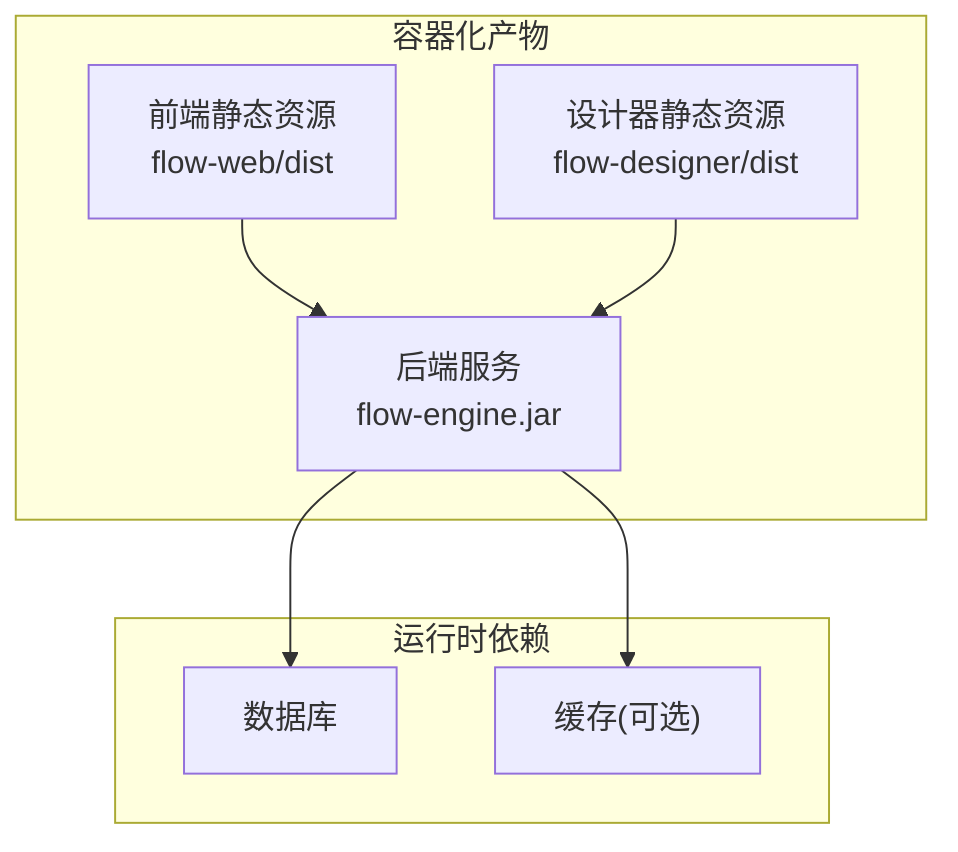
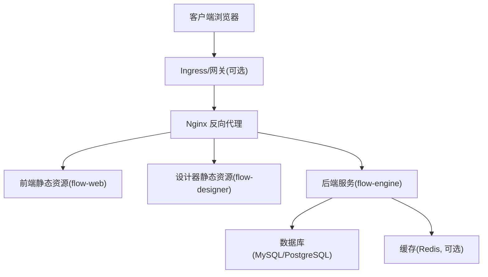
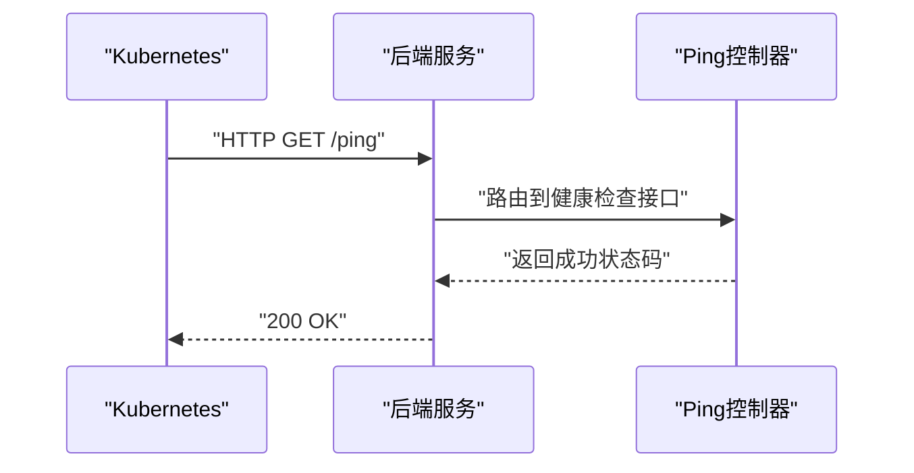
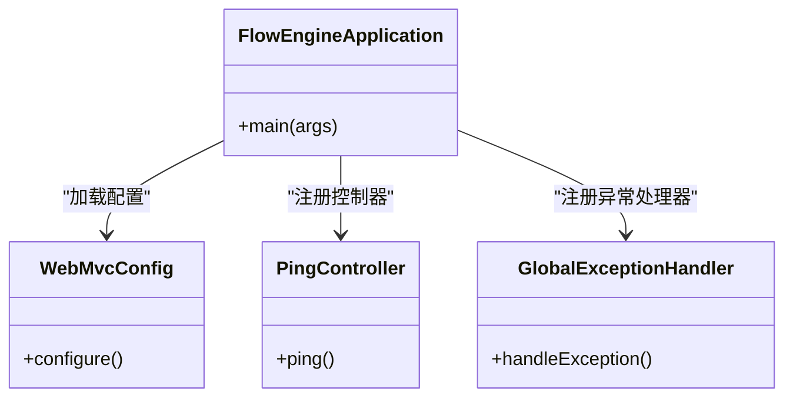

# 容器化部署

<cite>
**本文引用的文件**   
- [flow-engine/pom.xml](file://flow-engine/pom.xml)
- [flow-engine/src/main/resources/application.yml](file://flow-engine/src/main/resources/application.yml)
- [flow-engine/src/main/java/com/flow/engine/FlowEngineApplication.java](file://flow-engine/src/main/java/com/flow/engine/FlowEngineApplication.java)
- [flow-engine/src/main/java/com/flow/engine/config/WebMvcConfig.java](file://flow-engine/src/main/java/com/flow/engine/config/WebMvcConfig.java)
- [flow-engine/src/main/java/com/flow/engine/controller/PingController.java](file://flow-engine/src/main/java/com/flow/engine/controller/PingController.java)
- [flow-engine/src/main/java/com/flow/engine/common/GlobalExceptionHandler.java](file://flow-engine/src/main/java/com/flow/engine/common/GlobalExceptionHandler.java)
- [flow-engine/src/test/java/com/flow/engine/HealthCheckTest.java](file://flow-engine/src/test/java/com/flow/engine/HealthCheckTest.java)
- [flow-engine/src/main/resources/db/schema.sql](file://flow-engine/src/main/resources/db/schema.sql)
- [flow-web/package.json](file://flow-web/package.json)
- [flow-web/vite.config.js](file://flow-web/vite.config.js)
- [flow-designer/package.json](file://flow-designer/package.json)
- [flow-designer/vite.config.js](file://flow-designer/vite.config.js)
</cite>

## 目录
1. [简介](#简介)
2. [项目结构](#项目结构)
3. [核心组件](#核心组件)
4. [架构总览](#架构总览)
5. [详细组件分析](#详细组件分析)
6. [依赖分析](#依赖分析)
7. [性能考虑](#性能考虑)
8. [故障排查指南](#故障排查指南)
9. [结论](#结论)
10. [附录](#附录)

## 简介
本指南面向将“流程引擎后端”与“前端应用（含流程设计器）”进行容器化部署的工程师，覆盖以下主题：
- Docker 镜像构建过程与多阶段构建优化、镜像体积控制
- 使用 Docker Compose 编排后端服务、前端静态资源、数据库与缓存的一键部署
- Kubernetes 部署配置：Deployment、Service、ConfigMap、Secret 等资源对象定义
- 环境变量管理与敏感信息的安全存储方案
- 容器健康检查、资源限制与滚动更新策略
- 日志收集与监控集成的最佳实践

## 项目结构
仓库包含三个主要子工程：
- flow-engine：基于 Spring Boot 的后端服务，提供流程定义、实例、任务等 API，并内置全局异常处理、Web MVC 配置、健康检查测试等。
- flow-web：Vue 前端管理应用，通过 Vite 构建为静态资源。
- flow-designer：流程设计器前端，同样通过 Vite 构建为静态资源。

[本节为概念性说明，无需代码来源]

## 核心组件
- 后端服务
  - 入口类：用于启动 Spring Boot 应用，暴露 HTTP 接口。
  - Web 配置：注册拦截器、跨域、路径映射等。
  - 健康检查：提供轻量探测接口，便于容器编排层做存活/就绪探针。
  - 全局异常处理：统一错误响应格式，便于日志与监控采集。
- 前端应用
  - 构建产物：Vite 打包后的静态资源，适合由 Nginx 或反向代理直接托管。
- 数据与缓存
  - 数据库：通过 SQL 脚本初始化表结构。
  - 缓存：按业务需要启用（如 Redis），通过环境变量注入连接参数。

章节来源
- [flow-engine/src/main/java/com/flow/engine/FlowEngineApplication.java](file://flow-engine/src/main/java/com/flow/engine/FlowEngineApplication.java)
- [flow-engine/src/main/java/com/flow/engine/config/WebMvcConfig.java](file://flow-engine/src/main/java/com/flow/engine/config/WebMvcConfig.java)
- [flow-engine/src/main/java/com/flow/engine/controller/PingController.java](file://flow-engine/src/main/java/com/flow/engine/controller/PingController.java)
- [flow-engine/src/main/java/com/flow/engine/common/GlobalExceptionHandler.java](file://flow-engine/src/main/java/com/flow/engine/common/GlobalExceptionHandler.java)
- [flow-engine/src/main/resources/db/schema.sql](file://flow-engine/src/main/resources/db/schema.sql)
- [flow-web/package.json](file://flow-web/package.json)
- [flow-web/vite.config.js](file://flow-web/vite.config.js)
- [flow-designer/package.json](file://flow-designer/package.json)
- [flow-designer/vite.config.js](file://flow-designer/vite.config.js)

## 架构总览
下图展示了容器化部署的整体架构：前端与设计器静态资源由反向代理统一接入，请求转发至后端；后端访问数据库与缓存；所有组件以容器形式运行，并通过环境变量与密钥管理外部化配置。

[本节为概念性说明，无需代码来源]

## 详细组件分析

### 后端服务容器化
- 构建目标
  - 使用 Maven 编译打包生成可执行 JAR。
  - 生产镜像仅包含运行时依赖与 JRE/JDK 精简镜像。
- 多阶段构建建议
  - 第一阶段：安装 JDK/Maven，拉取源码，执行 mvn clean package，产出 JAR。
  - 第二阶段：使用最小运行时镜像（如 distroless 或 alpine + JRE），拷贝 JAR 并设置启动命令。
- 镜像体积控制
  - 清理 Maven 本地仓库缓存与临时文件。
  - 使用 .dockerignore 排除 node_modules、target、.git 等无关目录。
  - 合并 RUN 指令减少镜像层数。
- 启动参数与环境变量
  - 通过环境变量注入数据库、缓存、端口、日志级别等。
  - 支持 JVM 参数（堆大小、GC 等）通过启动脚本或 entrypoint 传入。

章节来源
- [flow-engine/pom.xml](file://flow-engine/pom.xml)
- [flow-engine/src/main/resources/application.yml](file://flow-engine/src/main/resources/application.yml)
- [flow-engine/src/main/java/com/flow/engine/FlowEngineApplication.java](file://flow-engine/src/main/java/com/flow/engine/FlowEngineApplication.java)

### 前端与设计器容器化
- 构建目标
  - 使用 Node 镜像执行 npm install 与构建命令，产出静态资源到 dist 目录。
  - 最终镜像仅包含 Nginx 与静态资源，不保留构建工具链。
- 多阶段构建建议
  - 第一阶段：Node 镜像中完成依赖安装与构建。
  - 第二阶段：Nginx 镜像中复制 dist 内容，并挂载自定义 nginx.conf。
- 反向代理策略
  - 将 /api 前缀的请求转发至后端服务。
  - 其余路径返回前端静态资源。

章节来源
- [flow-web/package.json](file://flow-web/package.json)
- [flow-web/vite.config.js](file://flow-web/vite.config.js)
- [flow-designer/package.json](file://flow-designer/package.json)
- [flow-designer/vite.config.js](file://flow-designer/vite.config.js)

### 数据库与缓存
- 数据库
  - 使用官方镜像，通过卷持久化数据目录。
  - 首次启动时导入 schema.sql 初始化表结构。
- 缓存
  - 使用官方镜像，通过卷持久化数据目录（如需）。
  - 通过环境变量注入连接地址、密码等。

章节来源
- [flow-engine/src/main/resources/db/schema.sql](file://flow-engine/src/main/resources/db/schema.sql)

### 健康检查与探针
- 存活探针(livenessProbe)
  - 调用轻量级接口，失败则重启容器。
- 就绪探针(readinessProbe)
  - 在依赖（数据库、缓存）未就绪时拒绝流量，避免冷启动报错。
- 实现建议
  - 使用现有 Ping 控制器提供的接口作为探针端点。
  - 若需更严格的健康检查，可在控制器中增加依赖可用性判断。

图表来源
- [flow-engine/src/main/java/com/flow/engine/controller/PingController.java](file://flow-engine/src/main/java/com/flow/engine/controller/PingController.java)

章节来源
- [flow-engine/src/test/java/com/flow/engine/HealthCheckTest.java](file://flow-engine/src/test/java/com/flow/engine/HealthCheckTest.java)
- [flow-engine/src/main/java/com/flow/engine/controller/PingController.java](file://flow-engine/src/main/java/com/flow/engine/controller/PingController.java)

### 环境变量与敏感信息管理
- 环境变量
  - 数据库连接、用户名、密码、缓存地址、端口、日志级别等通过环境变量注入。
  - 建议在 application.yml 中使用占位符读取环境变量。
- 敏感信息
  - 使用 Secret 管理数据库密码、API Key 等敏感值。
  - 在 Deployment 中以 Volume 或环境变量方式挂载 Secret。
- 配置分层
  - 基础配置放入 ConfigMap，环境差异通过环境变量覆盖。

章节来源
- [flow-engine/src/main/resources/application.yml](file://flow-engine/src/main/resources/application.yml)

### 资源限制与滚动更新
- 资源限制
  - 为每个容器设置 requests 与 limits（CPU、内存），保障调度与稳定性。
- 滚动更新
  - 使用 RollingUpdate 策略，设置 maxUnavailable 与 maxSurge，保证零停机发布。
- 探针配合
  - 就绪探针确保新 Pod 完全就绪后再替换旧 Pod。

[本节为通用指导，无需代码来源]

### 日志收集与监控集成
- 日志
  - 应用输出标准输出，由容器运行时收集。
  - 推荐接入集中式日志系统（如 EFK/ELK、Loki）。
- 指标
  - 暴露 Prometheus 指标端点，结合 Grafana 展示关键指标。
- 链路追踪
  - 可选接入 APM 工具，对关键接口进行采样与可视化。

[本节为通用指导，无需代码来源]

## 依赖分析
后端服务依赖关系如下：

图表来源
- [flow-engine/src/main/java/com/flow/engine/FlowEngineApplication.java](file://flow-engine/src/main/java/com/flow/engine/FlowEngineApplication.java)
- [flow-engine/src/main/java/com/flow/engine/config/WebMvcConfig.java](file://flow-engine/src/main/java/com/flow/engine/config/WebMvcConfig.java)
- [flow-engine/src/main/java/com/flow/engine/controller/PingController.java](file://flow-engine/src/main/java/com/flow/engine/controller/PingController.java)
- [flow-engine/src/main/java/com/flow/engine/common/GlobalExceptionHandler.java](file://flow-engine/src/main/java/com/flow/engine/common/GlobalExceptionHandler.java)

章节来源
- [flow-engine/src/main/java/com/flow/engine/FlowEngineApplication.java](file://flow-engine/src/main/java/com/flow/engine/FlowEngineApplication.java)
- [flow-engine/src/main/java/com/flow/engine/config/WebMvcConfig.java](file://flow-engine/src/main/java/com/flow/engine/config/WebMvcConfig.java)
- [flow-engine/src/main/java/com/flow/engine/controller/PingController.java](file://flow-engine/src/main/java/com/flow/engine/controller/PingController.java)
- [flow-engine/src/main/java/com/flow/engine/common/GlobalExceptionHandler.java](file://flow-engine/src/main/java/com/flow/engine/common/GlobalExceptionHandler.java)

## 性能考虑
- 镜像构建
  - 合理分层与缓存命中，缩短 CI/CD 构建时间。
  - 使用多阶段构建与 .dockerignore 减小镜像体积。
- 运行时
  - 根据负载调整 JVM 堆大小与线程池参数。
  - 数据库连接池、缓存命中率调优。
- 网络与 I/O
  - 合理设置反向代理超时与缓冲。
  - 开启 Gzip/Brotli 压缩静态资源。

[本节为通用指导，无需代码来源]

## 故障排查指南
- 健康检查失败
  - 确认探针端点可达且返回成功状态码。
  - 检查数据库与缓存连通性。
- 启动失败
  - 查看容器日志定位异常栈。
  - 校验环境变量与 Secret 是否正确挂载。
- 请求 404/500
  - 检查反向代理路由规则是否将 /api 转发至后端。
  - 查看全局异常处理器输出的错误信息。

章节来源
- [flow-engine/src/main/java/com/flow/engine/controller/PingController.java](file://flow-engine/src/main/java/com/flow/engine/controller/PingController.java)
- [flow-engine/src/main/java/com/flow/engine/common/GlobalExceptionHandler.java](file://flow-engine/src/main/java/com/flow/engine/common/GlobalExceptionHandler.java)

## 结论
通过多阶段构建、合理的镜像分层与体积控制、完善的健康检查与探针、严格的资源限制与滚动更新策略，以及集中的日志与监控体系，可实现高可用、易维护、可扩展的容器化部署。建议在生产环境中结合 CI/CD 流水线自动化构建与发布，并使用 Secret 与 ConfigMap 管理配置与敏感信息。

[本节为总结性内容，无需代码来源]

## 附录

### Docker Compose 一键部署清单（示例说明）
- 服务列表
  - backend：后端服务镜像
  - frontend：前端静态资源镜像
  - designer：设计器静态资源镜像
  - db：数据库镜像
  - cache：缓存镜像（可选）
- 网络与卷
  - 创建共享网络供服务间通信
  - 为数据库与缓存创建持久卷
- 环境变量
  - 通过 env_file 或 inline 方式注入数据库、缓存、端口等
- 健康检查
  - 为各服务配置 healthcheck，确保依赖就绪
- 反向代理
  - 在 frontend/designer 镜像中配置 Nginx，将 /api 转发至 backend

[本节为概念性说明，无需代码来源]

### Kubernetes 资源对象要点（示例说明）
- Deployment
  - 指定镜像、副本数、资源限制、滚动更新策略
  - 配置 liveness/readiness 探针
- Service
  - ClusterIP/NodePort/LoadBalancer 暴露后端服务
- ConfigMap
  - 存放非敏感配置项（如端口、开关）
- Secret
  - 存放敏感信息（如数据库密码、API Key）
- Ingress
  - 对外暴露域名与路径规则，统一入口

[本节为概念性说明，无需代码来源]