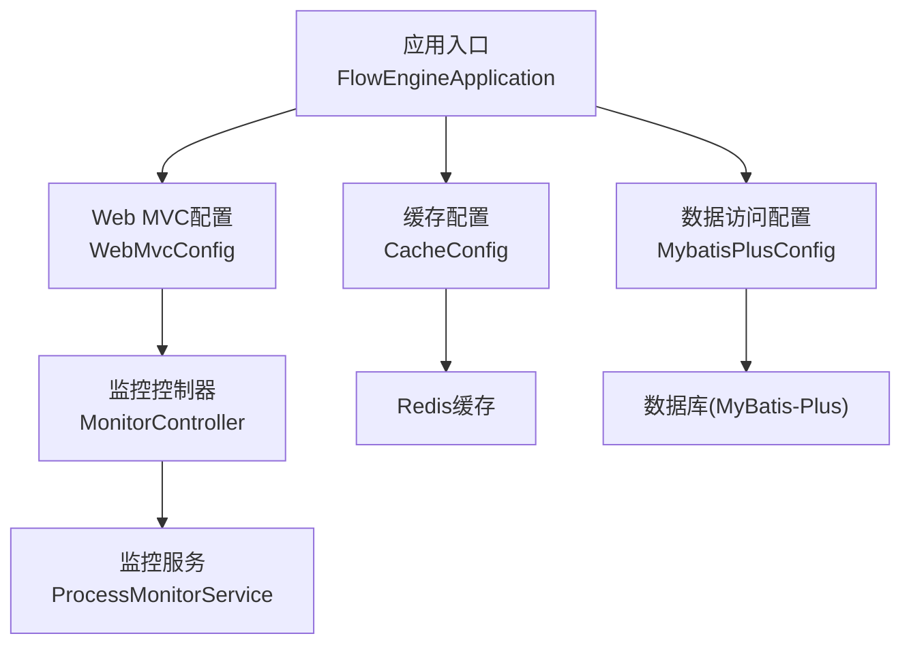
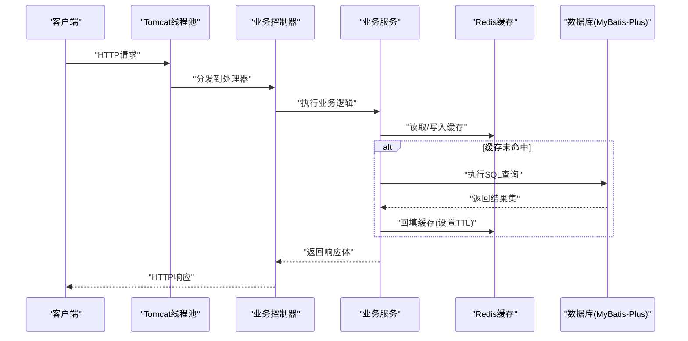
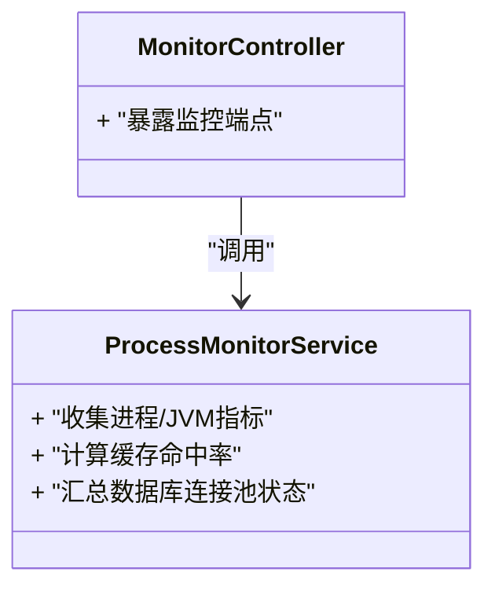
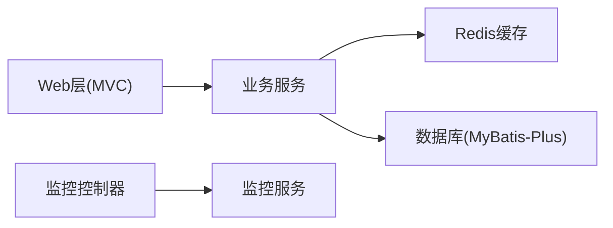

# 性能调优

<cite>
**本文引用的文件**   
- [application.yml](file://flow-engine/src/main/resources/application.yml)
- [CacheConfig.java](file://flow-engine/src/main/java/com/flow/engine/config/CacheConfig.java)
- [MybatisPlusConfig.java](file://flow-engine/src/main/java/com/flow/engine/config/MybatisPlusConfig.java)
- [WebMvcConfig.java](file://flow-engine/src/main/java/com/flow/engine/config/WebMvcConfig.java)
- [ProcessMonitorService.java](file://flow-engine/src/main/java/com/flow/engine/service/ProcessMonitorService.java)
- [MonitorController.java](file://flow-engine/src/main/java/com/flow/engine/controllers/MonitorController.java)
- [FlowEngineApplication.java](file://flow-engine/src/main/java/com/flow/engine/FlowEngineApplication.java)
</cite>

## 目录
1. [简介](#简介)
2. [项目结构](#项目结构)
3. [核心组件](#核心组件)
4. [架构总览](#架构总览)
5. [详细组件分析](#详细组件分析)
6. [依赖分析](#依赖分析)
7. [性能考虑](#性能考虑)
8. [故障排查指南](#故障排查指南)
9. [结论](#结论)
10. [附录](#附录)

## 简介
本指南面向流程引擎后端服务，围绕JVM、数据库连接池、Redis缓存、Web服务器以及应用层进行系统化的性能调优。内容覆盖堆内存与GC参数、线程池配置、连接池容量与SQL优化、索引策略、缓存策略与过期时间、Tomcat线程池与静态资源压缩、批量与异步处理、监控指标与基准测试方法等。所有建议均结合工程现有配置与代码位置给出可落地的调整路径。

## 项目结构
后端服务位于 flow-engine 模块，关键配置与监控能力集中在以下位置：
- 应用配置：application.yml
- 缓存配置：config/CacheConfig.java
- 数据访问配置：config/MybatisPlusConfig.java
- Web MVC配置：config/WebMvcConfig.java
- 监控服务：service/ProcessMonitorService.java
- 监控接口：controllers/MonitorController.java
- 启动入口：FlowEngineApplication.java

图表来源
- [FlowEngineApplication.java](file://flow-engine/src/main/java/com/flow/engine/FlowEngineApplication.java)
- [WebMvcConfig.java](file://flow-engine/src/main/java/com/flow/engine/config/WebMvcConfig.java)
- [CacheConfig.java](file://flow-engine/src/main/java/com/flow/engine/config/CacheConfig.java)
- [MybatisPlusConfig.java](file://flow-engine/src/main/java/com/flow/engine/config/MybatisPlusConfig.java)
- [MonitorController.java](file://flow-engine/src/main/java/com/flow/engine/controllers/MonitorController.java)
- [ProcessMonitorService.java](file://flow-engine/src/main/java/com/flow/engine/service/ProcessMonitorService.java)

章节来源
- [application.yml](file://flow-engine/src/main/resources/application.yml)
- [CacheConfig.java](file://flow-engine/src/main/java/com/flow/engine/config/CacheConfig.java)
- [MybatisPlusConfig.java](file://flow-engine/src/main/java/com/flow/engine/config/MybatisPlusConfig.java)
- [WebMvcConfig.java](file://flow-engine/src/main/java/com/flow/engine/config/WebMvcConfig.java)
- [MonitorController.java](file://flow-engine/src/main/java/com/flow/engine/controllers/MonitorController.java)
- [ProcessMonitorService.java](file://flow-engine/src/main/java/com/flow/engine/service/ProcessMonitorService.java)
- [FlowEngineApplication.java](file://flow-engine/src/main/java/com/flow/engine/FlowEngineApplication.java)

## 核心组件
- 应用入口与自动装配：负责加载Spring Boot默认及自定义配置，初始化Web容器、数据源、缓存等基础设施。
- Web MVC配置：提供拦截器、跨域、视图解析、静态资源与Gzip等通用能力扩展点。
- 缓存配置：定义Redis序列化、Key前缀、过期策略、是否启用缓存等。
- 数据访问配置：定义MyBatis-Plus分页、逻辑删除、驼峰映射、审计字段等。
- 监控服务与控制器：暴露运行时指标（如进程信息、JVM状态、缓存命中率等）供外部采集。

章节来源
- [FlowEngineApplication.java](file://flow-engine/src/main/java/com/flow/engine/FlowEngineApplication.java)
- [WebMvcConfig.java](file://flow-engine/src/main/java/com/flow/engine/config/WebMvcConfig.java)
- [CacheConfig.java](file://flow-engine/src/main/java/com/flow/engine/config/CacheConfig.java)
- [MybatisPlusConfig.java](file://flow-engine/src/main/java/com/flow/engine/config/MybatisPlusConfig.java)
- [MonitorController.java](file://flow-engine/src/main/java/com/flow/engine/controllers/MonitorController.java)
- [ProcessMonitorService.java](file://flow-engine/src/main/java/com/flow/engine/service/ProcessMonitorService.java)

## 架构总览
下图展示从请求进入Web层到数据访问与缓存的调用链路，并标注了可观测性接入点。

图表来源
- [WebMvcConfig.java](file://flow-engine/src/main/java/com/flow/engine/config/WebMvcConfig.java)
- [CacheConfig.java](file://flow-engine/src/main/java/com/flow/engine/config/CacheConfig.java)
- [MybatisPlusConfig.java](file://flow-engine/src/main/java/com/flow/engine/config/MybatisPlusConfig.java)

## 详细组件分析

### JVM与运行环境调优
- 堆内存与GC
  - 根据机器可用内存与服务负载设定初始堆与最大堆，避免频繁扩容；在压测中观察Full GC频率与停顿时间，据此微调新生代比例与老年代阈值。
  - 选择适合吞吐或低延迟的垃圾回收器组合，并在不同负载下对比STW时间与吞吐量。
- 线程模型
  - 合理设置应用线程数与I/O线程数，避免CPU上下文切换过多或线程饥饿。
- 监控与诊断
  - 开启必要的GC日志与堆转储开关，配合外部监控系统收集指标。

章节来源
- [application.yml](file://flow-engine/src/main/resources/application.yml)
- [FlowEngineApplication.java](file://flow-engine/src/main/java/com/flow/engine/FlowEngineApplication.java)

### 数据库连接池与SQL优化
- 连接池容量
  - 根据并发度与平均响应时间估算最小/最大连接数，确保在高并发时不阻塞且不过度占用数据库资源。
  - 关注空闲连接回收与超时，避免连接泄漏导致连接池耗尽。
- 查询优化
  - 使用分页插件限制单次返回量，避免大结果集拖垮网络与应用线程。
  - 减少N+1查询，优先使用JOIN或批量查询。
- 索引策略
  - 针对高频过滤、排序与关联条件建立合适索引，定期评估慢查询并优化。
- MyBatis-Plus特性
  - 利用内置分页、逻辑删除、自动填充等能力提升开发效率与一致性。

章节来源
- [MybatisPlusConfig.java](file://flow-engine/src/main/java/com/flow/engine/config/MybatisPlusConfig.java)
- [application.yml](file://flow-engine/src/main/resources/application.yml)

### Redis缓存优化
- 缓存策略
  - 热点数据优先入缓存，采用“先更新库再删缓存”或“延时双删”策略保证一致性。
  - 对读多写少的字典类数据采用较长TTL，降低DB压力。
- 过期时间
  - 为不同业务Key设置差异化TTL，避免雪崩；必要时引入随机抖动。
- 内存管理
  - 设置合理的最大内存与淘汰策略，防止OOM；监控命中率与内存碎片率。
- 序列化与Key设计
  - 统一序列化方式，控制Key长度与命名规范，便于定位问题。

章节来源
- [CacheConfig.java](file://flow-engine/src/main/java/com/flow/engine/config/CacheConfig.java)
- [application.yml](file://flow-engine/src/main/resources/application.yml)

### Web服务器(Tomcat)与静态资源
- 线程池
  - 根据CPU核数与I/O等待特征调整工作线程数与队列长度，避免请求堆积或线程爆炸。
- 静态资源缓存
  - 为静态资源设置合适的Cache-Control与ETag，减少重复传输。
- Gzip压缩
  - 启用文本型资源的压缩，降低带宽占用，提高首屏与接口响应速度。
- 安全与限流
  - 结合网关或过滤器实现限流与熔断，保护后端稳定。

章节来源
- [WebMvcConfig.java](file://flow-engine/src/main/java/com/flow/engine/config/WebMvcConfig.java)
- [application.yml](file://flow-engine/src/main/resources/application.yml)

### 应用层性能优化
- SQL层面
  - 避免SELECT *，按需取列；合理使用EXPLAIN分析执行计划。
- 批量操作
  - 大批量写入使用批量插入/更新，减少往返次数与事务开销。
- 异步处理
  - 将耗时任务（如通知、报表生成）放入消息队列或异步线程池，缩短主链路RT。
- 幂等与重试
  - 对外部依赖调用增加幂等键与退避重试，提升鲁棒性。

章节来源
- [application.yml](file://flow-engine/src/main/resources/application.yml)

### 监控指标与基准测试
- 监控指标
  - 进程与JVM：CPU、堆/非堆内存、GC次数与耗时、线程数。
  - 中间件：数据库连接池活跃/空闲、慢查询、Redis命中率与内存使用。
  - 应用：QPS、P95/P99延迟、错误率、线程池饱和情况。
- 指标采集
  - 通过监控控制器暴露基础运行时信息，由Prometheus/Grafana等采集展示。
- 基准测试
  - 使用压测工具模拟典型场景，逐步放大并发，观察拐点与瓶颈。
  - 以“目标TPS + 目标延迟 + 错误率上限”作为验收标准。

图表来源
- [MonitorController.java](file://flow-engine/src/main/java/com/flow/engine/controllers/MonitorController.java)
- [ProcessMonitorService.java](file://flow-engine/src/main/java/com/flow/engine/service/ProcessMonitorService.java)

章节来源
- [MonitorController.java](file://flow-engine/src/main/java/com/flow/engine/controllers/MonitorController.java)
- [ProcessMonitorService.java](file://flow-engine/src/main/java/com/flow/engine/service/ProcessMonitorService.java)

## 依赖分析
- 组件耦合
  - Web层依赖MVC配置与业务服务；业务服务依赖缓存与数据访问层；监控控制器依赖监控服务。
- 外部依赖
  - 数据库(MyBatis-Plus)、Redis、Tomcat容器。
- 潜在风险
  - 连接池与线程池大小不当会导致资源争用；缓存穿透/雪崩需有防护；慢查询与缺失索引是常见瓶颈。

图表来源
- [WebMvcConfig.java](file://flow-engine/src/main/java/com/flow/engine/config/WebMvcConfig.java)
- [CacheConfig.java](file://flow-engine/src/main/java/com/flow/engine/config/CacheConfig.java)
- [MybatisPlusConfig.java](file://flow-engine/src/main/java/com/flow/engine/config/MybatisPlusConfig.java)
- [MonitorController.java](file://flow-engine/src/main/java/com/flow/engine/controllers/MonitorController.java)
- [ProcessMonitorService.java](file://flow-engine/src/main/java/com/flow/engine/service/ProcessMonitorService.java)

章节来源
- [WebMvcConfig.java](file://flow-engine/src/main/java/com/flow/engine/config/WebMvcConfig.java)
- [CacheConfig.java](file://flow-engine/src/main/java/com/flow/engine/config/CacheConfig.java)
- [MybatisPlusConfig.java](file://flow-engine/src/main/java/com/flow/engine/config/MybatisPlusConfig.java)
- [MonitorController.java](file://flow-engine/src/main/java/com/flow/engine/controllers/MonitorController.java)
- [ProcessMonitorService.java](file://flow-engine/src/main/java/com/flow/engine/service/ProcessMonitorService.java)

## 性能考虑
- 容量规划
  - 依据峰值QPS与平均RT估算所需CPU、内存与IO资源，预留冗余。
- 渐进式优化
  - 先做无侵入优化（索引、缓存、连接池），再做架构级改造（分库分表、读写分离）。
- 变更验证
  - 任何参数调整需在预发环境压测验证，回归关键SLA指标。

[本节为通用指导，无需源码引用]

## 故障排查指南
- 常见问题
  - 高延迟：检查慢查询、锁竞争、线程池饱和、GC停顿。
  - OOM：检查堆大小、对象生命周期、缓存未设TTL导致的内存增长。
  - 连接池耗尽：检查最大连接数、长事务、未关闭连接。
  - 缓存击穿/雪崩：检查热点Key失效策略与TTL抖动。
- 快速定位
  - 通过监控控制器获取当前JVM与缓存状态，结合数据库慢查询日志与Redis内存使用定位根因。

章节来源
- [MonitorController.java](file://flow-engine/src/main/java/com/flow/engine/controllers/MonitorController.java)
- [ProcessMonitorService.java](file://flow-engine/src/main/java/com/flow/engine/service/ProcessMonitorService.java)

## 结论
性能调优是一个持续迭代的过程。建议以监控驱动、压测验证为主线，先从JVM与连接池入手，再到SQL与索引优化，最后完善缓存策略与异步化改造。通过完善的指标体系与基线测试，确保每次变更都能量化收益与风险。

[本节为总结性内容，无需源码引用]

## 附录
- 常用压测工具与方法
  - 使用压测工具构造典型场景，逐步提升并发，记录TPS、延迟分布与错误率。
- 指标看板
  - 将JVM、数据库、Redis与应用指标统一纳入可视化看板，设置告警阈值。

[本节为补充说明，无需源码引用]