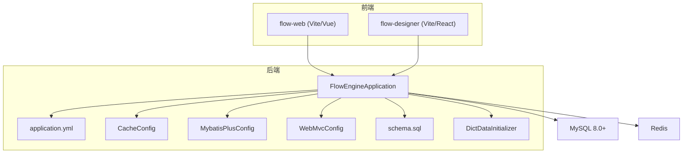
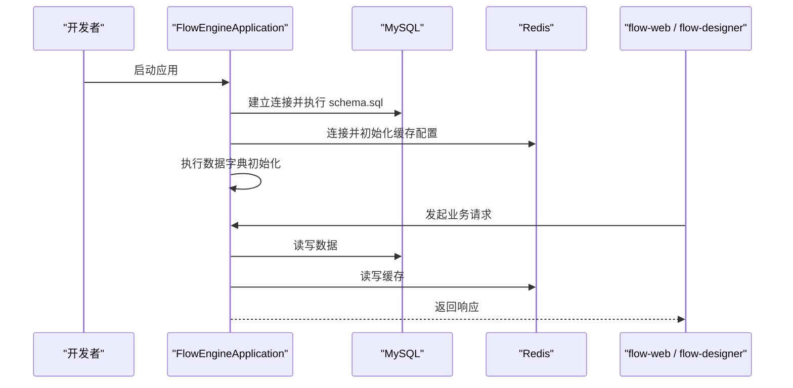
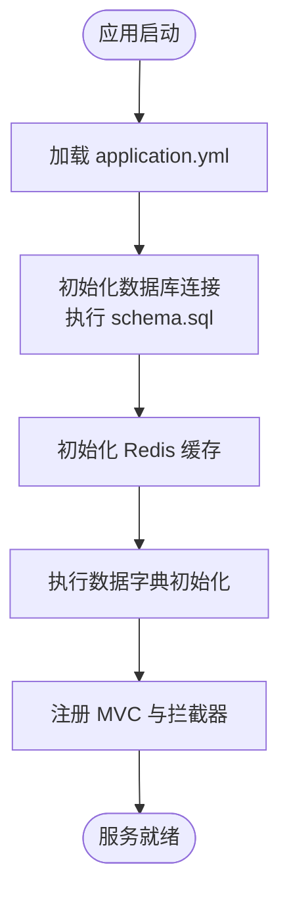
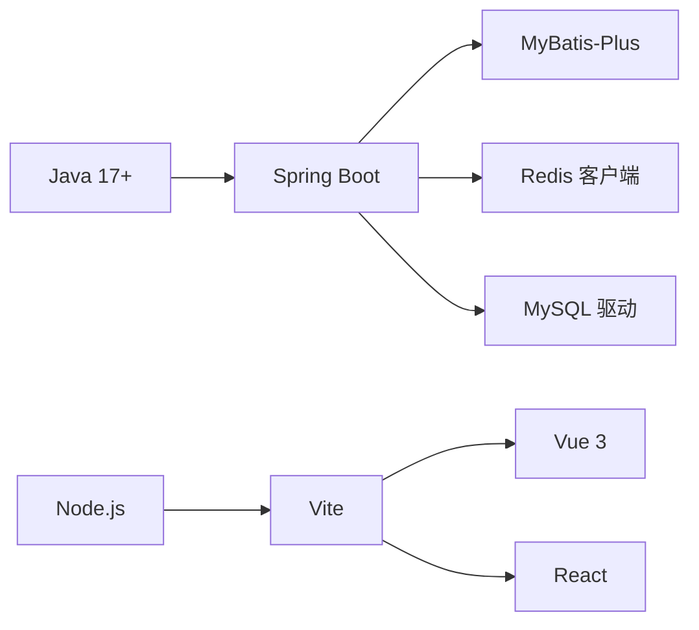

# 环境搭建配置

<cite>
**本文引用的文件**   
- [application.yml](file://flow-engine/src/main/resources/application.yml)
- [schema.sql](file://flow-engine/src/main/resources/db/schema.sql)
- [DictDataInitializer.java](file://flow-engine/src/main/java/com/flow/engine/config/DictDataInitializer.java)
- [CacheConfig.java](file://flow-engine/src/main/java/com/flow/engine/config/CacheConfig.java)
- [MybatisPlusConfig.java](file://flow-engine/src/main/java/com/flow/engine/config/MybatisPlusConfig.java)
- [WebMvcConfig.java](file://flow-engine/src/main/java/com/flow/engine/config/WebMvcConfig.java)
- [FlowEngineApplication.java](file://flow-engine/src/main/java/com/flow/engine/FlowEngineApplication.java)
- [pom.xml](file://flow-engine/pom.xml)
- [package.json](file://flow-web/package.json)
- [vite.config.js](file://flow-web/vite.config.js)
- [api.js](file://flow-designer/src/api.js)
- [vite.config.js](file://flow-designer/vite.config.js)
</cite>

## 目录
1. [简介](#简介)
2. [项目结构](#项目结构)
3. [核心组件](#核心组件)
4. [架构总览](#架构总览)
5. [详细组件分析](#详细组件分析)
6. [依赖分析](#依赖分析)
7. [性能考虑](#性能考虑)
8. [故障排查指南](#故障排查指南)
9. [结论](#结论)
10. [附录](#附录)

## 简介
本文件面向开发与生产环境的快速搭建，覆盖以下目标：
- 安装与基础配置 JDK 17+、MySQL 8.0+、Redis
- 数据库初始化（执行 schema.sql 与数据字典初始化）
- 应用配置文件 application.yml 的关键参数说明（数据库连接、缓存、日志等）
- 前后端启动步骤（Maven 构建、Node.js 依赖安装、开发服务器启动）
- 常见问题排查（端口冲突、权限问题、网络配置等）

## 项目结构
后端服务位于 flow-engine 模块，前端管理界面位于 flow-web，流程设计器位于 flow-designer。关键资源包括：
- 后端应用配置：application.yml
- 数据库脚本：db/schema.sql
- 数据字典初始化：config.DictDataInitializer
- 缓存与数据库相关配置类：config.CacheConfig、config.MybatisPlusConfig、config.WebMvcConfig
- 后端入口：FlowEngineApplication
- 前端工程：flow-web（Vite + Vue），flow-designer（Vite + React）

图表来源
- [FlowEngineApplication.java](file://flow-engine/src/main/java/com/flow/engine/FlowEngineApplication.java)
- [application.yml](file://flow-engine/src/main/resources/application.yml)
- [CacheConfig.java](file://flow-engine/src/main/java/com/flow/engine/config/CacheConfig.java)
- [MybatisPlusConfig.java](file://flow-engine/src/main/java/com/flow/engine/config/MybatisPlusConfig.java)
- [WebMvcConfig.java](file://flow-engine/src/main/java/com/flow/engine/config/WebMvcConfig.java)
- [schema.sql](file://flow-engine/src/main/resources/db/schema.sql)
- [DictDataInitializer.java](file://flow-engine/src/main/java/com/flow/engine/config/DictDataInitializer.java)
- [vite.config.js](file://flow-web/vite.config.js)
- [vite.config.js](file://flow-designer/vite.config.js)

章节来源
- [FlowEngineApplication.java](file://flow-engine/src/main/java/com/flow/engine/FlowEngineApplication.java)
- [application.yml](file://flow-engine/src/main/resources/application.yml)
- [schema.sql](file://flow-engine/src/main/resources/db/schema.sql)
- [DictDataInitializer.java](file://flow-engine/src/main/java/com/flow/engine/config/DictDataInitializer.java)
- [CacheConfig.java](file://flow-engine/src/main/java/com/flow/engine/config/CacheConfig.java)
- [MybatisPlusConfig.java](file://flow-engine/src/main/java/com/flow/engine/config/MybatisPlusConfig.java)
- [WebMvcConfig.java](file://flow-engine/src/main/java/com/flow/engine/config/WebMvcConfig.java)
- [vite.config.js](file://flow-web/vite.config.js)
- [vite.config.js](file://flow-designer/vite.config.js)

## 核心组件
- 应用主程序：负责启动 Spring Boot 应用、加载配置、注册 MVC 与拦截器、初始化数据字典等。
- 数据库访问：基于 MyBatis-Plus 的持久化层，通过配置类进行分页、逻辑删除等全局设置。
- 缓存：基于 Redis 的缓存配置，提供默认序列化策略与过期时间等。
- Web 配置：跨域、静态资源、请求头等通用配置。
- 数据初始化：在应用启动后执行数据字典初始化，确保系统运行所需的基础数据存在。

章节来源
- [FlowEngineApplication.java](file://flow-engine/src/main/java/com/flow/engine/FlowEngineApplication.java)
- [MybatisPlusConfig.java](file://flow-engine/src/main/java/com/flow/engine/config/MybatisPlusConfig.java)
- [CacheConfig.java](file://flow-engine/src/main/java/com/flow/engine/config/CacheConfig.java)
- [WebMvcConfig.java](file://flow-engine/src/main/java/com/flow/engine/config/WebMvcConfig.java)
- [DictDataInitializer.java](file://flow-engine/src/main/java/com/flow/engine/config/DictDataInitializer.java)

## 架构总览
后端采用 Spring Boot 微服务形态，对外暴露 REST API；使用 MySQL 作为持久化存储，Redis 作为缓存与会话/令牌等临时数据存储；前端管理端与设计器通过 Vite 开发服务器或打包产物访问后端接口。

图表来源
- [FlowEngineApplication.java](file://flow-engine/src/main/java/com/flow/engine/FlowEngineApplication.java)
- [schema.sql](file://flow-engine/src/main/resources/db/schema.sql)
- [DictDataInitializer.java](file://flow-engine/src/main/java/com/flow/engine/config/DictDataInitializer.java)
- [CacheConfig.java](file://flow-engine/src/main/java/com/flow/engine/config/CacheConfig.java)
- [vite.config.js](file://flow-web/vite.config.js)
- [vite.config.js](file://flow-designer/vite.config.js)

## 详细组件分析

### 数据库与数据初始化
- 数据库版本要求：MySQL 8.0+
- 初始化步骤：
  - 创建数据库实例与用户，授予必要权限
  - 执行 schema.sql 完成表结构与基础索引的创建
  - 启动应用后，由 DictDataInitializer 自动完成数据字典的初始化
- 建议：
  - 首次部署时先执行 schema.sql，再启动应用
  - 若需重置数据，可清空库后重新执行 schema.sql 与应用初始化

章节来源
- [schema.sql](file://flow-engine/src/main/resources/db/schema.sql)
- [DictDataInitializer.java](file://flow-engine/src/main/java/com/flow/engine/config/DictDataInitializer.java)

### 缓存配置（Redis）
- 缓存实现：基于 Redis
- 主要职责：
  - 连接池与超时配置
  - 序列化策略（如 JSON）
  - 默认键前缀与过期策略
- 建议：
  - 生产环境启用密码认证与 TLS
  - 合理设置 key 过期时间与内存淘汰策略

章节来源
- [CacheConfig.java](file://flow-engine/src/main/java/com/flow/engine/config/CacheConfig.java)

### 数据库访问配置（MyBatis-Plus）
- 主要职责：
  - 全局分页插件配置
  - 逻辑删除字段映射
  - 驼峰命名转换等
- 建议：
  - 根据业务需要调整分页大小与查询优化
  - 开启 SQL 日志便于开发调试

章节来源
- [MybatisPlusConfig.java](file://flow-engine/src/main/java/com/flow/engine/config/MybatisPlusConfig.java)

### Web 配置（跨域与静态资源）
- 主要职责：
  - 跨域白名单配置（允许前端开发服务器访问）
  - 静态资源映射与请求头处理
- 建议：
  - 生产环境严格限制跨域来源
  - 结合网关统一鉴权与限流

章节来源
- [WebMvcConfig.java](file://flow-engine/src/main/java/com/flow/engine/config/WebMvcConfig.java)

### 应用配置（application.yml）
- 关键配置项类别：
  - 服务器端口与上下文路径
  - 数据库连接（驱动、URL、用户名、密码、连接池参数）
  - Redis 连接（主机、端口、密码、数据库索引、超时、序列化）
  - 日志级别（根日志与包级日志）
  - 其他（如线程池、监控等）
- 建议：
  - 将敏感信息（数据库密码、Redis 密码）放入环境变量或密钥管理服务
  - 为不同环境准备多份配置并通过 profile 切换

章节来源
- [application.yml](file://flow-engine/src/main/resources/application.yml)

### 后端启动流程
- 启动方式：
  - 使用 IDE 直接运行 FlowEngineApplication
  - 或通过 Maven 命令构建并运行
- 启动顺序：
  - 加载 application.yml
  - 初始化数据库连接与 MyBatis-Plus
  - 初始化 Redis 缓存
  - 执行数据字典初始化
  - 注册 MVC 与拦截器，启动 HTTP 服务

图表来源
- [FlowEngineApplication.java](file://flow-engine/src/main/java/com/flow/engine/FlowEngineApplication.java)
- [application.yml](file://flow-engine/src/main/resources/application.yml)
- [schema.sql](file://flow-engine/src/main/resources/db/schema.sql)
- [DictDataInitializer.java](file://flow-engine/src/main/java/com/flow/engine/config/DictDataInitializer.java)

章节来源
- [FlowEngineApplication.java](file://flow-engine/src/main/java/com/flow/engine/FlowEngineApplication.java)
- [application.yml](file://flow-engine/src/main/resources/application.yml)
- [schema.sql](file://flow-engine/src/main/resources/db/schema.sql)
- [DictDataInitializer.java](file://flow-engine/src/main/java/com/flow/engine/config/DictDataInitializer.java)

### 前端项目启动（flow-web）
- 前置条件：Node.js 与 npm/yarn/pnpm 已安装
- 依赖安装：进入 flow-web 目录执行依赖安装
- 开发服务器启动：执行开发模式命令
- 构建产物：生产构建输出到 dist 目录，可由 Nginx 托管
- 代理配置：如需本地联调，可在 vite.config.js 中配置后端接口代理

章节来源
- [package.json](file://flow-web/package.json)
- [vite.config.js](file://flow-web/vite.config.js)

### 流程设计器启动（flow-designer）
- 前置条件：Node.js 与 npm/yarn/pnpm 已安装
- 依赖安装：进入 flow-designer 目录执行依赖安装
- 开发服务器启动：执行开发模式命令
- 后端接口地址：可在 src/api.js 或 vite.config.js 中配置后端地址或代理

章节来源
- [package.json](file://flow-designer/package.json)
- [vite.config.js](file://flow-designer/vite.config.js)
- [api.js](file://flow-designer/src/api.js)

## 依赖分析
- 后端依赖：
  - Java 17+
  - Spring Boot 生态（Web、MyBatis-Plus、Redis、AOP、Validation 等）
  - MySQL 驱动与连接池
  - Redis 客户端
- 前端依赖：
  - Node.js 运行时
  - Vite 构建工具
  - Vue 3 与 React（分别对应 flow-web 与 flow-designer）

图表来源
- [pom.xml](file://flow-engine/pom.xml)
- [package.json](file://flow-web/package.json)
- [package.json](file://flow-designer/package.json)

章节来源
- [pom.xml](file://flow-engine/pom.xml)
- [package.json](file://flow-web/package.json)
- [package.json](file://flow-designer/package.json)

## 性能考虑
- 数据库：
  - 合理设置连接池大小与超时
  - 对高频查询添加索引，避免全表扫描
  - 开启慢查询日志用于定位瓶颈
- 缓存：
  - 热点数据优先入缓存，设置合理的过期时间
  - 注意缓存穿透、击穿、雪崩防护
- Web：
  - 控制跨域范围，减少不必要的预检请求
  - 合理使用压缩与静态资源缓存

## 故障排查指南
- 端口冲突
  - 现象：应用无法启动或前端无法访问
  - 排查：检查 application.yml 中的服务端口与前端 dev server 端口是否被占用
  - 解决：修改端口或释放占用进程
- 数据库连接失败
  - 现象：启动时报连接错误
  - 排查：确认 MySQL 服务状态、账号密码、URL、字符集与权限
  - 解决：修正连接参数，确保 schema.sql 已成功执行
- Redis 连接失败
  - 现象：缓存相关功能异常
  - 排查：确认 Redis 服务状态、端口、密码与网络可达性
  - 解决：修正连接参数，必要时重启 Redis 并清理无效会话
- 跨域问题
  - 现象：浏览器控制台报 CORS 错误
  - 排查：检查 WebMvcConfig 的跨域白名单与前端请求来源
  - 解决：在开发环境放宽白名单，在生产环境严格限制来源
- 权限问题
  - 现象：读取/写入文件或目录失败
  - 排查：检查应用运行用户对日志目录、上传目录的读写权限
  - 解决：赋予相应权限或使用具备权限的用户运行服务
- 网络配置
  - 现象：容器/虚拟机间无法互通
  - 排查：检查防火墙与安全组规则、DNS 解析
  - 解决：放行必要端口，修正网络策略

章节来源
- [application.yml](file://flow-engine/src/main/resources/application.yml)
- [WebMvcConfig.java](file://flow-engine/src/main/java/com/flow/engine/config/WebMvcConfig.java)
- [CacheConfig.java](file://flow-engine/src/main/java/com/flow/engine/config/CacheConfig.java)
- [MybatisPlusConfig.java](file://flow-engine/src/main/java/com/flow/engine/config/MybatisPlusConfig.java)

## 结论
按照本文档的步骤完成 JDK、MySQL、Redis 的安装与基础配置，执行数据库初始化脚本并启动后端服务，随后安装前端依赖并启动开发服务器，即可在本地完成开发与联调。生产环境建议遵循最小权限原则、启用安全加固与监控告警，并对关键配置进行集中化管理。

## 附录
- 常用命令参考（以 npm 为例）：
  - 安装依赖：在对应前端目录下执行依赖安装命令
  - 启动开发服务器：在对应前端目录下执行开发模式命令
  - 构建生产包：在对应前端目录下执行构建命令
- 环境变量与密钥管理：
  - 建议将数据库与 Redis 的敏感信息通过环境变量注入，避免硬编码