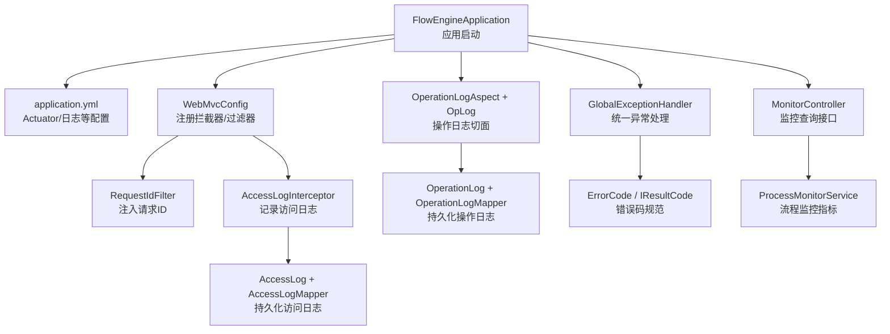
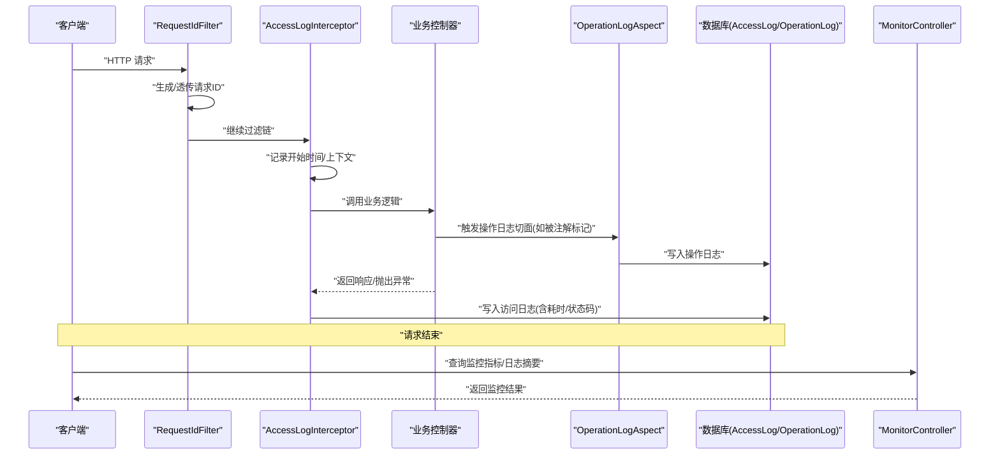
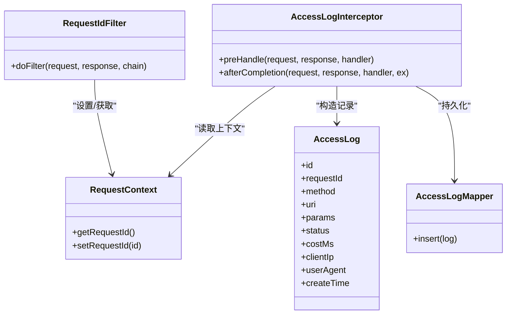
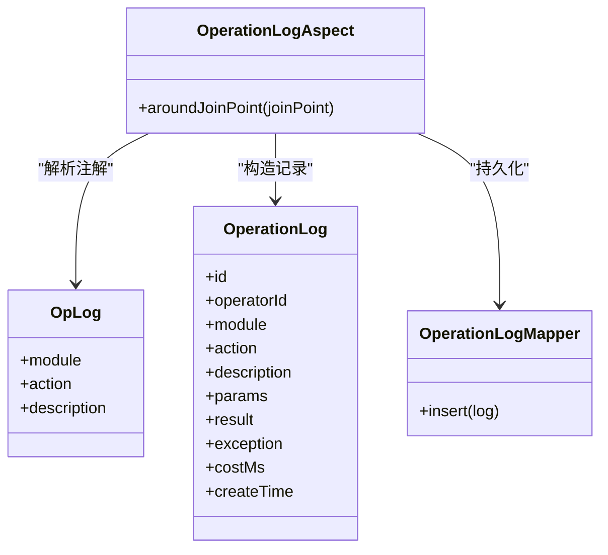
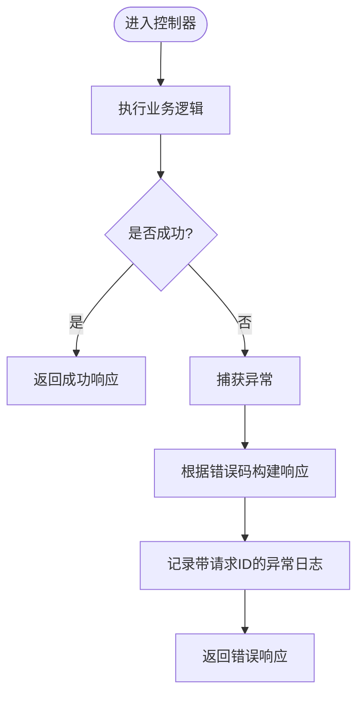
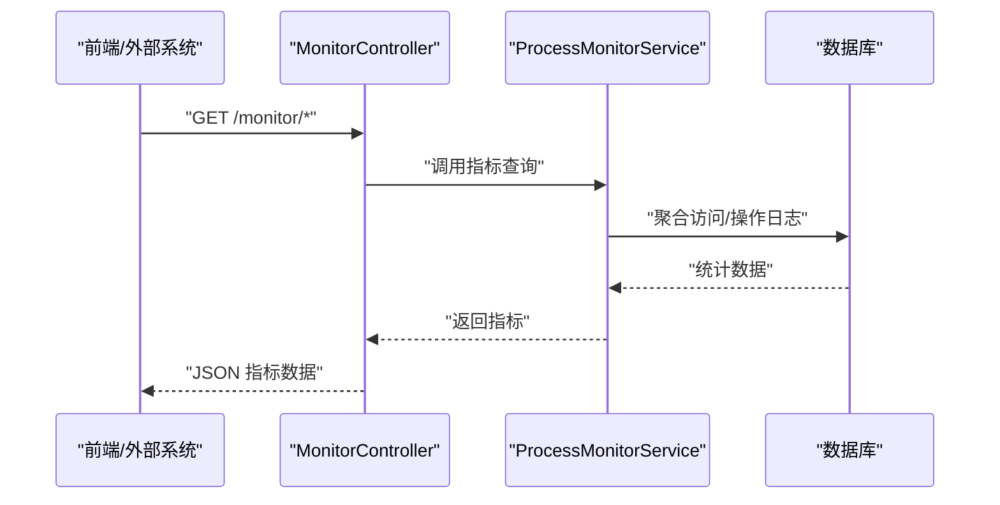
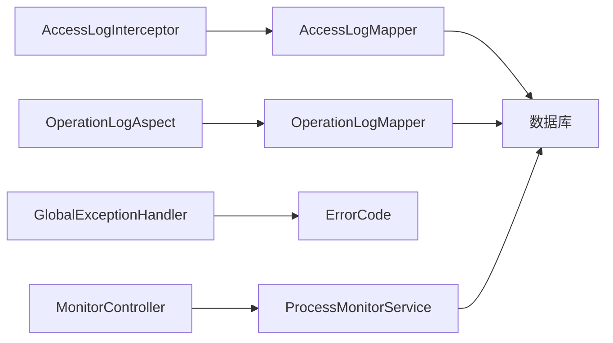

# 监控告警

<cite>
**本文引用的文件**   
- [application.yml](file://flow-engine/src/main/resources/application.yml)
- [FlowEngineApplication.java](file://flow-engine/src/main/java/com/flow/engine/FlowEngineApplication.java)
- [WebMvcConfig.java](file://flow-engine/src/main/java/com/flow/engine/config/WebMvcConfig.java)
- [RequestContext.java](file://flow-engine/src/main/java/com/flow/engine/common/RequestContext.java)
- [RequestIdFilter.java](file://flow-engine/src/main/java/com/flow/engine/common/RequestIdFilter.java)
- [AccessLogInterceptor.java](file://flow-engine/src/main/java/com/flow/engine/interceptor/AccessLogInterceptor.java)
- [AccessLog.java](file://flow-engine/src/main/java/com/flow/engine/entity/AccessLog.java)
- [AccessLogMapper.java](file://flow-engine/src/main/java/com/flow/engine/mapper/AccessLogMapper.java)
- [OperationLogAspect.java](file://flow-engine/src/main/java/com/flow/engine/aspect/OperationLogAspect.java)
- [OpLog.java](file://flow-engine/src/main/java/com/flow/engine/annotation/OpLog.java)
- [OperationLog.java](file://flow-engine/src/main/java/com/flow/engine/entity/OperationLog.java)
- [OperationLogMapper.java](file://flow-engine/src/main/java/com/flow/engine/mapper/OperationLogMapper.java)
- [GlobalExceptionHandler.java](file://flow-engine/src/main/java/com/flow/engine/common/GlobalExceptionHandler.java)
- [ErrorCode.java](file://flow-engine/src/main/java/com/flow/engine/common/ErrorCode.java)
- [IResultCode.java](file://flow-engine/src/main/java/com/flow/engine/common/IResultCode.java)
- [MonitorController.java](file://flow-engine/src/main/java/com/flow/engine/controllers/MonitorController.java)
- [ProcessMonitorService.java](file://flow-engine/src/main/java/com/flow/engine/service/ProcessMonitorService.java)
- [LogController.java](file://flow-engine/src/main/java/com/flow/engine/controllers/LogController.java)
- [schema.sql](file://flow-engine/src/main/resources/db/schema.sql)
</cite>

## 目录
1. [简介](#简介)
2. [项目结构](#项目结构)
3. [核心组件](#核心组件)
4. [架构总览](#架构总览)
5. [详细组件分析](#详细组件分析)
6. [依赖关系分析](#依赖关系分析)
7. [性能考虑](#性能考虑)
8. [故障排查指南](#故障排查指南)
9. [结论](#结论)
10. [附录](#附录)

## 简介
本指南面向“监控告警”能力，覆盖以下目标：
- 应用层监控：启用并安全配置 Spring Boot Actuator 端点。
- 日志采集与分析：操作日志与访问日志的收集、标准化格式与轮转策略。
- 指标与可视化：集成 Prometheus 与 Grafana，采集自定义指标并构建仪表板。
- 告警规则：针对应用异常、性能瓶颈与业务异常的告警通知。
- ELK Stack 方案：日志聚合、搜索与报表生成。
- 备份与长期存储：监控数据的备份与归档策略。

## 项目结构
后端工程 flow-engine 提供监控与日志相关能力，关键位置如下：
- 应用入口与基础配置：FlowEngineApplication、application.yml
- Web 层拦截与上下文：WebMvcConfig、AccessLogInterceptor、RequestContext、RequestIdFilter
- 日志实体与持久化：AccessLog、OperationLog 及其 Mapper
- 切面与注解：OpLog、OperationLogAspect
- 全局异常处理：GlobalExceptionHandler、ErrorCode、IResultCode
- 监控接口与指标服务：MonitorController、ProcessMonitorService
- 数据库初始化：schema.sql

图表来源
- [FlowEngineApplication.java](file://flow-engine/src/main/java/com/flow/engine/FlowEngineApplication.java)
- [application.yml](file://flow-engine/src/main/resources/application.yml)
- [WebMvcConfig.java](file://flow-engine/src/main/java/com/flow/engine/config/WebMvcConfig.java)
- [RequestIdFilter.java](file://flow-engine/src/main/java/com/flow/engine/common/RequestIdFilter.java)
- [AccessLogInterceptor.java](file://flow-engine/src/main/java/com/flow/engine/interceptor/AccessLogInterceptor.java)
- [AccessLog.java](file://flow-engine/src/main/java/com/flow/engine/entity/AccessLog.java)
- [AccessLogMapper.java](file://flow-engine/src/main/java/com/flow/engine/mapper/AccessLogMapper.java)
- [OperationLogAspect.java](file://flow-engine/src/main/java/com/flow/engine/aspect/OperationLogAspect.java)
- [OpLog.java](file://flow-engine/src/main/java/com/flow/engine/annotation/OpLog.java)
- [OperationLog.java](file://flow-engine/src/main/java/com/flow/engine/entity/OperationLog.java)
- [OperationLogMapper.java](file://flow-engine/src/main/java/com/flow/engine/mapper/OperationLogMapper.java)
- [GlobalExceptionHandler.java](file://flow-engine/src/main/java/com/flow/engine/common/GlobalExceptionHandler.java)
- [ErrorCode.java](file://flow-engine/src/main/java/com/flow/engine/common/ErrorCode.java)
- [IResultCode.java](file://flow-engine/src/main/java/com/flow/engine/common/IResultCode.java)
- [MonitorController.java](file://flow-engine/src/main/java/com/flow/engine/controllers/MonitorController.java)
- [ProcessMonitorService.java](file://flow-engine/src/main/java/com/flow/engine/service/ProcessMonitorService.java)

章节来源
- [FlowEngineApplication.java](file://flow-engine/src/main/java/com/flow/engine/FlowEngineApplication.java)
- [application.yml](file://flow-engine/src/main/resources/application.yml)
- [WebMvcConfig.java](file://flow-engine/src/main/java/com/flow/engine/config/WebMvcConfig.java)
- [AccessLogInterceptor.java](file://flow-engine/src/main/java/com/flow/engine/interceptor/AccessLogInterceptor.java)
- [OperationLogAspect.java](file://flow-engine/src/main/java/com/flow/engine/aspect/OperationLogAspect.java)
- [GlobalExceptionHandler.java](file://flow-engine/src/main/java/com/flow/engine/common/GlobalExceptionHandler.java)
- [MonitorController.java](file://flow-engine/src/main/java/com/flow/engine/controllers/MonitorController.java)
- [ProcessMonitorService.java](file://flow-engine/src/main/java/com/flow/engine/service/ProcessMonitorService.java)
- [schema.sql](file://flow-engine/src/main/resources/db/schema.sql)

## 核心组件
- 访问日志链路
  - 通过过滤器注入唯一请求标识，便于跨组件追踪。
  - 通过拦截器在请求进入与返回时采集关键信息（方法、路径、耗时、状态码、客户端信息等），并持久化到数据库。
- 操作日志切面
  - 基于注解标记需要审计的业务方法，切面自动捕获入参、出参与异常，落库为结构化操作日志。
- 全局异常处理
  - 统一捕获异常，转换为标准响应体，便于前端展示与日志关联。
- 监控接口
  - 暴露流程运行相关的统计与详情查询接口，供前端或外部系统消费。

章节来源
- [RequestIdFilter.java](file://flow-engine/src/main/java/com/flow/engine/common/RequestIdFilter.java)
- [AccessLogInterceptor.java](file://flow-engine/src/main/java/com/flow/engine/interceptor/AccessLogInterceptor.java)
- [AccessLog.java](file://flow-engine/src/main/java/com/flow/engine/entity/AccessLog.java)
- [AccessLogMapper.java](file://flow-engine/src/main/java/com/flow/engine/mapper/AccessLogMapper.java)
- [OpLog.java](file://flow-engine/src/main/java/com/flow/engine/annotation/OpLog.java)
- [OperationLogAspect.java](file://flow-engine/src/main/java/com/flow/engine/aspect/OperationLogAspect.java)
- [OperationLog.java](file://flow-engine/src/main/java/com/flow/engine/entity/OperationLog.java)
- [OperationLogMapper.java](file://flow-engine/src/main/java/com/flow/engine/mapper/OperationLogMapper.java)
- [GlobalExceptionHandler.java](file://flow-engine/src/main/java/com/flow/engine/common/GlobalExceptionHandler.java)
- [ErrorCode.java](file://flow-engine/src/main/java/com/flow/engine/common/ErrorCode.java)
- [IResultCode.java](file://flow-engine/src/main/java/com/flow/engine/common/IResultCode.java)
- [MonitorController.java](file://flow-engine/src/main/java/com/flow/engine/controllers/MonitorController.java)
- [ProcessMonitorService.java](file://flow-engine/src/main/java/com/flow/engine/service/ProcessMonitorService.java)

## 架构总览
下图展示了从请求进入到日志落库、异常处理与监控查询的整体数据流。

图表来源
- [RequestIdFilter.java](file://flow-engine/src/main/java/com/flow/engine/common/RequestIdFilter.java)
- [AccessLogInterceptor.java](file://flow-engine/src/main/java/com/flow/engine/interceptor/AccessLogInterceptor.java)
- [OperationLogAspect.java](file://flow-engine/src/main/java/com/flow/engine/aspect/OperationLogAspect.java)
- [AccessLog.java](file://flow-engine/src/main/java/com/flow/engine/entity/AccessLog.java)
- [OperationLog.java](file://flow-engine/src/main/java/com/flow/engine/entity/OperationLog.java)
- [MonitorController.java](file://flow-engine/src/main/java/com/flow/engine/controllers/MonitorController.java)

## 详细组件分析

### 访问日志组件
- 职责
  - 为每个请求分配唯一 ID，贯穿整个调用链。
  - 在拦截器中采集请求元数据与响应结果，计算耗时，统一落库。
- 关键点
  - 请求 ID 由过滤器注入并在上下文中传递。
  - 拦截器需保证异常路径也能正确记录状态码与耗时。
  - 建议对大字段进行脱敏与长度限制，避免影响性能与存储。

图表来源
- [RequestIdFilter.java](file://flow-engine/src/main/java/com/flow/engine/common/RequestIdFilter.java)
- [RequestContext.java](file://flow-engine/src/main/java/com/flow/engine/common/RequestContext.java)
- [AccessLogInterceptor.java](file://flow-engine/src/main/java/com/flow/engine/interceptor/AccessLogInterceptor.java)
- [AccessLog.java](file://flow-engine/src/main/java/com/flow/engine/entity/AccessLog.java)
- [AccessLogMapper.java](file://flow-engine/src/main/java/com/flow/engine/mapper/AccessLogMapper.java)

章节来源
- [RequestIdFilter.java](file://flow-engine/src/main/java/com/flow/engine/common/RequestIdFilter.java)
- [RequestContext.java](file://flow-engine/src/main/java/com/flow/engine/common/RequestContext.java)
- [AccessLogInterceptor.java](file://flow-engine/src/main/java/com/flow/engine/interceptor/AccessLogInterceptor.java)
- [AccessLog.java](file://flow-engine/src/main/java/com/flow/engine/entity/AccessLog.java)
- [AccessLogMapper.java](file://flow-engine/src/main/java/com/flow/engine/mapper/AccessLogMapper.java)

### 操作日志组件
- 职责
  - 使用注解标注需要审计的方法，切面自动记录入参、返回值、执行时间与异常堆栈摘要。
- 关键点
  - 注解可携带模块、动作、描述等元数据，便于检索与报表。
  - 切面应控制日志大小与敏感信息脱敏，避免阻塞主流程。

图表来源
- [OpLog.java](file://flow-engine/src/main/java/com/flow/engine/annotation/OpLog.java)
- [OperationLogAspect.java](file://flow-engine/src/main/java/com/flow/engine/aspect/OperationLogAspect.java)
- [OperationLog.java](file://flow-engine/src/main/java/com/flow/engine/entity/OperationLog.java)
- [OperationLogMapper.java](file://flow-engine/src/main/java/com/flow/engine/mapper/OperationLogMapper.java)

章节来源
- [OpLog.java](file://flow-engine/src/main/java/com/flow/engine/annotation/OpLog.java)
- [OperationLogAspect.java](file://flow-engine/src/main/java/com/flow/engine/aspect/OperationLogAspect.java)
- [OperationLog.java](file://flow-engine/src/main/java/com/flow/engine/entity/OperationLog.java)
- [OperationLogMapper.java](file://flow-engine/src/main/java/com/flow/engine/mapper/OperationLogMapper.java)

### 全局异常处理
- 职责
  - 统一捕获未处理异常，转换为标准响应体，附带错误码与消息，便于前端展示与日志关联。
- 关键点
  - 结合错误码枚举，确保错误语义一致。
  - 异常日志需包含请求上下文（如请求 ID）以便定位。

图表来源
- [GlobalExceptionHandler.java](file://flow-engine/src/main/java/com/flow/engine/common/GlobalExceptionHandler.java)
- [ErrorCode.java](file://flow-engine/src/main/java/com/flow/engine/common/ErrorCode.java)
- [IResultCode.java](file://flow-engine/src/main/java/com/flow/engine/common/IResultCode.java)

章节来源
- [GlobalExceptionHandler.java](file://flow-engine/src/main/java/com/flow/engine/common/GlobalExceptionHandler.java)
- [ErrorCode.java](file://flow-engine/src/main/java/com/flow/engine/common/ErrorCode.java)
- [IResultCode.java](file://flow-engine/src/main/java/com/flow/engine/common/IResultCode.java)

### 监控接口与指标服务
- 职责
  - 提供流程运行状态的查询接口，支撑前端监控页面与外部系统集成。
- 关键点
  - 接口应分页与条件筛选，避免一次性拉取大量数据。
  - 指标服务内部可复用访问/操作日志表进行聚合统计。

图表来源
- [MonitorController.java](file://flow-engine/src/main/java/com/flow/engine/controllers/MonitorController.java)
- [ProcessMonitorService.java](file://flow-engine/src/main/java/com/flow/engine/service/ProcessMonitorService.java)

章节来源
- [MonitorController.java](file://flow-engine/src/main/java/com/flow/engine/controllers/MonitorController.java)
- [ProcessMonitorService.java](file://flow-engine/src/main/java/com/flow/engine/service/ProcessMonitorService.java)

## 依赖关系分析
- 组件耦合
  - 访问日志与操作日志均依赖数据库持久化，建议在高频场景下采用异步写入或批量写入以降低延迟。
  - 全局异常处理与错误码体系强耦合，新增错误类型需同步完善错误码定义。
- 外部依赖
  - 若引入 Spring Boot Actuator，需关注其端点的安全暴露与最小权限原则。
  - 若引入 Micrometer/Prometheus，需确保指标命名规范与采样策略合理。

图表来源
- [AccessLogInterceptor.java](file://flow-engine/src/main/java/com/flow/engine/interceptor/AccessLogInterceptor.java)
- [AccessLogMapper.java](file://flow-engine/src/main/java/com/flow/engine/mapper/AccessLogMapper.java)
- [OperationLogAspect.java](file://flow-engine/src/main/java/com/flow/engine/aspect/OperationLogAspect.java)
- [OperationLogMapper.java](file://flow-engine/src/main/java/com/flow/engine/mapper/OperationLogMapper.java)
- [GlobalExceptionHandler.java](file://flow-engine/src/main/java/com/flow/engine/common/GlobalExceptionHandler.java)
- [ErrorCode.java](file://flow-engine/src/main/java/com/flow/engine/common/ErrorCode.java)
- [MonitorController.java](file://flow-engine/src/main/java/com/flow/engine/controllers/MonitorController.java)
- [ProcessMonitorService.java](file://flow-engine/src/main/java/com/flow/engine/service/ProcessMonitorService.java)

章节来源
- [AccessLogInterceptor.java](file://flow-engine/src/main/java/com/flow/engine/interceptor/AccessLogInterceptor.java)
- [AccessLogMapper.java](file://flow-engine/src/main/java/com/flow/engine/mapper/AccessLogMapper.java)
- [OperationLogAspect.java](file://flow-engine/src/main/java/com/flow/engine/aspect/OperationLogAspect.java)
- [OperationLogMapper.java](file://flow-engine/src/main/java/com/flow/engine/mapper/OperationLogMapper.java)
- [GlobalExceptionHandler.java](file://flow-engine/src/main/java/com/flow/engine/common/GlobalExceptionHandler.java)
- [ErrorCode.java](file://flow-engine/src/main/java/com/flow/engine/common/ErrorCode.java)
- [MonitorController.java](file://flow-engine/src/main/java/com/flow/engine/controllers/MonitorController.java)
- [ProcessMonitorService.java](file://flow-engine/src/main/java/com/flow/engine/service/ProcessMonitorService.java)

## 性能考虑
- 日志写入
  - 访问日志与操作日志在高并发下可能成为瓶颈，建议：
    - 使用异步队列缓冲写入，降低主线程开销。
    - 批量插入与分表/分区策略，按时间维度归档历史数据。
    - 对大字段（参数、结果、异常堆栈）进行截断与脱敏。
- 指标采集
  - 自定义指标应避免高基数标签，防止时序爆炸。
  - 合理设置采样率与刷新间隔，减少 GC 与序列化压力。
- 监控接口
  - 对监控查询接口增加缓存与分页，避免全表扫描。
  - 复杂聚合尽量在数据库侧完成，减少应用层计算。

[本节为通用指导，不直接分析具体文件]

## 故障排查指南
- 快速定位
  - 通过请求 ID 串联访问日志与操作日志，快速还原调用链。
  - 利用全局异常处理返回的错误码与消息，结合日志中的堆栈摘要定位问题。
- 常见问题
  - 日志缺失：检查过滤器与拦截器是否生效；确认数据库连接与表结构初始化。
  - 指标异常：检查 Actuator/Micrometer 配置与端点暴露范围；核对指标命名与标签。
  - 告警风暴：优化阈值与去重策略，避免误报与抖动。

章节来源
- [RequestIdFilter.java](file://flow-engine/src/main/java/com/flow/engine/common/RequestIdFilter.java)
- [AccessLogInterceptor.java](file://flow-engine/src/main/java/com/flow/engine/interceptor/AccessLogInterceptor.java)
- [OperationLogAspect.java](file://flow-engine/src/main/java/com/flow/engine/aspect/OperationLogAspect.java)
- [GlobalExceptionHandler.java](file://flow-engine/src/main/java/com/flow/engine/common/GlobalExceptionHandler.java)
- [ErrorCode.java](file://flow-engine/src/main/java/com/flow/engine/common/ErrorCode.java)
- [schema.sql](file://flow-engine/src/main/resources/db/schema.sql)

## 结论
本项目已具备访问日志、操作日志、统一异常处理与基础监控接口的能力。在此基础上，建议逐步完善：
- 启用并安全配置 Actuator 端点，仅暴露必要健康与指标端点。
- 接入 Prometheus/Grafana，采集 JVM、HTTP、业务自定义指标，构建可视化仪表板。
- 建立告警规则，覆盖异常、性能与业务异常，实现及时通知。
- 引入 ELK 进行日志聚合、检索与报表，配合备份与归档策略保障长期可用。

[本节为总结性内容，不直接分析具体文件]

## 附录

### 一、Spring Boot Actuator 启用与安全配置
- 启用要点
  - 在应用配置中开启必要的健康检查与指标端点。
  - 将管理端口与应用端口分离，避免对外暴露管理端点。
- 安全建议
  - 仅允许内网或受信任 IP 访问管理端点。
  - 为管理端点启用认证与鉴权，最小化暴露面。
- 参考位置
  - 应用配置入口与 Actuator 相关配置项位于应用配置文件。
  - 应用启动类用于加载配置与组件扫描。

章节来源
- [application.yml](file://flow-engine/src/main/resources/application.yml)
- [FlowEngineApplication.java](file://flow-engine/src/main/java/com/flow/engine/FlowEngineApplication.java)

### 二、访问日志与操作日志：格式与轮转
- 访问日志
  - 关键字段：请求 ID、方法、URI、参数、状态码、耗时、客户端 IP、User-Agent、时间戳。
  - 建议：统一 JSON 格式，便于后续聚合与检索；对敏感字段脱敏。
- 操作日志
  - 关键字段：操作人、模块、动作、描述、入参、结果、异常摘要、耗时、时间戳。
  - 建议：注解驱动，便于声明式审计；对大对象进行裁剪。
- 轮转策略
  - 按天/周滚动归档，保留周期按合规要求设定。
  - 冷热分层：热数据在线查询，冷数据归档至对象存储或离线库。
- 参考位置
  - 访问日志拦截器与实体映射。
  - 操作日志切面与实体映射。

章节来源
- [AccessLogInterceptor.java](file://flow-engine/src/main/java/com/flow/engine/interceptor/AccessLogInterceptor.java)
- [AccessLog.java](file://flow-engine/src/main/java/com/flow/engine/entity/AccessLog.java)
- [AccessLogMapper.java](file://flow-engine/src/main/java/com/flow/engine/mapper/AccessLogMapper.java)
- [OperationLogAspect.java](file://flow-engine/src/main/java/com/flow/engine/aspect/OperationLogAspect.java)
- [OperationLog.java](file://flow-engine/src/main/java/com/flow/engine/entity/OperationLog.java)
- [OperationLogMapper.java](file://flow-engine/src/main/java/com/flow/engine/mapper/OperationLogMapper.java)

### 三、Prometheus 与 Grafana 集成
- 指标采集
  - 使用 Micrometer 暴露默认 JVM、HTTP、系统指标。
  - 自定义指标：围绕流程引擎的关键步骤（节点耗时、任务积压、失败率）埋点。
- 抓取与存储
  - Prometheus 定期抓取应用 /actuator/prometheus 端点。
  - 配置合理的抓取间隔与超时，避免对应用造成压力。
- 可视化
  - 在 Grafana 中导入/创建仪表板，展示 QPS、延迟分布、错误率、资源使用率与业务指标。
- 参考位置
  - 监控接口与指标服务可用于补充业务指标视图。

章节来源
- [MonitorController.java](file://flow-engine/src/main/java/com/flow/engine/controllers/MonitorController.java)
- [ProcessMonitorService.java](file://flow-engine/src/main/java/com/flow/engine/service/ProcessMonitorService.java)

### 四、告警规则设计
- 应用异常
  - 基于错误码与异常日志，监控异常率突增、特定错误码占比过高。
- 性能瓶颈
  - 监控接口 P95/P99 延迟、CPU/内存使用率、GC 频率、数据库慢查询。
- 业务异常
  - 监控流程实例失败率、任务积压、审批超时、节点执行异常。
- 通知渠道
  - 支持邮件、企业微信、钉钉、短信等多通道，分级告警与降噪。

[本节为通用指导，不直接分析具体文件]

### 五、ELK Stack 日志分析方案
- 采集
  - 应用输出结构化日志（JSON），Filebeat 采集后发送至 Kafka 或直接发送至 Logstash。
- 处理
  - Logstash 进行解析、清洗、脱敏与富化（如添加环境、主机信息）。
- 存储与检索
  - Elasticsearch 索引按日期/模块拆分，设置合适的生命周期策略（ILM）。
- 可视化
  - Kibana 构建日志看板、错误热点、Top 慢接口、用户行为分析等报表。
- 参考位置
  - 访问/操作日志实体与持久化方式可作为结构化字段设计的依据。

章节来源
- [AccessLog.java](file://flow-engine/src/main/java/com/flow/engine/entity/AccessLog.java)
- [OperationLog.java](file://flow-engine/src/main/java/com/flow/engine/entity/OperationLog.java)

### 六、监控数据备份与长期存储
- 备份策略
  - 数据库级定时快照与增量备份，异地容灾。
  - 日志归档：冷热分层，冷数据压缩与加密。
- 长期存储
  - 历史指标与日志迁移至对象存储或低成本存储介质。
  - 制定保留策略与清理任务，控制成本与合规要求。
- 参考位置
  - 数据库初始化脚本定义了日志与监控相关表结构。

章节来源
- [schema.sql](file://flow-engine/src/main/resources/db/schema.sql)