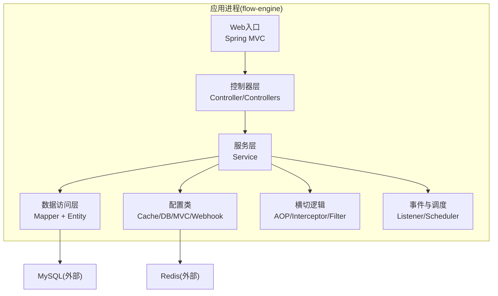
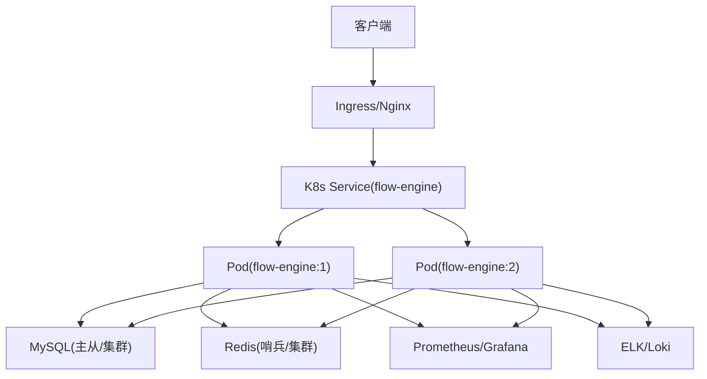
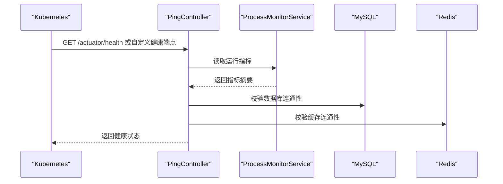
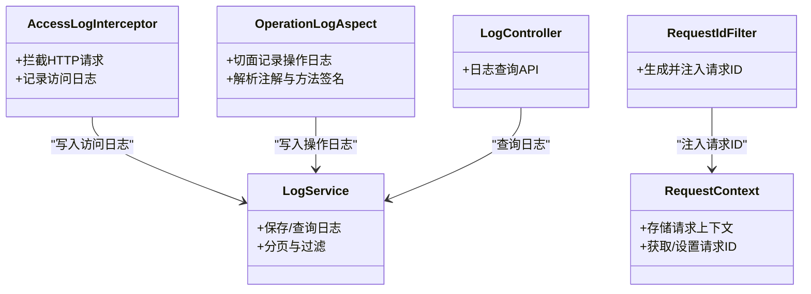
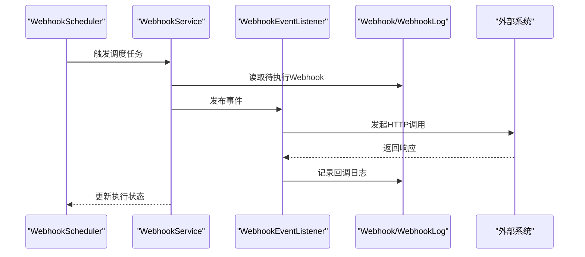
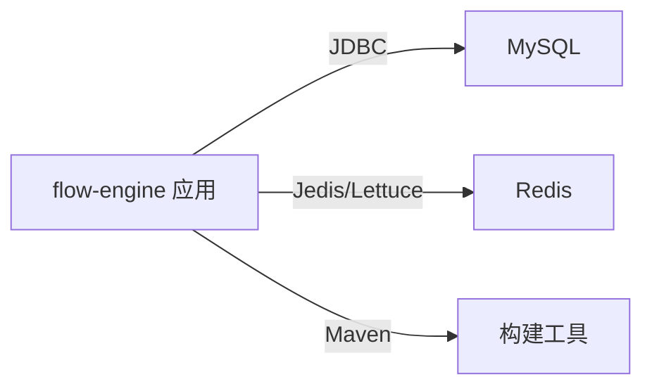

# 部署运维指南

<cite>
**本文引用的文件**   
- [flow-engine/src/main/resources/application.yml](file://flow-engine/src/main/resources/application.yml)
- [.gitignore](file://.gitignore)
- [flow-engine/.gitignore](file://flow-engine/.gitignore)
- [flow-engine/src/main/java/com/flow/engine/config/CacheConfig.java](file://flow-engine/src/main/java/com/flow/engine/config/CacheConfig.java)
- [flow-engine/src/main/java/com/flow/engine/config/MybatisPlusConfig.java](file://flow-engine/src/main/java/com/flow/engine/config/MybatisPlusConfig.java)
- [flow-engine/src/main/java/com/flow/engine/config/WebMvcConfig.java](file://flow-engine/src/main/java/com/flow/engine/config/WebMvcConfig.java)
- [flow-engine/src/main/java/com/flow/engine/common/GlobalExceptionHandler.java](file://flow-engine/src/main/java/com/flow/engine/common/GlobalExceptionHandler.java)
- [flow-engine/src/main/java/com/flow/engine/common/RequestContext.java](file://flow-engine/src/main/java/com/flow/engine/common/RequestContext.java)
- [flow-engine/src/main/java/com/flow/engine/common/RequestIdFilter.java](file://flow-engine/src/main/java/com/flow/engine/common/RequestIdFilter.java)
- [flow-engine/src/main/java/com/flow/engine/controller/PingController.java](file://flow-engine/src/main/java/com/flow/engine/controller/PingController.java)
- [flow-engine/src/main/java/com/flow/engine/service/ProcessMonitorService.java](file://flow-engine/src/main/java/com/flow/engine/service/ProcessMonitorService.java)
- [flow-engine/src/main/java/com/flow/engine/controllers/MonitorController.java](file://flow-engine/src/main/java/com/flow/engine/controllers/MonitorController.java)
- [flow-engine/src/main/java/com/flow/engine/aspect/OperationLogAspect.java](file://flow-engine/src/main/java/com/flow/engine/aspect/OperationLogAspect.java)
- [flow-engine/src/main/java/com/flow/engine/interceptor/AccessLogInterceptor.java](file://flow-engine/src/main/java/com/flow/engine/interceptor/AccessLogInterceptor.java)
- [flow-engine/src/main/java/com/flow/engine/entity/AccessLog.java](file://flow-engine/src/main/java/com/flow/engine/entity/AccessLog.java)
- [flow-engine/src/main/java/com/flow/engine/mapper/AccessLogMapper.java](file://flow-engine/src/main/java/com/flow/engine/mapper/AccessLogMapper.java)
- [flow-engine/src/main/java/com/flow/engine/service/LogService.java](file://flow-engine/src/main/java/com/flow/engine/service/LogService.java)
- [flow-engine/src/main/java/com/flow/engine/controllers/LogController.java](file://flow-engine/src/main/java/com/flow/engine/controllers/LogController.java)
- [flow-engine/src/main/java/com/flow/engine/service/WebhookScheduler.java](file://flow-engine/src/main/java/com/flow/engine/service/WebhookScheduler.java)
- [flow-engine/src/main/java/com/flow/engine/service/WebhookService.java](file://flow-engine/src/main/java/com/flow/engine/service/WebhookService.java)
- [flow-engine/src/main/java/com/flow/engine/entity/Webhook.java](file://flow-engine/src/main/java/com/flow/engine/entity/Webhook.java)
- [flow-engine/src/main/java/com/flow/engine/entity/WebhookLog.java](file://flow-engine/src/main/java/com/flow/engine/entity/WebhookLog.java)
- [flow-engine/src/main/java/com/flow/engine/mapper/WebhookLogMapper.java](file://flow-engine/src/main/java/com/flow/engine/mapper/WebhookLogMapper.java)
- [flow-engine/src/main/java/com/flow/engine/mapper/WebhookMapper.java](file://flow-engine/src/main/java/com/flow/engine/mapper/WebhookMapper.java)
- [flow-engine/src/main/java/com/flow/engine/listener/WebhookEventListener.java](file://flow-engine/src/main/java/com/flow/engine/listener/WebhookEventListener.java)
- [flow-engine/src/main/java/com/flow/engine/config/WebhookConfig.java](file://flow-engine/src/main/java/com/flow/engine/config/WebhookConfig.java)
- [flow-engine/src/main/resources/db/schema.sql](file://flow-engine/src/main/resources/db/schema.sql)
- [flow-engine/src/main/resources/db/data.sql](file://flow-engine/src/main/resources/db/data.sql)
- [flow-engine/pom.xml](file://flow-engine/pom.xml)
</cite>

## 更新摘要
**变更内容**   
- 更新了应用配置文件说明，反映最新的配置要求
- 完善了Git忽略规则说明，包含新的忽略模式
- 增强了环境配置管理章节，提供更详细的环境差异处理指导
- 更新了数据初始化脚本的自动加载机制说明

## 目录
1. [简介](#简介)
2. [项目结构](#项目结构)
3. [核心组件](#核心组件)
4. [架构总览](#架构总览)
5. [详细组件分析](#详细组件分析)
6. [依赖关系分析](#依赖关系分析)
7. [性能考虑](#性能考虑)
8. [故障排查手册](#故障排查手册)
9. [结论](#结论)
10. [附录](#附录)

## 简介
本指南面向生产环境的部署与运维，覆盖依赖服务安装配置、应用配置管理、容器化与编排、负载均衡与高可用、性能调优、监控告警与日志收集、备份恢复与灾难恢复等主题。文档内容严格基于仓库中的后端工程 flow-engine 的源码与资源文件进行提炼与总结，确保可落地执行。

## 项目结构
后端服务位于 flow-engine 模块，采用 Spring Boot 分层架构：
- 配置层：application.yml 及若干配置类（缓存、数据库、Web MVC、Webhook）
- 控制器层：业务 API 与监控、日志、系统管理等接口
- 服务层：流程引擎、任务、权限、审计、Webhook 调度与服务
- 数据访问层：MyBatis-Plus Mapper 与实体模型
- 横切关注点：全局异常处理、请求上下文、请求ID过滤器、操作日志AOP、访问日志拦截器

图表来源
- [flow-engine/src/main/resources/application.yml](file://flow-engine/src/main/resources/application.yml)
- [flow-engine/src/main/java/com/flow/engine/config/CacheConfig.java](file://flow-engine/src/main/java/com/flow/engine/config/CacheConfig.java)
- [flow-engine/src/main/java/com/flow/engine/config/MybatisPlusConfig.java](file://flow-engine/src/main/java/com/flow/engine/config/MybatisPlusConfig.java)
- [flow-engine/src/main/java/com/flow/engine/config/WebMvcConfig.java](file://flow-engine/src/main/java/com/flow/engine/config/WebMvcConfig.java)
- [flow-engine/src/main/java/com/flow/engine/config/WebhookConfig.java](file://flow-engine/src/main/java/com/flow/engine/config/WebhookConfig.java)
- [flow-engine/src/main/java/com/flow/engine/aspect/OperationLogAspect.java](file://flow-engine/src/main/java/com/flow/engine/aspect/OperationLogAspect.java)
- [flow-engine/src/main/java/com/flow/engine/interceptor/AccessLogInterceptor.java](file://flow-engine/src/main/java/com/flow/engine/interceptor/AccessLogInterceptor.java)
- [flow-engine/src/main/java/com/flow/engine/common/RequestIdFilter.java](file://flow-engine/src/main/java/com/flow/engine/common/RequestIdFilter.java)
- [flow-engine/src/main/java/com/flow/engine/service/WebhookScheduler.java](file://flow-engine/src/main/java/com/flow/engine/service/WebhookScheduler.java)
- [flow-engine/src/main/java/com/flow/engine/listener/WebhookEventListener.java](file://flow-engine/src/main/java/com/flow/engine/listener/WebhookEventListener.java)

章节来源
- [flow-engine/src/main/resources/application.yml](file://flow-engine/src/main/resources/application.yml)
- [flow-engine/pom.xml](file://flow-engine/pom.xml)

## 核心组件
- 健康检查与健康探针
  - 提供轻量健康检查端点，便于Kubernetes存活/就绪探针使用。
  - 参考路径：[PingController](file://flow-engine/src/main/java/com/flow/engine/controller/PingController.java)
- 监控指标与运行态信息
  - 暴露流程运行状态与关键指标查询接口，供外部监控系统采集。
  - 参考路径：[ProcessMonitorService](file://flow-engine/src/main/java/com/flow/engine/service/ProcessMonitorService.java)、[MonitorController](file://flow-engine/src/main/java/com/flow/engine/controllers/MonitorController.java)
- 日志与审计
  - 访问日志拦截器记录HTTP访问；操作日志AOP记录关键业务操作；统一日志查询API。
  - 参考路径：[AccessLogInterceptor](file://flow-engine/src/main/java/com/flow/engine/interceptor/AccessLogInterceptor.java)、[OperationLogAspect](file://flow-engine/src/main/java/com/flow/engine/aspect/OperationLogAspect.java)、[LogService](file://flow-engine/src/main/java/com/flow/engine/service/LogService.java)、[LogController](file://flow-engine/src/main/java/com/flow/engine/controllers/LogController.java)
- Webhook 事件与调度
  - 支持定时触发与事件驱动调用外部系统，并提供回调日志持久化。
  - 参考路径：[WebhookScheduler](file://flow-engine/src/main/java/com/flow/engine/service/WebhookScheduler.java)、[WebhookService](file://flow-engine/src/main/java/com/flow/engine/service/WebhookService.java)、[WebhookEventListener](file://flow-engine/src/main/java/com/flow/engine/listener/WebhookEventListener.java)、[WebhookConfig](file://flow-engine/src/main/java/com/flow/engine/config/WebhookConfig.java)

章节来源
- [flow-engine/src/main/java/com/flow/engine/controller/PingController.java](file://flow-engine/src/main/java/com/flow/engine/controller/PingController.java)
- [flow-engine/src/main/java/com/flow/engine/service/ProcessMonitorService.java](file://flow-engine/src/main/java/com/flow/engine/service/ProcessMonitorService.java)
- [flow-engine/src/main/java/com/flow/engine/controllers/MonitorController.java](file://flow-engine/src/main/java/com/flow/engine/controllers/MonitorController.java)
- [flow-engine/src/main/java/com/flow/engine/interceptor/AccessLogInterceptor.java](file://flow-engine/src/main/java/com/flow/engine/interceptor/AccessLogInterceptor.java)
- [flow-engine/src/main/java/com/flow/engine/aspect/OperationLogAspect.java](file://flow-engine/src/main/java/com/flow/engine/aspect/OperationLogAspect.java)
- [flow-engine/src/main/java/com/flow/engine/service/LogService.java](file://flow-engine/src/main/java/com/flow/engine/service/LogService.java)
- [flow-engine/src/main/java/com/flow/engine/controllers/LogController.java](file://flow-engine/src/main/java/com/flow/engine/controllers/LogController.java)
- [flow-engine/src/main/java/com/flow/engine/service/WebhookScheduler.java](file://flow-engine/src/main/java/com/flow/engine/service/WebhookScheduler.java)
- [flow-engine/src/main/java/com/flow/engine/service/WebhookService.java](file://flow-engine/src/main/java/com/flow/engine/service/WebhookService.java)
- [flow-engine/src/main/java/com/flow/engine/listener/WebhookEventListener.java](file://flow-engine/src/main/java/com/flow/engine/listener/WebhookEventListener.java)
- [flow-engine/src/main/java/com/flow/engine/config/WebhookConfig.java](file://flow-engine/src/main/java/com/flow/engine/config/WebhookConfig.java)

## 架构总览
生产环境典型拓扑如下：
- 前端静态资源由Nginx或CDN托管
- 反向代理将流量分发至多个 flow-engine 实例
- 每个实例连接共享的 MySQL 与 Redis
- 通过Kubernetes Service/Ingress实现负载均衡与弹性伸缩
- 通过健康检查端点进行存活/就绪探测
- 通过监控与日志体系完成观测性建设

图表来源
- [flow-engine/src/main/java/com/flow/engine/controller/PingController.java](file://flow-engine/src/main/java/com/flow/engine/controller/PingController.java)
- [flow-engine/src/main/java/com/flow/engine/config/CacheConfig.java](file://flow-engine/src/main/java/com/flow/engine/config/CacheConfig.java)
- [flow-engine/src/main/java/com/flow/engine/config/MybatisPlusConfig.java](file://flow-engine/src/main/java/com/flow/engine/config/MybatisPlusConfig.java)
- [flow-engine/src/main/resources/application.yml](file://flow-engine/src/main/resources/application.yml)

## 详细组件分析

### 健康检查与探针
- 功能要点
  - 提供轻量健康检查接口，用于Kubernetes存活/就绪探针
  - 建议结合数据库与缓存连通性检查，避免"假活"
- 相关实现
  - 健康检查控制器：[PingController](file://flow-engine/src/main/java/com/flow/engine/controller/PingController.java)
  - 监控指标服务：[ProcessMonitorService](file://flow-engine/src/main/java/com/flow/engine/service/ProcessMonitorService.java)
  - 监控控制器：[MonitorController](file://flow-engine/src/main/java/com/flow/engine/controllers/MonitorController.java)

图表来源
- [flow-engine/src/main/java/com/flow/engine/controller/PingController.java](file://flow-engine/src/main/java/com/flow/engine/controller/PingController.java)
- [flow-engine/src/main/java/com/flow/engine/service/ProcessMonitorService.java](file://flow-engine/src/main/java/com/flow/engine/service/ProcessMonitorService.java)
- [flow-engine/src/main/java/com/flow/engine/controllers/MonitorController.java](file://flow-engine/src/main/java/com/flow/engine/controllers/MonitorController.java)

章节来源
- [flow-engine/src/main/java/com/flow/engine/controller/PingController.java](file://flow-engine/src/main/java/com/flow/engine/controller/PingController.java)
- [flow-engine/src/main/java/com/flow/engine/service/ProcessMonitorService.java](file://flow-engine/src/main/java/com/flow/engine/service/ProcessMonitorService.java)
- [flow-engine/src/main/java/com/flow/engine/controllers/MonitorController.java](file://flow-engine/src/main/java/com/flow/engine/controllers/MonitorController.java)

### 日志与审计
- 访问日志
  - 通过拦截器记录请求路径、耗时、请求ID等，便于链路追踪
  - 参考：[AccessLogInterceptor](file://flow-engine/src/main/java/com/flow/engine/interceptor/AccessLogInterceptor.java)、[AccessLog](file://flow-engine/src/main/java/com/flow/engine/entity/AccessLog.java)、[AccessLogMapper](file://flow-engine/src/main/java/com/flow/engine/mapper/AccessLogMapper.java)
- 操作日志
  - 通过AOP对关键方法打点，记录操作人、动作、参数与结果
  - 参考：[OperationLogAspect](file://flow-engine/src/main/java/com/flow/engine/aspect/OperationLogAspect.java)
- 日志查询
  - 提供日志查询API，便于后台检索
  - 参考：[LogService](file://flow-engine/src/main/java/com/flow/engine/service/LogService.java)、[LogController](file://flow-engine/src/main/java/com/flow/engine/controllers/LogController.java)
- 请求上下文与ID
  - 全局请求ID注入与传递，便于跨组件关联日志
  - 参考：[RequestContext](file://flow-engine/src/main/java/com/flow/engine/common/RequestContext.java)、[RequestIdFilter](file://flow-engine/src/main/java/com/flow/engine/common/RequestIdFilter.java)

图表来源
- [flow-engine/src/main/java/com/flow/engine/interceptor/AccessLogInterceptor.java](file://flow-engine/src/main/java/com/flow/engine/interceptor/AccessLogInterceptor.java)
- [flow-engine/src/main/java/com/flow/engine/aspect/OperationLogAspect.java](file://flow-engine/src/main/java/com/flow/engine/aspect/OperationLogAspect.java)
- [flow-engine/src/main/java/com/flow/engine/service/LogService.java](file://flow-engine/src/main/java/com/flow/engine/service/LogService.java)
- [flow-engine/src/main/java/com/flow/engine/controllers/LogController.java](file://flow-engine/src/main/java/com/flow/engine/controllers/LogController.java)
- [flow-engine/src/main/java/com/flow/engine/common/RequestContext.java](file://flow-engine/src/main/java/com/flow/engine/common/RequestContext.java)
- [flow-engine/src/main/java/com/flow/engine/common/RequestIdFilter.java](file://flow-engine/src/main/java/com/flow/engine/common/RequestIdFilter.java)

章节来源
- [flow-engine/src/main/java/com/flow/engine/interceptor/AccessLogInterceptor.java](file://flow-engine/src/main/java/com/flow/engine/interceptor/AccessLogInterceptor.java)
- [flow-engine/src/main/java/com/flow/engine/aspect/OperationLogAspect.java](file://flow-engine/src/main/java/com/flow/engine/aspect/OperationLogAspect.java)
- [flow-engine/src/main/java/com/flow/engine/service/LogService.java](file://flow-engine/src/main/java/com/flow/engine/service/LogService.java)
- [flow-engine/src/main/java/com/flow/engine/controllers/LogController.java](file://flow-engine/src/main/java/com/flow/engine/controllers/LogController.java)
- [flow-engine/src/main/java/com/flow/engine/common/RequestContext.java](file://flow-engine/src/main/java/com/flow/engine/common/RequestContext.java)
- [flow-engine/src/main/java/com/flow/engine/common/RequestIdFilter.java](file://flow-engine/src/main/java/com/flow/engine/common/RequestIdFilter.java)

### Webhook 事件与调度
- 能力概览
  - 定时任务调度与事件监听驱动外部系统调用
  - 回调日志持久化，便于问题定位与重试策略
- 关键组件
  - 调度器：[WebhookScheduler](file://flow-engine/src/main/java/com/flow/engine/service/WebhookScheduler.java)
  - 服务层：[WebhookService](file://flow-engine/src/main/java/com/flow/engine/service/WebhookService.java)
  - 事件监听：[WebhookEventListener](file://flow-engine/src/main/java/com/flow/engine/listener/WebhookEventListener.java)
  - 配置：[WebhookConfig](file://flow-engine/src/main/java/com/flow/engine/config/WebhookConfig.java)
  - 数据模型与映射：[Webhook](file://flow-engine/src/main/java/com/flow/engine/entity/Webhook.java)、[WebhookLog](file://flow-engine/src/main/java/com/flow/engine/entity/WebhookLog.java)、[WebhookMapper](file://flow-engine/src/main/java/com/flow/engine/mapper/WebhookMapper.java)、[WebhookLogMapper](file://flow-engine/src/main/java/com/flow/engine/mapper/WebhookLogMapper.java)

图表来源
- [flow-engine/src/main/java/com/flow/engine/service/WebhookScheduler.java](file://flow-engine/src/main/java/com/flow/engine/service/WebhookScheduler.java)
- [flow-engine/src/main/java/com/flow/engine/service/WebhookService.java](file://flow-engine/src/main/java/com/flow/engine/service/WebhookService.java)
- [flow-engine/src/main/java/com/flow/engine/listener/WebhookEventListener.java](file://flow-engine/src/main/java/com/flow/engine/listener/WebhookEventListener.java)
- [flow-engine/src/main/java/com/flow/engine/entity/Webhook.java](file://flow-engine/src/main/java/com/flow/engine/entity/Webhook.java)
- [flow-engine/src/main/java/com/flow/engine/entity/WebhookLog.java](file://flow-engine/src/main/java/com/flow/engine/entity/WebhookLog.java)
- [flow-engine/src/main/java/com/flow/engine/mapper/WebhookMapper.java](file://flow-engine/src/main/java/com/flow/engine/mapper/WebhookMapper.java)
- [flow-engine/src/main/java/com/flow/engine/mapper/WebhookLogMapper.java](file://flow-engine/src/main/java/com/flow/engine/mapper/WebhookLogMapper.java)

章节来源
- [flow-engine/src/main/java/com/flow/engine/service/WebhookScheduler.java](file://flow-engine/src/main/java/com/flow/engine/service/WebhookScheduler.java)
- [flow-engine/src/main/java/com/flow/engine/service/WebhookService.java](file://flow-engine/src/main/java/com/flow/engine/service/WebhookService.java)
- [flow-engine/src/main/java/com/flow/engine/listener/WebhookEventListener.java](file://flow-engine/src/main/java/com/flow/engine/listener/WebhookEventListener.java)
- [flow-engine/src/main/java/com/flow/engine/config/WebhookConfig.java](file://flow-engine/src/main/java/com/flow/engine/config/WebhookConfig.java)
- [flow-engine/src/main/java/com/flow/engine/entity/Webhook.java](file://flow-engine/src/main/java/com/flow/engine/entity/Webhook.java)
- [flow-engine/src/main/java/com/flow/engine/entity/WebhookLog.java](file://flow-engine/src/main/java/com/flow/engine/entity/WebhookLog.java)
- [flow-engine/src/main/java/com/flow/engine/mapper/WebhookMapper.java](file://flow-engine/src/main/java/com/flow/engine/mapper/WebhookMapper.java)
- [flow-engine/src/main/java/com/flow/engine/mapper/WebhookLogMapper.java](file://flow-engine/src/main/java/com/flow/engine/mapper/WebhookLogMapper.java)

## 依赖关系分析
- 运行时依赖
  - JDK：Java 运行时环境（版本以构建脚本为准）
  - MySQL：关系型数据库，用于持久化流程定义、实例、任务、用户与审计等数据
  - Redis：缓存与会话/锁等中间件
- 构建与打包
  - Maven 构建产物为可执行JAR，可直接运行或通过容器镜像运行
- 配置中心
  - 当前工程使用 application.yml 作为配置文件，未引入外部配置中心

图表来源
- [flow-engine/pom.xml](file://flow-engine/pom.xml)
- [flow-engine/src/main/resources/application.yml](file://flow-engine/src/main/resources/application.yml)
- [flow-engine/src/main/java/com/flow/engine/config/MybatisPlusConfig.java](file://flow-engine/src/main/java/com/flow/engine/config/MybatisPlusConfig.java)
- [flow-engine/src/main/java/com/flow/engine/config/CacheConfig.java](file://flow-engine/src/main/java/com/flow/engine/config/CacheConfig.java)

章节来源
- [flow-engine/pom.xml](file://flow-engine/pom.xml)
- [flow-engine/src/main/resources/application.yml](file://flow-engine/src/main/resources/application.yml)
- [flow-engine/src/main/java/com/flow/engine/config/MybatisPlusConfig.java](file://flow-engine/src/main/java/com/flow/engine/config/MybatisPlusConfig.java)
- [flow-engine/src/main/java/com/flow/engine/config/CacheConfig.java](file://flow-engine/src/main/java/com/flow/engine/config/CacheConfig.java)

## 性能考虑
- JVM 参数优化
  - 根据容器内存限制合理设置堆大小与GC参数，避免频繁Full GC
  - 启用G1或ZGC（视JDK版本），调整吞吐与延迟目标
- 数据库连接池
  - 依据并发量与数据库容量设置最大连接数、空闲超时与最小空闲
  - 开启慢SQL日志与索引优化，避免全表扫描
- 缓存策略
  - 热点数据入缓存，设置合理过期时间与淘汰策略
  - 注意缓存穿透、雪崩与击穿防护
- 线程模型
  - 合理设置Tomcat工作线程数与队列长度，避免请求堆积
- 异步与批处理
  - 对非关键路径采用异步处理，降低主链路时延
  - 批量写入与合并上报，减少IO次数

## 故障排查手册
- 启动失败
  - 检查端口占用、JDK版本、数据库与Redis连通性
  - 查看应用日志与异常栈
- 健康检查失败
  - 确认健康端点可达，数据库与缓存连通性正常
  - 参考：[PingController](file://flow-engine/src/main/java/com/flow/engine/controller/PingController.java)
- 监控指标缺失
  - 检查监控控制器是否暴露，指标服务是否正常
  - 参考：[MonitorController](file://flow-engine/src/main/java/com/flow/engine/controllers/MonitorController.java)、[ProcessMonitorService](file://flow-engine/src/main/java/com/flow/engine/service/ProcessMonitorService.java)
- 日志缺失或无法查询
  - 检查拦截器与AOP是否生效，日志表结构与权限
  - 参考：[AccessLogInterceptor](file://flow-engine/src/main/java/com/flow/engine/interceptor/AccessLogInterceptor.java)、[OperationLogAspect](file://flow-engine/src/main/java/com/flow/engine/aspect/OperationLogAspect.java)、[LogService](file://flow-engine/src/main/java/com/flow/engine/service/LogService.java)、[LogController](file://flow-engine/src/main/java/com/flow/engine/controllers/LogController.java)
- Webhook 调用失败
  - 检查调度器是否运行、事件监听是否注册、回调日志是否记录
  - 参考：[WebhookScheduler](file://flow-engine/src/main/java/com/flow/engine/service/WebhookScheduler.java)、[WebhookService](file://flow-engine/src/main/java/com/flow/engine/service/WebhookService.java)、[WebhookEventListener](file://flow-engine/src/main/java/com/flow/engine/listener/WebhookEventListener.java)、[WebhookLog](file://flow-engine/src/main/java/com/flow/engine/entity/WebhookLog.java)
- 全局异常处理
  - 统一异常返回格式，便于前端与网关处理
  - 参考：[GlobalExceptionHandler](file://flow-engine/src/main/java/com/flow/engine/common/GlobalExceptionHandler.java)

章节来源
- [flow-engine/src/main/java/com/flow/engine/controller/PingController.java](file://flow-engine/src/main/java/com/flow/engine/controller/PingController.java)
- [flow-engine/src/main/java/com/flow/engine/controllers/MonitorController.java](file://flow-engine/src/main/java/com/flow/engine/controllers/MonitorController.java)
- [flow-engine/src/main/java/com/flow/engine/service/ProcessMonitorService.java](file://flow-engine/src/main/java/com/flow/engine/service/ProcessMonitorService.java)
- [flow-engine/src/main/java/com/flow/engine/interceptor/AccessLogInterceptor.java](file://flow-engine/src/main/java/com/flow/engine/interceptor/AccessLogInterceptor.java)
- [flow-engine/src/main/java/com/flow/engine/aspect/OperationLogAspect.java](file://flow-engine/src/main/java/com/flow/engine/aspect/OperationLogAspect.java)
- [flow-engine/src/main/java/com/flow/engine/service/LogService.java](file://flow-engine/src/main/java/com/flow/engine/service/LogService.java)
- [flow-engine/src/main/java/com/flow/engine/controllers/LogController.java](file://flow-engine/src/main/java/com/flow/engine/controllers/LogController.java)
- [flow-engine/src/main/java/com/flow/engine/service/WebhookScheduler.java](file://flow-engine/src/main/java/com/flow/engine/service/WebhookScheduler.java)
- [flow-engine/src/main/java/com/flow/engine/service/WebhookService.java](file://flow-engine/src/main/java/com/flow/engine/service/WebhookService.java)
- [flow-engine/src/main/java/com/flow/engine/listener/WebhookEventListener.java](file://flow-engine/src/main/java/com/flow/engine/listener/WebhookEventListener.java)
- [flow-engine/src/main/java/com/flow/engine/entity/WebhookLog.java](file://flow-engine/src/main/java/com/flow/engine/entity/WebhookLog.java)
- [flow-engine/src/main/java/com/flow/engine/common/GlobalExceptionHandler.java](file://flow-engine/src/main/java/com/flow/engine/common/GlobalExceptionHandler.java)

## 结论
本指南基于仓库现有代码与配置，给出了生产环境部署与运维的关键实践。建议在上线前完善多环境配置管理、密钥管理与外部配置中心集成，并补齐完整的监控与日志采集方案，以提升系统的可观测性与稳定性。

## 附录

### 一、生产环境搭建步骤
- 基础环境
  - 安装JDK（版本与构建一致）
  - 安装MySQL并初始化库表（参考：[schema.sql](file://flow-engine/src/main/resources/db/schema.sql)）
  - 安装Redis并配置密码与持久化
- 应用配置
  - 修改数据库与Redis连接信息（参考：[application.yml](file://flow-engine/src/main/resources/application.yml)）
  - 如需自定义Web行为，参考：[WebMvcConfig](file://flow-engine/src/main/java/com/flow/engine/config/WebMvcConfig.java)
- 启动验证
  - 启动后访问健康检查端点，确认服务可用
  - 参考：[PingController](file://flow-engine/src/main/java/com/flow/engine/controller/PingController.java)

章节来源
- [flow-engine/src/main/resources/db/schema.sql](file://flow-engine/src/main/resources/db/schema.sql)
- [flow-engine/src/main/resources/application.yml](file://flow-engine/src/main/resources/application.yml)
- [flow-engine/src/main/java/com/flow/engine/config/WebMvcConfig.java](file://flow-engine/src/main/java/com/flow/engine/config/WebMvcConfig.java)
- [flow-engine/src/main/java/com/flow/engine/controller/PingController.java](file://flow-engine/src/main/java/com/flow/engine/controller/PingController.java)

### 二、应用配置与环境差异
- 多环境配置
  - 建议使用不同配置文件或环境变量区分开发、测试、生产
  - 敏感信息（数据库密码、Redis密码、第三方密钥）应通过环境变量或密钥管理服务注入，避免硬编码
- 配置项参考
  - 数据库与缓存配置位置：[application.yml](file://flow-engine/src/main/resources/application.yml)
  - 缓存配置类：[CacheConfig](file://flow-engine/src/main/java/com/flow/engine/config/CacheConfig.java)
  - 数据库配置类：[MybatisPlusConfig](file://flow-engine/src/main/java/com/flow/engine/config/MybatisPlusConfig.java)

**更新** 新增数据初始化脚本自动加载机制

- 数据初始化脚本自动加载
  - 系统启动时会自动加载 data.sql 初始化脚本，无需手动执行
  - data.sql 包含权限数据和测试用户数据的初始化
  - 该机制简化了部署流程，确保系统首次启动即具备基本运行数据
  - 参考：[data.sql](file://flow-engine/src/main/resources/db/data.sql)

**更新** Git忽略规则优化

- Git忽略规则
  - 根目录 .gitignore 包含项目级别的忽略规则
  - flow-engine 模块有自己的 .gitignore 文件，专门忽略构建产物和IDE配置
  - 重要忽略模式包括：target目录、*.jar文件、IDE配置文件、本地日志文件等
  - 这些规则确保只有必要的源代码和配置文件被提交到版本控制
  - 参考：[.gitignore](file://.gitignore)、[flow-engine/.gitignore](file://flow-engine/.gitignore)

章节来源
- [flow-engine/src/main/resources/application.yml](file://flow-engine/src/main/resources/application.yml)
- [flow-engine/src/main/java/com/flow/engine/config/CacheConfig.java](file://flow-engine/src/main/java/com/flow/engine/config/CacheConfig.java)
- [flow-engine/src/main/java/com/flow/engine/config/MybatisPlusConfig.java](file://flow-engine/src/main/java/com/flow/engine/config/MybatisPlusConfig.java)
- [flow-engine/src/main/resources/db/data.sql](file://flow-engine/src/main/resources/db/data.sql)
- [.gitignore](file://.gitignore)
- [flow-engine/.gitignore](file://flow-engine/.gitignore)

### 三、容器化与编排
- Docker 镜像构建
  - 使用Maven构建JAR，再基于轻量JRE镜像打包
  - 将应用配置与密钥通过环境变量或挂载卷注入
- Kubernetes 编排
  - Deployment：多副本部署，设置资源限制与探针
  - Service：ClusterIP对外暴露
  - Ingress：域名与TLS终止
  - ConfigMap/Secret：集中管理配置与敏感信息
  - 健康检查：使用健康端点作为存活/就绪探针
  - 参考：[PingController](file://flow-engine/src/main/java/com/flow/engine/controller/PingController.java)

章节来源
- [flow-engine/src/main/java/com/flow/engine/controller/PingController.java](file://flow-engine/src/main/java/com/flow/engine/controller/PingController.java)

### 四、负载均衡与高可用
- 多实例部署
  - 无状态设计，水平扩展实例数量
- 负载均衡
  - 在K8s中通过Service自动分发，或在边缘使用Nginx/云LB
- 故障转移
  - 利用K8s滚动更新与自愈机制
  - 数据库与Redis采用主从/集群模式，提升可用性

### 五、监控与告警
- 指标采集
  - 通过监控控制器暴露指标，供Prometheus抓取
  - 参考：[MonitorController](file://flow-engine/src/main/java/com/flow/engine/controllers/MonitorController.java)、[ProcessMonitorService](file://flow-engine/src/main/java/com/flow/engine/service/ProcessMonitorService.java)
- 可视化
  - Grafana对接Prometheus，展示关键指标
- 告警规则
  - 针对错误率、延迟、资源使用率设置阈值告警

章节来源
- [flow-engine/src/main/java/com/flow/engine/controllers/MonitorController.java](file://flow-engine/src/main/java/com/flow/engine/controllers/MonitorController.java)
- [flow-engine/src/main/java/com/flow/engine/service/ProcessMonitorService.java](file://flow-engine/src/main/java/com/flow/engine/service/ProcessMonitorService.java)

### 六、日志收集方案
- 应用日志
  - 访问日志与操作日志落库，便于检索与分析
  - 参考：[AccessLogInterceptor](file://flow-engine/src/main/java/com/flow/engine/interceptor/AccessLogInterceptor.java)、[OperationLogAspect](file://flow-engine/src/main/java/com/flow/engine/aspect/OperationLogAspect.java)
- 日志聚合
  - 将标准输出与文件日志接入ELK/Loki
- 链路追踪
  - 使用请求ID贯穿上下游，便于问题定位
  - 参考：[RequestContext](file://flow-engine/src/main/java/com/flow/engine/common/RequestContext.java)、[RequestIdFilter](file://flow-engine/src/main/java/com/flow/engine/common/RequestIdFilter.java)

章节来源
- [flow-engine/src/main/java/com/flow/engine/interceptor/AccessLogInterceptor.java](file://flow-engine/src/main/java/com/flow/engine/interceptor/AccessLogInterceptor.java)
- [flow-engine/src/main/java/com/flow/engine/aspect/OperationLogAspect.java](file://flow-engine/src/main/java/com/flow/engine/aspect/OperationLogAspect.java)
- [flow-engine/src/main/java/com/flow/engine/common/RequestContext.java](file://flow-engine/src/main/java/com/flow/engine/common/RequestContext.java)
- [flow-engine/src/main/java/com/flow/engine/common/RequestIdFilter.java](file://flow-engine/src/main/java/com/flow/engine/common/RequestIdFilter.java)

### 七、备份恢复与灾难恢复
- 数据库备份
  - 定期全量+增量备份，保留周期策略
  - 恢复演练，验证RTO/RPO
- 缓存重建
  - 制定缓存预热策略，避免冷启动风暴
- 灾备切换
  - 多可用区部署，自动故障转移与数据同步

### 八、数据库初始化与管理
- 手动初始化方式
  - 先执行 schema.sql 创建数据库表结构
  - 再执行 data.sql 插入初始数据（权限、测试用户等）
- 自动初始化方式
  - 系统启动时自动加载 data.sql 脚本
  - 无需手动干预，简化部署流程
- 初始化数据内容
  - 权限数据：系统角色、权限定义等基础数据
  - 测试用户：预置的管理员账号和测试用户数据
  - 字典数据：系统运行所需的基础字典项
- 注意事项
  - 生产环境建议谨慎使用自动初始化，避免覆盖已有数据
  - 可通过环境变量控制初始化脚本的执行行为
  - 建议在生产环境使用专门的迁移工具管理数据库版本

章节来源
- [flow-engine/src/main/resources/db/schema.sql](file://flow-engine/src/main/resources/db/schema.sql)
- [flow-engine/src/main/resources/db/data.sql](file://flow-engine/src/main/resources/db/data.sql)
- [flow-engine/src/main/resources/application.yml](file://flow-engine/src/main/resources/application.yml)

### 九、Git版本控制最佳实践
- 忽略规则配置
  - 根目录 .gitignore 定义了项目级别的忽略规则
  - flow-engine 模块的 .gitignore 专注于Java项目的特定需求
  - 主要忽略内容包括：构建产物、IDE配置、本地日志、临时文件等
- 分支管理策略
  - 建议使用feature分支进行功能开发
  - master/main分支保持稳定可部署状态
  - 通过Pull Request进行代码审查
- 提交规范
  - 遵循约定式提交规范，提高提交历史可读性
  - 包含清晰的提交信息和相关的issue编号

章节来源
- [.gitignore](file://.gitignore)
- [flow-engine/.gitignore](file://flow-engine/.gitignore)