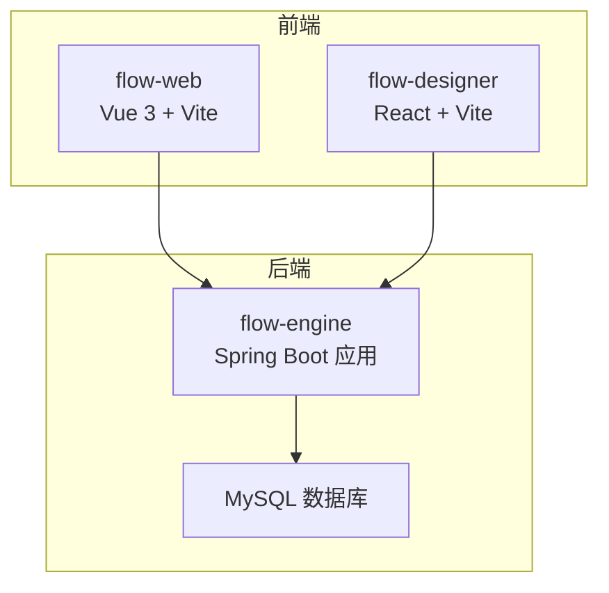
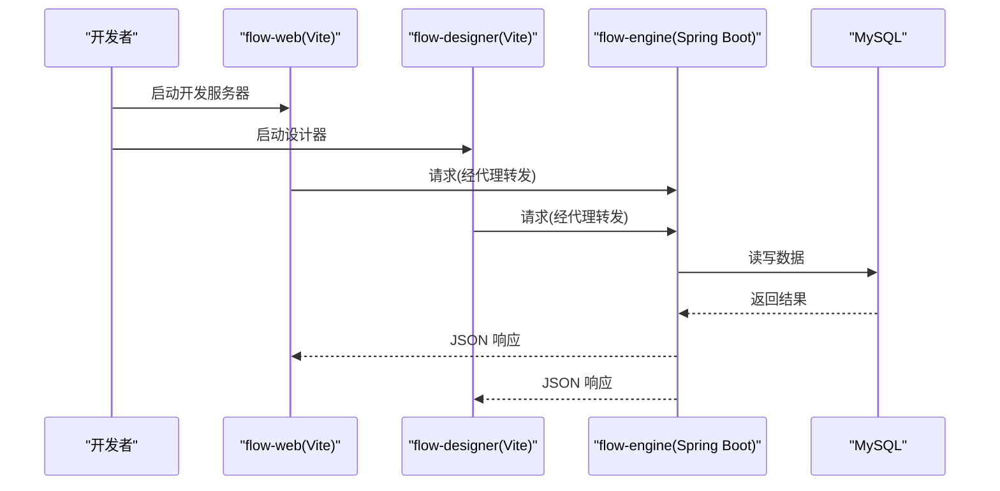
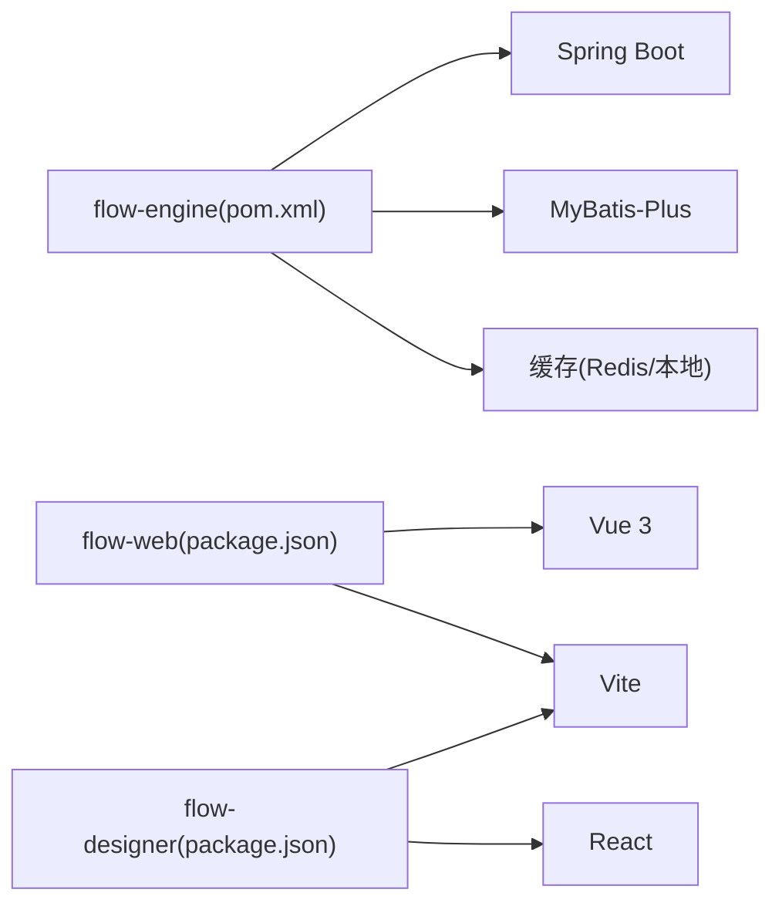

# 开发环境配置

<cite>
**本文引用的文件**   
- [flow-engine/pom.xml](file://flow-engine/pom.xml)
- [flow-engine/src/main/resources/application.yml](file://flow-engine/src/main/resources/application.yml)
- [flow-engine/src/test/resources/application-test.yml](file://flow-engine/src/test/resources/application-test.yml)
- [flow-engine/src/main/resources/db/schema.sql](file://flow-engine/src/main/resources/db/schema.sql)
- [flow-engine/src/main/java/com/flow/engine/config/MybatisPlusConfig.java](file://flow-engine/src/main/java/com/flow/engine/config/MybatisPlusConfig.java)
- [flow-engine/src/main/java/com/flow/engine/config/WebMvcConfig.java](file://flow-engine/src/main/java/com/flow/engine/config/WebMvcConfig.java)
- [flow-engine/src/main/java/com/flow/engine/config/CacheConfig.java](file://flow-engine/src/main/java/com/flow/engine/config/CacheConfig.java)
- [flow-engine/src/main/java/com/flow/engine/FlowEngineApplication.java](file://flow-engine/src/main/java/com/flow/engine/FlowEngineApplication.java)
- [flow-web/package.json](file://flow-web/package.json)
- [flow-web/vite.config.js](file://flow-web/vite.config.js)
- [flow-web/src/api/request.js](file://flow-web/src/api/request.js)
- [flow-designer/package.json](file://flow-designer/package.json)
- [flow-designer/vite.config.js](file://flow-designer/vite.config.js)
</cite>

## 目录
1. [简介](#简介)
2. [项目结构](#项目结构)
3. [核心组件](#核心组件)
4. [架构总览](#架构总览)
5. [详细组件分析](#详细组件分析)
6. [依赖分析](#依赖分析)
7. [性能考虑](#性能考虑)
8. [故障排查指南](#故障排查指南)
9. [结论](#结论)
10. [附录](#附录)

## 简介
本指南面向工作流引擎项目的本地开发与联调，覆盖以下目标：
- IDE 推荐配置（IntelliJ IDEA、VS Code）与插件建议
- 数据库环境配置（MySQL 连接、初始数据导入、测试库设置）
- 前端开发环境配置（Vite 开发服务器、代理、热重载）
- 环境变量与多环境配置管理策略
- 开发工具链（代码格式化、静态检查、调试）

## 项目结构
本项目采用前后端分离的多模块结构：
- flow-engine：后端服务（Spring Boot + MyBatis-Plus），提供流程定义、实例、任务等 API
- flow-web：后台管理系统（Vue 3 + Vite）
- flow-designer：流程设计器（React + Vite）

图表来源
- [flow-engine/src/main/java/com/flow/engine/FlowEngineApplication.java](file://flow-engine/src/main/java/com/flow/engine/FlowEngineApplication.java)
- [flow-web/vite.config.js](file://flow-web/vite.config.js)
- [flow-designer/vite.config.js](file://flow-designer/vite.config.js)

章节来源
- [flow-engine/pom.xml](file://flow-engine/pom.xml)
- [flow-engine/src/main/resources/application.yml](file://flow-engine/src/main/resources/application.yml)
- [flow-web/package.json](file://flow-web/package.json)
- [flow-web/vite.config.js](file://flow-web/vite.config.js)
- [flow-designer/package.json](file://flow-designer/package.json)
- [flow-designer/vite.config.js](file://flow-designer/vite.config.js)

## 核心组件
- 后端启动入口与基础配置
  - Spring Boot 主类负责应用启动与自动装配
  - Web MVC 配置用于跨域、拦截器等
  - MyBatis-Plus 配置用于数据访问层
  - 缓存配置用于运行时缓存能力
- 前端开发服务器
  - flow-web 使用 Vite 作为开发服务器，支持 HMR 与代理
  - flow-designer 同样基于 Vite，便于独立运行与联调

章节来源
- [flow-engine/src/main/java/com/flow/engine/FlowEngineApplication.java](file://flow-engine/src/main/java/com/flow/engine/FlowEngineApplication.java)
- [flow-engine/src/main/java/com/flow/engine/config/WebMvcConfig.java](file://flow-engine/src/main/java/com/flow/engine/config/WebMvcConfig.java)
- [flow-engine/src/main/java/com/flow/engine/config/MybatisPlusConfig.java](file://flow-engine/src/main/java/com/flow/engine/config/MybatisPlusConfig.java)
- [flow-engine/src/main/java/com/flow/engine/config/CacheConfig.java](file://flow-engine/src/main/java/com/flow/engine/config/CacheConfig.java)
- [flow-web/vite.config.js](file://flow-web/vite.config.js)
- [flow-designer/vite.config.js](file://flow-designer/vite.config.js)

## 架构总览
下图展示了本地开发时各组件的交互关系：前端通过 Vite 启动并代理到后端；后端读取 application.yml 中的数据库与缓存配置；测试环境使用独立的 application-test.yml。

图表来源
- [flow-web/vite.config.js](file://flow-web/vite.config.js)
- [flow-designer/vite.config.js](file://flow-designer/vite.config.js)
- [flow-engine/src/main/resources/application.yml](file://flow-engine/src/main/resources/application.yml)

## 详细组件分析

### 后端环境配置（Spring Boot）
- 配置文件位置
  - 生产/默认：application.yml
  - 测试：src/test/resources/application-test.yml
- 关键配置项说明
  - 服务器端口与上下文路径
  - 数据库连接（驱动、URL、用户名、密码）
  - MyBatis-Plus 相关（分页、逻辑删除、SQL 日志等）
  - 缓存（如 Redis 或本地缓存）的连接与过期策略
- 初始化脚本
  - schema.sql 包含建表语句，建议在首次启动前执行

章节来源
- [flow-engine/src/main/resources/application.yml](file://flow-engine/src/main/resources/application.yml)
- [flow-engine/src/test/resources/application-test.yml](file://flow-engine/src/test/resources/application-test.yml)
- [flow-engine/src/main/resources/db/schema.sql](file://flow-engine/src/main/resources/db/schema.sql)
- [flow-engine/src/main/java/com/flow/engine/config/MybatisPlusConfig.java](file://flow-engine/src/main/java/com/flow/engine/config/MybatisPlusConfig.java)
- [flow-engine/src/main/java/com/flow/engine/config/WebMvcConfig.java](file://flow-engine/src/main/java/com/flow/engine/config/WebMvcConfig.java)
- [flow-engine/src/main/java/com/flow/engine/config/CacheConfig.java](file://flow-engine/src/main/java/com/flow/engine/config/CacheConfig.java)

### 数据库环境配置（MySQL）
- 安装与准备
  - 安装 MySQL 8.x，创建开发库与用户，授予必要权限
- 连接配置
  - 在 application.yml 中填写数据库 URL、用户名、密码
  - 如需多环境，可通过 profile 切换不同配置
- 初始数据导入
  - 执行 schema.sql 完成建表
  - 如有初始字典、三员管理员等数据，按脚本顺序导入
- 测试数据库
  - 使用 application-test.yml 指定测试库地址与凭据
  - 单元测试与集成测试将优先加载测试配置

章节来源
- [flow-engine/src/main/resources/application.yml](file://flow-engine/src/main/resources/application.yml)
- [flow-engine/src/test/resources/application-test.yml](file://flow-engine/src/test/resources/application-test.yml)
- [flow-engine/src/main/resources/db/schema.sql](file://flow-engine/src/main/resources/db/schema.sql)

### 前端开发环境配置（Vite）
- 通用要求
  - Node.js LTS 版本（建议使用 18+）
  - 包管理器：npm 或 pnpm/yarn
- flow-web（Vue 3）
  - 启动命令参考 package.json 的 scripts
  - 代理配置：在 vite.config.js 中配置 /api 等前缀转发至后端
  - 热重载：Vite 默认开启，修改源码即时生效
- flow-designer（React）
  - 启动命令参考 package.json 的 scripts
  - 代理配置：在 vite.config.js 中配置后端地址
  - 按需引入与 HMR 由 Vite 自动处理

章节来源
- [flow-web/package.json](file://flow-web/package.json)
- [flow-web/vite.config.js](file://flow-web/vite.config.js)
- [flow-designer/package.json](file://flow-designer/package.json)
- [flow-designer/vite.config.js](file://flow-designer/vite.config.js)

### 环境变量与多环境配置管理
- 后端
  - 使用 Spring Profile 区分 dev/test/prod
  - 通过命令行参数或环境变量激活对应 profile
  - 敏感信息（数据库密码、密钥）建议从环境变量注入
- 前端
  - 使用 Vite 的环境变量约定（以 VITE_ 开头）
  - 根据 .env.development/.env.production 管理不同环境的常量
  - 接口域名、超时时间等通过环境变量注入

章节来源
- [flow-engine/src/main/resources/application.yml](file://flow-engine/src/main/resources/application.yml)
- [flow-engine/src/test/resources/application-test.yml](file://flow-engine/src/test/resources/application-test.yml)
- [flow-web/vite.config.js](file://flow-web/vite.config.js)

### 开发工具链配置
- IntelliJ IDEA
  - 插件建议：Lombok、MyBatisX、RestfulTool、Alibaba Java Coding Guidelines、SonarLint
  - 运行配置：添加 VM Options（如内存）、激活 Spring Profile、设置 JRE 版本
  - 调试：为 Spring Boot 应用创建 Debug 配置，断点调试 API
- VS Code
  - 插件建议：Java Extension Pack、Spring Boot Extension Pack、Vue Language Features、ESLint、Prettier
  - 调试：使用内置 Debugger for Chrome 调试前端，Spring Boot 扩展调试后端
- 代码规范与检查
  - 后端：启用 Lombok 注解处理器；统一缩进与导入排序
  - 前端：ESLint + Prettier 统一风格；提交前钩子（可选）
- 构建与打包
  - 后端：Maven 构建，跳过测试快速打包
  - 前端：Vite 构建产物输出至 dist，部署前清理缓存

章节来源
- [flow-engine/pom.xml](file://flow-engine/pom.xml)
- [flow-web/package.json](file://flow-web/package.json)
- [flow-designer/package.json](file://flow-designer/package.json)

## 依赖分析
- 后端依赖
  - Spring Boot 生态（Web、Security、AOP 等）
  - MyBatis-Plus 数据访问
  - 缓存（Redis 或本地缓存）
- 前端依赖
  - Vue 3 生态（Vue Router、Pinia/Vuex 等）
  - React 生态（flow-designer）
  - Vite 构建与开发服务器

图表来源
- [flow-engine/pom.xml](file://flow-engine/pom.xml)
- [flow-web/package.json](file://flow-web/package.json)
- [flow-designer/package.json](file://flow-designer/package.json)

章节来源
- [flow-engine/pom.xml](file://flow-engine/pom.xml)
- [flow-web/package.json](file://flow-web/package.json)
- [flow-designer/package.json](file://flow-designer/package.json)

## 性能考虑
- 后端
  - 合理设置 JVM 堆大小与 GC 参数
  - 开启 SQL 日志仅用于开发阶段
  - 对热点查询增加索引与缓存
- 前端
  - 合理使用路由懒加载与组件按需引入
  - 关闭不必要的调试日志
  - 优化静态资源体积（图片压缩、Tree Shaking）

[本节为通用指导，不直接分析具体文件]

## 故障排查指南
- 无法连接数据库
  - 检查 application.yml 中的 URL、用户名、密码是否正确
  - 确认 MySQL 服务已启动且端口可达
  - 验证 schema.sql 是否成功执行
- 跨域问题
  - 检查 WebMvcConfig 的跨域配置是否放行前端域名与路径
- 代理无效
  - 核对 vite.config.js 的代理规则与后端实际路径
  - 确认浏览器控制台网络面板的请求目标
- 热重载不生效
  - 确保未禁用 Vite 的 HMR
  - 清理 node_modules 与缓存后重试
- 测试失败
  - 确认 application-test.yml 指向正确的测试库
  - 检查测试数据是否完整

章节来源
- [flow-engine/src/main/resources/application.yml](file://flow-engine/src/main/resources/application.yml)
- [flow-engine/src/test/resources/application-test.yml](file://flow-engine/src/test/resources/application-test.yml)
- [flow-engine/src/main/resources/db/schema.sql](file://flow-engine/src/main/resources/db/schema.sql)
- [flow-engine/src/main/java/com/flow/engine/config/WebMvcConfig.java](file://flow-engine/src/main/java/com/flow/engine/config/WebMvcConfig.java)
- [flow-web/vite.config.js](file://flow-web/vite.config.js)
- [flow-designer/vite.config.js](file://flow-designer/vite.config.js)

## 结论
通过合理的 IDE 配置、数据库与环境变量管理、以及 Vite 的前端开发体验优化，可显著提升本地开发与联调效率。建议团队统一插件与规范配置，并通过多环境配置隔离敏感信息与差异设置。

[本节为总结性内容，不直接分析具体文件]

## 附录
- 常用命令速查
  - 后端启动：使用 IDE 运行 Spring Boot 主类或通过 Maven 命令
  - 前端启动：分别进入 flow-web 与 flow-designer 目录执行 npm run dev
  - 构建产物：npm run build 生成 dist 目录
- 参考文件路径
  - 后端配置：application.yml、application-test.yml
  - 数据库脚本：schema.sql
  - 前端配置：vite.config.js、package.json

章节来源
- [flow-engine/src/main/resources/application.yml](file://flow-engine/src/main/resources/application.yml)
- [flow-engine/src/test/resources/application-test.yml](file://flow-engine/src/test/resources/application-test.yml)
- [flow-engine/src/main/resources/db/schema.sql](file://flow-engine/src/main/resources/db/schema.sql)
- [flow-web/vite.config.js](file://flow-web/vite.config.js)
- [flow-web/package.json](file://flow-web/package.json)
- [flow-designer/vite.config.js](file://flow-designer/vite.config.js)
- [flow-designer/package.json](file://flow-designer/package.json)