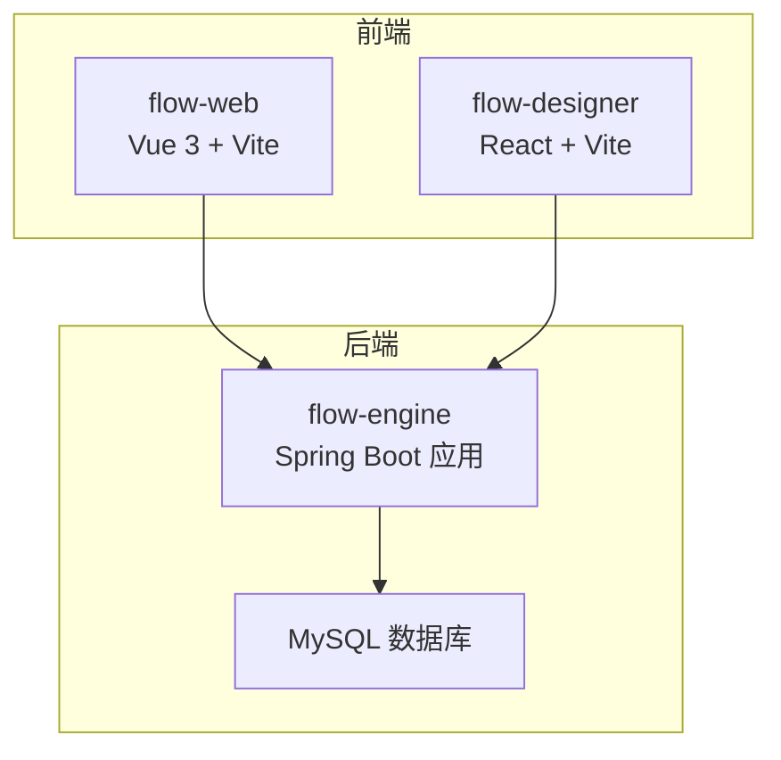
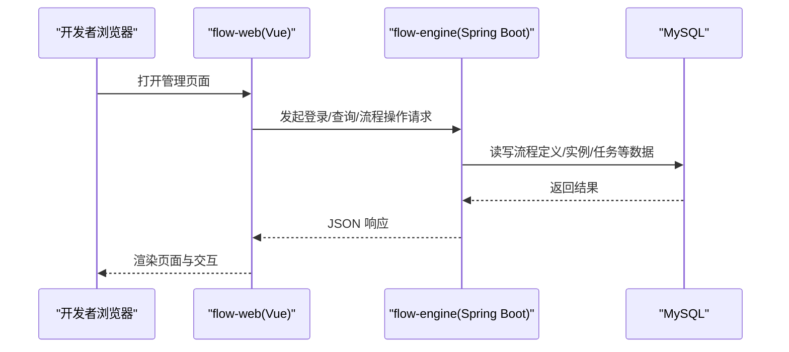
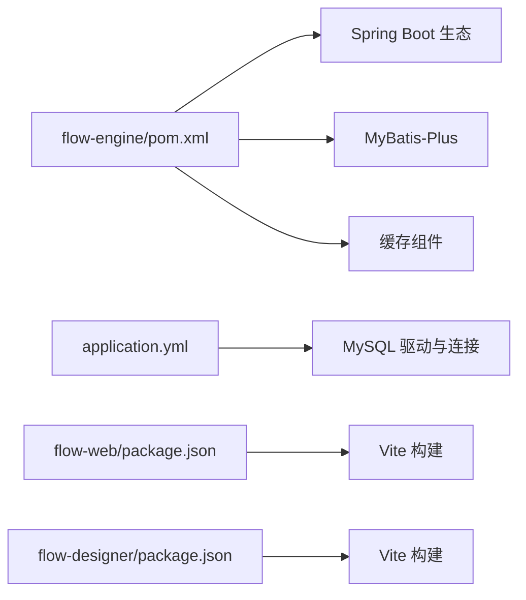

# 快速开始指南

<cite>
**本文引用的文件**   
- [flow-engine/pom.xml](file://flow-engine/pom.xml)
- [flow-engine/src/main/resources/application.yml](file://flow-engine/src/main/resources/application.yml)
- [flow-engine/src/main/resources/db/schema.sql](file://flow-engine/src/main/resources/db/schema.sql)
- [flow-engine/src/main/java/com/flow/engine/FlowEngineApplication.java](file://flow-engine/src/main/java/com/flow/engine/FlowEngineApplication.java)
- [flow-engine/src/test/resources/application-test.yml](file://flow-engine/src/test/resources/application-test.yml)
- [flow-web/package.json](file://flow-web/package.json)
- [flow-web/vite.config.js](file://flow-web/vite.config.js)
- [flow-designer/package.json](file://flow-designer/package.json)
- [flow-designer/vite.config.js](file://flow-designer/vite.config.js)
</cite>

## 目录
1. [简介](#简介)
2. [项目结构](#项目结构)
3. [核心组件](#核心组件)
4. [架构总览](#架构总览)
5. [详细组件分析](#详细组件分析)
6. [依赖分析](#依赖分析)
7. [性能考虑](#性能考虑)
8. [故障排查指南](#故障排查指南)
9. [结论](#结论)
10. [附录](#附录)

## 简介
本指南面向首次接触工作流引擎的开发者，提供从环境准备、后端启动、前端安装到第一个流程创建与测试的完整路径。通过最小化步骤，帮助你在本地快速运行并体验流程定义、实例运行与任务处理等核心能力。

## 项目结构
仓库采用前后端分离与多模块组织：
- flow-engine：基于 Spring Boot 的后端服务，包含流程引擎、任务中心、权限与系统管理等能力。
- flow-web：Vue 3 + Vite 构建的管理前端，提供流程设计器集成、实例监控、任务处理与系统管理界面。
- flow-designer：独立的流程设计器前端（React + Vite），可被 flow-web 集成或独立使用。

**图表来源**
- [flow-engine/src/main/java/com/flow/engine/FlowEngineApplication.java](file://flow-engine/src/main/java/com/flow/engine/FlowEngineApplication.java)
- [flow-web/package.json](file://flow-web/package.json)
- [flow-designer/package.json](file://flow-designer/package.json)

**章节来源**
- [flow-engine/src/main/java/com/flow/engine/FlowEngineApplication.java](file://flow-engine/src/main/java/com/flow/engine/FlowEngineApplication.java)
- [flow-web/package.json](file://flow-web/package.json)
- [flow-designer/package.json](file://flow-designer/package.json)

## 核心组件
- 后端入口与配置
  - 应用主类负责启动 Spring Boot 容器，加载配置与自动装配。
  - 配置文件位于 resources 下，用于数据源、端口、日志等运行时参数。
- 数据库初始化
  - 提供 schema.sql 脚本，用于建库建表与基础数据初始化。
- 前端工程
  - flow-web 与 flow-designer 均为 Vite 工程，通过 package.json 管理依赖与脚本命令。

**章节来源**
- [flow-engine/src/main/java/com/flow/engine/FlowEngineApplication.java](file://flow-engine/src/main/java/com/flow/engine/FlowEngineApplication.java)
- [flow-engine/src/main/resources/application.yml](file://flow-engine/src/main/resources/application.yml)
- [flow-engine/src/main/resources/db/schema.sql](file://flow-engine/src/main/resources/db/schema.sql)
- [flow-web/package.json](file://flow-web/package.json)
- [flow-designer/package.json](file://flow-designer/package.json)

## 架构总览
后端以 Spring Boot 为核心，暴露 REST API；前端通过 HTTP 调用后端接口；数据库使用 MySQL。

**图表来源**
- [flow-engine/src/main/java/com/flow/engine/FlowEngineApplication.java](file://flow-engine/src/main/java/com/flow/engine/FlowEngineApplication.java)
- [flow-web/package.json](file://flow-web/package.json)

## 详细组件分析

### 环境准备
- JDK
  - 版本建议：JDK 17（推荐）或 JDK 11（兼容）。
  - 验证方式：在终端执行 java -version。
- Node.js
  - 版本建议：Node.js 18 LTS 或以上。
  - 验证方式：node -v 与 npm -v。
- MySQL
  - 版本建议：MySQL 8.0+。
  - 需要创建数据库与用户，并授予相应权限。
- Maven
  - 版本建议：Maven 3.8+。
  - 验证方式：mvn -v。

提示：请确保上述工具已加入系统 PATH，并在命令行中可正常执行。

**章节来源**
- [flow-engine/pom.xml](file://flow-engine/pom.xml)
- [flow-web/package.json](file://flow-web/package.json)
- [flow-designer/package.json](file://flow-designer/package.json)

### 数据库初始化
- 使用提供的 SQL 脚本完成建库建表与基础数据初始化。
- 建议在开发环境使用独立数据库实例，避免影响其他业务。

操作步骤（简要）：
1. 登录 MySQL 客户端。
2. 创建数据库（如 workflow_dev）。
3. 导入 schema.sql 脚本。
4. 确认表结构与基础字典数据存在。

**章节来源**
- [flow-engine/src/main/resources/db/schema.sql](file://flow-engine/src/main/resources/db/schema.sql)

### 后端服务启动
- 修改数据库连接信息
  - 打开 application.yml，设置正确的数据库 URL、用户名与密码。
  - 如需调整端口或其他运行时参数，可在同一文件中修改。
- 构建与运行
  - 在项目根目录或 flow-engine 目录下执行 Maven 构建与运行命令。
  - 若仅启动后端，可跳过前端构建步骤。

常见要点：
- 确保 MySQL 服务已启动且网络可达。
- 若使用代理或镜像源，请在 Maven 配置中设置。
- 首次启动会自动加载 application.yml 中的配置。

**章节来源**
- [flow-engine/src/main/resources/application.yml](file://flow-engine/src/main/resources/application.yml)
- [flow-engine/pom.xml](file://flow-engine/pom.xml)
- [flow-engine/src/main/java/com/flow/engine/FlowEngineApplication.java](file://flow-engine/src/main/java/com/flow/engine/FlowEngineApplication.java)

### 前端应用安装与启动
- flow-web（管理前端）
  - 进入 flow-web 目录，安装依赖并启动开发服务器。
  - 默认会访问 http://localhost:5173（具体端口以 vite.config.js 为准）。
- flow-designer（流程设计器）
  - 进入 flow-designer 目录，安装依赖并启动开发服务器。
  - 该设计器可被 flow-web 集成或直接访问。

注意：
- 若后端未启动或跨域未配置，前端将无法调用接口。
- 生产构建可使用 build 脚本生成静态资源。

**章节来源**
- [flow-web/package.json](file://flow-web/package.json)
- [flow-web/vite.config.js](file://flow-web/vite.config.js)
- [flow-designer/package.json](file://flow-designer/package.json)
- [flow-designer/vite.config.js](file://flow-designer/vite.config.js)

### 第一个流程的创建与测试示例
以下是一个端到端的快速体验流程，帮助你理解“定义—发布—启动—审批”的基本链路：
1. 登录管理前端（flow-web），进入“流程定义”页面。
2. 新建一个简单流程，包含“开始节点”、“用户任务节点”和“结束节点”。
3. 保存并发布流程定义。
4. 进入“流程实例”，选择刚发布的流程，点击“启动实例”，填写必要变量。
5. 进入“待办任务”，认领并完成当前任务，观察流程推进。
6. 查看“流程监控”或“实例列表”，确认流程状态为“已完成”。

说明：
- 不同实现可能要求不同的表单字段或变量名，请以实际页面提示为准。
- 若需自定义节点行为，请参考后端 node 扩展点与处理器注册机制。

[本节为概念性流程说明，不直接分析具体源码文件]

## 依赖分析
- 后端依赖
  - Spring Boot 生态（Web、MyBatis-Plus、缓存等）由 pom.xml 声明。
  - 数据库驱动与连接池由 application.yml 指定。
- 前端依赖
  - flow-web 与 flow-designer 均使用 Vite 作为构建工具，依赖通过 package.json 管理。

**图表来源**
- [flow-engine/pom.xml](file://flow-engine/pom.xml)
- [flow-engine/src/main/resources/application.yml](file://flow-engine/src/main/resources/application.yml)
- [flow-web/package.json](file://flow-web/package.json)
- [flow-designer/package.json](file://flow-designer/package.json)

**章节来源**
- [flow-engine/pom.xml](file://flow-engine/pom.xml)
- [flow-engine/src/main/resources/application.yml](file://flow-engine/src/main/resources/application.yml)
- [flow-web/package.json](file://flow-web/package.json)
- [flow-designer/package.json](file://flow-designer/package.json)

## 性能考虑
- 数据库连接池与索引
  - 根据并发量合理设置连接池大小，并为常用查询字段建立索引。
- 缓存策略
  - 对热点字典、权限与元数据进行缓存，降低数据库压力。
- 异步与事件
  - 将耗时操作（如外部回调、消息发送）异步化，提升吞吐。
- 前端优化
  - 合理使用路由懒加载与组件按需引入，减少首屏体积。

[本节为通用指导，不直接分析具体源码文件]

## 故障排查指南
- 无法连接数据库
  - 检查 application.yml 中的数据库 URL、用户名与密码是否正确。
  - 确认 MySQL 服务已启动且端口可达。
  - 校验 schema.sql 是否成功导入。
- 端口占用或服务无法启动
  - 修改 application.yml 中的服务端口，或释放占用端口。
- 前端无法调用后端接口
  - 确认后端已启动且地址与端口正确。
  - 检查跨域配置，确保前端域名与端口在白名单内。
- 构建失败
  - 后端：检查 Maven 版本与网络代理设置。
  - 前端：清理 node_modules 后重新安装依赖，确保 Node.js 版本满足要求。
- 测试环境差异
  - 参考 test 资源下的 application-test.yml，核对测试环境的数据库与开关配置。

**章节来源**
- [flow-engine/src/main/resources/application.yml](file://flow-engine/src/main/resources/application.yml)
- [flow-engine/src/test/resources/application-test.yml](file://flow-engine/src/test/resources/application-test.yml)

## 结论
通过以上步骤，你可以在本地快速搭建并运行工作流引擎的前后端服务，完成从流程定义到实例运行的基本闭环。后续可根据业务需求扩展节点类型、表单与权限模型，并结合监控与审计能力完善运维体系。

## 附录
- 常用命令速查
  - 后端构建与运行：在 flow-engine 目录执行 Maven 构建与运行命令。
  - 前端开发：在各自目录执行 npm install 与开发服务器启动命令。
- 关键文件定位
  - 后端入口：见 FlowEngineApplication.java。
  - 后端配置：见 application.yml。
  - 数据库脚本：见 db/schema.sql。
  - 前端依赖与脚本：见 flow-web/package.json 与 flow-designer/package.json。

**章节来源**
- [flow-engine/src/main/java/com/flow/engine/FlowEngineApplication.java](file://flow-engine/src/main/java/com/flow/engine/FlowEngineApplication.java)
- [flow-engine/src/main/resources/application.yml](file://flow-engine/src/main/resources/application.yml)
- [flow-engine/src/main/resources/db/schema.sql](file://flow-engine/src/main/resources/db/schema.sql)
- [flow-web/package.json](file://flow-web/package.json)
- [flow-designer/package.json](file://flow-designer/package.json)