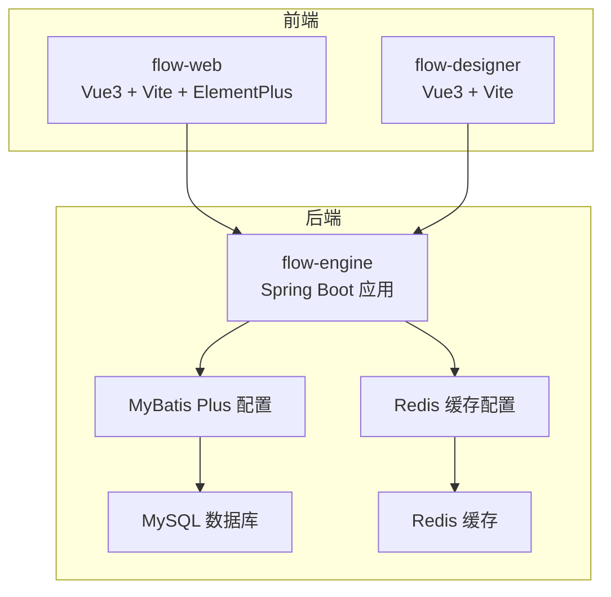
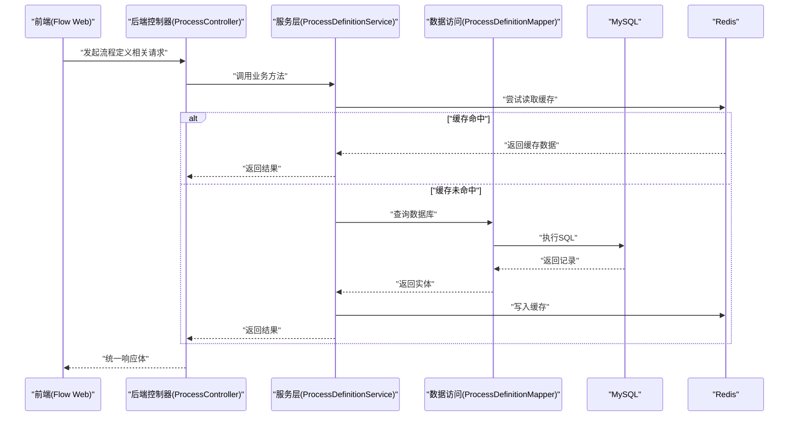
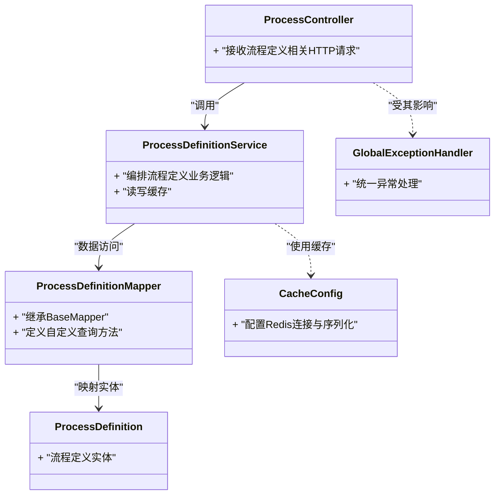
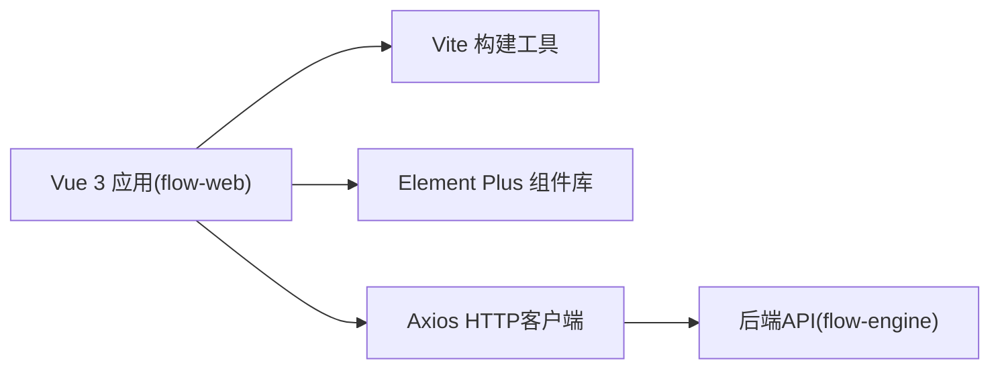
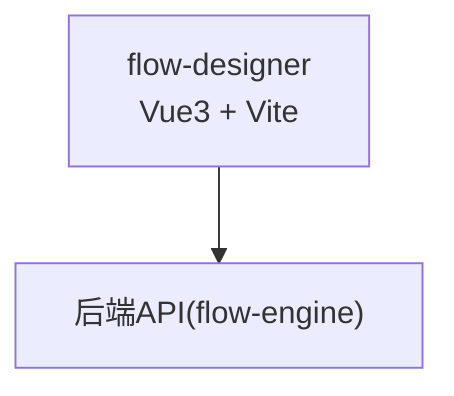
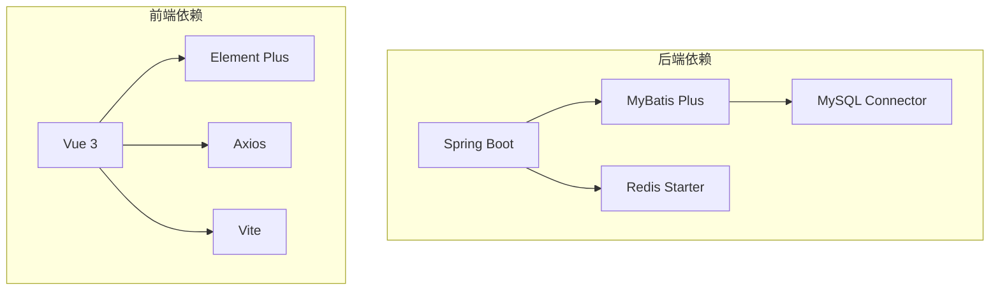

# 技术栈概览

<cite>
**本文引用的文件**   
- [flow-engine/pom.xml](file://flow-engine/pom.xml)
- [flow-engine/src/main/resources/application.yml](file://flow-engine/src/main/resources/application.yml)
- [flow-engine/src/main/java/com/flow/engine/config/MybatisPlusConfig.java](file://flow-engine/src/main/java/com/flow/engine/config/MybatisPlusConfig.java)
- [flow-engine/src/main/java/com/flow/engine/config/CacheConfig.java](file://flow-engine/src/main/java/com/flow/engine/config/CacheConfig.java)
- [flow-engine/src/main/java/com/flow/engine/common/GlobalExceptionHandler.java](file://flow-engine/src/main/java/com/flow/engine/common/GlobalExceptionHandler.java)
- [flow-engine/src/main/java/com/flow/engine/controller/ProcessController.java](file://flow-engine/src/main/java/com/flow/engine/controller/ProcessController.java)
- [flow-engine/src/main/java/com/flow/engine/service/ProcessDefinitionService.java](file://flow-engine/src/main/java/com/flow/engine/service/ProcessDefinitionService.java)
- [flow-engine/src/main/java/com/flow/engine/mapper/ProcessDefinitionMapper.java](file://flow-engine/src/main/java/com/flow/engine/mapper/ProcessDefinitionMapper.java)
- [flow-engine/src/main/java/com/flow/engine/entity/ProcessDefinition.java](file://flow-engine/src/main/java/com/flow/engine/entity/ProcessDefinition.java)
- [flow-designer/package.json](file://flow-designer/package.json)
- [flow-designer/vite.config.js](file://flow-designer/vite.config.js)
- [flow-web/package.json](file://flow-web/package.json)
- [flow-web/vite.config.js](file://flow-web/vite.config.js)
- [flow-web/src/api/request.js](file://flow-web/src/api/request.js)
</cite>

## 目录
1. [简介](#简介)
2. [项目结构](#项目结构)
3. [核心组件](#核心组件)
4. [架构总览](#架构总览)
5. [详细组件分析](#详细组件分析)
6. [依赖关系分析](#依赖关系分析)
7. [性能考虑](#性能考虑)
8. [故障排查指南](#故障排查指南)
9. [结论](#结论)
10. [附录](#附录)

## 简介
本技术栈概览面向工作流引擎项目的后端与前端，系统梳理了Spring Boot、MyBatis Plus、MySQL、Redis等后端核心依赖，以及Vue 3、Vite、Element Plus、Axios等前端技术选型。同时覆盖开发工具与第三方服务集成（如Docker容器化、Git版本控制、日志框架），并给出技术选型理由与版本兼容性说明，帮助开发者理解整体技术决策与依赖管理策略。

## 项目结构
本项目采用前后端分离的模块化组织方式：
- flow-engine：后端工程，基于Spring Boot提供流程定义、实例、任务等API，使用MyBatis Plus访问MySQL，通过配置启用Redis缓存。
- flow-web：后台管理系统前端，基于Vue 3 + Vite构建，使用Element Plus作为UI库，Axios进行HTTP通信。
- flow-designer：流程设计器前端，独立子应用，同样基于Vue 3 + Vite，便于嵌入或单独部署。

图表来源
- [flow-engine/src/main/resources/application.yml](file://flow-engine/src/main/resources/application.yml)
- [flow-engine/src/main/java/com/flow/engine/config/MybatisPlusConfig.java](file://flow-engine/src/main/java/com/flow/engine/config/MybatisPlusConfig.java)
- [flow-engine/src/main/java/com/flow/engine/config/CacheConfig.java](file://flow-engine/src/main/java/com/flow/engine/config/CacheConfig.java)
- [flow-web/package.json](file://flow-web/package.json)
- [flow-designer/package.json](file://flow-designer/package.json)

章节来源
- [flow-engine/pom.xml](file://flow-engine/pom.xml)
- [flow-engine/src/main/resources/application.yml](file://flow-engine/src/main/resources/application.yml)
- [flow-web/package.json](file://flow-web/package.json)
- [flow-designer/package.json](file://flow-designer/package.json)

## 核心组件
- 后端核心
  - Spring Boot：提供Web MVC、自动装配、外部化配置、监控与健康检查能力。
  - MyBatis Plus：简化CRUD与分页查询，配合实体类与Mapper接口提升开发效率。
  - MySQL：持久化存储流程定义、实例、任务、字典、权限等数据。
  - Redis：用于热点数据缓存、会话/令牌缓存、分布式锁等场景。
  - 全局异常处理：统一错误码与响应体，提升前后端交互一致性。
- 前端核心
  - Vue 3：组合式API与响应式数据驱动视图。
  - Vite：快速开发与构建，支持热更新与按需打包。
  - Element Plus：丰富的企业级UI组件，加速后台界面开发。
  - Axios：统一的HTTP客户端封装，拦截请求/响应、错误处理与重试策略。

章节来源
- [flow-engine/src/main/java/com/flow/engine/common/GlobalExceptionHandler.java](file://flow-engine/src/main/java/com/flow/engine/common/GlobalExceptionHandler.java)
- [flow-engine/src/main/java/com/flow/engine/config/MybatisPlusConfig.java](file://flow-engine/src/main/java/com/flow/engine/config/MybatisPlusConfig.java)
- [flow-engine/src/main/java/com/flow/engine/config/CacheConfig.java](file://flow-engine/src/main/java/com/flow/engine/config/CacheConfig.java)
- [flow-web/src/api/request.js](file://flow-web/src/api/request.js)

## 架构总览
后端以Spring Boot为入口，控制器层暴露REST API，服务层编排业务逻辑，数据访问层通过MyBatis Plus映射到MySQL；同时通过配置类引入Redis缓存能力。前端通过Axios调用后端API，页面由Vue 3渲染，UI组件来自Element Plus。

图表来源
- [flow-engine/src/main/java/com/flow/engine/controller/ProcessController.java](file://flow-engine/src/main/java/com/flow/engine/controller/ProcessController.java)
- [flow-engine/src/main/java/com/flow/engine/service/ProcessDefinitionService.java](file://flow-engine/src/main/java/com/flow/engine/service/ProcessDefinitionService.java)
- [flow-engine/src/main/java/com/flow/engine/mapper/ProcessDefinitionMapper.java](file://flow-engine/src/main/java/com/flow/engine/mapper/ProcessDefinitionMapper.java)
- [flow-engine/src/main/java/com/flow/engine/entity/ProcessDefinition.java](file://flow-engine/src/main/java/com/flow/engine/entity/ProcessDefinition.java)
- [flow-engine/src/main/java/com/flow/engine/config/CacheConfig.java](file://flow-engine/src/main/java/com/flow/engine/config/CacheConfig.java)

## 详细组件分析

### 后端技术栈与配置
- Spring Boot
  - 作用：提供Web服务器、自动装配、外部化配置、健康检查与监控扩展点。
  - 关键位置：应用主类与资源配置文件。
- MyBatis Plus
  - 作用：ORM增强，简化CRUD、分页、条件构造器与代码生成。
  - 关键位置：配置类与Mapper接口。
- MySQL
  - 作用：关系型数据库，承载流程元数据与运行时数据。
  - 关键位置：application.yml中的数据源配置。
- Redis
  - 作用：内存缓存，降低数据库压力，提升热点数据读取性能。
  - 关键位置：缓存配置类与连接参数。
- 全局异常处理
  - 作用：统一异常捕获、错误码映射与响应格式，避免重复样板代码。
  - 关键位置：全局异常处理器。

图表来源
- [flow-engine/src/main/java/com/flow/engine/controller/ProcessController.java](file://flow-engine/src/main/java/com/flow/engine/controller/ProcessController.java)
- [flow-engine/src/main/java/com/flow/engine/service/ProcessDefinitionService.java](file://flow-engine/src/main/java/com/flow/engine/service/ProcessDefinitionService.java)
- [flow-engine/src/main/java/com/flow/engine/mapper/ProcessDefinitionMapper.java](file://flow-engine/src/main/java/com/flow/engine/mapper/ProcessDefinitionMapper.java)
- [flow-engine/src/main/java/com/flow/engine/entity/ProcessDefinition.java](file://flow-engine/src/main/java/com/flow/engine/entity/ProcessDefinition.java)
- [flow-engine/src/main/java/com/flow/engine/config/CacheConfig.java](file://flow-engine/src/main/java/com/flow/engine/config/CacheConfig.java)
- [flow-engine/src/main/java/com/flow/engine/common/GlobalExceptionHandler.java](file://flow-engine/src/main/java/com/flow/engine/common/GlobalExceptionHandler.java)

章节来源
- [flow-engine/src/main/java/com/flow/engine/config/MybatisPlusConfig.java](file://flow-engine/src/main/java/com/flow/engine/config/MybatisPlusConfig.java)
- [flow-engine/src/main/java/com/flow/engine/config/CacheConfig.java](file://flow-engine/src/main/java/com/flow/engine/config/CacheConfig.java)
- [flow-engine/src/main/java/com/flow/engine/common/GlobalExceptionHandler.java](file://flow-engine/src/main/java/com/flow/engine/common/GlobalExceptionHandler.java)
- [flow-engine/src/main/resources/application.yml](file://flow-engine/src/main/resources/application.yml)

### 前端技术栈与构建
- Vue 3
  - 作用：渐进式前端框架，组合式API提升逻辑复用与可测试性。
- Vite
  - 作用：现代前端构建工具，极速冷启动与HMR，按需打包。
- Element Plus
  - 作用：基于Vue 3的企业级UI组件库，丰富表单、表格、布局等组件。
- Axios
  - 作用：HTTP客户端，支持拦截器、取消请求、错误处理与重试。

图表来源
- [flow-web/package.json](file://flow-web/package.json)
- [flow-web/vite.config.js](file://flow-web/vite.config.js)
- [flow-web/src/api/request.js](file://flow-web/src/api/request.js)

章节来源
- [flow-web/package.json](file://flow-web/package.json)
- [flow-web/vite.config.js](file://flow-web/vite.config.js)
- [flow-web/src/api/request.js](file://flow-web/src/api/request.js)

### 流程设计器前端
- 技术栈：Vue 3 + Vite，与后台管理系统解耦，便于独立部署或嵌入。
- 用途：可视化拖拽绘制流程图，导出JSON供后端解析与运行。

图表来源
- [flow-designer/package.json](file://flow-designer/package.json)
- [flow-designer/vite.config.js](file://flow-designer/vite.config.js)

章节来源
- [flow-designer/package.json](file://flow-designer/package.json)
- [flow-designer/vite.config.js](file://flow-designer/vite.config.js)

## 依赖关系分析
- 后端依赖
  - Spring Boot：通过Maven管理，提供Web、安全、缓存、AOP等Starter。
  - MyBatis Plus：通过Starter引入，简化数据访问层开发。
  - MySQL Connector：JDBC驱动，连接MySQL数据库。
  - Redis Starter：连接Redis并提供缓存能力。
- 前端依赖
  - Vue 3生态：vue、vue-router、pinia等。
  - 构建工具：vite、@vitejs/plugin-vue等。
  - UI库：element-plus。
  - HTTP客户端：axios。

图表来源
- [flow-engine/pom.xml](file://flow-engine/pom.xml)
- [flow-web/package.json](file://flow-web/package.json)
- [flow-designer/package.json](file://flow-designer/package.json)

章节来源
- [flow-engine/pom.xml](file://flow-engine/pom.xml)
- [flow-web/package.json](file://flow-web/package.json)
- [flow-designer/package.json](file://flow-designer/package.json)

## 性能考虑
- 缓存策略
  - 对热点流程定义、字典项、权限计算结果等进行缓存，减少数据库压力。
  - 合理设置TTL与缓存失效策略，保证一致性与时效性平衡。
- 数据库优化
  - 合理使用索引与分页查询，避免全表扫描与大对象传输。
  - 批量操作与事务边界控制，降低锁竞争。
- 前端优化
  - 路由懒加载与组件按需引入，减小首屏体积。
  - 列表虚拟滚动与增量更新，提升大数据量渲染性能。
- 网络与并发
  - 使用连接池与超时配置，避免连接耗尽。
  - 对长耗时任务采用异步与消息队列（可选）解耦。

[本节为通用指导，不直接分析具体文件]

## 故障排查指南
- 统一异常处理
  - 通过全局异常处理器捕获业务异常与系统异常，返回标准错误码与消息，便于前端定位问题。
- 常见错误
  - 数据库连接失败：检查数据源URL、用户名、密码与网络连通性。
  - Redis连接失败：检查Redis地址、端口、认证信息与防火墙策略。
  - 跨域问题：确认后端CORS配置与前端请求域名一致。
  - 构建失败：清理node_modules与dist后重新安装依赖与构建。

章节来源
- [flow-engine/src/main/java/com/flow/engine/common/GlobalExceptionHandler.java](file://flow-engine/src/main/java/com/flow/engine/common/GlobalExceptionHandler.java)
- [flow-engine/src/main/resources/application.yml](file://flow-engine/src/main/resources/application.yml)

## 结论
本项目采用成熟稳定的技术栈：后端以Spring Boot为核心，结合MyBatis Plus与MySQL实现高效的数据访问，并通过Redis提升性能；前端以Vue 3与Vite为基础，借助Element Plus与Axios完成快速开发与稳定通信。该组合在可维护性、可扩展性与团队上手成本之间取得良好平衡，适合持续迭代的工作流引擎产品。

[本节为总结性内容，不直接分析具体文件]

## 附录

### 技术选型理由
- Spring Boot
  - 约定优于配置，生态完善，易于集成各类中间件与监控。
- MyBatis Plus
  - 在保留SQL灵活性的同时，极大简化CRUD与分页，提高开发效率。
- MySQL
  - 成熟稳定、社区活跃、成本低，满足工作流元数据与运行时数据的复杂关系建模。
- Redis
  - 高性能内存存储，适用于缓存、会话、限流与分布式锁等场景。
- Vue 3 + Vite
  - 现代化前端开发体验，组合式API提升逻辑复用，Vite带来极快的构建与热更新。
- Element Plus
  - 组件丰富且主题可定制，适合后台管理系统快速搭建。
- Axios
  - 拦截器机制完善，便于统一鉴权、错误处理与重试。

[本节为概念性说明，不直接分析具体文件]

### 版本兼容性与升级建议
- 后端
  - Spring Boot与Java版本需匹配，建议使用LTS版本以获得长期支持。
  - MyBatis Plus与Spring Boot版本存在兼容性矩阵，升级前需核对官方文档。
  - MySQL与Redis版本应与企业现有基础设施保持一致，注意字符集与SSL配置。
- 前端
  - Vue 3与Element Plus版本需对应，Vite插件与Node版本需满足最低要求。
  - Axios版本与拦截器行为可能随大版本变化，升级时关注Breaking Changes。
- 依赖管理策略
  - 后端使用Maven集中管理依赖版本，必要时通过dependencyManagement锁定版本。
  - 前端使用package.json与lock文件锁定依赖，定期审计漏洞与安全更新。

[本节为通用指导，不直接分析具体文件]