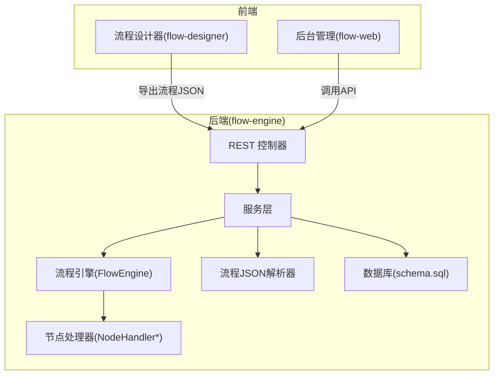
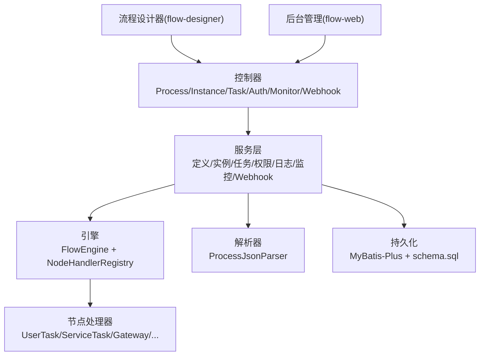
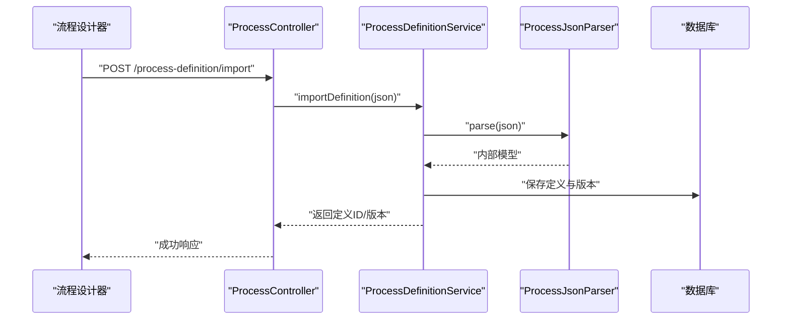
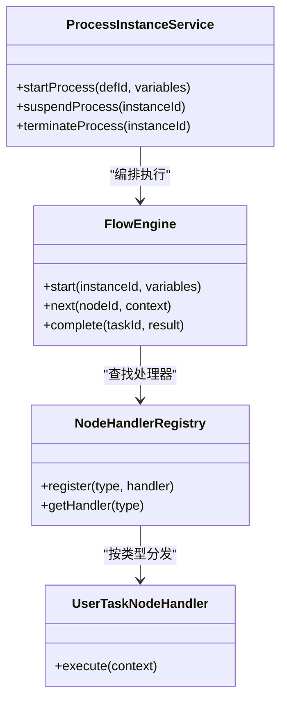
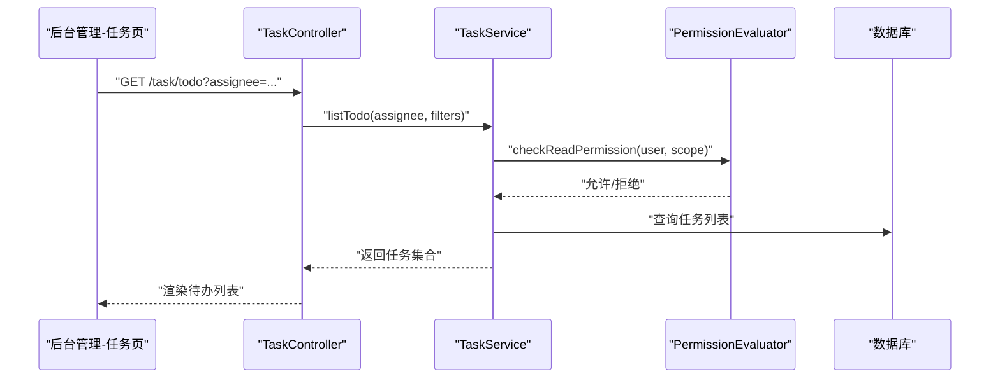
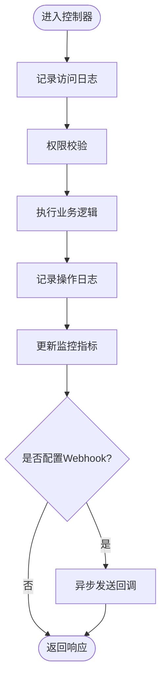
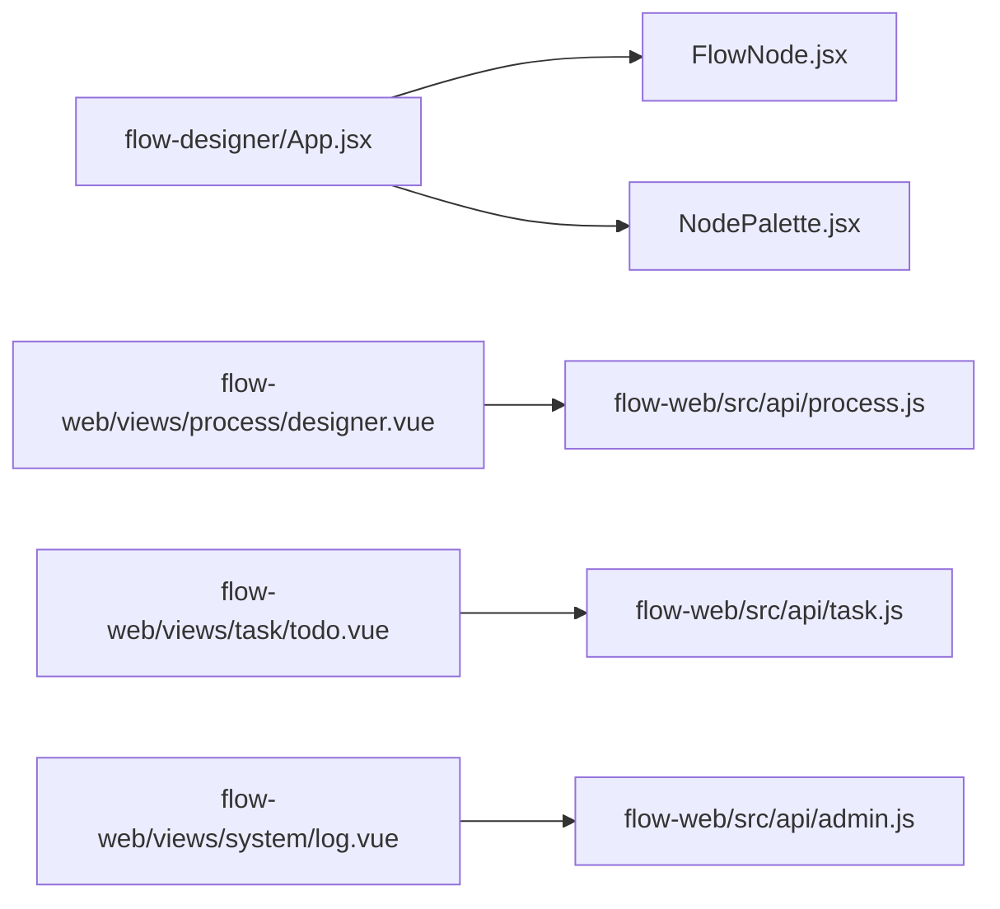
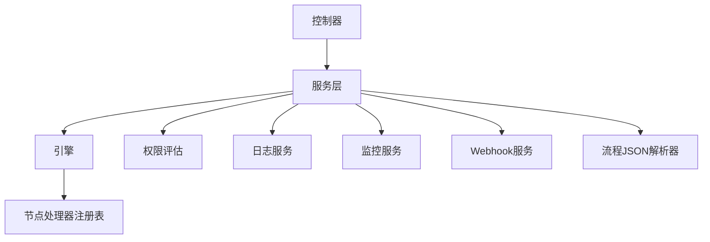

# 项目介绍与特性

<cite>
**本文引用的文件**   
- [flow-engine/src/main/java/com/flow/engine/FlowEngineApplication.java](file://flow-engine/src/main/java/com/flow/engine/FlowEngineApplication.java)
- [flow-engine/src/main/java/com/flow/engine/controller/ProcessController.java](file://flow-engine/src/main/java/com/flow/engine/controller/ProcessController.java)
- [flow-engine/src/main/java/com/flow/engine/controller/ProcessInstanceController.java](file://flow-engine/src/main/java/com/flow/engine/controller/ProcessInstanceController.java)
- [flow-engine/src/main/java/com/flow/engine/controller/TaskController.java](file://flow-engine/src/main/java/com/flow/engine/controller/TaskController.java)
- [flow-engine/src/main/java/com/flow/engine/controllers/AuthController.java](file://flow-engine/src/main/java/com/flow/engine/controllers/AuthController.java)
- [flow-engine/src/main/java/com/flow/engine/controllers/MonitorController.java](file://flow-engine/src/main/java/com/flow/engine/controllers/MonitorController.java)
- [flow-engine/src/main/java/com/flow/engine/controllers/WebhookController.java](file://flow-engine/src/main/java/com/flow/engine/controllers/WebhookController.java)
- [flow-engine/src/main/java/com/flow/engine/service/ProcessDefinitionService.java](file://flow-engine/src/main/java/com/flow/engine/service/ProcessDefinitionService.java)
- [flow-engine/src/main/java/com/flow/engine/service/ProcessInstanceService.java](file://flow-engine/src/main/java/com/flow/engine/service/ProcessInstanceService.java)
- [flow-engine/src/main/java/com/flow/engine/service/TaskService.java](file://flow-engine/src/main/java/com/flow/engine/service/TaskService.java)
- [flow-engine/src/main/java/com/flow/engine/service/PermissionEvaluator.java](file://flow-engine/src/main/java/com/flow/engine/service/PermissionEvaluator.java)
- [flow-engine/src/main/java/com/flow/engine/service/TripleAdminPermissionEvaluator.java](file://flow-engine/src/main/java/com/flow/engine/service/TripleAdminPermissionEvaluator.java)
- [flow-engine/src/main/java/com/flow/engine/service/LogService.java](file://flow-engine/src/main/java/com/flow/engine/service/LogService.java)
- [flow-engine/src/main/java/com/flow/engine/service/ProcessMonitorService.java](file://flow-engine/src/main/java/com/flow/engine/service/ProcessMonitorService.java)
- [flow-engine/src/main/java/com/flow/engine/service/WebhookService.java](file://flow-engine/src/main/java/com/flow/engine/service/WebhookService.java)
- [flow-engine/src/main/java/com/flow/engine/engine/FlowEngine.java](file://flow-engine/src/main/java/com/flow/engine/engine/FlowEngine.java)
- [flow-engine/src/main/java/com/flow/engine/node/NodeHandlerRegistry.java](file://flow-engine/src/main/java/com/flow/engine/node/NodeHandlerRegistry.java)
- [flow-engine/src/main/java/com/flow/engine/node/impl/UserTaskNodeHandler.java](file://flow-engine/src/main/java/com/flow/engine/node/impl/UserTaskNodeHandler.java)
- [flow-engine/src/main/java/com/flow/engine/parser/ProcessJsonParser.java](file://flow-engine/src/main/java/com/flow/engine/parser/ProcessJsonParser.java)
- [flow-engine/src/main/resources/application.yml](file://flow-engine/src/main/resources/application.yml)
- [flow-designer/src/App.jsx](file://flow-designer/src/App.jsx)
- [flow-designer/src/components/FlowNode.jsx](file://flow-designer/src/components/FlowNode.jsx)
- [flow-designer/src/components/NodePalette.jsx](file://flow-designer/src/components/NodePalette.jsx)
- [flow-web/src/views/process/designer.vue](file://flow-web/src/views/process/designer.vue)
- [flow-web/src/views/task/todo.vue](file://flow-web/src/views/task/todo.vue)
- [flow-web/src/views/system/log.vue](file://flow-web/src/views/system/log.vue)
- [flow-web/src/api/process.js](file://flow-web/src/api/process.js)
- [flow-web/src/api/task.js](file://flow-web/src/api/task.js)
</cite>

## 目录
1. [简介](#简介)
2. [项目结构](#项目结构)
3. [核心组件](#核心组件)
4. [架构总览](#架构总览)
5. [详细组件分析](#详细组件分析)
6. [依赖关系分析](#依赖关系分析)
7. [性能考量](#性能考量)
8. [故障排查指南](#故障排查指南)
9. [结论](#结论)
10. [附录](#附录)

## 简介
本项目是一个前后端分离的工作流引擎，提供可视化流程设计、轻量级流程执行引擎、任务管理中心、RBAC权限控制以及监控审计等能力。其核心价值在于：
- 以“低代码+可插拔”的方式快速落地复杂业务流程，降低定制成本
- 通过节点处理器注册机制实现高度可扩展的运行时行为
- 将流程定义、实例、任务、变量、事件与权限、日志、Webhook 等横切关注点解耦，便于治理与演进
- 面向企业场景提供三员管理、数据字典、访问日志与操作审计等基础治理能力

与传统工作流引擎相比，本项目的优势体现在：
- 更轻量的运行时：基于自定义解析器与节点处理器，避免重型规则引擎带来的复杂度
- 更强的扩展性：新增节点类型只需实现对应处理器并注册，无需修改核心调度逻辑
- 更好的可观测性：内置访问日志、操作日志、流程监控与 Webhook 回调，满足合规与排障需求
- 更贴近业务：表单与数据模型联动、动态表达式计算、条件网关与并行网关等常用模式开箱即用

[本节不直接分析具体文件]

## 项目结构
仓库采用多模块组织方式，前后端分离：
- flow-engine：后端 Spring Boot 服务，包含控制器、服务层、引擎核心、节点处理器、解析器、实体与配置等
- flow-designer：独立的流程设计器前端（React），用于拖拽式绘制流程图并导出 JSON 定义
- flow-web：后台管理系统前端（Vue），集成流程定义、实例、任务、系统管理等页面，并可嵌入流程设计器
- docs：产品与研发文档（BRD/PRD/TRD、开发计划、问题清单等）

图表来源
- [flow-engine/src/main/java/com/flow/engine/FlowEngineApplication.java](file://flow-engine/src/main/java/com/flow/engine/FlowEngineApplication.java)
- [flow-engine/src/main/java/com/flow/engine/controller/ProcessController.java](file://flow-engine/src/main/java/com/flow/engine/controller/ProcessController.java)
- [flow-engine/src/main/java/com/flow/engine/service/ProcessDefinitionService.java](file://flow-engine/src/main/java/com/flow/engine/service/ProcessDefinitionService.java)
- [flow-engine/src/main/java/com/flow/engine/engine/FlowEngine.java](file://flow-engine/src/main/java/com/flow/engine/engine/FlowEngine.java)
- [flow-engine/src/main/java/com/flow/engine/node/NodeHandlerRegistry.java](file://flow-engine/src/main/java/com/flow/engine/node/NodeHandlerRegistry.java)
- [flow-engine/src/main/java/com/flow/engine/parser/ProcessJsonParser.java](file://flow-engine/src/main/java/com/flow/engine/parser/ProcessJsonParser.java)
- [flow-engine/src/main/resources/application.yml](file://flow-engine/src/main/resources/application.yml)

章节来源
- [flow-engine/src/main/java/com/flow/engine/FlowEngineApplication.java](file://flow-engine/src/main/java/com/flow/engine/FlowEngineApplication.java)
- [flow-engine/src/main/resources/application.yml](file://flow-engine/src/main/resources/application.yml)

## 核心组件
- 流程定义与版本管理：提供流程定义的创建、导入、更新、发布与查询能力，支撑多版本共存与灰度切换
- 流程实例与生命周期：支持启动、挂起、终止、跳转等实例级操作，维护实例状态机与流转轨迹
- 任务中心：统一处理待办、已办、转办、加签、委派、退回等任务操作，结合 RBAC 进行授权校验
- 节点处理器体系：用户任务、服务任务、脚本任务、子流程、排他/包容/并行网关、开始/结束等节点均有独立处理器
- 权限与三员管理：基于角色-权限的数据与功能授权，支持管理员、安全官、审计员三员分权
- 监控与审计：访问日志、操作日志、流程监控指标与 Webhook 回调，满足合规与运维需求
- 解析器与表达式：流程 JSON 解析与字段表达式计算，驱动条件分支与动态路由

章节来源
- [flow-engine/src/main/java/com/flow/engine/controller/ProcessController.java](file://flow-engine/src/main/java/com/flow/engine/controller/ProcessController.java)
- [flow-engine/src/main/java/com/flow/engine/controller/ProcessInstanceController.java](file://flow-engine/src/main/java/com/flow/engine/controller/ProcessInstanceController.java)
- [flow-engine/src/main/java/com/flow/engine/controller/TaskController.java](file://flow-engine/src/main/java/com/flow/engine/controller/TaskController.java)
- [flow-engine/src/main/java/com/flow/engine/service/ProcessDefinitionService.java](file://flow-engine/src/main/java/com/flow/engine/service/ProcessDefinitionService.java)
- [flow-engine/src/main/java/com/flow/engine/service/ProcessInstanceService.java](file://flow-engine/src/main/java/com/flow/engine/service/ProcessInstanceService.java)
- [flow-engine/src/main/java/com/flow/engine/service/TaskService.java](file://flow-engine/src/main/java/com/flow/engine/service/TaskService.java)
- [flow-engine/src/main/java/com/flow/engine/node/NodeHandlerRegistry.java](file://flow-engine/src/main/java/com/flow/engine/node/NodeHandlerRegistry.java)
- [flow-engine/src/main/java/com/flow/engine/node/impl/UserTaskNodeHandler.java](file://flow-engine/src/main/java/com/flow/engine/node/impl/UserTaskNodeHandler.java)
- [flow-engine/src/main/java/com/flow/engine/parser/ProcessJsonParser.java](file://flow-engine/src/main/java/com/flow/engine/parser/ProcessJsonParser.java)
- [flow-engine/src/main/java/com/flow/engine/service/PermissionEvaluator.java](file://flow-engine/src/main/java/com/flow/engine/service/PermissionEvaluator.java)
- [flow-engine/src/main/java/com/flow/engine/service/TripleAdminPermissionEvaluator.java](file://flow-engine/src/main/java/com/flow/engine/service/TripleAdminPermissionEvaluator.java)
- [flow-engine/src/main/java/com/flow/engine/service/LogService.java](file://flow-engine/src/main/java/com/flow/engine/service/LogService.java)
- [flow-engine/src/main/java/com/flow/engine/service/ProcessMonitorService.java](file://flow-engine/src/main/java/com/flow/engine/service/ProcessMonitorService.java)
- [flow-engine/src/main/java/com/flow/engine/service/WebhookService.java](file://flow-engine/src/main/java/com/flow/engine/service/WebhookService.java)

## 架构总览
系统采用前后端分离与分层架构：
- 前端：流程设计器负责可视化建模；后台管理负责流程、实例、任务与系统管理
- 后端：控制器暴露 REST API；服务层编排业务；引擎负责流程推进；节点处理器实现具体节点语义；解析器负责流程 JSON 到内部模型的转换
- 横切：权限评估、日志记录、监控与 Webhook 作为通用能力贯穿各层

图表来源
- [flow-engine/src/main/java/com/flow/engine/controller/ProcessController.java](file://flow-engine/src/main/java/com/flow/engine/controller/ProcessController.java)
- [flow-engine/src/main/java/com/flow/engine/controller/ProcessInstanceController.java](file://flow-engine/src/main/java/com/flow/engine/controller/ProcessInstanceController.java)
- [flow-engine/src/main/java/com/flow/engine/controller/TaskController.java](file://flow-engine/src/main/java/com/flow/engine/controller/TaskController.java)
- [flow-engine/src/main/java/com/flow/engine/controllers/AuthController.java](file://flow-engine/src/main/java/com/flow/engine/controllers/AuthController.java)
- [flow-engine/src/main/java/com/flow/engine/controllers/MonitorController.java](file://flow-engine/src/main/java/com/flow/engine/controllers/MonitorController.java)
- [flow-engine/src/main/java/com/flow/engine/controllers/WebhookController.java](file://flow-engine/src/main/java/com/flow/engine/controllers/WebhookController.java)
- [flow-engine/src/main/java/com/flow/engine/service/ProcessDefinitionService.java](file://flow-engine/src/main/java/com/flow/engine/service/ProcessDefinitionService.java)
- [flow-engine/src/main/java/com/flow/engine/service/ProcessInstanceService.java](file://flow-engine/src/main/java/com/flow/engine/service/ProcessInstanceService.java)
- [flow-engine/src/main/java/com/flow/engine/service/TaskService.java](file://flow-engine/src/main/java/com/flow/engine/service/TaskService.java)
- [flow-engine/src/main/java/com/flow/engine/engine/FlowEngine.java](file://flow-engine/src/main/java/com/flow/engine/engine/FlowEngine.java)
- [flow-engine/src/main/java/com/flow/engine/node/NodeHandlerRegistry.java](file://flow-engine/src/main/java/com/flow/engine/node/NodeHandlerRegistry.java)
- [flow-engine/src/main/java/com/flow/engine/parser/ProcessJsonParser.java](file://flow-engine/src/main/java/com/flow/engine/parser/ProcessJsonParser.java)

## 详细组件分析

### 流程定义与解析
- 流程定义由设计器导出为 JSON，后端通过解析器将其转换为内部模型，供服务层与引擎使用
- 服务层提供定义的创建、导入、更新、发布与查询接口，支撑版本管理与灰度发布

图表来源
- [flow-engine/src/main/java/com/flow/engine/controller/ProcessController.java](file://flow-engine/src/main/java/com/flow/engine/controller/ProcessController.java)
- [flow-engine/src/main/java/com/flow/engine/service/ProcessDefinitionService.java](file://flow-engine/src/main/java/com/flow/engine/service/ProcessDefinitionService.java)
- [flow-engine/src/main/java/com/flow/engine/parser/ProcessJsonParser.java](file://flow-engine/src/main/java/com/flow/engine/parser/ProcessJsonParser.java)

章节来源
- [flow-engine/src/main/java/com/flow/engine/controller/ProcessController.java](file://flow-engine/src/main/java/com/flow/engine/controller/ProcessController.java)
- [flow-engine/src/main/java/com/flow/engine/service/ProcessDefinitionService.java](file://flow-engine/src/main/java/com/flow/engine/service/ProcessDefinitionService.java)
- [flow-engine/src/main/java/com/flow/engine/parser/ProcessJsonParser.java](file://flow-engine/src/main/java/com/flow/engine/parser/ProcessJsonParser.java)

### 流程实例与执行引擎
- 引擎根据当前节点与上下文，选择对应的节点处理器执行，完成后推进至下一节点或结束
- 服务层封装启动、挂起、终止、跳转等操作，并在关键节点触发事件与日志记录

图表来源
- [flow-engine/src/main/java/com/flow/engine/engine/FlowEngine.java](file://flow-engine/src/main/java/com/flow/engine/engine/FlowEngine.java)
- [flow-engine/src/main/java/com/flow/engine/node/NodeHandlerRegistry.java](file://flow-engine/src/main/java/com/flow/engine/node/NodeHandlerRegistry.java)
- [flow-engine/src/main/java/com/flow/engine/node/impl/UserTaskNodeHandler.java](file://flow-engine/src/main/java/com/flow/engine/node/impl/UserTaskNodeHandler.java)
- [flow-engine/src/main/java/com/flow/engine/service/ProcessInstanceService.java](file://flow-engine/src/main/java/com/flow/engine/service/ProcessInstanceService.java)

章节来源
- [flow-engine/src/main/java/com/flow/engine/engine/FlowEngine.java](file://flow-engine/src/main/java/com/flow/engine/engine/FlowEngine.java)
- [flow-engine/src/main/java/com/flow/engine/node/NodeHandlerRegistry.java](file://flow-engine/src/main/java/com/flow/engine/node/NodeHandlerRegistry.java)
- [flow-engine/src/main/java/com/flow/engine/node/impl/UserTaskNodeHandler.java](file://flow-engine/src/main/java/com/flow/engine/node/impl/UserTaskNodeHandler.java)
- [flow-engine/src/main/java/com/flow/engine/service/ProcessInstanceService.java](file://flow-engine/src/main/java/com/flow/engine/service/ProcessInstanceService.java)

### 任务中心与RBAC权限
- 任务中心提供待办/已办列表、认领、完成、转办、委派、退回、加签等操作
- 权限评估在任务操作前进行，结合角色与数据权限，确保最小授权原则

图表来源
- [flow-engine/src/main/java/com/flow/engine/controller/TaskController.java](file://flow-engine/src/main/java/com/flow/engine/controller/TaskController.java)
- [flow-engine/src/main/java/com/flow/engine/service/TaskService.java](file://flow-engine/src/main/java/com/flow/engine/service/TaskService.java)
- [flow-engine/src/main/java/com/flow/engine/service/PermissionEvaluator.java](file://flow-engine/src/main/java/com/flow/engine/service/PermissionEvaluator.java)

章节来源
- [flow-engine/src/main/java/com/flow/engine/controller/TaskController.java](file://flow-engine/src/main/java/com/flow/engine/controller/TaskController.java)
- [flow-engine/src/main/java/com/flow/engine/service/TaskService.java](file://flow-engine/src/main/java/com/flow/engine/service/TaskService.java)
- [flow-engine/src/main/java/com/flow/engine/service/PermissionEvaluator.java](file://flow-engine/src/main/java/com/flow/engine/service/PermissionEvaluator.java)
- [flow-engine/src/main/java/com/flow/engine/service/TripleAdminPermissionEvaluator.java](file://flow-engine/src/main/java/com/flow/engine/service/TripleAdminPermissionEvaluator.java)

### 监控与审计
- 访问日志记录请求维度信息，操作日志记录关键业务动作，流程监控提供运行态指标
- Webhook 支持在流程事件发生时回调外部系统，便于集成告警与自动化

图表来源
- [flow-engine/src/main/java/com/flow/engine/controllers/MonitorController.java](file://flow-engine/src/main/java/com/flow/engine/controllers/MonitorController.java)
- [flow-engine/src/main/java/com/flow/engine/service/LogService.java](file://flow-engine/src/main/java/com/flow/engine/service/LogService.java)
- [flow-engine/src/main/java/com/flow/engine/service/ProcessMonitorService.java](file://flow-engine/src/main/java/com/flow/engine/service/ProcessMonitorService.java)
- [flow-engine/src/main/java/com/flow/engine/controllers/WebhookController.java](file://flow-engine/src/main/java/com/flow/engine/controllers/WebhookController.java)
- [flow-engine/src/main/java/com/flow/engine/service/WebhookService.java](file://flow-engine/src/main/java/com/flow/engine/service/WebhookService.java)

章节来源
- [flow-engine/src/main/java/com/flow/engine/controllers/MonitorController.java](file://flow-engine/src/main/java/com/flow/engine/controllers/MonitorController.java)
- [flow-engine/src/main/java/com/flow/engine/service/LogService.java](file://flow-engine/src/main/java/com/flow/engine/service/LogService.java)
- [flow-engine/src/main/java/com/flow/engine/service/ProcessMonitorService.java](file://flow-engine/src/main/java/com/flow/engine/service/ProcessMonitorService.java)
- [flow-engine/src/main/java/com/flow/engine/controllers/WebhookController.java](file://flow-engine/src/main/java/com/flow/engine/controllers/WebhookController.java)
- [flow-engine/src/main/java/com/flow/engine/service/WebhookService.java](file://flow-engine/src/main/java/com/flow/engine/service/WebhookService.java)

### 前端设计与集成
- 流程设计器（React）提供节点面板、画布与属性面板，支持拖拽连线与导出 JSON
- 后台管理（Vue）集成流程定义、实例、任务与系统管理页面，并通过 API 模块与后端交互

图表来源
- [flow-designer/src/App.jsx](file://flow-designer/src/App.jsx)
- [flow-designer/src/components/FlowNode.jsx](file://flow-designer/src/components/FlowNode.jsx)
- [flow-designer/src/components/NodePalette.jsx](file://flow-designer/src/components/NodePalette.jsx)
- [flow-web/src/views/process/designer.vue](file://flow-web/src/views/process/designer.vue)
- [flow-web/src/views/task/todo.vue](file://flow-web/src/views/task/todo.vue)
- [flow-web/src/views/system/log.vue](file://flow-web/src/views/system/log.vue)
- [flow-web/src/api/process.js](file://flow-web/src/api/process.js)
- [flow-web/src/api/task.js](file://flow-web/src/api/task.js)

章节来源
- [flow-designer/src/App.jsx](file://flow-designer/src/App.jsx)
- [flow-designer/src/components/FlowNode.jsx](file://flow-designer/src/components/FlowNode.jsx)
- [flow-designer/src/components/NodePalette.jsx](file://flow-designer/src/components/NodePalette.jsx)
- [flow-web/src/views/process/designer.vue](file://flow-web/src/views/process/designer.vue)
- [flow-web/src/views/task/todo.vue](file://flow-web/src/views/task/todo.vue)
- [flow-web/src/views/system/log.vue](file://flow-web/src/views/system/log.vue)
- [flow-web/src/api/process.js](file://flow-web/src/api/process.js)
- [flow-web/src/api/task.js](file://flow-web/src/api/task.js)

## 依赖关系分析
- 控制器依赖服务层，服务层依赖引擎与解析器，引擎依赖节点处理器注册表
- 权限评估贯穿任务与流程操作，日志与监控作为横切能力被多处复用
- 前端通过 API 模块与后端控制器交互，流程设计器输出 JSON 供后端解析

图表来源
- [flow-engine/src/main/java/com/flow/engine/controller/ProcessController.java](file://flow-engine/src/main/java/com/flow/engine/controller/ProcessController.java)
- [flow-engine/src/main/java/com/flow/engine/controller/ProcessInstanceController.java](file://flow-engine/src/main/java/com/flow/engine/controller/ProcessInstanceController.java)
- [flow-engine/src/main/java/com/flow/engine/controller/TaskController.java](file://flow-engine/src/main/java/com/flow/engine/controller/TaskController.java)
- [flow-engine/src/main/java/com/flow/engine/service/ProcessDefinitionService.java](file://flow-engine/src/main/java/com/flow/engine/service/ProcessDefinitionService.java)
- [flow-engine/src/main/java/com/flow/engine/service/ProcessInstanceService.java](file://flow-engine/src/main/java/com/flow/engine/service/ProcessInstanceService.java)
- [flow-engine/src/main/java/com/flow/engine/service/TaskService.java](file://flow-engine/src/main/java/com/flow/engine/service/TaskService.java)
- [flow-engine/src/main/java/com/flow/engine/engine/FlowEngine.java](file://flow-engine/src/main/java/com/flow/engine/engine/FlowEngine.java)
- [flow-engine/src/main/java/com/flow/engine/node/NodeHandlerRegistry.java](file://flow-engine/src/main/java/com/flow/engine/node/NodeHandlerRegistry.java)
- [flow-engine/src/main/java/com/flow/engine/service/PermissionEvaluator.java](file://flow-engine/src/main/java/com/flow/engine/service/PermissionEvaluator.java)
- [flow-engine/src/main/java/com/flow/engine/service/LogService.java](file://flow-engine/src/main/java/com/flow/engine/service/LogService.java)
- [flow-engine/src/main/java/com/flow/engine/service/ProcessMonitorService.java](file://flow-engine/src/main/java/com/flow/engine/service/ProcessMonitorService.java)
- [flow-engine/src/main/java/com/flow/engine/service/WebhookService.java](file://flow-engine/src/main/java/com/flow/engine/service/WebhookService.java)
- [flow-engine/src/main/java/com/flow/engine/parser/ProcessJsonParser.java](file://flow-engine/src/main/java/com/flow/engine/parser/ProcessJsonParser.java)

章节来源
- [flow-engine/src/main/java/com/flow/engine/controller/ProcessController.java](file://flow-engine/src/main/java/com/flow/engine/controller/ProcessController.java)
- [flow-engine/src/main/java/com/flow/engine/controller/ProcessInstanceController.java](file://flow-engine/src/main/java/com/flow/engine/controller/ProcessInstanceController.java)
- [flow-engine/src/main/java/com/flow/engine/controller/TaskController.java](file://flow-engine/src/main/java/com/flow/engine/controller/TaskController.java)
- [flow-engine/src/main/java/com/flow/engine/service/ProcessDefinitionService.java](file://flow-engine/src/main/java/com/flow/engine/service/ProcessDefinitionService.java)
- [flow-engine/src/main/java/com/flow/engine/service/ProcessInstanceService.java](file://flow-engine/src/main/java/com/flow/engine/service/ProcessInstanceService.java)
- [flow-engine/src/main/java/com/flow/engine/service/TaskService.java](file://flow-engine/src/main/java/com/flow/engine/service/TaskService.java)
- [flow-engine/src/main/java/com/flow/engine/engine/FlowEngine.java](file://flow-engine/src/main/java/com/flow/engine/engine/FlowEngine.java)
- [flow-engine/src/main/java/com/flow/engine/node/NodeHandlerRegistry.java](file://flow-engine/src/main/java/com/flow/engine/node/NodeHandlerRegistry.java)
- [flow-engine/src/main/java/com/flow/engine/service/PermissionEvaluator.java](file://flow-engine/src/main/java/com/flow/engine/service/PermissionEvaluator.java)
- [flow-engine/src/main/java/com/flow/engine/service/LogService.java](file://flow-engine/src/main/java/com/flow/engine/service/LogService.java)
- [flow-engine/src/main/java/com/flow/engine/service/ProcessMonitorService.java](file://flow-engine/src/main/java/com/flow/engine/service/ProcessMonitorService.java)
- [flow-engine/src/main/java/com/flow/engine/service/WebhookService.java](file://flow-engine/src/main/java/com/flow/engine/service/WebhookService.java)
- [flow-engine/src/main/java/com/flow/engine/parser/ProcessJsonParser.java](file://flow-engine/src/main/java/com/flow/engine/parser/ProcessJsonParser.java)

## 性能考量
- 节点处理器应尽可能无状态，避免持有大量进程上下文，减少内存占用
- 批量任务查询与分页需配合索引优化，避免全表扫描
- 监控与日志写入建议异步化，避免阻塞主流程
- Webhook 回调需具备重试与超时控制，防止外部依赖影响主链路
- 表达式计算与条件判断应避免复杂逻辑，必要时缓存结果

[本节提供通用指导，不直接分析具体文件]

## 故障排查指南
- 流程无法启动：检查流程定义版本与必填字段，确认解析器能正确生成内部模型
- 任务不可见：核对 RBAC 权限与数据范围，确认权限评估未拒绝
- 节点执行失败：查看操作日志与异常堆栈，定位具体节点处理器
- 监控指标异常：检查监控服务与数据库连接，确认指标采集未被阻断
- Webhook 未触发：确认回调地址可达、签名校验通过且重试策略生效

章节来源
- [flow-engine/src/main/java/com/flow/engine/service/LogService.java](file://flow-engine/src/main/java/com/flow/engine/service/LogService.java)
- [flow-engine/src/main/java/com/flow/engine/service/ProcessMonitorService.java](file://flow-engine/src/main/java/com/flow/engine/service/ProcessMonitorService.java)
- [flow-engine/src/main/java/com/flow/engine/service/WebhookService.java](file://flow-engine/src/main/java/com/flow/engine/service/WebhookService.java)
- [flow-engine/src/main/java/com/flow/engine/service/PermissionEvaluator.java](file://flow-engine/src/main/java/com/flow/engine/service/PermissionEvaluator.java)

## 结论
本项目以“可视化设计 + 轻量引擎 + 强扩展 + 可观测”为核心，为企业级流程落地提供了低成本、高可控的解决方案。通过清晰的模块划分与松耦合设计，既满足快速交付，又兼顾长期演进与治理需求。

[本节总结性内容，不直接分析具体文件]

## 附录
- 技术栈概览
  - 后端：Spring Boot、MyBatis-Plus、MySQL
  - 前端：React（流程设计器）、Vue（后台管理）
  - 构建：Vite、Maven
- 适用场景
  - 审批流、工单流、订单履约、合同签署、售后流程等
- 与传统引擎对比要点
  - 更轻量的运行时与更低的部署成本
  - 更灵活的节点扩展与更少的侵入式改造
  - 内置权限、日志、监控与回调，开箱即用

[本节为概念性说明，不直接分析具体文件]