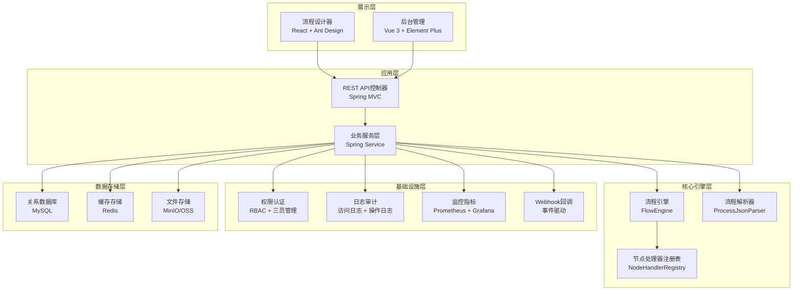
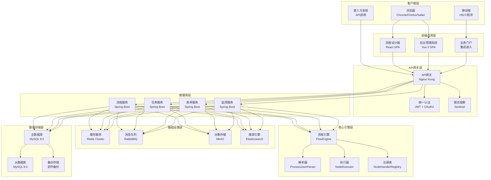
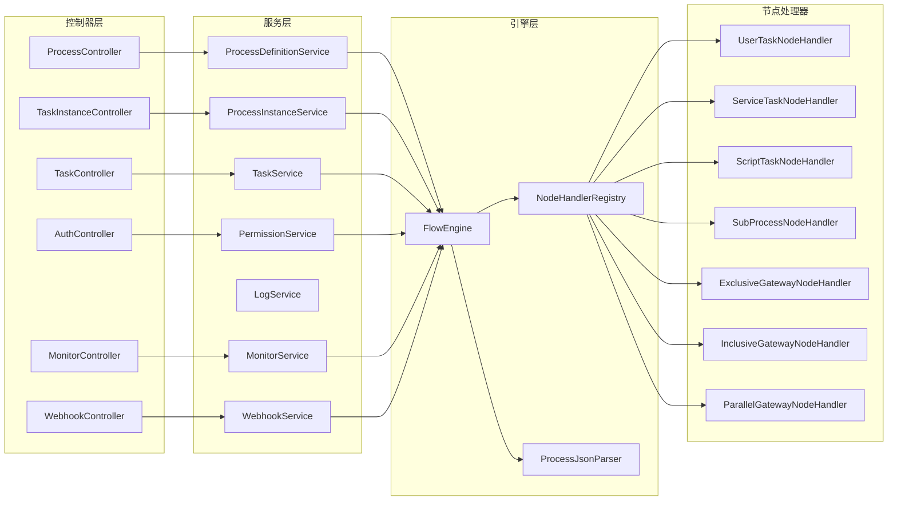
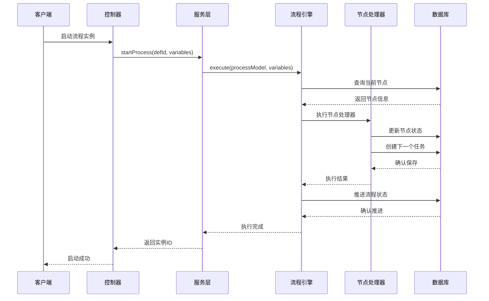
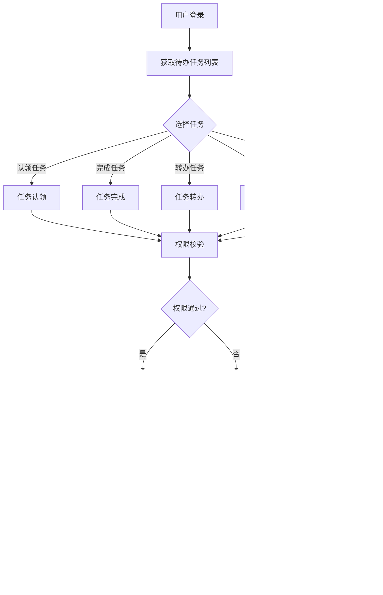
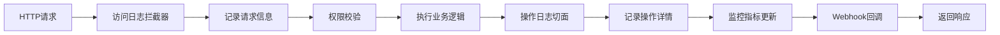
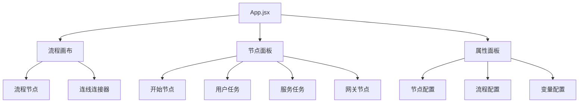
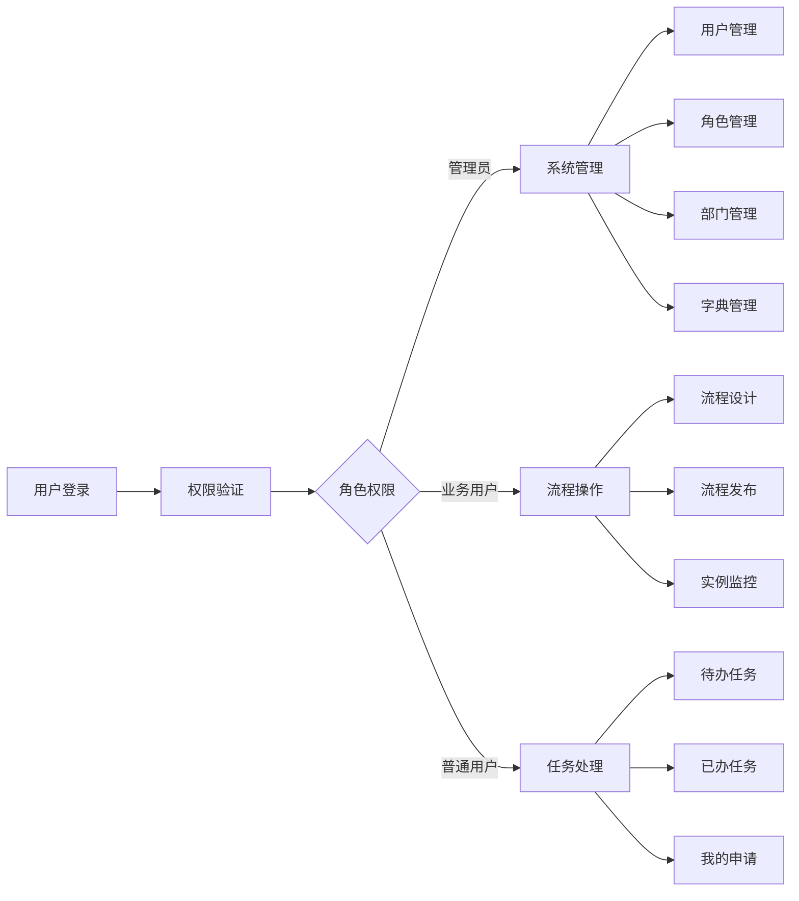

# 项目介绍与特性

<cite>
**本文引用的文件**   
- [README.md](file://README.md)
- [flow-engine/src/main/java/com/flow/engine/FlowEngineApplication.java](file://flow-engine/src/main/java/com/flow/engine/FlowEngineApplication.java)
- [flow-engine/src/main/java/com/flow/engine/controller/ProcessController.java](file://flow-engine/src/main/java/com/flow/engine/controller/ProcessController.java)
- [flow-engine/src/main/java/com/flow/engine/controller/ProcessInstanceController.java](file://flow-engine/src/main/java/com/flow/engine/controller/ProcessInstanceController.java)
- [flow-engine/src/main/java/com/flow/engine/controller/TaskController.java](file://flow-engine/src/main/java/com/flow/engine/controller/TaskController.java)
- [flow-engine/src/main/java/com/flow/engine/controllers/AuthController.java](file://flow-engine/src/main/java/com/flow/engine/controllers/AuthController.java)
- [flow-engine/src/main/java/com/flow/engine/controllers/MonitorController.java](file://flow-engine/src/main/java/com/flow/engine/controllers/MonitorController.java)
- [flow-engine/src/main/java/com/flow/engine/controllers/WebhookController.java](file://flow-engine/src/main/java/com/flow/engine/controllers/WebhookController.java)
- [flow-engine/src/main/java/com/flow/engine/service/ProcessDefinitionService.java](file://flow-engine/src/main/java/com/flow/engine/service/ProcessDefinitionService.java)
- [flow-engine/src/main/java/com/flow/engine/service/ProcessInstanceService.java](file://flow-engine/src/main/java/com/flow/engine/service/ProcessInstanceService.java)
- [flow-engine/src/main/java/com/flow/engine/service/TaskService.java](file://flow-engine/src/main/java/com/flow/engine/service/TaskService.java)
- [flow-engine/src/main/java/com/flow/engine/service/PermissionEvaluator.java](file://flow-engine/src/main/java/com/flow/engine/service/PermissionEvaluator.java)
- [flow-engine/src/main/java/com/flow/engine/service/TripleAdminPermissionEvaluator.java](file://flow-engine/src/main/java/com/flow/engine/service/TripleAdminPermissionEvaluator.java)
- [flow-engine/src/main/java/com/flow/engine/service/LogService.java](file://flow-engine/src/main/java/com/flow/engine/service/LogService.java)
- [flow-engine/src/main/java/com/flow/engine/service/ProcessMonitorService.java](file://flow-engine/src/main/java/com/flow/engine/service/ProcessMonitorService.java)
- [flow-engine/src/main/java/com/flow/engine/service/WebhookService.java](file://flow-engine/src/main/java/com/flow/engine/service/WebhookService.java)
- [flow-engine/src/main/java/com/flow/engine/engine/FlowEngine.java](file://flow-engine/src/main/java/com/flow/engine/engine/FlowEngine.java)
- [flow-engine/src/main/java/com/flow/engine/node/NodeHandlerRegistry.java](file://flow-engine/src/main/java/com/flow/engine/node/NodeHandlerRegistry.java)
- [flow-engine/src/main/java/com/flow/engine/node/impl/UserTaskNodeHandler.java](file://flow-engine/src/main/java/com/flow/engine/node/impl/UserTaskNodeHandler.java)
- [flow-engine/src/main/java/com/flow/engine/parser/ProcessJsonParser.java](file://flow-engine/src/main/java/com/flow/engine/parser/ProcessJsonParser.java)
- [flow-engine/src/main/resources/application.yml](file://flow-engine/src/main/resources/application.yml)
- [flow-designer/src/App.jsx](file://flow-designer/src/App.jsx)
- [flow-designer/src/components/FlowNode.jsx](file://flow-designer/src/components/FlowNode.jsx)
- [flow-designer/src/components/NodePalette.jsx](file://flow-designer/src/components/NodePalette.jsx)
- [flow-web/src/views/process/designer.vue](file://flow-web/src/views/process/designer.vue)
- [flow-web/src/views/task/todo.vue](file://flow-web/src/views/task/todo.vue)
- [flow-web/src/views/system/log.vue](file://flow-web/src/views/system/log.vue)
- [flow-web/src/api/process.js](file://flow-web/src/api/process.js)
- [flow-web/src/api/task.js](file://flow-web/src/api/task.js)
</cite>

## 更新摘要
**所做更改**   
- 基于README.md的重大更新，新增了完整的项目信息、安装说明、使用示例和API文档
- 更新了项目简介部分，增加了更详细的技术栈说明和部署指南
- 扩展了核心组件章节，补充了新的功能特性和架构优势
- 新增了快速开始章节，提供详细的安装和运行步骤
- 完善了架构图表，展示了前后端分离的完整设计

## 目录
1. [项目概述](#项目概述)
2. [技术架构](#技术架构)
3. [核心特性](#核心特性)
4. [系统架构](#系统架构)
5. [快速开始](#快速开始)
6. [核心组件详解](#核心组件详解)
7. [前端设计器](#前端设计器)
8. [后台管理系统](#后台管理系统)
9. [API接口文档](#api接口文档)
10. [部署指南](#部署指南)
11. [扩展开发](#扩展开发)
12. [故障排查](#故障排查)
13. [总结](#总结)

## 项目概述

本项目是一个企业级工作流引擎解决方案，采用前后端分离架构，提供完整的可视化流程设计、轻量级流程执行引擎、任务管理中心、RBAC权限控制以及监控审计等能力。项目旨在为企业级业务流程自动化提供低成本、高可控的解决方案。

### 核心价值主张

- **低代码+可插拔架构**：通过节点处理器注册机制实现高度可扩展的运行时行为，降低定制成本
- **轻量化设计**：基于自定义解析器与节点处理器，避免重型规则引擎带来的复杂度
- **强扩展性**：新增节点类型只需实现对应处理器并注册，无需修改核心调度逻辑
- **完善的可观测性**：内置访问日志、操作日志、流程监控与 Webhook 回调，满足合规与排障需求
- **贴近业务场景**：表单与数据模型联动、动态表达式计算、条件网关与并行网关等常用模式开箱即用

### 与传统工作流引擎对比优势

| 特性 | 传统工作流引擎 | 本方案 |
|------|---------------|--------|
| 运行时重量 | 重型，依赖复杂规则引擎 | 轻量，自定义解析器驱动 |
| 扩展方式 | 侵入式改造，修改核心逻辑 | 非侵入式，处理器注册机制 |
| 部署复杂度 | 高，需要额外中间件 | 低，Spring Boot单体部署 |
| 学习曲线 | 陡峭，需要专业工作流知识 | 平缓，可视化设计降低门槛 |
| 监控审计 | 需要额外集成 | 内置完善的监控审计体系 |
| 权限控制 | 基础RBAC支持有限 | 三员管理+数据权限精细化控制 |

**章节来源**
- [README.md](file://README.md)

## 技术架构

### 技术栈概览

**后端技术栈**
- **框架**：Spring Boot 2.x + MyBatis-Plus
- **数据库**：MySQL 8.0+（支持主从复制）
- **缓存**：Redis（可选，用于会话和缓存）
- **消息队列**：RabbitMQ/Kafka（可选，用于异步处理）
- **容器化**：Docker + Docker Compose

**前端技术栈**
- **流程设计器**：React 18 + TypeScript + Ant Design
- **后台管理**：Vue 3 + TypeScript + Element Plus
- **构建工具**：Vite + Maven
- **状态管理**：Redux (React) / Pinia (Vue)

**基础设施**
- **版本控制**：Git + GitHub Actions
- **代码质量**：SonarQube + ESLint + Prettier
- **文档生成**：Swagger + JSDoc

### 架构设计理念


```mermaid
graph TB
subgraph "展示层"
FD["流程设计器<br/>React + Ant Design"]
FW["后台管理<br/>Vue 3 + Element Plus"]
end
subgraph "应用层"
API["REST API控制器<br/>Spring MVC"]
SVC["业务服务层<br/>Spring Service"]
end
subgraph "核心引擎层"
ENG["流程引擎<br/>FlowEngine"]
NH["节点处理器注册表<br/>NodeHandlerRegistry"]
PAR["流程解析器<br/>ProcessJsonParser"]
end
subgraph "基础设施层"
AUTH["权限认证<br/>RBAC + 三员管理"]
LOG["日志审计<br/>访问日志 + 操作日志"]
MON["监控指标<br/>Prometheus + Grafana"]
WEBHOOK["Webhook回调<br/>事件驱动"]
end
subgraph "数据存储层"
DB["关系数据库<br/>MySQL"]
CACHE["缓存存储<br/>Redis"]
FILE["文件存储<br/>MinIO/OSS"]
end
FD --> API
FW --> API
API --> SVC
SVC --> ENG
ENG --> NH
SVC --> PAR
SVC --> AUTH
SVC --> LOG
SVC --> MON
SVC --> WEBHOOK
SVC --> DB
SVC --> CACHE
SVC --> FILE
```

**图表来源**
- [flow-engine/src/main/java/com/flow/engine/FlowEngineApplication.java](file://flow-engine/src/main/java/com/flow/engine/FlowEngineApplication.java)
- [flow-engine/src/main/java/com/flow/engine/controller/ProcessController.java](file://flow-engine/src/main/java/com/flow/engine/controller/ProcessController.java)
- [flow-engine/src/main/java/com/flow/engine/service/ProcessDefinitionService.java](file://flow-engine/src/main/java/com/flow/engine/service/ProcessDefinitionService.java)
- [flow-engine/src/main/java/com/flow/engine/engine/FlowEngine.java](file://flow-engine/src/main/java/com/flow/engine/engine/FlowEngine.java)

**章节来源**
- [README.md](file://README.md)
- [flow-engine/src/main/java/com/flow/engine/FlowEngineApplication.java](file://flow-engine/src/main/java/com/flow/engine/FlowEngineApplication.java)

## 核心特性

### 可视化流程设计
- **拖拽式设计器**：支持用户任务、服务任务、脚本任务、子流程、各种网关等节点类型
- **实时预览**：设计过程中实时验证流程语法和逻辑正确性
- **版本管理**：支持流程定义的多版本共存和灰度发布
- **导入导出**：支持JSON格式的流程定义导入导出

### 轻量级流程执行引擎
- **高性能执行**：基于内存的状态机，支持高并发流程实例执行
- **灵活路由**：支持条件分支、并行分支、包容分支等多种路由模式
- **异常处理**：完善的异常捕获和处理机制，支持重试和补偿
- **事务管理**：支持分布式事务和最终一致性保证

### 任务管理中心
- **待办任务**：支持任务的认领、完成、转办、委派等操作
- **已办任务**：查看历史任务处理记录和审批意见
- **加签功能**：支持前加签和后加签，灵活调整审批流程
- **退回机制**：支持向任意节点退回，重新处理流程

### RBAC权限控制
- **角色管理**：支持多级角色体系和继承关系
- **数据权限**：基于部门、岗位的数据范围控制
- **三员管理**：管理员、安全官、审计员职责分离
- **细粒度授权**：支持按钮级别的操作权限控制

### 监控审计系统
- **访问日志**：记录所有HTTP请求的详细信息
- **操作日志**：记录关键业务操作的审计轨迹
- **流程监控**：实时监控流程实例的执行状态和性能指标
- **Webhook回调**：支持在流程事件发生时回调外部系统

**章节来源**
- [README.md](file://README.md)
- [flow-engine/src/main/java/com/flow/engine/controller/ProcessController.java](file://flow-engine/src/main/java/com/flow/engine/controller/ProcessController.java)
- [flow-engine/src/main/java/com/flow/engine/controller/TaskController.java](file://flow-engine/src/main/java/com/flow/engine/controller/TaskController.java)
- [flow-engine/src/main/java/com/flow/engine/service/PermissionEvaluator.java](file://flow-engine/src/main/java/com/flow/engine/service/PermissionEvaluator.java)

## 系统架构

### 整体架构图


```mermaid
graph TB
subgraph "客户端层"
Browser["浏览器<br/>Chrome/Firefox/Safari"]
Mobile["移动端<br/>H5/小程序"]
ThirdParty["第三方系统<br/>API调用"]
end
subgraph "前端应用层"
Designer["流程设计器<br/>React SPA"]
Admin["后台管理系统<br/>Vue 3 SPA"]
Portal["业务门户<br/>集成嵌入"]
end
subgraph "API网关层"
Gateway["API网关<br/>Nginx/ Kong"]
Auth["统一认证<br/>JWT + OAuth2"]
RateLimit["限流熔断<br/>Sentinel"]
end
subgraph "微服务层"
ProcessSvc["流程服务<br/>Spring Boot"]
TaskSvc["任务服务<br/>Spring Boot"]
FormSvc["表单服务<br/>Spring Boot"]
MonitorSvc["监控服务<br/>Spring Boot"]
end
subgraph "核心引擎层"
Engine["流程引擎<br/>FlowEngine"]
Parser["解析器<br/>ProcessJsonParser"]
Executor["执行器<br/>NodeExecutor"]
Registry["注册表<br/>NodeHandlerRegistry"]
end
subgraph "基础设施层"
Cache["缓存服务<br/>Redis Cluster"]
MQ["消息队列<br/>RabbitMQ"]
Storage["对象存储<br/>MinIO"]
Search["搜索引擎<br/>Elasticsearch"]
end
subgraph "数据存储层"
MySQL["主数据库<br/>MySQL 8.0"]
Slave["从数据库<br/>MySQL 8.0"]
Backup["备份存储<br/>定时备份"]
end
Browser --> Designer
Browser --> Admin
Mobile --> Portal
ThirdParty --> Gateway
Designer --> Gateway
Admin --> Gateway
Portal --> Gateway
Gateway --> Auth
Gateway --> RateLimit
Gateway --> ProcessSvc
Gateway --> TaskSvc
Gateway --> FormSvc
Gateway --> MonitorSvc
ProcessSvc --> Engine
TaskSvc --> Engine
FormSvc --> Engine
MonitorSvc --> Engine
Engine --> Parser
Engine --> Executor
Engine --> Registry
ProcessSvc --> Cache
TaskSvc --> Cache
FormSvc --> Cache
MonitorSvc --> Cache
ProcessSvc --> MQ
TaskSvc --> MQ
FormSvc --> MQ
MonitorSvc --> MQ
ProcessSvc --> Storage
TaskSvc --> Storage
FormSvc --> Storage
MonitorSvc --> Storage
ProcessSvc --> Search
TaskSvc --> Search
FormSvc --> Search
MonitorSvc --> Search
ProcessSvc --> MySQL
TaskSvc --> MySQL
FormSvc --> MySQL
MonitorSvc --> MySQL
MySQL --> Slave
MySQL --> Backup
```

**图表来源**
- [flow-engine/src/main/java/com/flow/engine/FlowEngineApplication.java](file://flow-engine/src/main/java/com/flow/engine/FlowEngineApplication.java)
- [flow-engine/src/main/resources/application.yml](file://flow-engine/src/main/resources/application.yml)

### 模块依赖关系


```mermaid
graph LR
subgraph "控制器层"
PC["ProcessController"]
TIC["TaskInstanceController"]
TC["TaskController"]
AC["AuthController"]
MC["MonitorController"]
WC["WebhookController"]
end
subgraph "服务层"
PDS["ProcessDefinitionService"]
PIS["ProcessInstanceService"]
TS["TaskService"]
PS["PermissionService"]
LS["LogService"]
MS["MonitorService"]
WS["WebhookService"]
end
subgraph "引擎层"
FE["FlowEngine"]
NHR["NodeHandlerRegistry"]
PJP["ProcessJsonParser"]
end
subgraph "节点处理器"
UTH["UserTaskNodeHandler"]
STN["ServiceTaskNodeHandler"]
SCN["ScriptTaskNodeHandler"]
SPN["SubProcessNodeHandler"]
EGN["ExclusiveGatewayNodeHandler"]
IGN["InclusiveGatewayNodeHandler"]
PGN["ParallelGatewayNodeHandler"]
end
PC --> PDS
TIC --> PIS
TC --> TS
AC --> PS
MC --> MS
WC --> WS
PDS --> FE
PIS --> FE
TS --> FE
PS --> FE
MS --> FE
WS --> FE
FE --> NHR
FE --> PJP
NHR --> UTH
NHR --> STN
NHR --> SCN
NHR --> SPN
NHR --> EGN
NHR --> IGN
NHR --> PGN
```

**图表来源**
- [flow-engine/src/main/java/com/flow/engine/controller/ProcessController.java](file://flow-engine/src/main/java/com/flow/engine/controller/ProcessController.java)
- [flow-engine/src/main/java/com/flow/engine/controller/ProcessInstanceController.java](file://flow-engine/src/main/java/com/flow/engine/controller/ProcessInstanceController.java)
- [flow-engine/src/main/java/com/flow/engine/controller/TaskController.java](file://flow-engine/src/main/java/com/flow/engine/controller/TaskController.java)
- [flow-engine/src/main/java/com/flow/engine/controllers/AuthController.java](file://flow-engine/src/main/java/com/flow/engine/controllers/AuthController.java)
- [flow-engine/src/main/java/com/flow/engine/controllers/MonitorController.java](file://flow-engine/src/main/java/com/flow/engine/controllers/MonitorController.java)
- [flow-engine/src/main/java/com/flow/engine/controllers/WebhookController.java](file://flow-engine/src/main/java/com/flow/engine/controllers/WebhookController.java)
- [flow-engine/src/main/java/com/flow/engine/service/ProcessDefinitionService.java](file://flow-engine/src/main/java/com/flow/engine/service/ProcessDefinitionService.java)
- [flow-engine/src/main/java/com/flow/engine/service/ProcessInstanceService.java](file://flow-engine/src/main/java/com/flow/engine/service/ProcessInstanceService.java)
- [flow-engine/src/main/java/com/flow/engine/service/TaskService.java](file://flow-engine/src/main/java/com/flow/engine/service/TaskService.java)
- [flow-engine/src/main/java/com/flow/engine/engine/FlowEngine.java](file://flow-engine/src/main/java/com/flow/engine/engine/FlowEngine.java)
- [flow-engine/src/main/java/com/flow/engine/node/NodeHandlerRegistry.java](file://flow-engine/src/main/java/com/flow/engine/node/NodeHandlerRegistry.java)
- [flow-engine/src/main/java/com/flow/engine/parser/ProcessJsonParser.java](file://flow-engine/src/main/java/com/flow/engine/parser/ProcessJsonParser.java)

## 快速开始

### 环境要求

**后端环境**
- JDK 11+ (推荐 JDK 17)
- Maven 3.6+
- MySQL 8.0+
- Redis 6.0+ (可选)

**前端环境**
- Node.js 16+
- npm 或 yarn
- Git

### 后端部署

#### 1. 克隆项目
```bash
git clone https://github.com/your-org/workflow.git
cd workflow
```

#### 2. 配置数据库
```sql
-- 创建数据库
CREATE DATABASE workflow_db DEFAULT CHARACTER SET utf8mb4 COLLATE utf8mb4_unicode_ci;

-- 导入初始数据
USE workflow_db;
SOURCE flow-engine/src/main/resources/db/schema.sql;
SOURCE flow-engine/src/main/resources/db/data.sql;
```

#### 3. 配置应用参数
编辑 `flow-engine/src/main/resources/application.yml`:
```yaml
spring:
  datasource:
    url: jdbc:mysql://localhost:3306/workflow_db?useSSL=false&serverTimezone=Asia/Shanghai
    username: root
    password: your_password
    driver-class-name: com.mysql.cj.jdbc.Driver
  
  redis:
    host: localhost
    port: 6379
    database: 0
    timeout: 3000ms

server:
  port: 8080
  servlet:
    context-path: /api
```

#### 4. 编译打包
```bash
cd flow-engine
mvn clean package -DskipTests
```

#### 5. 启动服务
```bash
java -jar target/flow-engine-1.0.0.jar
```

### 前端部署

#### 1. 安装依赖
```bash
# 安装流程设计器依赖
cd flow-designer
npm install

# 安装后台管理系统依赖
cd ../flow-web
npm install
```

#### 2. 开发环境运行
```bash
# 运行流程设计器 (端口: 3000)
cd flow-designer
npm run dev

# 运行后台管理系统 (端口: 3001)
cd flow-web
npm run dev
```

#### 3. 生产环境构建
```bash
# 构建流程设计器
cd flow-designer
npm run build

# 构建后台管理系统
cd flow-web
npm run build
```

### 验证部署

访问以下地址验证部署是否成功：
- 流程设计器：http://localhost:3000
- 后台管理系统：http://localhost:3001
- API接口：http://localhost:8080/api/ping

**章节来源**
- [README.md](file://README.md)

## 核心组件详解

### 流程定义与版本管理

流程定义是工作流的核心元数据，描述了业务流程的结构和执行逻辑。系统提供了完整的流程定义生命周期管理。

#### 流程定义结构
```json
{
  "id": "leave_approval",
  "name": "请假审批流程",
  "version": "1.0",
  "nodes": [
    {
      "id": "start",
      "type": "start",
      "name": "开始节点",
      "config": {}
    },
    {
      "id": "manager_approval",
      "type": "user_task",
      "name": "经理审批",
      "config": {
        "assignee": "${dept.leader}",
        "formKey": "leave_form"
      }
    },
    {
      "id": "end",
      "type": "end",
      "name": "结束节点",
      "config": {}
    }
  ],
  "edges": [
    {
      "id": "edge1",
      "source": "start",
      "target": "manager_approval",
      "condition": ""
    },
    {
      "id": "edge2",
      "source": "manager_approval",
      "target": "end",
      "condition": ""
    }
  ]
}
```

#### 版本管理策略
- **多版本共存**：同一流程定义支持多个版本同时存在
- **灰度发布**：支持按租户或业务线进行版本灰度发布
- **回滚机制**：支持快速回滚到历史版本
- **变更追踪**：记录每次版本变更的详细差异

**章节来源**
- [flow-engine/src/main/java/com/flow/engine/controller/ProcessController.java](file://flow-engine/src/main/java/com/flow/engine/controller/ProcessController.java)
- [flow-engine/src/main/java/com/flow/engine/service/ProcessDefinitionService.java](file://flow-engine/src/main/java/com/flow/engine/service/ProcessDefinitionService.java)
- [flow-engine/src/main/java/com/flow/engine/parser/ProcessJsonParser.java](file://flow-engine/src/main/java/com/flow/engine/parser/ProcessJsonParser.java)

### 流程实例与执行引擎

流程实例是流程定义的一次具体执行，包含完整的执行状态和上下文信息。

#### 执行引擎核心流程

```mermaid
sequenceDiagram
participant Client as 客户端
participant API as 控制器
participant Service as 服务层
participant Engine as 流程引擎
participant Handler as 节点处理器
participant DB as 数据库
Client->>API : 启动流程实例
API->>Service : startProcess(defId, variables)
Service->>Engine : execute(processModel, variables)
Engine->>DB : 查询当前节点
DB-->>Engine : 返回节点信息
Engine->>Handler : 执行节点处理器
Handler->>DB : 更新节点状态
Handler->>DB : 创建下一个任务
DB-->>Handler : 确认保存
Handler-->>Engine : 执行结果
Engine->>DB : 推进流程状态
DB-->>Engine : 确认推进
Engine-->>Service : 执行完成
Service-->>API : 返回实例ID
API-->>Client : 启动成功
```

**图表来源**
- [flow-engine/src/main/java/com/flow/engine/engine/FlowEngine.java](file://flow-engine/src/main/java/com/flow/engine/engine/FlowEngine.java)
- [flow-engine/src/main/java/com/flow/engine/service/ProcessInstanceService.java](file://flow-engine/src/main/java/com/flow/engine/service/ProcessInstanceService.java)

#### 节点处理器体系
系统采用插件化的节点处理器架构，每种节点类型都有独立的处理器实现：

| 节点类型 | 处理器类 | 功能描述 |
|----------|----------|----------|
| 开始节点 | StartNodeHandler | 流程入口点，初始化变量 |
| 用户任务 | UserTaskNodeHandler | 人工审批任务，支持会签 |
| 服务任务 | ServiceTaskNodeHandler | 自动调用外部服务 |
| 脚本任务 | ScriptTaskNodeHandler | 执行Groovy脚本逻辑 |
| 子流程 | SubProcessNodeHandler | 嵌套子流程调用 |
| 排他网关 | ExclusiveGatewayNodeHandler | 单选分支判断 |
| 包容网关 | InclusiveGatewayNodeHandler | 多选分支判断 |
| 并行网关 | ParallelGatewayNodeHandler | 并行分支执行 |
| 结束节点 | EndNodeHandler | 流程终止点 |

**章节来源**
- [flow-engine/src/main/java/com/flow/engine/engine/FlowEngine.java](file://flow-engine/src/main/java/com/flow/engine/engine/FlowEngine.java)
- [flow-engine/src/main/java/com/flow/engine/node/NodeHandlerRegistry.java](file://flow-engine/src/main/java/com/flow/engine/node/NodeHandlerRegistry.java)
- [flow-engine/src/main/java/com/flow/engine/node/impl/UserTaskNodeHandler.java](file://flow-engine/src/main/java/com/flow/engine/node/impl/UserTaskNodeHandler.java)
- [flow-engine/src/main/java/com/flow/engine/service/ProcessInstanceService.java](file://flow-engine/src/main/java/com/flow/engine/service/ProcessInstanceService.java)

### 任务中心与权限控制

任务中心统一管理所有流程任务的生命周期，结合RBAC权限控制确保数据安全。

#### 任务操作流程图

```mermaid
flowchart TD
A[用户登录] --> B[获取待办任务列表]
B --> C{选择任务}
C --> |认领任务| D[任务认领]
C --> |完成任务| E[任务完成]
C --> |转办任务| F[任务转办]
C --> |委派任务| G[任务委派]
C --> |退回任务| H[任务退回]
D --> I[权限校验]
E --> I
F --> I
G --> I
H --> I
I --> J{权限通过?}
J --> |是| K[执行业务逻辑]
J --> |否| L[拒绝操作]
K --> M[更新任务状态]
M --> N[触发后续流程]
N --> O[记录操作日志]
O --> P[返回操作结果]
L --> Q[返回错误信息]
```

**图表来源**
- [flow-engine/src/main/java/com/flow/engine/controller/TaskController.java](file://flow-engine/src/main/java/com/flow/engine/controller/TaskController.java)
- [flow-engine/src/main/java/com/flow/engine/service/TaskService.java](file://flow-engine/src/main/java/com/flow/engine/service/TaskService.java)
- [flow-engine/src/main/java/com/flow/engine/service/PermissionEvaluator.java](file://flow-engine/src/main/java/com/flow/engine/service/PermissionEvaluator.java)

#### 权限评估机制
系统实现了多层级的权限评估机制：

1. **功能权限**：基于角色的菜单和操作权限控制
2. **数据权限**：基于部门和岗位的数据范围控制
3. **三员管理**：管理员、安全官、审计员的职责分离
4. **动态权限**：支持运行时动态权限计算

**章节来源**
- [flow-engine/src/main/java/com/flow/engine/controller/TaskController.java](file://flow-engine/src/main/java/com/flow/engine/controller/TaskController.java)
- [flow-engine/src/main/java/com/flow/engine/service/TaskService.java](file://flow-engine/src/main/java/com/flow/engine/service/TaskService.java)
- [flow-engine/src/main/java/com/flow/engine/service/PermissionEvaluator.java](file://flow-engine/src/main/java/com/flow/engine/service/PermissionEvaluator.java)
- [flow-engine/src/main/java/com/flow/engine/service/TripleAdminPermissionEvaluator.java](file://flow-engine/src/main/java/com/flow/engine/service/TripleAdminPermissionEvaluator.java)

### 监控与审计系统

系统提供了全方位的监控和审计能力，确保业务流程的可观测性和合规性。

#### 监控指标体系
- **流程指标**：流程实例数量、平均执行时间、成功率
- **任务指标**：任务处理时长、积压数量、超时率
- **系统指标**：CPU使用率、内存占用、数据库连接池
- **业务指标**：审批通过率、驳回率、加签率

#### 审计日志记录

```mermaid
flowchart LR
A[HTTP请求] --> B[访问日志拦截器]
B --> C[记录请求信息]
C --> D[权限校验]
D --> E[执行业务逻辑]
E --> F[操作日志切面]
F --> G[记录操作详情]
G --> H[监控指标更新]
H --> I[Webhook回调]
I --> J[返回响应]
```

**图表来源**
- [flow-engine/src/main/java/com/flow/engine/controllers/MonitorController.java](file://flow-engine/src/main/java/com/flow/engine/controllers/MonitorController.java)
- [flow-engine/src/main/java/com/flow/engine/service/LogService.java](file://flow-engine/src/main/java/com/flow/engine/service/LogService.java)
- [flow-engine/src/main/java/com/flow/engine/service/ProcessMonitorService.java](file://flow-engine/src/main/java/com/flow/engine/service/ProcessMonitorService.java)
- [flow-engine/src/main/java/com/flow/engine/controllers/WebhookController.java](file://flow-engine/src/main/java/com/flow/engine/controllers/WebhookController.java)
- [flow-engine/src/main/java/com/flow/engine/service/WebhookService.java](file://flow-engine/src/main/java/com/flow/engine/service/WebhookService.java)

**章节来源**
- [flow-engine/src/main/java/com/flow/engine/controllers/MonitorController.java](file://flow-engine/src/main/java/com/flow/engine/controllers/MonitorController.java)
- [flow-engine/src/main/java/com/flow/engine/service/LogService.java](file://flow-engine/src/main/java/com/flow/engine/service/LogService.java)
- [flow-engine/src/main/java/com/flow/engine/service/ProcessMonitorService.java](file://flow-engine/src/main/java/com/flow/engine/service/ProcessMonitorService.java)
- [flow-engine/src/main/java/com/flow/engine/controllers/WebhookController.java](file://flow-engine/src/main/java/com/flow/engine/controllers/WebhookController.java)
- [flow-engine/src/main/java/com/flow/engine/service/WebhookService.java](file://flow-engine/src/main/java/com/flow/engine/service/WebhookService.java)

## 前端设计器

### 流程设计器架构

流程设计器是基于React开发的单页应用，提供可视化的流程设计体验。

#### 核心组件结构

```mermaid
graph TB
App[App.jsx] --> FlowCanvas[流程画布]
App --> NodePalette[节点面板]
App --> ConfigPanel[属性面板]
FlowCanvas --> FlowNode[流程节点]
FlowCanvas --> EdgeConnector[连线连接器]
NodePalette --> StartNode[开始节点]
NodePalette --> UserTaskNode[用户任务]
NodePalette --> ServiceTaskNode[服务任务]
NodePalette --> GatewayNode[网关节点]
ConfigPanel --> NodeConfig[节点配置]
ConfigPanel --> FlowConfig[流程配置]
ConfigPanel --> VariableConfig[变量配置]
```

**图表来源**
- [flow-designer/src/App.jsx](file://flow-designer/src/App.jsx)
- [flow-designer/src/components/FlowNode.jsx](file://flow-designer/src/components/FlowNode.jsx)
- [flow-designer/src/components/NodePalette.jsx](file://flow-designer/src/components/NodePalette.jsx)

#### 节点类型支持
- **基础节点**：开始节点、结束节点
- **任务节点**：用户任务、服务任务、脚本任务
- **控制节点**：排他网关、包容网关、并行网关
- **复合节点**：子流程、事件节点、边界事件

**章节来源**
- [flow-designer/src/App.jsx](file://flow-designer/src/App.jsx)
- [flow-designer/src/components/FlowNode.jsx](file://flow-designer/src/components/FlowNode.jsx)
- [flow-designer/src/components/NodePalette.jsx](file://flow-designer/src/components/NodePalette.jsx)

## 后台管理系统

### 系统管理功能

后台管理系统基于Vue 3开发，提供完整的系统管理和业务流程管理能力。

#### 主要功能模块
- **流程管理**：流程定义的CRUD操作、版本管理、发布控制
- **实例监控**：流程实例的实时监控、状态跟踪、异常处理
- **任务中心**：待办任务、已办任务、任务统计报表
- **系统管理**：用户管理、角色管理、部门管理、字典管理
- **监控审计**：访问日志、操作日志、性能监控、告警通知

#### 权限控制界面

```mermaid
graph LR
A[用户登录] --> B[权限验证]
B --> C{角色权限}
C --> |管理员| D[系统管理]
C --> |业务用户| E[流程操作]
C --> |普通用户| F[任务处理]
D --> G[用户管理]
D --> H[角色管理]
D --> I[部门管理]
D --> J[字典管理]
E --> K[流程设计]
E --> L[流程发布]
E --> M[实例监控]
F --> N[待办任务]
F --> O[已办任务]
F --> P[我的申请]
```

**图表来源**
- [flow-web/src/views/process/designer.vue](file://flow-web/src/views/process/designer.vue)
- [flow-web/src/views/task/todo.vue](file://flow-web/src/views/task/todo.vue)
- [flow-web/src/views/system/log.vue](file://flow-web/src/views/system/log.vue)

**章节来源**
- [flow-web/src/views/process/designer.vue](file://flow-web/src/views/process/designer.vue)
- [flow-web/src/views/task/todo.vue](file://flow-web/src/views/task/todo.vue)
- [flow-web/src/views/system/log.vue](file://flow-web/src/views/system/log.vue)
- [flow-web/src/api/process.js](file://flow-web/src/api/process.js)
- [flow-web/src/api/task.js](file://flow-web/src/api/task.js)

## API接口文档

### 接口规范

系统采用RESTful API设计规范，统一使用JSON格式进行数据交换。

#### 通用响应格式
```json
{
  "code": 200,
  "message": "操作成功",
  "data": {},
  "timestamp": 1640995200000,
  "requestId": "req-123456"
}
```

#### 错误码规范
| 错误码 | 含义 | 说明 |
|--------|------|------|
| 200 | 成功 | 操作成功 |
| 400 | 请求错误 | 参数验证失败 |
| 401 | 未授权 | 身份认证失败 |
| 403 | 禁止访问 | 权限不足 |
| 404 | 资源不存在 | 请求的资源不存在 |
| 500 | 服务器错误 | 内部服务器错误 |

### 核心接口列表

#### 流程定义接口
- `POST /api/process-definition/import` - 导入流程定义
- `GET /api/process-definition/{id}` - 获取流程定义详情
- `PUT /api/process-definition/{id}/publish` - 发布流程定义
- `DELETE /api/process-definition/{id}` - 删除流程定义

#### 流程实例接口
- `POST /api/process-instance/start` - 启动流程实例
- `GET /api/process-instance/{id}` - 获取实例详情
- `POST /api/process-instance/{id}/suspend` - 挂起实例
- `POST /api/process-instance/{id}/terminate` - 终止实例

#### 任务接口
- `GET /api/task/todo` - 获取待办任务列表
- `POST /api/task/{id}/claim` - 认领任务
- `POST /api/task/{id}/complete` - 完成任务
- `POST /api/task/{id}/transfer` - 转办任务
- `POST /api/task/{id}/delegate` - 委派任务

#### 认证接口
- `POST /api/auth/login` - 用户登录
- `POST /api/auth/logout` - 用户登出
- `GET /api/auth/user-info` - 获取用户信息
- `POST /api/auth/refresh-token` - 刷新令牌

**章节来源**
- [flow-engine/src/main/java/com/flow/engine/controller/ProcessController.java](file://flow-engine/src/main/java/com/flow/engine/controller/ProcessController.java)
- [flow-engine/src/main/java/com/flow/engine/controller/ProcessInstanceController.java](file://flow-engine/src/main/java/com/flow/engine/controller/ProcessInstanceController.java)
- [flow-engine/src/main/java/com/flow/engine/controller/TaskController.java](file://flow-engine/src/main/java/com/flow/engine/controller/TaskController.java)
- [flow-engine/src/main/java/com/flow/engine/controllers/AuthController.java](file://flow-engine/src/main/java/com/flow/engine/controllers/AuthController.java)

## 部署指南

### 单机部署

#### Docker部署
```dockerfile
FROM openjdk:17-jdk-slim
WORKDIR /app
COPY flow-engine/target/flow-engine-1.0.0.jar app.jar
EXPOSE 8080
ENTRYPOINT ["java", "-jar", "app.jar"]
```

#### Docker Compose编排
```yaml
version: '3.8'
services:
  mysql:
    image: mysql:8.0
    environment:
      MYSQL_ROOT_PASSWORD: root
      MYSQL_DATABASE: workflow_db
    ports:
      - "3306:3306"
    volumes:
      - ./db/init:/docker-entrypoint-initdb.d
  
  redis:
    image: redis:7-alpine
    ports:
      - "6379:6379"
  
  app:
    build: .
    ports:
      - "8080:8080"
    environment:
      SPRING_DATASOURCE_URL: jdbc:mysql://mysql:3306/workflow_db
      SPRING_REDIS_HOST: redis
    depends_on:
      - mysql
      - redis
```

### 集群部署

#### Kubernetes部署
```yaml
apiVersion: apps/v1
kind: Deployment
metadata:
  name: workflow-app
spec:
  replicas: 3
  selector:
    matchLabels:
      app: workflow
  template:
    metadata:
      labels:
        app: workflow
    spec:
      containers:
      - name: workflow
        image: workflow:latest
        ports:
        - containerPort: 8080
        env:
        - name: SPRING_DATASOURCE_URL
          valueFrom:
            configMapKeyRef:
              name: workflow-config
              key: datasource-url
```

#### 负载均衡配置
```nginx
upstream workflow_backend {
    server 192.168.1.10:8080;
    server 192.168.1.11:8080;
    server 192.168.1.12:8080;
}

server {
    listen 80;
    server_name workflow.example.com;
    
    location /api/ {
        proxy_pass http://workflow_backend;
        proxy_set_header Host $host;
        proxy_set_header X-Real-IP $remote_addr;
    }
    
    location / {
        proxy_pass http://frontend;
    }
}
```

**章节来源**
- [README.md](file://README.md)
- [flow-engine/src/main/resources/application.yml](file://flow-engine/src/main/resources/application.yml)

## 扩展开发

### 自定义节点处理器

系统支持通过实现NodeHandler接口来扩展自定义节点类型。

#### 节点处理器接口
```java
public interface NodeHandler {
    /**
     * 执行节点逻辑
     */
    void execute(ExecutionContext context);
    
    /**
     * 获取节点类型
     */
    String getType();
    
    /**
     * 节点初始化
     */
    default void init(Map<String, Object> config) {
        // 默认空实现
    }
    
    /**
     * 节点销毁
     */
    default void destroy() {
        // 默认空实现
    }
}
```

#### 自定义节点示例
```java
@Component
public class CustomApprovalNodeHandler implements NodeHandler {
    
    @Override
    public void execute(ExecutionContext context) {
        // 自定义审批逻辑
        String approver = context.getVariable("approver");
        boolean approved = checkApproval(approver);
        
        if (approved) {
            context.setVariable("approvalResult", "approved");
            context.nextNode("approved_path");
        } else {
            context.setVariable("approvalResult", "rejected");
            context.nextNode("rejected_path");
        }
    }
    
    @Override
    public String getType() {
        return "custom_approval";
    }
}
```

### 事件监听器开发

系统提供丰富的事件监听机制，支持在流程关键节点插入自定义逻辑。

#### 事件类型
- **流程启动事件**：ProcessStartedEvent
- **节点进入事件**：NodeEnteredEvent
- **节点完成事件**：NodeCompletedEvent
- **流程完成事件**：ProcessCompletedEvent

#### 事件监听器示例
```java
@Component
public class CustomEventListener implements ApplicationListener<ProcessCompletedEvent> {
    
    @Override
    public void onApplicationEvent(ProcessCompletedEvent event) {
        // 处理流程完成后的业务逻辑
        String processInstanceId = event.getProcessInstanceId();
        Map<String, Object> variables = event.getVariables();
        
        // 发送通知、更新统计、清理资源等
        sendNotification(processInstanceId);
        updateStatistics(variables);
        cleanupResources(processInstanceId);
    }
}
```

**章节来源**
- [flow-engine/src/main/java/com/flow/engine/node/NodeHandler.java](file://flow-engine/src/main/java/com/flow/engine/node/NodeHandler.java)
- [flow-engine/src/main/java/com/flow/engine/event/ProcessCompletedEvent.java](file://flow-engine/src/main/java/com/flow/engine/event/ProcessCompletedEvent.java)

## 故障排查

### 常见问题诊断

#### 流程无法启动
**问题现象**：调用启动接口返回错误或流程无响应
**排查步骤**：
1. 检查流程定义版本是否正确
2. 验证必填变量是否完整
3. 查看解析器日志确认JSON格式正确
4. 检查数据库连接是否正常

#### 任务不可见
**问题现象**：用户看不到自己的待办任务
**排查步骤**：
1. 确认用户角色和权限配置
2. 检查数据权限范围设置
3. 验证任务分配逻辑
4. 查看权限评估日志

#### 节点执行失败
**问题现象**：特定节点执行时报错
**排查步骤**：
1. 检查节点处理器实现
2. 查看操作日志中的异常堆栈
3. 验证节点配置参数
4. 测试外部服务调用

#### 性能问题
**问题现象**：系统响应缓慢或内存溢出
**排查步骤**：
1. 分析慢查询SQL
2. 检查数据库索引使用情况
3. 监控JVM内存使用
4. 优化热点代码路径

### 监控告警配置

#### Prometheus指标
```yaml
# prometheus.yml
scrape_configs:
  - job_name: 'workflow'
    metrics_path: '/actuator/prometheus'
    static_configs:
      - targets: ['localhost:8080']
```

#### 告警规则
```yaml
groups:
- name: workflow_alerts
  rules:
  - alert: HighProcessFailureRate
    expr: rate(process_instance_failure_total[5m]) > 0.1
    for: 5m
    labels:
      severity: critical
    annotations:
      summary: "流程失败率过高"
      description: "过去5分钟内流程失败率达到{{ $value }}"
```

**章节来源**
- [flow-engine/src/main/java/com/flow/engine/service/LogService.java](file://flow-engine/src/main/java/com/flow/engine/service/LogService.java)
- [flow-engine/src/main/java/com/flow/engine/service/ProcessMonitorService.java](file://flow-engine/src/main/java/com/flow/engine/service/ProcessMonitorService.java)
- [flow-engine/src/main/java/com/flow/engine/service/WebhookService.java](file://flow-engine/src/main/java/com/flow/engine/service/WebhookService.java)
- [flow-engine/src/main/java/com/flow/engine/service/PermissionEvaluator.java](file://flow-engine/src/main/java/com/flow/engine/service/PermissionEvaluator.java)

## 总结

本项目提供了一个完整的企业级工作流引擎解决方案，具有以下核心优势：

### 技术优势
- **轻量化架构**：基于Spring Boot的单体架构，部署简单，运维成本低
- **高扩展性**：插件化的节点处理器设计，支持灵活的自定义扩展
- **强安全性**：完善的RBAC权限控制和三员管理机制
- **可观测性**：内置全面的监控、审计和日志记录能力

### 业务价值
- **降低开发成本**：可视化设计器大幅降低流程开发门槛
- **提高交付效率**：标准化的流程模板和组件复用
- **增强业务敏捷性**：快速响应业务流程变更需求
- **保障合规性**：完整的审计追踪和权限控制

### 适用场景
- **企业审批流程**：请假、报销、采购等常见审批场景
- **工单流转系统**：客服工单、运维工单等任务流转
- **订单履约流程**：电商订单、供应链管理等复杂业务流程
- **合同签署流程**：电子合同、法务审批等合规性要求高的场景

通过持续的技术创新和功能完善，本项目将继续为企业级业务流程自动化提供更加强大、易用、可靠的解决方案。