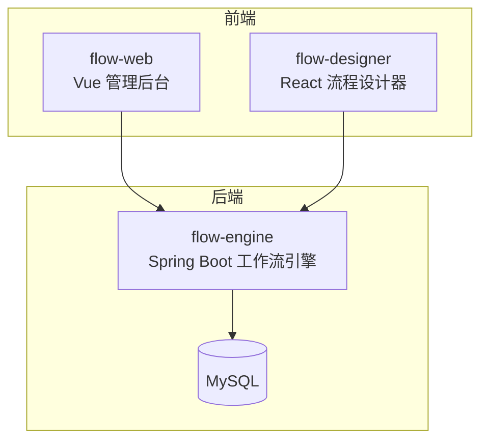
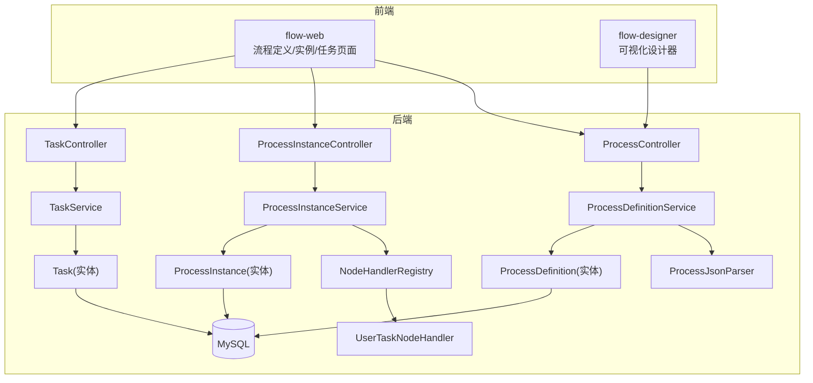
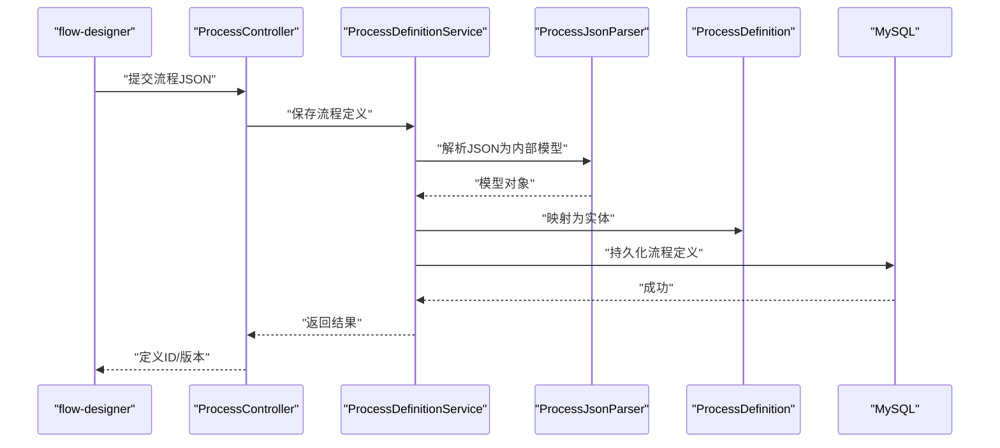
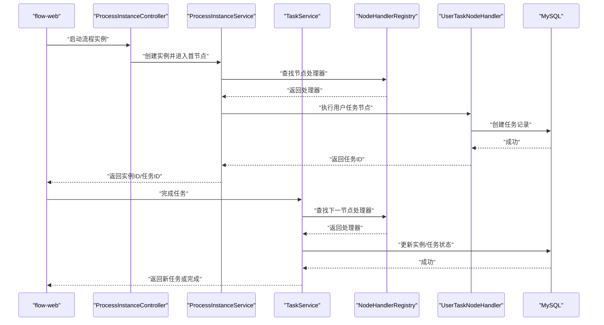
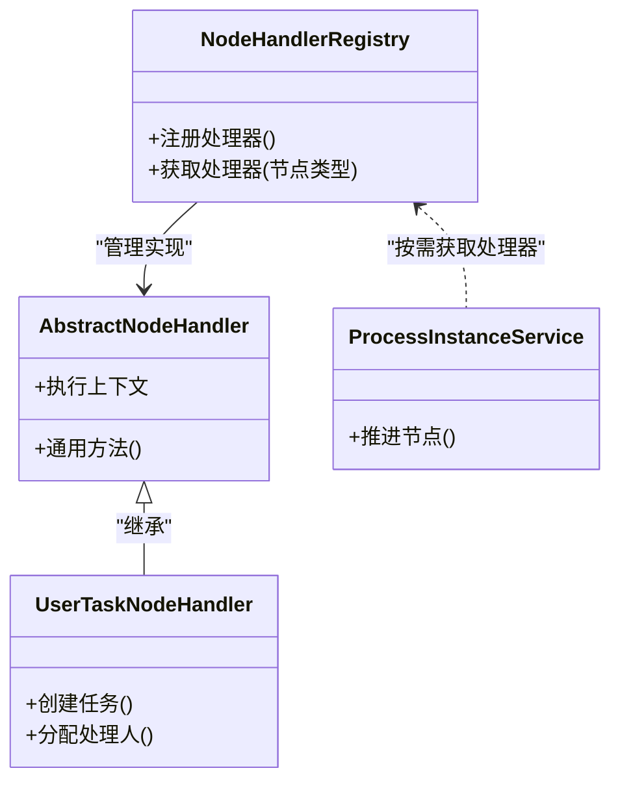
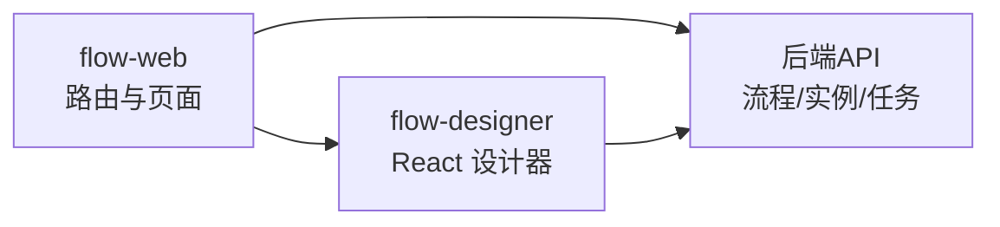
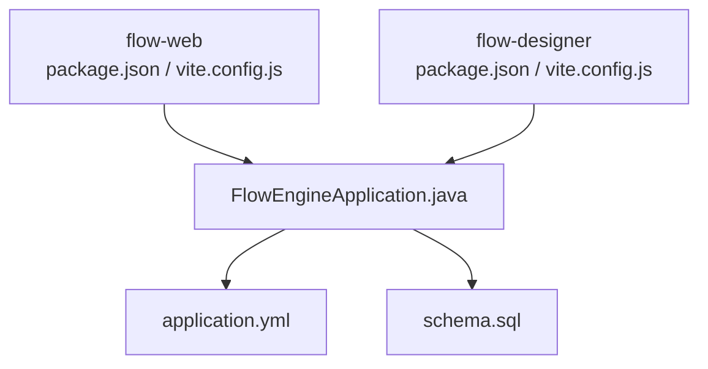

# 项目概述

<cite>
**本文引用的文件**   
- [flow-engine/pom.xml](file://flow-engine/pom.xml)
- [flow-engine/src/main/java/com/flow/engine/FlowEngineApplication.java](file://flow-engine/src/main/java/com/flow/engine/FlowEngineApplication.java)
- [flow-engine/src/main/resources/application.yml](file://flow-engine/src/main/resources/application.yml)
- [flow-engine/src/main/resources/db/schema.sql](file://flow-engine/src/main/resources/db/schema.sql)
- [flow-engine/src/main/java/com/flow/engine/controller/ProcessController.java](file://flow-engine/src/main/java/com/flow/engine/controller/ProcessController.java)
- [flow-engine/src/main/java/com/flow/engine/controller/ProcessInstanceController.java](file://flow-engine/src/main/java/com/flow/engine/controller/ProcessInstanceController.java)
- [flow-engine/src/main/java/com/flow/engine/controller/TaskController.java](file://flow-engine/src/main/java/com/flow/engine/controller/TaskController.java)
- [flow-engine/src/main/java/com/flow/engine/service/ProcessDefinitionService.java](file://flow-engine/src/main/java/com/flow/engine/service/ProcessDefinitionService.java)
- [flow-engine/src/main/java/com/flow/engine/service/ProcessInstanceService.java](file://flow-engine/src/main/java/com/flow/engine/service/ProcessInstanceService.java)
- [flow-engine/src/main/java/com/flow/engine/service/TaskService.java](file://flow-engine/src/main/java/com/flow/engine/service/TaskService.java)
- [flow-engine/src/main/java/com/flow/engine/node/NodeHandlerRegistry.java](file://flow-engine/src/main/java/com/flow/engine/node/NodeHandlerRegistry.java)
- [flow-engine/src/main/java/com/flow/engine/node/impl/UserTaskNodeHandler.java](file://flow-engine/src/main/java/com/flow/engine/node/impl/UserTaskNodeHandler.java)
- [flow-engine/src/main/java/com/flow/engine/parser/ProcessJsonParser.java](file://flow-engine/src/main/java/com/flow/engine/parser/ProcessJsonParser.java)
- [flow-engine/src/main/java/com/flow/engine/entity/ProcessDefinition.java](file://flow-engine/src/main/java/com/flow/engine/entity/ProcessDefinition.java)
- [flow-engine/src/main/java/com/flow/engine/entity/ProcessInstance.java](file://flow-engine/src/main/java/com/flow/engine/entity/ProcessInstance.java)
- [flow-engine/src/main/java/com/flow/engine/entity/Task.java](file://flow-engine/src/main/java/com/flow/engine/entity/Task.java)
- [flow-engine/src/main/java/com/flow/engine/common/GlobalExceptionHandler.java](file://flow-engine/src/main/java/com/flow/engine/common/GlobalExceptionHandler.java)
- [flow-engine/src/main/java/com/flow/engine/config/WebMvcConfig.java](file://flow-engine/src/main/java/com/flow/engine/config/WebMvcConfig.java)
- [flow-web/package.json](file://flow-web/package.json)
- [flow-web/vite.config.js](file://flow-web/vite.config.js)
- [flow-web/src/router/index.js](file://flow-web/src/router/index.js)
- [flow-web/src/api/process.js](file://flow-web/src/api/process.js)
- [flow-web/src/views/process/designer.vue](file://flow-web/src/views/process/designer.vue)
- [flow-designer/package.json](file://flow-designer/package.json)
- [flow-designer/vite.config.js](file://flow-designer/vite.config.js)
- [flow-designer/src/App.jsx](file://flow-designer/src/App.jsx)
- [flow-designer/src/components/FlowNode.jsx](file://flow-designer/src/components/FlowNode.jsx)
- [flow-designer/src/components/NodePalette.jsx](file://flow-designer/src/components/NodePalette.jsx)
</cite>

## 目录
1. [简介](#简介)
2. [项目结构](#项目结构)
3. [核心组件](#核心组件)
4. [架构总览](#架构总览)
5. [详细组件分析](#详细组件分析)
6. [依赖关系分析](#依赖关系分析)
7. [性能考虑](#性能考虑)
8. [故障排查指南](#故障排查指南)
9. [结论](#结论)
10. [附录：快速开始](#附录快速开始)

## 简介
本项目是一个基于 Spring Boot 的轻量级工作流引擎，提供可视化流程设计、任务管理、权限控制等核心能力。系统采用前后端分离架构，包含以下三个主要部分：
- flow-engine：后端服务，负责流程定义、实例运行、任务调度与权限校验等核心逻辑。
- flow-web：管理后台（Vue），用于流程建模、实例监控、任务处理与系统管理。
- flow-designer：独立的前端流程设计器组件，可被其他应用集成复用。

技术栈概览：
- 后端：Spring Boot、MyBatis-Plus、MySQL、可选缓存与会话配置。
- 前端：Vue 3 + Vite（管理后台）、React + Vite（流程设计器）。
- 数据持久化：MySQL（通过 schema.sql 初始化表结构）。
- 扩展点：节点处理器注册机制，支持自定义业务节点。

## 项目结构
仓库采用多模块组织方式，按职责拆分为后端服务与管理端、设计器两个前端工程：
- flow-engine：Spring Boot 应用，包含控制器、服务层、实体模型、解析器、节点执行器、异常处理与全局配置等。
- flow-web：Vue 管理后台，提供流程定义、实例、任务与系统管理的页面与 API 调用封装。
- flow-designer：独立的 React 流程设计器，提供拖拽式画布、节点面板与配置面板等。

图表来源
- [flow-engine/src/main/java/com/flow/engine/FlowEngineApplication.java](file://flow-engine/src/main/java/com/flow/engine/FlowEngineApplication.java)
- [flow-engine/src/main/resources/application.yml](file://flow-engine/src/main/resources/application.yml)
- [flow-engine/src/main/resources/db/schema.sql](file://flow-engine/src/main/resources/db/schema.sql)
- [flow-web/package.json](file://flow-web/package.json)
- [flow-designer/package.json](file://flow-designer/package.json)

章节来源
- [flow-engine/pom.xml](file://flow-engine/pom.xml)
- [flow-engine/src/main/java/com/flow/engine/FlowEngineApplication.java](file://flow-engine/src/main/java/com/flow/engine/FlowEngineApplication.java)
- [flow-engine/src/main/resources/application.yml](file://flow-engine/src/main/resources/application.yml)
- [flow-engine/src/main/resources/db/schema.sql](file://flow-engine/src/main/resources/db/schema.sql)
- [flow-web/package.json](file://flow-web/package.json)
- [flow-web/vite.config.js](file://flow-web/vite.config.js)
- [flow-designer/package.json](file://flow-designer/package.json)
- [flow-designer/vite.config.js](file://flow-designer/package.json)

## 核心组件
- 流程定义与实例
  - 流程定义：描述流程的节点、边与元信息，供设计器生成 JSON 并持久化。
  - 流程实例：一次流程运行的状态机，记录当前活动节点、变量与生命周期事件。
- 任务中心
  - 待办/已办任务查询、认领、委派、转派、完成、驳回等操作。
- 节点执行器
  - 内置用户任务、网关、脚本、子流程、结束等节点类型；通过 NodeHandlerRegistry 自动注册与扩展。
- 解析器
  - 将设计器产出的流程 JSON 解析为内部模型，驱动引擎执行。
- 权限与审计
  - 三员管理、角色权限、表单权限计算；操作日志与访问日志拦截。
- 统一异常与响应
  - GlobalExceptionHandler 统一错误码与返回体格式。

章节来源
- [flow-engine/src/main/java/com/flow/engine/controller/ProcessController.java](file://flow-engine/src/main/java/com/flow/engine/controller/ProcessController.java)
- [flow-engine/src/main/java/com/flow/engine/controller/ProcessInstanceController.java](file://flow-engine/src/main/java/com/flow/engine/controller/ProcessInstanceController.java)
- [flow-engine/src/main/java/com/flow/engine/controller/TaskController.java](file://flow-engine/src/main/java/com/flow/engine/controller/TaskController.java)
- [flow-engine/src/main/java/com/flow/engine/service/ProcessDefinitionService.java](file://flow-engine/src/main/java/com/flow/engine/service/ProcessDefinitionService.java)
- [flow-engine/src/main/java/com/flow/engine/service/ProcessInstanceService.java](file://flow-engine/src/main/java/com/flow/engine/service/ProcessInstanceService.java)
- [flow-engine/src/main/java/com/flow/engine/service/TaskService.java](file://flow-engine/src/main/java/com/flow/engine/service/TaskService.java)
- [flow-engine/src/main/java/com/flow/engine/node/NodeHandlerRegistry.java](file://flow-engine/src/main/java/com/flow/engine/node/NodeHandlerRegistry.java)
- [flow-engine/src/main/java/com/flow/engine/parser/ProcessJsonParser.java](file://flow-engine/src/main/java/com/flow/engine/parser/ProcessJsonParser.java)
- [flow-engine/src/main/java/com/flow/engine/common/GlobalExceptionHandler.java](file://flow-engine/src/main/java/com/flow/engine/common/GlobalExceptionHandler.java)

## 架构总览
系统采用前后端分离的微内核架构：
- 前端通过 REST API 与后端交互。
- 后端以 Controller 暴露接口，Service 编排业务，NodeHandler 实现具体节点逻辑，Mapper 访问数据库。
- 流程定义由设计器产出 JSON，经解析器转换为内部模型后持久化；运行时由引擎根据定义创建实例并推进状态。

图表来源
- [flow-engine/src/main/java/com/flow/engine/controller/ProcessController.java](file://flow-engine/src/main/java/com/flow/engine/controller/ProcessController.java)
- [flow-engine/src/main/java/com/flow/engine/controller/ProcessInstanceController.java](file://flow-engine/src/main/java/com/flow/engine/controller/ProcessInstanceController.java)
- [flow-engine/src/main/java/com/flow/engine/controller/TaskController.java](file://flow-engine/src/main/java/com/flow/engine/controller/TaskController.java)
- [flow-engine/src/main/java/com/flow/engine/service/ProcessDefinitionService.java](file://flow-engine/src/main/java/com/flow/engine/service/ProcessDefinitionService.java)
- [flow-engine/src/main/java/com/flow/engine/service/ProcessInstanceService.java](file://flow-engine/src/main/java/com/flow/engine/service/ProcessInstanceService.java)
- [flow-engine/src/main/java/com/flow/engine/service/TaskService.java](file://flow-engine/src/main/java/com/flow/engine/service/TaskService.java)
- [flow-engine/src/main/java/com/flow/engine/parser/ProcessJsonParser.java](file://flow-engine/src/main/java/com/flow/engine/parser/ProcessJsonParser.java)
- [flow-engine/src/main/java/com/flow/engine/node/NodeHandlerRegistry.java](file://flow-engine/src/main/java/com/flow/engine/node/NodeHandlerRegistry.java)
- [flow-engine/src/main/java/com/flow/engine/node/impl/UserTaskNodeHandler.java](file://flow-engine/src/main/java/com/flow/engine/node/impl/UserTaskNodeHandler.java)
- [flow-engine/src/main/java/com/flow/engine/entity/ProcessDefinition.java](file://flow-engine/src/main/java/com/flow/engine/entity/ProcessDefinition.java)
- [flow-engine/src/main/java/com/flow/engine/entity/ProcessInstance.java](file://flow-engine/src/main/java/com/flow/engine/entity/ProcessInstance.java)
- [flow-engine/src/main/java/com/flow/engine/entity/Task.java](file://flow-engine/src/main/java/com/flow/engine/entity/Task.java)

## 详细组件分析

### 流程定义与解析
- 设计器输出流程 JSON，后端通过解析器将其转换为内部模型并持久化为流程定义。
- 流程定义包含节点集合、边集合与元信息，供后续实例化使用。

图表来源
- [flow-engine/src/main/java/com/flow/engine/controller/ProcessController.java](file://flow-engine/src/main/java/com/flow/engine/controller/ProcessController.java)
- [flow-engine/src/main/java/com/flow/engine/service/ProcessDefinitionService.java](file://flow-engine/src/main/java/com/flow/engine/service/ProcessDefinitionService.java)
- [flow-engine/src/main/java/com/flow/engine/parser/ProcessJsonParser.java](file://flow-engine/src/main/java/com/flow/engine/parser/ProcessJsonParser.java)
- [flow-engine/src/main/java/com/flow/engine/entity/ProcessDefinition.java](file://flow-engine/src/main/java/com/flow/engine/entity/ProcessDefinition.java)
- [flow-engine/src/main/resources/db/schema.sql](file://flow-engine/src/main/resources/db/schema.sql)

章节来源
- [flow-engine/src/main/java/com/flow/engine/controller/ProcessController.java](file://flow-engine/src/main/java/com/flow/engine/controller/ProcessController.java)
- [flow-engine/src/main/java/com/flow/engine/service/ProcessDefinitionService.java](file://flow-engine/src/main/java/com/flow/engine/service/ProcessDefinitionService.java)
- [flow-engine/src/main/java/com/flow/engine/parser/ProcessJsonParser.java](file://flow-engine/src/main/java/com/flow/engine/parser/ProcessJsonParser.java)
- [flow-engine/src/main/java/com/flow/engine/entity/ProcessDefinition.java](file://flow-engine/src/main/java/com/flow/engine/entity/ProcessDefinition.java)
- [flow-engine/src/main/resources/db/schema.sql](file://flow-engine/src/main/resources/db/schema.sql)

### 流程实例与任务流转
- 启动流程实例时，引擎根据定义创建实例并进入首个节点。
- 用户任务节点会生成待办任务，支持认领、委派、转派、完成、驳回等操作。
- 节点执行器通过注册表分发到具体处理器，完成业务动作与状态推进。

图表来源
- [flow-engine/src/main/java/com/flow/engine/controller/ProcessInstanceController.java](file://flow-engine/src/main/java/com/flow/engine/controller/ProcessInstanceController.java)
- [flow-engine/src/main/java/com/flow/engine/controller/TaskController.java](file://flow-engine/src/main/java/com/flow/engine/controller/TaskController.java)
- [flow-engine/src/main/java/com/flow/engine/service/ProcessInstanceService.java](file://flow-engine/src/main/java/com/flow/engine/service/ProcessInstanceService.java)
- [flow-engine/src/main/java/com/flow/engine/service/TaskService.java](file://flow-engine/src/main/java/com/flow/engine/service/TaskService.java)
- [flow-engine/src/main/java/com/flow/engine/node/NodeHandlerRegistry.java](file://flow-engine/src/main/java/com/flow/engine/node/NodeHandlerRegistry.java)
- [flow-engine/src/main/java/com/flow/engine/node/impl/UserTaskNodeHandler.java](file://flow-engine/src/main/java/com/flow/engine/node/impl/UserTaskNodeHandler.java)
- [flow-engine/src/main/java/com/flow/engine/entity/ProcessInstance.java](file://flow-engine/src/main/java/com/flow/engine/entity/ProcessInstance.java)
- [flow-engine/src/main/java/com/flow/engine/entity/Task.java](file://flow-engine/src/main/java/com/flow/engine/entity/Task.java)

章节来源
- [flow-engine/src/main/java/com/flow/engine/controller/ProcessInstanceController.java](file://flow-engine/src/main/java/com/flow/engine/controller/ProcessInstanceController.java)
- [flow-engine/src/main/java/com/flow/engine/controller/TaskController.java](file://flow-engine/src/main/java/com/flow/engine/controller/TaskController.java)
- [flow-engine/src/main/java/com/flow/engine/service/ProcessInstanceService.java](file://flow-engine/src/main/java/com/flow/engine/service/ProcessInstanceService.java)
- [flow-engine/src/main/java/com/flow/engine/service/TaskService.java](file://flow-engine/src/main/java/com/flow/engine/service/TaskService.java)
- [flow-engine/src/main/java/com/flow/engine/node/NodeHandlerRegistry.java](file://flow-engine/src/main/java/com/flow/engine/node/NodeHandlerRegistry.java)
- [flow-engine/src/main/java/com/flow/engine/node/impl/UserTaskNodeHandler.java](file://flow-engine/src/main/java/com/flow/engine/node/impl/UserTaskNodeHandler.java)
- [flow-engine/src/main/java/com/flow/engine/entity/ProcessInstance.java](file://flow-engine/src/main/java/com/flow/engine/entity/ProcessInstance.java)
- [flow-engine/src/main/java/com/flow/engine/entity/Task.java](file://flow-engine/src/main/java/com/flow/engine/entity/Task.java)

### 节点处理器与扩展点
- 节点处理器抽象与注册表：所有节点实现统一的处理器接口，并通过注册表自动发现与路由。
- 内置节点：用户任务、排他/包容/并行网关、脚本任务、服务任务、子流程、结束等。
- 扩展方式：新增处理器类并交由注册表扫描装配，即可在流程中直接使用。

图表来源
- [flow-engine/src/main/java/com/flow/engine/node/NodeHandlerRegistry.java](file://flow-engine/src/main/java/com/flow/engine/node/NodeHandlerRegistry.java)
- [flow-engine/src/main/java/com/flow/engine/node/impl/UserTaskNodeHandler.java](file://flow-engine/src/main/java/com/flow/engine/node/impl/UserTaskNodeHandler.java)
- [flow-engine/src/main/java/com/flow/engine/service/ProcessInstanceService.java](file://flow-engine/src/main/java/com/flow/engine/service/ProcessInstanceService.java)

章节来源
- [flow-engine/src/main/java/com/flow/engine/node/NodeHandlerRegistry.java](file://flow-engine/src/main/java/com/flow/engine/node/NodeHandlerRegistry.java)
- [flow-engine/src/main/java/com/flow/engine/node/impl/UserTaskNodeHandler.java](file://flow-engine/src/main/java/com/flow/engine/node/impl/UserTaskNodeHandler.java)
- [flow-engine/src/main/java/com/flow/engine/service/ProcessInstanceService.java](file://flow-engine/src/main/java/com/flow/engine/service/ProcessInstanceService.java)

### 前端管理后台与设计器
- flow-web（Vue）
  - 路由与页面：流程定义、实例、任务、系统管理等视图。
  - API 封装：对后端接口的统一请求封装与拦截。
  - 集成设计器：在流程定义页面嵌入 flow-designer 进行可视化建模。
- flow-designer（React）
  - 画布与节点：拖拽式节点、连线与属性配置。
  - 导出 JSON：将画布状态序列化为流程定义 JSON，供后端解析。

图表来源
- [flow-web/src/router/index.js](file://flow-web/src/router/index.js)
- [flow-web/src/api/process.js](file://flow-web/src/api/process.js)
- [flow-web/src/views/process/designer.vue](file://flow-web/src/views/process/designer.vue)
- [flow-designer/src/App.jsx](file://flow-designer/src/App.jsx)
- [flow-designer/src/components/FlowNode.jsx](file://flow-designer/src/components/FlowNode.jsx)
- [flow-designer/src/components/NodePalette.jsx](file://flow-designer/src/components/NodePalette.jsx)

章节来源
- [flow-web/src/router/index.js](file://flow-web/src/router/index.js)
- [flow-web/src/api/process.js](file://flow-web/src/api/process.js)
- [flow-web/src/views/process/designer.vue](file://flow-web/src/views/process/designer.vue)
- [flow-designer/src/App.jsx](file://flow-designer/src/App.jsx)
- [flow-designer/src/components/FlowNode.jsx](file://flow-designer/src/components/FlowNode.jsx)
- [flow-designer/src/components/NodePalette.jsx](file://flow-designer/src/components/NodePalette.jsx)

## 依赖关系分析
- 后端依赖
  - Spring Boot 启动入口与 MVC 配置。
  - MyBatis-Plus 数据访问层（实体与 Mapper）。
  - 数据库 schema 初始化脚本。
- 前端依赖
  - flow-web：Vue 3 + Vite，构建与开发服务器配置。
  - flow-designer：React + Vite，独立打包与部署。

图表来源
- [flow-web/package.json](file://flow-web/package.json)
- [flow-web/vite.config.js](file://flow-web/vite.config.js)
- [flow-designer/package.json](file://flow-designer/package.json)
- [flow-designer/vite.config.js](file://flow-designer/package.json)
- [flow-engine/src/main/java/com/flow/engine/FlowEngineApplication.java](file://flow-engine/src/main/java/com/flow/engine/FlowEngineApplication.java)
- [flow-engine/src/main/resources/application.yml](file://flow-engine/src/main/resources/application.yml)
- [flow-engine/src/main/resources/db/schema.sql](file://flow-engine/src/main/resources/db/schema.sql)

章节来源
- [flow-engine/pom.xml](file://flow-engine/pom.xml)
- [flow-engine/src/main/java/com/flow/engine/FlowEngineApplication.java](file://flow-engine/src/main/java/com/flow/engine/FlowEngineApplication.java)
- [flow-engine/src/main/resources/application.yml](file://flow-engine/src/main/resources/application.yml)
- [flow-engine/src/main/resources/db/schema.sql](file://flow-engine/src/main/resources/db/schema.sql)
- [flow-web/package.json](file://flow-web/package.json)
- [flow-web/vite.config.js](file://flow-web/vite.config.js)
- [flow-designer/package.json](file://flow-designer/package.json)
- [flow-designer/vite.config.js](file://flow-designer/package.json)

## 性能考虑
- 数据库层面
  - 合理索引：针对常用查询字段（如实例ID、任务状态、处理人）建立索引。
  - 分页与过滤：列表查询务必分页，避免一次性加载大量数据。
- 引擎层面
  - 节点处理器幂等：确保重复提交不会导致状态不一致。
  - 异步扩展：对于耗时节点（如外部服务调用），建议引入消息队列或异步任务。
- 前端层面
  - 懒加载与缓存：路由与组件按需加载，减少首屏体积。
  - 请求合并与去抖：高频操作做防抖与节流，降低服务端压力。

## 故障排查指南
- 统一异常处理
  - 全局异常处理器集中捕获业务异常与系统异常，返回标准错误码与消息。
- 常见问题定位
  - 流程无法启动：检查流程定义是否有效、解析器是否正确转换 JSON。
  - 任务未生成：确认用户任务节点处理器是否注册且正确创建任务记录。
  - 跨域问题：检查 MVC 配置中的跨域策略。
- 日志与审计
  - 访问日志与操作日志可用于追踪请求链路，辅助定位问题。

章节来源
- [flow-engine/src/main/java/com/flow/engine/common/GlobalExceptionHandler.java](file://flow-engine/src/main/java/com/flow/engine/common/GlobalExceptionHandler.java)
- [flow-engine/src/main/java/com/flow/engine/config/WebMvcConfig.java](file://flow-engine/src/main/java/com/flow/engine/config/WebMvcConfig.java)

## 结论
该项目以轻量、可扩展为核心目标，通过前后端分离与模块化设计，提供了从流程建模到运行执行的完整闭环。其节点处理器注册机制与解析器设计使得扩展新节点与复杂流程变得简单直观，适合中小团队快速落地业务流程自动化需求。

## 附录：快速开始
- 环境准备
  - JDK 与 Maven：用于编译与运行后端。
  - Node.js 与 npm/yarn：用于构建与管理前端。
  - MySQL：创建数据库并导入 schema.sql。
- 启动后端
  - 修改 application.yml 中的数据库连接等配置。
  - 使用 IDE 或命令行启动 FlowEngineApplication。
- 启动前端
  - flow-web：安装依赖后启动开发服务器，访问管理后台。
  - flow-designer：安装依赖后启动开发服务器，单独访问设计器。
- 验证
  - 在设计器绘制流程并导出 JSON。
  - 在管理后台导入流程定义，启动实例并完成待办任务。

章节来源
- [flow-engine/src/main/resources/application.yml](file://flow-engine/src/main/resources/application.yml)
- [flow-engine/src/main/resources/db/schema.sql](file://flow-engine/src/main/resources/db/schema.sql)
- [flow-engine/src/main/java/com/flow/engine/FlowEngineApplication.java](file://flow-engine/src/main/java/com/flow/engine/FlowEngineApplication.java)
- [flow-web/package.json](file://flow-web/package.json)
- [flow-web/vite.config.js](file://flow-web/vite.config.js)
- [flow-designer/package.json](file://flow-designer/package.json)
- [flow-designer/vite.config.js](file://flow-designer/package.json)